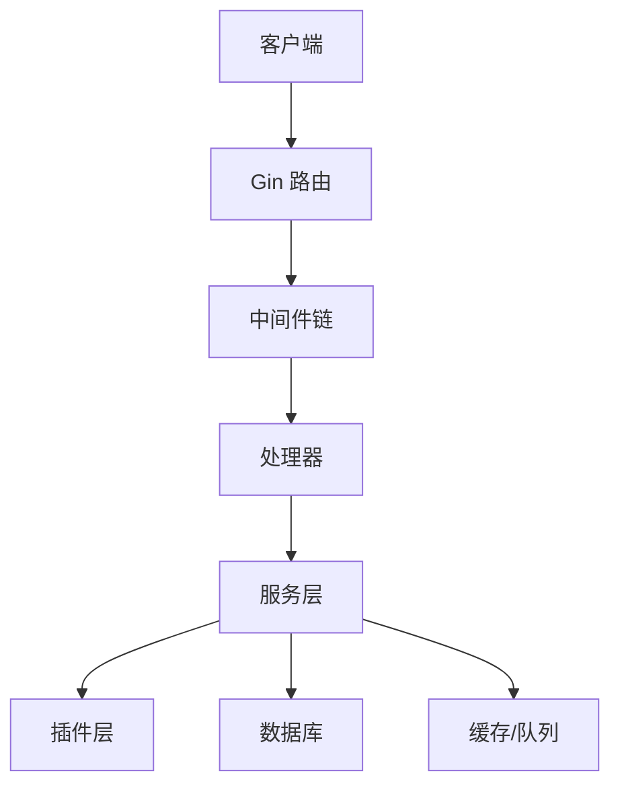
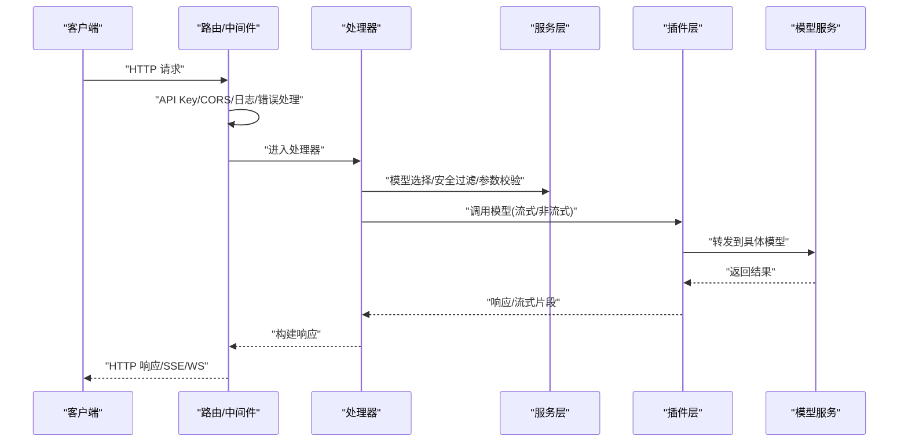
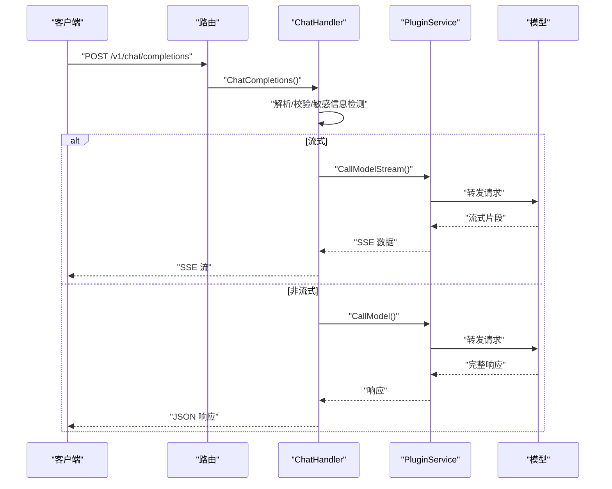
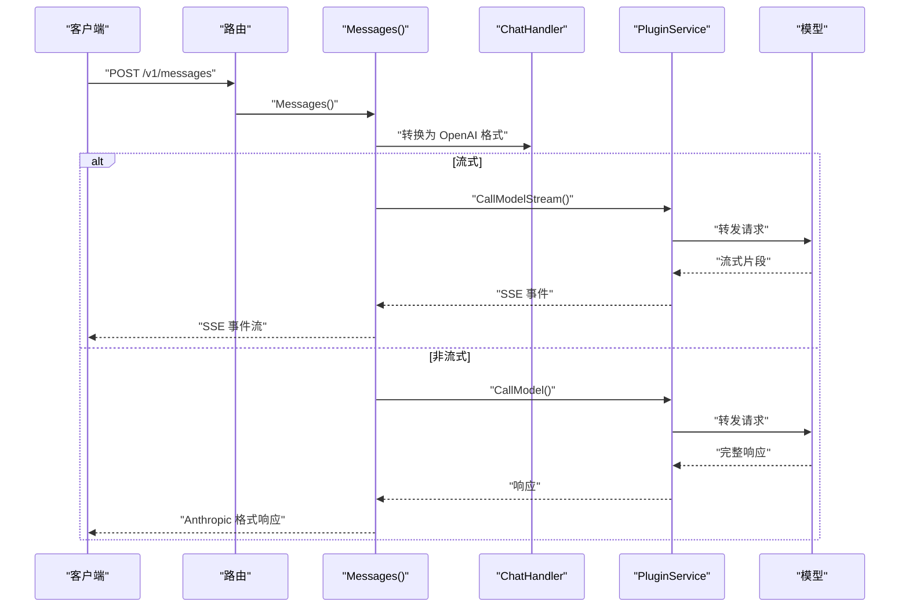
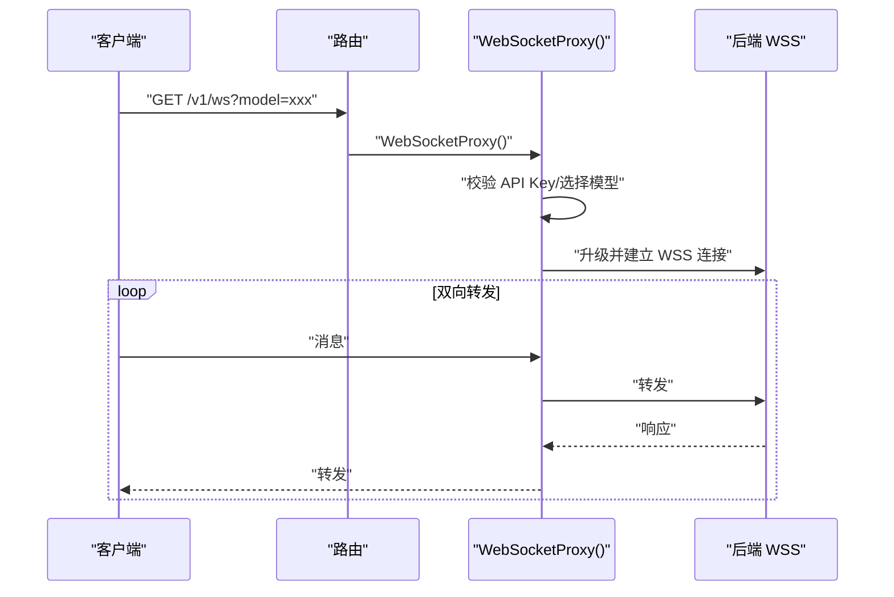
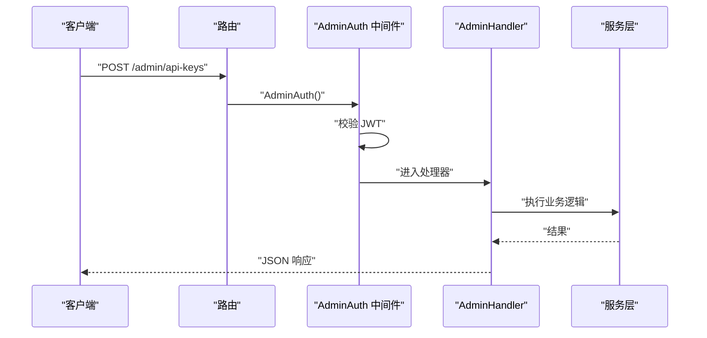
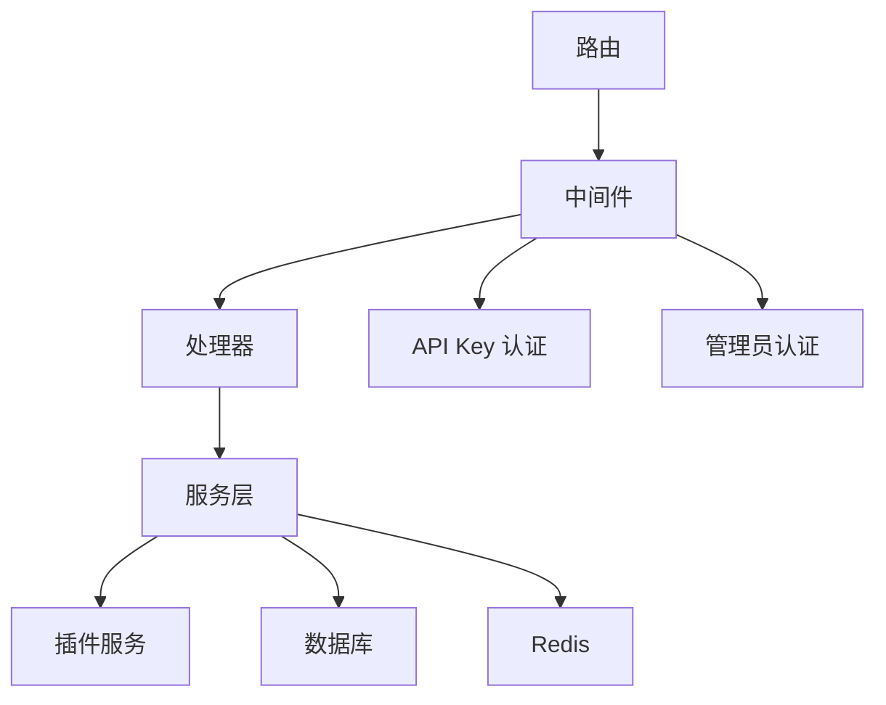

# API 接口文档

<cite>
**本文档引用的文件**
- [routes.go](file://internal/api/routes.go)
- [chat_handler.go](file://internal/api/handlers/chat_handler.go)
- [messages_handler.go](file://internal/api/handlers/messages_handler.go)
- [websocket_handler.go](file://internal/api/handlers/websocket_handler.go)
- [admin_handler.go](file://internal/api/handlers/admin_handler.go)
- [models.go](file://internal/models/models.go)
- [auth.go](file://internal/api/middleware/auth.go)
- [admin_auth.go](file://internal/api/middleware/admin_auth.go)
- [common.go](file://internal/api/handlers/common.go)
- [main.go](file://cmd/main.go)
- [config.postgres.yaml](file://configs/config.postgres.yaml)
- [qwen3-chat.yaml](file://configs/models/qwen3-chat.yaml)
</cite>

## 目录
1. [简介](#简介)
2. [项目结构](#项目结构)
3. [核心组件](#核心组件)
4. [架构总览](#架构总览)
5. [详细组件分析](#详细组件分析)
6. [依赖关系分析](#依赖关系分析)
7. [性能考虑](#性能考虑)
8. [故障排除指南](#故障排除指南)
9. [结论](#结论)
10. [附录](#附录)

## 简介
Wolink-Core 提供统一的 AI 模型接入网关，支持 OpenAI 兼容的聊天完成接口、Anthropic 兼容的消息接口、流式语音/多模态模型的 WebSocket 代理，以及面向管理员的后台管理接口组。本文档覆盖所有公开的 RESTful API 端点，包括请求/响应模式、认证方式、参数验证规则、错误码说明，并提供客户端实现指南、性能优化建议和最佳实践。

## 项目结构
系统采用分层架构，核心入口在命令行启动器，路由在 API 层集中配置，业务逻辑在处理器中实现，中间件负责认证、CORS、日志等横切关注点。

**图表来源**
- [main.go:19-89](file://cmd/main.go#L19-L89)
- [routes.go:14-129](file://internal/api/routes.go#L14-L129)

**章节来源**
- [main.go:19-89](file://cmd/main.go#L19-L89)
- [routes.go:14-129](file://internal/api/routes.go#L14-L129)

## 核心组件
- 路由与中间件：统一注册所有 API 路由，按顺序应用恢复、请求 ID、Prometheus、日志、CORS 和错误处理中间件；对 OpenAI/Anthropic 路由应用 API Key 认证，对管理员路由应用管理员认证与角色校验。
- 处理器：负责请求解析、参数校验、模型选择、安全过滤、流式/非流式响应、异步记录对话与用量。
- 模型与数据结构：定义 OpenAI/Anthropic/Embedding/Rerank/Audio 等请求/响应结构，以及数据库实体（API Key、部门、模型配置、对话记录、使用日志等）。
- 中间件：API Key 认证（Header 或 Query 参数）、CORS、管理员认证（JWT Bearer）、角色要求。

**章节来源**
- [routes.go:14-129](file://internal/api/routes.go#L14-L129)
- [models.go:10-463](file://internal/models/models.go#L10-L463)
- [auth.go:13-98](file://internal/api/middleware/auth.go#L13-L98)
- [admin_auth.go:14-122](file://internal/api/middleware/admin_auth.go#L14-L122)

## 架构总览
下图展示从客户端到后端插件的典型调用路径，包括认证、模型选择、安全过滤、插件调用与响应返回。

**图表来源**
- [routes.go:46-76](file://internal/api/routes.go#L46-L76)
- [chat_handler.go:34-250](file://internal/api/handlers/chat_handler.go#L34-L250)
- [messages_handler.go:18-135](file://internal/api/handlers/messages_handler.go#L18-L135)

## 详细组件分析

### OpenAI 兼容聊天完成接口
- 端点：POST /v1/chat/completions
- 认证：API Key（Header: Bearer ak-xxx 或 Query: api_key/token）
- 请求体字段：
  - model: 字符串，必填
  - messages: 数组，至少一个元素，每项包含 role 和 content
  - temperature: 浮点数，范围 0-2（可选）
  - max_tokens: 整数，范围 1-128000（可选）
  - stream: 布尔值（可选）
  - user: 字符串（可选）
- 响应：
  - 非流式：标准 OpenAI chat.completion 响应
  - 流式：SSE，逐条发送 choices[].delta.content，最后发送 [DONE]
- 安全与计费：
  - 自动检测并替换敏感信息（手机号、身份证、银行卡号），异步记录对话与用量
  - 使用量通过 AuthService 记录
- 错误码：
  - 400：请求体无效、必填字段缺失、模型不可用
  - 401：未授权
  - 429：超出速率限制
  - 500：内部错误

**图表来源**
- [routes.go:52-53](file://internal/api/routes.go#L52-L53)
- [chat_handler.go:34-250](file://internal/api/handlers/chat_handler.go#L34-L250)

**章节来源**
- [routes.go:52-53](file://internal/api/routes.go#L52-L53)
- [chat_handler.go:34-250](file://internal/api/handlers/chat_handler.go#L34-L250)
- [models.go:200-255](file://internal/models/models.go#L200-L255)

### Anthropic 兼容消息接口
- 端点：POST /v1/messages
- 认证：API Key
- 请求体字段：
  - model: 字符串，必填
  - messages: 数组，至少一个元素，role 为 user/assistant，content 支持字符串或数组
  - system: 字符串或数组（可选）
  - max_tokens: 整数，必填
  - metadata、stop_sequences、stream、temperature、top_p、top_k 等（可选）
- 响应：
  - 非流式：Anthropic 格式响应（包含 id、role、content[].text、usage）
  - 流式：SSE，包含 message_start、content_block_start、content_block_delta、content_block_stop、message_delta、message_stop 等事件
- 内部转换：将 Anthropic 请求转换为 OpenAI 格式，调用相同插件链路

**图表来源**
- [routes.go:55-56](file://internal/api/routes.go#L55-L56)
- [messages_handler.go:18-135](file://internal/api/handlers/messages_handler.go#L18-L135)
- [messages_handler.go:192-335](file://internal/api/handlers/messages_handler.go#L192-L335)

**章节来源**
- [routes.go:55-56](file://internal/api/routes.go#L55-L56)
- [messages_handler.go:18-135](file://internal/api/handlers/messages_handler.go#L18-L135)
- [messages_handler.go:192-335](file://internal/api/handlers/messages_handler.go#L192-L335)
- [models.go:257-297](file://internal/models/models.go#L257-L297)

### WebSocket 代理接口
- 端点：GET /v1/ws
- 认证：API Key（Header 或 Query）
- 查询参数：
  - model: 必填，指定后端模型
- 功能：升级为 WebSocket，将客户端与后端模型服务（如 WSS）双向转发，自动将 HTTP(S) 替换为 WS(S) 并携带 Authorization 头
- 场景：流式语音/多模态模型（如 qwen3-asr、qwen3-tts）

**图表来源**
- [routes.go:75](file://internal/api/routes.go#L75)
- [websocket_handler.go:21-123](file://internal/api/handlers/websocket_handler.go#L21-L123)

**章节来源**
- [routes.go:75](file://internal/api/routes.go#L75)
- [websocket_handler.go:21-123](file://internal/api/handlers/websocket_handler.go#L21-L123)

### 管理员后台接口组
- 认证：JWT Bearer Token（Header: Authorization: Bearer <token>）
- 角色：管理员需具备相应角色，部分操作需 super_admin
- 主要端点：
  - /admin/auth/login：登录（无需认证）
  - /admin/auth/logout：登出（需认证）
  - /admin/profile：获取管理员信息（需认证）
  - /admin/users：仅 super_admin
    - POST：创建管理员
    - GET：列出管理员
    - PUT /:id：更新管理员
    - DELETE /:id：删除管理员
  - /admin/api-keys：API Key 管理（需认证）
    - POST：创建 API Key
    - GET：列出 API Keys
    - PUT /:id：更新 API Key
    - DELETE /:id：删除 API Key
  - /admin/departments：部门管理（需认证）
    - POST：创建部门
    - GET：列出部门
  - /admin/models：模型配置管理（需认证）
    - POST：创建模型配置
    - GET：列出模型配置
    - PUT /:id：更新模型配置
    - DELETE /:id：删除模型配置
  - /admin/usage/stats：使用统计（需认证，department_id 必填）
  - /admin/conversations：对话历史（需认证，department_id 必填，limit 可选 1-1000）
  - /admin/plugins：插件管理（需认证）
    - GET /：列出插件
    - POST /:protocol/reload：重载插件
    - DELETE /:protocol：卸载插件
    - POST /plugins/health-check：健康检查

**图表来源**
- [routes.go:77-126](file://internal/api/routes.go#L77-L126)
- [admin_auth.go:14-122](file://internal/api/middleware/admin_auth.go#L14-L122)
- [admin_handler.go:26-250](file://internal/api/handlers/admin_handler.go#L26-L250)

**章节来源**
- [routes.go:77-126](file://internal/api/routes.go#L77-L126)
- [admin_auth.go:14-122](file://internal/api/middleware/admin_auth.go#L14-L122)
- [admin_handler.go:26-250](file://internal/api/handlers/admin_handler.go#L26-L250)

### 其他 OpenAI 兼容接口
- /v1/embeddings：嵌入接口（POST）
- /v1/rerank：重排序接口（POST）
- /v1/audio/transcriptions：语音转文本（POST，multipart/form-data）
- /v1/audio/speech：文本转语音（POST，流式）
- /v1/models：列出可用模型（GET）

这些接口遵循与聊天完成类似的认证与处理流程，区别在于请求体结构与响应格式。

**章节来源**
- [routes.go:58-71](file://internal/api/routes.go#L58-L71)
- [chat_handler.go:424-671](file://internal/api/handlers/chat_handler.go#L424-L671)
- [models.go:299-387](file://internal/models/models.go#L299-L387)

## 依赖关系分析
- 路由层依赖处理器与中间件；处理器依赖服务层；服务层依赖插件层、数据库与缓存；中间件依赖认证服务与日志。
- 认证链路：API Key 认证（Header 或 Query）+ 速率限制；管理员认证（JWT）+ 角色校验。
- 模型配置：通过模型注册表与映射关系控制 API Key 可用模型集合与路由策略。

**图表来源**
- [routes.go:14-129](file://internal/api/routes.go#L14-L129)
- [auth.go:13-98](file://internal/api/middleware/auth.go#L13-L98)
- [admin_auth.go:14-122](file://internal/api/middleware/admin_auth.go#L14-L122)

**章节来源**
- [routes.go:14-129](file://internal/api/routes.go#L14-L129)
- [auth.go:13-98](file://internal/api/middleware/auth.go#L13-L98)
- [admin_auth.go:14-122](file://internal/api/middleware/admin_auth.go#L14-L122)

## 性能考虑
- 流式响应：优先使用 stream=true 以降低首字节延迟，客户端应正确处理 SSE 事件。
- 速率限制：API Key 认证中间件内置速率限制检查，避免突发流量冲击后端。
- 异步记录：对话与用量通过队列异步写入，减少主路径阻塞。
- 模型选择：根据 API Key 与路由规则选择可用模型，支持随机/轮询/加权策略。
- 缓存与超时：合理设置数据库与 Redis 连接超时、空闲超时，避免资源泄露。

[本节为通用性能建议，不直接分析具体文件]

## 故障排除指南
- 401 未授权：检查 Authorization 头是否为 Bearer ak-xxx，或 Query 是否包含 api_key/token。
- 400 参数错误：检查请求体 JSON 结构与必填字段，参考参数验证规则。
- 429 速率限制：检查 API Key 的日使用量与并发限制，调整调用频率。
- 5xx 内部错误：查看服务日志，确认插件调用是否成功，数据库/缓存连接状态。
- WebSocket 连接失败：确认 model 配置的 base_url 已正确替换为 wss，且后端服务可达。

**章节来源**
- [auth.go:13-98](file://internal/api/middleware/auth.go#L13-L98)
- [websocket_handler.go:21-123](file://internal/api/handlers/websocket_handler.go#L21-L123)
- [common.go:10-32](file://internal/api/handlers/common.go#L10-L32)

## 结论
Wolink-Core 提供了完整的多协议兼容 API 网关能力，涵盖主流大模型接口与管理员后台管理。通过清晰的中间件链与模块化设计，系统在易用性、安全性与可扩展性之间取得平衡。建议在生产环境中结合速率限制、监控告警与日志审计，确保稳定运行。

[本节为总结性内容，不直接分析具体文件]

## 附录

### 认证方式与参数验证规则
- API Key 认证
  - Header: Authorization: Bearer ak-xxx
  - Query: api_key 或 token
  - 速率限制：在中间件中统一检查
- 管理员认证
  - Header: Authorization: Bearer <JWT>
  - 角色要求：通过 RequireRole 中间件限制
- 参数验证
  - 使用结构体 tag 进行必填、范围、枚举等校验
  - 校验失败返回人类可读的错误信息

**章节来源**
- [auth.go:13-98](file://internal/api/middleware/auth.go#L13-L98)
- [admin_auth.go:77-122](file://internal/api/middleware/admin_auth.go#L77-L122)
- [common.go:10-32](file://internal/api/handlers/common.go#L10-L32)
- [models.go:200-255](file://internal/models/models.go#L200-L255)

### 配置与部署要点
- 服务器端口与模式：server.port、server.mode
- 数据库：支持 SQLite、MySQL、PostgreSQL
- Redis：用于缓存与队列
- 日志级别：log.level
- 安全：jwt_secret、敏感信息正则与替换模板
- 模型配置路径：models.config_path

**章节来源**
- [config.postgres.yaml:1-35](file://configs/config.postgres.yaml#L1-L35)
- [qwen3-chat.yaml:1-12](file://configs/models/qwen3-chat.yaml#L1-L12)

### 客户端实现指南
- 基础请求头：Authorization: Bearer ak-xxx
- 流式处理：SSE/WS 客户端需正确解析事件与帧
- 错误处理：区分 400/401/429/5xx 并进行重试或降级
- 模型选择：通过 /v1/models 获取可用模型列表
- 管理端：使用管理员 JWT 访问 /admin/* 接口

[本节为通用实现建议，不直接分析具体文件]