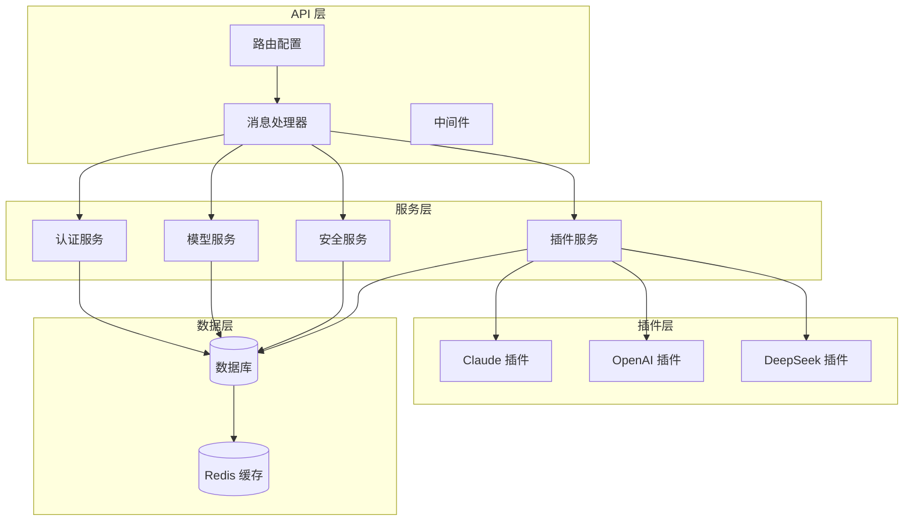
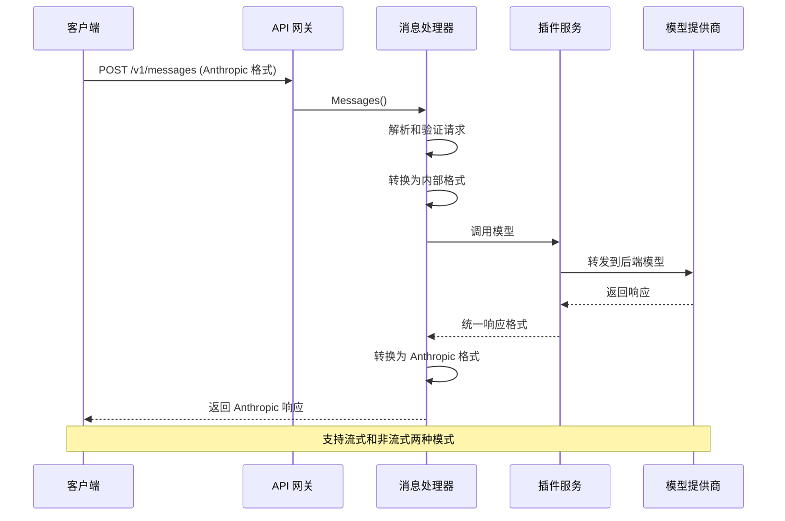
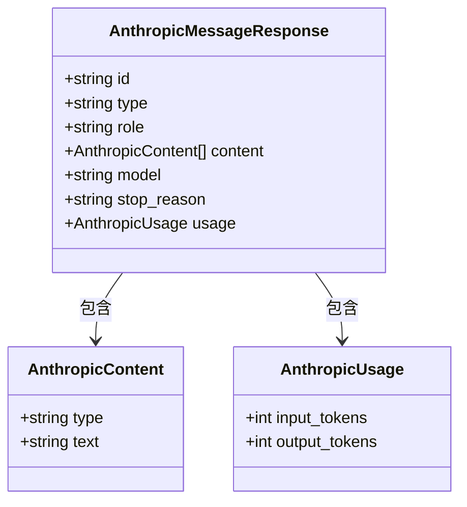
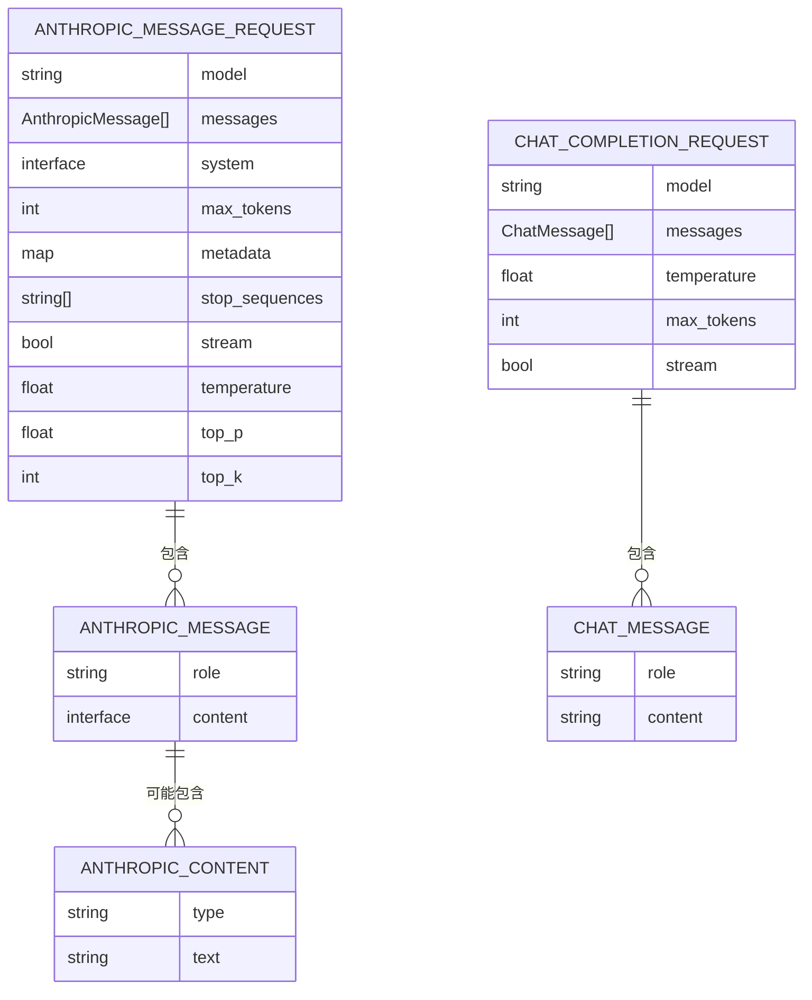
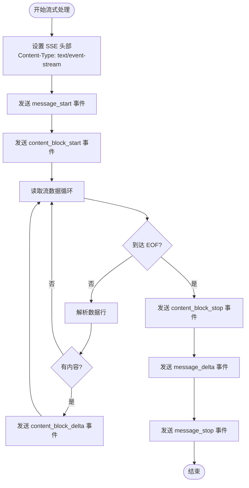
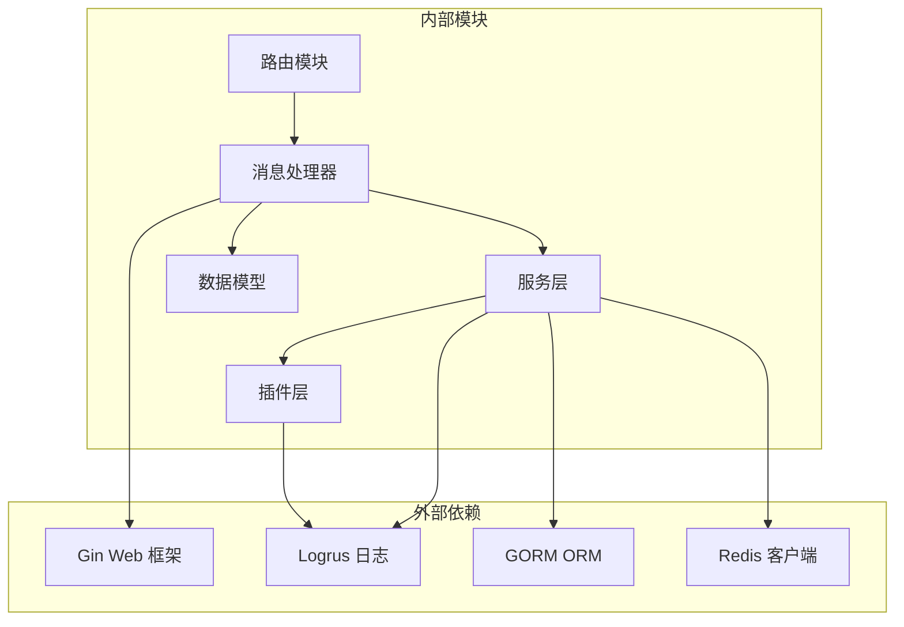

# Anthropic 兼容接口

<cite>
**本文引用的文件**
- [messages_handler.go](file://internal/api/handlers/messages_handler.go)
- [routes.go](file://internal/api/routes.go)
- [plugin_claude.go](file://internal/plugins/plugin_claude.go)
- [models.go](file://internal/models/models.go)
- [claude-3.yaml](file://configs/templates/claude-3.yaml)
- [auth.go](file://internal/api/middleware/auth.go)
- [stream_wrapper.go](file://internal/plugins/stream_wrapper.go)
- [main.go](file://cmd/main.go)
- [config.postgres.yaml](file://configs/config.postgres.yaml)
</cite>

## 目录
1. [简介](#简介)
2. [项目结构](#项目结构)
3. [核心组件](#核心组件)
4. [架构概览](#架构概览)
5. [详细组件分析](#详细组件分析)
6. [依赖关系分析](#依赖关系分析)
7. [性能考虑](#性能考虑)
8. [故障排除指南](#故障排除指南)
9. [结论](#结论)

## 简介

Wolink-Core 是一个支持多模型提供商的 AI 网关平台，特别实现了与 Anthropic API 的兼容性。本文档详细说明了 `/v1/messages` 消息接口的完整规范，包括请求参数、响应格式、流式响应处理、错误码说明以及认证要求。

该接口允许客户端使用 Anthropic 的原生格式与 Wolink-Core 进行交互，同时保持与标准 Anthropic API 的高度兼容性。系统通过内部的模型路由机制，能够智能地将请求转发到相应的后端模型提供商。

## 项目结构

Wolink-Core 采用模块化设计，主要分为以下几个核心部分：

**图表来源**
- [routes.go:14-72](file://internal/api/routes.go#L14-L72)
- [messages_handler.go:18-135](file://internal/api/handlers/messages_handler.go#L18-L135)

**章节来源**
- [routes.go:14-72](file://internal/api/routes.go#L14-L72)
- [main.go:19-89](file://cmd/main.go#L19-L89)

## 核心组件

### 认证中间件

系统使用基于 API Key 的认证机制，支持多种认证方式：

- **Authorization 头**: `Bearer ak-xxxxxxxx`
- **查询参数**: `api_key=ak-xxxxxxxx` 或 `token=ak-xxxxxxxx`
- **WebSocket 场景**: 支持通过查询参数传递 API Key

认证流程包括：
1. 验证 API Key 格式和有效性
2. 检查速率限制
3. 存储 API Key 信息到请求上下文

**章节来源**
- [auth.go:13-67](file://internal/api/middleware/auth.go#L13-L67)

### 消息处理器

消息处理器负责处理 Anthropic 格式的请求，主要功能包括：

- **请求解析**: 将 Anthropic 格式转换为内部统一格式
- **系统提示处理**: 支持字符串和数组两种系统提示格式
- **消息内容提取**: 从复杂的内容结构中提取纯文本内容
- **模型路由**: 根据 API Key 和模型名称选择合适的后端模型
- **安全过滤**: 检测和替换敏感信息

**章节来源**
- [messages_handler.go:18-135](file://internal/api/handlers/messages_handler.go#L18-L135)

### 插件系统

系统支持多种模型提供商的插件：

- **Claude 插件**: 直接转发到 Anthropic API
- **OpenAI 插件**: 兼容 OpenAI API 格式
- **DeepSeek 插件**: 支持 DeepSeek 模型

每个插件都实现了统一的接口，包括非流式调用和流式调用方法。

**章节来源**
- [plugin_claude.go:17-99](file://internal/plugins/plugin_claude.go#L17-L99)

## 架构概览

Wolink-Core 的整体架构采用分层设计，确保了良好的可扩展性和维护性：

**图表来源**
- [messages_handler.go:18-135](file://internal/api/handlers/messages_handler.go#L18-L135)
- [plugin_claude.go:41-99](file://internal/plugins/plugin_claude.go#L41-L99)

## 详细组件分析

### /v1/messages 接口规范

#### 请求参数

| 参数名 | 类型 | 必需 | 描述 | 默认值 |
|--------|------|------|------|--------|
| model | string | 是 | 模型名称 | - |
| messages | array | 是 | 消息数组，至少包含一条消息 | - |
| system | string/array | 否 | 系统提示，可以是字符串或数组 | - |
| max_tokens | integer | 是 | 最大生成令牌数 | - |
| metadata | object | 否 | 元数据对象 | - |
| stop_sequences | array | 否 | 停止序列数组 | - |
| stream | boolean | 否 | 是否启用流式响应 | false |
| temperature | number | 否 | 采样温度 (0.0-2.0) | 1.0 |
| top_p | number | 否 | Top-P 采样 (0.0-1.0) | 1.0 |
| top_k | integer | 否 | Top-K 采样 | 0 |

#### 消息格式

消息对象包含以下字段：

| 字段名 | 类型 | 必需 | 描述 |
|--------|------|------|------|
| role | string | 是 | 角色，支持 "user" 或 "assistant" |
| content | string/array | 是 | 内容，可以是字符串或数组 |

当 content 为数组时，系统会遍历所有元素并提取文本内容。

**章节来源**
- [models.go:259-276](file://internal/models/models.go#L259-L276)

#### 响应格式

##### 非流式响应

**图表来源**
- [models.go:278-297](file://internal/models/models.go#L278-L297)

##### 流式响应事件

系统支持完整的 SSE 事件流，包括：

1. **message_start**: 开始消息传输
2. **content_block_start**: 开始内容块传输  
3. **content_block_delta**: 内容增量更新
4. **content_block_stop**: 结束内容块传输
5. **message_delta**: 消息增量更新
6. **message_stop**: 结束消息传输

**章节来源**
- [messages_handler.go:192-334](file://internal/api/handlers/messages_handler.go#L192-L334)

### 数据模型

系统使用统一的数据模型来处理不同格式的请求和响应：

**图表来源**
- [models.go:259-276](file://internal/models/models.go#L259-L276)
- [models.go:200-214](file://internal/models/models.go#L200-L214)

**章节来源**
- [models.go:259-297](file://internal/models/models.go#L259-L297)

### 流式响应处理

系统实现了完整的流式响应处理机制：

**图表来源**
- [messages_handler.go:192-334](file://internal/api/handlers/messages_handler.go#L192-L334)

**章节来源**
- [messages_handler.go:192-334](file://internal/api/handlers/messages_handler.go#L192-L334)

### 错误处理

系统提供了完善的错误处理机制：

| HTTP 状态码 | 错误类型 | 描述 |
|-------------|----------|------|
| 400 | Bad Request | 请求参数无效或缺失 |
| 401 | Unauthorized | 未提供有效的 API Key |
| 403 | Forbidden | API Key 无权限访问指定模型 |
| 404 | Not Found | 模型不存在 |
| 429 | Too Many Requests | 超出速率限制 |
| 500 | Internal Server Error | 服务器内部错误 |
| 503 | Service Unavailable | 服务不可用 |

**章节来源**
- [messages_handler.go:22-98](file://internal/api/handlers/messages_handler.go#L22-L98)
- [auth.go:35-60](file://internal/api/middleware/auth.go#L35-L60)

## 依赖关系分析

### 组件依赖图

**图表来源**
- [messages_handler.go:1-16](file://internal/api/handlers/messages_handler.go#L1-L16)
- [routes.go:3-12](file://internal/api/routes.go#L3-L12)

### 数据流分析

系统的关键数据流包括：

1. **请求处理流程**: 客户端请求 → 路由 → 中间件 → 处理器 → 插件 → 响应
2. **模型路由流程**: API Key → 模型配置 → 路由策略 → 选择模型
3. **安全处理流程**: 敏感信息检测 → 内容替换 → 记录日志

**章节来源**
- [messages_handler.go:88-122](file://internal/api/handlers/messages_handler.go#L88-L122)

## 性能考虑

### 流式响应优化

系统在流式响应方面采用了多项优化措施：

- **零拷贝缓冲**: 使用 `bufio.Reader` 减少内存分配
- **事件驱动**: 基于 SSE 的事件驱动架构
- **并发处理**: 支持多个并发流式请求
- **资源管理**: 正确的流关闭和资源清理

### 缓存策略

- **模型配置缓存**: 使用 Redis 缓存模型配置信息
- **API Key 缓存**: 缓存 API Key 验证结果
- **响应缓存**: 支持前缀缓存等高级特性

### 监控指标

系统集成了 Prometheus 监控，提供以下关键指标：

- 请求延迟分布
- 错误率统计
- 模型使用量统计
- API Key 限额监控

## 故障排除指南

### 常见问题诊断

#### 认证失败

**症状**: 返回 401 状态码
**可能原因**:
- API Key 格式不正确
- API Key 已过期或被禁用
- 速率限制触发

**解决方案**:
1. 验证 API Key 格式是否为 `ak-xxxxxxxx`
2. 检查 API Key 状态
3. 查看速率限制配置

#### 模型不可用

**症状**: 返回 400 状态码，提示模型不可用
**可能原因**:
- API Key 未授权访问该模型
- 模型配置文件缺失
- 模型名称拼写错误

**解决方案**:
1. 确认 API Key 与模型的绑定关系
2. 检查模型配置文件路径
3. 验证模型名称一致性

#### 流式响应问题

**症状**: 流式响应中断或格式错误
**可能原因**:
- 网络连接不稳定
- 插件服务异常
- 客户端 SSE 处理器问题

**解决方案**:
1. 检查网络连接状态
2. 验证插件服务健康状况
3. 更新客户端 SSE 处理逻辑

### 调试建议

1. **启用详细日志**: 设置日志级别为 debug
2. **监控 API 调用**: 使用 Prometheus 指标监控
3. **测试连接**: 使用 curl 验证基本连接
4. **检查配置**: 验证所有配置文件完整性

**章节来源**
- [auth.go:13-67](file://internal/api/middleware/auth.go#L13-L67)
- [messages_handler.go:22-98](file://internal/api/handlers/messages_handler.go#L22-L98)

## 结论

Wolink-Core 的 Anthropic 兼容接口提供了完整的 API 兼容性和强大的功能特性。通过模块化的设计和完善的错误处理机制，系统能够稳定地支持各种使用场景。

### 主要优势

1. **高度兼容**: 完全支持 Anthropic API 的请求格式和响应格式
2. **灵活路由**: 支持多种路由策略和负载均衡
3. **安全可靠**: 内置敏感信息检测和替换机制
4. **性能优化**: 流式响应和缓存策略提升用户体验
5. **易于扩展**: 插件架构支持新增模型提供商

### 未来改进方向

1. **增强监控**: 添加更详细的性能指标和告警机制
2. **优化缓存**: 实现更智能的缓存策略
3. **扩展功能**: 支持更多模型提供商和功能特性
4. **文档完善**: 提供更丰富的示例和最佳实践

通过持续的优化和改进，Wolink-Core 将成为企业级 AI 应用的理想选择，为开发者提供简单易用、功能强大的 AI 网关服务。