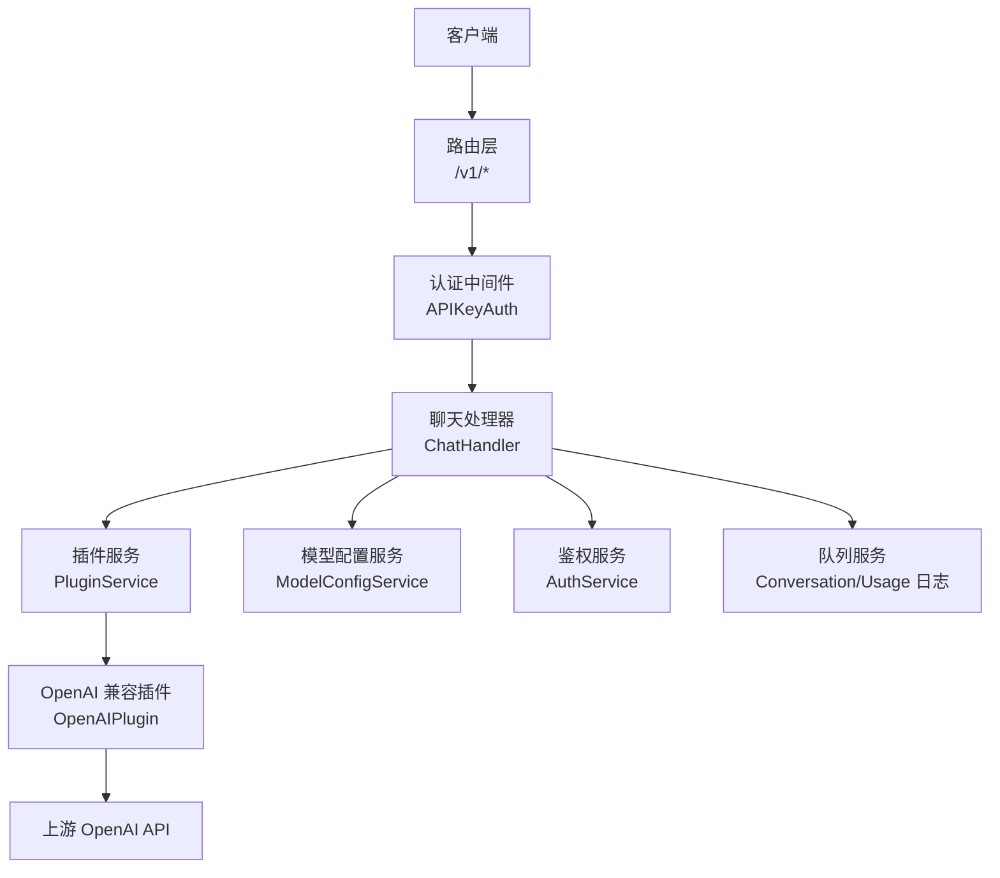
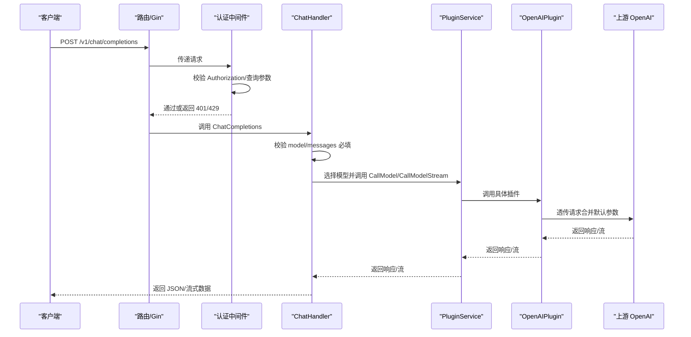
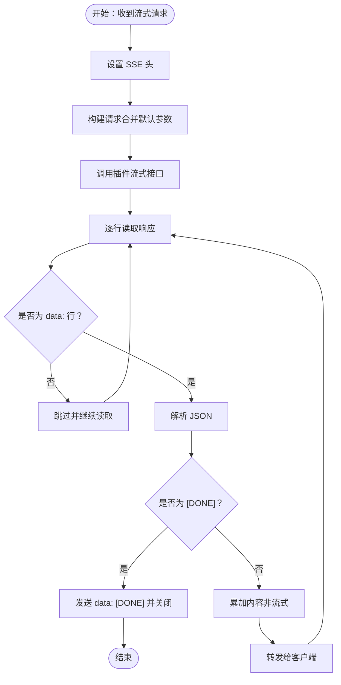
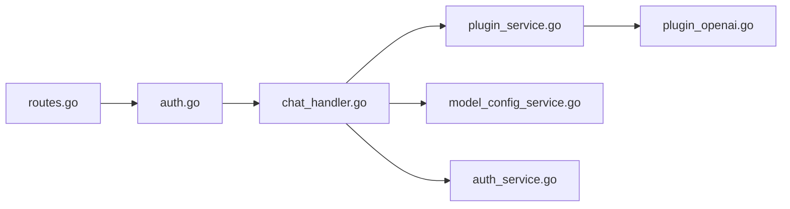

# OpenAI 兼容接口

<cite>
**本文引用的文件**
- [chat_handler.go](file://internal/api/handlers/chat_handler.go)
- [routes.go](file://internal/api/routes.go)
- [models.go](file://internal/models/models.go)
- [auth.go](file://internal/api/middleware/auth.go)
- [plugin_openai.go](file://internal/plugins/plugin_openai.go)
- [stream_wrapper.go](file://internal/plugins/stream_wrapper.go)
- [plugin_service.go](file://internal/services/plugin_service.go)
- [auth_service.go](file://internal/services/auth_service.go)
- [model_config_service.go](file://internal/services/model_config_service.go)
- [qwen3-chat.yaml](file://configs/models/qwen3-chat.yaml)
- [gpt-4.yaml](file://configs/templates/gpt-4.yaml)
- [config.yaml](file://configs/config.yaml)
- [chat_handler_test.go](file://internal/api/handlers/chat_handler_test.go)
</cite>

## 目录
1. [简介](#简介)
2. [项目结构](#项目结构)
3. [核心组件](#核心组件)
4. [架构总览](#架构总览)
5. [详细组件分析](#详细组件分析)
6. [依赖关系分析](#依赖关系分析)
7. [性能考量](#性能考量)
8. [故障排查指南](#故障排查指南)
9. [结论](#结论)
10. [附录](#附录)

## 简介
本文件面向开发者与运维人员，系统化梳理 Wolink-Core 的 OpenAI 兼容接口，重点覆盖 /v1/chat/completions 聊天完成接口的完整规范，包括：
- 请求参数与约束（model、messages、temperature、max_tokens、stream 等）
- 响应格式与字段（choices、usage、finish_reason 等）
- 流式响应处理机制（SSE）与错误处理
- 认证与速率限制策略
- 与标准 OpenAI API 的兼容性与差异点
- 实际使用示例与最佳实践

## 项目结构
Wolink-Core 采用分层架构：路由层（Gin）负责请求接入与中间件；处理器层（Handlers）封装业务流程；服务层（Services）提供鉴权、模型配置、插件调度、队列与用量统计等能力；插件层（Plugins）对接外部模型（如 OpenAI 兼容 API）。

图表来源
- [routes.go:46-72](file://internal/api/routes.go#L46-L72)
- [auth.go:13-68](file://internal/api/middleware/auth.go#L13-L68)
- [chat_handler.go:34-113](file://internal/api/handlers/chat_handler.go#L34-L113)
- [plugin_service.go:198-229](file://internal/services/plugin_service.go#L198-L229)
- [plugin_openai.go:42-121](file://internal/plugins/plugin_openai.go#L42-L121)

章节来源
- [routes.go:14-129](file://internal/api/routes.go#L14-L129)
- [chat_handler.go:1-716](file://internal/api/handlers/chat_handler.go#L1-L716)

## 核心组件
- 路由与中间件
  - /v1/chat/completions 由 ChatHandler.ChatCompletions 处理
  - 认证中间件 APIKeyAuth 支持 Authorization: Bearer 或查询参数 api_key/token
  - 速率限制在中间件内检查并发与日/月限额
- 处理器
  - ChatHandler.ChatCompletions：解析请求、校验必填项、选择可用模型、敏感信息检测与替换、分流流式/非流式处理
  - 流式：handleStreamRequest 设置 SSE 头并逐行转发上游流式响应
  - 非流式：handleNonStreamRequest 调用插件获取完整响应并记录用量
- 插件与服务
  - PluginService：按协议路由到具体插件（如 OpenAIPlugin）
  - OpenAIPlugin：将请求体中的 model/messages/default 参数合并后透传至上游 OpenAI
  - ModelConfigService：从配置文件加载模型并缓存，结合 API Key 映射返回可用模型
  - AuthService：验证 API Key、检查并发/日/月限额、异步记录用量

章节来源
- [routes.go:46-72](file://internal/api/routes.go#L46-L72)
- [auth.go:13-68](file://internal/api/middleware/auth.go#L13-L68)
- [chat_handler.go:34-250](file://internal/api/handlers/chat_completions.go#L34-L250)
- [plugin_service.go:198-229](file://internal/services/plugin_service.go#L198-L229)
- [plugin_openai.go:42-121](file://internal/plugins/plugin_openai.go#L42-L121)
- [model_config_service.go:114-167](file://internal/services/model_config_service.go#L114-L167)
- [auth_service.go:87-149](file://internal/services/auth_service.go#L87-L149)

## 架构总览
以下序列图展示 /v1/chat/completions 的端到端调用链路，涵盖认证、模型选择、敏感信息处理、插件调用与响应回传。

图表来源
- [routes.go:46-72](file://internal/api/routes.go#L46-L72)
- [auth.go:13-68](file://internal/api/middleware/auth.go#L13-L68)
- [chat_handler.go:34-113](file://internal/api/handlers/chat_handler.go#L34-L113)
- [plugin_service.go:198-229](file://internal/services/plugin_service.go#L198-L229)
- [plugin_openai.go:42-121](file://internal/plugins/plugin_openai.go#L42-L121)

## 详细组件分析

### /v1/chat/completions 接口规范
- 方法与路径
  - POST /v1/chat/completions
- 认证
  - 支持两种方式：
    - Authorization: Bearer <api_key>
    - 查询参数：api_key=<api_key> 或 token=<api_key>
  - 未提供或无效的 API Key 返回 401
- 速率限制
  - 并发限制：concurrent_limit
  - 日限额：daily_limit
  - 月限额：monthly_limit
  - 超限时返回 429
- 请求体字段
  - model: 字符串，必填
  - messages: 数组，至少一条，每条包含 role 和 content
  - temperature: 浮点数，范围 0~2（若未提供且配置中有默认值则应用）
  - max_tokens: 整数，范围 1~128000（若未提供且配置中有默认值则应用）
  - stream: 布尔值，默认 false
  - 其他字段：按 OpenAI 兼容语义透传（如 top_p 等）
- 响应体字段（非流式）
  - id: 字符串
  - object: 固定为 "chat.completion"
  - created: 时间戳
  - model: 使用的模型名称
  - choices: 数组，每项包含 index、message（含 role/content）、finish_reason
  - usage: prompt_tokens、completion_tokens、total_tokens
- 响应体字段（流式）
  - 采用 Server-Sent Events（SSE），逐行发送 data: JSON
  - 每行 data: 包含部分响应（choices[].delta.content 累加）
  - 结束时发送 data: [DONE]
- 错误处理
  - 400：请求体解析失败、缺少必填字段、参数越界
  - 401：未授权
  - 429：并发或配额超限
  - 500：插件调用失败或内部错误

章节来源
- [routes.go:46-72](file://internal/api/routes.go#L46-L72)
- [auth.go:13-68](file://internal/api/middleware/auth.go#L13-L68)
- [chat_handler.go:34-113](file://internal/api/handlers/chat_handler.go#L34-L113)
- [models.go:200-255](file://internal/models/models.go#L200-L255)
- [plugin_openai.go:42-121](file://internal/plugins/plugin_openai.go#L42-L121)

### 流式响应处理机制
- SSE 头设置
  - Content-Type: text/event-stream
  - Cache-Control: no-cache
  - Connection: keep-alive
  - Access-Control-Allow-Origin: *
- 行解析与转发
  - 逐行读取上游响应，跳过空行与非 data: 行
  - 将 data: 行原样转发给客户端，直到遇到 [DONE]
- 内容聚合
  - 非流式场景：将 choices[].delta.content 累积为完整响应
  - 流式场景：实时转发，不累积
- 错误处理
  - 插件调用失败时，写入 SSE 错误事件并返回

图表来源
- [chat_handler.go:115-206](file://internal/api/handlers/chat_handler.go#L115-L206)
- [stream_wrapper.go:27-86](file://internal/plugins/stream_wrapper.go#L27-L86)

章节来源
- [chat_handler.go:115-206](file://internal/api/handlers/chat_handler.go#L115-L206)
- [stream_wrapper.go:1-95](file://internal/plugins/stream_wrapper.go#L1-L95)

### 模型选择与参数合并
- 模型选择
  - 根据 API Key 与请求 model 名称，查询可用模型列表
  - 通过路由规则（如 random）选择具体模型配置
- 参数合并策略
  - 若请求体未提供 temperature/max_tokens/top_p，则使用模型连接配置中的默认值
  - model/messages 字段由请求体覆盖
- OpenAI 兼容透传
  - 除上述字段外，其余请求参数按 OpenAI 兼容语义透传至上游

章节来源
- [chat_handler.go:66-84](file://internal/api/handlers/chat_handler.go#L66-L84)
- [plugin_openai.go:42-71](file://internal/plugins/plugin_openai.go#L42-L71)
- [plugin_openai.go:123-155](file://internal/plugins/plugin_openai.go#L123-L155)

### 敏感信息检测与替换
- 处理器会对 messages 中的 content 进行敏感信息检测与替换，并记录是否包含敏感信息及类型
- 替换后的消息列表用于后续调用

章节来源
- [chat_handler.go:85-100](file://internal/api/handlers/chat_handler.go#L85-L100)

### 用量统计与异步记录
- 非流式：根据响应 usage.total_tokens 记录用量
- 流式：基于累计 token 数（简化计算）记录用量
- 异步记录：通过队列服务将对话与用量日志异步落库，保证主流程低延迟

章节来源
- [chat_handler.go:208-250](file://internal/api/handlers/chat_handler.go#L208-L250)
- [chat_handler.go:254-384](file://internal/api/handlers/chat_handler.go#L254-L384)
- [auth_service.go:126-149](file://internal/services/auth_service.go#L126-L149)

## 依赖关系分析
- 路由层依赖中间件进行认证与限流
- 处理器依赖服务层完成模型选择、鉴权与用量统计
- 插件服务统一调度不同协议的插件（如 OpenAI）
- OpenAI 插件负责将请求体转换为上游 API 可识别的格式并透传

图表来源
- [routes.go:46-72](file://internal/api/routes.go#L46-L72)
- [auth.go:13-68](file://internal/api/middleware/auth.go#L13-L68)
- [chat_handler.go:34-113](file://internal/api/handlers/chat_handler.go#L34-L113)
- [plugin_service.go:198-229](file://internal/services/plugin_service.go#L198-L229)
- [plugin_openai.go:42-121](file://internal/plugins/plugin_openai.go#L42-L121)
- [model_config_service.go:114-167](file://internal/services/model_config_service.go#L114-L167)
- [auth_service.go:87-149](file://internal/services/auth_service.go#L87-L149)

## 性能考量
- 流式传输
  - SSE 逐行转发，减少内存占用，提升首字节速度
  - StreamWrapper 优化了行读取与缓冲，避免阻塞
- 缓存策略
  - API Key 与模型映射缓存（Redis），降低数据库压力
- 异步日志
  - 对话与用量日志通过队列异步写入，避免阻塞主请求
- 并发控制
  - 通过 Redis 计数器严格控制并发上限，防止雪崩

章节来源
- [stream_wrapper.go:27-86](file://internal/plugins/stream_wrapper.go#L27-L86)
- [auth_service.go:87-149](file://internal/services/auth_service.go#L87-L149)
- [model_config_service.go:114-167](file://internal/services/model_config_service.go#L114-L167)
- [chat_handler.go:385-422](file://internal/api/handlers/chat_handler.go#L385-L422)

## 故障排查指南
- 401 未授权
  - 检查 Authorization 头或查询参数是否正确
  - 确认 API Key 是否有效且处于激活状态
- 429 速率限制
  - 检查并发计数器是否超过 concurrent_limit
  - 检查当日/当月计数是否达到阈值
- 400 参数错误
  - model/messages 必填字段缺失
  - temperature 超出 0~2 范围
  - max_tokens 小于 1 或大于 128000
- 流式响应异常
  - 确认上游返回是否为标准 SSE（data: 行）
  - 检查网络代理是否正确转发 SSE
- 插件调用失败
  - 查看 OpenAI 插件日志与上游返回状态码
  - 确认 base_url、api_key、model 是否正确

章节来源
- [auth.go:35-60](file://internal/api/middleware/auth.go#L35-L60)
- [chat_handler.go:46-64](file://internal/api/handlers/chat_handler.go#L46-L64)
- [models.go:200-209](file://internal/models/models.go#L200-L209)
- [plugin_openai.go:185-190](file://internal/plugins/plugin_openai.go#L185-L190)

## 结论
Wolink-Core 的 /v1/chat/completions 接口在保持 OpenAI 兼容语义的同时，提供了完善的认证、限流、敏感信息处理、流式传输与异步日志能力。通过插件化设计，可灵活对接多种上游模型服务；通过缓存与异步队列，兼顾了性能与可靠性。

## 附录

### 请求/响应示例（路径参考）
- 非流式请求
  - 请求体字段：model、messages、temperature、max_tokens
  - 响应体字段：id、object、created、model、choices、usage
  - 参考路径：[chat_handler_test.go:179-184](file://internal/api/handlers/chat_handler_test.go#L179-L184)，[models.go:200-235](file://internal/models/models.go#L200-L235)
- 流式请求
  - 请求体字段：model、messages、stream=true
  - 响应行为：data: JSON 行，最后 data: [DONE]
  - 参考路径：[chat_handler.go:115-206](file://internal/api/handlers/chat_handler.go#L115-L206)，[stream_wrapper.go:27-86](file://internal/plugins/stream_wrapper.go#L27-L86)
- 错误响应
  - 400/401/429/500 均返回 JSON 错误对象
  - 参考路径：[auth.go:35-60](file://internal/api/middleware/auth.go#L35-L60)，[chat_handler.go:46-57](file://internal/api/handlers/chat_handler.go#L46-L57)

### 与标准 OpenAI API 的兼容性与差异
- 兼容点
  - 路径与方法：/v1/chat/completions
  - 请求字段：model、messages、temperature、max_tokens、stream 等
  - 响应字段：choices、usage、finish_reason 等
- 差异点
  - 默认参数合并：若请求未提供 temperature/max_tokens/top_p，将使用模型连接配置中的默认值
  - 敏感信息处理：请求 messages 中的敏感内容会被检测与替换
  - SSE 头与跨域：自动设置 SSE 头与允许跨域
  - 用量统计：通过 AuthService 异步记录，不直接暴露上游 usage 细节

章节来源
- [plugin_openai.go:42-71](file://internal/plugins/plugin_openai.go#L42-L71)
- [plugin_openai.go:123-155](file://internal/plugins/plugin_openai.go#L123-L155)
- [chat_handler.go:85-100](file://internal/api/handlers/chat_handler.go#L85-L100)
- [routes.go:121-126](file://internal/api/routes.go#L121-L126)

### 配置参考
- 模型配置文件示例
  - qwen3-chat.yaml：定义 base_url、api_key、model 等
  - gpt-4.yaml：包含默认参数与能力描述
  - 参考路径：[qwen3-chat.yaml:8-11](file://configs/models/qwen3-chat.yaml#L8-L11)，[gpt-4.yaml:62-75](file://configs/templates/gpt-4.yaml#L62-L75)
- 通用配置
  - 安全敏感模式与替换规则
  - 参考路径：[config.yaml:18-27](file://configs/config.yaml#L18-L27)