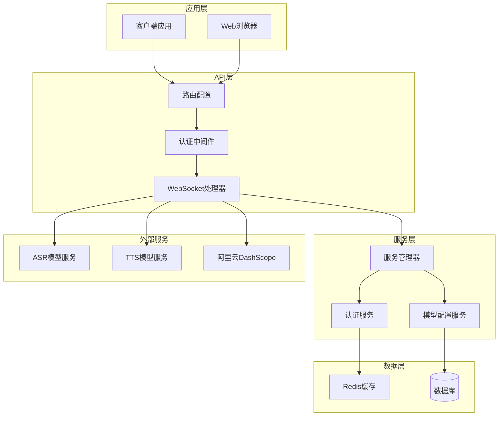
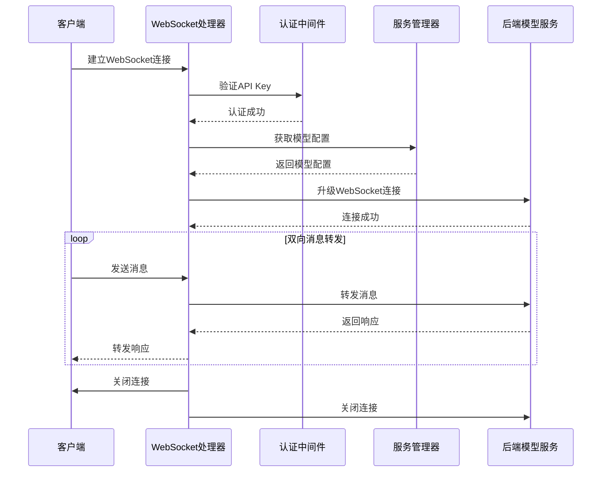
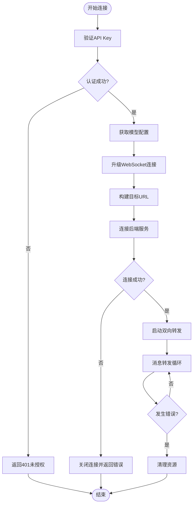
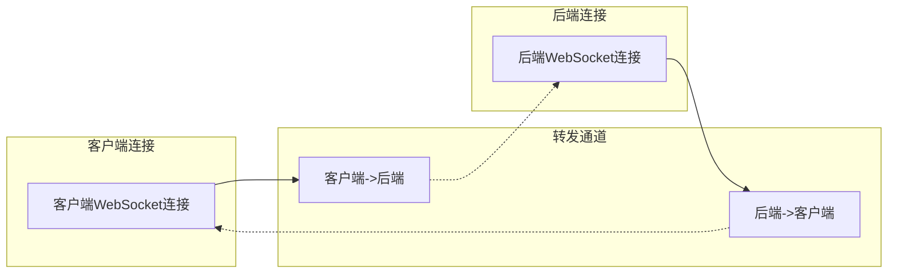
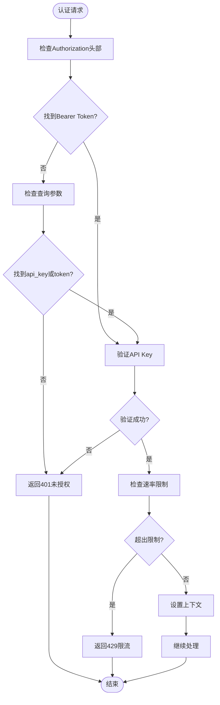
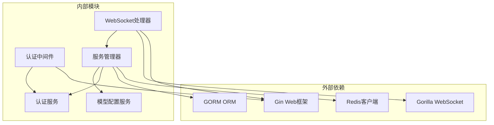

# WebSocket 代理接口

<cite>
**本文档引用的文件**
- [websocket_handler.go](file://internal/api/handlers/websocket_handler.go)
- [routes.go](file://internal/api/routes.go)
- [auth.go](file://internal/api/middleware/auth.go)
- [auth_service.go](file://internal/services/auth_service.go)
- [service_manager.go](file://internal/services/service_manager.go)
- [models.go](file://internal/models/models.go)
- [qwen3-asr.yaml](file://configs/models/qwen3-asr.yaml)
- [qwen-tts.yaml](file://configs/models/qwen-tts.yaml)
- [main.go](file://cmd/main.go)
</cite>

## 目录
1. [简介](#简介)
2. [项目结构](#项目结构)
3. [核心组件](#核心组件)
4. [架构概览](#架构概览)
5. [详细组件分析](#详细组件分析)
6. [依赖关系分析](#依赖关系分析)
7. [性能考虑](#性能考虑)
8. [故障排除指南](#故障排除指南)
9. [结论](#结论)

## 简介

Wolink-Core 的 WebSocket 代理接口是一个基于 Go 语言开发的高性能 WebSocket 代理服务，专门用于处理流式语音处理和多模态模型的实时通信。该接口提供了完整的 WebSocket 升级、认证、消息转发和错误处理机制，支持 ASR（语音转文本）和 TTS（文本转语音）等应用场景。

该接口的核心特性包括：
- 完整的 WebSocket 握手和升级流程
- 基于 API Key 的安全认证机制
- 双向消息转发和实时数据传输
- 流式语音处理支持
- 多模态模型集成
- 优雅的错误处理和连接管理

## 项目结构

Wolink-Core 采用分层架构设计，WebSocket 代理接口位于 API 层的处理器模块中，通过中间件进行认证和授权。



**图表来源**
- [routes.go:14-129](file://internal/api/routes.go#L14-L129)
- [websocket_handler.go:21-122](file://internal/api/handlers/websocket_handler.go#L21-L122)

**章节来源**
- [routes.go:14-129](file://internal/api/routes.go#L14-L129)
- [websocket_handler.go:1-122](file://internal/api/handlers/websocket_handler.go#L1-L122)

## 核心组件

WebSocket 代理接口由多个核心组件协同工作，每个组件都有明确的职责和功能：

### WebSocket 处理器
WebSocket 处理器是整个接口的核心，负责处理 WebSocket 连接的建立、消息转发和连接管理。

### 认证中间件
认证中间件提供基于 API Key 的安全认证机制，支持多种认证方式和速率限制。

### 服务管理器
服务管理器协调各个服务组件，包括认证服务、模型配置服务等。

### 模型配置服务
模型配置服务管理各种 AI 模型的配置信息，支持动态加载和缓存。

**章节来源**
- [websocket_handler.go:21-122](file://internal/api/handlers/websocket_handler.go#L21-L122)
- [auth.go:13-67](file://internal/api/middleware/auth.go#L13-L67)
- [service_manager.go:11-76](file://internal/services/service_manager.go#L11-L76)

## 架构概览

WebSocket 代理接口采用事件驱动的架构模式，通过 goroutine 实现高效的双向消息转发。



**图表来源**
- [websocket_handler.go:22-122](file://internal/api/handlers/websocket_handler.go#L22-L122)
- [auth.go:13-67](file://internal/api/middleware/auth.go#L13-L67)

## 详细组件分析

### WebSocket 处理器实现

WebSocket 处理器实现了完整的 WebSocket 代理功能，包括连接升级、消息转发和错误处理。

#### 连接建立流程



**图表来源**
- [websocket_handler.go:22-122](file://internal/api/handlers/websocket_handler.go#L22-L122)

#### 消息转发机制

WebSocket 处理器使用 goroutine 实现双向消息转发，确保实时性和高效性：



**图表来源**
- [websocket_handler.go:88-122](file://internal/api/handlers/websocket_handler.go#L88-L122)

#### 认证机制

WebSocket 接口支持多种认证方式，包括头部认证和查询参数认证：



**图表来源**
- [auth.go:13-67](file://internal/api/middleware/auth.go#L13-L67)
- [auth_service.go:36-85](file://internal/services/auth_service.go#L36-L85)

**章节来源**
- [websocket_handler.go:21-122](file://internal/api/handlers/websocket_handler.go#L21-L122)
- [auth.go:13-67](file://internal/api/middleware/auth.go#L13-L67)
- [auth_service.go:36-124](file://internal/services/auth_service.go#L36-L124)

### 数据模型定义

WebSocket 代理接口涉及多个关键数据模型，用于描述 API Key、模型配置和通信记录。

#### API Key 模型

API Key 模型定义了用户认证的基本信息和使用限制：

| 字段名 | 类型 | 描述 | 默认值 |
|--------|------|------|--------|
| id | uint | 主键ID | - |
| department_id | uint | 部门ID | - |
| key_id | string | API Key标识符 | - |
| key_secret | string | API Key密钥 | - |
| name | string | 名称 | - |
| status | string | 状态(active/disabled) | active |
| daily_limit | int64 | 每日调用限制 | 10000 |
| monthly_limit | int64 | 每月调用限制 | 300000 |
| concurrent_limit | int | 并发限制 | 10 |
| daily_usage | int64 | 当日使用量 | 0 |
| monthly_usage | int64 | 当月使用量 | 0 |
| total_usage | int64 | 总使用量 | 0 |

#### 模型配置模型

模型配置模型描述了各种 AI 模型的连接信息和能力：

```mermaid
classDiagram
class ModelConfig {
+string id
+string name
+string icon_uri
+string icon_url
+map~string,string~ description
+string protocol
+CapabilityConfig capability
+ConnectionConfig conn_config
+int status
}
class ConnectionConfig {
+string base_url
+string api_key
+string timeout
+string model
+float64 temperature
+float64 frequency_penalty
+float64 presence_penalty
+int max_tokens
+float64 top_p
+int top_k
+string[] stop
+map~string,interface{}~ custom
}
class CapabilityConfig {
+bool function_call
+string[] input_modal
+int input_tokens
+bool json_mode
+int max_tokens
+string[] output_modal
+int output_tokens
+bool prefix_caching
+bool reasoning
+bool prefill_response
}
ModelConfig --> ConnectionConfig : "包含"
ModelConfig --> CapabilityConfig : "包含"
```

**图表来源**
- [models.go:56-71](file://internal/models/models.go#L56-L71)
- [models.go:449-462](file://internal/models/models.go#L449-L462)
- [models.go:436-447](file://internal/models/models.go#L436-L447)

**章节来源**
- [models.go:21-43](file://internal/models/models.go#L21-L43)
- [models.go:56-71](file://internal/models/models.go#L56-L71)
- [models.go:449-462](file://internal/models/models.go#L449-L462)

### 流式语音处理实现

WebSocket 代理接口特别优化了流式语音处理的支持，包括 ASR 和 TTS 应用场景。

#### ASR 模型配置

ASR（自动语音识别）模型配置支持音频输入和文本输出：

| 配置项 | 值 | 描述 |
|--------|-----|------|
| id | Qwen3-ASR-1.7B-8bit | 模型ID |
| name | Qwen3-ASR-1.7B-8bit | 模型名称 |
| protocol | openai | 协议类型 |
| input_modal | ["audio"] | 输入模态 |
| output_modal | ["text"] | 输出模态 |
| base_url | http://localhost:8099 | 服务地址 |
| api_key | lingting | 认证密钥 |
| model | Qwen3-ASR-1.7B-8bit | 模型名称 |

#### TTS 模型配置

TTS（文本转语音）模型配置支持文本输入和音频输出：

| 配置项 | 值 | 描述 |
|--------|-----|------|
| id | qwen-tts | 模型ID |
| name | qwen-tts | 模型名称 |
| protocol | openai | 协议类型 |
| input_modal | ["text"] | 输入模态 |
| output_modal | ["audio"] | 输出模态 |
| base_url | http://localhost:8099 | 服务地址 |
| api_key | lingting | 认证密钥 |
| model | Qwen3-TTS-12Hz-1.7B-VoiceDesign-8bit | 模型名称 |

**章节来源**
- [qwen3-asr.yaml:1-22](file://configs/models/qwen3-asr.yaml#L1-L22)
- [qwen-tts.yaml:1-22](file://configs/models/qwen-tts.yaml#L1-L22)

## 依赖关系分析

WebSocket 代理接口的依赖关系相对清晰，主要依赖于 Gin Web 框架和 Gorilla WebSocket 库。



**图表来源**
- [websocket_handler.go:3-13](file://internal/api/handlers/websocket_handler.go#L3-L13)
- [auth.go:3-11](file://internal/api/middleware/auth.go#L3-L11)
- [service_manager.go:3-9](file://internal/services/service_manager.go#L3-L9)

**章节来源**
- [websocket_handler.go:3-13](file://internal/api/handlers/websocket_handler.go#L3-L13)
- [auth.go:3-11](file://internal/api/middleware/auth.go#L3-L11)
- [service_manager.go:3-9](file://internal/services/service_manager.go#L3-L9)

## 性能考虑

WebSocket 代理接口在设计时充分考虑了性能优化，采用了多种技术手段来提升系统的响应速度和吞吐量。

### 连接池管理
- 使用 goroutine 实现高并发的消息处理
- 通过 channel 实现协程间通信
- 避免阻塞操作，确保非阻塞的消息转发

### 缓存策略
- Redis 缓存 API Key 信息，减少数据库查询
- 缓存模型配置信息，提高访问速度
- 设置合理的缓存过期时间，平衡性能和一致性

### 错误处理
- 实现优雅的错误恢复机制
- 提供详细的错误日志
- 支持连接重试和故障转移

## 故障排除指南

### 常见问题及解决方案

#### 认证失败
**问题症状**: 返回 401 未授权错误
**可能原因**:
- API Key 不存在或已禁用
- 认证头格式不正确
- 查询参数缺失

**解决步骤**:
1. 验证 API Key 是否有效
2. 检查 Authorization 头格式是否为 "Bearer {API_KEY}"
3. 确认查询参数中包含正确的 api_key 或 token

#### 模型不可用
**问题症状**: 返回 400 模型不可用错误
**可能原因**:
- 指定的模型名称不存在
- API Key 无权访问指定模型
- 模型配置加载失败

**解决步骤**:
1. 检查模型名称是否正确
2. 验证 API Key 是否具有相应权限
3. 确认模型配置文件是否存在且格式正确

#### 连接超时
**问题症状**: WebSocket 连接建立失败
**可能原因**:
- 后端服务不可达
- 网络连接问题
- 超时设置过短

**解决步骤**:
1. 检查后端服务状态
2. 验证网络连接
3. 调整握手超时时间

**章节来源**
- [websocket_handler.go:22-85](file://internal/api/handlers/websocket_handler.go#L22-L85)
- [auth.go:35-60](file://internal/api/middleware/auth.go#L35-L60)

## 结论

Wolink-Core 的 WebSocket 代理接口是一个功能完整、性能优异的实时通信服务。通过精心设计的架构和实现，该接口能够高效地处理流式语音处理和多模态模型的实时交互需求。

### 主要优势
- **高性能**: 基于 goroutine 的并发处理机制
- **安全性**: 多层次的认证和授权机制
- **可扩展性**: 模块化设计，易于扩展新功能
- **可靠性**: 完善的错误处理和故障恢复机制

### 技术特点
- 支持 ASR 和 TTS 等流式语音处理场景
- 提供完整的 WebSocket 协议支持
- 集成 Redis 缓存提升性能
- 实现优雅的连接管理和资源清理

该接口为构建现代化的 AI 应用程序提供了坚实的基础，能够满足各种实时通信和流式处理的需求。