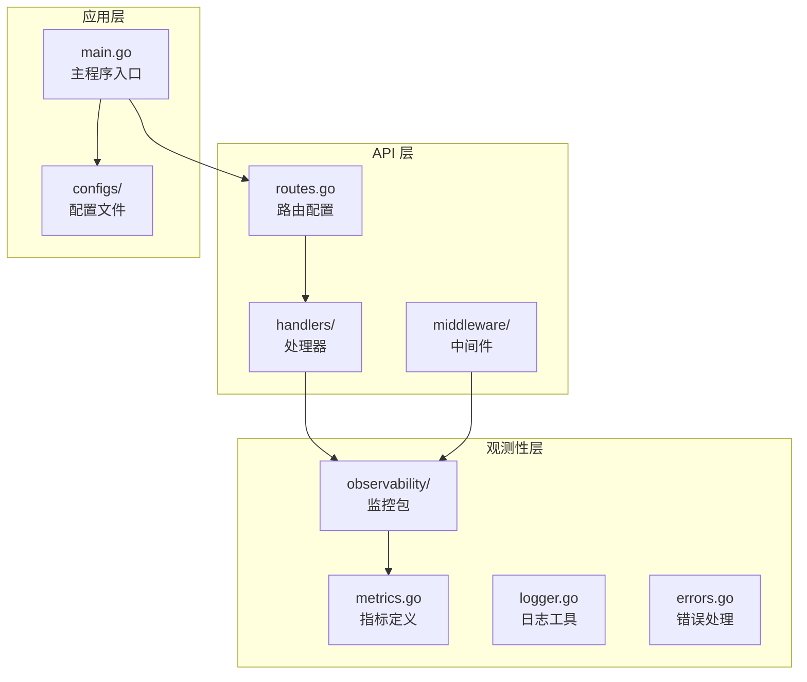
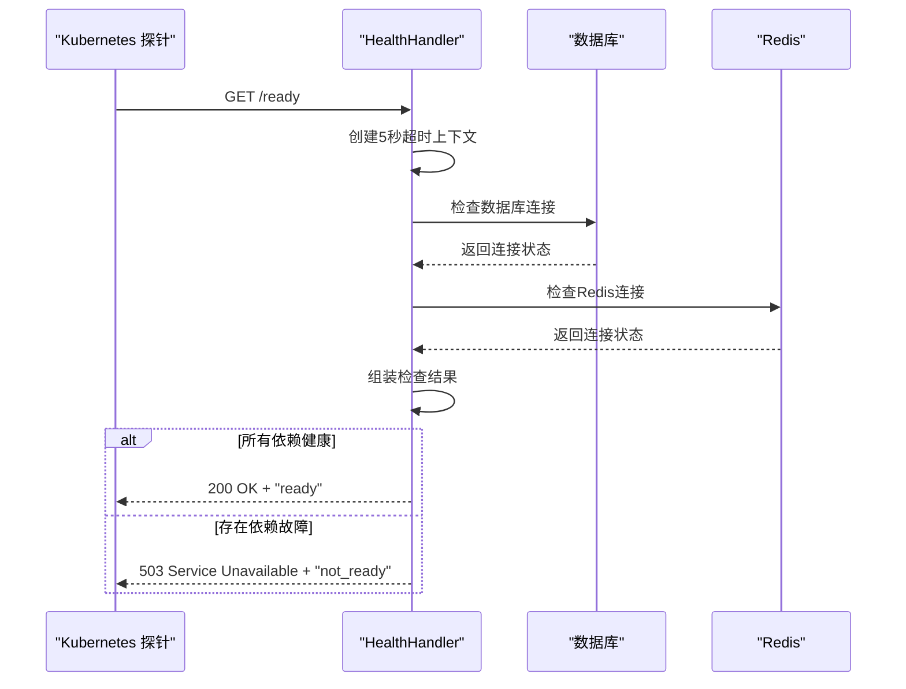
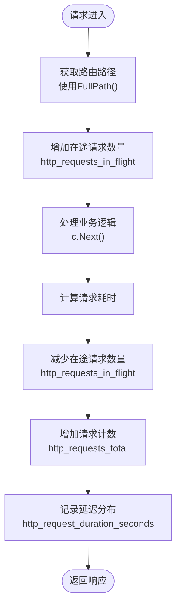
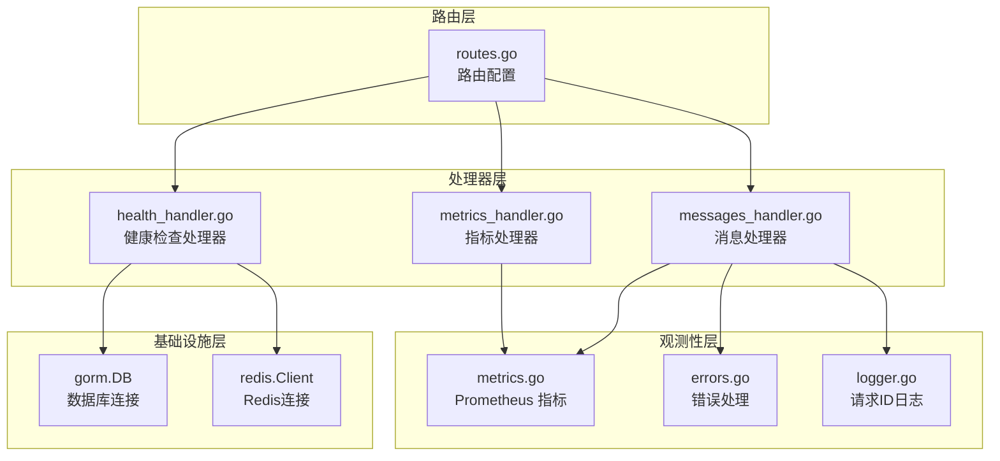

# 工具类接口

<cite>
**本文档引用的文件**
- [health_handler.go](file://internal/api/handlers/health_handler.go)
- [metrics_handler.go](file://internal/api/handlers/metrics_handler.go)
- [messages_handler.go](file://internal/api/handlers/messages_handler.go)
- [routes.go](file://internal/api/routes.go)
- [metrics.go](file://internal/observability/metrics.go)
- [prometheus.yml](file://configs/prometheus.yml)
- [logging.go](file://internal/api/middleware/logging.go)
- [errors.go](file://internal/observability/errors.go)
- [logger.go](file://internal/observability/logger.go)
- [main.go](file://cmd/main.go)
</cite>

## 目录
1. [简介](#简介)
2. [项目结构](#项目结构)
3. [核心组件](#核心组件)
4. [架构概览](#架构概览)
5. [详细组件分析](#详细组件分析)
6. [依赖关系分析](#依赖关系分析)
7. [性能考虑](#性能考虑)
8. [故障排除指南](#故障排除指南)
9. [结论](#结论)

## 简介

Wolink-Core 提供了完整的工具类接口集合，主要用于系统监控、健康检查和指标收集。这些接口在系统运维和监控中发挥着至关重要的作用，确保服务的稳定运行和可观测性。

本文档详细介绍了以下工具类接口：
- 健康检查接口：/health（存活检查）、/ready（就绪检查）
- 指标收集接口：/metrics（Prometheus 指标暴露）
- 消息处理接口：支持 Anthropic 和 OpenAI 格式的聊天消息处理

这些接口通过 Gin 框架实现，集成了 Prometheus 监控、结构化日志记录和统一错误处理机制。

## 项目结构

Wolink-Core 的工具类接口主要分布在以下目录结构中：



**图表来源**
- [routes.go:14-129](file://internal/api/routes.go#L14-L129)
- [metrics.go:1-93](file://internal/observability/metrics.go#L1-L93)
- [main.go:19-89](file://cmd/main.go#L19-L89)

**章节来源**
- [routes.go:14-129](file://internal/api/routes.go#L14-L129)
- [metrics.go:1-93](file://internal/observability/metrics.go#L1-L93)
- [main.go:19-89](file://cmd/main.go#L19-L89)

## 核心组件

Wolink-Core 的工具类接口由三个核心组件构成：

### 1. 健康检查组件
- **HealthHandler**：处理存活和就绪检查
- 支持数据库和 Redis 连接验证
- 提供结构化的健康状态报告

### 2. 指标收集组件  
- **MetricsHandler**：暴露 Prometheus 指标
- 集成 HTTP 请求监控
- 支持自定义指标定义

### 3. 消息处理组件
- **ChatHandler**：处理 Anthropic 和 OpenAI 格式的消息
- 支持流式和非流式响应
- 集成安全信息检测和替换

**章节来源**
- [health_handler.go:23-119](file://internal/api/handlers/health_handler.go#L23-L119)
- [metrics_handler.go:9-22](file://internal/api/handlers/metrics_handler.go#L9-L22)
- [messages_handler.go:18-335](file://internal/api/handlers/messages_handler.go#L18-L335)

## 架构概览

Wolink-Core 的工具类接口采用分层架构设计，确保高内聚低耦合：

```mermaid
graph TB
subgraph "外部系统"
Clients[Clients<br/>客户端应用]
Monitoring[Monitoring<br/>监控系统]
LoadBalancer[Load Balancer<br/>负载均衡器]
end
subgraph "Web 服务器层"
Gin[Gin Engine<br/>HTTP 服务器]
Middleware[Middleware Chain<br/>中间件链]
end
subgraph "业务逻辑层"
Handlers[Handlers<br/>接口处理器]
Services[Services<br/>业务服务]
end
subgraph "基础设施层"
DB[(Database)<br/>MySQL/PostgreSQL]
Redis[(Redis)<br/>缓存存储]
Plugins[(Plugins)<br/>模型插件]
end
Clients --> LoadBalancer
LoadBalancer --> Gin
Gin --> Middleware
Middleware --> Handlers
Handlers --> Services
Services --> DB
Services --> Redis
Services --> Plugins
Monitoring --> Gin
Monitoring --> DB
Monitoring --> Redis
```

**图表来源**
- [routes.go:14-129](file://internal/api/routes.go#L14-L129)
- [main.go:50-68](file://cmd/main.go#L50-L68)

## 详细组件分析

### 健康检查接口

#### /health 接口（存活检查）

**接口描述**
- 用于 Kubernetes 存活探针检查
- 验证服务器进程是否正常运行
- 不检查外部依赖连接

**响应格式**
```json
{
  "status": "ok"
}
```

**使用场景**
- Kubernetes livenessProbe 配置
- 容器重启策略触发
- 健康状态快速验证

#### /ready 接口（就绪检查）

**接口描述**
- 用于 Kubernetes 就绪探针检查
- 验证服务器能否处理请求
- 检查数据库和 Redis 连接状态

**响应格式**
成功时：
```json
{
  "status": "ready",
  "checks": {
    "database": true,
    "redis": true
  }
}
```

失败时：
```json
{
  "status": "not_ready", 
  "checks": {
    "database": false,
    "redis": true
  }
}
```

**使用场景**
- Kubernetes readinessProbe 配置
- 服务流量切换控制
- 依赖服务可用性验证



**图表来源**
- [health_handler.go:52-84](file://internal/api/handlers/health_handler.go#L52-L84)
- [health_handler.go:86-119](file://internal/api/handlers/health_handler.go#L86-L119)

**章节来源**
- [health_handler.go:39-84](file://internal/api/handlers/health_handler.go#L39-L84)
- [routes.go:39-44](file://internal/api/routes.go#L39-L44)

### 指标收集接口

#### /metrics 接口（Prometheus 指标暴露）

**接口描述**
- 暴露 Prometheus 格式的监控指标
- 自动收集 HTTP 请求相关指标
- 支持自定义指标注册

**内置指标类型**
- `http_requests_total`：HTTP 请求总数（按方法、路径、状态码分类）
- `http_request_duration_seconds`：HTTP 请求延迟分布（按方法、路径分类）
- `http_requests_in_flight`：正在处理的请求数量（按方法分类）

**标签说明**
- 方法：GET、POST、PUT、DELETE 等 HTTP 方法
- 路径：路由模式（避免路径参数导致的高基数）
- 状态码：HTTP 响应状态码
- 请求ID：唯一请求标识符



**图表来源**
- [metrics.go:62-86](file://internal/observability/metrics.go#L62-L86)

**章节来源**
- [metrics_handler.go:18-22](file://internal/api/handlers/metrics_handler.go#L18-L22)
- [metrics.go:12-51](file://internal/observability/metrics.go#L12-L51)
- [routes.go:44](file://internal/api/routes.go#L44)

### 消息处理接口

#### /v1/messages 接口（Anthropic 格式）

**接口描述**
- 处理 Anthropic 格式的聊天消息请求
- 支持流式和非流式响应
- 自动进行敏感信息检测和替换

**请求格式**
支持 Anthropic 的消息格式，包括：
- `model`：模型名称
- `messages`：消息数组（支持字符串和复杂内容块）
- `system`：系统提示词（可选）
- `temperature`：采样温度
- `max_tokens`：最大生成令牌数
- `stream`：是否启用流式响应

**响应格式**
非流式响应：
```json
{
  "id": "msg_请求ID",
  "type": "message",
  "role": "assistant",
  "model": "模型名称",
  "content": [
    {
      "type": "text",
      "text": "回复内容"
    }
  ],
  "stop_reason": "end_turn",
  "usage": {
    "input_tokens": 100,
    "output_tokens": 50
  }
}
```

流式响应（SSE）：
- 使用 Server-Sent Events 协议
- 包含多个事件类型：message_start、content_block_start、content_block_delta、message_delta、message_stop

**章节来源**
- [messages_handler.go:18-135](file://internal/api/handlers/messages_handler.go#L18-L135)
- [routes.go:55-56](file://internal/api/routes.go#L55-L56)

## 依赖关系分析

Wolink-Core 的工具类接口具有清晰的依赖关系：



**图表来源**
- [routes.go:36-37](file://internal/api/routes.go#L36-L37)
- [health_handler.go:24-29](file://internal/api/handlers/health_handler.go#L24-L29)
- [metrics_handler.go:11](file://internal/api/handlers/metrics_handler.go#L11)

**章节来源**
- [routes.go:36-37](file://internal/api/routes.go#L36-L37)
- [health_handler.go:24-29](file://internal/api/handlers/health_handler.go#L24-L29)
- [metrics_handler.go:11](file://internal/api/handlers/metrics_handler.go#L11)

## 性能考虑

### 监控指标优化

1. **高基数问题避免**
   - 使用 `FullPath()` 获取路由模式而非完整路径
   - 避免将路径参数作为指标标签

2. **内存使用优化**
   - 指标数据结构使用 `CounterVec` 和 `HistogramVec`
   - 及时清理过期指标数据

3. **并发安全性**
   - Prometheus 指标操作是线程安全的
   - 中间件使用原子操作更新指标

### 健康检查性能

1. **超时控制**
   - 健康检查设置 5 秒超时限制
   - 避免长时间阻塞探针

2. **连接池管理**
   - 数据库使用底层连接池
   - Redis 使用连接池复用

### 错误处理最佳实践

1. **统一错误格式**
   - 使用结构化错误响应
   - 包含机器可读的错误代码

2. **日志关联**
   - 通过请求ID关联所有日志条目
   - 支持端到端请求追踪

**章节来源**
- [metrics.go:59-61](file://internal/observability/metrics.go#L59-L61)
- [health_handler.go:52-54](file://internal/api/handlers/health_handler.go#L52-L54)
- [errors.go:103-142](file://internal/observability/errors.go#L103-L142)

## 故障排除指南

### 健康检查问题

**常见问题及解决方案**

1. **/ready 返回 503**
   - 检查数据库连接配置
   - 验证 Redis 服务可用性
   - 查看应用日志中的连接错误

2. **/health 始终返回 200**
   - 这是预期行为
   - 存活检查不验证依赖连接

**诊断步骤**
```bash
# 检查就绪状态
curl http://localhost:8080/ready

# 检查存活状态  
curl http://localhost:8080/health

# 查看应用日志
tail -f /var/log/wolink-core/app.log
```

### 监控指标问题

**指标缺失排查**

1. **检查 Prometheus 配置**
   ```yaml
   scrape_configs:
     - job_name: 'wolink-core'
       static_configs:
         - targets: ['localhost:8080']
       metrics_path: '/metrics'
   ```

2. **验证指标暴露**
   ```bash
   curl http://localhost:8080/metrics | grep http_requests_total
   ```

3. **检查中间件顺序**
   - 确保 Prometheus 中间件在日志中间件之前
   - 验证错误处理中间件正确配置

**章节来源**
- [prometheus.yml:1-10](file://configs/prometheus.yml#L1-L10)
- [routes.go:24-29](file://internal/api/routes.go#L24-L29)

### 消息处理问题

**流式响应问题**

1. **SSE 连接断开**
   - 检查网络连接稳定性
   - 验证客户端 SSE 支持
   - 查看服务器端错误日志

2. **敏感信息检测误报**
   - 检查安全服务配置
   - 验证敏感信息模式匹配
   - 调整检测阈值

**调试技巧**
```bash
# 启用详细日志
export LOG_LEVEL=debug

# 测试接口
curl -i -N http://localhost:8080/v1/messages \
  -H "Authorization: Bearer YOUR_API_KEY" \
  -H "Content-Type: application/json" \
  -d '{"model":"gpt-3.5-turbo","messages":[{"role":"user","content":"Hello"}],"stream":true}'
```

## 结论

Wolink-Core 的工具类接口提供了完整的系统监控和健康检查解决方案。通过精心设计的架构，这些接口不仅满足了基本的运维需求，还为系统的可观测性和可靠性提供了坚实的基础。

**关键优势**
- **全面的监控覆盖**：从应用层面到基础设施层面的全方位监控
- **灵活的配置选项**：支持多种部署环境和监控系统集成
- **高性能设计**：最小化对业务逻辑的影响，确保生产环境稳定性
- **易于维护**：清晰的代码结构和完善的测试覆盖

**推荐实践**
- 在生产环境中启用完整的监控套件
- 定期审查和优化监控指标配置
- 建立完善的告警机制和故障响应流程
- 持续改进系统的可观测性能力

这些工具类接口为 Wolink-Core 的稳定运行和高效运维提供了重要保障，是现代云原生应用不可或缺的重要组成部分。