# API Key 管理

<cite>
**本文档引用的文件**
- [routes.go](file://internal/api/routes.go)
- [admin_handler.go](file://internal/api/handlers/admin_handler.go)
- [auth_service.go](file://internal/services/auth_service.go)
- [models.go](file://internal/models/models.go)
- [auth.go](file://internal/api/middleware/auth.go)
- [admin_auth.go](file://internal/api/middleware/admin_auth.go)
- [admin_handler_test.go](file://internal/api/handlers/admin_handler_test.go)
- [auth_service_test.go](file://internal/services/auth_service_test.go)
</cite>

## 目录
1. [简介](#简介)
2. [项目结构](#项目结构)
3. [核心组件](#核心组件)
4. [架构概览](#架构概览)
5. [详细组件分析](#详细组件分析)
6. [依赖关系分析](#依赖关系分析)
7. [性能考虑](#性能考虑)
8. [故障排除指南](#故障排除指南)
9. [结论](#结论)

## 简介

Wolink-Core 提供了一套完整的 API Key 管理接口，支持管理员对系统中的 API 密钥进行全面的生命周期管理。该系统采用 Redis 缓存机制优化性能，实现了高效的密钥验证和速率限制功能。

主要功能包括：
- API Key 的创建、查询、更新和删除
- 多维度的使用限制管理（每日、每月、并发限制）
- 实时的使用统计和监控
- 完整的权限控制和安全机制

## 项目结构

API Key 管理功能在项目中的组织结构如下：

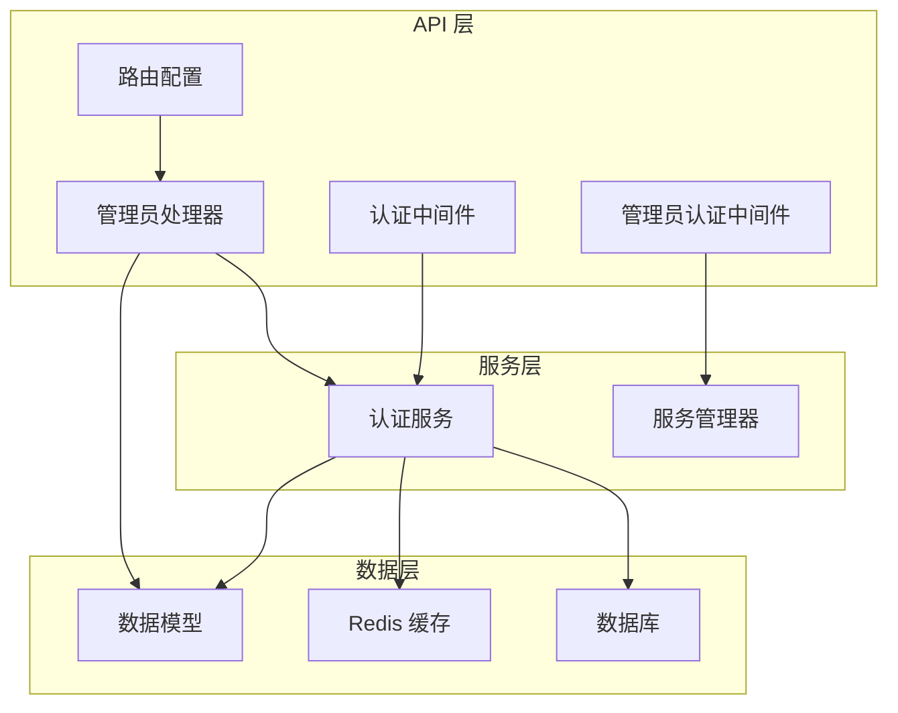

**图表来源**
- [routes.go:14-129](file://internal/api/routes.go#L14-L129)
- [admin_handler.go:14-250](file://internal/api/handlers/admin_handler.go#L14-L250)
- [auth_service.go:19-219](file://internal/services/auth_service.go#L19-L219)

**章节来源**
- [routes.go:14-129](file://internal/api/routes.go#L14-L129)
- [admin_handler.go:14-250](file://internal/api/handlers/admin_handler.go#L14-L250)

## 核心组件

### 数据模型

API Key 的数据结构设计采用了分层存储策略：

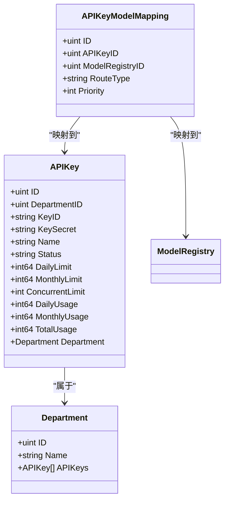

**图表来源**
- [models.go:20-43](file://internal/models/models.go#L20-L43)
- [models.go:10-18](file://internal/models/models.go#L10-L18)

### 服务架构

系统采用分层架构设计，确保职责分离和可维护性：

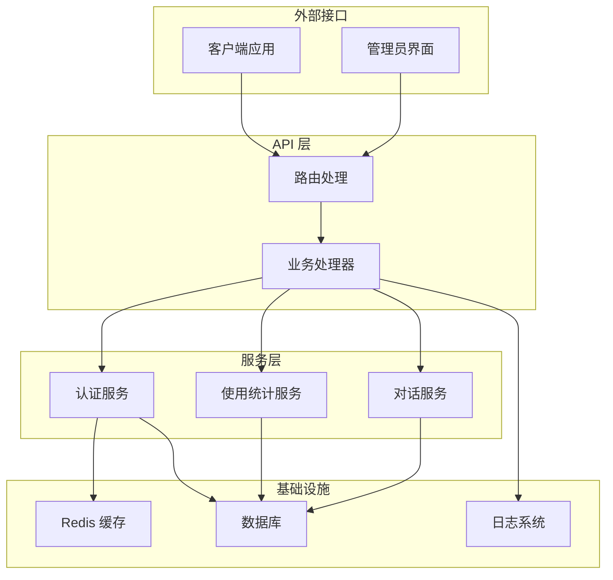

**图表来源**
- [routes.go:31-37](file://internal/api/routes.go#L31-L37)
- [auth_service.go:19-33](file://internal/services/auth_service.go#L19-L33)

**章节来源**
- [models.go:20-43](file://internal/models/models.go#L20-L43)
- [auth_service.go:19-33](file://internal/services/auth_service.go#L19-L33)

## 架构概览

API Key 管理系统的整体架构采用现代化的微服务设计理念：

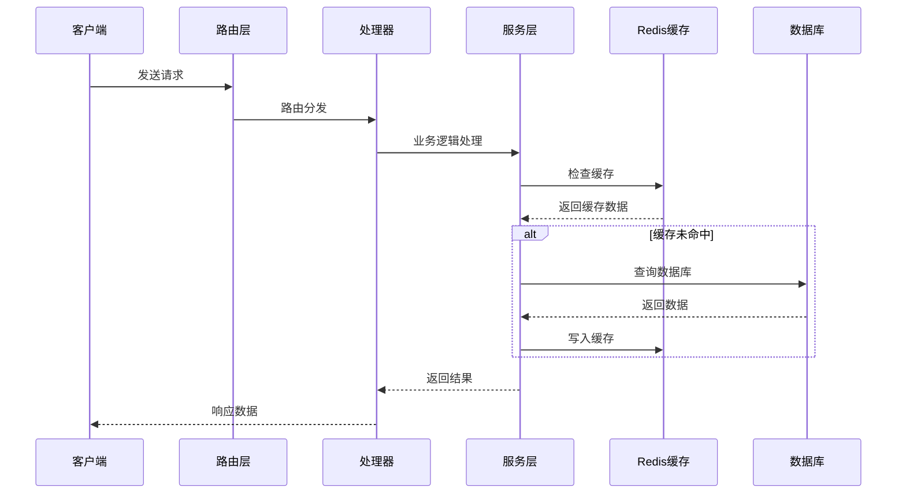

**图表来源**
- [routes.go:101-105](file://internal/api/routes.go#L101-L105)
- [auth_service.go:35-85](file://internal/services/auth_service.go#L35-L85)

## 详细组件分析

### 创建 API Key 接口

#### 接口定义
- **路径**: `/admin/api-keys`
- **方法**: `POST`
- **认证**: 管理员认证
- **权限**: 超级管理员

#### 请求参数
| 参数 | 类型 | 必填 | 默认值 | 说明 |
|------|------|------|--------|------|
| department_id | uint | 是 | - | 所属部门ID |
| name | string | 是 | - | API Key 名称 |

#### 响应格式
成功响应示例：
```json
{
  "id": 1,
  "department_id": 1,
  "key_id": "ak-abc123def456",
  "name": "测试密钥",
  "status": "active",
  "daily_limit": 10000,
  "monthly_limit": 300000,
  "concurrent_limit": 10,
  "daily_usage": 0,
  "monthly_usage": 0,
  "total_usage": 0,
  "created_at": "2024-01-01T00:00:00Z",
  "updated_at": "2024-01-01T00:00:00Z",
  "department": {
    "id": 1,
    "name": "开发部"
  }
}
```

#### 错误处理
- **400 Bad Request**: 参数验证失败
- **401 Unauthorized**: 未提供有效的管理员认证
- **500 Internal Server Error**: 服务器内部错误

**章节来源**
- [admin_handler.go:26-45](file://internal/api/handlers/admin_handler.go#L26-L45)
- [routes.go:101-101](file://internal/api/routes.go#L101-L101)

### 列出 API Key 接口

#### 接口定义
- **路径**: `/admin/api-keys`
- **方法**: `GET`
- **认证**: 管理员认证

#### 响应格式
返回 API Key 数组，每个元素包含完整信息。

#### 错误处理
- **401 Unauthorized**: 未提供有效的管理员认证
- **500 Internal Server Error**: 数据库查询失败

**章节来源**
- [admin_handler.go:47-56](file://internal/api/handlers/admin_handler.go#L47-L56)
- [routes.go:102-102](file://internal/api/routes.go#L102-L102)

### 更新 API Key 接口

#### 接口定义
- **路径**: `/admin/api-keys/:id`
- **方法**: `PUT`
- **认证**: 管理员认证

#### 路径参数
| 参数 | 类型 | 必填 | 说明 |
|------|------|------|------|
| id | uint | 是 | API Key ID |

#### 请求参数
支持部分字段更新：
- **name**: API Key 名称
- **status**: 状态（active/disabled）
- **daily_limit**: 每日限制
- **monthly_limit**: 每月限制
- **concurrent_limit**: 并发限制

#### 错误处理
- **400 Bad Request**: ID 格式无效或参数验证失败
- **401 Unauthorized**: 未提供有效的管理员认证
- **500 Internal Server Error**: 数据库更新失败

**章节来源**
- [admin_handler.go:58-85](file://internal/api/handlers/admin_handler.go#L58-L85)
- [routes.go:103-103](file://internal/api/routes.go#L103-L103)

### 删除 API Key 接口

#### 接口定义
- **路径**: `/admin/api-keys/:id`
- **方法**: `DELETE`
- **认证**: 管理员认证

#### 错误处理
- **400 Bad Request**: ID 格式无效
- **401 Unauthorized**: 未提供有效的管理员认证
- **500 Internal Server Error**: 数据库删除失败

**章节来源**
- [admin_handler.go:87-101](file://internal/api/handlers/admin_handler.go#L87-L101)
- [routes.go:104-104](file://internal/api/routes.go#L104-L104)

### API Key 生成规则

#### 密钥格式
系统采用双层密钥机制：

1. **Key ID (对外显示)**: `ak-` + 32位十六进制字符串
   - 示例: `ak-abc123def4567890fedcba0987654321`
   - 特点: 固定前缀，便于识别和过滤

2. **Key Secret (内部存储)**: 64位十六进制字符串
   - 示例: `abcdef1234567890abcdef1234567890abcdef1234567890abcdef1234567890`
   - 特点: 不返回给客户端，仅用于内部验证

#### 生成算法
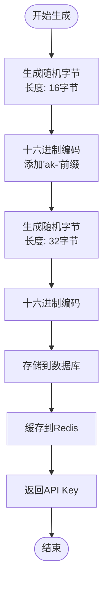

**图表来源**
- [auth_service.go:151-179](file://internal/services/auth_service.go#L151-L179)
- [auth_service.go:209-219](file://internal/services/auth_service.go#L209-L219)

**章节来源**
- [auth_service.go:151-179](file://internal/services/auth_service.go#L151-L179)
- [auth_service.go:209-219](file://internal/services/auth_service.go#L209-L219)

### 有效期管理

#### 缓存策略
系统采用多层缓存机制：

1. **Redis 缓存** (短期)
   - Key: `apikey:{key_id}`
   - 过期时间: 5分钟
   - 用途: 高频访问的密钥信息

2. **数据库缓存** (长期)
   - Key: `apikey:{key_id}` (缓存键)
   - 过期时间: 24小时
   - 用途: 新创建密钥的持久化缓存

#### 缓存更新流程
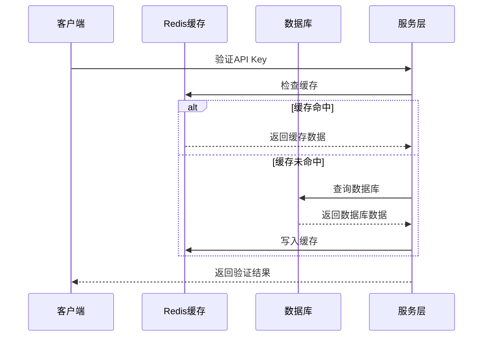

**图表来源**
- [auth_service.go:35-85](file://internal/services/auth_service.go#L35-L85)
- [auth_service.go:183-200](file://internal/services/auth_service.go#L183-L200)

**章节来源**
- [auth_service.go:35-85](file://internal/services/auth_service.go#L35-L85)
- [auth_service.go:183-200](file://internal/services/auth_service.go#L183-L200)

### 权限控制

#### 管理员认证流程
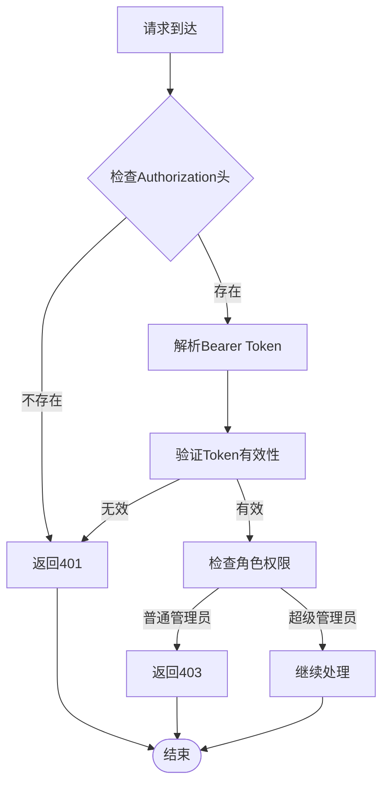

**图表来源**
- [admin_auth.go:14-75](file://internal/api/middleware/admin_auth.go#L14-L75)
- [admin_auth.go:77-104](file://internal/api/middleware/admin_auth.go#L77-L104)

#### 角色权限矩阵
| 接口 | 需要角色 | 说明 |
|------|----------|------|
| 创建API Key | 超级管理员 | 仅超级管理员可创建新密钥 |
| 更新API Key | 管理员 | 所有管理员可更新现有密钥 |
| 删除API Key | 超级管理员 | 仅超级管理员可删除密钥 |
| 列表查询 | 管理员 | 所有管理员可查看密钥列表 |

**章节来源**
- [admin_auth.go:14-75](file://internal/api/middleware/admin_auth.go#L14-L75)
- [admin_auth.go:77-104](file://internal/api/middleware/admin_auth.go#L77-L104)

### 配额限制

#### 限制类型
系统实现了三层限制机制：

1. **并发限制** (`concurrent_limit`)
   - 控制同一时间内的并发请求数
   - 默认值: 10
   - 过期时间: 30秒

2. **每日限制** (`daily_limit`)
   - 控制单日总调用次数
   - 默认值: 10,000
   - 过期时间: 25小时

3. **每月限制** (`monthly_limit`)
   - 控制单月总调用次数
   - 默认值: 300,000
   - 过期时间: 32天

#### 限制检查流程
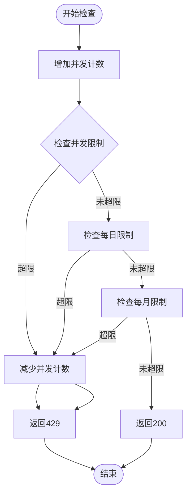

**图表来源**
- [auth_service.go:87-124](file://internal/services/auth_service.go#L87-L124)

#### 限制实现细节
- **Redis 键命名规范**:
  - 并发计数: `concurrent:{api_key_id}`
  - 每日计数: `daily:{api_key_id}:{YYYY-MM-DD}`
  - 每月计数: `monthly:{api_key_id}:{YYYY-MM}`

- **异步统计更新**: 使用 goroutine 异步更新数据库统计，避免阻塞主请求流程

**章节来源**
- [auth_service.go:87-124](file://internal/services/auth_service.go#L87-L124)
- [auth_service.go:126-149](file://internal/services/auth_service.go#L126-L149)

### 状态管理

#### API Key 状态
| 状态 | 含义 | 行为 |
|------|------|------|
| `active` | 激活状态 | 可正常使用 |
| `disabled` | 禁用状态 | 访问被拒绝 |

#### 状态切换流程
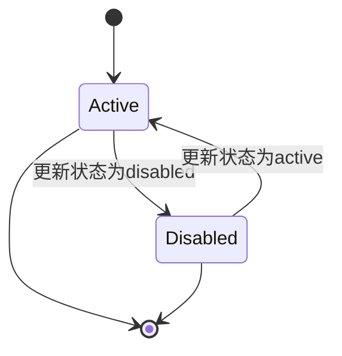

**章节来源**
- [models.go:27-27](file://internal/models/models.go#L27-L27)
- [auth_service.go:66-70](file://internal/services/auth_service.go#L66-L70)

## 依赖关系分析

### 组件依赖图
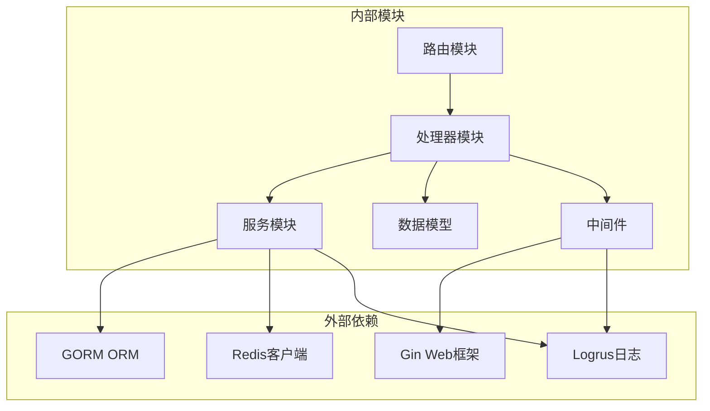

**图表来源**
- [routes.go:3-12](file://internal/api/routes.go#L3-L12)
- [admin_handler.go:3-12](file://internal/api/handlers/admin_handler.go#L3-L12)
- [auth_service.go:3-17](file://internal/services/auth_service.go#L3-L17)

### 关键依赖关系

#### 路由到处理器映射
```mermaid
graph LR
subgraph "管理员认证路由"
Login[/admin/auth/login]
Logout[/admin/auth/logout]
end
subgraph "API Key管理路由"
Create[/admin/api-keys]
List[/admin/api-keys]
Update[/admin/api-keys/:id]
Delete[/admin/api-keys/:id]
end
subgraph "处理器"
AdminHandler[AdminHandler]
end
Login --> AdminHandler
Logout --> AdminHandler
Create --> AdminHandler
List --> AdminHandler
Update --> AdminHandler
Delete --> AdminHandler
```

**图表来源**
- [routes.go:77-105](file://internal/api/routes.go#L77-L105)

**章节来源**
- [routes.go:77-105](file://internal/api/routes.go#L77-L105)

## 性能考虑

### 缓存策略优化
- **多级缓存**: Redis 缓存 + 数据库缓存，减少数据库压力
- **智能过期**: 不同数据设置合适的过期时间
- **预热机制**: 新创建的 API Key 立即缓存，避免冷启动

### 并发处理
- **异步统计**: 使用 goroutine 异步更新使用统计，避免阻塞请求
- **原子操作**: Redis 原子操作保证计数准确性
- **连接池**: 合理配置 Redis 和数据库连接池

### 监控指标
系统集成了 Prometheus 监控，可以跟踪以下指标：
- API Key 验证成功率
- 速率限制触发次数
- 缓存命中率
- 数据库查询延迟

## 故障排除指南

### 常见问题及解决方案

#### API Key 验证失败
**症状**: 返回 `invalid API key` 或 `API key is disabled`

**可能原因**:
1. API Key 已被禁用
2. API Key 格式不正确
3. Redis 缓存异常

**解决步骤**:
1. 检查 API Key 状态是否为 `active`
2. 验证 API Key 格式是否为 `ak-` 开头的35字符字符串
3. 检查 Redis 服务状态

#### 速率限制错误
**症状**: 返回 `concurrent limit exceeded` 或 `daily/monthly limit exceeded`

**解决步骤**:
1. 检查当前并发数是否超过 `concurrent_limit`
2. 查看当日/当月使用量是否达到限制
3. 调整配额限制或等待自然重置

#### 数据库连接问题
**症状**: 返回 `failed to fetch API keys` 或 `failed to update API key`

**解决步骤**:
1. 检查数据库连接状态
2. 验证数据库权限
3. 查看数据库日志

**章节来源**
- [auth_service_test.go:177-213](file://internal/services/auth_service_test.go#L177-L213)
- [auth_service_test.go:246-323](file://internal/services/auth_service_test.go#L246-L323)

### 测试覆盖范围

系统提供了全面的测试覆盖：

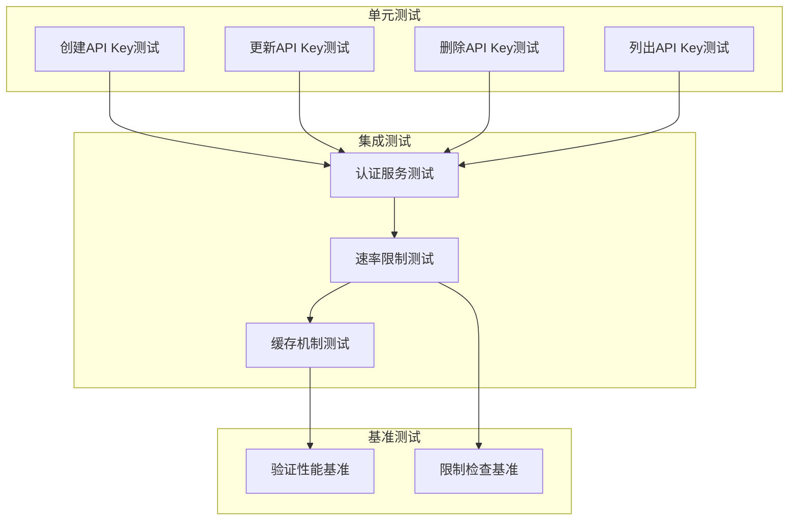

**图表来源**
- [admin_handler_test.go:82-245](file://internal/api/handlers/admin_handler_test.go#L82-L245)
- [auth_service_test.go:52-504](file://internal/services/auth_service_test.go#L52-L504)

**章节来源**
- [admin_handler_test.go:82-245](file://internal/api/handlers/admin_handler_test.go#L82-L245)
- [auth_service_test.go:52-504](file://internal/services/auth_service_test.go#L52-L504)

## 结论

Wolink-Core 的 API Key 管理系统提供了完整的企业级密钥管理解决方案。其核心优势包括：

1. **高性能架构**: 多级缓存机制确保高并发场景下的稳定性能
2. **灵活的配额管理**: 支持多维度的使用限制，满足不同业务需求
3. **完善的安全机制**: 双层密钥设计和严格的权限控制
4. **可观测性**: 全面的监控指标和详细的日志记录
5. **易于扩展**: 清晰的分层架构便于功能扩展和维护

该系统适合需要严格 API 管理和使用统计的企业级应用场景，能够有效防止滥用并提供准确的使用情况报告。