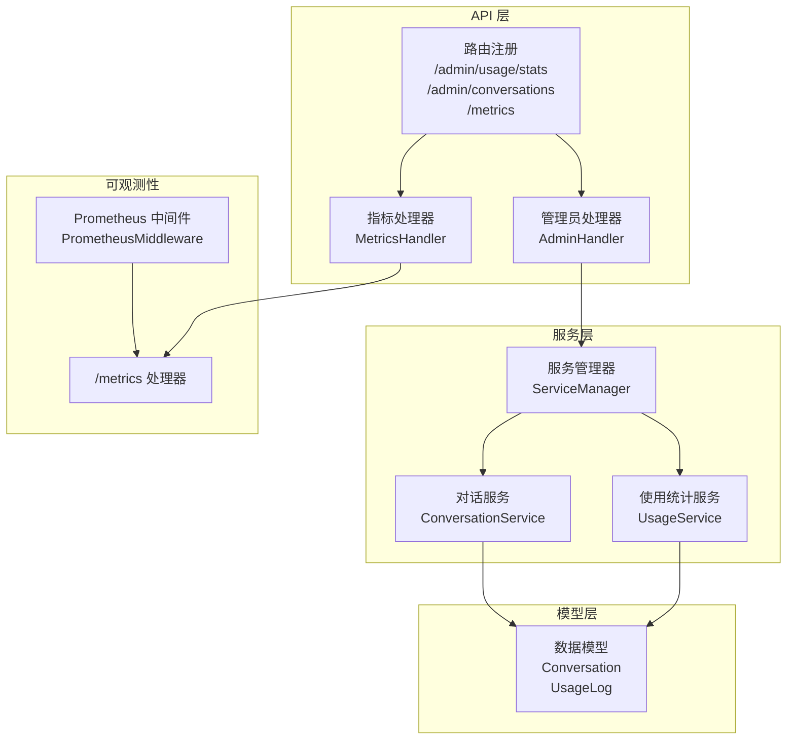
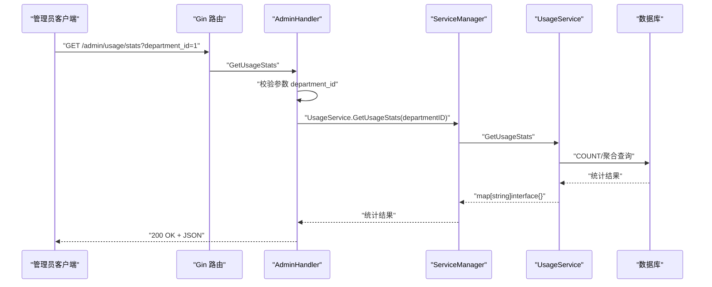
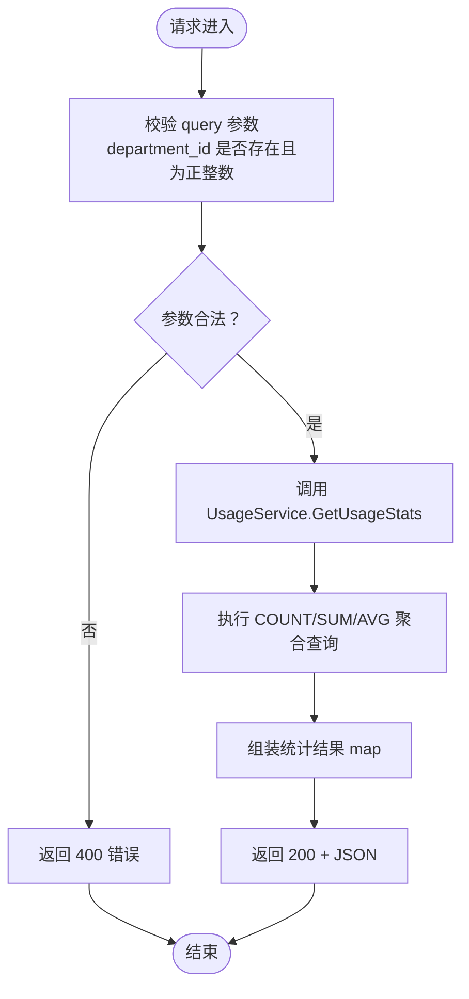
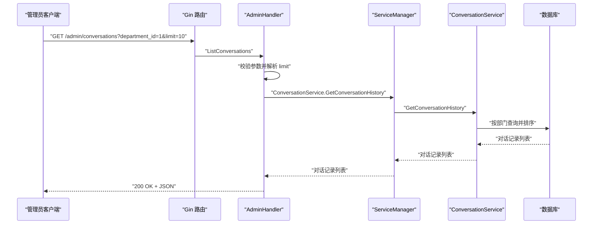
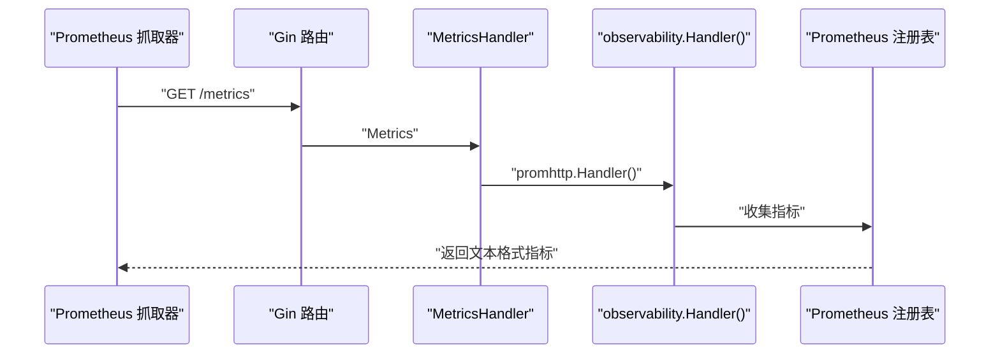
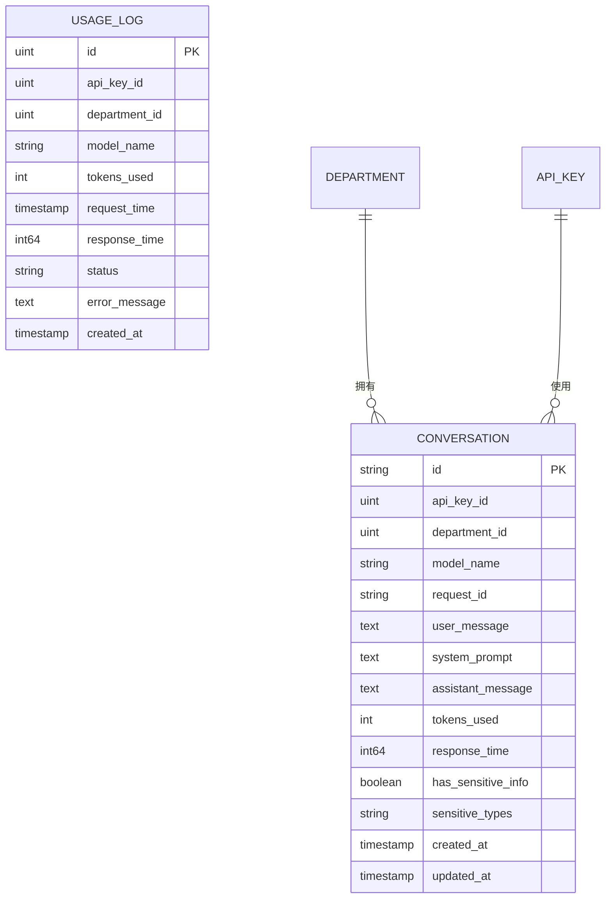
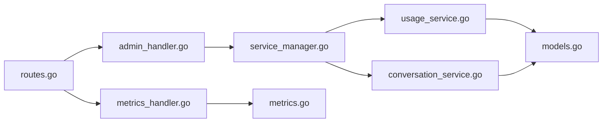

# 使用统计查询

<cite>
**本文引用的文件**
- [routes.go](file://internal/api/routes.go)
- [admin_handler.go](file://internal/api/handlers/admin_handler.go)
- [usage_service.go](file://internal/services/usage_service.go)
- [conversation_service.go](file://internal/services/conversation_service.go)
- [models.go](file://internal/models/models.go)
- [metrics.go](file://internal/observability/metrics.go)
- [metrics_handler.go](file://internal/api/handlers/metrics_handler.go)
- [prometheus.yml](file://configs/prometheus.yml)
- [README.md](file://README.md)
- [service_manager.go](file://internal/services/service_manager.go)
</cite>

## 目录
1. [简介](#简介)
2. [项目结构](#项目结构)
3. [核心组件](#核心组件)
4. [架构概览](#架构概览)
5. [详细组件分析](#详细组件分析)
6. [依赖分析](#依赖分析)
7. [性能考虑](#性能考虑)
8. [故障排查指南](#故障排查指南)
9. [结论](#结论)
10. [附录](#附录)

## 简介
本文件面向 Wolink-Core 的管理员用户，提供“使用统计查询”接口的完整 API 文档。当前已实现的功能包括：
- 获取部门使用统计：/admin/usage/stats?department_id=1
- 查看对话记录：/admin/conversations?department_id=1&limit=10
- 实时监控指标：/metrics（Prometheus）

后续可扩展方向包括：
- 获取 API Key 使用详情接口
- 获取模型使用排行接口
- 获取时间范围内的使用趋势接口
- 统计图表数据格式与导出功能

本文件将详细说明统计数据的计算方式、聚合维度（按部门、按 API Key、按模型）、时间粒度选择、数据准确性保证，并给出错误处理与性能建议。

## 项目结构
Wolink-Core 采用分层架构，API 层负责路由与请求处理，服务层封装业务逻辑，模型层定义数据结构，可观测性层提供监控与指标。

**图表来源**
- [routes.go:14-129](file://internal/api/routes.go#L14-L129)
- [admin_handler.go:19-250](file://internal/api/handlers/admin_handler.go#L19-L250)
- [metrics.go:53-93](file://internal/observability/metrics.go#L53-L93)
- [metrics_handler.go:1-22](file://internal/api/handlers/metrics_handler.go#L1-L22)
- [service_manager.go:11-76](file://internal/services/service_manager.go#L11-L76)

**章节来源**
- [routes.go:14-129](file://internal/api/routes.go#L14-L129)
- [service_manager.go:11-76](file://internal/services/service_manager.go#L11-L76)

## 核心组件
- 路由与中间件：统一注册 /admin/* 与 /metrics 路由，启用恢复、请求 ID、Prometheus、日志、CORS、错误处理等中间件链。
- 管理员处理器：处理 /admin/usage/stats 与 /admin/conversations 等管理端点。
- 使用统计服务：从数据库聚合部门维度的调用次数、token 总量、平均响应时间。
- 对话服务：按部门查询最近对话记录，支持 limit 参数。
- 指标处理器：暴露 /metrics 接口，输出 Prometheus 文本格式指标。

**章节来源**
- [routes.go:14-129](file://internal/api/routes.go#L14-L129)
- [admin_handler.go:199-250](file://internal/api/handlers/admin_handler.go#L199-L250)
- [usage_service.go:25-52](file://internal/services/usage_service.go#L25-L52)
- [conversation_service.go:28-49](file://internal/services/conversation_service.go#L28-L49)
- [metrics_handler.go:1-22](file://internal/api/handlers/metrics_handler.go#L1-L22)

## 架构概览
以下序列图展示管理员查询部门使用统计的完整流程。

**图表来源**
- [routes.go:117-120](file://internal/api/routes.go#L117-L120)
- [admin_handler.go:199-220](file://internal/api/handlers/admin_handler.go#L199-L220)
- [usage_service.go:25-47](file://internal/services/usage_service.go#L25-L47)

## 详细组件分析

### 获取部门使用统计接口
- 路径：/admin/usage/stats
- 方法：GET
- 认证：需要管理员 JWT Token
- 查询参数：
  - department_id：必填，必须为正整数
- 返回值：
  - total_calls：该部门的总调用次数（整数）
  - total_tokens：该部门的 token 总使用量（整数）
  - avg_response_time：该部门的平均响应时间（毫秒，浮点数）
- 错误处理：
  - 缺少 department_id：400 Bad Request
  - department_id 非法：400 Bad Request
  - 数据库查询失败：500 Internal Server Error

**图表来源**
- [admin_handler.go:199-220](file://internal/api/handlers/admin_handler.go#L199-L220)
- [usage_service.go:25-47](file://internal/services/usage_service.go#L25-L47)

**章节来源**
- [admin_handler.go:199-220](file://internal/api/handlers/admin_handler.go#L199-L220)
- [usage_service.go:25-47](file://internal/services/usage_service.go#L25-L47)
- [routes.go:117-120](file://internal/api/routes.go#L117-L120)

### 获取对话记录接口
- 路径：/admin/conversations
- 方法：GET
- 认证：需要管理员 JWT Token
- 查询参数：
  - department_id：必填，必须为正整数
  - limit：可选，默认 50，最大 1000
- 返回值：按创建时间倒序的对话记录数组
- 错误处理：
  - 缺少 department_id：400 Bad Request
  - department_id 非法：400 Bad Request
  - 数据库查询失败：500 Internal Server Error

**图表来源**
- [routes.go:119-120](file://internal/api/routes.go#L119-L120)
- [admin_handler.go:222-250](file://internal/api/handlers/admin_handler.go#L222-L250)
- [conversation_service.go:28-49](file://internal/services/conversation_service.go#L28-L49)

**章节来源**
- [admin_handler.go:222-250](file://internal/api/handlers/admin_handler.go#L222-L250)
- [conversation_service.go:28-49](file://internal/services/conversation_service.go#L28-L49)
- [routes.go:119-120](file://internal/api/routes.go#L119-L120)

### 实时监控指标接口
- 路径：/metrics
- 方法：GET
- 功能：暴露 Prometheus 文本格式指标，便于外部采集器抓取
- 指标类型：
  - http_requests_total：按方法、路径模式、状态码计数
  - http_request_duration_seconds：按方法与路径模式的延迟直方图
  - http_requests_in_flight：按方法的并发请求数
- 路由注册：在 /metrics 下挂载 observability.Handler()

**图表来源**
- [routes.go:44-44](file://internal/api/routes.go#L44-L44)
- [metrics_handler.go:18-21](file://internal/api/handlers/metrics_handler.go#L18-L21)
- [metrics.go:88-93](file://internal/observability/metrics.go#L88-L93)

**章节来源**
- [metrics_handler.go:1-22](file://internal/api/handlers/metrics_handler.go#L1-L22)
- [metrics.go:12-93](file://internal/observability/metrics.go#L12-L93)
- [routes.go:44-44](file://internal/api/routes.go#L44-L44)

### 数据模型与统计口径
- Conversation 表：记录每次请求的 API Key、部门、模型名、token 使用量、响应时间、创建时间等字段，用于统计与审计。
- UsageLog 表：异步记录使用日志，包含 API Key、部门、模型、token、请求时间、响应时间、状态、错误信息等字段。
- 统计口径：
  - 总调用次数：按部门过滤后 COUNT(*) 计数
  - 总 token 使用量：按部门过滤后 SUM(tokens_used)
  - 平均响应时间：按部门过滤后 AVG(response_time)，单位毫秒

**图表来源**
- [models.go:90-131](file://internal/models/models.go#L90-L131)

**章节来源**
- [models.go:90-131](file://internal/models/models.go#L90-L131)

## 依赖分析
- 路由层依赖中间件链：Recovery → RequestID → Prometheus → Logger → CORS → ErrorHandler
- 管理员处理器依赖 ServiceManager，后者持有 UsageService 与 ConversationService
- UsageService 与 ConversationService 依赖数据库 ORM 进行查询
- 指标层通过 Prometheus 中间件与处理器暴露指标

**图表来源**
- [routes.go:14-129](file://internal/api/routes.go#L14-L129)
- [admin_handler.go:19-250](file://internal/api/handlers/admin_handler.go#L19-L250)
- [metrics_handler.go:1-22](file://internal/api/handlers/metrics_handler.go#L1-L22)
- [metrics.go:53-93](file://internal/observability/metrics.go#L53-L93)
- [service_manager.go:11-76](file://internal/services/service_manager.go#L11-L76)
- [usage_service.go:1-52](file://internal/services/usage_service.go#L1-L52)
- [conversation_service.go:1-49](file://internal/services/conversation_service.go#L1-L49)
- [models.go:90-131](file://internal/models/models.go#L90-L131)

**章节来源**
- [routes.go:14-129](file://internal/api/routes.go#L14-L129)
- [service_manager.go:11-76](file://internal/services/service_manager.go#L11-L76)

## 性能考虑
- 聚合查询：当前统计使用单表聚合（COUNT/SUM/AVG），建议在 department_id、created_at 等常用查询字段上建立索引以提升性能。
- 分页与限制：对话记录接口限制 limit 最大值，防止一次性返回过多数据导致内存压力。
- 指标采集：Prometheus 中间件使用 FullPath() 作为路径标签，避免高基数参数导致指标膨胀。
- 异步日志：通信日志通过队列异步写入，降低主流程阻塞风险。

[本节为通用性能建议，不直接分析具体文件]

## 故障排查指南
- 400 错误（参数缺失或非法）：
  - 检查是否传入 department_id，且为正整数
  - 检查 limit 是否在允许范围内（1-1000）
- 500 错误（内部服务器错误）：
  - 数据库连接异常或查询超时
  - 服务初始化失败（如 ServiceManager 未正确注入）
- 指标不可见：
  - 确认 /metrics 路由已注册
  - 检查 Prometheus 抓取配置与目标地址

**章节来源**
- [admin_handler.go:200-220](file://internal/api/handlers/admin_handler.go#L200-L220)
- [admin_handler.go:223-250](file://internal/api/handlers/admin_handler.go#L223-L250)
- [routes.go:44-44](file://internal/api/routes.go#L44-L44)
- [prometheus.yml:1-10](file://configs/prometheus.yml#L1-L10)

## 结论
Wolink-Core 当前已提供基础的部门使用统计与对话记录查询能力，并通过 /metrics 提供 Prometheus 指标。未来可在现有基础上扩展：
- API Key 使用详情：按 API Key 聚合 token 使用量与调用次数
- 模型使用排行：按模型名聚合调用次数与 token 使用量
- 时间范围趋势：支持按日/周/月等粒度的时间序列统计
- 图表数据格式与导出：提供标准 JSON 输出与 CSV 导出接口

这些扩展将遵循现有分层架构与中间件体系，确保一致的性能与可观测性体验。

[本节为总结性内容，不直接分析具体文件]

## 附录

### API 定义与示例
- 获取部门使用统计
  - 请求：GET /admin/usage/stats?department_id=1
  - 成功响应：200 OK，JSON 包含 total_calls、total_tokens、avg_response_time
  - 失败响应：400/500，JSON 包含错误信息
- 查看对话记录
  - 请求：GET /admin/conversations?department_id=1&limit=10
  - 成功响应：200 OK，JSON 数组为对话记录
  - 失败响应：400/500，JSON 包含错误信息
- 实时监控指标
  - 请求：GET /metrics
  - 成功响应：200 OK，Prometheus 文本格式指标

**章节来源**
- [README.md:246-258](file://README.md#L246-L258)
- [routes.go:117-120](file://internal/api/routes.go#L117-L120)
- [routes.go:44-44](file://internal/api/routes.go#L44-L44)