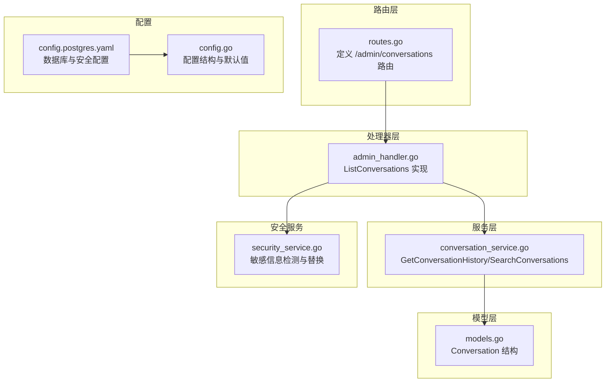
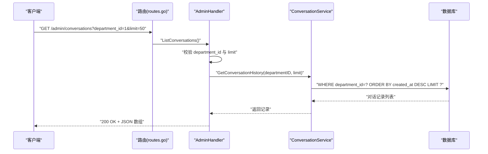
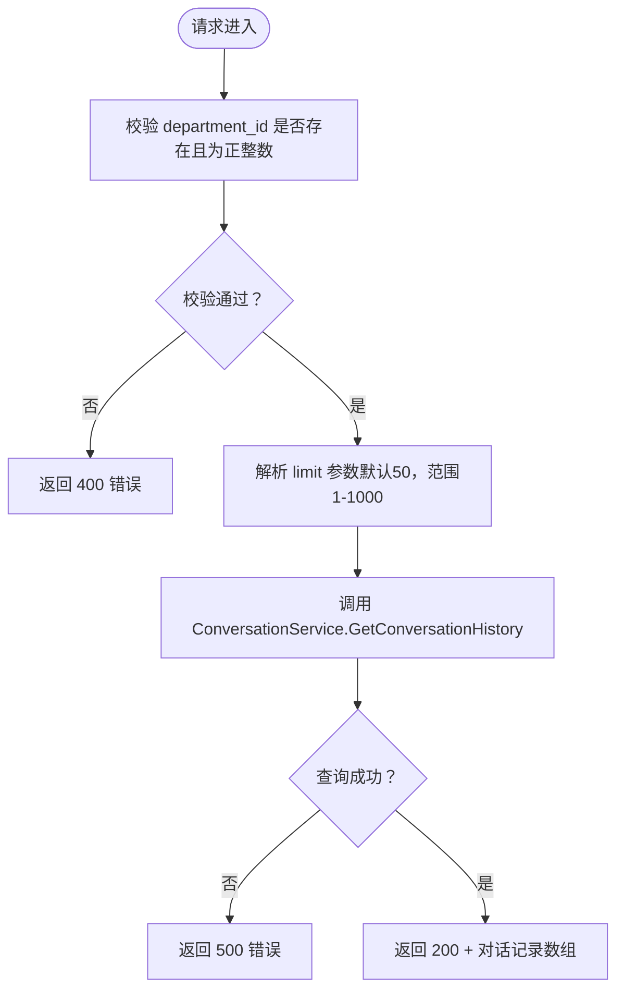
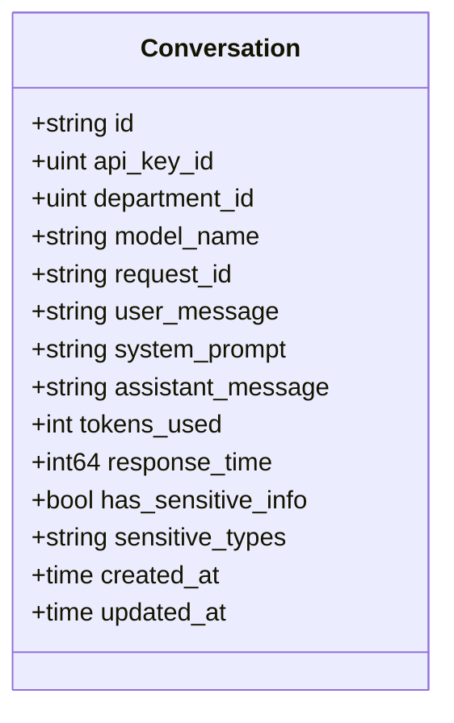
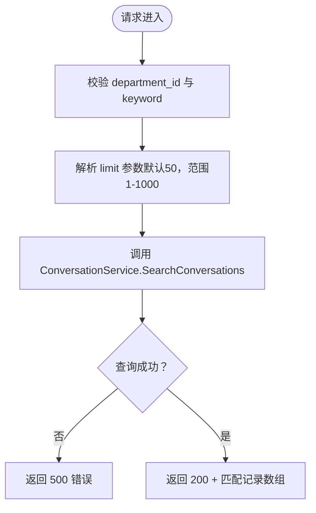
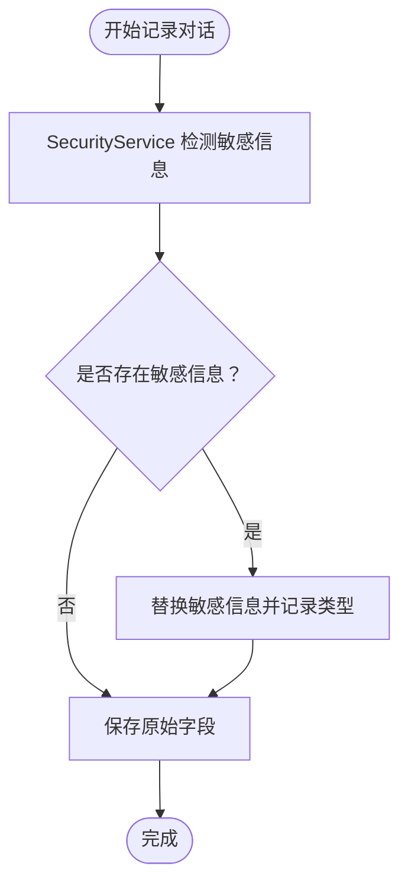
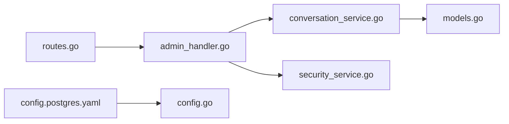

# 对话历史查询

<cite>
**本文档引用的文件**
- [internal/api/routes.go](file://internal/api/routes.go)
- [internal/api/handlers/admin_handler.go](file://internal/api/handlers/admin_handler.go)
- [internal/services/conversation_service.go](file://internal/services/conversation_service.go)
- [internal/models/models.go](file://internal/models/models.go)
- [internal/services/security_service.go](file://internal/services/security_service.go)
- [configs/config.postgres.yaml](file://configs/config.postgres.yaml)
- [internal/config/config.go](file://internal/config/config.go)
- [internal/api/handlers/admin_handler_test.go](file://internal/api/handlers/admin_handler_test.go)
</cite>

## 目录
1. [简介](#简介)
2. [项目结构](#项目结构)
3. [核心组件](#核心组件)
4. [架构总览](#架构总览)
5. [详细组件分析](#详细组件分析)
6. [依赖关系分析](#依赖关系分析)
7. [性能考虑](#性能考虑)
8. [故障排除指南](#故障排除指南)
9. [结论](#结论)
10. [附录](#附录)

## 简介
本文件面向 Wolink-Core 的管理员用户，提供对话历史查询接口的完整 API 文档。重点覆盖以下能力：
- 列出对话记录：GET /admin/conversations（支持部门过滤与分页）
- 对话详情查询：基于对话 ID 查询单条记录
- 对话内容检索：按关键词在用户消息与助手消息中进行模糊搜索
- 敏感信息脱敏：在请求与响应中自动识别并替换敏感信息
- 数据保留策略：基于数据库索引与查询条件的高效检索
- 批量导出与隐私保护：结合现有通信日志能力，支持合规导出与隐私保护

该文档旨在帮助开发者与运维人员快速理解接口行为、数据结构与安全策略，并提供排障建议与最佳实践。

## 项目结构
围绕对话历史查询相关的代码主要分布在以下模块：
- 路由层：定义 /admin/conversations 的访问路径与中间件
- 处理器层：AdminHandler 提供对话历史查询逻辑
- 服务层：ConversationService 提供历史查询与搜索能力
- 模型层：Conversation 定义对话记录的数据结构
- 安全服务：SecurityService 提供敏感信息检测与替换
- 配置：PostgreSQL 配置与安全模式配置

**图表来源**
- [internal/api/routes.go:118-119](file://internal/api/routes.go#L118-L119)
- [internal/api/handlers/admin_handler.go:222-250](file://internal/api/handlers/admin_handler.go#L222-L250)
- [internal/services/conversation_service.go:28-49](file://internal/services/conversation_service.go#L28-L49)
- [internal/models/models.go:90-116](file://internal/models/models.go#L90-L116)
- [internal/services/security_service.go:29-59](file://internal/services/security_service.go#L29-L59)
- [configs/config.postgres.yaml:23-32](file://configs/config.postgres.yaml#L23-L32)
- [internal/config/config.go:78-82](file://internal/config/config.go#L78-L82)

**章节来源**
- [internal/api/routes.go:118-119](file://internal/api/routes.go#L118-L119)
- [internal/api/handlers/admin_handler.go:222-250](file://internal/api/handlers/admin_handler.go#L222-L250)
- [internal/services/conversation_service.go:28-49](file://internal/services/conversation_service.go#L28-L49)
- [internal/models/models.go:90-116](file://internal/models/models.go#L90-L116)
- [internal/services/security_service.go:29-59](file://internal/services/security_service.go#L29-L59)
- [configs/config.postgres.yaml:23-32](file://configs/config.postgres.yaml#L23-L32)
- [internal/config/config.go:78-82](file://internal/config/config.go#L78-L82)

## 核心组件
- 路由与鉴权
  - /admin/conversations 由路由层注册，需管理员身份认证与授权
- 处理器
  - AdminHandler.ListConversations 负责参数校验、分页限制与调用服务层
- 服务层
  - ConversationService.GetConversationHistory 支持按部门过滤与倒序分页
  - ConversationService.SearchConversations 支持关键词模糊搜索
- 模型层
  - Conversation 定义对话记录字段，包括用户消息、助手消息、敏感信息标记等
- 安全服务
  - SecurityService.DetectAndReplaceSensitiveInfo 在对话记录写入前进行敏感信息检测与替换

**章节来源**
- [internal/api/routes.go:118-119](file://internal/api/routes.go#L118-L119)
- [internal/api/handlers/admin_handler.go:222-250](file://internal/api/handlers/admin_handler.go#L222-L250)
- [internal/services/conversation_service.go:28-49](file://internal/services/conversation_service.go#L28-L49)
- [internal/models/models.go:90-116](file://internal/models/models.go#L90-L116)
- [internal/services/security_service.go:29-59](file://internal/services/security_service.go#L29-L59)

## 架构总览
下图展示对话历史查询的端到端流程：路由接收请求 → 管理员鉴权 → 参数校验 → 服务层查询 → 返回结果。

**图表来源**
- [internal/api/routes.go:118-119](file://internal/api/routes.go#L118-L119)
- [internal/api/handlers/admin_handler.go:222-250](file://internal/api/handlers/admin_handler.go#L222-L250)
- [internal/services/conversation_service.go:28-37](file://internal/services/conversation_service.go#L28-L37)

## 详细组件分析

### 列出对话记录接口（/admin/conversations）
- 方法与路径
  - GET /admin/conversations
- 认证与授权
  - 需要管理员身份认证与 /admin/conversations 权限
- 查询参数
  - department_id: 必填，必须为正整数
  - limit: 可选，默认 50，范围 1-1000
- 响应
  - 成功：200 OK，返回对话记录数组
  - 失败：400/500，返回错误信息
- 分页机制
  - 服务层按 created_at 倒序排序并限制数量
- 错误场景
  - 缺少 department_id：400
  - department_id 非法：400
  - 数据库查询失败：500

**图表来源**
- [internal/api/handlers/admin_handler.go:222-250](file://internal/api/handlers/admin_handler.go#L222-L250)
- [internal/services/conversation_service.go:28-37](file://internal/services/conversation_service.go#L28-L37)

**章节来源**
- [internal/api/routes.go:118-119](file://internal/api/routes.go#L118-L119)
- [internal/api/handlers/admin_handler.go:222-250](file://internal/api/handlers/admin_handler.go#L222-L250)
- [internal/services/conversation_service.go:28-37](file://internal/services/conversation_service.go#L28-L37)
- [internal/api/handlers/admin_handler_test.go:351-377](file://internal/api/handlers/admin_handler_test.go#L351-L377)

### 对话详情查询接口
- 方法与路径
  - GET /admin/conversations/:id
- 功能说明
  - 通过对话 ID 查询单条记录
  - 当前仓库未提供该接口的具体实现，建议在路由层新增对应路由与处理器方法
- 数据结构
  - 使用 Conversation 模型字段，包含用户消息、助手消息、敏感信息标记等

**图表来源**
- [internal/models/models.go:90-116](file://internal/models/models.go#L90-L116)

**章节来源**
- [internal/models/models.go:90-116](file://internal/models/models.go#L90-L116)

### 对话内容检索接口（关键词搜索）
- 方法与路径
  - GET /admin/conversations/search?department_id=1&keyword=xxx&limit=50
- 功能说明
  - 在用户消息与助手消息中进行模糊搜索
  - 支持分页参数 limit（默认 50，范围 1-1000）
- 实现要点
  - 服务层使用 ILIKE 进行大小写不敏感匹配
  - 按 created_at 倒序排序并限制数量

**图表来源**
- [internal/services/conversation_service.go:39-49](file://internal/services/conversation_service.go#L39-L49)

**章节来源**
- [internal/services/conversation_service.go:39-49](file://internal/services/conversation_service.go#L39-L49)

### 敏感信息脱敏处理
- 触发时机
  - 在对话记录写入前，对用户消息与系统提示进行敏感信息检测与替换
- 检测规则
  - 配置项包含手机号、身份证号、银行卡号等正则模式
  - 默认替换为占位符（如 [PHONE]、[ID_CARD]、[BANK_CARD]）
- 影响范围
  - 写入数据库的 user_message、system_prompt 字段已脱敏
  - 记录 has_sensitive_info 与 sensitive_types 字段用于标识与追踪

**图表来源**
- [internal/services/security_service.go:29-59](file://internal/services/security_service.go#L29-L59)
- [configs/config.postgres.yaml:25-32](file://configs/config.postgres.yaml#L25-L32)
- [internal/config/config.go:78-82](file://internal/config/config.go#L78-L82)

**章节来源**
- [internal/services/security_service.go:29-59](file://internal/services/security_service.go#L29-L59)
- [configs/config.postgres.yaml:25-32](file://configs/config.postgres.yaml#L25-L32)
- [internal/config/config.go:78-82](file://internal/config/config.go#L78-L82)

### 数据保留策略
- 存储介质
  - 使用 PostgreSQL（默认配置），对话记录持久化至 Conversation 表
- 索引与查询
  - created_at 字段建立索引，支持按时间倒序高效检索
  - department_id 作为过滤条件，建议在生产环境中确保该字段有索引
- 分页与性能
  - limit 参数限制返回数量，避免一次性返回过多数据
  - 建议在高并发场景下对数据库连接池与查询进行优化

**章节来源**
- [configs/config.postgres.yaml:5-12](file://configs/config.postgres.yaml#L5-L12)
- [internal/models/models.go:111](file://internal/models/models.go#L111)
- [internal/services/conversation_service.go:28-37](file://internal/services/conversation_service.go#L28-L37)

### 对话导出功能与批量操作
- 导出能力现状
  - 当前仓库未提供专门的导出接口
  - 可通过 /admin/conversations 与 /admin/conversations/search 获取数据，再由客户端进行导出
- 批量操作建议
  - 建议在路由层新增批量导出接口，支持按部门与时间范围导出
  - 导出格式可采用 CSV/JSON，结合分页参数实现大体量数据分批导出
- 隐私保护
  - 导出前对敏感信息进行二次脱敏处理
  - 控制导出范围与权限，避免越权访问

**章节来源**
- [internal/api/routes.go:118-119](file://internal/api/routes.go#L118-L119)
- [internal/services/conversation_service.go:28-49](file://internal/services/conversation_service.go#L28-L49)

## 依赖关系分析
- 组件耦合
  - 路由层仅负责请求转发，处理器层承担业务逻辑，服务层封装数据访问，职责清晰
- 外部依赖
  - 数据库：PostgreSQL（默认）
  - 安全配置：敏感信息正则与替换模式
- 循环依赖
  - 未发现循环依赖，模块间单向依赖

**图表来源**
- [internal/api/routes.go:118-119](file://internal/api/routes.go#L118-L119)
- [internal/api/handlers/admin_handler.go:222-250](file://internal/api/handlers/admin_handler.go#L222-L250)
- [internal/services/conversation_service.go:28-49](file://internal/services/conversation_service.go#L28-L49)
- [internal/models/models.go:90-116](file://internal/models/models.go#L90-L116)
- [internal/services/security_service.go:29-59](file://internal/services/security_service.go#L29-L59)
- [configs/config.postgres.yaml:23-32](file://configs/config.postgres.yaml#L23-L32)
- [internal/config/config.go:78-82](file://internal/config/config.go#L78-L82)

**章节来源**
- [internal/api/routes.go:118-119](file://internal/api/routes.go#L118-L119)
- [internal/api/handlers/admin_handler.go:222-250](file://internal/api/handlers/admin_handler.go#L222-L250)
- [internal/services/conversation_service.go:28-49](file://internal/services/conversation_service.go#L28-L49)
- [internal/models/models.go:90-116](file://internal/models/models.go#L90-L116)
- [internal/services/security_service.go:29-59](file://internal/services/security_service.go#L29-L59)
- [configs/config.postgres.yaml:23-32](file://configs/config.postgres.yaml#L23-L32)
- [internal/config/config.go:78-82](file://internal/config/config.go#L78-L82)

## 性能考虑
- 查询性能
  - created_at 倒序 + limit 限制，适合高频查询场景
  - 建议为 department_id 建立索引，提升按部门过滤效率
- 分页参数
  - limit 默认 50，最大 1000，避免单次返回过大数据集
- 数据库连接池
  - 根据业务峰值调整连接池大小与超时设置
- 缓存策略
  - 对热点部门的近期对话可考虑短期缓存，降低数据库压力

[本节为通用性能建议，不直接分析具体文件]

## 故障排除指南
- 常见错误与排查
  - 400：缺少或非法 department_id
    - 检查请求参数是否正确传递
    - 参考测试用例验证边界情况
  - 500：数据库查询失败
    - 检查数据库连接配置与权限
    - 查看服务日志定位异常
- 单元测试参考
  - 缺少 department_id：期望 400
  - 非法 department_id：期望 400
  - 有效参数：期望 200

**章节来源**
- [internal/api/handlers/admin_handler_test.go:351-377](file://internal/api/handlers/admin_handler_test.go#L351-L377)
- [internal/api/handlers/admin_handler.go:222-250](file://internal/api/handlers/admin_handler.go#L222-L250)

## 结论
Wolink-Core 的对话历史查询接口以清晰的分层设计实现了按部门过滤与分页查询，并内置敏感信息脱敏能力。通过合理的索引与分页参数，可在保证性能的同时满足日常审计与检索需求。建议后续补充对话详情查询、关键词搜索与导出接口，进一步完善数据治理与合规能力。

[本节为总结性内容，不直接分析具体文件]

## 附录

### API 定义概览
- 列出对话记录
  - 方法：GET
  - 路径：/admin/conversations
  - 查询参数：department_id（必填，正整数）、limit（可选，默认 50，1-1000）
  - 响应：200 OK + 对话记录数组；400/500 错误
- 对话详情查询（建议新增）
  - 方法：GET
  - 路径：/admin/conversations/:id
  - 响应：200 OK + 单条对话记录；404 未找到
- 对话内容检索（建议新增）
  - 方法：GET
  - 路径：/admin/conversations/search
  - 查询参数：department_id（必填）、keyword（必填）、limit（可选，默认 50，1-1000）
  - 响应：200 OK + 匹配记录数组；500 错误

**章节来源**
- [internal/api/routes.go:118-119](file://internal/api/routes.go#L118-L119)
- [internal/api/handlers/admin_handler.go:222-250](file://internal/api/handlers/admin_handler.go#L222-L250)
- [internal/services/conversation_service.go:39-49](file://internal/services/conversation_service.go#L39-L49)

### 数据模型字段说明（Conversation）
- 关键字段
  - id：对话唯一标识（UUID）
  - department_id：所属部门 ID
  - user_message：用户输入（已脱敏）
  - system_prompt：系统提示（已脱敏）
  - assistant_message：助手输出
  - tokens_used：消耗 Token 数
  - response_time：响应耗时（毫秒）
  - has_sensitive_info：是否包含敏感信息
  - sensitive_types：敏感信息类型集合（JSON）
  - created_at/updated_at：创建与更新时间

**章节来源**
- [internal/models/models.go:90-116](file://internal/models/models.go#L90-L116)