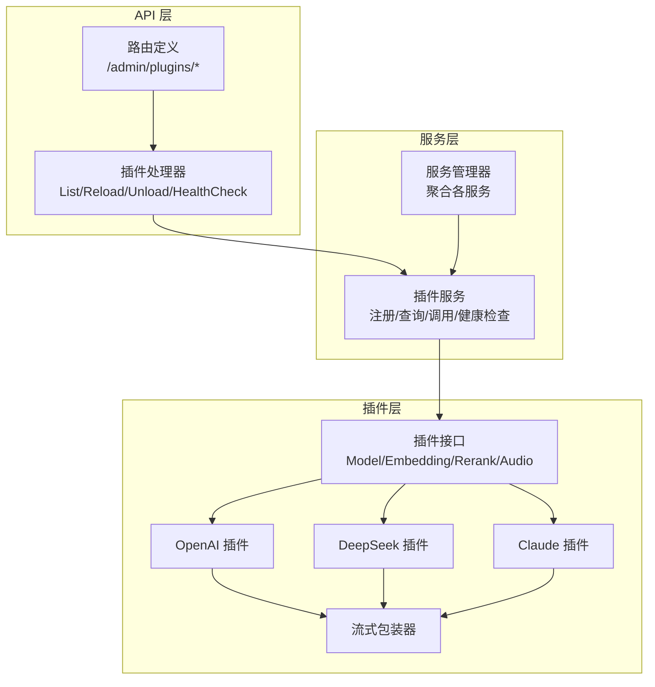
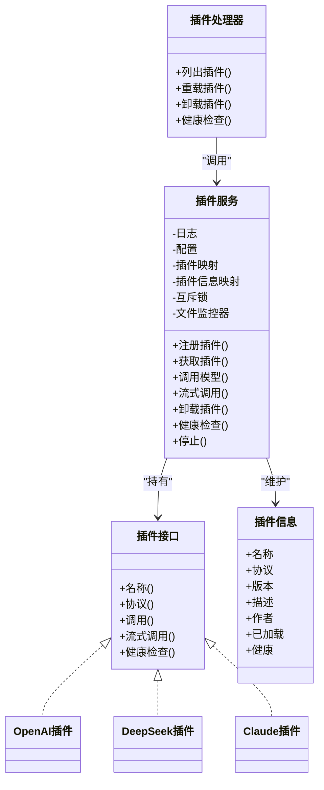
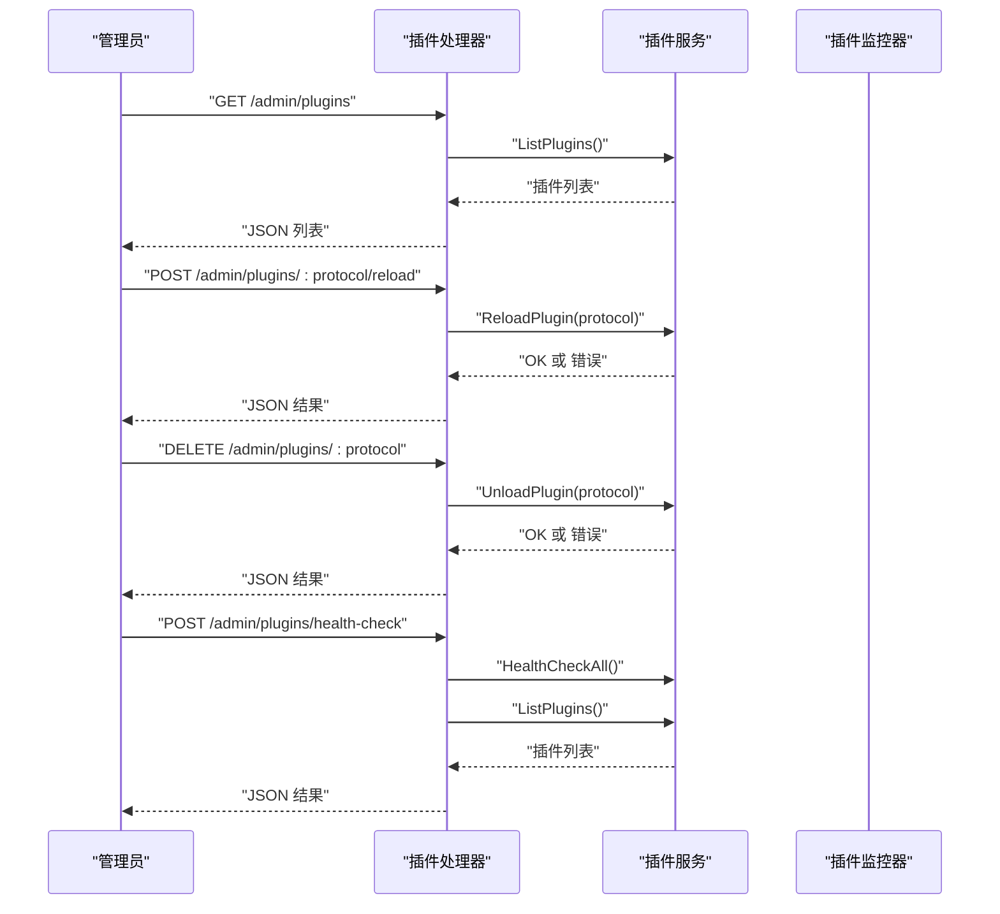
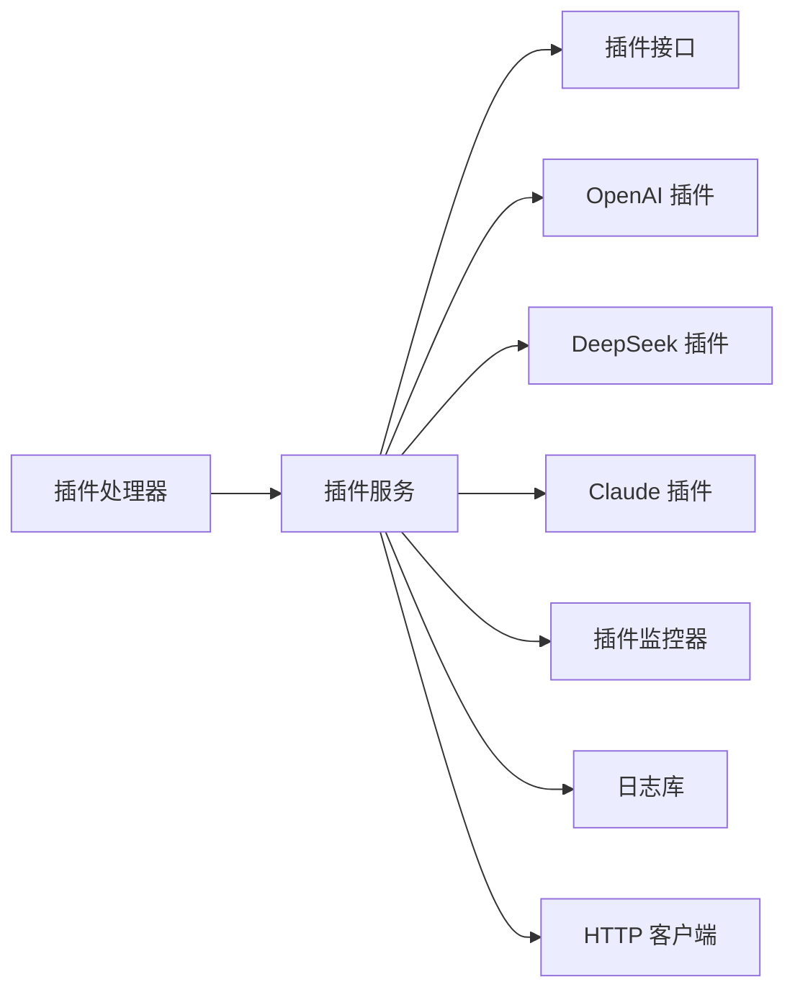

# 插件管理

<cite>
**本文引用的文件**
- [internal/api/handlers/plugin_handler.go](file://internal/api/handlers/plugin_handler.go)
- [internal/api/routes.go](file://internal/api/routes.go)
- [internal/services/plugin_service.go](file://internal/services/plugin_service.go)
- [internal/services/service_manager.go](file://internal/services/service_manager.go)
- [internal/plugins/interface.go](file://internal/plugins/interface.go)
- [internal/plugins/plugin_openai.go](file://internal/plugins/plugin_openai.go)
- [internal/plugins/plugin_deepseek.go](file://internal/plugins/plugin_deepseek.go)
- [internal/plugins/plugin_claude.go](file://internal/plugins/plugin_claude.go)
- [internal/plugins/stream_wrapper.go](file://internal/plugins/stream_wrapper.go)
- [internal/services/plugin_service_test.go](file://internal/services/plugin_service_test.go)
- [configs/models/qwen3-chat.yaml](file://configs/models/qwen3-chat.yaml)
- [configs/models/qwen3-embedding.yaml](file://configs/models/qwen3-embedding.yaml)
- [configs/models/qwen3-asr.yaml](file://configs/models/qwen3-asr.yaml)
</cite>

## 目录
1. [简介](#简介)
2. [项目结构](#项目结构)
3. [核心组件](#核心组件)
4. [架构总览](#架构总览)
5. [详细组件分析](#详细组件分析)
6. [依赖关系分析](#依赖关系分析)
7. [性能考量](#性能考量)
8. [故障排查指南](#故障排查指南)
9. [结论](#结论)
10. [附录](#附录)

## 简介
本文件面向 Wolink-Core 的插件管理接口，提供完整的 API 规范与技术文档，覆盖以下能力：
- 插件注册接口
- 插件状态查询接口
- 插件配置更新接口
- 插件健康检查接口
- 插件生命周期管理
- 插件间依赖关系
- 插件版本兼容性
- 插件热更新机制
- 插件开发规范、调试工具、性能监控与故障排查指南

## 项目结构
围绕插件管理的相关模块分布如下：
- API 层：定义管理端路由与处理器
- 服务层：插件服务与服务管理器
- 插件层：插件接口与具体实现（OpenAI、DeepSeek、Claude）
- 工具层：流式包装器与测试用例

图表来源
- [internal/api/routes.go:121-126](file://internal/api/routes.go#L121-L126)
- [internal/api/handlers/plugin_handler.go:24-74](file://internal/api/handlers/plugin_handler.go#L24-L74)
- [internal/services/plugin_service.go:21-53](file://internal/services/plugin_service.go#L21-L53)
- [internal/plugins/interface.go:11-55](file://internal/plugins/interface.go#L11-L55)
- [internal/plugins/plugin_openai.go:18-370](file://internal/plugins/plugin_openai.go#L18-L370)
- [internal/plugins/plugin_deepseek.go:17-235](file://internal/plugins/plugin_deepseek.go#L17-L235)
- [internal/plugins/plugin_claude.go:17-248](file://internal/plugins/plugin_claude.go#L17-L248)
- [internal/plugins/stream_wrapper.go:9-95](file://internal/plugins/stream_wrapper.go#L9-L95)

章节来源
- [internal/api/routes.go:14-129](file://internal/api/routes.go#L14-L129)
- [internal/services/service_manager.go:11-76](file://internal/services/service_manager.go#L11-L76)

## 核心组件
- 插件接口与信息
  - 插件接口定义了统一的调用能力与可选扩展能力（嵌入、重排序、音频）。
  - 插件信息包含名称、协议、版本、作者、加载与健康状态等元数据。
- 插件服务
  - 负责插件注册、查询、调用、卸载、健康检查与文件监控。
  - 内置注册 OpenAI、DeepSeek、Claude 插件；支持外部插件注册。
- 插件处理器
  - 对外暴露管理端 API：列出插件、按协议重载、按协议卸载、全量健康检查。
- 服务管理器
  - 聚合数据库、缓存、日志、配置与各业务服务，包括插件服务。

章节来源
- [internal/plugins/interface.go:11-55](file://internal/plugins/interface.go#L11-L55)
- [internal/services/plugin_service.go:21-53](file://internal/services/plugin_service.go#L21-L53)
- [internal/api/handlers/plugin_handler.go:24-74](file://internal/api/handlers/plugin_handler.go#L24-L74)
- [internal/services/service_manager.go:11-76](file://internal/services/service_manager.go#L11-L76)

## 架构总览
插件管理采用“接口抽象 + 服务编排 + 外部实现”的分层设计：
- 接口层：定义插件统一能力边界。
- 服务层：集中管理插件生命周期、并发安全、健康检查与文件监控。
- 外部实现：不同厂商或协议的插件实现，遵循统一接口。
- API 层：提供管理端 REST 接口，供管理员操作插件。

图表来源
- [internal/plugins/interface.go:11-55](file://internal/plugins/interface.go#L11-L55)
- [internal/services/plugin_service.go:21-53](file://internal/services/plugin_service.go#L21-L53)
- [internal/plugins/plugin_openai.go:18-370](file://internal/plugins/plugin_openai.go#L18-L370)
- [internal/plugins/plugin_deepseek.go:17-235](file://internal/plugins/plugin_deepseek.go#L17-L235)
- [internal/plugins/plugin_claude.go:17-248](file://internal/plugins/plugin_claude.go#L17-L248)
- [internal/api/handlers/plugin_handler.go:24-74](file://internal/api/handlers/plugin_handler.go#L24-L74)

## 详细组件分析

### 插件管理 API 规范
- 路由与权限
  - 管理端路由组 /admin，需管理员鉴权。
  - 路由包括：列出插件、按协议重载、按协议卸载、全量健康检查。
- 请求与响应
  - 列出插件：返回插件列表与数量。
  - 重载插件：接收路径参数 protocol，成功返回成功消息，失败返回错误。
  - 卸载插件：接收路径参数 protocol，成功返回成功消息，失败返回错误。
  - 健康检查：触发全量健康检查后返回消息与插件列表。

章节来源
- [internal/api/routes.go:121-126](file://internal/api/routes.go#L121-L126)
- [internal/api/handlers/plugin_handler.go:24-74](file://internal/api/handlers/plugin_handler.go#L24-L74)

### 插件生命周期管理
- 注册
  - 内置插件在服务初始化时注册；也支持外部插件通过 RegisterPlugin 注册。
- 查询
  - ListPlugins 返回插件信息快照；GetPlugin 按协议获取插件实例。
- 调用
  - CallModel/CallModelStream 将请求转发至对应协议插件；根据插件能力支持嵌入、重排序、音频。
- 卸载
  - UnloadPlugin 删除插件映射并标记为未加载。
- 健康检查
  - HealthCheckAll 标记所有插件健康状态（当前简化为恒真）。
- 文件监控
  - PluginWatcher 定期扫描插件目录，记录文件变更；当前未实现自动重载，仅记录。

图表来源
- [internal/api/handlers/plugin_handler.go:24-74](file://internal/api/handlers/plugin_handler.go#L24-L74)
- [internal/services/plugin_service.go:291-350](file://internal/services/plugin_service.go#L291-L350)

章节来源
- [internal/services/plugin_service.go:55-92](file://internal/services/plugin_service.go#L55-L92)
- [internal/services/plugin_service.go:94-170](file://internal/services/plugin_service.go#L94-L170)
- [internal/services/plugin_service.go:172-196](file://internal/services/plugin_service.go#L172-L196)
- [internal/services/plugin_service.go:291-350](file://internal/services/plugin_service.go#L291-L350)

### 插件接口规范与能力矩阵
- 基础能力
  - 名称与协议：每个插件声明自身名称与支持的协议标识。
  - 非流式与流式调用：统一的上下文、模型配置与请求对象。
  - 健康检查：基于配置进行简单可用性验证。
- 扩展能力
  - 嵌入（EmbeddingPlugin）：支持向量生成。
  - 重排序（RerankPlugin）：支持检索结果重排序。
  - 音频（AudioPlugin）：支持语音转文本与文本转语音。
- 能力判定
  - 插件服务在调用时通过类型断言判断插件是否具备扩展能力。

章节来源
- [internal/plugins/interface.go:11-55](file://internal/plugins/interface.go#L11-L55)
- [internal/services/plugin_service.go:231-289](file://internal/services/plugin_service.go#L231-L289)

### 具体插件实现要点
- OpenAI 兼容插件
  - 支持聊天补全、流式补全、音频转写、文本转语音。
  - 健康检查发送最小请求验证连通性。
- DeepSeek 插件
  - 支持聊天补全与流式补全。
  - 健康检查发送最小请求验证连通性。
- Claude 插件
  - 支持聊天补全与流式补全，并将响应转换为 OpenAI 兼容格式。
  - 健康检查当前简化为恒真。
- 流式包装器
  - 将第三方 SSE/流式响应按行解析，过滤空行与非 data 行，保证客户端稳定消费。

章节来源
- [internal/plugins/plugin_openai.go:18-370](file://internal/plugins/plugin_openai.go#L18-L370)
- [internal/plugins/plugin_deepseek.go:17-235](file://internal/plugins/plugin_deepseek.go#L17-L235)
- [internal/plugins/plugin_claude.go:17-248](file://internal/plugins/plugin_claude.go#L17-L248)
- [internal/plugins/stream_wrapper.go:9-95](file://internal/plugins/stream_wrapper.go#L9-L95)

### 插件间依赖关系
- 协议依赖
  - 不同插件实现对应不同协议（如 openai、deepseek、claude），彼此独立。
- 能力依赖
  - 某些模型配置可能要求特定能力（如嵌入、音频），插件服务在调用时进行能力判定。
- 配置依赖
  - 插件调用依赖模型配置中的连接信息（BaseURL、APIKey、默认参数等）。

章节来源
- [internal/services/plugin_service.go:207-289](file://internal/services/plugin_service.go#L207-L289)
- [configs/models/qwen3-chat.yaml:6](file://configs/models/qwen3-chat.yaml#L6)
- [configs/models/qwen3-embedding.yaml:6](file://configs/models/qwen3-embedding.yaml#L6)
- [configs/models/qwen3-asr.yaml:10](file://configs/models/qwen3-asr.yaml#L10)

### 插件版本兼容性
- 协议一致性
  - 插件通过 Protocol() 返回协议标识，确保调用方按协议路由请求。
- 能力扩展
  - 新增能力（如嵌入、重排序、音频）通过接口扩展实现，不影响现有插件。
- 版本标注
  - 插件信息包含版本字段，便于追踪与审计。

章节来源
- [internal/plugins/interface.go:45-55](file://internal/plugins/interface.go#L45-L55)
- [internal/services/plugin_service.go:55-92](file://internal/services/plugin_service.go#L55-L92)

### 插件热更新机制
- 当前实现
  - 文件监控器定期扫描插件目录，记录文件变更；未实现自动重载。
  - 重载/卸载接口仅更新内存状态，未实际重新加载二进制。
- 建议演进
  - 引入动态加载机制（受限于 Go 的模块加载特性），或通过进程重启+配置下发实现“热替换”。

章节来源
- [internal/services/plugin_service.go:94-170](file://internal/services/plugin_service.go#L94-L170)
- [internal/services/plugin_service.go:304-335](file://internal/services/plugin_service.go#L304-L335)

## 依赖关系分析
- 组件耦合
  - 插件处理器依赖插件服务；插件服务依赖插件接口与具体实现。
  - 服务管理器聚合插件服务，供路由层调用。
- 并发与线程安全
  - 插件服务内部使用互斥锁保护插件映射与信息，保障并发安全。
- 外部依赖
  - HTTP 客户端用于调用第三方模型服务；日志库用于记录运行状态。

图表来源
- [internal/api/handlers/plugin_handler.go:24-74](file://internal/api/handlers/plugin_handler.go#L24-L74)
- [internal/services/plugin_service.go:21-53](file://internal/services/plugin_service.go#L21-L53)
- [internal/plugins/plugin_openai.go:18-370](file://internal/plugins/plugin_openai.go#L18-L370)
- [internal/plugins/plugin_deepseek.go:17-235](file://internal/plugins/plugin_deepseek.go#L17-L235)
- [internal/plugins/plugin_claude.go:17-248](file://internal/plugins/plugin_claude.go#L17-L248)

章节来源
- [internal/services/plugin_service.go:27-28](file://internal/services/plugin_service.go#L27-L28)
- [internal/services/plugin_service_test.go:346-397](file://internal/services/plugin_service_test.go#L346-L397)

## 性能考量
- 并发安全
  - 插件服务使用读写锁保护插件映射，避免竞态；建议在高并发场景下控制插件数量与调用频率。
- 流式传输
  - 流式包装器按行解析并过滤无效数据，减少客户端解析负担；注意网络抖动与超时设置。
- 健康检查
  - 健康检查为轻量级请求，建议周期性执行，避免频繁探测影响上游服务。
- 文件监控
  - 监控器使用定时器降低 CPU 占用；建议合理设置轮询间隔。

章节来源
- [internal/services/plugin_service.go:27-28](file://internal/services/plugin_service.go#L27-L28)
- [internal/plugins/stream_wrapper.go:27-86](file://internal/plugins/stream_wrapper.go#L27-L86)
- [internal/services/plugin_service.go:94-170](file://internal/services/plugin_service.go#L94-L170)

## 故障排查指南
- 常见错误与定位
  - 插件不存在：当按协议查询或调用时，若插件未注册会返回“未找到”错误。
  - 协议不匹配：确认模型配置的协议与插件协议一致。
  - 认证失败：检查连接配置中的 API Key 是否正确。
  - 健康检查失败：查看日志中健康检查的错误信息与上游返回码。
- 日志与可观测性
  - 插件服务与各插件均使用日志库记录关键事件与错误，便于定位问题。
- 单元测试参考
  - 提供并发访问、未知协议、流式读取等测试用例，可作为行为参考与回归测试依据。

章节来源
- [internal/services/plugin_service.go:207-217](file://internal/services/plugin_service.go#L207-L217)
- [internal/services/plugin_service_test.go:115-139](file://internal/services/plugin_service_test.go#L115-L139)
- [internal/services/plugin_service_test.go:183-207](file://internal/services/plugin_service_test.go#L183-L207)
- [internal/services/plugin_service_test.go:346-397](file://internal/services/plugin_service_test.go#L346-L397)

## 结论
Wolink-Core 的插件管理以清晰的接口抽象与服务编排为核心，实现了对多协议、多能力插件的统一接入与管理。当前版本侧重于生命周期管理与健康检查，文件监控与动态加载尚属预留能力。建议在后续版本中完善动态加载与自动重载机制，进一步提升运维效率与系统弹性。

## 附录

### API 定义概览
- 列出插件
  - 方法：GET
  - 路径：/admin/plugins
  - 权限：管理员
  - 响应：插件列表与数量
- 重载插件
  - 方法：POST
  - 路径：/admin/plugins/:protocol/reload
  - 权限：管理员
  - 参数：protocol（路径参数）
  - 响应：成功消息或错误
- 卸载插件
  - 方法：DELETE
  - 路径：/admin/plugins/:protocol
  - 权限：管理员
  - 参数：protocol（路径参数）
  - 响应：成功消息或错误
- 健康检查
  - 方法：POST
  - 路径：/admin/plugins/health-check
  - 权限：管理员
  - 响应：消息与插件列表

章节来源
- [internal/api/routes.go:121-126](file://internal/api/routes.go#L121-L126)
- [internal/api/handlers/plugin_handler.go:24-74](file://internal/api/handlers/plugin_handler.go#L24-L74)

### 插件开发规范
- 接口实现
  - 必须实现基础接口能力；如支持嵌入/重排序/音频，需实现相应扩展接口。
- 健康检查
  - 建议实现轻量级健康检查，避免对上游造成压力。
- 错误处理
  - 明确区分上游错误与参数错误，返回可诊断的错误信息。
- 流式支持
  - 如支持流式，确保输出格式符合预期，必要时使用流式包装器。

章节来源
- [internal/plugins/interface.go:11-55](file://internal/plugins/interface.go#L11-L55)
- [internal/plugins/plugin_openai.go:195-229](file://internal/plugins/plugin_openai.go#L195-L229)
- [internal/plugins/plugin_deepseek.go:204-234](file://internal/plugins/plugin_deepseek.go#L204-L234)
- [internal/plugins/plugin_claude.go:150-161](file://internal/plugins/plugin_claude.go#L150-L161)

### 调试工具与技巧
- 日志级别
  - 使用 Debug 级别观察请求与响应详情，Release 级别聚焦关键错误。
- 单元测试
  - 参考并发访问、未知协议、流式读取等测试用例，快速验证行为。
- 配置校验
  - 检查模型配置中的协议、BaseURL、APIKey、默认参数是否正确。

章节来源
- [internal/services/plugin_service_test.go:346-397](file://internal/services/plugin_service_test.go#L346-L397)
- [configs/models/qwen3-chat.yaml:6](file://configs/models/qwen3-chat.yaml#L6)
- [configs/models/qwen3-embedding.yaml:6](file://configs/models/qwen3-embedding.yaml#L6)
- [configs/models/qwen3-asr.yaml:10](file://configs/models/qwen3-asr.yaml#L10)