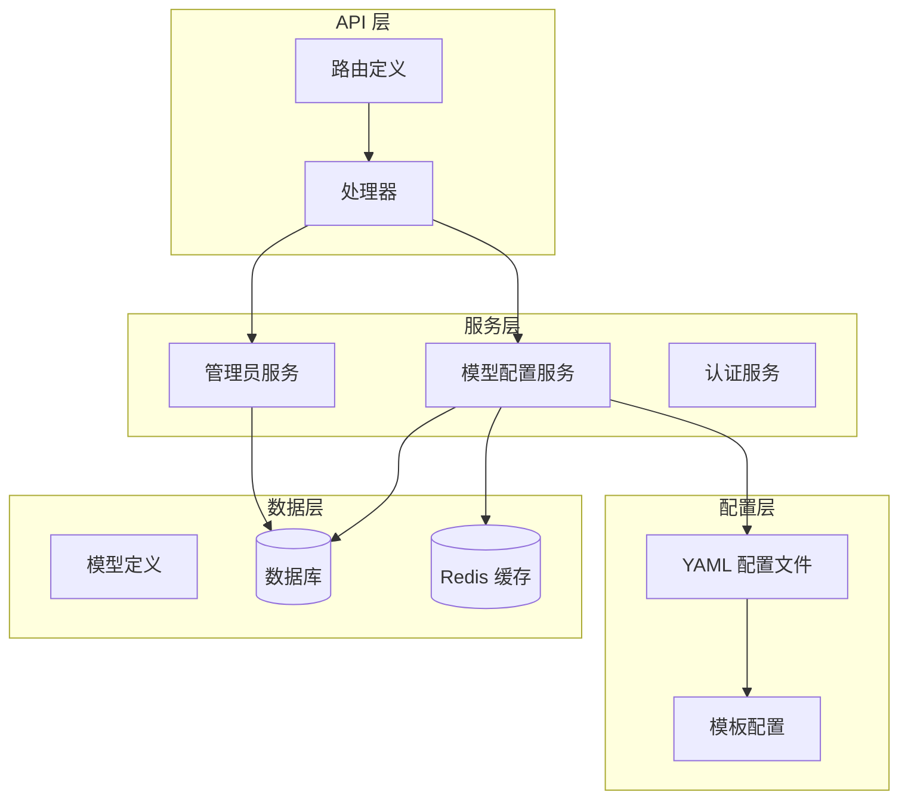
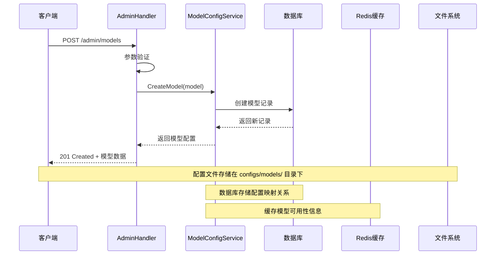
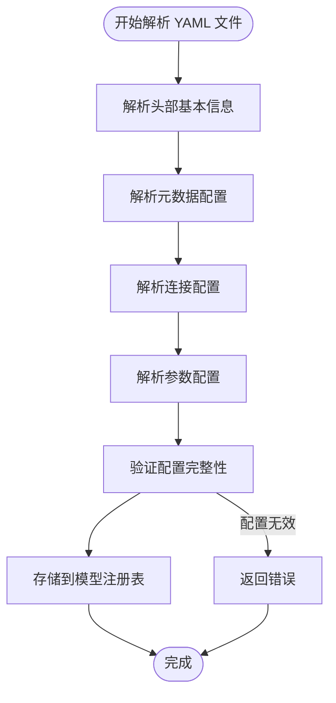
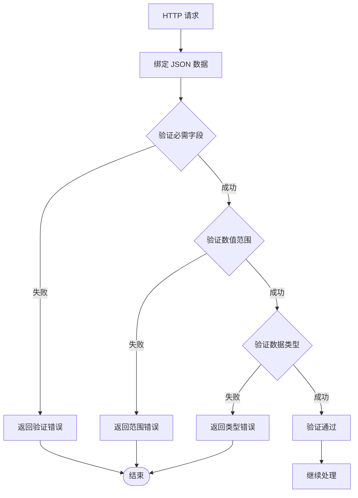
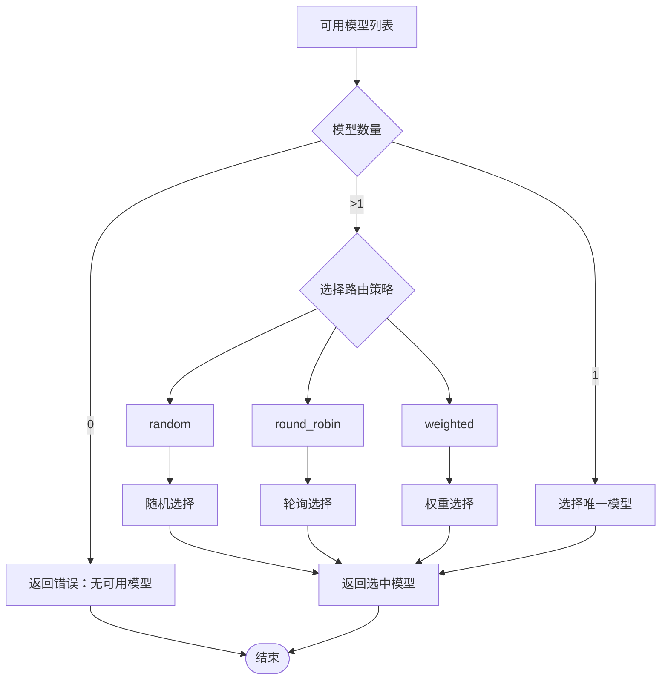
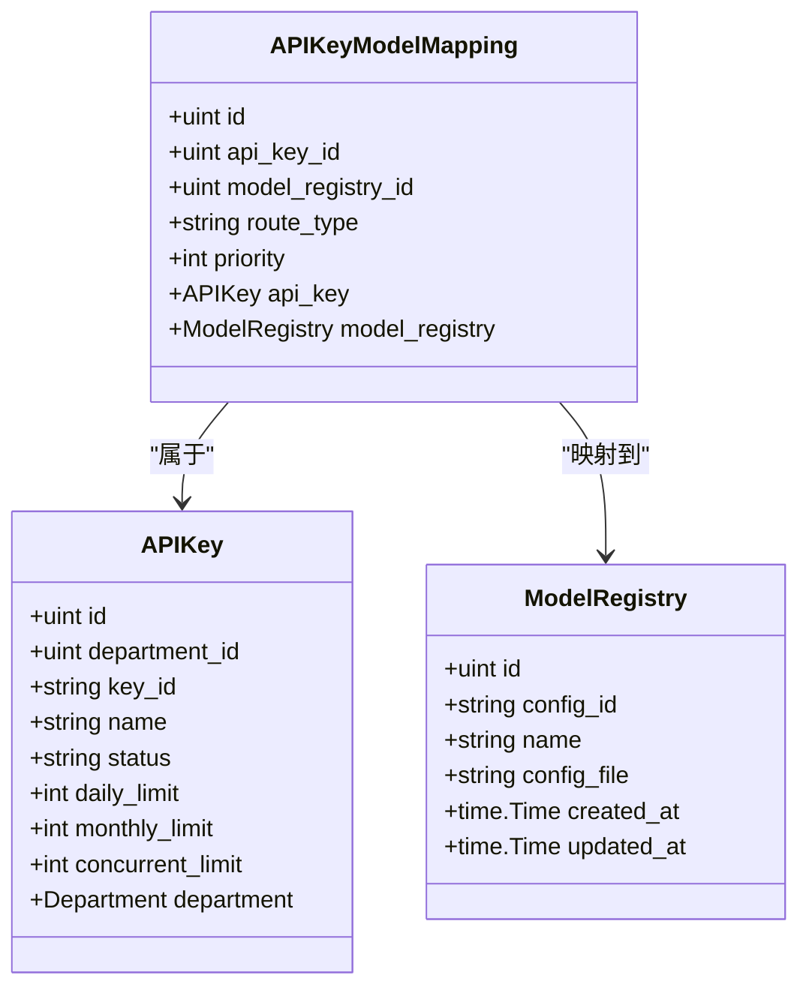
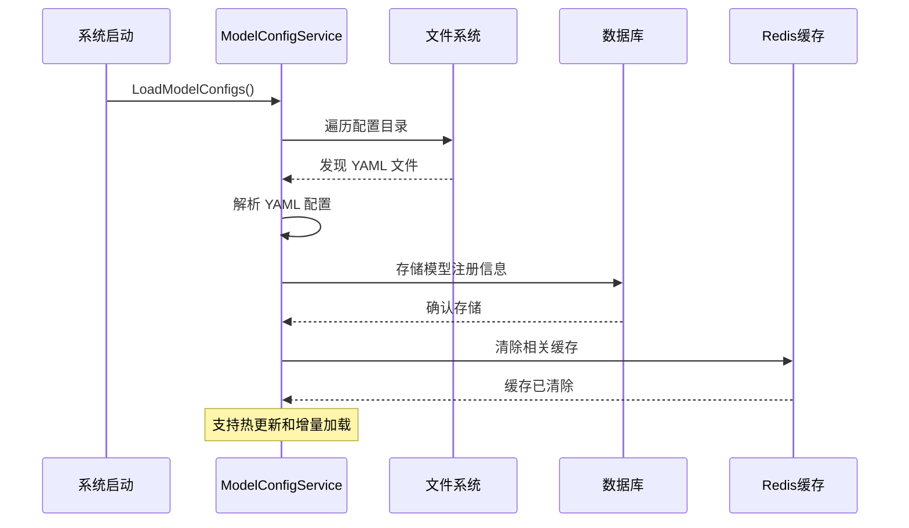
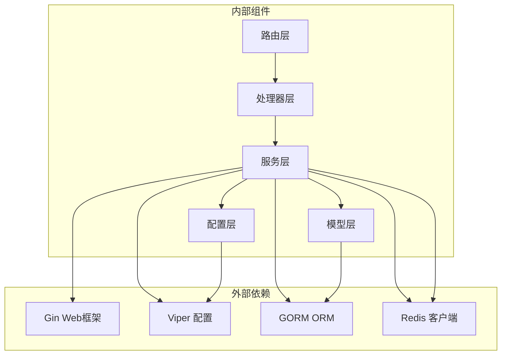

# 模型配置管理

<cite>
**本文档引用的文件**
- [routes.go](file://internal/api/routes.go)
- [admin_handler.go](file://internal/api/handlers/admin_handler.go)
- [model_config_service.go](file://internal/services/model_config_service.go)
- [models.go](file://internal/models/models.go)
- [common.go](file://internal/api/handlers/common.go)
- [config.go](file://internal/config/config.go)
- [qwen3-chat.yaml](file://configs/models/qwen3-chat.yaml)
- [qwen3-embedding.yaml](file://configs/models/qwen3-embedding.yaml)
- [qwen-tts.yaml](file://configs/models/qwen-tts.yaml)
- [qwen3-asr.yaml](file://configs/models/qwen3-asr.yaml)
- [claude-3.yaml](file://configs/models/claude-3.yaml)
- [deepseek-v3.yaml](file://configs/models/deepseek-v3.yaml)
- [gpt-4.yaml](file://configs/templates/gpt-4.yaml)
- [test-model.yaml](file://test_configs/test-model.yaml)
</cite>

## 目录
1. [简介](#简介)
2. [项目结构](#项目结构)
3. [核心组件](#核心组件)
4. [架构概览](#架构概览)
5. [详细组件分析](#详细组件分析)
6. [依赖关系分析](#依赖关系分析)
7. [性能考虑](#性能考虑)
8. [故障排除指南](#故障排除指南)
9. [结论](#结论)

## 简介

Wolink-Core 是一个基于 Go 语言开发的 AI 模型网关系统，提供了完整的模型配置管理功能。本文档专注于模型配置管理接口，包括创建、列出、更新和删除模型配置的完整 API 文档。

该系统支持多种协议（OpenAI、Claude、DeepSeek），提供灵活的参数配置、权重分配和可用性状态管理。所有配置通过 YAML 文件进行管理，支持动态加载和热更新机制。

## 项目结构

Wolink-Core 采用分层架构设计，主要包含以下核心模块：



**图表来源**
- [routes.go:14-129](file://internal/api/routes.go#L14-L129)
- [admin_handler.go:134-197](file://internal/api/handlers/admin_handler.go#L134-L197)
- [model_config_service.go:22-36](file://internal/services/model_config_service.go#L22-L36)

**章节来源**
- [routes.go:14-129](file://internal/api/routes.go#L14-L129)
- [config.go:84-86](file://internal/config/config.go#L84-L86)

## 核心组件

### 模型配置数据结构

系统使用统一的模型配置数据结构来表示不同类型的 AI 模型：

```mermaid
classDiagram
class ModelConfig {
+string id
+string name
+string icon_uri
+string icon_url
+map[string]string description
+string protocol
+CapabilityConfig capability
+ConnectionConfig conn_config
+[]ParameterConfig parameters
+int status
}
class ModelConfigFile {
+string id
+string name
+string icon_uri
+string icon_url
+map[string]string description
+[]ParameterConfig parameters
+MetaConfig meta
+ConnectionConfig conn_config
+int status
}
class ParameterConfig {
+string name
+map[string]string label
+map[string]string desc
+string type
+string min
+string max
+map[string]interface{} default_val
+int precision
+[]OptionConfig options
+StyleConfig style
}
class MetaConfig {
+string protocol
+CapabilityConfig capability
}
class CapabilityConfig {
+bool function_call
+[]string input_modal
+int input_tokens
+bool json_mode
+int max_tokens
+[]string output_modal
+int output_tokens
+bool prefix_caching
+bool reasoning
+bool prefill_response
}
class ConnectionConfig {
+string base_url
+string api_key
+string timeout
+string model
+float64 temperature
+float64 frequency_penalty
+float64 presence_penalty
+int max_tokens
+float64 top_p
+int top_k
+[]string stop
+map[string]interface{} custom
}
ModelConfig --> ParameterConfig : "包含"
ModelConfig --> CapabilityConfig : "包含"
ModelConfig --> ConnectionConfig : "包含"
ModelConfigFile --> ParameterConfig : "包含"
ModelConfigFile --> MetaConfig : "包含"
ModelConfigFile --> ConnectionConfig : "包含"
MetaConfig --> CapabilityConfig : "包含"
```

**图表来源**
- [models.go:56-71](file://internal/models/models.go#L56-L71)
- [models.go:396-406](file://internal/models/models.go#L396-L406)
- [models.go:408-429](file://internal/models/models.go#L408-L429)
- [models.go:431-447](file://internal/models/models.go#L431-L447)
- [models.go:449-462](file://internal/models/models.go#L449-L462)

### 路由配置

系统提供完整的模型配置管理 API 路由：

| 方法 | 路径 | 认证 | 功能描述 |
|------|------|------|----------|
| POST | `/admin/models` | 管理员 | 创建新的模型配置 |
| GET | `/admin/models` | 管理员 | 列出所有模型配置 |
| PUT | `/admin/models/:id` | 管理员 | 更新指定模型配置 |
| DELETE | `/admin/models/:id` | 管理员 | 删除指定模型配置 |

**章节来源**
- [routes.go:111-115](file://internal/api/routes.go#L111-L115)
- [admin_handler.go:134-197](file://internal/api/handlers/admin_handler.go#L134-L197)

## 架构概览

Wolink-Core 的模型配置管理采用分层架构，实现了配置文件与数据库的分离存储：



**图表来源**
- [admin_handler.go:134-148](file://internal/api/handlers/admin_handler.go#L134-L148)
- [model_config_service.go:22-36](file://internal/services/model_config_service.go#L22-L36)

## 详细组件分析

### 模型配置文件格式

系统支持标准化的 YAML 配置文件格式，包含以下核心字段：

#### 基本配置结构



**图表来源**
- [model_config_service.go:63-105](file://internal/services/model_config_service.go#L63-L105)

#### 元数据配置 (MetaConfig)

| 字段 | 类型 | 必需 | 描述 |
|------|------|------|------|
| protocol | string | 是 | 模型协议类型（openai、claude、deepseek） |
| capability | CapabilityConfig | 是 | 模型能力配置 |

#### 能力配置 (CapabilityConfig)

| 字段 | 类型 | 描述 |
|------|------|------|
| function_call | bool | 是否支持函数调用 |
| input_modal | []string | 输入模态类型（text、image、audio） |
| input_tokens | int | 最大输入 tokens 数 |
| json_mode | bool | 是否支持 JSON 模式 |
| max_tokens | int | 最大输出 tokens 数 |
| output_modal | []string | 输出模态类型（text、audio） |
| output_tokens | int | 最大输出 tokens 数 |
| prefix_caching | bool | 是否支持前缀缓存 |
| reasoning | bool | 是否支持推理 |
| prefill_response | bool | 是否支持预填充响应 |

#### 连接配置 (ConnectionConfig)

| 字段 | 类型 | 描述 |
|------|------|------|
| base_url | string | API 基础 URL |
| api_key | string | API 密钥 |
| timeout | string | 请求超时时间 |
| model | string | 模型名称 |
| temperature | float64 | 生成随机性 |
| frequency_penalty | float64 | 频率惩罚 |
| presence_penalty | float64 | 存在惩罚 |
| max_tokens | int | 最大 tokens 数 |
| top_p | float64 | Top-P 采样 |
| top_k | int | Top-K 采样 |
| stop | []string | 停止序列 |
| custom | map[string]interface{} | 自定义参数 |

### 参数验证规则

系统实现了严格的参数验证机制：



**图表来源**
- [common.go:10-31](file://internal/api/handlers/common.go#L10-L31)

#### 验证标签说明

| 验证标签 | 描述 | 示例 |
|----------|------|------|
| required | 必需字段 | `binding:"required"` |
| min | 最小值 | `binding:"min=1"` |
| max | 最大值 | `binding:"max=100"` |
| oneof | 枚举值 | `binding:"oneof=admin super_admin"` |
| email | 邮箱格式 | `binding:"email"` |
| alphanum | 字母数字 | `binding:"alphanum"` |

### 模型路由规则

系统支持多种模型路由策略：



**图表来源**
- [model_config_service.go:229-253](file://internal/services/model_config_service.go#L229-L253)

#### 路由策略说明

| 策略类型 | 描述 | 实现状态 |
|----------|------|----------|
| random | 随机选择 | 已实现 |
| round_robin | 轮询选择 | 已实现（占位符） |
| weighted | 权重选择 | 已实现（占位符） |

### 权重分配机制

系统支持基于权重的模型分配：



**图表来源**
- [models.go:73-88](file://internal/models/models.go#L73-L88)
- [models.go:45-54](file://internal/models/models.go#L45-L54)
- [models.go:20-43](file://internal/models/models.go#L20-L43)

### 可用性状态管理

系统提供完整的模型状态管理：

| 状态值 | 含义 | 描述 |
|--------|------|------|
| 0 | inactive | 模型不可用 |
| 1 | active | 模型可用 |
| 2 | maintenance | 维护中 |

状态管理通过 `status` 字段控制，影响模型的可用性和路由选择。

### 动态加载机制

系统实现了智能的配置文件动态加载：



**图表来源**
- [model_config_service.go:38-60](file://internal/services/model_config_service.go#L38-L60)
- [model_config_service.go:169-199](file://internal/services/model_config_service.go#L169-L199)

## 依赖关系分析

系统各组件之间的依赖关系如下：



**图表来源**
- [routes.go:3-12](file://internal/api/routes.go#L3-L12)
- [model_config_service.go:3-20](file://internal/services/model_config_service.go#L3-L20)

**章节来源**
- [routes.go:3-12](file://internal/api/routes.go#L3-L12)
- [model_config_service.go:3-20](file://internal/services/model_config_service.go#L3-L20)

## 性能考虑

### 缓存策略

系统采用多层缓存机制优化性能：

1. **Redis 缓存**：缓存 API Key 可用模型列表，5 分钟过期
2. **文件系统缓存**：配置文件读取缓存
3. **数据库查询缓存**：常用查询结果缓存

### 查询优化

- 使用预加载（Preload）避免 N+1 查询问题
- 适当的索引设计（唯一索引、普通索引）
- 分页查询支持大数据量场景

### 并发处理

- 基于 Redis 的分布式锁防止并发冲突
- 连接池配置优化数据库连接
- 异步任务处理耗时操作

## 故障排除指南

### 常见错误类型

| 错误类型 | 状态码 | 描述 | 解决方案 |
|----------|--------|------|----------|
| 验证错误 | 400 | 参数验证失败 | 检查请求格式和必填字段 |
| 数据库错误 | 500 | 数据库操作失败 | 检查数据库连接和权限 |
| 文件读取错误 | 500 | 配置文件读取失败 | 检查文件路径和权限 |
| 缓存错误 | 500 | Redis 连接失败 | 检查 Redis 服务状态 |

### 调试建议

1. **启用详细日志**：检查 `log.level` 配置
2. **验证配置文件**：使用 YAML 格式验证工具
3. **监控缓存状态**：检查 Redis 连接和数据
4. **数据库连接测试**：验证数据库连通性

**章节来源**
- [common.go:10-31](file://internal/api/handlers/common.go#L10-L31)

## 结论

Wolink-Core 的模型配置管理接口提供了完整的模型生命周期管理功能。通过标准化的 YAML 配置格式、严格的参数验证、灵活的路由策略和高效的缓存机制，系统能够满足各种 AI 模型网关的配置需求。

主要优势包括：
- **标准化配置**：统一的 YAML 格式确保配置一致性
- **灵活路由**：支持多种路由策略适应不同场景
- **高性能**：多层缓存和优化查询提升性能
- **可扩展性**：模块化设计便于功能扩展
- **易维护性**：清晰的代码结构和完善的文档

该系统为 AI 模型的部署、管理和运维提供了坚实的技术基础，适合在生产环境中稳定运行。