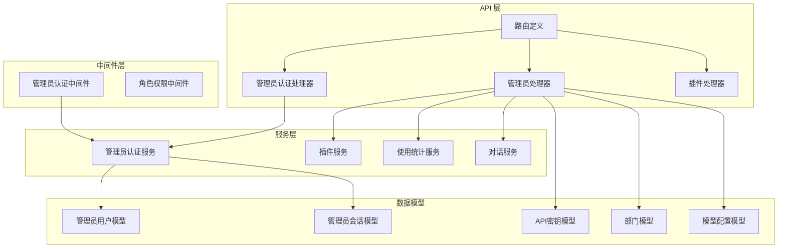
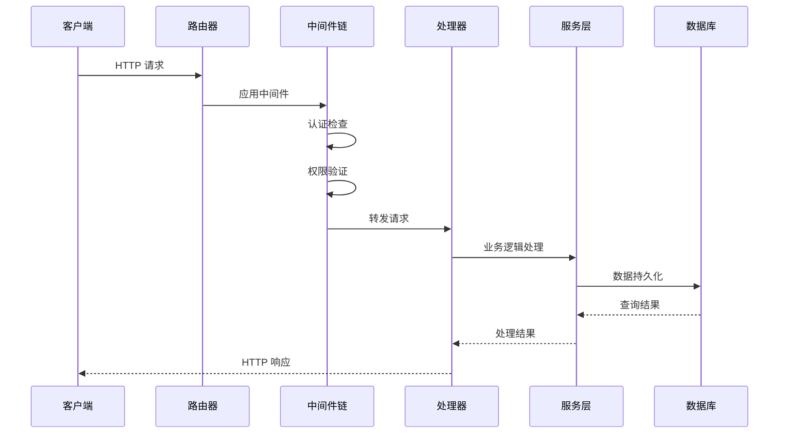
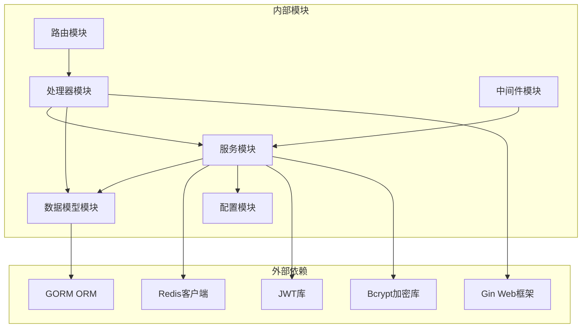

# 管理员后台接口

<cite>
**本文档引用的文件**
- [routes.go](file://internal/api/routes.go)
- [admin_auth_handler.go](file://internal/api/handlers/admin_auth_handler.go)
- [admin_handler.go](file://internal/api/handlers/admin_handler.go)
- [plugin_handler.go](file://internal/api/handlers/plugin_handler.go)
- [admin_auth.go](file://internal/api/middleware/admin_auth.go)
- [admin_auth_service.go](file://internal/services/admin_auth_service.go)
- [models.go](file://internal/models/models.go)
- [add_admin_tables.sql](file://migrations/add_admin_tables.sql)
- [config.go](file://internal/config/config.go)
- [common.go](file://internal/api/handlers/common.go)
- [usage_service.go](file://internal/services/usage_service.go)
- [conversation_service.go](file://internal/services/conversation_service.go)
- [plugin_service.go](file://internal/services/plugin_service.go)
</cite>

## 目录
1. [简介](#简介)
2. [项目结构](#项目结构)
3. [核心组件](#核心组件)
4. [架构概览](#架构概览)
5. [详细组件分析](#详细组件分析)
6. [依赖关系分析](#依赖关系分析)
7. [性能考虑](#性能考虑)
8. [故障排除指南](#故障排除指南)
9. [结论](#结论)

## 简介

Wolink-Core 管理员后台接口提供了完整的后台管理系统，包括管理员认证、用户管理、API Key 管理、部门管理、模型配置管理、使用统计和插件管理等功能。该系统采用基于 JWT 的认证机制，支持多角色权限控制，并提供了完善的错误处理和安全防护措施。

## 项目结构

管理员后台接口主要分布在以下模块中：

**图表来源**
- [routes.go:14-129](file://internal/api/routes.go#L14-L129)
- [admin_auth_handler.go:14-319](file://internal/api/handlers/admin_auth_handler.go#L14-L319)
- [admin_handler.go:14-250](file://internal/api/handlers/admin_handler.go#L14-L250)
- [plugin_handler.go:12-74](file://internal/api/handlers/plugin_handler.go#L12-L74)

**章节来源**
- [routes.go:14-129](file://internal/api/routes.go#L14-L129)

## 核心组件

### 管理员认证系统

管理员认证系统基于 JWT（JSON Web Token）实现，提供安全的身份验证和授权机制：

- **登录认证**：支持用户名密码登录，生成 24 小时有效期的 JWT token
- **会话管理**：使用数据库存储 token 哈希，支持 token 验证和失效
- **密码安全**：使用 bcrypt 进行密码加密存储
- **权限控制**：支持三种角色级别（super_admin、admin、operator）

### 数据模型设计

系统采用 GORM ORM 框架，核心数据模型包括：

- **AdminUser**：管理员用户信息，包含用户名、密码哈希、邮箱、姓名、角色、状态等
- **AdminSession**：管理员会话信息，存储 token 哈希和过期时间
- **APIKey**：API 密钥信息，包含密钥 ID、密钥内容、名称、状态和使用限制
- **Department**：部门信息，用于组织管理和权限隔离
- **ModelConfig**：模型配置信息，支持多种协议和参数配置

**章节来源**
- [models.go:133-160](file://internal/models/models.go#L133-L160)
- [add_admin_tables.sql:1-38](file://migrations/add_admin_tables.sql#L1-L38)

## 架构概览

管理员后台接口采用分层架构设计，确保职责分离和可维护性：

**图表来源**
- [routes.go:14-129](file://internal/api/routes.go#L14-L129)
- [admin_auth.go:14-75](file://internal/api/middleware/admin_auth.go#L14-L75)

## 详细组件分析

### 管理员认证接口

#### 登录接口
- **路径**：`POST /admin/auth/login`
- **认证要求**：无需认证
- **请求参数**：
  - `username`：字符串，必填，长度 3-50 字符
  - `password`：字符串，必填，长度 8-128 字符
- **响应格式**：
  - `message`：字符串，操作结果描述
  - `data.token`：字符串，JWT 认证 token
  - `data.expires_at`：时间戳，token 过期时间
  - `data.user`：用户信息对象
- **权限要求**：无需认证
- **错误处理**：
  - 用户名或密码错误：401 UNAUTHORIZED
  - 参数验证失败：400 BAD REQUEST
  - 服务器内部错误：500 INTERNAL SERVER ERROR

#### 登出接口
- **路径**：`POST /admin/auth/logout`
- **认证要求**：需要管理员认证
- **请求头**：`Authorization: Bearer <token>`
- **响应格式**：标准成功响应
- **权限要求**：管理员认证
- **错误处理**：
  - 缺少认证信息：400 BAD REQUEST
  - 无效的认证格式：400 BAD REQUEST
  - 登出失败：500 INTERNAL SERVER ERROR

#### 获取个人信息接口
- **路径**：`GET /admin/profile`
- **认证要求**：需要管理员认证
- **响应格式**：包含管理员完整信息的对象
- **权限要求**：管理员认证
- **错误处理**：
  - 未找到用户信息：401 UNAUTHORIZED

**章节来源**
- [admin_auth_handler.go:26-136](file://internal/api/handlers/admin_auth_handler.go#L26-L136)
- [admin_auth_service.go:40-139](file://internal/services/admin_auth_service.go#L40-L139)

### 用户管理接口

#### 创建管理员用户
- **路径**：`POST /admin/users`
- **认证要求**：需要超级管理员权限
- **请求参数**：
  - `username`：字符串，必填，3-50 字符，只能包含字母数字
  - `password`：字符串，必填，8-128 字符
  - `email`：字符串，必填，有效的邮箱格式
  - `name`：字符串，必填，1-100 字符
  - `role`：枚举，可选，值为 "admin" 或 "super_admin"
- **响应格式**：创建成功的管理员用户信息
- **权限要求**：超级管理员
- **错误处理**：
  - 用户名已存在：400 BAD REQUEST
  - 邮箱已存在：400 BAD REQUEST
  - 参数验证失败：400 BAD REQUEST

#### 查询管理员列表
- **路径**：`GET /admin/users`
- **认证要求**：需要超级管理员权限
- **响应格式**：管理员用户数组
- **权限要求**：超级管理员

#### 更新管理员信息
- **路径**：`PUT /admin/users/:id`
- **认证要求**：需要超级管理员权限
- **请求参数**：支持部分更新，可包含以下字段：
  - `password`：字符串，8-128 字符
  - `email`：字符串，有效的邮箱格式
  - `name`：字符串
  - `role`：枚举，值为 "super_admin"、"admin" 或 "operator"
  - `status`：枚举，值为 "active" 或 "inactive"
- **权限要求**：超级管理员
- **错误处理**：
  - 无效的用户ID：400 BAD REQUEST
  - 没有需要更新的字段：400 BAD REQUEST

#### 删除管理员用户
- **路径**：`DELETE /admin/users/:id`
- **认证要求**：需要超级管理员权限
- **权限要求**：超级管理员
- **错误处理**：
  - 不能删除自己的账户：400 BAD REQUEST

**章节来源**
- [admin_auth_handler.go:138-319](file://internal/api/handlers/admin_auth_handler.go#L138-L319)
- [admin_auth_service.go:141-248](file://internal/services/admin_auth_service.go#L141-L248)

### API Key 管理接口

#### 创建 API Key
- **路径**：`POST /admin/api-keys`
- **认证要求**：需要管理员认证
- **请求参数**：
  - `department_id`：整数，必填，部门ID
  - `name`：字符串，必填，API Key 名称
- **响应格式**：创建成功的 API Key 信息
- **权限要求**：管理员认证
- **错误处理**：
  - 参数验证失败：400 BAD REQUEST
  - 创建失败：500 INTERNAL SERVER ERROR

#### 查询 API Key 列表
- **路径**：`GET /admin/api-keys`
- **认证要求**：需要管理员认证
- **响应格式**：API Key 数组，包含关联的部门信息
- **权限要求**：管理员认证

#### 更新 API Key
- **路径**：`PUT /admin/api-keys/:id`
- **认证要求**：需要管理员认证
- **请求参数**：支持部分更新，可包含以下字段：
  - `name`：字符串
  - `status`：枚举，值为 "active" 或 "disabled"
  - `daily_limit`：整数，每日调用限制
  - `monthly_limit`：整数，每月调用限制
  - `concurrent_limit`：整数，并发限制
- **权限要求**：管理员认证

#### 删除 API Key
- **路径**：`DELETE /admin/api-keys/:id`
- **认证要求**：需要管理员认证
- **权限要求**：管理员认证

**章节来源**
- [admin_handler.go:26-101](file://internal/api/handlers/admin_handler.go#L26-L101)

### 部门管理接口

#### 创建部门
- **路径**：`POST /admin/departments`
- **认证要求**：需要管理员认证
- **请求参数**：
  - `name`：字符串，必填，部门名称
- **响应格式**：创建成功的部门信息
- **权限要求**：管理员认证

#### 查询部门列表
- **路径**：`GET /admin/departments`
- **认证要求**：需要管理员认证
- **响应格式**：部门数组
- **权限要求**：管理员认证

**章节来源**
- [admin_handler.go:103-132](file://internal/api/handlers/admin_handler.go#L103-L132)

### 模型配置管理接口

#### 创建模型配置
- **路径**：`POST /admin/models`
- **认证要求**：需要管理员认证
- **请求参数**：完整的模型配置对象
- **响应格式**：创建成功的模型配置
- **权限要求**：管理员认证

#### 查询模型配置列表
- **路径**：`GET /admin/models`
- **认证要求**：需要管理员认证
- **响应格式**：模型注册表数组
- **权限要求**：管理员认证

#### 更新模型配置
- **路径**：`PUT /admin/models/:id`
- **认证要求**：需要管理员认证
- **请求参数**：支持部分更新的模型配置对象
- **权限要求**：管理员认证

#### 删除模型配置
- **路径**：`DELETE /admin/models/:id`
- **认证要求**：需要管理员认证
- **权限要求**：管理员认证

**章节来源**
- [admin_handler.go:134-197](file://internal/api/handlers/admin_handler.go#L134-L197)

### 使用统计接口

#### 获取使用统计
- **路径**：`GET /admin/usage/stats`
- **认证要求**：需要管理员认证
- **查询参数**：
  - `department_id`：必填，部门ID
- **响应格式**：包含以下统计信息的对象：
  - `total_calls`：整数，总调用次数
  - `total_tokens`：整数，总token使用量
  - `avg_response_time`：浮点数，平均响应时间
- **权限要求**：管理员认证
- **错误处理**：
  - 缺少 department_id：400 BAD REQUEST
  - 无效的 department_id：400 BAD REQUEST

#### 查询对话记录
- **路径**：`GET /admin/conversations`
- **认证要求**：需要管理员认证
- **查询参数**：
  - `department_id`：必填，部门ID
  - `limit`：可选，整数，默认 50，最大 1000
- **响应格式**：对话记录数组
- **权限要求**：管理员认证

**章节来源**
- [admin_handler.go:199-250](file://internal/api/handlers/admin_handler.go#L199-L250)
- [usage_service.go:25-47](file://internal/services/usage_service.go#L25-L47)
- [conversation_service.go:28-49](file://internal/services/conversation_service.go#L28-L49)

### 插件管理接口

#### 查询插件列表
- **路径**：`GET /admin/plugins`
- **认证要求**：需要管理员认证
- **响应格式**：包含插件信息和数量的对象
- **权限要求**：管理员认证

#### 重新加载插件
- **路径**：`POST /admin/plugins/:protocol/reload`
- **认证要求**：需要管理员认证
- **路径参数**：
  - `protocol`：必填，插件协议
- **响应格式**：操作成功消息
- **权限要求**：管理员认证

#### 卸载插件
- **路径**：`DELETE /admin/plugins/:protocol`
- **认证要求**：需要管理员认证
- **路径参数**：
  - `protocol`：必填，插件协议
- **响应格式**：操作成功消息
- **权限要求**：管理员认证

#### 插件健康检查
- **路径**：`POST /admin/plugins/health-check`
- **认证要求**：需要管理员认证
- **响应格式**：包含检查结果和插件状态的对象
- **权限要求**：管理员认证

**章节来源**
- [plugin_handler.go:24-74](file://internal/api/handlers/plugin_handler.go#L24-L74)
- [plugin_service.go:291-350](file://internal/services/plugin_service.go#L291-L350)

## 依赖关系分析

管理员后台接口的依赖关系如下：

**图表来源**
- [routes.go:3-12](file://internal/api/routes.go#L3-L12)
- [admin_auth_service.go:3-17](file://internal/services/admin_auth_service.go#L3-L17)

### 角色权限体系

系统支持三级角色权限体系：

| 角色 | 权限范围 | 可执行操作 |
|------|----------|------------|
| **operator** | 操作员 | 仅能查看基本统计信息 |
| **admin** | 管理员 | 管理 API Key、部门、模型配置 |
| **super_admin** | 超级管理员 | 完全权限，包括创建和管理其他管理员 |

权限验证通过中间件实现，支持细粒度的权限控制。

**章节来源**
- [admin_auth.go:77-104](file://internal/api/middleware/admin_auth.go#L77-L104)
- [models.go:133-149](file://internal/models/models.go#L133-L149)

## 性能考虑

### 缓存策略
- **会话缓存**：使用 Redis 缓存活跃会话信息
- **统计缓存**：对频繁查询的统计数据进行缓存
- **配置缓存**：模型配置信息缓存以提高访问速度

### 数据库优化
- **索引优化**：为常用查询字段建立索引
- **连接池**：配置合理的数据库连接池大小
- **批量操作**：支持批量查询和更新操作

### 安全考虑
- **密码加密**：使用 bcrypt 进行密码哈希存储
- **JWT 安全**：配置安全的 JWT 密钥和过期时间
- **输入验证**：严格的参数验证和过滤
- **SQL 注入防护**：使用 GORM ORM 防护 SQL 注入

## 故障排除指南

### 常见错误及解决方案

#### 认证相关错误
- **401 未认证**：检查 Authorization 头是否正确设置
- **403 权限不足**：确认用户角色是否具有相应权限
- **400 参数错误**：检查请求参数格式和有效性

#### 数据库相关错误
- **500 数据库连接失败**：检查数据库连接配置
- **404 资源不存在**：确认 ID 是否有效

#### 业务逻辑错误
- **400 业务逻辑错误**：根据具体错误信息调整请求参数

### 调试建议
1. **启用详细日志**：检查系统日志了解错误详情
2. **验证配置**：确认 JWT 密钥和数据库配置正确
3. **测试连接**：验证各服务间的连接状态

**章节来源**
- [admin_auth_handler.go:29-68](file://internal/api/handlers/admin_auth_handler.go#L29-L68)
- [admin_handler.go:33-45](file://internal/api/handlers/admin_handler.go#L33-L45)

## 结论

Wolink-Core 管理员后台接口提供了完整的企业级管理功能，具有以下特点：

1. **安全性**：基于 JWT 的强认证机制，支持多角色权限控制
2. **可扩展性**：模块化设计，支持插件化扩展
3. **易用性**：RESTful API 设计，接口清晰明确
4. **可靠性**：完善的错误处理和异常恢复机制

该系统适合构建企业级 AI 网关的管理后台，为管理员提供全面的系统管理和监控能力。