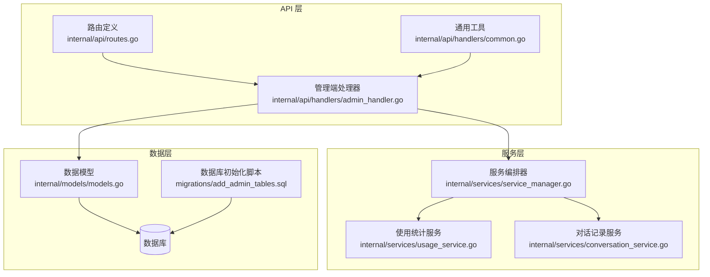
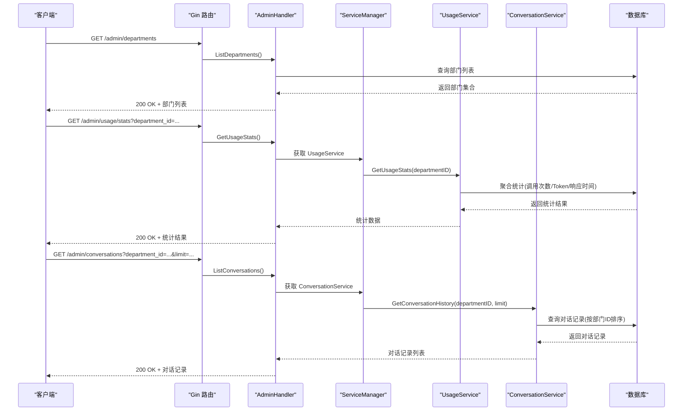
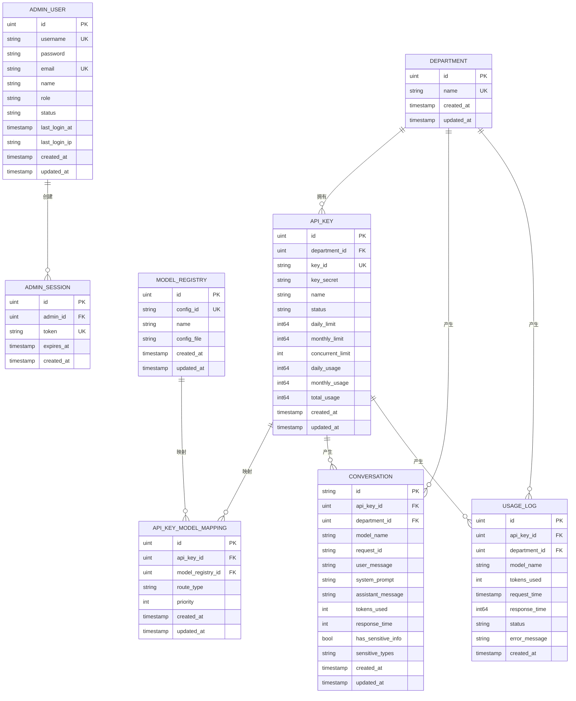
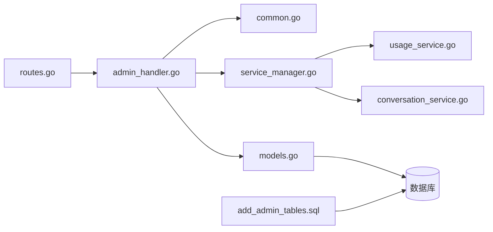

# 部门管理

<cite>
**本文引用的文件**
- [admin_handler.go](file://internal/api/handlers/admin_handler.go)
- [routes.go](file://internal/api/routes.go)
- [models.go](file://internal/models/models.go)
- [service_manager.go](file://internal/services/service_manager.go)
- [conversation_service.go](file://internal/services/conversation_service.go)
- [usage_service.go](file://internal/services/usage_service.go)
- [common.go](file://internal/api/handlers/common.go)
- [add_admin_tables.sql](file://migrations/add_admin_tables.sql)
- [admin_handler_test.go](file://internal/api/handlers/admin_handler_test.go)
</cite>

## 目录
1. [简介](#简介)
2. [项目结构](#项目结构)
3. [核心组件](#核心组件)
4. [架构概览](#架构概览)
5. [详细组件分析](#详细组件分析)
6. [依赖关系分析](#依赖关系分析)
7. [性能考虑](#性能考虑)
8. [故障排查指南](#故障排查指南)
9. [结论](#结论)

## 简介
本文档面向 Wolink-Core 的部门管理接口，提供完整的 API 规范与实现说明。当前已实现的部门相关接口包括：
- 创建部门：POST /admin/departments
- 列出部门：GET /admin/departments
- 查询部门使用统计：GET /admin/usage/stats
- 列出部门对话记录：GET /admin/conversations

同时，文档还解释了部门与 API Key 的关联关系、权限继承机制、部门查询过滤条件、部门树形结构展示与父子关系管理等高级主题，并给出最佳实践与故障排查建议。

## 项目结构
Wolink-Core 的部门管理功能位于以下模块中：
- 路由定义：internal/api/routes.go
- 管理端处理器：internal/api/handlers/admin_handler.go
- 数据模型：internal/models/models.go
- 服务编排：internal/services/service_manager.go
- 业务服务：internal/services/usage_service.go、internal/services/conversation_service.go
- 通用工具：internal/api/handlers/common.go
- 数据库初始化：migrations/add_admin_tables.sql
- 单元测试：internal/api/handlers/admin_handler_test.go

图表来源
- [routes.go:14-129](file://internal/api/routes.go#L14-L129)
- [admin_handler.go:14-250](file://internal/api/handlers/admin_handler.go#L14-L250)
- [models.go:10-43](file://internal/models/models.go#L10-L43)
- [service_manager.go:11-76](file://internal/services/service_manager.go#L11-L76)
- [usage_service.go:25-47](file://internal/services/usage_service.go#L25-L47)
- [conversation_service.go:28-49](file://internal/services/conversation_service.go#L28-L49)
- [common.go:10-31](file://internal/api/handlers/common.go#L10-L31)
- [add_admin_tables.sql:1-38](file://migrations/add_admin_tables.sql#L1-L38)

章节来源
- [routes.go:14-129](file://internal/api/routes.go#L14-L129)
- [admin_handler.go:14-250](file://internal/api/handlers/admin_handler.go#L14-L250)
- [models.go:10-43](file://internal/models/models.go#L10-L43)
- [service_manager.go:11-76](file://internal/services/service_manager.go#L11-L76)
- [usage_service.go:25-47](file://internal/services/usage_service.go#L25-L47)
- [conversation_service.go:28-49](file://internal/services/conversation_service.go#L28-L49)
- [common.go:10-31](file://internal/api/handlers/common.go#L10-L31)
- [add_admin_tables.sql:1-38](file://migrations/add_admin_tables.sql#L1-L38)

## 核心组件
- 路由与中间件
  - 管理端路由组 /admin，统一应用管理员认证中间件与权限控制。
  - 部门管理接口位于 /admin/departments，支持创建与列出。
  - 使用统计与对话记录接口通过查询参数 department_id 进行部门维度筛选。
- 处理器
  - AdminHandler 提供部门创建、列表、使用统计查询、对话记录查询等方法。
  - 统一使用 formatValidationError 将验证错误格式化为用户可读消息。
- 服务层
  - ServiceManager 编排 AuthService、AdminAuthService、UsageService、ConversationService 等服务。
  - UsageService 聚合部门维度的调用次数、Token 使用量、平均响应时间。
  - ConversationService 支持按部门 ID 查询对话历史并支持关键词搜索。
- 数据模型
  - Department 与 APIKey 通过 DepartmentID 关联；APIKey 与 ModelRegistry 通过 APIKeyModelMapping 关联。
  - Conversation 与 Department 关联，用于统计与审计。

章节来源
- [routes.go:84-126](file://internal/api/routes.go#L84-L126)
- [admin_handler.go:103-132](file://internal/api/handlers/admin_handler.go#L103-L132)
- [admin_handler.go:199-250](file://internal/api/handlers/admin_handler.go#L199-L250)
- [service_manager.go:11-76](file://internal/services/service_manager.go#L11-L76)
- [usage_service.go:25-47](file://internal/services/usage_service.go#L25-L47)
- [conversation_service.go:28-49](file://internal/services/conversation_service.go#L28-L49)
- [models.go:10-43](file://internal/models/models.go#L10-L43)

## 架构概览
下图展示了部门管理相关接口的调用链路与数据流向。

图表来源
- [routes.go:107-120](file://internal/api/routes.go#L107-L120)
- [admin_handler.go:124-132](file://internal/api/handlers/admin_handler.go#L124-L132)
- [admin_handler.go:199-250](file://internal/api/handlers/admin_handler.go#L199-L250)
- [service_manager.go:11-76](file://internal/services/service_manager.go#L11-L76)
- [usage_service.go:25-47](file://internal/services/usage_service.go#L25-L47)
- [conversation_service.go:28-49](file://internal/services/conversation_service.go#L28-L49)

## 详细组件分析

### 部门管理接口规范

#### 创建部门
- 方法与路径
  - POST /admin/departments
- 请求体
  - name: string，必填，部门名称
- 成功响应
  - 201 Created + 部门对象
- 错误响应
  - 400 Bad Request：请求体缺失或校验失败
  - 500 Internal Server Error：数据库操作失败
- 实现要点
  - 使用 ShouldBindJSON 校验请求体
  - 通过 ServiceManager.DB 创建 Department
  - 使用 formatValidationError 格式化验证错误

章节来源
- [routes.go:107-109](file://internal/api/routes.go#L107-L109)
- [admin_handler.go:103-121](file://internal/api/handlers/admin_handler.go#L103-L121)
- [common.go:10-31](file://internal/api/handlers/common.go#L10-L31)

#### 列出部门
- 方法与路径
  - GET /admin/departments
- 成功响应
  - 200 OK + 部门对象数组
- 错误响应
  - 500 Internal Server Error：数据库查询失败
- 实现要点
  - 通过 ServiceManager.DB 查询所有 Department

章节来源
- [routes.go:108-109](file://internal/api/routes.go#L108-L109)
- [admin_handler.go:123-132](file://internal/api/handlers/admin_handler.go#L123-L132)

#### 查询部门使用统计
- 方法与路径
  - GET /admin/usage/stats
- 查询参数
  - department_id: uint，必填且必须为有效整数
- 成功响应
  - 200 OK + 统计对象
    - total_calls: long，该部门总调用次数
    - total_tokens: long，该部门总 Token 使用量
    - avg_response_time: double，该部门平均响应时间（毫秒）
- 错误响应
  - 400 Bad Request：缺少 department_id 或值无效
  - 500 Internal Server Error：统计聚合失败
- 实现要点
  - 通过 UsageService.GetUsageStats 聚合统计
  - 使用 GORM Count/Sum/Avg 完成聚合计算

章节来源
- [routes.go:117-119](file://internal/api/routes.go#L117-L119)
- [admin_handler.go:199-220](file://internal/api/handlers/admin_handler.go#L199-L220)
- [usage_service.go:25-47](file://internal/services/usage_service.go#L25-L47)

#### 列出部门对话记录
- 方法与路径
  - GET /admin/conversations
- 查询参数
  - department_id: uint，必填且必须为有效整数
  - limit: int，可选，默认 50，范围 1..1000
- 成功响应
  - 200 OK + 对话记录数组
- 错误响应
  - 400 Bad Request：缺少 department_id 或值无效
  - 500 Internal Server Error：查询失败
- 实现要点
  - 通过 ConversationService.GetConversationHistory 按部门 ID 查询
  - 支持 limit 参数限制返回数量

章节来源
- [routes.go:118-119](file://internal/api/routes.go#L118-L119)
- [admin_handler.go:222-250](file://internal/api/handlers/admin_handler.go#L222-L250)
- [conversation_service.go:28-49](file://internal/services/conversation_service.go#L28-L49)

### 数据模型与关系

图表来源
- [models.go:10-43](file://internal/models/models.go#L10-L43)
- [models.go:45-88](file://internal/models/models.go#L45-L88)
- [models.go:90-131](file://internal/models/models.go#L90-L131)
- [models.go:133-160](file://internal/models/models.go#L133-L160)

章节来源
- [models.go:10-43](file://internal/models/models.go#L10-L43)
- [models.go:45-88](file://internal/models/models.go#L45-L88)
- [models.go:90-131](file://internal/models/models.go#L90-L131)
- [models.go:133-160](file://internal/models/models.go#L133-L160)

### 权限继承与部门层级结构

- 当前实现
  - Department 与 APIKey 之间存在直接的一对多关系（DepartmentID 外键）。
  - APIKey 与 ModelRegistry 通过 APIKeyModelMapping 建立多对多映射，支持路由策略与优先级。
  - Conversation 与 Department 关联，用于统计与审计。
- 权限继承
  - 当前未在代码中实现部门层级（父子关系）与权限继承逻辑。API Key 的访问控制主要基于部门维度与使用限额。
- 建议扩展
  - 引入 Department.parent_id 字段以支持树形结构。
  - 在 AuthService 中增加部门层级的权限判断与继承规则。
  - 在 API Key 与模型映射中引入部门维度的优先级与路由策略。

章节来源
- [models.go:10-43](file://internal/models/models.go#L10-L43)
- [models.go:73-88](file://internal/models/models.go#L73-L88)
- [models.go:90-116](file://internal/models/models.go#L90-L116)

### 部门查询过滤条件

- 使用统计过滤
  - 通过 department_id 查询参数限定统计范围。
- 对话记录过滤
  - 通过 department_id 查询参数限定查询范围。
  - 通过 limit 查询参数限制返回条目数量（默认 50，最大 1000）。
- 搜索能力
  - ConversationService 提供按关键词搜索的能力（按 user_message 或 assistant_message），可在未来扩展到部门维度。

章节来源
- [admin_handler.go:199-250](file://internal/api/handlers/admin_handler.go#L199-L250)
- [conversation_service.go:28-49](file://internal/services/conversation_service.go#L28-L49)

### 部门树形结构与父子关系管理

- 当前状态
  - 代码库中未发现 Department.parent_id 字段或树形遍历逻辑。
- 建议实现
  - 在 Department 模型中添加 parent_id 字段，并建立自引用外键。
  - 提供树形构建算法（如 DFS/BFS）将扁平部门列表转换为树形结构。
  - 在 API 中提供树形展示接口与父子关系变更接口。

章节来源
- [models.go:10-18](file://internal/models/models.go#L10-L18)

### 部门成员分配

- 当前状态
  - 代码库中未发现部门成员（用户）与部门的直接关联关系。
- 建议实现
  - 新增 DepartmentMember 或类似实体，维护用户与部门的多对多关系。
  - 在 AdminHandler 中增加成员管理接口（增删改查）。
  - 结合权限继承机制，实现基于部门层级的资源访问控制。

章节来源
- [models.go:10-43](file://internal/models/models.go#L10-L43)

## 依赖关系分析

图表来源
- [routes.go:14-129](file://internal/api/routes.go#L14-L129)
- [admin_handler.go:14-250](file://internal/api/handlers/admin_handler.go#L14-L250)
- [common.go:10-31](file://internal/api/handlers/common.go#L10-L31)
- [service_manager.go:11-76](file://internal/services/service_manager.go#L11-L76)
- [usage_service.go:25-47](file://internal/services/usage_service.go#L25-L47)
- [conversation_service.go:28-49](file://internal/services/conversation_service.go#L28-L49)
- [models.go:10-43](file://internal/models/models.go#L10-L43)
- [add_admin_tables.sql:1-38](file://migrations/add_admin_tables.sql#L1-L38)

章节来源
- [routes.go:14-129](file://internal/api/routes.go#L14-L129)
- [admin_handler.go:14-250](file://internal/api/handlers/admin_handler.go#L14-L250)
- [service_manager.go:11-76](file://internal/services/service_manager.go#L11-L76)
- [models.go:10-43](file://internal/models/models.go#L10-L43)
- [add_admin_tables.sql:1-38](file://migrations/add_admin_tables.sql#L1-L38)

## 性能考虑
- 查询优化
  - 对 conversations 表按 department_id 与 created_at 建立复合索引，提升按部门与时间排序的查询性能。
  - 对 usage_logs 表按 department_id 与 request_time 建立索引，加速统计聚合。
- 服务层优化
  - 使用分页与 limit 控制返回数量，避免一次性返回大量数据。
  - 将高成本统计任务放入异步队列（如 QueueService）进行后台处理。
- 缓存策略
  - 对高频查询（如部门列表、常用统计）引入缓存层，降低数据库压力。

[本节为通用指导，不直接分析具体文件]

## 故障排查指南
- 常见错误与定位
  - 400 Bad Request：检查请求体字段是否符合绑定约束（如 name 必填）。
  - 400 Bad Request：department_id 缺失或非整数，确认查询参数格式。
  - 500 Internal Server Error：数据库连接异常或查询失败，检查数据库状态与索引。
- 单元测试参考
  - 部门创建：缺失 name 字段应返回 400。
  - 部门列表：应返回 200 且包含至少一个部门。
  - 使用统计：缺失/无效 department_id 应返回 400。
  - 对话记录：缺失/无效 department_id 应返回 400。
- 日志与监控
  - 启用中间件日志与 Prometheus 指标，定位慢查询与异常请求。

章节来源
- [admin_handler_test.go:266-321](file://internal/api/handlers/admin_handler_test.go#L266-L321)
- [admin_handler_test.go:323-377](file://internal/api/handlers/admin_handler_test.go#L323-L377)
- [routes.go:17-29](file://internal/api/routes.go#L17-L29)

## 结论
Wolink-Core 的部门管理接口已实现基础的创建与列表能力，并提供了部门维度的使用统计与对话记录查询。当前版本未包含部门层级结构、权限继承与成员分配等高级特性。建议后续扩展：
- 引入 Department.parent_id 与树形遍历算法。
- 在 AuthService 中实现基于部门层级的权限继承。
- 增加部门成员管理与 API Key 的细粒度权限控制。
- 优化查询性能与引入缓存策略，提升大规模场景下的可用性。