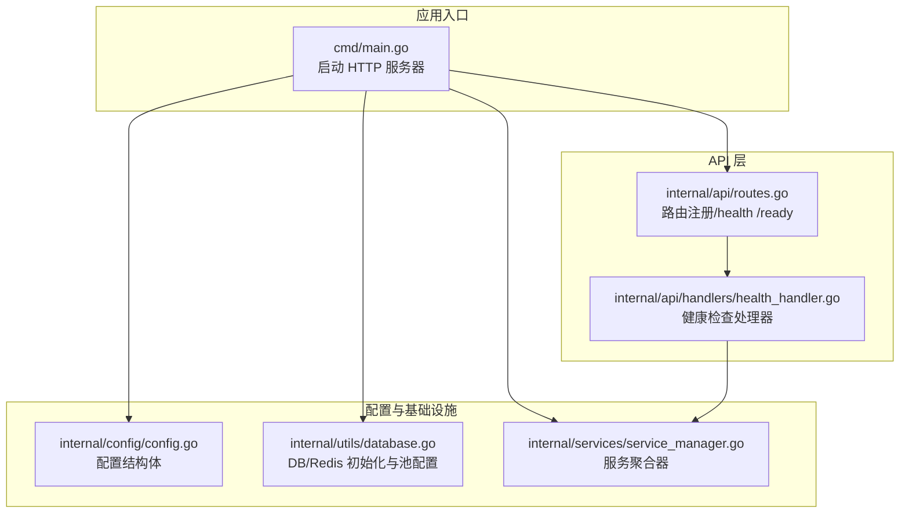
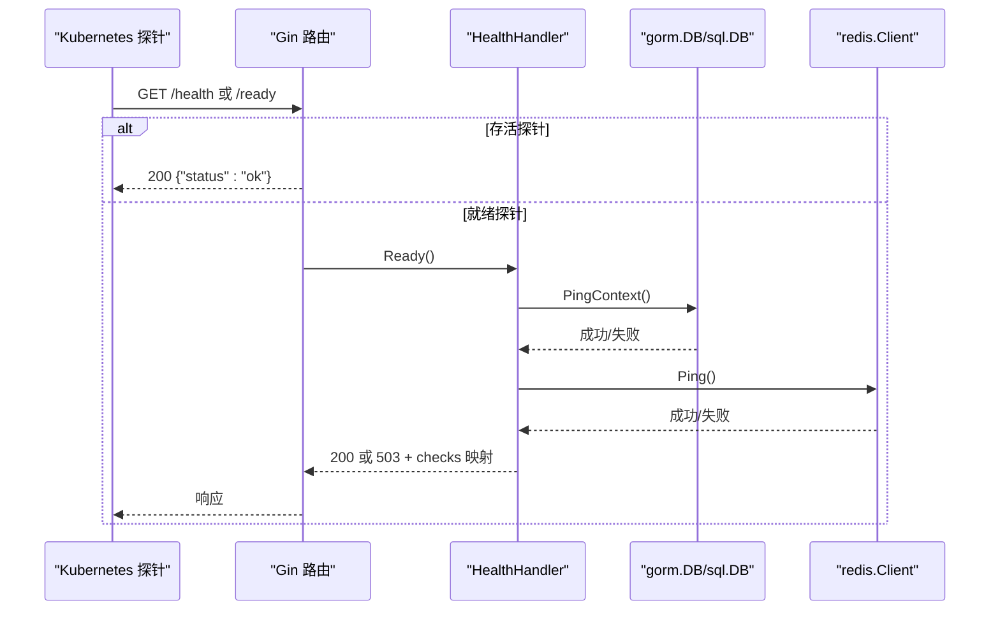
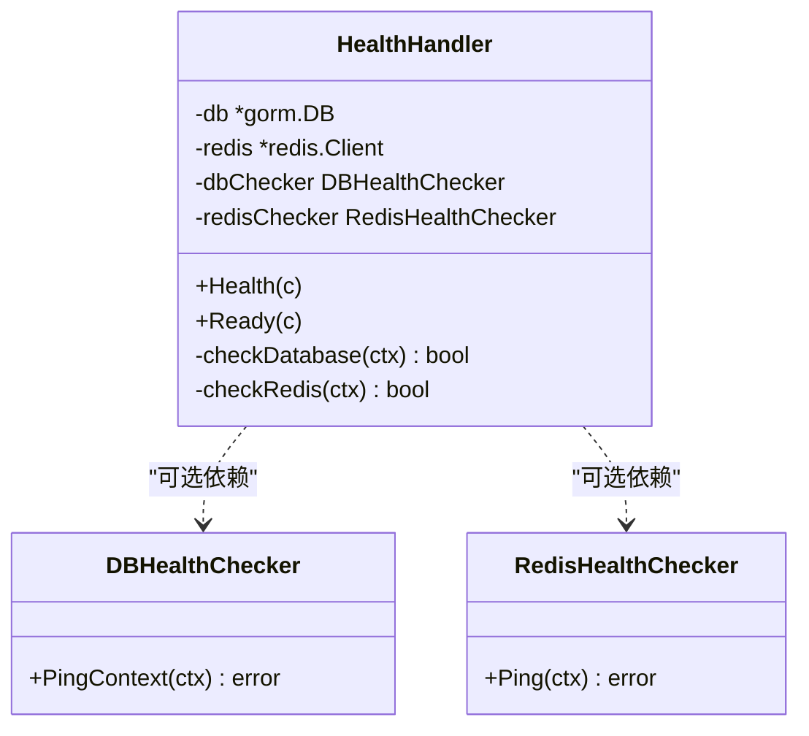
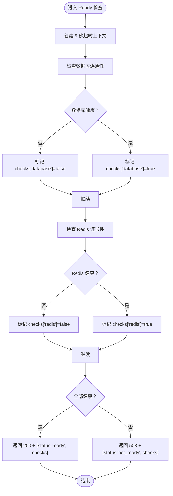
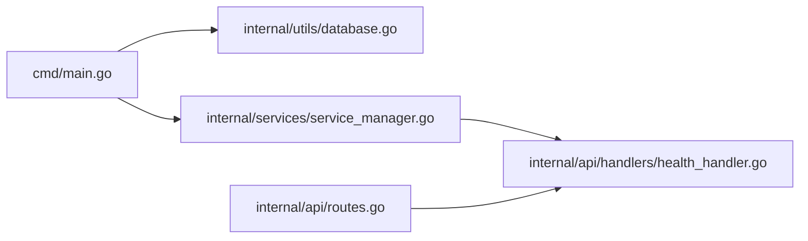

# 健康检查

<cite>
**本文引用的文件**
- [internal/api/handlers/health_handler.go](file://internal/api/handlers/health_handler.go)
- [internal/api/handlers/health_handler_test.go](file://internal/api/handlers/health_handler_test.go)
- [internal/api/routes.go](file://internal/api/routes.go)
- [cmd/main.go](file://cmd/main.go)
- [internal/config/config.go](file://internal/config/config.go)
- [internal/utils/database.go](file://internal/utils/database.go)
- [internal/services/service_manager.go](file://internal/services/service_manager.go)
- [docker-compose.yml](file://docker-compose.yml)
- [configs/config.yaml](file://configs/config.yaml)
- [configs/config.mysql.yaml](file://configs/config.mysql.yaml)
- [configs/config.postgres.yaml](file://configs/config.postgres.yaml)
- [internal/observability/metrics.go](file://internal/observability/metrics.go)
</cite>

## 目录
1. [简介](#简介)
2. [项目结构](#项目结构)
3. [核心组件](#核心组件)
4. [架构总览](#架构总览)
5. [详细组件分析](#详细组件分析)
6. [依赖关系分析](#依赖关系分析)
7. [性能考量](#性能考量)
8. [故障排查指南](#故障排查指南)
9. [结论](#结论)
10. [附录：Kubernetes 集成与最佳实践](#附录kubernetes-集成与最佳实践)

## 简介
本文件面向 Wolink-Core 的健康检查接口，系统化阐述其设计与实现，重点包括：
- 存活探针与就绪探针的区分与用途
- 健康检查的四个维度：数据库连接、缓存服务、外部依赖、内部服务
- 响应格式与状态码含义
- Kubernetes 集成示例（livenessProbe 与 readinessProbe）
- 最佳实践：检查频率、超时、故障恢复与自动扩缩容/故障转移策略

## 项目结构
Wolink-Core 将健康检查作为独立处理器注册在路由层，配合配置与服务管理模块完成初始化与运行时检查。

图表来源
- [cmd/main.go:19-89](file://cmd/main.go#L19-L89)
- [internal/api/routes.go:14-44](file://internal/api/routes.go#L14-L44)
- [internal/api/handlers/health_handler.go:23-37](file://internal/api/handlers/health_handler.go#L23-L37)
- [internal/config/config.go:10-31](file://internal/config/config.go#L10-L31)
- [internal/utils/database.go:77-139](file://internal/utils/database.go#L77-L139)
- [internal/services/service_manager.go:30-62](file://internal/services/service_manager.go#L30-L62)

章节来源
- [cmd/main.go:19-89](file://cmd/main.go#L19-L89)
- [internal/api/routes.go:14-44](file://internal/api/routes.go#L14-L44)
- [internal/api/handlers/health_handler.go:23-37](file://internal/api/handlers/health_handler.go#L23-L37)
- [internal/config/config.go:10-31](file://internal/config/config.go#L10-L31)
- [internal/utils/database.go:77-139](file://internal/utils/database.go#L77-L139)
- [internal/services/service_manager.go:30-62](file://internal/services/service_manager.go#L30-L62)

## 核心组件
- 健康检查处理器（HealthHandler）
  - 提供存活探针（/health）与就绪探针（/ready）两个端点
  - 存活探针仅判断进程是否存活，返回固定 200 OK
  - 就绪探针对数据库与 Redis 进行连通性检查，返回 200 或 503
- 路由注册
  - /health：直接返回固定 JSON
  - /ready：委托 HealthHandler.Ready 完成检查
- 服务注入
  - HealthHandler 依赖 ServiceManager 中的 DB 与 Redis 客户端
  - ServiceManager 在应用启动时完成 DB/Redis 初始化与服务装配

章节来源
- [internal/api/handlers/health_handler.go:39-84](file://internal/api/handlers/health_handler.go#L39-L84)
- [internal/api/routes.go:39-44](file://internal/api/routes.go#L39-L44)
- [internal/services/service_manager.go:30-62](file://internal/services/service_manager.go#L30-L62)

## 架构总览
下图展示了健康检查在系统中的调用链路与依赖关系。

图表来源
- [internal/api/routes.go:39-44](file://internal/api/routes.go#L39-L44)
- [internal/api/handlers/health_handler.go:42-84](file://internal/api/handlers/health_handler.go#L42-L84)
- [internal/utils/database.go:97-102](file://internal/utils/database.go#L97-L102)

## 详细组件分析

### 健康检查处理器（HealthHandler）
- 设计要点
  - 接口隔离：定义 DBHealthChecker 与 RedisHealthChecker 接口，便于测试与替换
  - 可插拔检查器：支持通过 dbChecker/redisChecker 注入自定义实现（测试场景）
  - 超时控制：就绪检查统一使用 5 秒上下文超时，避免阻塞
  - 响应结构：就绪检查返回 checks 映射，清晰标识各依赖健康状况
- 方法职责
  - Health：返回固定 200 OK，用于存活探针
  - Ready：并发执行数据库与 Redis 检查，汇总结果后返回 200 或 503

图表来源
- [internal/api/handlers/health_handler.go:13-29](file://internal/api/handlers/health_handler.go#L13-L29)
- [internal/api/handlers/health_handler.go:23-37](file://internal/api/handlers/health_handler.go#L23-L37)
- [internal/api/handlers/health_handler.go:42-119](file://internal/api/handlers/health_handler.go#L42-L119)

章节来源
- [internal/api/handlers/health_handler.go:13-29](file://internal/api/handlers/health_handler.go#L13-L29)
- [internal/api/handlers/health_handler.go:23-37](file://internal/api/handlers/health_handler.go#L23-L37)
- [internal/api/handlers/health_handler.go:42-119](file://internal/api/handlers/health_handler.go#L42-L119)

### 就绪检查算法流程

图表来源
- [internal/api/handlers/health_handler.go:52-84](file://internal/api/handlers/health_handler.go#L52-L84)
- [internal/api/handlers/health_handler.go:86-119](file://internal/api/handlers/health_handler.go#L86-L119)

章节来源
- [internal/api/handlers/health_handler.go:52-84](file://internal/api/handlers/health_handler.go#L52-L84)
- [internal/api/handlers/health_handler.go:86-119](file://internal/api/handlers/health_handler.go#L86-L119)

### 路由与处理器绑定
- /health：直接返回固定 JSON，用于存活探针
- /ready：委托 HealthHandler.Ready 执行依赖检查
- 处理器构造：NewHealthHandler 注入 ServiceManager.DB 与 ServiceManager.Redis

章节来源
- [internal/api/routes.go:39-44](file://internal/api/routes.go#L39-L44)
- [internal/api/handlers/health_handler.go:31-37](file://internal/api/handlers/health_handler.go#L31-L37)

### 数据库与 Redis 初始化
- 数据库初始化：根据配置选择驱动类型，建立连接池并执行自动迁移
- Redis 初始化：构建连接选项并进行 Ping 测试
- 连接池参数：可通过配置覆盖默认值，零值表示使用默认

章节来源
- [internal/utils/database.go:77-122](file://internal/utils/database.go#L77-L122)
- [internal/utils/database.go:124-139](file://internal/utils/database.go#L124-L139)
- [internal/config/config.go:33-47](file://internal/config/config.go#L33-L47)

### 配置与服务管理
- 配置结构：包含 server、database、redis、log、security、models、infrastructure 等字段
- 基础设施配置：包含 HTTP 超时与连接池配置
- 服务管理：聚合 DB、Redis、业务服务，统一生命周期管理

章节来源
- [internal/config/config.go:10-31](file://internal/config/config.go#L10-L31)
- [internal/config/config.go:21-47](file://internal/config/config.go#L21-L47)
- [internal/services/service_manager.go:30-62](file://internal/services/service_manager.go#L30-L62)

## 依赖关系分析
- 组件耦合
  - HealthHandler 与 ServiceManager 弱耦合：通过接口与客户端对象注入
  - 路由层仅负责注册与转发，不承载业务逻辑
- 外部依赖
  - 数据库：gorm + underlying sql.DB
  - 缓存：go-redis 客户端
- 关键依赖链
  - main -> utils.InitDB/InitRedis -> ServiceManager -> HealthHandler

图表来源
- [cmd/main.go:29-42](file://cmd/main.go#L29-L42)
- [internal/utils/database.go:77-139](file://internal/utils/database.go#L77-L139)
- [internal/services/service_manager.go:30-62](file://internal/services/service_manager.go#L30-L62)
- [internal/api/routes.go:36-44](file://internal/api/routes.go#L36-L44)
- [internal/api/handlers/health_handler.go:23-37](file://internal/api/handlers/health_handler.go#L23-L37)

章节来源
- [cmd/main.go:29-42](file://cmd/main.go#L29-L42)
- [internal/utils/database.go:77-139](file://internal/utils/database.go#L77-L139)
- [internal/services/service_manager.go:30-62](file://internal/services/service_manager.go#L30-L62)
- [internal/api/routes.go:36-44](file://internal/api/routes.go#L36-L44)
- [internal/api/handlers/health_handler.go:23-37](file://internal/api/handlers/health_handler.go#L23-L37)

## 性能考量
- 检查超时：就绪检查统一 5 秒超时，避免探针阻塞导致 Pod 被误判
- 并发检查：数据库与 Redis 检查顺序执行，建议在高延迟网络中考虑并发优化
- 响应开销：健康检查应保持极低开销，避免影响生产流量
- 连接池：数据库与 Redis 连接池参数可通过配置调整，平衡资源占用与响应速度

## 故障排查指南
- 常见问题
  - /ready 返回 503：检查数据库或 Redis 是否可达；查看 checks 映射定位具体依赖
  - /health 正常但 /ready 失败：表明进程存活但依赖未就绪，常见于启动阶段
- 单元测试参考
  - 测试覆盖：存活探针返回 200；就绪探针在不同依赖组合下的返回码与结构
- 观测性
  - 指标暴露：/metrics 端点可用于整体指标观测，辅助定位异常

章节来源
- [internal/api/handlers/health_handler_test.go:49-107](file://internal/api/handlers/health_handler_test.go#L49-L107)
- [internal/observability/metrics.go:88-92](file://internal/observability/metrics.go#L88-L92)

## 结论
Wolink-Core 的健康检查通过分离存活与就绪探针，实现了对进程状态与依赖可用性的双重保障。就绪检查聚焦数据库与 Redis，结合超时控制与清晰的响应结构，为 Kubernetes 的滚动更新、扩缩容与故障转移提供了可靠依据。

## 附录：Kubernetes 集成与最佳实践

### 健康检查端点与响应
- /health
  - 方法：GET
  - 响应：200 OK，JSON 包含状态字段
- /ready
  - 方法：GET
  - 响应：
    - 200 OK：{"status":"ready","checks":{"database":true,"redis":true}}
    - 503 Service Unavailable：{"status":"not_ready","checks":{"database":false|"true","redis":false|"true"}}

章节来源
- [internal/api/handlers/health_handler.go:42-84](file://internal/api/handlers/health_handler.go#L42-L84)

### Kubernetes 探针配置示例
- 存活探针（livenessProbe）
  - 用途：判断容器是否存活，若失败将重启容器
  - 建议：探测路径 /health，成功阈值 1，失败阈值 3，间隔 10s，超时 2s
- 就绪探针（readinessProbe）
  - 用途：判断容器是否准备好接收流量，未就绪则不加入服务端点
  - 建议：探测路径 /ready，成功阈值 1，失败阈值 3，间隔 10s，超时 5s

说明
- 上述参数为通用建议，实际应结合部署环境与 SLA 调整
- 若需更细粒度的健康状态，可在就绪检查中解析 checks 字段

### 自动扩缩容与故障转移
- 横向扩展
  - 基于 /ready 状态：仅将就绪的 Pod 接收流量，避免扩缩容过程中的抖动
- 故障转移
  - 当节点或 Pod 多次失败时，K8s 将驱逐到新副本；/ready 可快速反映依赖变化
- 配置联动
  - 与 Deployment/HPA 配置结合，确保在依赖恢复后尽快恢复流量

### 配置与部署参考
- 本地开发与集成
  - docker-compose 示例中定义了数据库与 Redis 的健康检查，可作为就绪前置条件
- 环境变量与配置文件
  - 支持通过环境变量与 YAML 配置文件覆盖数据库与 Redis 地址、凭据等

章节来源
- [docker-compose.yml:39-55](file://docker-compose.yml#L39-L55)
- [configs/config.yaml:5-13](file://configs/config.yaml#L5-L13)
- [configs/config.mysql.yaml:5-20](file://configs/config.mysql.yaml#L5-L20)
- [configs/config.postgres.yaml:5-18](file://configs/config.postgres.yaml#L5-L18)