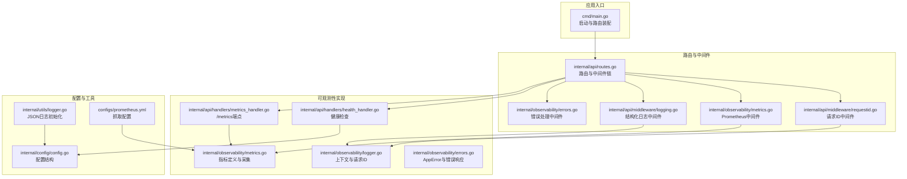
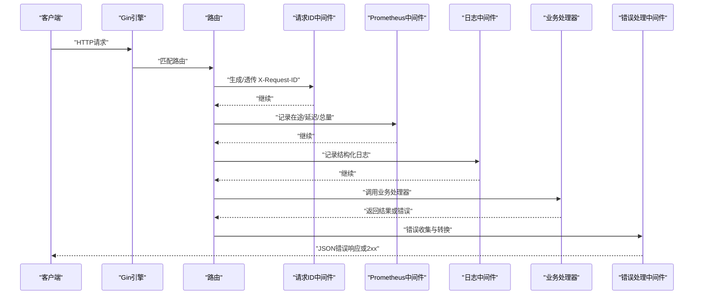
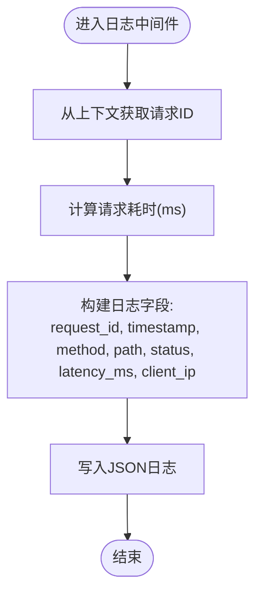
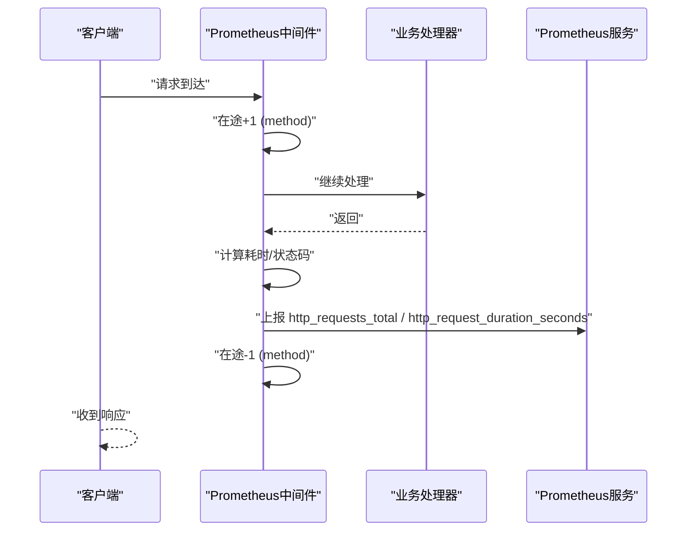
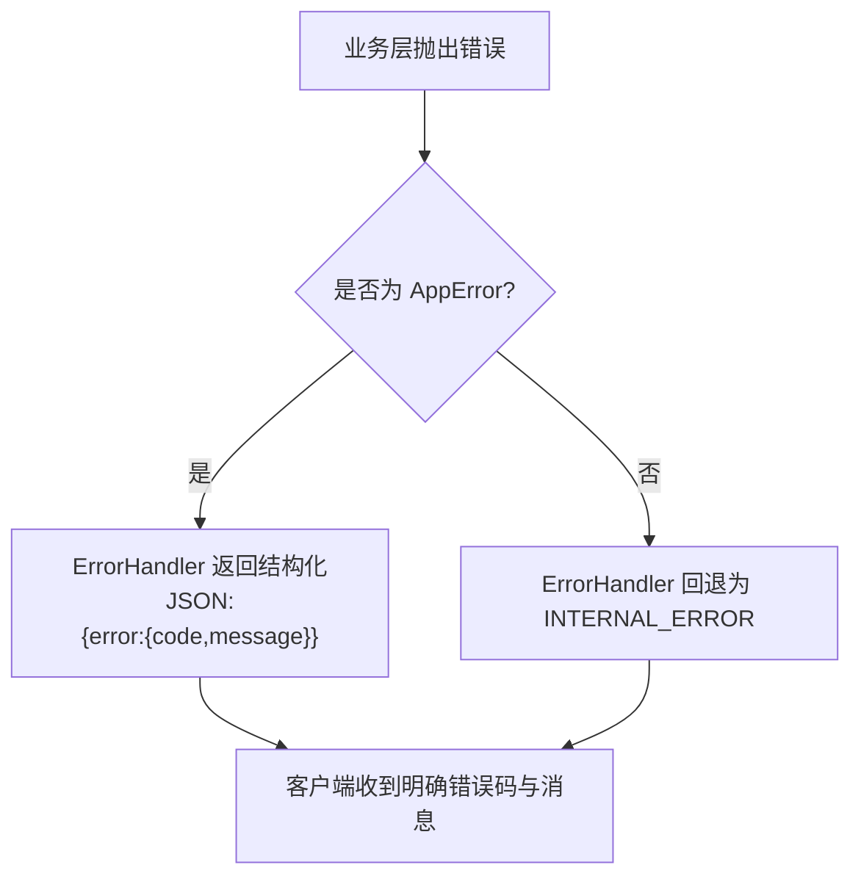
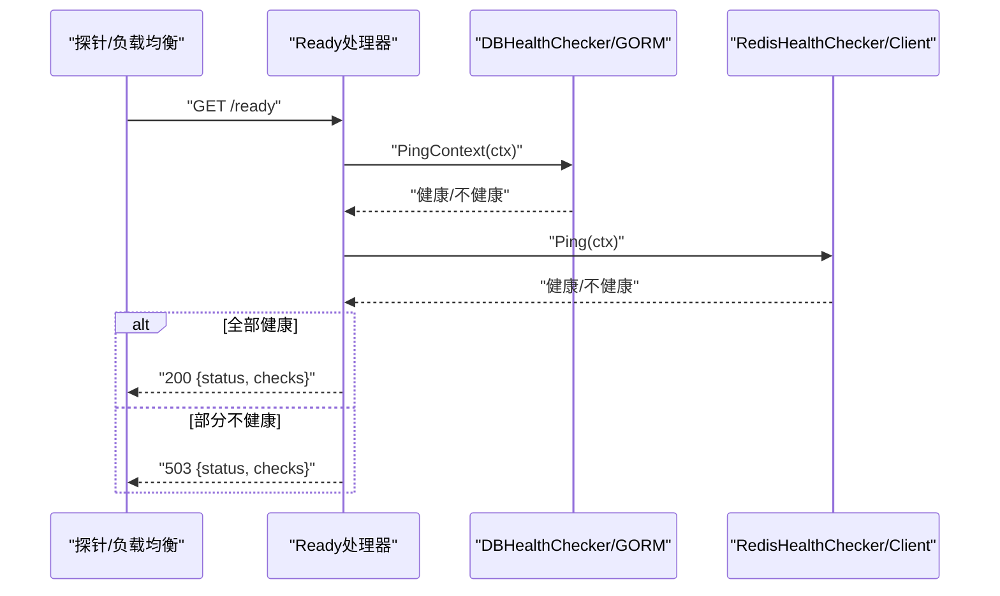
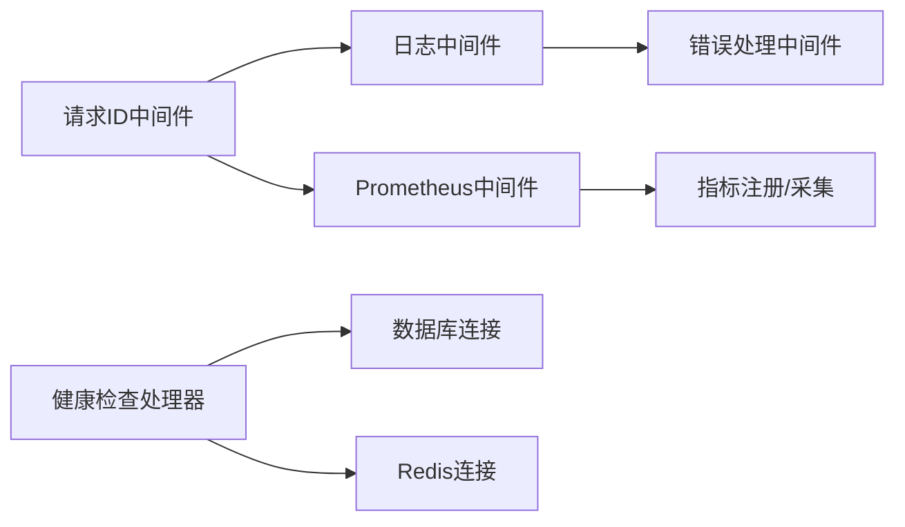

# 可观测性系统

<cite>
**本文引用的文件**
- [cmd/main.go](file://cmd/main.go)
- [internal/api/routes.go](file://internal/api/routes.go)
- [internal/api/middleware/requestid.go](file://internal/api/middleware/requestid.go)
- [internal/api/middleware/logging.go](file://internal/api/middleware/logging.go)
- [internal/observability/logger.go](file://internal/observability/logger.go)
- [internal/observability/metrics.go](file://internal/observability/metrics.go)
- [internal/observability/errors.go](file://internal/observability/errors.go)
- [internal/api/handlers/health_handler.go](file://internal/api/handlers/health_handler.go)
- [internal/api/handlers/metrics_handler.go](file://internal/api/handlers/metrics_handler.go)
- [configs/prometheus.yml](file://configs/prometheus.yml)
- [internal/utils/logger.go](file://internal/utils/logger.go)
- [internal/config/config.go](file://internal/config/config.go)
- [internal/observability/logger_test.go](file://internal/observability/logger_test.go)
- [internal/observability/metrics_test.go](file://internal/observability/metrics_test.go)
- [internal/observability/errors_test.go](file://internal/observability/errors_test.go)
</cite>

## 目录
1. [简介](#简介)
2. [项目结构](#项目结构)
3. [核心组件](#核心组件)
4. [架构总览](#架构总览)
5. [详细组件分析](#详细组件分析)
6. [依赖分析](#依赖分析)
7. [性能考虑](#性能考虑)
8. [故障排查指南](#故障排查指南)
9. [结论](#结论)
10. [附录](#附录)

## 简介
本文件面向 Wolink-Core 的可观测性系统，围绕以下目标展开：  
- 结构化日志实现：日志级别、字段标准化与日志聚合策略  
- Prometheus 指标采集：自定义指标定义、命名规范与监控告警配置  
- 错误处理机制：错误分类、错误传播与降级策略  
- 健康检查接口：实现与使用方法  
- 性能监控、容量规划与故障诊断最佳实践  
- 监控仪表板配置示例与告警规则设置指导  

## 项目结构
可观测性相关代码主要分布在如下模块：  
- 日志与请求追踪：中间件与工具函数  
- 指标采集：Prometheus 中间件与暴露端点  
- 错误处理：统一 AppError 类型与错误响应中间件  
- 健康检查：liveness/readiness 与依赖连通性检查  
- 配置与入口：应用启动、路由注册与指标暴露  

**图表来源**
- [cmd/main.go:19-89](file://cmd/main.go#L19-L89)
- [internal/api/routes.go:14-129](file://internal/api/routes.go#L14-L129)
- [internal/api/middleware/requestid.go:21-39](file://internal/api/middleware/requestid.go#L21-L39)
- [internal/api/middleware/logging.go:22-51](file://internal/api/middleware/logging.go#L22-L51)
- [internal/observability/logger.go:16-42](file://internal/observability/logger.go#L16-L42)
- [internal/observability/metrics.go:12-93](file://internal/observability/metrics.go#L12-L93)
- [internal/observability/errors.go:103-142](file://internal/observability/errors.go#L103-L142)
- [internal/api/handlers/health_handler.go:24-120](file://internal/api/handlers/health_handler.go#L24-L120)
- [internal/api/handlers/metrics_handler.go:18-22](file://internal/api/handlers/metrics_handler.go#L18-L22)
- [internal/config/config.go:96-184](file://internal/config/config.go#L96-L184)
- [internal/utils/logger.go:9-30](file://internal/utils/logger.go#L9-L30)
- [configs/prometheus.yml:1-10](file://configs/prometheus.yml#L1-L10)

**章节来源**
- [cmd/main.go:19-89](file://cmd/main.go#L19-L89)
- [internal/api/routes.go:14-129](file://internal/api/routes.go#L14-L129)

## 核心组件
- 请求ID与上下文传递：通过中间件生成或透传 X-Request-ID，并在日志与指标中复用，便于端到端追踪  
- 结构化日志：统一 JSON 格式输出，包含时间戳、请求ID、方法、路径、状态码、耗时、客户端IP等关键字段  
- Prometheus 指标：内置计数器、直方图与在途请求数仪表盘，支持按方法/路径/状态聚合  
- 统一错误模型：AppError 将业务错误映射为稳定可读的 code、message 与 HTTP 状态码，错误响应中间件保证一致性  
- 健康检查：liveness 返回进程存活；readiness 检查数据库与 Redis 连通性；/metrics 暴露指标供抓取

**章节来源**
- [internal/api/middleware/requestid.go:21-39](file://internal/api/middleware/requestid.go#L21-L39)
- [internal/api/middleware/logging.go:22-51](file://internal/api/middleware/logging.go#L22-L51)
- [internal/observability/metrics.go:12-93](file://internal/observability/metrics.go#L12-L93)
- [internal/observability/errors.go:10-142](file://internal/observability/errors.go#L10-L142)
- [internal/api/handlers/health_handler.go:24-120](file://internal/api/handlers/health_handler.go#L24-L120)
- [internal/api/handlers/metrics_handler.go:18-22](file://internal/api/handlers/metrics_handler.go#L18-L22)

## 架构总览
可观测性在 Gin 路由中的执行顺序如下：  
1) panic 恢复  
2) 请求ID生成/透传  
3) Prometheus 指标采集（在途、延迟、总量）  
4) 结构化日志记录  
5) CORS 处理  
6) 统一错误响应  

**图表来源**
- [internal/api/routes.go:17-29](file://internal/api/routes.go#L17-L29)
- [internal/api/middleware/requestid.go:21-39](file://internal/api/middleware/requestid.go#L21-L39)
- [internal/observability/metrics.go:53-86](file://internal/observability/metrics.go#L53-L86)
- [internal/api/middleware/logging.go:22-51](file://internal/api/middleware/logging.go#L22-L51)
- [internal/observability/errors.go:103-142](file://internal/observability/errors.go#L103-L142)

## 详细组件分析

### 结构化日志实现
- 日志格式：JSON 输出，包含时间戳、请求ID、方法、路径、状态码、耗时（毫秒）、客户端IP  
- 字段标准化：所有请求均输出上述字段，便于日志聚合平台统一解析  
- 上下文关联：通过 WithRequestID/GetRequestID 在中间件与日志之间传递请求ID  
- 日志级别：由配置决定，默认 info；生产建议根据环境调整  
- 日志聚合策略：  
  - 使用请求ID进行跨服务/容器关联  
  - 利用路径模式（而非具体参数）进行指标聚合，降低标签基数  
  - 对敏感字段进行脱敏（配置项中提供敏感模式与替换模式）

**图表来源**
- [internal/api/middleware/logging.go:22-51](file://internal/api/middleware/logging.go#L22-L51)
- [internal/observability/logger.go:16-42](file://internal/observability/logger.go#L16-L42)
- [internal/utils/logger.go:9-30](file://internal/utils/logger.go#L9-L30)

**章节来源**
- [internal/api/middleware/logging.go:22-51](file://internal/api/middleware/logging.go#L22-L51)
- [internal/observability/logger.go:16-42](file://internal/observability/logger.go#L16-L42)
- [internal/utils/logger.go:9-30](file://internal/utils/logger.go#L9-L30)
- [internal/config/config.go:74-94](file://internal/config/config.go#L74-L94)

### Prometheus 指标收集机制
- 指标定义与命名规范：  
  - http_requests_total: 计数器，标签 method、path、status  
  - http_request_duration_seconds: 直方图，标签 method、path  
  - http_requests_in_flight: 在途请求数，标签 method  
- 采集逻辑：  
  - 使用 c.FullPath() 作为 path 标签，避免高基数  
  - 在请求开始时增加在途计数，在 defer 中减少  
  - 记录延迟直方图与总量计数  
- 暴露端点：/metrics，内容类型为 Prometheus 文本格式  
- 抓取配置：示例配置文件指定抓取间隔、目标与路径

**图表来源**
- [internal/observability/metrics.go:53-86](file://internal/observability/metrics.go#L53-L86)
- [internal/api/handlers/metrics_handler.go:18-22](file://internal/api/handlers/metrics_handler.go#L18-L22)
- [configs/prometheus.yml:1-10](file://configs/prometheus.yml#L1-L10)

**章节来源**
- [internal/observability/metrics.go:12-93](file://internal/observability/metrics.go#L12-L93)
- [internal/api/handlers/metrics_handler.go:18-22](file://internal/api/handlers/metrics_handler.go#L18-L22)
- [configs/prometheus.yml:1-10](file://configs/prometheus.yml#L1-L10)

### 错误处理机制
- AppError 设计：包含 machine-readable code、human-readable message、HTTPStatus 与可选 Cause  
- 预定义错误：UNAUTHORIZED、FORBIDDEN、NOT_FOUND、BAD_REQUEST、RATE_LIMITED、INTERNAL_ERROR  
- 自定义错误：NewValidationError 与 NewServiceError 提供验证与服务层错误封装  
- 错误传播：ErrorHandler 中间件从 c.Errors 最后一个错误提取，若为 AppError 则返回结构化 JSON；否则回退 INTERNAL_ERROR  
- 降级策略：可在服务层捕获 AppError 并返回更友好的 message，同时保留 code 以便前端/监控识别

**图表来源**
- [internal/observability/errors.go:103-142](file://internal/observability/errors.go#L103-L142)

**章节来源**
- [internal/observability/errors.go:10-142](file://internal/observability/errors.go#L10-L142)
- [internal/observability/errors_test.go:62-96](file://internal/observability/errors_test.go#L62-L96)

### 健康检查接口
- /health：liveness，进程存活即 200  
- /ready：readiness，超时 5 秒内检查数据库与 Redis 连通性，全部健康返回 200，否则 503  
- 数据库检查：优先使用注入的 DBHealthChecker（测试场景），否则通过底层 SQL 连接 ping  
- Redis 检查：优先使用注入的 RedisHealthChecker，否则通过 ping 命令校验

**图表来源**
- [internal/api/handlers/health_handler.go:52-84](file://internal/api/handlers/health_handler.go#L52-L84)

**章节来源**
- [internal/api/handlers/health_handler.go:24-120](file://internal/api/handlers/health_handler.go#L24-L120)

## 依赖分析
- 路由装配依赖：中间件链顺序严格，Prometheus 必须在日志之前以确保在途计数正确  
- 日志与指标共享：请求ID在日志与指标中复用，便于关联  
- 错误处理：ErrorHandler 位于路由末尾，统一拦截上游抛出的错误  
- 健康检查：依赖数据库与 Redis 客户端，支持注入以适配测试

**图表来源**
- [internal/api/routes.go:17-29](file://internal/api/routes.go#L17-L29)
- [internal/observability/metrics.go:46-51](file://internal/observability/metrics.go#L46-L51)
- [internal/api/handlers/health_handler.go:24-120](file://internal/api/handlers/health_handler.go#L24-L120)

**章节来源**
- [internal/api/routes.go:14-129](file://internal/api/routes.go#L14-L129)

## 性能考虑
- 指标标签基数控制：使用 c.FullPath() 作为 path 标签，避免将路径参数纳入标签，降低 cardinality  
- 直方图桶设置：针对 API 延迟优化的桶范围，兼顾精度与内存占用  
- 在途请求：通过 GaugeVec 实时反映并发压力，便于容量规划  
- 日志开销：JSON 序列化与字段丰富度需结合生产日志平台能力权衡  
- 健康检查超时：固定 5 秒超时，避免阻塞 readiness 判定  
- 关键路径优化：在业务层尽量避免重复计算相同指标，统一在中间件层采集

[本节为通用性能建议，不直接分析特定文件]

## 故障排查指南
- 无法访问 /metrics：确认路由已注册 /metrics 并且 Prometheus 中抓取配置正确  
- 指标缺失：检查 Prometheus 中间件是否在路由链中、是否正确注册指标  
- 日志未包含请求ID：确认请求ID中间件在日志中间件之前执行，且客户端请求携带 X-Request-ID 或允许服务端生成  
- 错误响应不符合预期：检查 ErrorHandler 是否在路由末尾、是否正确抛出 AppError  
- readiness 持续 503：检查数据库与 Redis 连通性、连接池配置与超时设置  
- 健康检查注入：测试场景可通过注入 DB/Redis 检查器模拟不同结果

**章节来源**
- [internal/api/routes.go:40-44](file://internal/api/routes.go#L40-L44)
- [internal/observability/metrics.go:46-51](file://internal/observability/metrics.go#L46-L51)
- [internal/api/middleware/requestid.go:21-39](file://internal/api/middleware/requestid.go#L21-L39)
- [internal/observability/errors.go:103-142](file://internal/observability/errors.go#L103-L142)
- [internal/api/handlers/health_handler.go:52-84](file://internal/api/handlers/health_handler.go#L52-L84)

## 结论
Wolink-Core 的可观测性体系以“统一请求ID、结构化日志、标准指标与一致错误响应”为核心，配合健康检查与可配置的日志/指标策略，能够满足生产环境的监控、告警与排障需求。建议在生产环境中启用 JSON 日志、合理设置指标标签、完善告警阈值与通知渠道，并持续优化直方图桶与日志字段以平衡可观测性与性能。

[本节为总结性内容，不直接分析特定文件]

## 附录

### 日志字段标准化清单
- request_id：请求唯一标识  
- timestamp：ISO 8601 时间戳  
- method：HTTP 方法  
- path：路由路径（使用 FullPath 模式）  
- status：HTTP 状态码  
- latency_ms：请求耗时（毫秒）  
- client_ip：客户端 IP  

**章节来源**
- [internal/api/middleware/logging.go:36-44](file://internal/api/middleware/logging.go#L36-L44)
- [internal/observability/logger.go:30-42](file://internal/observability/logger.go#L30-L42)

### 指标命名与标签规范
- http_requests_total：计数器，标签 method、path、status  
- http_request_duration_seconds：直方图，标签 method、path  
- http_requests_in_flight：在途请求数，标签 method  
- 标签建议：使用 FullPath 模式避免高基数；对敏感信息脱敏

**章节来源**
- [internal/observability/metrics.go:12-93](file://internal/observability/metrics.go#L12-L93)

### 错误分类与响应格式
- AppError：包含 code、message、HTTPStatus、可选 Cause  
- 预定义错误：UNAUTHORIZED、FORBIDDEN、NOT_FOUND、BAD_REQUEST、RATE_LIMITED、INTERNAL_ERROR  
- 响应格式：统一 JSON 包裹 error 对象，包含 code 与 message  
- 回退策略：非 AppError 统一返回 INTERNAL_ERROR

**章节来源**
- [internal/observability/errors.go:10-142](file://internal/observability/errors.go#L10-L142)

### 健康检查接口说明
- /health：进程存活检测，200 OK  
- /ready：依赖检查，5 秒超时，数据库与 Redis 均健康返回 200，否则 503  
- 支持注入：DBHealthChecker 与 RedisHealthChecker 便于测试与模拟

**章节来源**
- [internal/api/handlers/health_handler.go:42-84](file://internal/api/handlers/health_handler.go#L42-L84)

### 监控仪表板与告警配置建议
- 仪表板建议指标：  
  - 每秒请求数（按 method/status 分组）  
  - 请求延迟分位数（p50/p90/p99，按 method/path 分组）  
  - 在途请求数（按 method 分组）  
  - 错误率（按 code/status 分组）  
- 告警规则示例（描述性）：  
  - 延迟 p99 超过阈值持续 5 分钟  
  - 错误率超过阈值  
  - 在途请求数异常升高  
  - readiness 连续失败  
- 抓取配置：参考 configs/prometheus.yml，设置合适的 scrape_interval 与 metrics_path

**章节来源**
- [configs/prometheus.yml:1-10](file://configs/prometheus.yml#L1-L10)