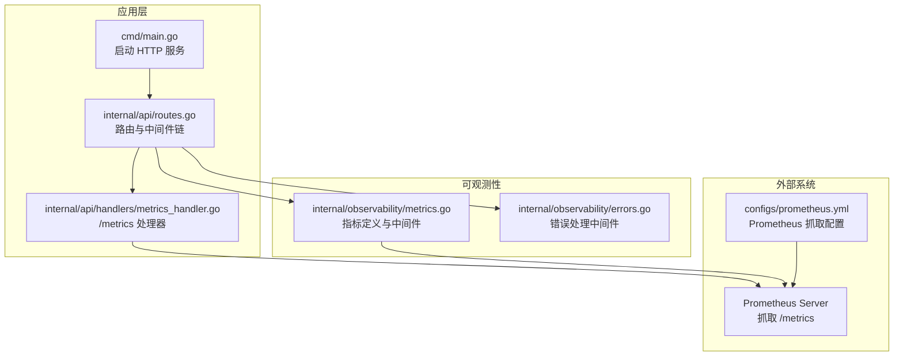
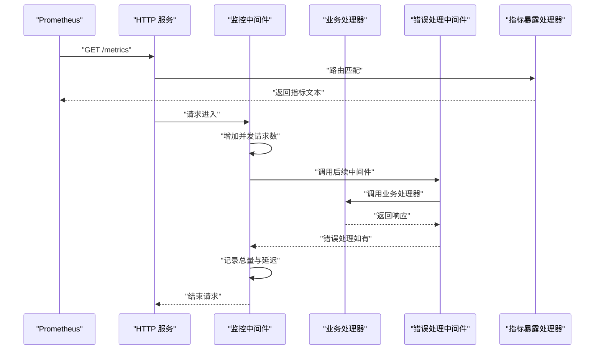
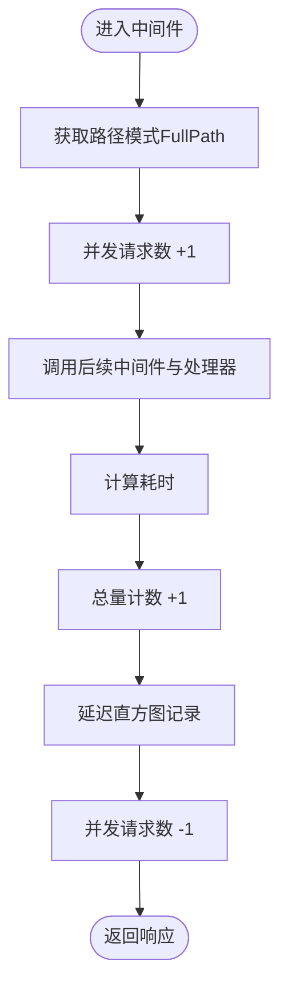
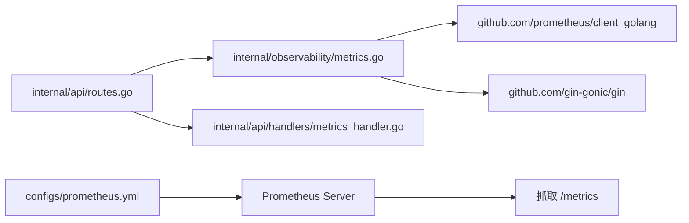

# 指标监控

<cite>
**本文引用的文件**
- [internal/observability/metrics.go](file://internal/observability/metrics.go)
- [internal/api/handlers/metrics_handler.go](file://internal/api/handlers/metrics_handler.go)
- [internal/api/routes.go](file://internal/api/routes.go)
- [configs/prometheus.yml](file://configs/prometheus.yml)
- [cmd/main.go](file://cmd/main.go)
- [internal/observability/errors.go](file://internal/observability/errors.go)
- [internal/observability/metrics_test.go](file://internal/observability/metrics_test.go)
- [docker-compose.yml](file://docker-compose.yml)
- [Dockerfile](file://Dockerfile)
- [go.mod](file://go.mod)
</cite>

## 目录
1. [简介](#简介)
2. [项目结构](#项目结构)
3. [核心组件](#核心组件)
4. [架构总览](#架构总览)
5. [详细组件分析](#详细组件分析)
6. [依赖关系分析](#依赖关系分析)
7. [性能考量](#性能考量)
8. [故障排查指南](#故障排查指南)
9. [结论](#结论)
10. [附录](#附录)

## 简介
本文件面向 Wolink-Core 的指标监控体系，聚焦于基于 Prometheus 的指标采集与暴露机制。内容涵盖：
- 自定义指标的定义、注册与暴露
- 指标类型选择（Counter、Gauge、Histogram）及适用场景
- 指标命名规范与标签设计原则（含路径标签的高基数控制）
- Prometheus 抓取配置详解（抓取间隔、超时、目标发现）
- 监控仪表板与常用查询表达式建议
- 基于指标的性能分析、容量规划与问题诊断实践

## 项目结构
Wolink-Core 将监控能力置于内部子模块中，并通过 Gin 中间件链路自动采集 HTTP 请求指标；同时提供统一的 /metrics 暴露端点供 Prometheus 抓取。

图表来源
- [cmd/main.go:19-89](file://cmd/main.go#L19-L89)
- [internal/api/routes.go:14-129](file://internal/api/routes.go#L14-L129)
- [internal/api/handlers/metrics_handler.go:18-22](file://internal/api/handlers/metrics_handler.go#L18-L22)
- [internal/observability/metrics.go:12-93](file://internal/observability/metrics.go#L12-L93)
- [configs/prometheus.yml:1-10](file://configs/prometheus.yml#L1-L10)

章节来源
- [cmd/main.go:19-89](file://cmd/main.go#L19-L89)
- [internal/api/routes.go:14-129](file://internal/api/routes.go#L14-L129)
- [internal/api/handlers/metrics_handler.go:18-22](file://internal/api/handlers/metrics_handler.go#L18-L22)
- [internal/observability/metrics.go:12-93](file://internal/observability/metrics.go#L12-L93)
- [configs/prometheus.yml:1-10](file://configs/prometheus.yml#L1-L10)

## 核心组件
- 指标定义与注册：在初始化阶段注册计数器、直方图与计量器，确保 Prometheus 可抓取。
- 指标采集中间件：在请求进入与退出时分别记录总量、延迟分布与并发请求数。
- 指标暴露处理器：将 Prometheus 客户端生成的文本格式指标输出到 /metrics。
- 路由与中间件链：将监控中间件置于日志与错误处理之前，保证指标采集的完整性。
- 错误处理中间件：统一错误响应，避免异常导致指标缺失或状态码丢失。

章节来源
- [internal/observability/metrics.go:12-93](file://internal/observability/metrics.go#L12-L93)
- [internal/api/handlers/metrics_handler.go:18-22](file://internal/api/handlers/metrics_handler.go#L18-L22)
- [internal/api/routes.go:17-30](file://internal/api/routes.go#L17-L30)
- [internal/observability/errors.go:103-142](file://internal/observability/errors.go#L103-L142)

## 架构总览
下图展示了从请求进入应用到被 Prometheus 抓取的关键流程。

图表来源
- [internal/observability/metrics.go:53-92](file://internal/observability/metrics.go#L53-L92)
- [internal/api/routes.go:17-30](file://internal/api/routes.go#L17-L30)
- [internal/api/handlers/metrics_handler.go:18-22](file://internal/api/handlers/metrics_handler.go#L18-L22)

## 详细组件分析

### 指标定义与注册
- 计数器：累计 HTTP 请求总数，按方法、路径模式与状态码聚合。
- 直方图：记录请求耗时分布，按方法与路径模式聚合，桶边界针对 API 延迟优化。
- 计量器：当前正在处理的请求数，按方法聚合，用于并发度监控。

关键特性
- 在初始化阶段注册指标，确保 Prometheus 抓取时可见。
- 使用路径模式（FullPath）而非实际路径参数，避免高基数标签导致指标爆炸。
- 采用 Prometheus 官方客户端库的标准命名与帮助信息。

章节来源
- [internal/observability/metrics.go:12-51](file://internal/observability/metrics.go#L12-L51)
- [internal/observability/metrics.go:59-61](file://internal/observability/metrics.go#L59-L61)

### 监控中间件工作流
中间件在请求生命周期内执行以下步骤：
- 进入：获取路径模式，增加并发请求数。
- 退出：计算耗时，记录总量与延迟分布，减少并发请求数。

图表来源
- [internal/observability/metrics.go:62-86](file://internal/observability/metrics.go#L62-L86)

章节来源
- [internal/observability/metrics.go:62-86](file://internal/observability/metrics.go#L62-L86)

### 指标暴露处理器
- 提供 /metrics 端点，输出 Prometheus 文本格式指标。
- 通过包装标准库处理器，确保与 Prometheus 抓取协议兼容。

章节来源
- [internal/api/handlers/metrics_handler.go:18-22](file://internal/api/handlers/metrics_handler.go#L18-L22)
- [internal/observability/metrics.go:88-92](file://internal/observability/metrics.go#L88-L92)

### 路由与中间件链
- 中间件顺序：恢复、请求 ID、监控、日志、CORS、错误处理。
- /metrics 路由直接绑定指标暴露处理器。
- /health 与 /ready 等健康检查路由独立存在。

章节来源
- [internal/api/routes.go:17-30](file://internal/api/routes.go#L17-L30)
- [internal/api/routes.go:39-44](file://internal/api/routes.go#L39-L44)

### 错误处理中间件
- 统一将领域错误转换为结构化 JSON 响应，保留 HTTP 状态码。
- 便于指标中的状态码标签准确反映错误类型。

章节来源
- [internal/observability/errors.go:103-142](file://internal/observability/errors.go#L103-L142)

## 依赖关系分析
- 指标中间件依赖 Gin 中间件链与 Prometheus 客户端库。
- 路由层负责装配中间件与暴露端点。
- Prometheus 通过静态目标配置抓取 /metrics。

图表来源
- [internal/observability/metrics.go:3-10](file://internal/observability/metrics.go#L3-L10)
- [internal/api/routes.go:3-12](file://internal/api/routes.go#L3-L12)
- [internal/api/handlers/metrics_handler.go:3-7](file://internal/api/handlers/metrics_handler.go#L3-L7)
- [configs/prometheus.yml:1-10](file://configs/prometheus.yml#L1-L10)

章节来源
- [go.mod:13](file://go.mod#L13)
- [internal/observability/metrics.go:3-10](file://internal/observability/metrics.go#L3-L10)
- [internal/api/routes.go:3-12](file://internal/api/routes.go#L3-L12)
- [internal/api/handlers/metrics_handler.go:3-7](file://internal/api/handlers/metrics_handler.go#L3-L7)
- [configs/prometheus.yml:1-10](file://configs/prometheus.yml#L1-L10)

## 性能考量
- 指标开销：计数器与直方图为低开销指标，适合高频采集。
- 标签基数控制：使用路径模式（FullPath）避免路径参数带来的高基数。
- 桶边界优化：针对 API 延迟范围设置桶边界，提升延迟观测精度。
- 并发度监控：计量器用于实时观察峰值并发，辅助容量规划。

章节来源
- [internal/observability/metrics.go:26-33](file://internal/observability/metrics.go#L26-L33)
- [internal/observability/metrics.go:59-61](file://internal/observability/metrics.go#L59-L61)

## 故障排查指南
常见问题与定位思路
- 指标未出现
  - 检查 /metrics 是否可达且返回文本格式。
  - 确认 Prometheus 抓取配置的目标地址与路径正确。
- 指标标签异常
  - 确认使用路径模式（FullPath）而非实际路径参数。
  - 检查路由是否正确注册监控中间件。
- 并发度异常
  - 查看计量器数值是否与预期一致，结合延迟直方图分析瓶颈。
- 错误响应与状态码
  - 确保错误处理中间件在监控中间件之后执行，避免状态码丢失。

章节来源
- [internal/observability/metrics_test.go:53-72](file://internal/observability/metrics_test.go#L53-L72)
- [internal/api/routes.go:17-30](file://internal/api/routes.go#L17-L30)
- [internal/observability/errors.go:103-142](file://internal/observability/errors.go#L103-L142)

## 结论
Wolink-Core 已实现一套简洁高效的 Prometheus 指标监控方案：通过中间件自动采集请求总量、延迟分布与并发度，并以 /metrics 暴露给 Prometheus。该方案遵循最佳实践，包括路径标签的高基数控制与合理的桶边界设置，能够支撑性能分析、容量规划与问题诊断等运维场景。

## 附录

### 指标类型与适用场景
- 计数器（Counter）
  - 适用：累计请求总量、错误次数等不可逆事件。
  - 示例：http_requests_total（按方法、路径模式、状态码聚合）。
- 直方图（Histogram）
  - 适用：观测延迟分布，支持分位数查询。
  - 示例：http_request_duration_seconds（按方法与路径模式）。
- 计量器（Gauge）
  - 适用：跟踪瞬时值，如并发请求数。
  - 示例：http_requests_in_flight（按方法）。

章节来源
- [internal/observability/metrics.go:12-51](file://internal/observability/metrics.go#L12-L51)

### 指标命名规范与标签设计原则
- 命名规范
  - 使用小写与下划线，清晰描述指标含义。
  - 以指标类型作为后缀（如 _total、_seconds、_in_flight）。
- 标签设计
  - 方法（method）、路径模式（path）、状态码（status）。
  - 控制标签基数：优先使用路径模式（FullPath），避免将路径参数作为标签。
  - 标签语义化：标签值应具有明确含义，便于查询与告警。

章节来源
- [internal/observability/metrics.go:14-21](file://internal/observability/metrics.go#L14-L21)
- [internal/observability/metrics.go:23-33](file://internal/observability/metrics.go#L23-L33)
- [internal/observability/metrics.go:35-43](file://internal/observability/metrics.go#L35-L43)
- [internal/observability/metrics.go:59-61](file://internal/observability/metrics.go#L59-L61)

### Prometheus 配置详解
- 抓取间隔（scrape_interval）
  - 应用侧默认抓取间隔：5s（可在配置中调整）。
- 超时设置
  - 抓取超时与连接超时需根据网络与实例负载合理设置。
- 目标发现
  - 静态目标：本地服务监听 8080 端口，路径为 /metrics。
- 作业名称（job_name）
  - 建议使用可读性强的名称，便于区分不同环境或实例组。

章节来源
- [configs/prometheus.yml:1-10](file://configs/prometheus.yml#L1-L10)

### 指标监控仪表板与常用查询表达式
- 请求速率（RPS）
  - 查询：sum(rate(http_requests_total[5m])) by (method, path)
- 延迟分位数
  - 查询：histogram_quantile(0.95, sum(rate(http_request_duration_seconds_bucket[5m])) by (le, method, path))
- 并发度
  - 查询：avg(http_requests_in_flight) by (method)
- 错误率
  - 查询：sum(rate(http_requests_total{status=~"5.."}[5m])) by (method, path) / sum(rate(http_requests_total[5m])) by (method, path)

说明
- 上述表达式基于现有指标命名与标签设计，可直接用于 Grafana 或其他可视化工具。
- 若引入更多业务指标，建议保持一致的命名与标签风格，便于跨指标关联分析。

章节来源
- [internal/observability/metrics.go:12-51](file://internal/observability/metrics.go#L12-L51)

### 通过指标进行性能分析、容量规划与问题诊断
- 性能分析
  - 结合延迟直方图与路径模式，识别慢接口与异常延迟。
  - 对比不同方法的延迟分布，定位热点路径。
- 容量规划
  - 观察并发度峰值与平均值，评估 CPU、内存与连接池上限。
  - 结合请求速率与延迟趋势，预测扩容阈值。
- 问题诊断
  - 异常状态码集中出现在特定路径或方法，结合日志快速定位。
  - 并发度持续升高而延迟显著上升，可能存在阻塞或资源竞争。

章节来源
- [internal/observability/metrics.go:26-33](file://internal/observability/metrics.go#L26-L33)
- [internal/observability/metrics.go:35-43](file://internal/observability/metrics.go#L35-L43)