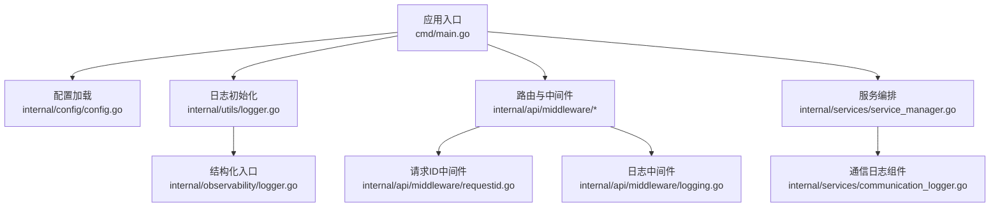
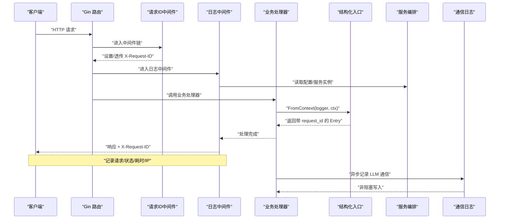
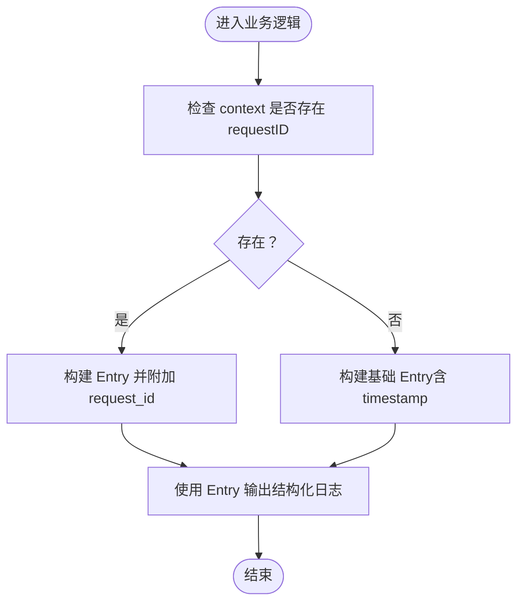
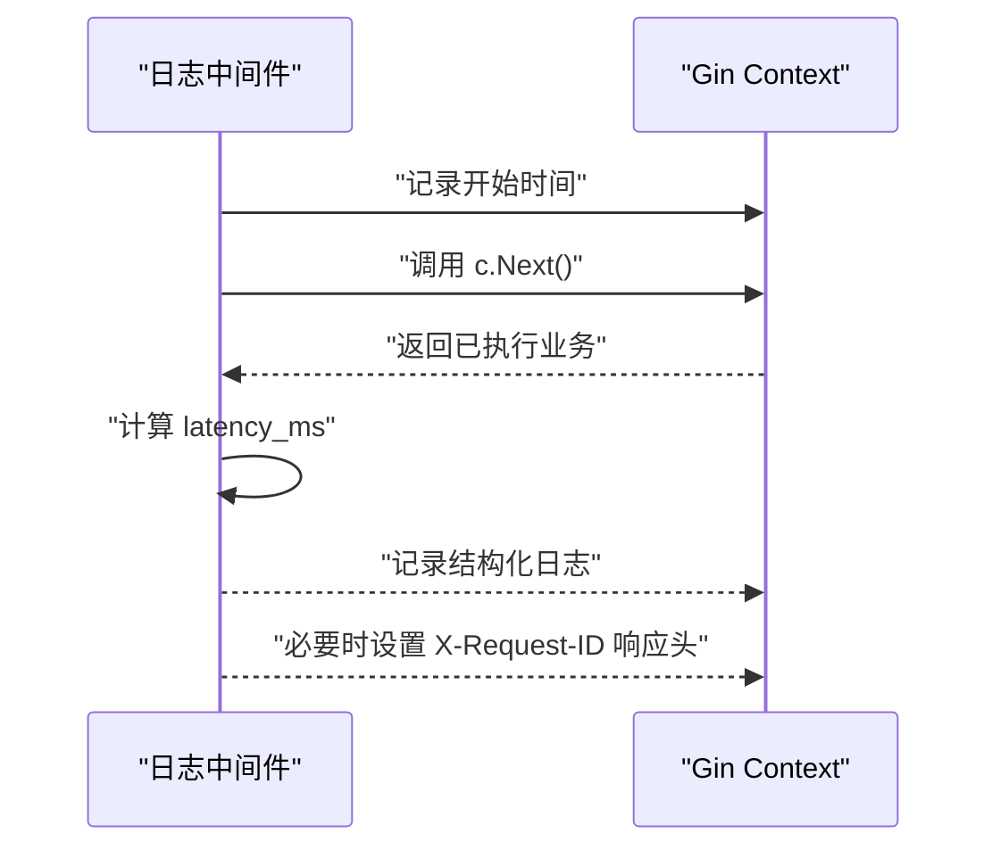
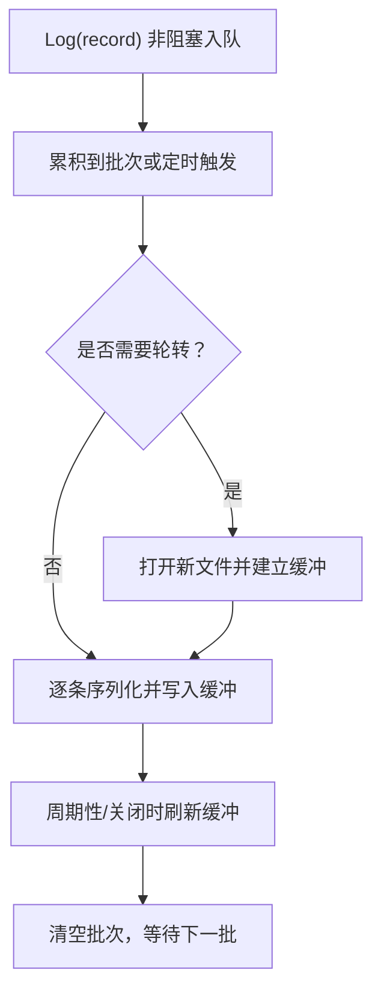
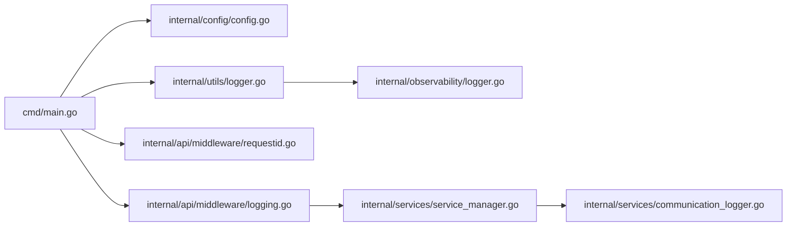

# 结构化日志

<cite>
**本文引用的文件**
- [cmd/main.go](file://cmd/main.go)
- [internal/utils/logger.go](file://internal/utils/logger.go)
- [internal/observability/logger.go](file://internal/observability/logger.go)
- [internal/api/middleware/requestid.go](file://internal/api/middleware/requestid.go)
- [internal/api/middleware/logging.go](file://internal/api/middleware/logging.go)
- [internal/config/config.go](file://internal/config/config.go)
- [internal/services/communication_logger.go](file://internal/services/communication_logger.go)
- [internal/services/service_manager.go](file://internal/services/service_manager.go)
- [internal/api/middleware/logging_test.go](file://internal/api/middleware/logging_test.go)
- [internal/api/middleware/requestid_test.go](file://internal/api/middleware/requestid_test.go)
- [internal/observability/logger_test.go](file://internal/observability/logger_test.go)
</cite>

## 目录
1. [简介](#简介)
2. [项目结构](#项目结构)
3. [核心组件](#核心组件)
4. [架构总览](#架构总览)
5. [组件详解](#组件详解)
6. [依赖关系分析](#依赖关系分析)
7. [性能与可靠性](#性能与可靠性)
8. [故障排查指南](#故障排查指南)
9. [结论](#结论)
10. [附录：配置与最佳实践](#附录配置与最佳实践)

## 简介
本文件面向 Wolink-Core 的结构化日志体系，系统性阐述以下内容：
- 使用 Logrus 进行结构化日志输出，包括日志级别、JSON 格式化与时间戳规范
- 请求 ID 的上下文传递机制（WithRequestID、GetRequestID、FromContext）
- 日志中间件（请求/响应/错误）的实现与使用
- LLM 通信日志的异步落盘、批处理、文件轮转与可观测性
- 日志聚合与分析的最佳实践（轮转、存储、查询）

## 项目结构
围绕日志功能的关键目录与文件如下：
- 应用入口与配置加载：cmd/main.go、internal/config/config.go
- 日志初始化与通用工具：internal/utils/logger.go
- 请求 ID 上下文与结构化入口：internal/observability/logger.go
- HTTP 中间件：internal/api/middleware/requestid.go、internal/api/middleware/logging.go
- 通信日志持久化：internal/services/communication_logger.go
- 服务编排与生命周期：internal/services/service_manager.go
- 测试用例：internal/api/middleware/logging_test.go、internal/api/middleware/requestid_test.go、internal/observability/logger_test.go

图表来源
- [cmd/main.go:19-89](file://cmd/main.go#L19-L89)
- [internal/config/config.go:96-184](file://internal/config/config.go#L96-L184)
- [internal/utils/logger.go:9-30](file://internal/utils/logger.go#L9-L30)
- [internal/api/middleware/requestid.go:21-39](file://internal/api/middleware/requestid.go#L21-L39)
- [internal/api/middleware/logging.go:22-51](file://internal/api/middleware/logging.go#L22-L51)
- [internal/services/service_manager.go:30-75](file://internal/services/service_manager.go#L30-L75)
- [internal/services/communication_logger.go:49-77](file://internal/services/communication_logger.go#L49-L77)
- [internal/observability/logger.go:30-42](file://internal/observability/logger.go#L30-L42)

章节来源
- [cmd/main.go:19-89](file://cmd/main.go#L19-L89)
- [internal/config/config.go:96-184](file://internal/config/config.go#L96-L184)

## 核心组件
- 日志初始化与级别控制：通过配置项 log.level 控制日志级别，统一采用 JSON 输出格式，便于机器解析与日志平台采集。
- 请求 ID 上下文：提供 WithRequestID、GetRequestID、FromContext，确保结构化日志中携带 request_id 字段，支持跨服务链路追踪。
- HTTP 中间件：RequestID 中间件负责生成或透传 X-Request-ID；LoggerWithRequestID 中间件记录请求/响应/耗时等关键指标。
- 通信日志：异步写入 JSONL 文件，按小时轮转，具备批处理、缓冲与优雅关闭能力。

章节来源
- [internal/utils/logger.go:9-30](file://internal/utils/logger.go#L9-L30)
- [internal/observability/logger.go:16-42](file://internal/observability/logger.go#L16-L42)
- [internal/api/middleware/requestid.go:21-39](file://internal/api/middleware/requestid.go#L21-L39)
- [internal/api/middleware/logging.go:22-51](file://internal/api/middleware/logging.go#L22-L51)
- [internal/services/communication_logger.go:49-77](file://internal/services/communication_logger.go#L49-L77)

## 架构总览
整体流程从应用启动开始，加载配置后初始化日志器，随后在 HTTP 路由中串联请求 ID 与日志中间件，业务层可基于结构化入口输出带 request_id 的日志；同时，通信日志组件异步持久化 LLM 交互数据。

图表来源
- [cmd/main.go:49-50](file://cmd/main.go#L49-L50)
- [internal/api/middleware/requestid.go:21-39](file://internal/api/middleware/requestid.go#L21-L39)
- [internal/api/middleware/logging.go:22-51](file://internal/api/middleware/logging.go#L22-L51)
- [internal/observability/logger.go:30-42](file://internal/observability/logger.go#L30-L42)
- [internal/services/service_manager.go:30-75](file://internal/services/service_manager.go#L30-L75)
- [internal/services/communication_logger.go:79-96](file://internal/services/communication_logger.go#L79-L96)

## 组件详解

### 日志初始化与级别控制
- 初始化方式：NewLogger 接收配置中的 log.level，设置输出为标准输出，并使用 JSONFormatter，时间戳格式为 RFC3339。
- 支持级别：debug/info/warn/error，默认 info。
- 入口位置：main.go 在启动时加载配置并创建日志器。

章节来源
- [internal/utils/logger.go:9-30](file://internal/utils/logger.go#L9-L30)
- [cmd/main.go:26-27](file://cmd/main.go#L26-L27)
- [internal/config/config.go:74-76](file://internal/config/config.go#L74-L76)

### 请求 ID 上下文传递
- WithRequestID：将字符串类型的 requestID 写入 context。
- GetRequestID：从 context 中取出 requestID，不存在则返回空串。
- FromContext：基于现有 logger 生成带 timestamp 的 Entry，并在 context 存在 requestID 时附加 request_id 字段。
- 使用建议：业务层在需要跨模块/跨函数传递请求上下文时，优先使用 FromContext 获取结构化 Entry。

图表来源
- [internal/observability/logger.go:16-42](file://internal/observability/logger.go#L16-L42)

章节来源
- [internal/observability/logger.go:16-42](file://internal/observability/logger.go#L16-L42)
- [internal/observability/logger_test.go:15-60](file://internal/observability/logger_test.go#L15-L60)

### HTTP 请求 ID 中间件
- 功能：若请求头携带 X-Request-ID，则透传；否则生成新 UUID，并将 ID 写入响应头与 gin.Context。
- 可用性：c.GetString("X-Request-ID") 可在后续中间件/处理器中获取。
- 典型用法：在路由注册时置于首位，确保后续中间件与处理器均可访问。

章节来源
- [internal/api/middleware/requestid.go:8-39](file://internal/api/middleware/requestid.go#L8-L39)
- [internal/api/middleware/requestid_test.go:15-73](file://internal/api/middleware/requestid_test.go#L15-L73)

### HTTP 日志中间件
- 记录字段：request_id、timestamp、method、path、status、latency_ms、client_ip。
- 计算逻辑：在 c.Next() 后计算耗时，保证覆盖下游处理时间。
- 响应头：若存在 request_id，会回写 X-Request-ID 头，便于客户端/网关侧关联。

图表来源
- [internal/api/middleware/logging.go:22-51](file://internal/api/middleware/logging.go#L22-L51)

章节来源
- [internal/api/middleware/logging.go:10-51](file://internal/api/middleware/logging.go#L10-L51)
- [internal/api/middleware/logging_test.go:18-79](file://internal/api/middleware/logging_test.go#L18-L79)

### 通信日志组件（LLM 交互）
- 数据模型：CommunicationRecord 包含时间、请求 ID、APIKeyID、部门 ID、模型名、是否流式、请求/响应体、Token 数、耗时、是否含敏感信息、错误信息等。
- 异步写入：内部维护通道与后台 worker，非阻塞地接收记录并批量写入 JSONL 文件。
- 文件轮转：按小时轮转（文件名包含小时粒度），带缓冲写入（256KB 缓冲区）。
- 错误处理：目录创建失败、文件打开失败、序列化失败、写入失败均有日志回调输出。
- 关闭流程：优雅关闭，刷写剩余批次并释放资源。

图表来源
- [internal/services/communication_logger.go:79-203](file://internal/services/communication_logger.go#L79-L203)
- [internal/services/communication_logger.go:205-236](file://internal/services/communication_logger.go#L205-L236)
- [internal/services/communication_logger.go:238-271](file://internal/services/communication_logger.go#L238-L271)

章节来源
- [internal/services/communication_logger.go:15-47](file://internal/services/communication_logger.go#L15-L47)
- [internal/services/communication_logger.go:49-77](file://internal/services/communication_logger.go#L49-L77)
- [internal/services/communication_logger.go:98-143](file://internal/services/communication_logger.go#L98-L143)
- [internal/services/communication_logger.go:145-203](file://internal/services/communication_logger.go#L145-L203)
- [internal/services/communication_logger.go:205-236](file://internal/services/communication_logger.go#L205-L236)
- [internal/services/communication_logger.go:238-271](file://internal/services/communication_logger.go#L238-L271)

### 服务编排与生命周期
- ServiceManager 在构造时根据配置初始化 CommunicationLogger，并将主 logger 的 Info/Error 回调注入。
- Stop 时负责关闭 CommunicationLogger，确保数据落盘与资源释放。

章节来源
- [internal/services/service_manager.go:30-75](file://internal/services/service_manager.go#L30-L75)

## 依赖关系分析
- cmd/main.go 依赖 internal/config/config.go 读取配置，依赖 internal/utils/logger.go 初始化日志器。
- HTTP 中间件依赖 Gin，彼此通过中间件链组合使用。
- 业务层通过 internal/observability/logger.go 的 FromContext 获取带 request_id 的 Entry。
- ServiceManager 将日志器注入 CommunicationLogger，形成日志回调链路。

图表来源
- [cmd/main.go:19-89](file://cmd/main.go#L19-L89)
- [internal/config/config.go:96-184](file://internal/config/config.go#L96-L184)
- [internal/utils/logger.go:9-30](file://internal/utils/logger.go#L9-L30)
- [internal/observability/logger.go:30-42](file://internal/observability/logger.go#L30-L42)
- [internal/api/middleware/requestid.go:21-39](file://internal/api/middleware/requestid.go#L21-L39)
- [internal/api/middleware/logging.go:22-51](file://internal/api/middleware/logging.go#L22-L51)
- [internal/services/service_manager.go:30-75](file://internal/services/service_manager.go#L30-L75)
- [internal/services/communication_logger.go:49-77](file://internal/services/communication_logger.go#L49-L77)

章节来源
- [cmd/main.go:19-89](file://cmd/main.go#L19-L89)
- [internal/api/middleware/requestid.go:21-39](file://internal/api/middleware/requestid.go#L21-L39)
- [internal/api/middleware/logging.go:22-51](file://internal/api/middleware/logging.go#L22-L51)
- [internal/observability/logger.go:30-42](file://internal/observability/logger.go#L30-L42)
- [internal/services/service_manager.go:30-75](file://internal/services/service_manager.go#L30-L75)
- [internal/services/communication_logger.go:49-77](file://internal/services/communication_logger.go#L49-L77)

## 性能与可靠性
- 日志级别：通过配置 log.level 控制输出量，生产环境建议 info/warn/error。
- JSON 输出：便于日志平台解析，避免文本正则匹配带来的性能损耗。
- 中间件开销：日志中间件仅在 c.Next() 后计算耗时并输出，对业务处理影响最小。
- 通信日志：
  - 非阻塞入队：Log(record) 采用 select 非阻塞发送，满载时丢弃并记录错误，避免阻塞业务线程。
  - 批量写入：默认批次大小 100，减少系统调用次数。
  - 定时刷新：FlushIntervalMs 控制周期刷新，兼顾实时性与吞吐。
  - 文件轮转：按小时轮转，避免单文件过大；缓冲区 256KB，降低磁盘 IO 压力。
- 优雅关闭：CommunicationLogger 提供 Close，确保剩余批次写入与文件句柄释放。

章节来源
- [internal/utils/logger.go:9-30](file://internal/utils/logger.go#L9-L30)
- [internal/api/middleware/logging.go:22-51](file://internal/api/middleware/logging.go#L22-L51)
- [internal/services/communication_logger.go:79-96](file://internal/services/communication_logger.go#L79-L96)
- [internal/services/communication_logger.go:145-203](file://internal/services/communication_logger.go#L145-L203)
- [internal/services/communication_logger.go:238-271](file://internal/services/communication_logger.go#L238-L271)

## 故障排查指南
- 日志不带 request_id
  - 检查是否在路由中先注册 RequestID 中间件，再注册 LoggerWithRequestID。
  - 确认业务层使用 FromContext(logger, ctx) 获取 Entry。
- 日志级别无效
  - 检查配置文件中 log.level 是否正确，以及 main.go 是否正确读取配置。
- 通信日志未落盘
  - 检查 communication_log.enabled 与 storage_path 是否有效。
  - 观察日志中关于“目录创建失败/文件打开失败/缓冲刷新失败”的错误提示。
- 性能问题
  - 调整 FlushIntervalMs 与批次大小，平衡延迟与吞吐。
  - 关注“通道已满”告警，考虑扩容或限流上游写入速率。

章节来源
- [internal/api/middleware/requestid.go:21-39](file://internal/api/middleware/requestid.go#L21-L39)
- [internal/api/middleware/logging.go:22-51](file://internal/api/middleware/logging.go#L22-L51)
- [internal/observability/logger.go:30-42](file://internal/observability/logger.go#L30-L42)
- [internal/config/config.go:74-94](file://internal/config/config.go#L74-L94)
- [internal/services/communication_logger.go:55-59](file://internal/services/communication_logger.go#L55-L59)
- [internal/services/communication_logger.go:161-167](file://internal/services/communication_logger.go#L161-L167)
- [internal/services/communication_logger.go#L194-L199:194-199](file://internal/services/communication_logger.go#L194-L199)

## 结论
Wolink-Core 的日志体系以 Logrus 为基础，结合 Gin 中间件与自研结构化入口，实现了：
- 统一的日志级别与 JSON 输出
- 明确的请求 ID 上下文传递
- HTTP 层请求/响应/错误的结构化记录
- LLM 通信的异步、批量化、轮转式持久化
该体系既满足开发调试需求，也便于生产环境的日志聚合与分析。

## 附录：配置与最佳实践

### 配置项说明（来自配置结构）
- log.level：日志级别（debug/info/warn/error）
- communication_log.enabled：是否启用通信日志
- communication_log.storage_path：日志文件存储路径
- communication_log.flush_interval_ms：刷新间隔（毫秒）
- infrastructure.*：HTTP 服务器超时与连接池配置（与日志无关，但影响稳定性）

章节来源
- [internal/config/config.go:74-94](file://internal/config/config.go#L74-L94)
- [internal/config/config.go:126-184](file://internal/config/config.go#L126-L184)

### 使用示例与场景指引（以路径代替具体代码）
- 初始化日志器并在 main 中使用
  - 参考：[cmd/main.go:26-27](file://cmd/main.go#L26-L27)
- 在中间件链中加入请求 ID 与日志中间件
  - 请求 ID 中间件：[internal/api/middleware/requestid.go:21-39](file://internal/api/middleware/requestid.go#L21-L39)
  - 日志中间件：[internal/api/middleware/logging.go:22-51](file://internal/api/middleware/logging.go#L22-L51)
- 在业务层使用结构化入口输出日志
  - 参考：[internal/observability/logger.go:30-42](file://internal/observability/logger.go#L30-L42)
- 启用并配置通信日志
  - 参考：[internal/services/service_manager.go:49-54](file://internal/services/service_manager.go#L49-L54)
  - 配置项：[internal/config/config.go:88-94](file://internal/config/config.go#L88-L94)

### 日志聚合与分析最佳实践
- 日志轮转
  - 通信日志按小时轮转，文件名为“YYYY-MM-DD-HH.log.jsonl”，便于按天/小时检索。
- 日志存储
  - 建议将 storage_path 指向独立挂载点，预留充足空间；定期清理过期文件。
- 日志查询
  - 使用 JSONFormatter，字段如 request_id、status、latency_ms、method、path、client_ip 可直接作为过滤条件。
- 性能优化
  - 调整 flush_interval_ms 与批次大小，避免频繁小块写入。
  - 对高频写入场景，可在上游做限速或降采样。