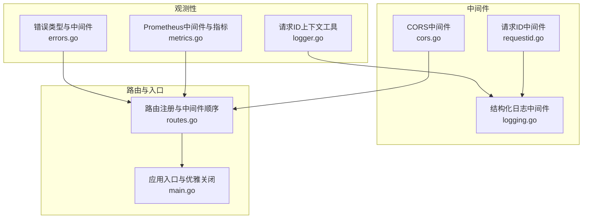
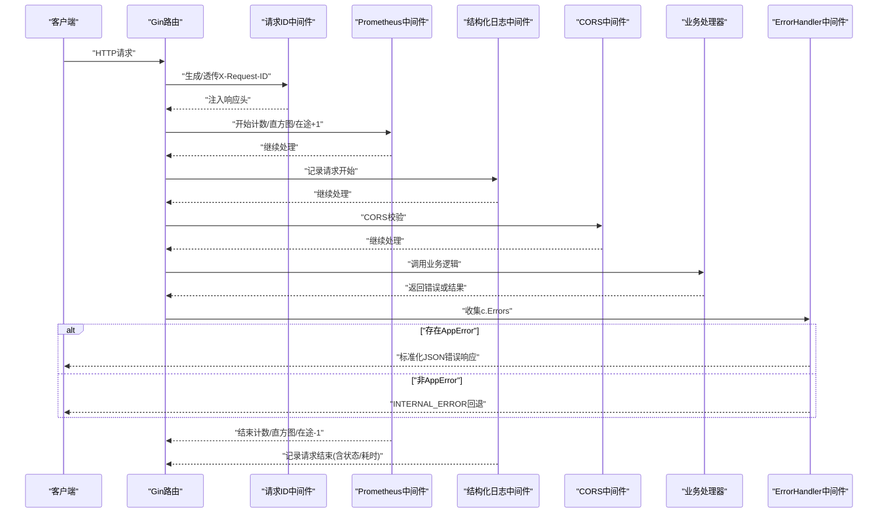
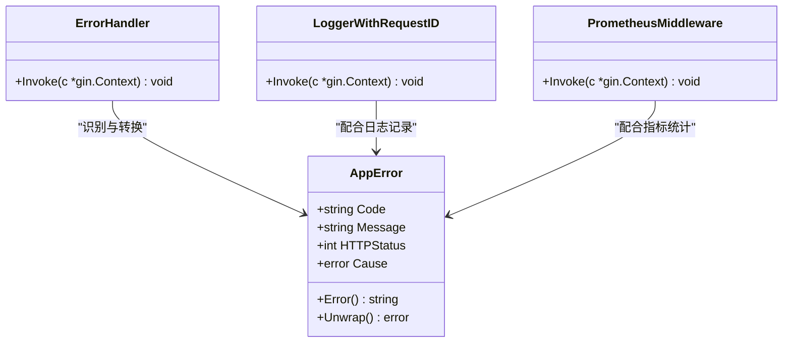
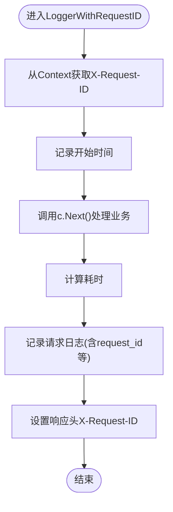
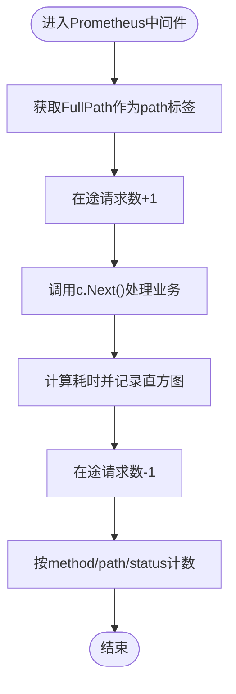
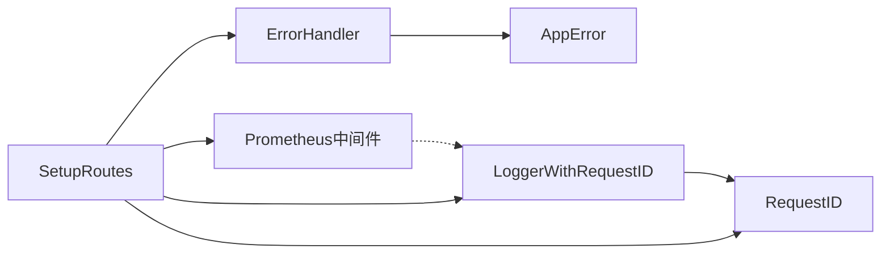

# 错误处理

<cite>
**本文引用的文件**
- [errors.go](file://internal/observability/errors.go)
- [errors_test.go](file://internal/observability/errors_test.go)
- [logger.go](file://internal/observability/logger.go)
- [metrics.go](file://internal/observability/metrics.go)
- [logging.go](file://internal/api/middleware/logging.go)
- [requestid.go](file://internal/api/middleware/requestid.go)
- [routes.go](file://internal/api/routes.go)
- [main.go](file://cmd/main.go)
- [common.go](file://internal/api/handlers/common.go)
- [admin_auth_handler.go](file://internal/api/handlers/admin_auth_handler.go)
- [logger.go](file://internal/utils/logger.go)
</cite>

## 目录
1. [简介](#简介)
2. [项目结构](#项目结构)
3. [核心组件](#核心组件)
4. [架构总览](#架构总览)
5. [详细组件分析](#详细组件分析)
6. [依赖分析](#依赖分析)
7. [性能考虑](#性能考虑)
8. [故障排查指南](#故障排查指南)
9. [结论](#结论)
10. [附录](#附录)

## 简介
本文件系统性梳理 Wolink-Core 的错误处理体系，覆盖错误分类与错误码设计、错误传播机制（包装、上下文保留、链式追踪）、全局错误中间件、日志与指标集成、以及可扩展的错误降级与熔断建议。文档同时提供常见错误场景的处理示例与调试技巧，并展示如何基于指标进行故障分析与稳定性评估。

## 项目结构
错误处理相关能力主要分布在以下模块：
- 观测性层：统一的错误类型定义、错误响应中间件、结构化日志与指标采集
- 中间件层：请求ID生成与透传、结构化日志记录、CORS处理
- 路由层：全局中间件顺序与错误响应的最终落点
- 应用入口：服务器启动与优雅关闭流程

**图表来源**
- [errors.go:1-143](file://internal/observability/errors.go#L1-L143)
- [logger.go:1-43](file://internal/observability/logger.go#L1-L43)
- [metrics.go:1-93](file://internal/observability/metrics.go#L1-L93)
- [requestid.go:1-40](file://internal/api/middleware/requestid.go#L1-L40)
- [logging.go:1-52](file://internal/api/middleware/logging.go#L1-L52)
- [routes.go:1-129](file://internal/api/routes.go#L1-L129)
- [main.go:1-89](file://cmd/main.go#L1-L89)

**章节来源**
- [routes.go:14-29](file://internal/api/routes.go#L14-L29)
- [main.go:19-89](file://cmd/main.go#L19-L89)

## 核心组件
- 统一错误类型与响应中间件
  - AppError：包含机器可读错误码、人类可读消息、HTTP状态码与底层Cause，支持错误链unwrap
  - 预定义错误：UNAUTHORIZED、FORBIDDEN、NOT_FOUND、BAD_REQUEST、RATE_LIMITED、INTERNAL_ERROR
  - 新建构造器：NewValidationError、NewServiceError
  - ErrorHandler：Gin中间件，将AppError转换为标准化JSON响应，非AppError回退为INTERNAL_ERROR
- 请求ID与上下文
  - RequestID中间件：生成或透传X-Request-ID，注入响应头
  - 日志上下文工具：从context提取request_id，自动注入到logrus.Entry
- 结构化日志与指标
  - LoggerWithRequestID：记录请求ID、方法、路径、状态、耗时、客户端IP等
  - Prometheus中间件：计数、直方图、在途请求数，使用FullPath避免高基数
- 路由与入口
  - 全局中间件顺序确保ErrorHandler位于末尾，作为兜底响应层
  - main.go负责服务器生命周期与优雅关闭

**章节来源**
- [errors.go:10-142](file://internal/observability/errors.go#L10-L142)
- [requestid.go:11-39](file://internal/api/middleware/requestid.go#L11-L39)
- [logger.go:16-42](file://internal/observability/logger.go#L16-L42)
- [logging.go:10-51](file://internal/api/middleware/logging.go#L10-L51)
- [metrics.go:53-92](file://internal/observability/metrics.go#L53-L92)
- [routes.go:17-29](file://internal/api/routes.go#L17-L29)

## 架构总览
下图展示了错误从产生到响应的完整链路，以及与日志、指标的协同：

**图表来源**
- [routes.go:17-29](file://internal/api/routes.go#L17-L29)
- [errors.go:103-142](file://internal/observability/errors.go#L103-L142)
- [logging.go:22-51](file://internal/api/middleware/logging.go#L22-L51)
- [metrics.go:62-86](file://internal/observability/metrics.go#L62-L86)

## 详细组件分析

### 组件A：统一错误类型与响应中间件
- 设计要点
  - AppError.Code用于机器可读识别，Message用于人类可读提示
  - HTTPStatus映射标准HTTP状态码，便于网关与客户端一致处理
  - Cause保留底层错误，支持errors.Is/errors.As与Unwrap链式追踪
  - 预定义错误覆盖鉴权、权限、资源不存在、请求非法、限流与内部错误
  - NewValidationError与NewServiceError分别面向参数校验与服务层错误包装
  - ErrorHandler在路由末尾执行，优先处理AppError，非AppError统一回退为INTERNAL_ERROR
- 测试验证
  - 预定义错误的状态码与代码正确性
  - ValidationError与ServiceError的行为与错误链
  - ErrorHandler对AppError与未知错误的响应格式

**图表来源**
- [errors.go:10-142](file://internal/observability/errors.go#L10-L142)
- [logging.go:10-51](file://internal/api/middleware/logging.go#L10-L51)
- [metrics.go:53-92](file://internal/observability/metrics.go#L53-L92)

**章节来源**
- [errors.go:10-142](file://internal/observability/errors.go#L10-L142)
- [errors_test.go:15-95](file://internal/observability/errors_test.go#L15-L95)

### 组件B：请求ID与上下文日志
- RequestID中间件
  - 若请求头携带X-Request-ID则透传，否则生成UUID
  - 将ID存入gin.Context并在响应头中透传，便于端到端追踪
- 日志上下文工具
  - WithRequestID/GetRequestID提供轻量上下文存储
  - FromContext在logrus.Entry中自动注入request_id，若存在则加入
- LoggerWithRequestID中间件
  - 记录请求ID、时间戳、方法、路径、状态、耗时、客户端IP
  - 在响应头中确保X-Request-ID存在

**图表来源**
- [logging.go:22-51](file://internal/api/middleware/logging.go#L22-L51)
- [requestid.go:21-39](file://internal/api/middleware/requestid.go#L21-L39)
- [logger.go:16-42](file://internal/observability/logger.go#L16-L42)

**章节来源**
- [requestid.go:11-39](file://internal/api/middleware/requestid.go#L11-L39)
- [logger.go:16-42](file://internal/observability/logger.go#L16-L42)
- [logging.go:10-51](file://internal/api/middleware/logging.go#L10-L51)

### 组件C：指标与可观测性
- Prometheus中间件
  - 使用FullPath作为path标签，避免路径参数导致的高基数
  - 统计：总请求数(http_requests_total)、延迟直方图(http_request_duration_seconds)、在途请求数(http_requests_in_flight)
- 指标采集与暴露
  - Handler提供/metrics端点，使用promhttp.Handler暴露指标
- 日志与指标联动
  - LoggerWithRequestID记录状态码，与Prometheus的status标签形成闭环

**图表来源**
- [metrics.go:62-86](file://internal/observability/metrics.go#L62-L86)

**章节来源**
- [metrics.go:12-92](file://internal/observability/metrics.go#L12-L92)

### 组件D：路由与全局中间件顺序
- 中间件顺序（自顶向下）
  1) gin.Recovery：全局panic捕获
  2) RequestID：生成/透传请求ID
  3) Prometheus：指标采集
  4) LoggerWithRequestID：结构化日志
  5) CORS：跨域处理
  6) ErrorHandler：统一错误响应
- 作用
  - ErrorHandler位于末尾，确保所有错误均被标准化输出
  - RequestID与LoggerWithRequestID配合，实现端到端追踪
  - Prometheus在Logger之前，保证指标统计不受日志影响

**章节来源**
- [routes.go:17-29](file://internal/api/routes.go#L17-L29)

### 组件E：处理器中的错误处理实践
- 参数校验
  - 使用formatValidationError将validator错误转换为友好消息，结合业务错误码返回
- 业务错误
  - 登录/登出/管理操作失败时，记录日志并返回结构化错误
- 处理器与错误类型的协作
  - 对于可预期的业务错误，推荐使用AppError并设置合适的HTTPStatus
  - 对于未知错误，保持默认panic恢复，ErrorHandler兜底为INTERNAL_ERROR

**章节来源**
- [common.go:10-31](file://internal/api/handlers/common.go#L10-L31)
- [admin_auth_handler.go:27-68](file://internal/api/handlers/admin_auth_handler.go#L27-L68)
- [admin_auth_handler.go:70-109](file://internal/api/handlers/admin_auth_handler.go#L70-L109)

## 依赖分析
- 组件耦合
  - ErrorHandler依赖gin.Context.Errors与AppError类型
  - LoggerWithRequestID依赖RequestID中间件提供的X-Request-ID
  - Prometheus中间件与LoggerWithRequestID独立，但共同服务于可观测性
- 外部依赖
  - Gin：中间件模式与上下文
  - Logrus：结构化日志
  - Prometheus：指标采集与暴露
- 可能的循环依赖
  - 当前模块间为单向依赖，无循环

**图表来源**
- [errors.go:103-142](file://internal/observability/errors.go#L103-L142)
- [logging.go:22-51](file://internal/api/middleware/logging.go#L22-L51)
- [metrics.go:62-86](file://internal/observability/metrics.go#L62-L86)
- [requestid.go:21-39](file://internal/api/middleware/requestid.go#L21-L39)
- [routes.go:17-29](file://internal/api/routes.go#L17-L29)

**章节来源**
- [routes.go:17-29](file://internal/api/routes.go#L17-L29)

## 性能考虑
- ErrorHandler为O(1)处理，仅在c.Errors非空时触发
- Prometheus中间件使用FullPath避免高基数，直方图桶设置针对API延迟优化
- LoggerWithRequestID仅做必要字段拼装，开销极低
- 建议
  - 控制错误日志量，避免在高频错误场景中产生大量IO
  - 对热点路径的错误统计可考虑采样或聚合

[本节为通用指导，无需特定文件来源]

## 故障排查指南
- 如何定位一次请求的全链路错误
  - 从响应头或日志中获取X-Request-ID，关联该ID下的所有日志条目
  - 检查Prometheus指标，确认错误率与延迟分布
- 常见问题与定位步骤
  - 401/403错误：检查鉴权中间件与AppError.Code是否匹配
  - 400错误：检查参数校验与formatValidationError输出
  - 429错误：检查限流策略与ErrRateLimited使用
  - 500错误：确认ErrorHandler是否正常工作，查看Cause链
- 调试技巧
  - 在开发环境开启Debug级别日志，观察详细上下文
  - 使用/health与/metrics端点快速验证服务健康与指标可用
  - 利用测试用例思路复现：构造AppError并验证ErrorHandler行为

**章节来源**
- [errors_test.go:62-95](file://internal/observability/errors_test.go#L62-L95)
- [logger.go:9-30](file://internal/utils/logger.go#L9-L30)
- [routes.go:39-44](file://internal/api/routes.go#L39-L44)

## 结论
Wolink-Core 的错误处理体系以AppError为核心，结合ErrorHandler、RequestID、LoggerWithRequestID与Prometheus中间件，实现了统一的错误响应、端到端追踪与可观测性。该体系具备良好的扩展性，可在不破坏现有契约的前提下引入更复杂的降级与熔断策略。

[本节为总结，无需特定文件来源]

## 附录

### 错误分类与错误码设计
- 业务错误
  - 通过AppError.Code与Message描述业务语义，HTTPStatus映射业务含义
  - 建议为每类业务错误定义稳定且唯一的Code
- 系统错误
  - 由ErrorHandler兜底的非AppError错误统一标记为INTERNAL_ERROR
- 网络错误
  - 通过HTTPStatus与AppError.Code表达重试友好度（如429、503等）

[本节为概念性说明，无需特定文件来源]

### 错误传播机制
- 包装与上下文保留
  - NewServiceError允许将底层错误作为Cause保存，便于链式追踪
  - LoggerWithRequestID与FromContext确保请求ID贯穿日志链路
- 错误链追踪
  - 使用errors.Is/errors.As与Unwrap访问Cause，逐步还原错误来源

**章节来源**
- [errors.go:92-101](file://internal/observability/errors.go#L92-L101)
- [logger.go:16-42](file://internal/observability/logger.go#L16-L42)

### 错误中间件实现要点
- 全局异常捕获
  - gin.Recovery确保panic被捕获，避免进程崩溃
- 错误响应格式化
  - ErrorHandler将AppError序列化为{"error": {"code": "...", "message": "..."}}
- 错误日志记录
  - LoggerWithRequestID记录关键上下文字段，便于定位

**章节来源**
- [routes.go:17-29](file://internal/api/routes.go#L17-L29)
- [errors.go:103-142](file://internal/observability/errors.go#L103-L142)
- [logging.go:22-51](file://internal/api/middleware/logging.go#L22-L51)

### 错误降级与熔断建议
- 降级策略
  - 对外部依赖不可用时，返回ErrRateLimited或预设降级数据
  - 在上游服务不稳定时，返回可缓存的近似结果
- 熔断机制
  - 基于Prometheus指标（如错误率、P95延迟）触发熔断
  - 熔断窗口内直接返回ErrRateLimited，窗口外指数退避探测

[本节为扩展建议，无需特定文件来源]

### 常见错误场景与处理示例
- 参数校验失败
  - 使用NewValidationError并结合formatValidationError输出
- 业务逻辑失败
  - 使用NewServiceError包装底层错误，设置合理HTTPStatus
- 未知错误
  - 交由ErrorHandler兜底为INTERNAL_ERROR

**章节来源**
- [errors.go:82-101](file://internal/observability/errors.go#L82-L101)
- [common.go:10-31](file://internal/api/handlers/common.go#L10-L31)

### 基于指标的故障分析与稳定性评估
- 关键指标
  - http_requests_total：按method/path/status统计错误占比
  - http_request_duration_seconds：P95/P99延迟与错误率关联
  - http_requests_in_flight：峰值并发与错误发生的时序关系
- 分析方法
  - 将错误码与路径标签结合，定位热点错误与路由
  - 结合X-Request-ID与日志，复现典型错误场景

**章节来源**
- [metrics.go:12-92](file://internal/observability/metrics.go#L12-L92)