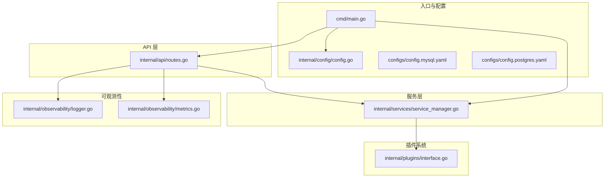
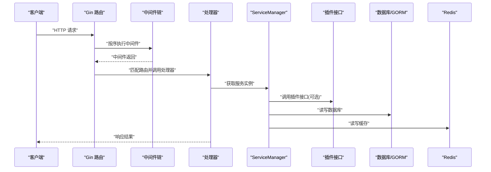
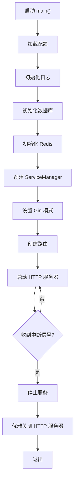
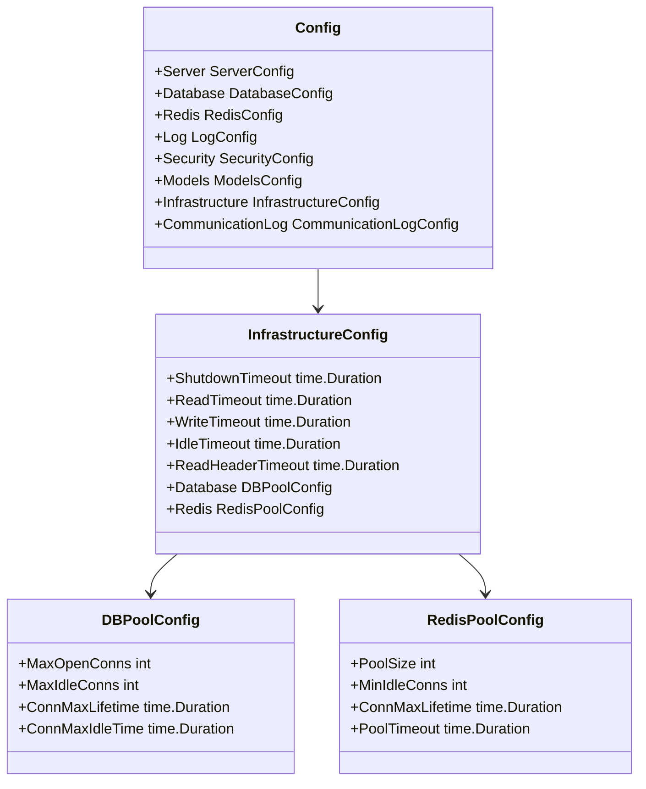
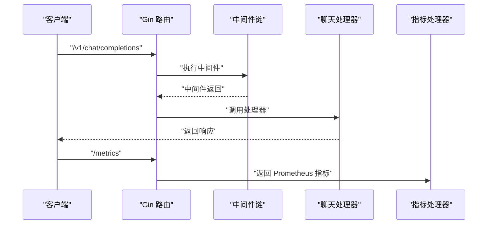
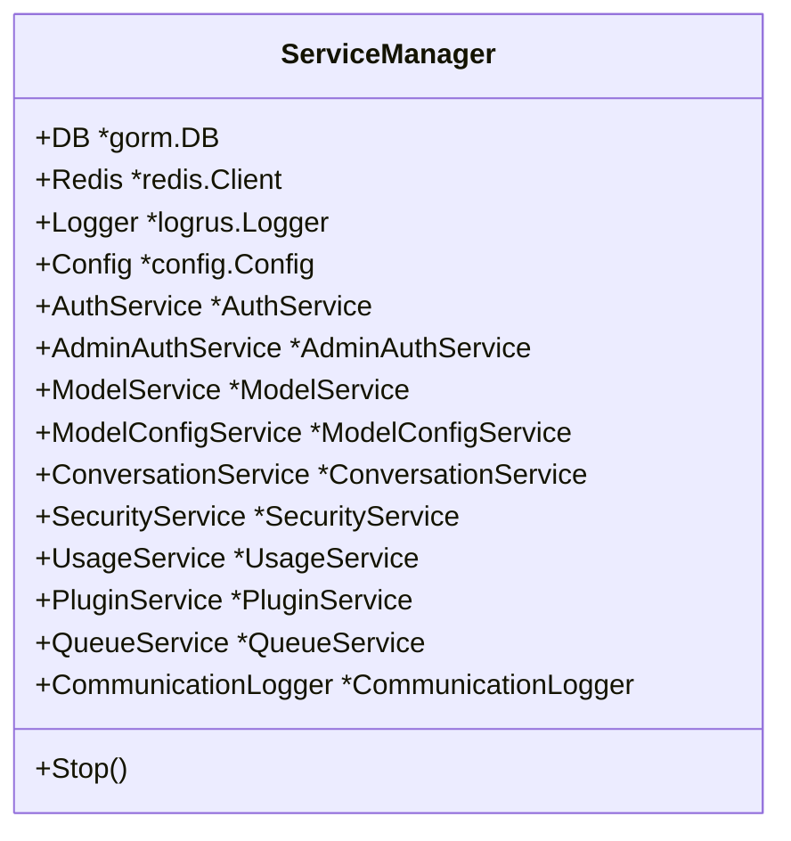
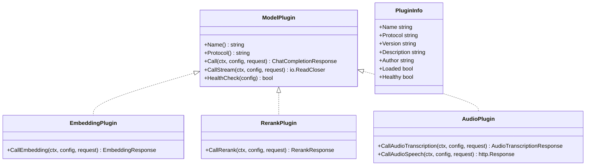
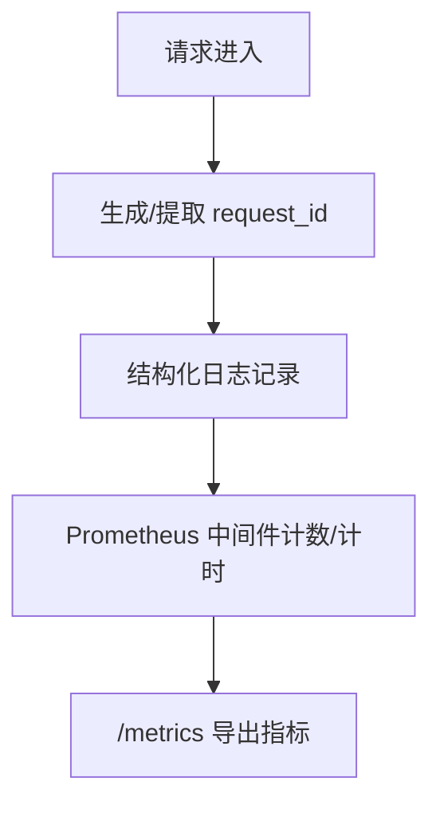
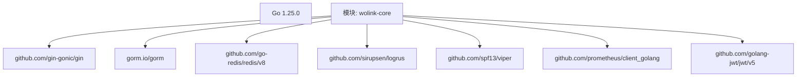

# 开发指南

<cite>
**本文引用的文件**
- [cmd/main.go](file://cmd/main.go)
- [go.mod](file://go.mod)
- [configs/config.postgres.yaml](file://configs/config.postgres.yaml)
- [configs/config.mysql.yaml](file://configs/config.mysql.yaml)
- [Dockerfile](file://Dockerfile)
- [docker-compose.yml](file://docker-compose.yml)
- [internal/config/config.go](file://internal/config/config.go)
- [internal/api/routes.go](file://internal/api/routes.go)
- [internal/services/service_manager.go](file://internal/services/service_manager.go)
- [internal/plugins/interface.go](file://internal/plugins/interface.go)
- [internal/observability/logger.go](file://internal/observability/logger.go)
- [internal/observability/metrics.go](file://internal/observability/metrics.go)
- [scripts/start.sh](file://scripts/start.sh)
- [scripts/deploy.sh](file://scripts/deploy.sh)
- [scripts/performance_test.sh](file://scripts/performance_test.sh)
</cite>

## 目录
1. [简介](#简介)
2. [项目结构](#项目结构)
3. [核心组件](#核心组件)
4. [架构总览](#架构总览)
5. [详细组件分析](#详细组件分析)
6. [依赖分析](#依赖分析)
7. [性能考虑](#性能考虑)
8. [故障排查指南](#故障排查指南)
9. [结论](#结论)
10. [附录](#附录)

## 简介
本开发指南面向 Wolink-Core 的开发者，提供从环境搭建、代码规范、调试与性能优化，到贡献流程与常见问题解决的完整指引。Wolink-Core 是一个基于 Go 语言构建的 AI 网关服务，采用 Gin 框架提供 OpenAI 兼容的 REST API，并通过插件化模型适配器支持多种大模型能力（对话、嵌入、重排序、语音等）。

## 项目结构
项目采用按职责分层的组织方式：入口程序位于 cmd，核心业务逻辑分布在 internal 下的 api、services、plugins、config、observability 等子包；配置文件位于 configs；容器化与编排在根目录提供 Dockerfile 与 docker-compose 文件；脚本位于 scripts 目录。

**图表来源**
- [cmd/main.go:1-89](file://cmd/main.go#L1-L89)
- [internal/config/config.go:1-185](file://internal/config/config.go#L1-L185)
- [internal/api/routes.go:1-129](file://internal/api/routes.go#L1-L129)
- [internal/services/service_manager.go:1-76](file://internal/services/service_manager.go#L1-L76)
- [internal/observability/logger.go:1-43](file://internal/observability/logger.go#L1-L43)
- [internal/observability/metrics.go:1-93](file://internal/observability/metrics.go#L1-L93)
- [internal/plugins/interface.go:1-55](file://internal/plugins/interface.go#L1-L55)
- [configs/config.mysql.yaml:1-37](file://configs/config.mysql.yaml#L1-L37)
- [configs/config.postgres.yaml:1-35](file://configs/config.postgres.yaml#L1-L35)

**章节来源**
- [cmd/main.go:1-89](file://cmd/main.go#L1-L89)
- [internal/config/config.go:1-185](file://internal/config/config.go#L1-L185)
- [internal/api/routes.go:1-129](file://internal/api/routes.go#L1-L129)
- [internal/services/service_manager.go:1-76](file://internal/services/service_manager.go#L1-L76)
- [internal/observability/logger.go:1-43](file://internal/observability/logger.go#L1-L43)
- [internal/observability/metrics.go:1-93](file://internal/observability/metrics.go#L1-L93)
- [internal/plugins/interface.go:1-55](file://internal/plugins/interface.go#L1-L55)
- [configs/config.mysql.yaml:1-37](file://configs/config.mysql.yaml#L1-L37)
- [configs/config.postgres.yaml:1-35](file://configs/config.postgres.yaml#L1-L35)

## 核心组件
- 应用入口与生命周期：负责加载配置、初始化日志、数据库与 Redis、创建路由、启动 HTTP 服务器以及优雅关闭。
- 配置系统：统一读取 YAML 配置与环境变量，提供默认值与基础设施超时参数。
- API 路由：定义 OpenAI 兼容接口、健康检查、指标暴露、WebSocket 代理及管理后台接口。
- 服务管理层：集中管理各业务服务（认证、模型、会话、安全、用量、插件、队列、通信日志），并在停止时进行资源回收。
- 插件接口：抽象模型插件能力（非流式/流式调用、Embedding、Rerank、音频）、插件信息结构。
- 可观测性：请求 ID 上下文传递、结构化日志、Prometheus 中间件与指标导出。

**章节来源**
- [cmd/main.go:19-89](file://cmd/main.go#L19-L89)
- [internal/config/config.go:96-124](file://internal/config/config.go#L96-L124)
- [internal/api/routes.go:14-129](file://internal/api/routes.go#L14-L129)
- [internal/services/service_manager.go:30-76](file://internal/services/service_manager.go#L30-L76)
- [internal/plugins/interface.go:11-55](file://internal/plugins/interface.go#L11-L55)
- [internal/observability/logger.go:16-42](file://internal/observability/logger.go#L16-L42)
- [internal/observability/metrics.go:53-93](file://internal/observability/metrics.go#L53-L93)

## 架构总览
Wolink-Core 采用“入口程序 -> 配置 -> 路由中间件 -> 业务服务 -> 插件适配”的分层架构。请求经由 Gin 路由进入，按顺序执行恢复、请求 ID、Prometheus、日志、CORS、错误处理等中间件，再根据路径进入具体处理器；处理器通过 ServiceManager 获取所需服务，服务内部可调用插件接口与外部系统交互。

**图表来源**
- [internal/api/routes.go:14-129](file://internal/api/routes.go#L14-L129)
- [internal/services/service_manager.go:30-62](file://internal/services/service_manager.go#L30-L62)
- [internal/plugins/interface.go:11-27](file://internal/plugins/interface.go#L11-L27)
- [cmd/main.go:49-68](file://cmd/main.go#L49-L68)

## 详细组件分析

### 组件一：应用入口与生命周期
- 职责：加载配置、初始化日志、数据库与 Redis、创建路由、启动 HTTP 服务器、监听系统信号并优雅关闭。
- 关键点：根据配置选择 Gin 运行模式；设置 HTTP 服务器超时参数；在退出信号到来时停止服务并执行优雅关闭。

**图表来源**
- [cmd/main.go:19-89](file://cmd/main.go#L19-L89)

**章节来源**
- [cmd/main.go:19-89](file://cmd/main.go#L19-L89)

### 组件二：配置系统
- 职责：定义配置结构体（服务器、数据库、Redis、日志、安全、模型、基础设施、通信日志），读取 YAML 并映射到结构体，支持环境变量覆盖与默认值。
- 关键点：环境变量前缀为 AI_GATEWAY；提供基础设施超时与连接池参数默认值；支持通信日志持久化配置。

**图表来源**
- [internal/config/config.go:10-47](file://internal/config/config.go#L10-L47)

**章节来源**
- [internal/config/config.go:96-184](file://internal/config/config.go#L96-L184)
- [configs/config.mysql.yaml:1-37](file://configs/config.mysql.yaml#L1-L37)
- [configs/config.postgres.yaml:1-35](file://configs/config.postgres.yaml#L1-L35)

### 组件三：API 路由与中间件
- 职责：注册中间件链（恢复、请求 ID、Prometheus、日志、CORS、错误处理），定义 OpenAI 兼容接口、健康检查、指标、WebSocket 代理与管理后台接口。
- 关键点：使用 FullPath 作为指标路径标签避免高基数；API Key 认证与管理员认证分别作用于不同组。

**图表来源**
- [internal/api/routes.go:14-129](file://internal/api/routes.go#L14-L129)
- [internal/observability/metrics.go:88-93](file://internal/observability/metrics.go#L88-L93)

**章节来源**
- [internal/api/routes.go:14-129](file://internal/api/routes.go#L14-L129)
- [internal/observability/metrics.go:53-93](file://internal/observability/metrics.go#L53-L93)

### 组件四：服务管理层
- 职责：聚合数据库、Redis、日志与配置，初始化各业务服务（认证、模型、会话、安全、用量、插件、队列、通信日志），并在停止时统一回收。
- 关键点：延迟加载模型配置；在停止阶段依次关闭队列、插件与通信日志。

**图表来源**
- [internal/services/service_manager.go:11-76](file://internal/services/service_manager.go#L11-L76)

**章节来源**
- [internal/services/service_manager.go:30-76](file://internal/services/service_manager.go#L30-L76)

### 组件五：插件接口体系
- 职责：抽象模型插件能力，支持非流式/流式调用、Embedding、Rerank、音频转写/合成，以及插件信息结构。
- 关键点：通过协议区分不同插件类型；CallStream 返回 io.ReadCloser 以支持流式输出。

**图表来源**
- [internal/plugins/interface.go:11-55](file://internal/plugins/interface.go#L11-L55)

**章节来源**
- [internal/plugins/interface.go:11-55](file://internal/plugins/interface.go#L11-L55)

### 组件六：可观测性（日志与指标）
- 职责：提供请求 ID 上下文传递、结构化日志记录、Prometheus 中间件与指标导出。
- 关键点：中间件使用 FullPath 作为路径标签；指标包含请求数、延迟直方图与在途请求数。

**图表来源**
- [internal/observability/logger.go:16-42](file://internal/observability/logger.go#L16-L42)
- [internal/observability/metrics.go:53-93](file://internal/observability/metrics.go#L53-L93)

**章节来源**
- [internal/observability/logger.go:16-42](file://internal/observability/logger.go#L16-L42)
- [internal/observability/metrics.go:53-93](file://internal/observability/metrics.go#L53-L93)

## 依赖分析
- 语言与版本：Go 1.25.0。
- 主要依赖：Gin（Web 框架）、GORM（数据库 ORM）、Redis 客户端、Logrus（日志）、Viper（配置）、Prometheus（指标）、JWT（鉴权）等。
- 容器镜像：基于 Alpine Linux，静态编译二进制，暴露 8080 端口。

**图表来源**
- [go.mod:1-84](file://go.mod#L1-L84)

**章节来源**
- [go.mod:1-84](file://go.mod#L1-L84)
- [Dockerfile:1-28](file://Dockerfile#L1-L28)

## 性能考虑
- 指标采集：Prometheus 中间件对请求总数、延迟分布与在途请求数进行统计，便于定位慢接口与并发瓶颈。
- 超时与优雅关闭：HTTP 服务器超时参数与优雅关闭流程确保在高负载或关闭时不会丢弃请求。
- 连接池：数据库与 Redis 提供连接池配置项，建议结合压测结果调整最大连接数与生命周期。
- 测试脚本：提供性能测试脚本示例，可结合 ab 工具进行基准测试。

**章节来源**
- [internal/observability/metrics.go:53-93](file://internal/observability/metrics.go#L53-L93)
- [internal/config/config.go:21-47](file://internal/config/config.go#L21-L47)
- [cmd/main.go:52-86](file://cmd/main.go#L52-L86)
- [scripts/performance_test.sh:1-44](file://scripts/performance_test.sh#L1-L44)

## 故障排查指南
- 启动失败：检查配置文件是否存在、环境变量是否正确、数据库与 Redis 是否可达。
- 数据库连接：确认数据库类型、主机、端口、凭据与字符集/SSL 参数。
- Redis 连接：确认主机、端口与密码配置。
- 日志与指标：通过 /metrics 端点验证指标是否正常导出；通过日志中的 request_id 追踪请求链路。
- 健康检查：访问 /health 与 /ready 确认服务可用性。
- 容器化部署：使用 docker-compose 快速拉起服务，查看日志定位问题。

**章节来源**
- [internal/config/config.go:96-124](file://internal/config/config.go#L96-L124)
- [configs/config.mysql.yaml:1-37](file://configs/config.mysql.yaml#L1-L37)
- [configs/config.postgres.yaml:1-35](file://configs/config.postgres.yaml#L1-L35)
- [internal/api/routes.go:39-44](file://internal/api/routes.go#L39-L44)
- [scripts/deploy.sh:26-55](file://scripts/deploy.sh#L26-L55)

## 结论
Wolink-Core 提供清晰的分层架构与完善的可观测性能力，适合在生产环境中快速扩展与维护。建议在开发过程中遵循本文的环境与规范要求，配合脚本与配置文件快速搭建本地与容器化环境，并通过指标与日志持续优化性能与稳定性。

## 附录

### A. 开发环境设置
- Go 版本：1.25.0（见 go.mod）。
- IDE 推荐：GoLand 或 VSCode + Go 扩展，启用 vet、lint、test、generate 等工作流。
- 调试工具：Delve（dlv）进行断点调试；使用脚本启动本地服务进行联调。
- 依赖管理：首次克隆后执行 go mod download。

**章节来源**
- [go.mod:1-84](file://go.mod#L1-L84)
- [scripts/start.sh:50-52](file://scripts/start.sh#L50-L52)

### B. 代码规范与最佳实践
- 命名约定：包名小写、简洁；结构体字段采用驼峰；常量与函数首字母大写导出。
- 代码组织：按职责分层（cmd、internal/*），中间件与处理器分离，服务聚合在 ServiceManager。
- 注释标准：为公共类型与方法提供 godoc 注释；复杂逻辑添加行内注释说明。
- 错误处理：统一使用带上下文的错误包装；中间件与处理器返回一致的错误格式。
- 配置优先级：YAML 文件 < 环境变量（AI_GATEWAY_*）< 默认值。

**章节来源**
- [internal/config/config.go:96-124](file://internal/config/config.go#L96-L124)

### C. 调试技巧与工具
- 断点调试：使用 dlv attach 或 dlv exec 运行 main.go；在关键处理器与服务方法设置断点。
- 性能分析：结合 Prometheus 指标与 pprof（如需）定位热点；使用性能测试脚本模拟并发场景。
- 内存泄漏检测：结合 pprof 与 GC 监控，关注长时间运行服务的内存增长趋势。

**章节来源**
- [internal/observability/metrics.go:53-93](file://internal/observability/metrics.go#L53-L93)
- [scripts/performance_test.sh:27-39](file://scripts/performance_test.sh#L27-L39)

### D. 贡献流程
- 分支管理：主分支保护，功能开发在 feature/* 分支，修复在 fix/* 分支。
- 提交规范：采用 Conventional Commits（如 feat、fix、docs、refactor）。
- 代码审查：提交 PR，至少一名维护者审查并通过 CI。
- 测试：新增功能配套单元测试与集成测试，确保覆盖率达标。

[本节为通用流程建议，不直接分析具体文件]

### E. 常见开发问题与效率提升
- 无法连接数据库：核对 configs/*.yaml 与环境变量；使用 scripts/start.sh 自动设置常用环境变量。
- Redis 不可用：确认容器或本机 Redis 服务状态；检查端口与密码。
- 指标不显示：确认 /metrics 路由与中间件注册；检查 Prometheus 抓取配置。
- 开发效率：使用 docker-compose 一键启动；利用脚本自动化初始化与压测；统一日志与指标规范。

**章节来源**
- [scripts/start.sh:28-52](file://scripts/start.sh#L28-L52)
- [scripts/deploy.sh:26-55](file://scripts/deploy.sh#L26-L55)
- [internal/api/routes.go:40-44](file://internal/api/routes.go#L40-L44)

### F. 新功能开发模板与参考实现
- 新增处理器：在 internal/api/handlers 下创建文件，注册到 internal/api/routes.go 的相应组中。
- 新增服务：在 internal/services 下创建服务结构体与方法，在 ServiceManager 中初始化并注入到处理器。
- 新增插件：实现插件接口（ModelPlugin/EmbeddingPlugin/RerankPlugin/AudioPlugin），在插件服务中注册与管理。
- 配置扩展：在 internal/config/config.go 中扩展 Config 结构体与默认值，更新 configs/*.yaml 示例。

**章节来源**
- [internal/api/routes.go:32-76](file://internal/api/routes.go#L32-L76)
- [internal/services/service_manager.go:30-62](file://internal/services/service_manager.go#L30-L62)
- [internal/plugins/interface.go:11-55](file://internal/plugins/interface.go#L11-L55)
- [internal/config/config.go:10-184](file://internal/config/config.go#L10-L184)