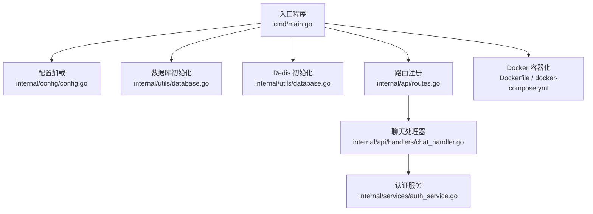
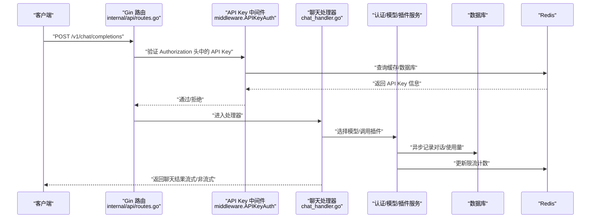
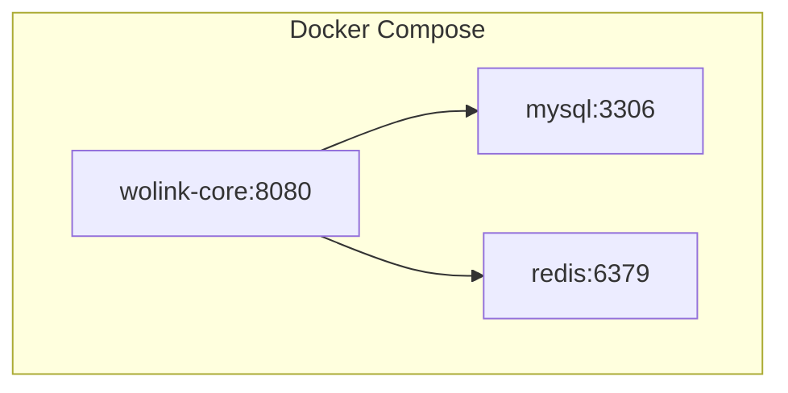
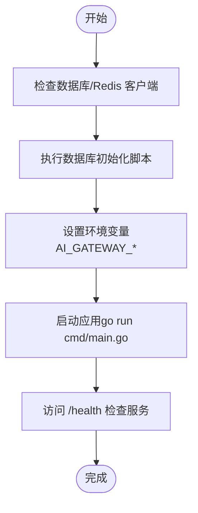
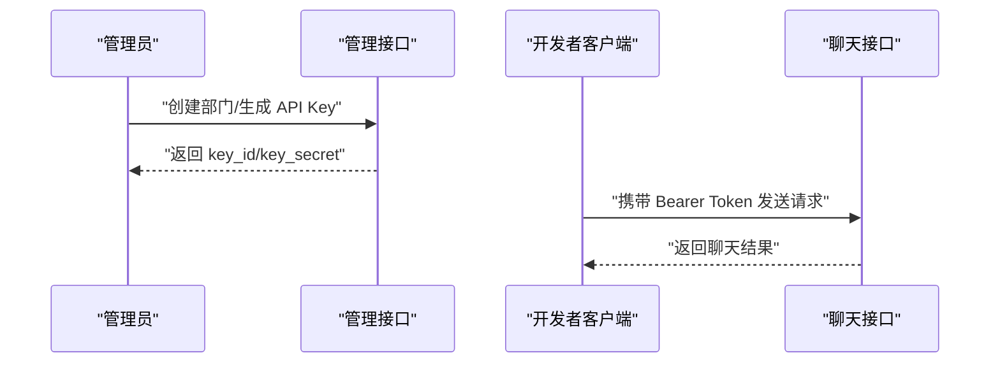
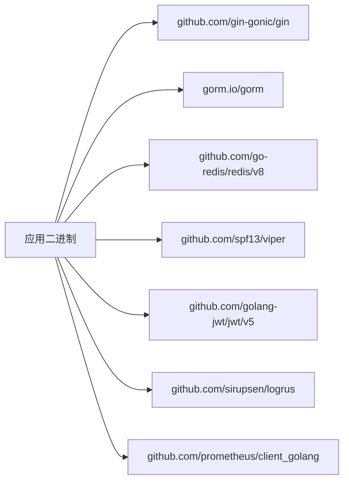

# 快速开始

<cite>
**本文引用的文件**
- [cmd/main.go](file://cmd/main.go)
- [go.mod](file://go.mod)
- [Dockerfile](file://Dockerfile)
- [docker-compose.yml](file://docker-compose.yml)
- [configs/config.mysql.yaml](file://configs/config.mysql.yaml)
- [configs/config.postgres.yaml](file://configs/config.postgres.yaml)
- [internal/config/config.go](file://internal/config/config.go)
- [internal/api/routes.go](file://internal/api/routes.go)
- [internal/api/handlers/chat_handler.go](file://internal/api/handlers/chat_handler.go)
- [internal/services/auth_service.go](file://internal/services/auth_service.go)
- [scripts/start.sh](file://scripts/start.sh)
- [scripts/deploy.sh](file://scripts/deploy.sh)
- [scripts/init_db.sh](file://scripts/init_db.sh)
- [migrations/add_admin_tables.sql](file://migrations/add_admin_tables.sql)
</cite>

## 目录
1. [简介](#简介)
2. [项目结构](#项目结构)
3. [核心组件](#核心组件)
4. [架构总览](#架构总览)
5. [详细组件分析](#详细组件分析)
6. [依赖分析](#依赖分析)
7. [性能考虑](#性能考虑)
8. [故障排除指南](#故障排除指南)
9. [结论](#结论)
10. [附录](#附录)

## 简介
Wolink-Core 是一个兼容 OpenAI 接口风格的 AI 网关服务，提供聊天、嵌入、重排序、语音转写与合成等能力，并内置 API Key 认证、限流、使用统计与可观测性（指标、日志）能力。本“快速开始”旨在帮助你在 15 分钟内完成系统要求、依赖准备、容器化部署或本地开发环境搭建，并成功调用第一个聊天接口。

## 项目结构
- 入口程序位于 cmd/main.go，负责加载配置、初始化数据库与 Redis、启动 HTTP 服务。
- 配置系统通过 Viper 支持 YAML 文件与环境变量，提供默认值与分层覆盖。
- API 路由在 internal/api/routes.go 中定义，统一挂载中间件链与各业务处理器。
- 业务逻辑集中在 internal/api/handlers/* 与 internal/services/*，并通过 ServiceManager 组织。
- 提供 Dockerfile 与 docker-compose.yml，支持一键拉起应用、MySQL 与 Redis。
- 提供 scripts/* 辅助脚本，便于本地启动、部署与数据库初始化。

图表来源
- [cmd/main.go:19-89](file://cmd/main.go#L19-L89)
- [internal/config/config.go:96-124](file://internal/config/config.go#L96-L124)
- [internal/api/routes.go:14-129](file://internal/api/routes.go#L14-L129)
- [internal/api/handlers/chat_handler.go:34-113](file://internal/api/handlers/chat_handler.go#L34-L113)
- [internal/services/auth_service.go:35-85](file://internal/services/auth_service.go#L35-L85)
- [Dockerfile:1-28](file://Dockerfile#L1-L28)
- [docker-compose.yml:1-59](file://docker-compose.yml#L1-L59)

章节来源
- [cmd/main.go:19-89](file://cmd/main.go#L19-L89)
- [internal/config/config.go:96-124](file://internal/config/config.go#L96-L124)
- [internal/api/routes.go:14-129](file://internal/api/routes.go#L14-L129)

## 核心组件
- 配置系统：支持 YAML 配置文件与环境变量前缀 AI_GATEWAY_，自动合并默认值与配置文件，解析为结构化 Config。
- 服务编排：ServiceManager 负责聚合数据库、Redis、日志、认证、模型配置、插件、队列等服务。
- 路由与中间件：Gin 路由组 /v1 下挂载 OpenAI 兼容接口；全局中间件包含恢复、请求 ID、Prometheus、结构化日志、CORS、错误处理。
- 认证与限流：基于 API Key 的鉴权，结合 Redis 实现并发、日/月度限额检查与使用量异步统计。
- 数据持久化：MySQL/PostgreSQL 支持，提供管理员表结构迁移脚本；可选通信日志落盘。

章节来源
- [internal/config/config.go:10-184](file://internal/config/config.go#L10-L184)
- [internal/api/routes.go:14-129](file://internal/api/routes.go#L14-L129)
- [internal/services/auth_service.go:35-219](file://internal/services/auth_service.go#L35-L219)
- [migrations/add_admin_tables.sql:1-38](file://migrations/add_admin_tables.sql#L1-L38)

## 架构总览
下图展示了从客户端到服务端的关键交互路径，包括认证、路由、处理器与下游插件调用。

图表来源
- [internal/api/routes.go:46-72](file://internal/api/routes.go#L46-L72)
- [internal/api/handlers/chat_handler.go:34-113](file://internal/api/handlers/chat_handler.go#L34-L113)
- [internal/services/auth_service.go:35-149](file://internal/services/auth_service.go#L35-L149)

## 详细组件分析

### 安装与系统要求
- Go 版本：项目模块声明使用 1.25.0，建议本地开发使用 1.25+；容器镜像采用 golang:1.21-alpine 构建。
- 数据库：支持 MySQL 与 PostgreSQL，需提前安装对应客户端工具以便初始化与验证。
- 缓存：需要 Redis 服务。
- 容器：Docker 与 docker-compose 已提供一键编排。

章节来源
- [go.mod:3](file://go.mod#L3)
- [Dockerfile:1](file://Dockerfile#L1)
- [scripts/init_db.sh:10-42](file://scripts/init_db.sh#L10-L42)

### 依赖环境准备
- MySQL 客户端：用于初始化数据库与验证连通性。
- PostgreSQL 客户端：如需切换 PostgreSQL。
- Redis 客户端：用于验证连接与健康检查。

章节来源
- [scripts/start.sh:10-26](file://scripts/start.sh#L10-L26)

### Docker 容器化部署（推荐）
- 使用 docker-compose.yml 启动：应用、MySQL 与 Redis 三服务联动，自动等待 MySQL 健康后再启动应用。
- 环境变量通过 AI_GATEWAY_* 前缀注入，覆盖默认配置。
- 端口映射：应用 8080，MySQL 3306，Redis 6379。

图表来源
- [docker-compose.yml:4-55](file://docker-compose.yml#L4-L55)

章节来源
- [docker-compose.yml:1-59](file://docker-compose.yml#L1-L59)
- [Dockerfile:1-28](file://Dockerfile#L1-L28)

### 本地开发环境搭建
- 启动数据库与 Redis：优先使用 docker-compose，或自行安装并确保服务运行。
- 初始化数据库：使用 scripts/init_db.sh 自动创建数据库（默认 ai_gateway），并输出连接信息。
- 启动应用：执行 scripts/start.sh，它会自动设置环境变量并以 go run 启动主程序。

图表来源
- [scripts/start.sh:7-52](file://scripts/start.sh#L7-L52)
- [scripts/init_db.sh:10-46](file://scripts/init_db.sh#L10-L46)

章节来源
- [scripts/start.sh:7-52](file://scripts/start.sh#L7-L52)
- [scripts/init_db.sh:10-46](file://scripts/init_db.sh#L10-L46)

### 配置文件与环境变量
- 配置文件位置：优先加载 configs/config.mysql.yaml 或 configs/config.postgres.yaml；也可通过环境变量覆盖。
- 关键配置项：server.port、server.mode、database.type/host/port/user/password/dbname、redis.*、security.jwt_secret、models.config_path。
- 环境变量前缀：AI_GATEWAY_*，例如 AI_GATEWAY_SERVER_PORT、AI_GATEWAY_DATABASE_TYPE 等。

章节来源
- [configs/config.mysql.yaml:1-37](file://configs/config.mysql.yaml#L1-L37)
- [configs/config.postgres.yaml:1-35](file://configs/config.postgres.yaml#L1-L35)
- [internal/config/config.go:96-124](file://internal/config/config.go#L96-L124)

### 第一个 API 调用：获取 API Key 并调用聊天接口
- 获取 API Key
  - 登录管理后台（默认超级管理员账户信息见管理员表迁移脚本）。
  - 在管理界面创建部门与 API Key，记录 key_id 与 key_secret。
  - 管理员默认账户信息参考迁移脚本中的插入语句。
- 调用聊天接口
  - 路由：POST /v1/chat/completions
  - 认证：Authorization: Bearer YOUR_API_KEY
  - 请求体：包含 model 与 messages 数组（至少一条 user 消息）。
  - 响应：非流式或 SSE 流式响应，包含 choices 与 usage。

图表来源
- [migrations/add_admin_tables.sql:29-32](file://migrations/add_admin_tables.sql#L29-L32)
- [internal/api/routes.go:46-72](file://internal/api/routes.go#L46-L72)
- [internal/api/handlers/chat_handler.go:34-113](file://internal/api/handlers/chat_handler.go#L34-L113)

章节来源
- [migrations/add_admin_tables.sql:29-32](file://migrations/add_admin_tables.sql#L29-L32)
- [internal/api/routes.go:46-72](file://internal/api/routes.go#L46-L72)
- [internal/api/handlers/chat_handler.go:34-113](file://internal/api/handlers/chat_handler.go#L34-L113)

## 依赖分析
- 运行时依赖：Gin（HTTP）、GORM（数据库 ORM）、Redis 客户端、Prometheus 客户端、JWT、Viper（配置）等。
- 构建时依赖：Go 1.25+，CGO_ENABLED=0 的静态二进制构建。
- 容器镜像：基于 golang:1.21-alpine 构建，最终运行于 alpine 基础镜像。

图表来源
- [go.mod:5-22](file://go.mod#L5-L22)

章节来源
- [go.mod:3-84](file://go.mod#L3-L84)
- [Dockerfile:13](file://Dockerfile#L13)

## 性能考虑
- 连接池与超时：基础设施配置包含数据库与 Redis 连接池参数及 HTTP 服务超时，建议根据并发与延迟需求调整。
- 缓存策略：API Key 与并发计数缓存于 Redis，降低数据库压力。
- 异步落盘：对话与使用量记录通过队列异步处理，避免阻塞主请求路径。
- 流式响应：SSE 流式返回即时转发，减少客户端等待。

章节来源
- [internal/config/config.go:21-47](file://internal/config/config.go#L21-L47)
- [internal/services/auth_service.go:35-149](file://internal/services/auth_service.go#L35-L149)
- [internal/api/handlers/chat_handler.go:115-206](file://internal/api/handlers/chat_handler.go#L115-L206)

## 故障排除指南
- 无法连接数据库
  - 确认数据库服务运行且网络可达。
  - 使用 scripts/init_db.sh 创建数据库与校验连接。
- Redis 连接失败
  - 检查 Redis 服务状态与端口映射。
- API Key 401
  - 确认 Authorization 头格式为 Bearer YOUR_API_KEY。
  - 管理端确认 API Key 状态为 active，且未超过日/月度限额或并发上限。
- 健康检查失败
  - 访问 /health 与 /ready，查看服务状态。
- 容器启动后立即退出
  - 使用 scripts/deploy.sh logs 查看日志，定位配置或依赖问题。
- 端口冲突
  - 修改 docker-compose.yml 或本机映射端口。

章节来源
- [scripts/init_db.sh:10-46](file://scripts/init_db.sh#L10-L46)
- [internal/services/auth_service.go:88-124](file://internal/services/auth_service.go#L88-L124)
- [internal/api/routes.go:39-44](file://internal/api/routes.go#L39-L44)
- [scripts/deploy.sh:47-50](file://scripts/deploy.sh#L47-L50)

## 结论
按照本指南，你可以在 15 分钟内完成系统要求、依赖准备、容器化部署或本地启动，并成功调用第一个聊天接口。建议后续逐步完善配置文件、接入真实模型与插件、配置监控与日志归档。

## 附录

### 常用命令速查
- 启动服务（Docker）：scripts/deploy.sh up
- 停止服务：scripts/deploy.sh down
- 查看日志：scripts/deploy.sh logs
- 清理数据：scripts/deploy.sh clean
- 本地启动：scripts/start.sh
- 初始化数据库：scripts/init_db.sh [mysql|postgres]

章节来源
- [scripts/deploy.sh:26-60](file://scripts/deploy.sh#L26-L60)
- [scripts/start.sh:7-52](file://scripts/start.sh#L7-L52)
- [scripts/init_db.sh:10-46](file://scripts/init_db.sh#L10-L46)