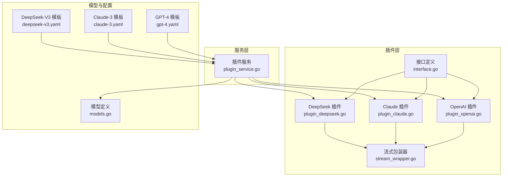
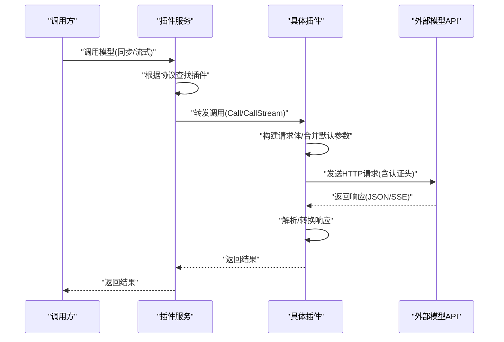
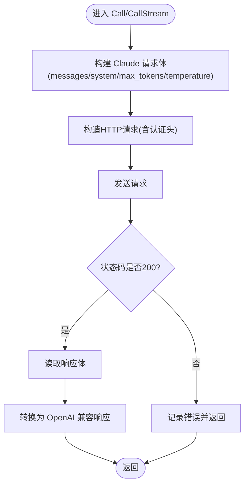
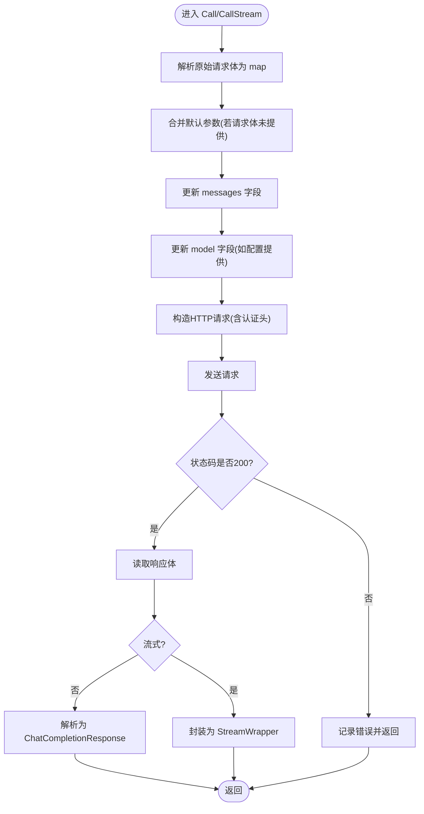
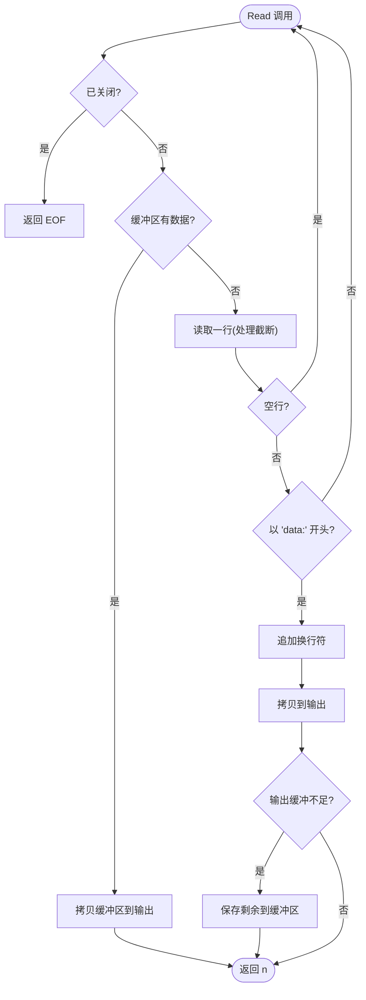
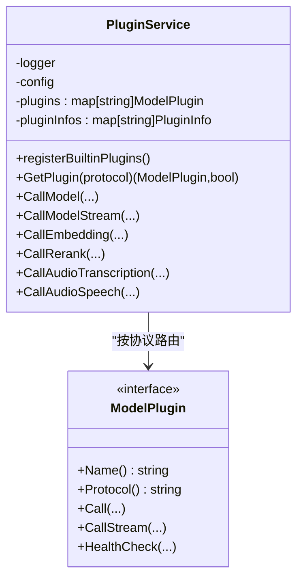
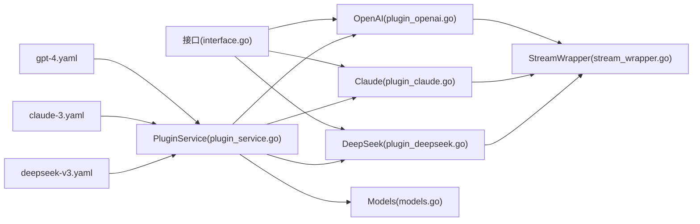

# 内置插件实现

<cite>
**本文档引用的文件**
- [plugin_openai.go](file://internal/plugins/plugin_openai.go)
- [plugin_claude.go](file://internal/plugins/plugin_claude.go)
- [plugin_deepseek.go](file://internal/plugins/plugin_deepseek.go)
- [interface.go](file://internal/plugins/interface.go)
- [stream_wrapper.go](file://internal/plugins/stream_wrapper.go)
- [plugin_service.go](file://internal/services/plugin_service.go)
- [models.go](file://internal/models/models.go)
- [claude-3.yaml](file://configs/templates/claude-3.yaml)
- [deepseek-v3.yaml](file://configs/templates/deepseek-v3.yaml)
- [gpt-4.yaml](file://configs/templates/gpt-4.yaml)
- [plugin_openai_test.go](file://internal/plugins/plugin_openai_test.go)
- [plugin_openai_bench_test.go](file://internal/plugins/plugin_openai_bench_test.go)
</cite>

## 目录
1. [引言](#引言)
2. [项目结构](#项目结构)
3. [核心组件](#核心组件)
4. [架构总览](#架构总览)
5. [详细组件分析](#详细组件分析)
6. [依赖关系分析](#依赖关系分析)
7. [性能考虑](#性能考虑)
8. [故障排查指南](#故障排查指南)
9. [结论](#结论)
10. [附录](#附录)

## 引言
本文件面向开发者，系统性阐述 Wolink-Core 的内置插件实现，重点覆盖 OpenAI、Claude、DeepSeek 三大插件。内容涵盖：
- 插件接口设计与统一抽象
- 各插件的 API 调用流程、请求格式转换、响应解析机制
- 配置参数、认证方式、错误处理策略
- 性能优化技巧与调试方法
- 使用场景与最佳实践

## 项目结构
Wolink-Core 采用“插件化 + 服务层”的架构组织，插件位于 internal/plugins，服务层位于 internal/services，模型定义位于 internal/models，模板配置位于 configs/templates。

图表来源
- [interface.go:11-55](file://internal/plugins/interface.go#L11-L55)
- [plugin_openai.go:18-370](file://internal/plugins/plugin_openai.go#L18-L370)
- [plugin_claude.go:17-248](file://internal/plugins/plugin_claude.go#L17-L248)
- [plugin_deepseek.go:17-235](file://internal/plugins/plugin_deepseek.go#L17-L235)
- [stream_wrapper.go:9-95](file://internal/plugins/stream_wrapper.go#L9-L95)
- [plugin_service.go:21-366](file://internal/services/plugin_service.go#L21-L366)
- [models.go:56-463](file://internal/models/models.go#L56-L463)
- [gpt-4.yaml:1-75](file://configs/templates/gpt-4.yaml#L1-L75)
- [claude-3.yaml:1-75](file://configs/templates/claude-3.yaml#L1-L75)
- [deepseek-v3.yaml:1-101](file://configs/templates/deepseek-v3.yaml#L1-L101)

章节来源
- [plugin_service.go:38-92](file://internal/services/plugin_service.go#L38-L92)
- [models.go:56-463](file://internal/models/models.go#L56-L463)

## 核心组件
- 插件接口 ModelPlugin：统一规范插件的名称、协议、同步/流式调用、健康检查等能力。
- OpenAI 兼容插件：直接透传请求体，按需合并默认参数，支持非流式与流式两种模式；额外支持音频转写与语音合成。
- Claude 插件：将通用消息格式转换为 Claude 的 messages+system 结构，并将 Claude 响应转换为 OpenAI 兼容格式。
- DeepSeek 插件：与 OpenAI 兼容插件类似，但使用不同的基础地址与部分参数合并策略。
- 流式包装器 StreamWrapper：对 SSE 文本进行逐行解析与过滤，保证下游消费的一致性。
- 插件服务 PluginService：负责内置插件注册、协议路由、调用分发与健康检查。

章节来源
- [interface.go:11-55](file://internal/plugins/interface.go#L11-L55)
- [plugin_openai.go:18-370](file://internal/plugins/plugin_openai.go#L18-L370)
- [plugin_claude.go:17-248](file://internal/plugins/plugin_claude.go#L17-L248)
- [plugin_deepseek.go:17-235](file://internal/plugins/plugin_deepseek.go#L17-L235)
- [stream_wrapper.go:9-95](file://internal/plugins/stream_wrapper.go#L9-L95)
- [plugin_service.go:21-366](file://internal/services/plugin_service.go#L21-L366)

## 架构总览
插件服务通过协议字符串选择具体插件，插件内部完成请求构建、认证、转发与响应解析，必要时使用流式包装器处理 SSE。

图表来源
- [plugin_service.go:207-229](file://internal/services/plugin_service.go#L207-L229)
- [plugin_openai.go:42-121](file://internal/plugins/plugin_openai.go#L42-L121)
- [plugin_claude.go:41-99](file://internal/plugins/plugin_claude.go#L41-L99)
- [plugin_deepseek.go:41-126](file://internal/plugins/plugin_deepseek.go#L41-L126)

## 详细组件分析

### OpenAI 插件实现
- 接口实现：Name、Protocol、Call、CallStream、HealthCheck、CallAudioTranscription、CallAudioSpeech。
- 请求格式转换：
  - 从原始请求体解析为 map，更新 model 与 messages 字段，按需合并默认参数（temperature、max_tokens、top_p）。
  - 流式模式强制开启 stream=true。
- 认证与端点：
  - Authorization: Bearer {APIKey}
  - 默认基础地址为 https://api.openai.com，可被配置覆盖。
- 响应解析：
  - 非流式：解析为 ChatCompletionResponse。
  - 流式：返回带包装的 ReadCloser，内部通过 StreamWrapper 逐行解析 SSE。
- 音频能力：
  - 转写：multipart/form-data，支持 language、prompt、response_format、timestamp_granularities、forced_aligner 等字段。
  - 语音合成：透传请求体，仅在需要时注入 model 字段。

图表来源
- [plugin_openai.go:42-121](file://internal/plugins/plugin_openai.go#L42-L121)
- [plugin_openai.go:123-193](file://internal/plugins/plugin_openai.go#L123-L193)
- [plugin_openai.go:231-323](file://internal/plugins/plugin_openai.go#L231-L323)
- [plugin_openai.go:325-369](file://internal/plugins/plugin_openai.go#L325-L369)

章节来源
- [plugin_openai.go:18-370](file://internal/plugins/plugin_openai.go#L18-L370)

### Claude 插件实现
- 接口实现：Name、Protocol、Call、CallStream、HealthCheck。
- 请求格式转换：
  - 将通用 messages 转换为 Claude 的 messages 数组，system 角色单独提取为 system 字段。
  - 必填 max_tokens，若未显式提供则使用默认值。
  - 温度与最大 token 从请求或配置合并。
- 认证与端点：
  - x-api-key: {APIKey}
  - anthropic-version: 2023-06-01
  - 默认基础地址为 https://api.anthropic.com。
- 响应解析：
  - 从 Claude 响应中提取 content.text，转换为 OpenAI 兼容格式的 choices.message.content。
  - usage 字段暂为空占位。

图表来源
- [plugin_claude.go:41-99](file://internal/plugins/plugin_claude.go#L41-L99)
- [plugin_claude.go:163-205](file://internal/plugins/plugin_claude.go#L163-L205)
- [plugin_claude.go:207-248](file://internal/plugins/plugin_claude.go#L207-L248)

章节来源
- [plugin_claude.go:17-248](file://internal/plugins/plugin_claude.go#L17-L248)

### DeepSeek 插件实现
- 接口实现：Name、Protocol、Call、CallStream、HealthCheck。
- 请求格式转换：
  - 与 OpenAI 兼容插件一致：解析原始请求体，更新 model 与 messages，按需合并默认参数。
  - 流式模式强制开启 stream=true。
- 认证与端点：
  - Authorization: Bearer {APIKey}
  - 默认基础地址为 https://api.deepseek.com。
- 响应解析：
  - 非流式：解析为 ChatCompletionResponse。
  - 流式：返回带包装的 ReadCloser。

图表来源
- [plugin_deepseek.go:41-126](file://internal/plugins/plugin_deepseek.go#L41-L126)
- [plugin_deepseek.go:128-202](file://internal/plugins/plugin_deepseek.go#L128-L202)

章节来源
- [plugin_deepseek.go:17-235](file://internal/plugins/plugin_deepseek.go#L17-L235)

### 流式包装器 StreamWrapper
- 作用：将外部 SSE 文本流转换为可逐块读取的 io.ReadCloser，过滤空行与非 data 行，确保下游稳定消费。
- 关键行为：
  - 逐行读取，拼接截断行。
  - 跳过空行与非以 "data:" 开头的行。
  - 为下游提供标准 Read 接口，内部维护缓冲与关闭状态。

图表来源
- [stream_wrapper.go:27-86](file://internal/plugins/stream_wrapper.go#L27-L86)

章节来源
- [stream_wrapper.go:9-95](file://internal/plugins/stream_wrapper.go#L9-L95)

### 插件服务 PluginService
- 注册内置插件：OpenAI、DeepSeek、Claude。
- 协议路由：根据 ModelConfig.Protocol 选择对应插件。
- 能力扩展：支持 Embedding、Rerank、AudioTranscription、AudioSpeech 等接口，按插件能力动态分发。
- 健康检查：维护插件健康状态标记（简化实现）。

图表来源
- [plugin_service.go:21-366](file://internal/services/plugin_service.go#L21-L366)
- [interface.go:11-55](file://internal/plugins/interface.go#L11-L55)

章节来源
- [plugin_service.go:21-366](file://internal/services/plugin_service.go#L21-L366)

## 依赖关系分析
- 插件层依赖：
  - 接口定义：统一能力边界。
  - 模型定义：请求/响应结构、连接配置。
  - 流式包装器：SSE 解析与透传。
- 服务层依赖：
  - 插件接口：按协议调度。
  - 模型定义：承载配置与请求/响应。
- 配置模板：
  - gpt-4.yaml、claude-3.yaml、deepseek-v3.yaml 定义了协议、能力、连接配置与默认参数。

图表来源
- [interface.go:11-55](file://internal/plugins/interface.go#L11-L55)
- [plugin_openai.go:18-370](file://internal/plugins/plugin_openai.go#L18-L370)
- [plugin_claude.go:17-248](file://internal/plugins/plugin_claude.go#L17-L248)
- [plugin_deepseek.go:17-235](file://internal/plugins/plugin_deepseek.go#L17-L235)
- [stream_wrapper.go:9-95](file://internal/plugins/stream_wrapper.go#L9-L95)
- [plugin_service.go:21-366](file://internal/services/plugin_service.go#L21-L366)
- [models.go:56-463](file://internal/models/models.go#L56-L463)
- [gpt-4.yaml:1-75](file://configs/templates/gpt-4.yaml#L1-L75)
- [claude-3.yaml:1-75](file://configs/templates/claude-3.yaml#L1-L75)
- [deepseek-v3.yaml:1-101](file://configs/templates/deepseek-v3.yaml#L1-L101)

章节来源
- [plugin_service.go:55-92](file://internal/services/plugin_service.go#L55-L92)
- [models.go:56-463](file://internal/models/models.go#L56-L463)

## 性能考虑
- 流式读取优化：
  - StreamWrapper 采用逐行读取与缓冲策略，避免一次性读取大块数据导致内存峰值。
  - 建议在上层尽快消费流数据，避免长时间阻塞。
- 序列化开销：
  - 请求/响应的 JSON 序列化与反序列化是主要成本，可通过复用对象池与减少不必要的字段传递降低开销。
- 超时控制：
  - 插件内部使用 http.Client.Timeout 控制请求超时，建议结合业务设置合理的超时阈值。
- 并发与压力测试：
  - 提供基准测试用例，可参考 BenchmarkOpenAIPlugin_Call、BenchmarkOpenAIPlugin_CallStream 等方法评估吞吐与延迟。
- 日志级别：
  - 在高并发场景下调低日志级别可显著降低 I/O 压力。

章节来源
- [plugin_openai_bench_test.go:120-293](file://internal/plugins/plugin_openai_bench_test.go#L120-L293)
- [plugin_openai.go:24-30](file://internal/plugins/plugin_openai.go#L24-L30)
- [plugin_claude.go:24-29](file://internal/plugins/plugin_claude.go#L24-L29)
- [plugin_deepseek.go:24-29](file://internal/plugins/plugin_deepseek.go#L24-L29)

## 故障排查指南
- 常见错误与定位：
  - 401/403：检查 API Key 是否正确配置，确认认证头是否正确设置。
  - 4xx/5xx：查看外部 API 返回体，结合日志定位问题。
  - 超时：检查网络连通性、代理设置、超时配置。
  - JSON 解析失败：确认请求/响应结构与期望一致，必要时打印原始请求/响应体。
- 健康检查：
  - OpenAI/Claude/DeepSeek 插件均提供 HealthCheck，可在启动阶段快速验证配置有效性。
- 单元测试与基准测试：
  - 使用 plugin_openai_test.go 中的测试用例验证关键路径，使用 plugin_openai_bench_test.go 进行性能评估。

章节来源
- [plugin_openai.go:195-229](file://internal/plugins/plugin_openai.go#L195-L229)
- [plugin_claude.go:150-161](file://internal/plugins/plugin_claude.go#L150-L161)
- [plugin_deepseek.go:204-234](file://internal/plugins/plugin_deepseek.go#L204-L234)
- [plugin_openai_test.go:56-427](file://internal/plugins/plugin_openai_test.go#L56-L427)

## 结论
Wolink-Core 的内置插件通过统一接口抽象与清晰的协议路由，实现了对 OpenAI、Claude、DeepSeek 的一致接入。OpenAI 插件侧重“完全透传 + 参数合并”，Claude 插件强调“消息格式转换 + 响应兼容”，DeepSeek 插件与 OpenAI 兼容。配合流式包装器与完善的健康检查、测试与基准测试，整体具备良好的可扩展性与可观测性。

## 附录

### 配置参数与认证方式
- 通用连接配置 ConnectionConfig：
  - base_url：外部 API 基础地址
  - api_key：认证密钥
  - timeout：请求超时
  - model：默认模型名
  - temperature、max_tokens、top_p 等：默认推理参数
- 模板示例：
  - GPT-4 模板：定义了 openai 协议、能力与默认参数。
  - Claude-3 模板：定义了 claude 协议、能力与默认参数。
  - DeepSeek-V3 模板：定义了 deepseek 协议、能力与默认参数。

章节来源
- [models.go:449-463](file://internal/models/models.go#L449-L463)
- [gpt-4.yaml:1-75](file://configs/templates/gpt-4.yaml#L1-L75)
- [claude-3.yaml:1-75](file://configs/templates/claude-3.yaml#L1-L75)
- [deepseek-v3.yaml:1-101](file://configs/templates/deepseek-v3.yaml#L1-L101)

### 使用场景与最佳实践
- 场景一：OpenAI 兼容模型（如 GPT-4）
  - 适用：需要函数调用、JSON 模式、图像输入等高级能力。
  - 最佳实践：尽量使用配置中的默认参数，避免在请求体中重复设置；启用流式以提升交互体验。
- 场景二：Claude 模型
  - 适用：需要更强的系统提示与推理能力。
  - 最佳实践：将系统提示放入 system 角色；注意 max_tokens 必填；关注响应格式转换。
- 场景三：DeepSeek 模型
  - 适用：长上下文与多模态需求。
  - 最佳实践：合理设置 temperature 与 max_tokens；在需要时启用流式。
- 调试与监控：
  - 打开调试日志，观察请求/响应体；
  - 使用健康检查在部署阶段快速验证；
  - 借助基准测试评估性能瓶颈。

章节来源
- [claude-3.yaml:46-75](file://configs/templates/claude-3.yaml#L46-L75)
- [deepseek-v3.yaml:71-101](file://configs/templates/deepseek-v3.yaml#L71-L101)
- [gpt-4.yaml:46-75](file://configs/templates/gpt-4.yaml#L46-L75)