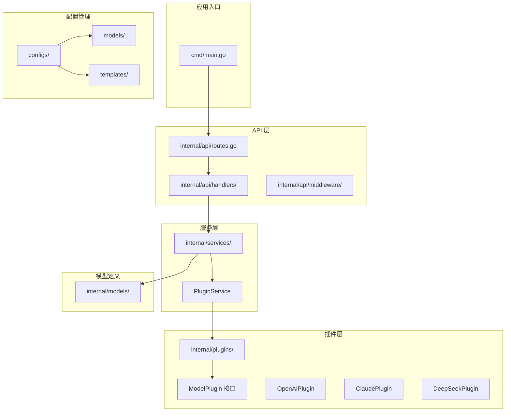
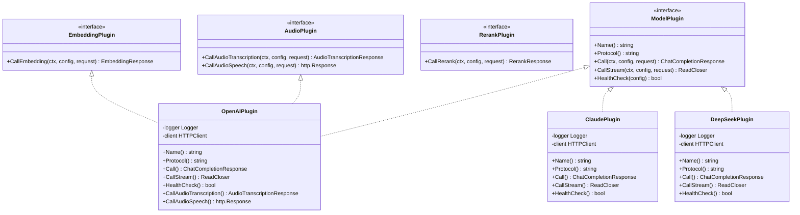
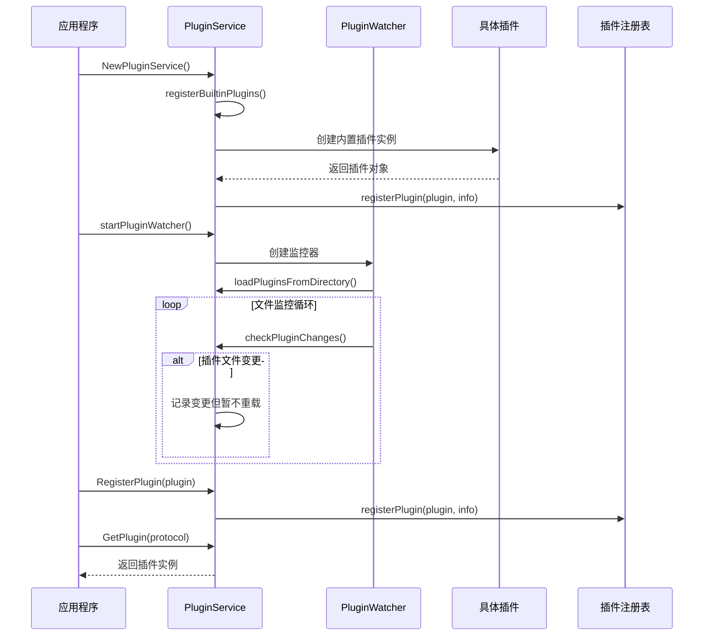
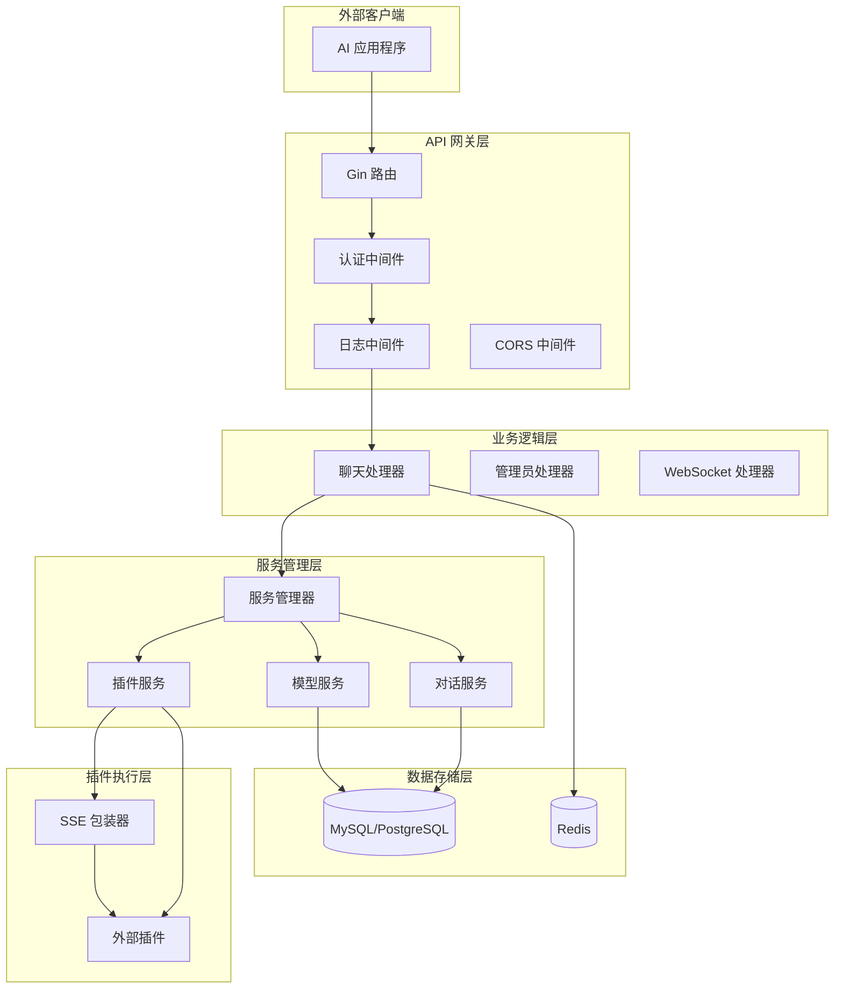
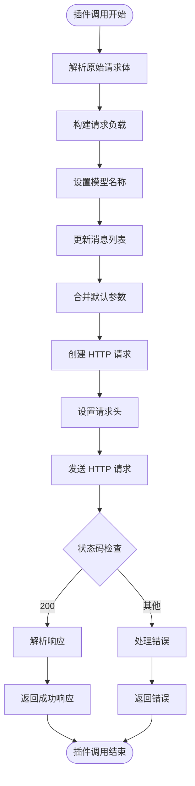
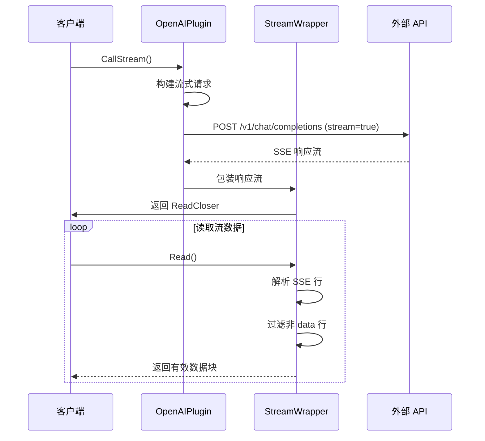
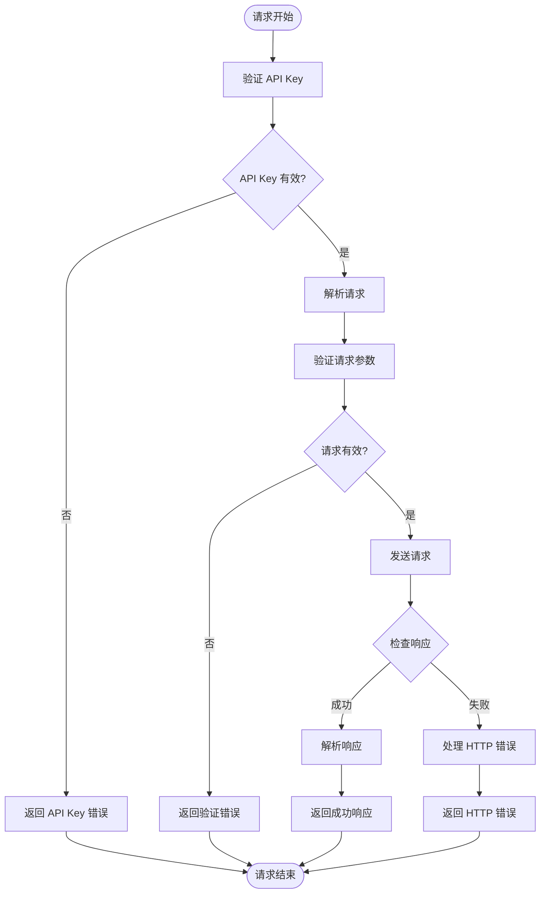
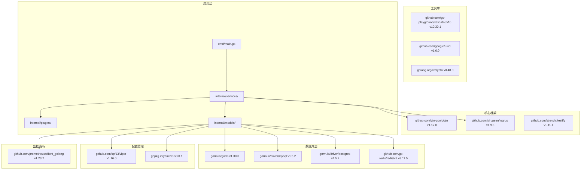
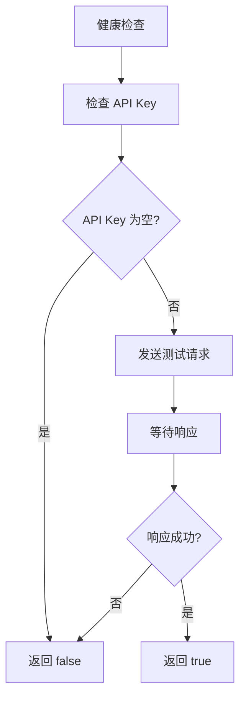

# 插件扩展开发指南

<cite>
**本文档引用的文件**
- [interface.go](file://internal/plugins/interface.go)
- [plugin_openai.go](file://internal/plugins/plugin_openai.go)
- [plugin_claude.go](file://internal/plugins/plugin_claude.go)
- [plugin_deepseek.go](file://internal/plugins/plugin_deepseek.go)
- [plugin_service.go](file://internal/services/plugin_service.go)
- [stream_wrapper.go](file://internal/plugins/stream_wrapper.go)
- [models.go](file://internal/models/models.go)
- [plugin_handler.go](file://internal/api/handlers/plugin_handler.go)
- [plugin_openai_test.go](file://internal/plugins/plugin_openai_test.go)
- [plugin_openai_bench_test.go](file://internal/plugins/plugin_openai_bench_test.go)
- [qwen3-chat.yaml](file://configs/models/qwen3-chat.yaml)
- [claude-3.yaml](file://configs/templates/claude-3.yaml)
- [main.go](file://cmd/main.go)
- [Dockerfile](file://Dockerfile)
- [deploy.sh](file://scripts/deploy.sh)
- [start.sh](file://scripts/start.sh)
- [config.go](file://internal/config/config.go)
</cite>

## 目录
1. [简介](#简介)
2. [项目结构](#项目结构)
3. [核心组件](#核心组件)
4. [架构概览](#架构概览)
5. [详细组件分析](#详细组件分析)
6. [依赖关系分析](#依赖关系分析)
7. [性能考虑](#性能考虑)
8. [故障排除指南](#故障排除指南)
9. [结论](#结论)
10. [附录](#附录)

## 简介

Wolink-Core 是一个基于 Go 语言构建的 AI 模型网关平台，提供了统一的插件扩展机制，支持多种 AI 模型提供商的接入。本文档旨在为开发者提供完整的插件扩展开发指南，涵盖从接口实现到插件注册的全过程。

该系统的核心特性包括：
- **多协议支持**：支持 OpenAI、Claude、DeepSeek 等主流 AI 模型提供商
- **流式处理**：完整的 SSE（Server-Sent Events）流式响应支持
- **热插拔机制**：支持插件的动态加载和卸载
- **配置管理**：基于 YAML 的灵活配置系统
- **监控集成**：内置 Prometheus 监控支持

## 项目结构

Wolink-Core 采用清晰的分层架构设计，主要目录结构如下：



**图表来源**
- [main.go:19-89](file://cmd/main.go#L19-L89)
- [plugin_service.go:38-53](file://internal/services/plugin_service.go#L38-L53)

**章节来源**
- [main.go:19-89](file://cmd/main.go#L19-L89)
- [plugin_service.go:21-53](file://internal/services/plugin_service.go#L21-L53)

## 核心组件

### 插件接口体系

Wolink-Core 定义了完整的插件接口体系，支持多种 AI 模型能力：



**图表来源**
- [interface.go:11-55](file://internal/plugins/interface.go#L11-L55)
- [plugin_openai.go:18-370](file://internal/plugins/plugin_openai.go#L18-L370)
- [plugin_claude.go:17-248](file://internal/plugins/plugin_claude.go#L17-L248)
- [plugin_deepseek.go:17-235](file://internal/plugins/plugin_deepseek.go#L17-L235)

### 插件服务管理

插件服务提供了完整的插件生命周期管理功能：



**图表来源**
- [plugin_service.go:38-108](file://internal/services/plugin_service.go#L38-L108)
- [plugin_service.go:154-170](file://internal/services/plugin_service.go#L154-L170)

**章节来源**
- [interface.go:11-55](file://internal/plugins/interface.go#L11-L55)
- [plugin_service.go:21-366](file://internal/services/plugin_service.go#L21-L366)

## 架构概览

Wolink-Core 采用了模块化的微服务架构，各组件之间通过清晰的接口进行交互：



**图表来源**
- [plugin_service.go:21-366](file://internal/services/plugin_service.go#L21-L366)
- [plugin_handler.go:12-74](file://internal/api/handlers/plugin_handler.go#L12-L74)

## 详细组件分析

### OpenAI 兼容插件实现

OpenAI 兼容插件是最复杂的插件实现，支持完整的聊天、嵌入、重排序和音频功能：

#### 核心功能实现



**图表来源**
- [plugin_openai.go:42-121](file://internal/plugins/plugin_openai.go#L42-L121)
- [plugin_openai.go:123-193](file://internal/plugins/plugin_openai.go#L123-L193)

#### 流式响应处理

OpenAI 插件实现了完整的 SSE（Server-Sent Events）流式响应支持：



**图表来源**
- [plugin_openai.go:123-193](file://internal/plugins/plugin_openai.go#L123-L193)
- [stream_wrapper.go:27-86](file://internal/plugins/stream_wrapper.go#L27-L86)

**章节来源**
- [plugin_openai.go:18-370](file://internal/plugins/plugin_openai.go#L18-L370)
- [stream_wrapper.go:9-95](file://internal/plugins/stream_wrapper.go#L9-L95)

### Claude 插件实现

Claude 插件专注于 Anthropic Claude 模型的适配：

#### 请求格式转换

Claude 插件需要将标准的聊天请求格式转换为 Claude 特有的格式：

| 字段 | OpenAI 格式 | Claude 格式 | 转换逻辑 |
|------|-------------|-------------|----------|
| 模型参数 | `model` | `model` | 直接传递 |
| 消息列表 | `messages` | `messages` | 转换角色和内容 |
| 系统提示 | `messages` 中 role=system | `system` | 提取系统消息 |
| 最大令牌数 | `max_tokens` | `max_tokens` | Claude 必需参数 |
| 温度控制 | `temperature` | `temperature` | 可选参数 |

**章节来源**
- [plugin_claude.go:163-205](file://internal/plugins/plugin_claude.go#L163-L205)
- [plugin_claude.go:207-248](file://internal/plugins/plugin_claude.go#L207-L248)

### DeepSeek 插件实现

DeepSeek 插件提供了对 DeepSeek 模型的完整支持：

#### 错误处理策略

DeepSeek 插件实现了严格的错误处理机制：



**图表来源**
- [plugin_deepseek.go:42-126](file://internal/plugins/plugin_deepseek.go#L42-L126)
- [plugin_deepseek.go:128-202](file://internal/plugins/plugin_deepseek.go#L128-L202)

**章节来源**
- [plugin_deepseek.go:17-235](file://internal/plugins/plugin_deepseek.go#L17-L235)

### 插件服务管理

插件服务提供了完整的插件生命周期管理功能：

#### 插件注册机制

```mermaid
classDiagram
class PluginService {
-logger Logger
-config Config
-plugins map[string]ModelPlugin
-pluginInfos map[string]*PluginInfo
-mutex RWMutex
-watcher PluginWatcher
+registerBuiltinPlugins()
+registerPlugin(plugin, info)
+GetPlugin(protocol) (ModelPlugin, bool)
+CallModel()
+CallModelStream()
+ListPlugins() map[string]*PluginInfo
+ReloadPlugin()
+UnloadPlugin()
}
class PluginWatcher {
-service *PluginService
-pluginDir string
-stopCh chan struct{}
+watch()
+checkPluginChanges()
}
class PluginInfo {
+string Name
+string Protocol
+string Version
+string Description
+string Author
+bool Loaded
+bool Healthy
}
PluginService --> PluginWatcher : "管理"
PluginService --> PluginInfo : "维护"
```

**图表来源**
- [plugin_service.go:21-366](file://internal/services/plugin_service.go#L21-L366)

**章节来源**
- [plugin_service.go:21-366](file://internal/services/plugin_service.go#L21-L366)

## 依赖关系分析

Wolink-Core 的依赖关系相对简单，主要依赖于以下核心库：



**图表来源**
- [go.mod:1-84](file://go.mod#L1-L84)
- [main.go:3-17](file://cmd/main.go#L3-L17)

**章节来源**
- [go.mod:1-84](file://go.mod#L1-L84)

## 性能考虑

### 流式响应优化

Wolink-Core 在流式响应处理方面进行了专门优化：

#### StreamWrapper 性能特性

| 特性 | 实现细节 | 性能影响 |
|------|----------|----------|
| 缓冲读取 | 使用 bufio.Reader 进行缓冲 | 减少系统调用次数 |
| 行解析 | 逐行读取并处理截断 | 保证数据完整性 |
| SSE 过滤 | 跳过空行和非 data 行 | 减少无效数据传输 |
| 内存管理 | 及时释放缓冲区 | 控制内存使用量 |

#### 健康检查机制

插件提供了智能的健康检查功能：



**图表来源**
- [plugin_openai.go:195-229](file://internal/plugins/plugin_openai.go#L195-L229)
- [plugin_claude.go:150-161](file://internal/plugins/plugin_claude.go#L150-L161)
- [plugin_deepseek.go:204-234](file://internal/plugins/plugin_deepseek.go#L204-L234)

**章节来源**
- [plugin_openai_bench_test.go:120-198](file://internal/plugins/plugin_openai_bench_test.go#L120-L198)
- [plugin_openai_bench_test.go:200-231](file://internal/plugins/plugin_openai_bench_test.go#L200-L231)

## 故障排除指南

### 常见问题诊断

#### 插件加载问题

当遇到插件无法加载的问题时，可以按照以下步骤进行诊断：

1. **检查插件文件命名**
   - 确保文件名符合 `plugin_{protocol}.go` 格式
   - 例如：`plugin_openai.go`、`plugin_claude.go`

2. **验证接口实现**
   - 确保实现了所有必需的接口方法
   - 检查 `Name()` 和 `Protocol()` 方法的正确性

3. **检查日志输出**
   - 查看插件注册时的日志信息
   - 关注任何初始化错误信息

#### 网络连接问题

针对网络连接问题，建议采取以下排查步骤：

1. **验证 API Key**
   ```bash
   # 检查 API Key 是否正确配置
   curl -X GET http://localhost:8080/api/plugins \
     -H "Authorization: Bearer YOUR_ADMIN_TOKEN"
   ```

2. **测试健康检查**
   ```bash
   # 检查特定插件的健康状态
   curl -X GET http://localhost:8080/api/plugins/health \
     -H "Authorization: Bearer YOUR_ADMIN_TOKEN"
   ```

3. **查看详细错误信息**
   - 检查应用日志中的错误堆栈
   - 关注网络超时和连接拒绝错误

#### 性能问题诊断

对于性能问题，可以使用以下方法进行分析：

1. **启用详细日志**
   ```bash
   export AI_GATEWAY_LOG_LEVEL=debug
   go run cmd/main.go
   ```

2. **监控响应时间**
   ```bash
   # 使用 curl 测试响应时间
   curl -w "@curl-format.txt" -o /dev/null -s http://localhost:8080/health
   ```

3. **分析内存使用**
   - 监控 Go 应用的内存使用情况
   - 检查是否存在内存泄漏

**章节来源**
- [plugin_openai_test.go:115-175](file://internal/plugins/plugin_openai_test.go#L115-L175)
- [plugin_openai_test.go:282-311](file://internal/plugins/plugin_openai_test.go#L282-L311)

## 结论

Wolink-Core 提供了一个功能完整、架构清晰的插件扩展平台。通过标准化的接口设计和完善的错误处理机制，开发者可以快速实现新的 AI 模型提供商插件。

### 主要优势

1. **标准化接口**：统一的插件接口设计降低了开发复杂度
2. **完整的功能支持**：涵盖了聊天、嵌入、重排序、音频等多种 AI 能力
3. **优秀的性能表现**：流式响应和缓存机制确保了高效的处理能力
4. **完善的监控集成**：内置的 Prometheus 支持便于运维监控
5. **灵活的配置管理**：基于 YAML 的配置系统支持动态调整

### 开发建议

1. **遵循接口规范**：严格按照 ModelPlugin 接口的要求实现
2. **重视错误处理**：实现完善的错误处理和重试机制
3. **优化性能**：合理使用缓存和连接池，避免资源浪费
4. **添加测试覆盖**：编写全面的单元测试和集成测试
5. **文档编写**：提供清晰的使用文档和配置说明

## 附录

### 插件开发模板

#### 基础插件模板

```go
package plugins

import (
    "context"
    "net/http"
    
    "wolink-core/internal/models"
    "github.com/sirupsen/logrus"
)

type YourPlugin struct {
    logger *logrus.Logger
    client *http.Client
}

func NewYourPlugin(logger *logrus.Logger) *YourPlugin {
    return &YourPlugin{
        logger: logger,
        client: &http.Client{Timeout: 60 * time.Second},
    }
}

func (p *YourPlugin) Name() string {
    return "Your Plugin Name"
}

func (p *YourPlugin) Protocol() string {
    return "your-protocol"
}

func (p *YourPlugin) Call(ctx context.Context, config *models.ModelConfig, request *models.ChatCompletionRequest) (*models.ChatCompletionResponse, error) {
    // 实现具体的调用逻辑
    return nil, nil
}

func (p *YourPlugin) CallStream(ctx context.Context, config *models.ModelConfig, request *models.ChatCompletionRequest) (io.ReadCloser, error) {
    // 实现流式调用逻辑
    return nil, nil
}

func (p *YourPlugin) HealthCheck(config *models.ModelConfig) bool {
    // 实现健康检查逻辑
    return true
}
```

#### 配置文件模板

```yaml
# configs/models/your-model.yaml
id: your-model-id
name: Your Model Name
description:
  zh-CN: 您的模型描述
type: text_generation
protocol: your-protocol
status: 1
connection:
  base_url: https://api.your-provider.com
  api_key: YOUR_API_KEY
  model: your-default-model
```

#### 测试模板

```go
func TestYourPlugin_Call_Success(t *testing.T) {
    // 测试成功场景
}

func TestYourPlugin_Call_Error(t *testing.T) {
    // 测试错误场景
}

func TestYourPlugin_HealthCheck(t *testing.T) {
    // 测试健康检查
}
```

### 部署指南

#### Docker 部署

```bash
# 构建镜像
docker build -t wolink-core:latest .

# 启动服务
docker run -d \
  --name wolink-core \
  -p 8080:8080 \
  -e AI_GATEWAY_DATABASE_TYPE=mysql \
  -e AI_GATEWAY_DATABASE_HOST=db-host \
  -e AI_GATEWAY_DATABASE_PORT=3306 \
  -e AI_GATEWAY_DATABASE_USER=username \
  -e AI_GATEWAY_DATABASE_PASSWORD=password \
  -e AI_GATEWAY_DATABASE_DBNAME=ai_gateway \
  wolink-core:latest
```

#### Kubernetes 部署

```yaml
apiVersion: apps/v1
kind: Deployment
metadata:
  name: wolink-core
spec:
  replicas: 3
  selector:
    matchLabels:
      app: wolink-core
  template:
    metadata:
      labels:
        app: wolink-core
    spec:
      containers:
      - name: wolink-core
        image: wolink-core:latest
        ports:
        - containerPort: 8080
        env:
        - name: AI_GATEWAY_DATABASE_TYPE
          value: "mysql"
        - name: AI_GATEWAY_DATABASE_HOST
          value: "db-service"
```

**章节来源**
- [Dockerfile:1-28](file://Dockerfile#L1-L28)
- [deploy.sh:1-61](file://scripts/deploy.sh#L1-L61)
- [start.sh:1-52](file://scripts/start.sh#L1-L52)