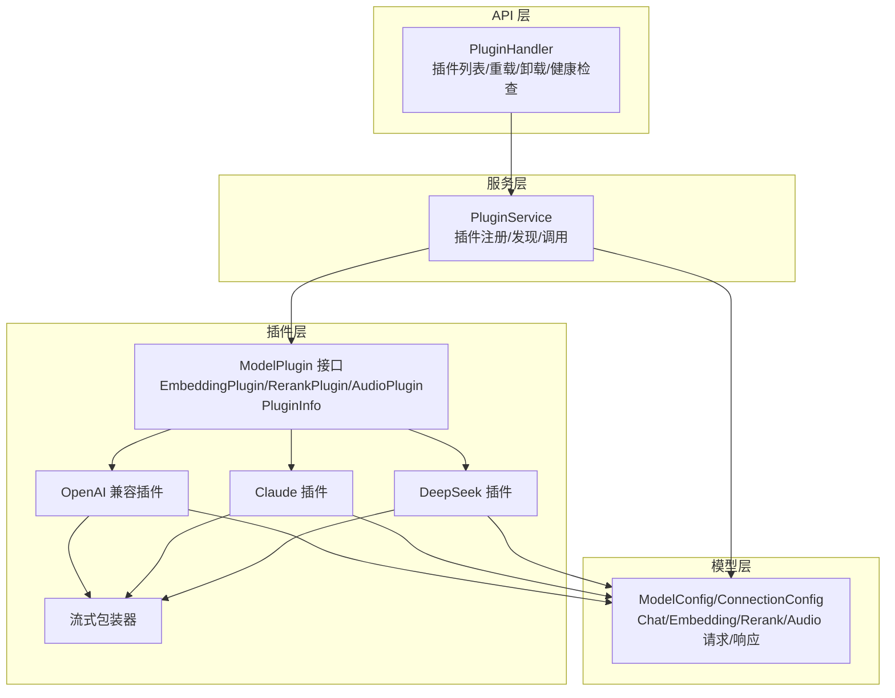
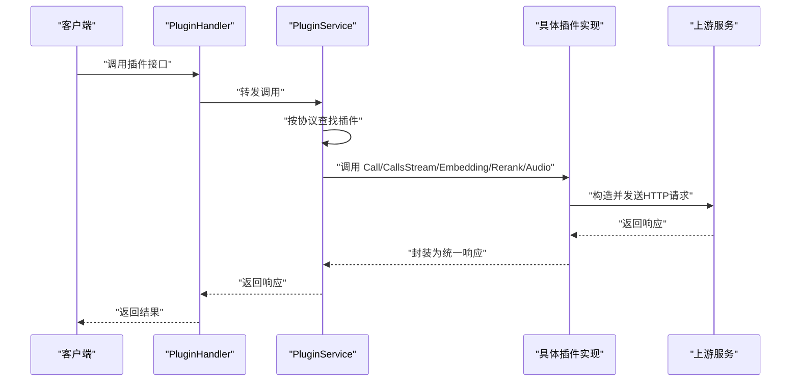
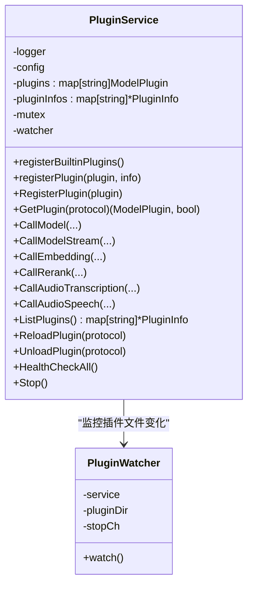
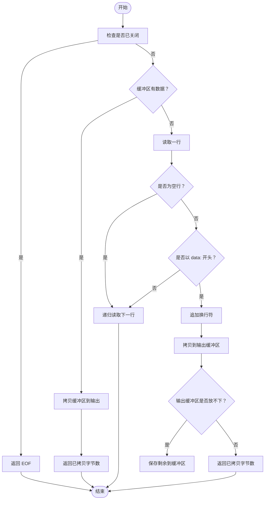
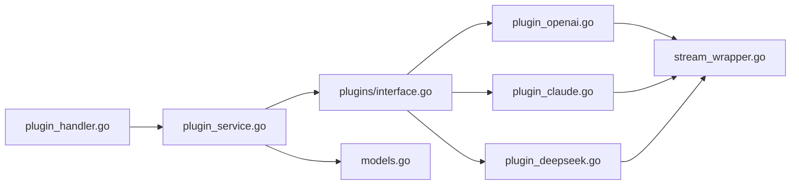

# 插件接口规范

<cite>
**本文档引用的文件**
- [interface.go](file://internal/plugins/interface.go)
- [plugin_openai.go](file://internal/plugins/plugin_openai.go)
- [plugin_claude.go](file://internal/plugins/plugin_claude.go)
- [plugin_deepseek.go](file://internal/plugins/plugin_deepseek.go)
- [stream_wrapper.go](file://internal/plugins/stream_wrapper.go)
- [plugin_service.go](file://internal/services/plugin_service.go)
- [models.go](file://internal/models/models.go)
- [plugin_handler.go](file://internal/api/handlers/plugin_handler.go)
- [plugin_openai_test.go](file://internal/plugins/plugin_openai_test.go)
- [plugin_service_test.go](file://internal/services/plugin_service_test.go)
</cite>

## 目录
1. [简介](#简介)
2. [项目结构](#项目结构)
3. [核心组件](#核心组件)
4. [架构总览](#架构总览)
5. [详细组件分析](#详细组件分析)
6. [依赖分析](#依赖分析)
7. [性能考虑](#性能考虑)
8. [故障排查指南](#故障排查指南)
9. [结论](#结论)
10. [附录](#附录)

## 简介
本文件面向 Wolink-Core 的插件系统，系统性阐述插件接口规范与实现最佳实践。重点包括：
- ModelPlugin 核心接口的设计原则与方法职责
- EmbeddingPlugin、RerankPlugin、AudioPlugin 扩展接口的理念与使用场景
- PluginInfo 元数据结构与插件生命周期管理
- 错误处理、超时控制、资源管理等技术要点
- 具体实现示例与常见问题解决方案

## 项目结构
插件体系位于 internal/plugins，服务编排位于 internal/services，模型数据结构位于 internal/models，API 层通过 internal/api/handlers 调用服务层。

图表来源
- [interface.go:11-55](file://internal/plugins/interface.go#L11-L55)
- [plugin_openai.go:18-370](file://internal/plugins/plugin_openai.go#L18-L370)
- [plugin_claude.go:17-248](file://internal/plugins/plugin_claude.go#L17-L248)
- [plugin_deepseek.go:17-235](file://internal/plugins/plugin_deepseek.go#L17-L235)
- [stream_wrapper.go:9-95](file://internal/plugins/stream_wrapper.go#L9-L95)
- [plugin_service.go:21-366](file://internal/services/plugin_service.go#L21-L366)
- [models.go:56-463](file://internal/models/models.go#L56-L463)
- [plugin_handler.go:12-74](file://internal/api/handlers/plugin_handler.go#L12-L74)

章节来源
- [interface.go:11-55](file://internal/plugins/interface.go#L11-L55)
- [plugin_service.go:21-92](file://internal/services/plugin_service.go#L21-L92)
- [models.go:56-463](file://internal/models/models.go#L56-L463)

## 核心组件
- ModelPlugin 接口：定义插件的基本能力，包括名称、协议、非流式调用、流式调用与健康检查。
- 扩展接口：
  - EmbeddingPlugin：支持向量嵌入
  - RerankPlugin：支持重排序
  - AudioPlugin：支持语音转写与语音合成
- PluginInfo：插件元数据，用于插件注册、状态管理与对外展示。
- PluginService：插件注册中心，负责插件注册、发现、调用分发与生命周期管理。
- StreamWrapper：统一的流式响应包装器，屏蔽底层 SSE/流协议差异。
- 模型数据结构：ModelConfig、ConnectionConfig、各类请求/响应结构，支撑插件与上游服务的对接。

章节来源
- [interface.go:11-55](file://internal/plugins/interface.go#L11-L55)
- [plugin_service.go:21-366](file://internal/services/plugin_service.go#L21-L366)
- [models.go:56-463](file://internal/models/models.go#L56-L463)
- [stream_wrapper.go:9-95](file://internal/plugins/stream_wrapper.go#L9-L95)

## 架构总览
插件系统采用“接口抽象 + 多实现 + 服务编排”的架构。服务层根据 ModelConfig 中的协议标识选择具体插件实现，并将通用的请求/响应结构转换为各厂商 API 所需格式。

图表来源
- [plugin_handler.go:24-74](file://internal/api/handlers/plugin_handler.go#L24-L74)
- [plugin_service.go:207-289](file://internal/services/plugin_service.go#L207-L289)
- [plugin_openai.go:42-121](file://internal/plugins/plugin_openai.go#L42-L121)
- [plugin_claude.go:41-99](file://internal/plugins/plugin_claude.go#L41-L99)
- [plugin_deepseek.go:41-126](file://internal/plugins/plugin_deepseek.go#L41-L126)

## 详细组件分析

### ModelPlugin 接口设计与职责
- Name()：返回插件名称，用于日志与 UI 展示。
- Protocol()：返回协议标识，作为插件注册与调用的键。
- Call(ctx, config, request)：非流式调用，返回标准 ChatCompletionResponse。
- CallStream(ctx, config, request)：流式调用，返回 io.ReadCloser，供 SSE/流式传输。
- HealthCheck(config)：健康检查，返回布尔值表示可用性。

实现要求
- 上下文传播：所有方法均接收 context，支持超时与取消。
- 参数透传：优先使用 ModelConfig.ConnConfig 中的配置，其次回退到请求体中的参数。
- 错误处理：对网络错误、状态码异常、解析失败等情况进行明确错误返回。
- 日志记录：关键请求/响应体与错误信息需记录日志以便诊断。
- 资源管理：确保响应体与客户端连接正确关闭。

章节来源
- [interface.go:11-27](file://internal/plugins/interface.go#L11-L27)
- [plugin_openai.go:42-121](file://internal/plugins/plugin_openai.go#L42-L121)
- [plugin_claude.go:41-99](file://internal/plugins/plugin_claude.go#L41-L99)
- [plugin_deepseek.go:41-126](file://internal/plugins/plugin_deepseek.go#L41-L126)

### 扩展接口设计理念与使用场景
- EmbeddingPlugin：用于文本向量化，典型场景为检索增强生成（RAG）与相似度计算。
- RerankPlugin：对候选文档进行重排序，提升检索质量。
- AudioPlugin：支持语音转写与语音合成，满足多模态交互需求。

实现要点
- EmbeddingPlugin：遵循 OpenAI 兼容的输入/输出格式，支持批量向量生成。
- RerankPlugin：支持查询与文档列表，返回相关性分数与可选文档内容。
- AudioPlugin：转写使用 multipart/form-data；语音合成返回二进制音频流。

章节来源
- [interface.go:29-43](file://internal/plugins/interface.go#L29-L43)
- [models.go:301-346](file://internal/models/models.go#L301-L346)
- [plugin_openai.go:231-369](file://internal/plugins/plugin_openai.go#L231-L369)

### PluginInfo 结构体与元数据管理
- 字段含义：name、protocol、version、description、author、loaded、healthy。
- 用途：服务层注册插件时填充；API 层提供插件列表与状态查询；支持插件重载与卸载。

章节来源
- [interface.go:45-55](file://internal/plugins/interface.go#L45-L55)
- [plugin_service.go:55-92](file://internal/services/plugin_service.go#L55-L92)
- [plugin_handler.go:24-74](file://internal/api/handlers/plugin_handler.go#L24-L74)

### PluginService 插件注册与调用分发
- 内置插件注册：启动时注册 OpenAI、Claude、DeepSeek 三类插件。
- 插件发现：按 ModelConfig.Protocol 查找对应插件。
- 调用分发：根据功能类型调用不同接口（Chat/Embedding/Rerank/Audio），并对扩展接口做类型断言。
- 生命周期管理：支持重载与卸载，维护 PluginInfo 状态。
- 健康检查：遍历插件更新健康状态（当前简化处理）。

图表来源
- [plugin_service.go:21-366](file://internal/services/plugin_service.go#L21-L366)

章节来源
- [plugin_service.go:21-366](file://internal/services/plugin_service.go#L21-L366)

### 流式响应包装器 StreamWrapper
- 目标：统一处理上游 SSE/流式响应，屏蔽底层差异。
- 行为：逐行读取，跳过空行与非 data 行，保留换行符，支持缓冲与递归读取。
- 资源管理：实现 io.ReadCloser，确保底层连接关闭。

图表来源
- [stream_wrapper.go:27-86](file://internal/plugins/stream_wrapper.go#L27-L86)

章节来源
- [stream_wrapper.go:9-95](file://internal/plugins/stream_wrapper.go#L9-L95)

### 具体插件实现示例

#### OpenAI 兼容插件
- 特点：支持 ChatCompletion 的非流式与流式调用；支持 Audio 转写与语音合成；健康检查通过最小请求验证。
- 关键实现：
  - 请求体解析与合并：优先使用 ConnConfig 中的模型与参数，透传消息列表。
  - 流式处理：强制开启 stream，设置 Accept: text/event-stream。
  - 健康检查：构造最小请求并在 10 秒超时内验证可用性。
  - 音频处理：multipart/form-data 构造与响应兼容处理（如 SRT 文本直接放入 Text 字段）。

章节来源
- [plugin_openai.go:18-370](file://internal/plugins/plugin_openai.go#L18-L370)

#### Claude 插件
- 特点：将请求转换为 Anthropic 消息格式，响应转换为 OpenAI 兼容格式。
- 关键实现：
  - 请求转换：提取 system/content，设置 max_tokens（Claude 必填）。
  - 响应转换：提取 content.text 并封装为 ChatCompletionResponse。
  - 流式处理：设置 anthropic-version 头并启用 SSE。

章节来源
- [plugin_claude.go:17-248](file://internal/plugins/plugin_claude.go#L17-L248)

#### DeepSeek 插件
- 特点：与 OpenAI 兼容的 API，支持 ChatCompletion 的非流式与流式调用。
- 关键实现：
  - 请求体解析与合并：与 OpenAI 插件类似。
  - 健康检查：构造最小请求并在 10 秒超时内验证可用性。

章节来源
- [plugin_deepseek.go:17-235](file://internal/plugins/plugin_deepseek.go#L17-L235)

### API 层集成
- PluginHandler 提供插件列表、重载、卸载与健康检查接口，便于运维与可观测性。

章节来源
- [plugin_handler.go:12-74](file://internal/api/handlers/plugin_handler.go#L12-L74)

## 依赖分析
- 插件接口与实现：ModelPlugin 及扩展接口定义于 plugins 包，具体实现位于同包下的插件文件。
- 服务编排：PluginService 依赖插件接口，聚合插件并进行调用分发。
- 数据模型：models 包提供统一的请求/响应结构，确保插件与上游服务的兼容性。
- 流式包装：StreamWrapper 仅依赖标准库 io 与 bufio，解耦上游协议差异。
- API 层：PluginHandler 依赖 ServiceManager，间接依赖 PluginService。

图表来源
- [interface.go:11-55](file://internal/plugins/interface.go#L11-L55)
- [plugin_openai.go:18-370](file://internal/plugins/plugin_openai.go#L18-L370)
- [plugin_claude.go:17-248](file://internal/plugins/plugin_claude.go#L17-L248)
- [plugin_deepseek.go:17-235](file://internal/plugins/plugin_deepseek.go#L17-L235)
- [stream_wrapper.go:9-95](file://internal/plugins/stream_wrapper.go#L9-L95)
- [plugin_service.go:21-366](file://internal/services/plugin_service.go#L21-L366)
- [models.go:56-463](file://internal/models/models.go#L56-L463)
- [plugin_handler.go:12-74](file://internal/api/handlers/plugin_handler.go#L12-L74)

章节来源
- [plugin_service.go:21-366](file://internal/services/plugin_service.go#L21-L366)
- [models.go:56-463](file://internal/models/models.go#L56-L463)

## 性能考虑
- 超时控制：插件内部使用 http.Client.Timeout 与 context.WithTimeout 控制请求超时，避免阻塞。
- 流式传输：通过 StreamWrapper 实现高效的流式读取，减少内存占用。
- 并发安全：PluginService 使用互斥锁保护插件注册与状态变更。
- 健康检查：定期执行健康检查，及时发现上游异常。
- 资源管理：确保响应体与底层连接在错误路径与正常路径均被关闭。

章节来源
- [plugin_openai.go:25-30](file://internal/plugins/plugin_openai.go#L25-L30)
- [plugin_deepseek.go:24-29](file://internal/plugins/plugin_deepseek.go#L24-L29)
- [plugin_service.go:34-53](file://internal/services/plugin_service.go#L34-L53)
- [stream_wrapper.go:88-95](file://internal/plugins/stream_wrapper.go#L88-L95)

## 故障排查指南
- 插件未找到：检查 ModelConfig.Protocol 是否与插件 Protocol 匹配，确认插件已注册。
- API Key 缺失：健康检查会返回 false，需检查配置。
- 状态码异常：插件会记录错误状态码与响应体，便于定位上游问题。
- JSON 解析失败：检查上游响应格式是否符合预期，必要时进行兼容处理。
- 流式读取异常：确认上游是否正确返回 SSE 格式，检查 StreamWrapper 的行解析逻辑。
- 超时问题：调整 http.Client.Timeout 或调用方上下文超时，避免长时间阻塞。

章节来源
- [plugin_service.go:207-217](file://internal/services/plugin_service.go#L207-L217)
- [plugin_openai.go:195-229](file://internal/plugins/plugin_openai.go#L195-L229)
- [plugin_deepseek.go:204-234](file://internal/plugins/plugin_deepseek.go#L204-L234)
- [stream_wrapper.go:27-86](file://internal/plugins/stream_wrapper.go#L27-L86)

## 结论
Wolink-Core 的插件接口规范以清晰的接口抽象与统一的数据模型为核心，结合服务编排实现了对多家大模型服务的兼容与扩展。通过扩展接口与流式包装器，系统能够覆盖聊天、嵌入、重排序与音频等多种能力。建议在实现新插件时遵循本文档的最佳实践，确保错误处理、超时控制与资源管理的一致性与可靠性。

## 附录

### 接口实现最佳实践清单
- 上下文传播：始终接收 context，合理设置超时与取消。
- 参数合并：优先使用 ConnConfig，其次回退到请求体参数。
- 错误处理：区分网络错误、状态码错误与解析错误，返回明确的错误信息。
- 日志记录：记录关键请求/响应与错误详情，便于诊断。
- 资源管理：确保响应体与客户端连接正确关闭。
- 健康检查：实现轻量级的可用性验证，支持定时检查。
- 流式处理：使用 StreamWrapper 统一处理上游 SSE/流式响应。

章节来源
- [interface.go:11-27](file://internal/plugins/interface.go#L11-L27)
- [plugin_openai.go:42-121](file://internal/plugins/plugin_openai.go#L42-L121)
- [plugin_claude.go:41-99](file://internal/plugins/plugin_claude.go#L41-L99)
- [plugin_deepseek.go:41-126](file://internal/plugins/plugin_deepseek.go#L41-L126)
- [stream_wrapper.go:9-95](file://internal/plugins/stream_wrapper.go#L9-L95)