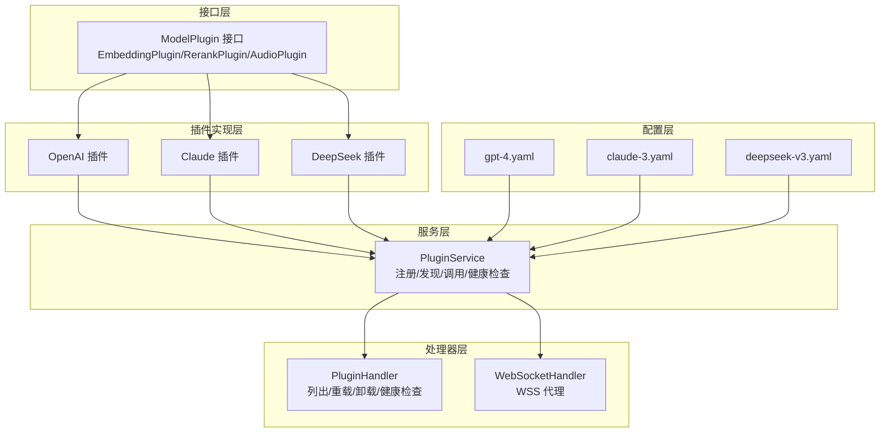
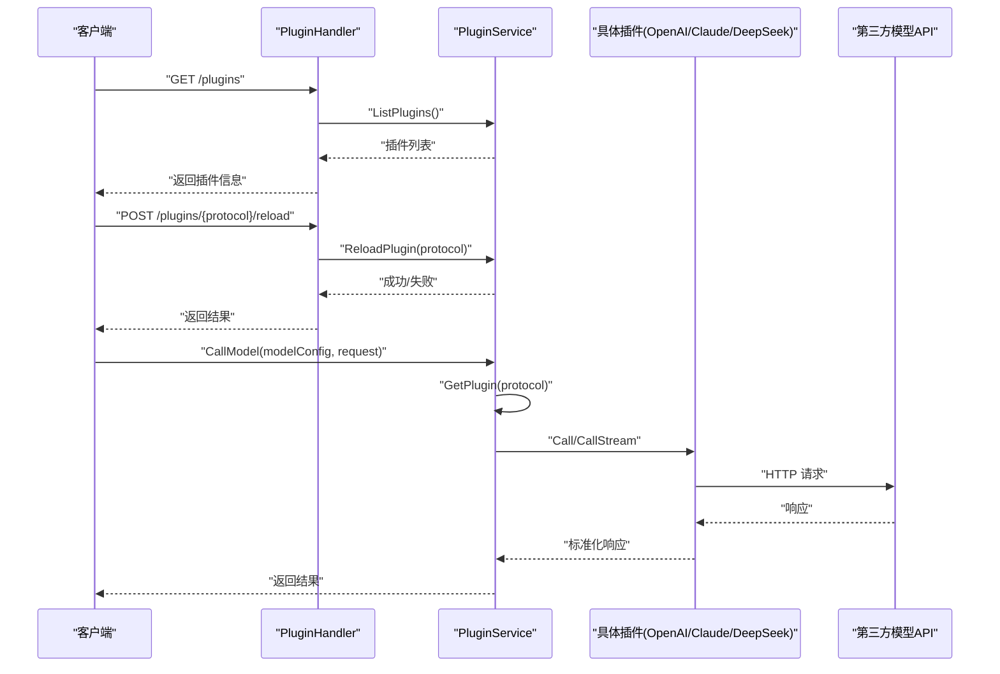
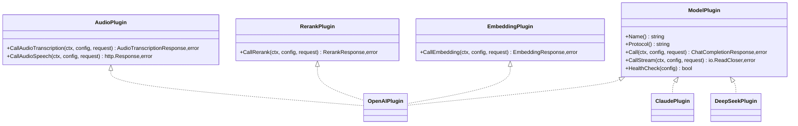
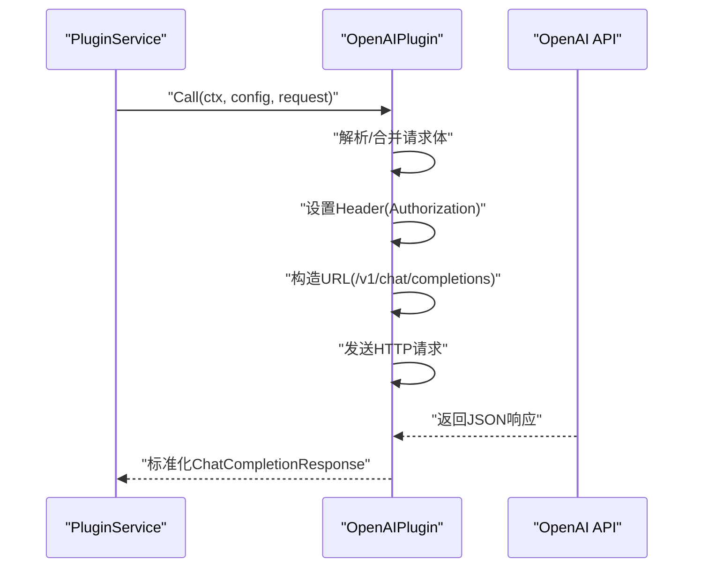
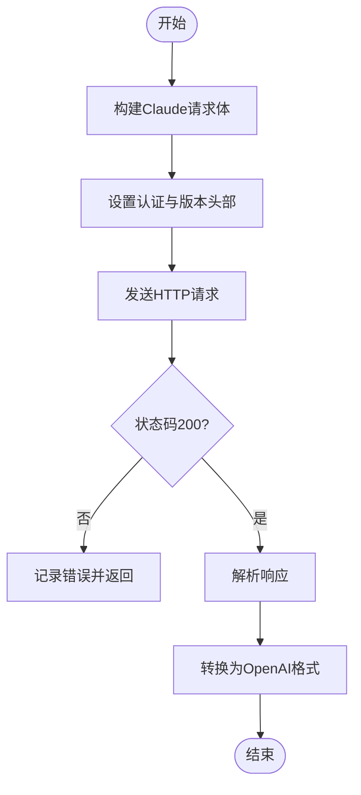
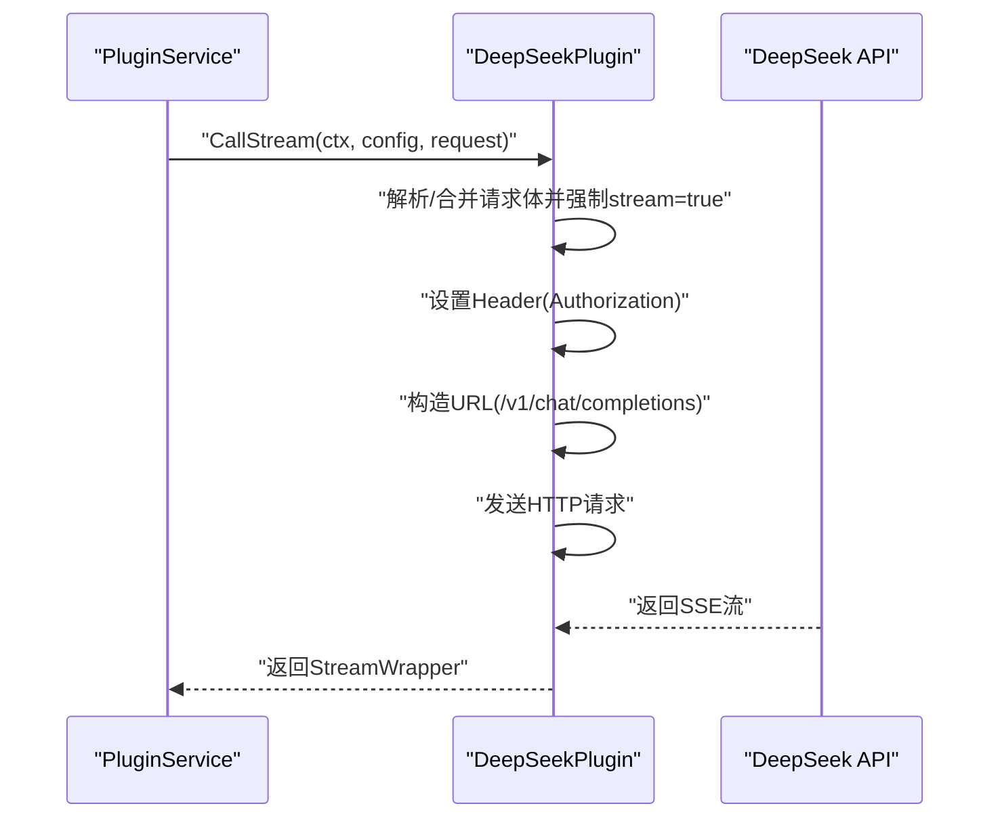
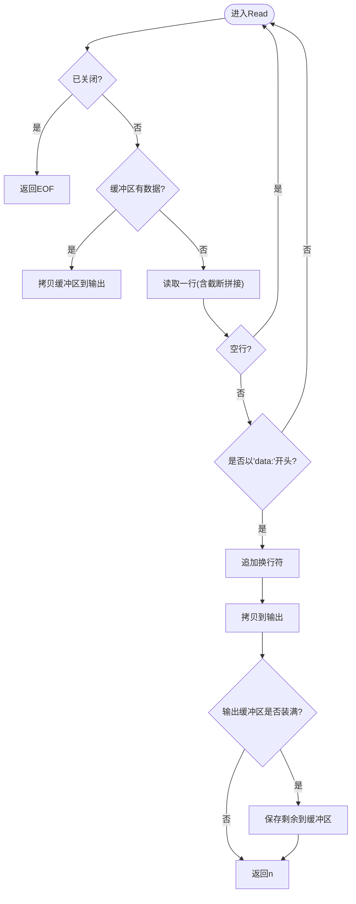
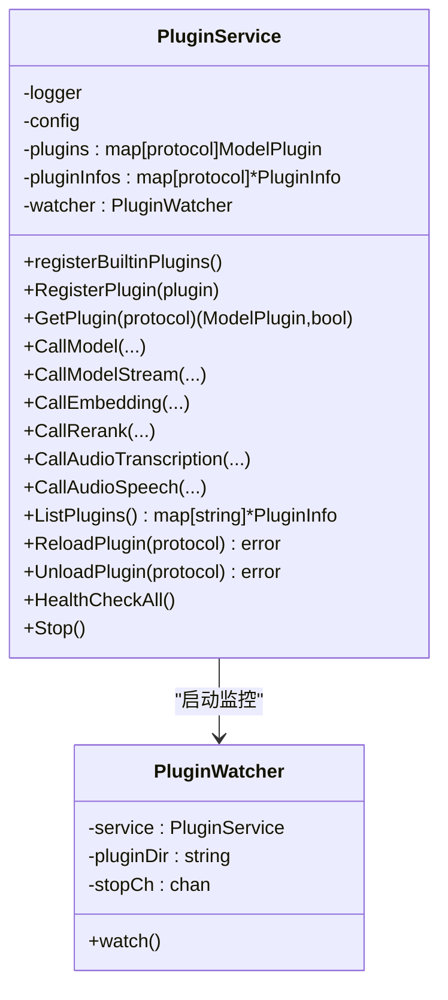
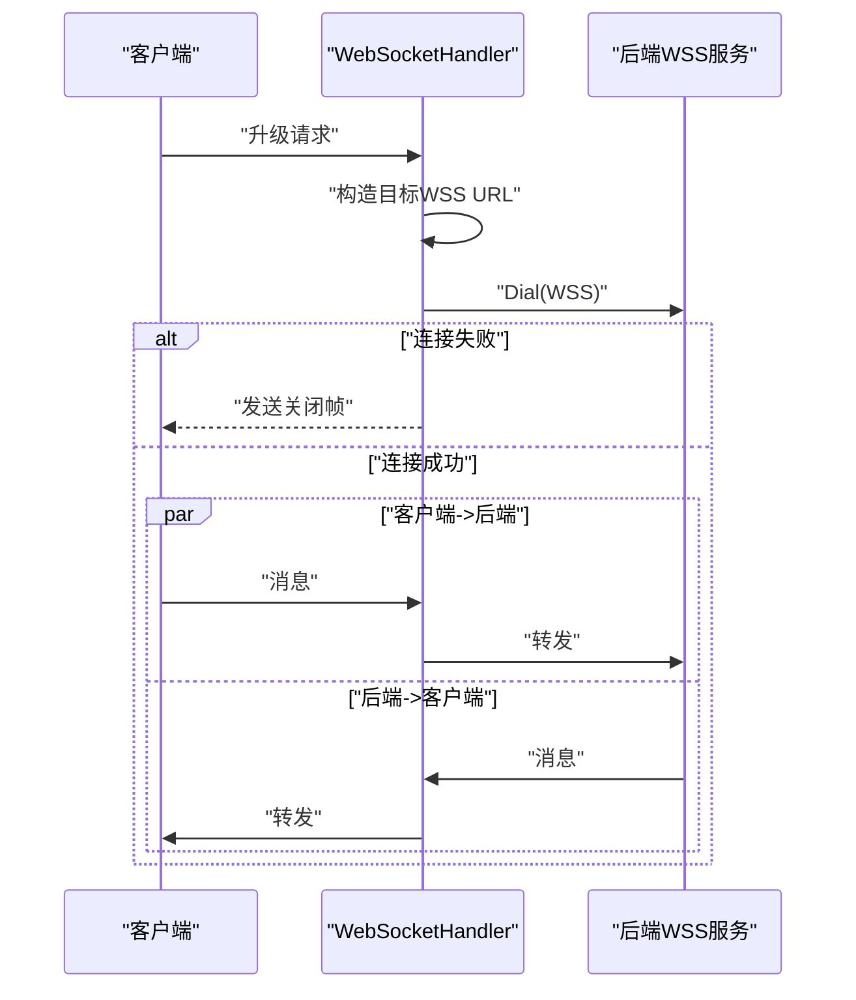
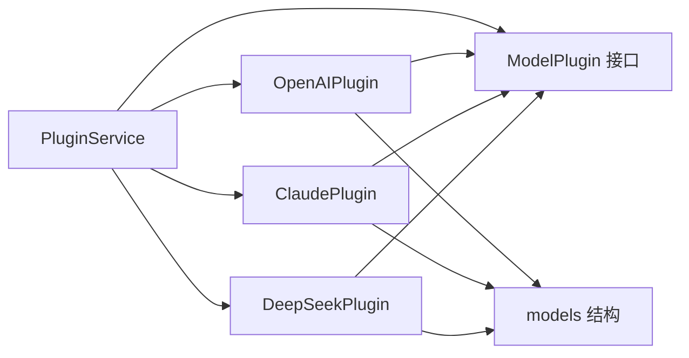

# 插件系统设计

<cite>
**本文引用的文件**
- [interface.go](file://internal/plugins/interface.go)
- [plugin_openai.go](file://internal/plugins/plugin_openai.go)
- [plugin_claude.go](file://internal/plugins/plugin_claude.go)
- [plugin_deepseek.go](file://internal/plugins/plugin_deepseek.go)
- [stream_wrapper.go](file://internal/plugins/stream_wrapper.go)
- [plugin_service.go](file://internal/services/plugin_service.go)
- [models.go](file://internal/models/models.go)
- [claude-3.yaml](file://configs/templates/claude-3.yaml)
- [deepseek-v3.yaml](file://configs/templates/deepseek-v3.yaml)
- [gpt-4.yaml](file://configs/templates/gpt-4.yaml)
- [plugin_handler.go](file://internal/api/handlers/plugin_handler.go)
- [websocket_handler.go](file://internal/api/handlers/websocket_handler.go)
- [main.go](file://cmd/main.go)
- [config.go](file://internal/config/config.go)
</cite>

## 目录
1. [引言](#引言)
2. [项目结构](#项目结构)
3. [核心组件](#核心组件)
4. [架构总览](#架构总览)
5. [详细组件分析](#详细组件分析)
6. [依赖分析](#依赖分析)
7. [性能考虑](#性能考虑)
8. [故障排查指南](#故障排查指南)
9. [结论](#结论)
10. [附录](#附录)

## 引言
本设计文档面向 Wolink-Core 的插件系统，聚焦于插件接口规范（ModelPlugin）的设计原理与实现要求，深入解析内置插件（OpenAI、Claude、DeepSeek）的实现细节，解释流式响应包装器的工作机制与 WebSocket 支持，并提供插件扩展指南、插件注册机制、配置管理与错误处理策略。文档旨在帮助开发者快速理解并安全地扩展新的 AI 模型提供商插件。

## 项目结构
插件系统围绕“接口定义—内置插件实现—服务编排—配置模板—处理器暴露”展开，形成清晰的分层结构：
- 接口层：定义统一的插件能力边界（聊天、流式、嵌入、重排序、音频等）
- 插件实现层：内置 OpenAI、Claude、DeepSeek 插件，封装第三方 API 调用与响应转换
- 服务层：集中管理插件注册、发现、调用与健康检查
- 配置层：通过 YAML 模板描述模型元数据、连接配置与默认参数
- 处理器层：对外暴露插件列表、重载、卸载与健康检查等管理接口；WebSocket 代理用于特定场景的流式传输



**图表来源**
- [interface.go:11-55](file://internal/plugins/interface.go#L11-L55)
- [plugin_openai.go:18-370](file://internal/plugins/plugin_openai.go#L18-L370)
- [plugin_claude.go:17-248](file://internal/plugins/plugin_claude.go#L17-L248)
- [plugin_deepseek.go:17-235](file://internal/plugins/plugin_deepseek.go#L17-L235)
- [plugin_service.go:21-366](file://internal/services/plugin_service.go#L21-L366)
- [plugin_handler.go:12-74](file://internal/api/handlers/plugin_handler.go#L12-L74)
- [websocket_handler.go:21-123](file://internal/api/handlers/websocket_handler.go#L21-L123)
- [gpt-4.yaml:1-75](file://configs/templates/gpt-4.yaml#L1-L75)
- [claude-3.yaml:1-75](file://configs/templates/claude-3.yaml#L1-L75)
- [deepseek-v3.yaml:1-101](file://configs/templates/deepseek-v3.yaml#L1-L101)

**章节来源**
- [main.go:19-89](file://cmd/main.go#L19-L89)
- [config.go:96-185](file://internal/config/config.go#L96-L185)

## 核心组件
- 插件接口规范（ModelPlugin）：统一定义插件名称、协议、同步与流式调用、健康检查等能力；并提供可选的嵌入、重排序、音频能力接口。
- 内置插件实现：OpenAI 兼容、Claude、DeepSeek，均实现统一接口，负责请求构建、头部设置、错误处理与响应解析。
- 插件服务（PluginService）：负责内置插件注册、外部插件注册、按协议查找插件、调用模型/嵌入/重排序/音频、健康检查与插件生命周期管理。
- 流式响应包装器（StreamWrapper）：将第三方 SSE/流式响应按行解析，过滤非 data 行，保证客户端接收标准的 data: 行。
- 配置模板：YAML 模板描述模型元数据、协议、连接配置与默认参数，驱动运行时 ModelConfig。
- 处理器与 WebSocket：对外暴露插件管理接口；WebSocket 代理用于特定场景的 WSS 透传。

**章节来源**
- [interface.go:11-55](file://internal/plugins/interface.go#L11-L55)
- [plugin_service.go:21-366](file://internal/services/plugin_service.go#L21-L366)
- [stream_wrapper.go:9-95](file://internal/plugins/stream_wrapper.go#L9-L95)
- [models.go:56-463](file://internal/models/models.go#L56-L463)

## 架构总览
插件系统采用“接口抽象 + 多实现 + 服务编排”的架构模式：
- 接口层定义统一契约，确保不同提供商的实现可互换
- 服务层集中管理插件注册与调用，屏蔽具体实现差异
- 配置层通过模板与运行时配置组合，决定调用目标与参数
- 处理器层提供管理与业务接口，WebSocket 代理满足特定流式需求



**图表来源**
- [plugin_handler.go:24-74](file://internal/api/handlers/plugin_handler.go#L24-L74)
- [plugin_service.go:198-229](file://internal/services/plugin_service.go#L198-L229)
- [plugin_openai.go:42-121](file://internal/plugins/plugin_openai.go#L42-L121)
- [plugin_claude.go:41-99](file://internal/plugins/plugin_claude.go#L41-L99)
- [plugin_deepseek.go:41-126](file://internal/plugins/plugin_deepseek.go#L41-L126)

## 详细组件分析

### 插件接口规范（ModelPlugin）
- 设计原则
  - 协议隔离：通过 Protocol() 明确插件适配的协议族（如 openai、claude、deepseek），便于路由与选择
  - 能力扩展：通过 EmbeddingPlugin、RerankPlugin、AudioPlugin 等接口扩展多模态能力
  - 统一错误：所有实现返回标准错误，便于上层统一处理
- 关键方法
  - Name()/Protocol()：标识插件与协议
  - Call/CallStream：同步与流式调用，返回标准化响应或流式读取器
  - HealthCheck：健康检查，用于运维与自动恢复
- 复杂度与性能
  - 调用开销主要来自网络与第三方 API 延迟；内部为纯内存操作，复杂度 O(1)
  - 流式读取通过包装器按行解析，避免阻塞，提升用户体验



**图表来源**
- [interface.go:11-55](file://internal/plugins/interface.go#L11-L55)

**章节来源**
- [interface.go:11-55](file://internal/plugins/interface.go#L11-L55)

### OpenAI 插件实现
- 请求构建
  - 从原始请求体解析并合并连接配置中的默认参数（温度、最大 token、top_p 等）
  - 将消息列表替换为经过敏感词过滤后的版本
  - 默认基础地址为官方 API，支持自定义 BaseURL
- 认证与头部
  - Authorization: Bearer 方式，API Key 来源于连接配置
- 响应解析
  - 同步：解析为统一的 ChatCompletionResponse
  - 流式：启用 stream=true，返回流式读取器
- 健康检查
  - 使用最小请求进行连通性测试，超时控制在 10 秒内
- 音频能力
  - 语音转写：multipart/form-data，支持语言、提示、响应格式、时间戳粒度等参数
  - 文本转语音：透传请求体并强制指定模型



**图表来源**
- [plugin_openai.go:42-121](file://internal/plugins/plugin_openai.go#L42-L121)

**章节来源**
- [plugin_openai.go:18-370](file://internal/plugins/plugin_openai.go#L18-L370)

### Claude 插件实现
- 请求构建
  - 将通用消息格式转换为 Claude 的 messages 数组与 system 字段
  - 必填 max_tokens 参数，若未显式提供则使用连接配置或默认值
- 响应转换
  - 将 Claude 原生响应转换为 OpenAI 兼容格式，便于上层统一处理
- 认证与头部
  - x-api-key、anthropic-version 等标准头部
- 健康检查
  - 简化实现，主要校验 API Key 是否为空



**图表来源**
- [plugin_claude.go:41-99](file://internal/plugins/plugin_claude.go#L41-L99)
- [plugin_claude.go:163-205](file://internal/plugins/plugin_claude.go#L163-L205)
- [plugin_claude.go:207-248](file://internal/plugins/plugin_claude.go#L207-L248)

**章节来源**
- [plugin_claude.go:17-248](file://internal/plugins/plugin_claude.go#L17-L248)

### DeepSeek 插件实现
- 请求构建
  - 与 OpenAI 类似，合并默认参数与消息列表，支持自定义 BaseURL
- 认证与头部
  - Authorization: Bearer 方式
- 健康检查
  - 同步健康检查，超时控制在 10 秒内
- 错误处理
  - 对空 API Key 进行显式校验，避免无效请求



**图表来源**
- [plugin_deepseek.go:128-202](file://internal/plugins/plugin_deepseek.go#L128-L202)

**章节来源**
- [plugin_deepseek.go:17-235](file://internal/plugins/plugin_deepseek.go#L17-L235)

### 流式响应包装器（StreamWrapper）
- 作用
  - 将第三方 SSE/流式响应按行读取，过滤非 data 行，确保客户端收到标准 data: 行
  - 支持缓冲与回填，避免客户端读取阻塞
- 关键行为
  - Read：逐行读取，跳过空行与非 data 行，必要时将剩余数据缓存
  - Close：关闭底层资源，防止泄漏
- 性能与可靠性
  - 使用 bufio.Reader 提升读取效率
  - 通过 hasData/ buffer 机制避免频繁分配



**图表来源**
- [stream_wrapper.go:27-86](file://internal/plugins/stream_wrapper.go#L27-L86)

**章节来源**
- [stream_wrapper.go:9-95](file://internal/plugins/stream_wrapper.go#L9-L95)

### 插件服务（PluginService）
- 注册机制
  - 内置插件：启动时静态注册 OpenAI、Claude、DeepSeek
  - 外部插件：通过 RegisterPlugin 动态注册
- 插件发现与调用
  - GetPlugin：按协议查找插件
  - CallModel/CallModelStream：执行同步/流式调用
  - CallEmbedding/CallRerank/CallAudio*：按能力接口调用
- 生命周期与监控
  - 启动插件监控器，定期检查插件文件变更（当前为记录，预留动态重载）
  - ReloadPlugin/UnloadPlugin：标记重载/卸载，简化实现
- 健康检查
  - HealthCheckAll：批量更新插件健康状态（当前简化为 true）



**图表来源**
- [plugin_service.go:21-366](file://internal/services/plugin_service.go#L21-L366)

**章节来源**
- [plugin_service.go:21-366](file://internal/services/plugin_service.go#L21-L366)

### 配置管理与模板
- 运行时配置（ModelConfig）
  - 包含基本信息、协议、能力、连接配置（BaseURL、APIKey、超时、默认参数）、参数列表与状态
- 配置模板（YAML）
  - gpt-4.yaml：OpenAI 兼容模板，定义协议、能力、连接配置与默认参数
  - claude-3.yaml：Claude 模板，定义 Anthropic 相关能力与连接配置
  - deepseek-v3.yaml：DeepSeek 模板，定义 DeepSeek 相关能力与连接配置
- 参数合并规则
  - 请求体未提供的参数优先使用连接配置中的默认值
  - 消息列表以敏感词过滤后的版本为准

```mermaid
erDiagram
MODEL_CONFIG {
string id
string name
string protocol
json conn_config
json parameters
int status
}
TEMPLATE_GPT4 {
string meta.protocol
json conn_config
json default_parameters
}
TEMPLATE_CLAUDE {
string meta.protocol
json conn_config
json default_parameters
}
TEMPLATE_DEEPSEEK {
string meta.protocol
json conn_config
json default_parameters
}
MODEL_CONFIG }o--|| TEMPLATE_GPT4 : "由模板初始化"
MODEL_CONFIG }o--|| TEMPLATE_CLAUDE : "由模板初始化"
MODEL_CONFIG }o--|| TEMPLATE_DEEPSEEK : "由模板初始化"
```

**图表来源**
- [models.go:56-463](file://internal/models/models.go#L56-L463)
- [gpt-4.yaml:1-75](file://configs/templates/gpt-4.yaml#L1-L75)
- [claude-3.yaml:1-75](file://configs/templates/claude-3.yaml#L1-L75)
- [deepseek-v3.yaml:1-101](file://configs/templates/deepseek-v3.yaml#L1-L101)

**章节来源**
- [models.go:56-463](file://internal/models/models.go#L56-L463)
- [gpt-4.yaml:1-75](file://configs/templates/gpt-4.yaml#L1-L75)
- [claude-3.yaml:1-75](file://configs/templates/claude-3.yaml#L1-L75)
- [deepseek-v3.yaml:1-101](file://configs/templates/deepseek-v3.yaml#L1-L101)

### WebSocket 支持
- 场景
  - 当特定模型后端提供 WSS 接口时，通过 WebSocket 代理实现双向转发
- 实现要点
  - 升级 HTTP 连接为 WebSocket
  - 构造目标 WSS URL（将 http/https 替换为 ws/wss）
  - 通过 goroutine 实现客户端与后端的双向消息转发
  - 传递 Authorization 头部，携带模型配置中的 API Key
- 容错
  - 后端连接失败时，向客户端发送内部错误关闭帧



**图表来源**
- [websocket_handler.go:21-123](file://internal/api/handlers/websocket_handler.go#L21-L123)

**章节来源**
- [websocket_handler.go:21-123](file://internal/api/handlers/websocket_handler.go#L21-L123)

## 依赖分析
- 组件耦合
  - PluginService 依赖插件接口，不依赖具体实现，耦合度低，内聚性强
  - 插件实现依赖 models 中的统一请求/响应结构，便于跨提供商兼容
- 外部依赖
  - HTTP 客户端用于第三方 API 调用
  - WebSocket 库用于代理 WSS
  - 日志库用于调试与错误记录
- 循环依赖
  - 未发现循环依赖，模块职责清晰



**图表来源**
- [plugin_service.go:21-366](file://internal/services/plugin_service.go#L21-L366)
- [interface.go:11-55](file://internal/plugins/interface.go#L11-L55)
- [plugin_openai.go:18-370](file://internal/plugins/plugin_openai.go#L18-L370)
- [plugin_claude.go:17-248](file://internal/plugins/plugin_claude.go#L17-L248)
- [plugin_deepseek.go:17-235](file://internal/plugins/plugin_deepseek.go#L17-L235)
- [models.go:56-463](file://internal/models/models.go#L56-L463)

**章节来源**
- [plugin_service.go:21-366](file://internal/services/plugin_service.go#L21-L366)
- [interface.go:11-55](file://internal/plugins/interface.go#L11-L55)

## 性能考虑
- 流式读取优化
  - 使用 StreamWrapper 按行读取，避免一次性读取大块数据导致内存峰值
  - 缓冲与回填机制减少系统调用次数
- 超时与并发
  - 插件内部 HTTP 客户端设置合理超时，避免长时间阻塞
  - 插件服务使用读写锁保护插件注册表，降低锁竞争
- 健康检查
  - 简化健康检查策略，避免对生产流量造成额外压力
- 建议
  - 对高频调用场景引入连接池与限流
  - 对第三方 API 增加熔断与退避策略

[本节为通用指导，无需特定文件来源]

## 故障排查指南
- 常见错误与定位
  - 插件未找到：检查协议是否正确，确认插件已注册
  - API Key 为空：检查连接配置，确保 API Key 已正确注入
  - 健康检查失败：查看日志中的错误码与响应体，确认网络可达性与鉴权
  - 流式读取异常：检查 StreamWrapper 是否被提前关闭，确认第三方 SSE 正常
- 日志与可观测性
  - 插件实现与服务层均使用日志记录关键路径，便于定位问题
- 处理器接口
  - 通过 /plugins 列表、/plugins/{protocol}/reload、/plugins/{protocol}/unload、/plugins/health 检查插件状态与健康情况

**章节来源**
- [plugin_openai.go:195-229](file://internal/plugins/plugin_openai.go#L195-L229)
- [plugin_claude.go:150-161](file://internal/plugins/plugin_claude.go#L150-L161)
- [plugin_deepseek.go:204-234](file://internal/plugins/plugin_deepseek.go#L204-L234)
- [plugin_handler.go:24-74](file://internal/api/handlers/plugin_handler.go#L24-L74)

## 结论
Wolink-Core 的插件系统通过统一接口抽象、清晰的服务编排与完善的配置模板，实现了对多家模型提供商的无缝集成。内置 OpenAI、Claude、DeepSeek 插件展示了如何在保持统一契约的前提下适配不同协议与响应格式。流式包装器与 WebSocket 代理进一步增强了实时交互能力。未来可在动态加载、熔断降级、参数化路由等方面持续演进。

[本节为总结，无需特定文件来源]

## 附录

### 插件扩展指南（开发新模型提供商插件）
- 实现步骤
  - 定义插件结构体并实现 ModelPlugin 接口（Name、Protocol、Call、CallStream、HealthCheck）
  - 如需嵌入、重排序或音频能力，实现对应接口
  - 在插件内部完成请求体解析与参数合并、头部设置、错误处理与响应解析
  - 在 PluginService 中注册插件（静态或动态）
- 最佳实践
  - 严格遵守参数合并规则：请求体未提供时使用连接配置默认值
  - 统一错误返回，便于上层处理
  - 对流式响应使用 StreamWrapper，确保客户端稳定接收
  - 健康检查应轻量且可重复
- 开发示例参考
  - OpenAI 插件：请求体解析、参数合并、流式与非流式调用
  - Claude 插件：消息格式转换与响应兼容
  - DeepSeek 插件：基础 OpenAI 兼容流程

**章节来源**
- [interface.go:11-55](file://internal/plugins/interface.go#L11-L55)
- [plugin_service.go:55-92](file://internal/services/plugin_service.go#L55-L92)
- [plugin_openai.go:42-121](file://internal/plugins/plugin_openai.go#L42-L121)
- [plugin_claude.go:163-205](file://internal/plugins/plugin_claude.go#L163-L205)
- [plugin_deepseek.go:128-202](file://internal/plugins/plugin_deepseek.go#L128-L202)