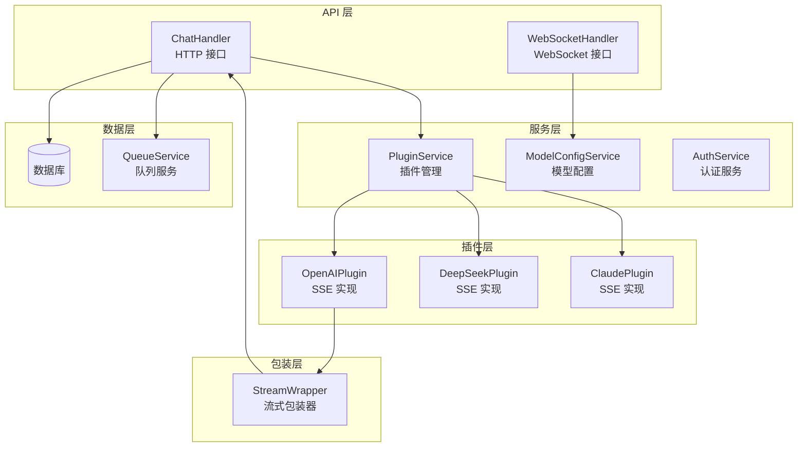
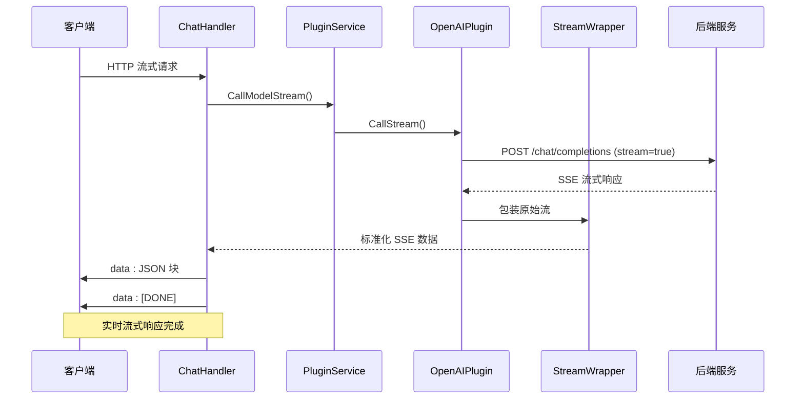
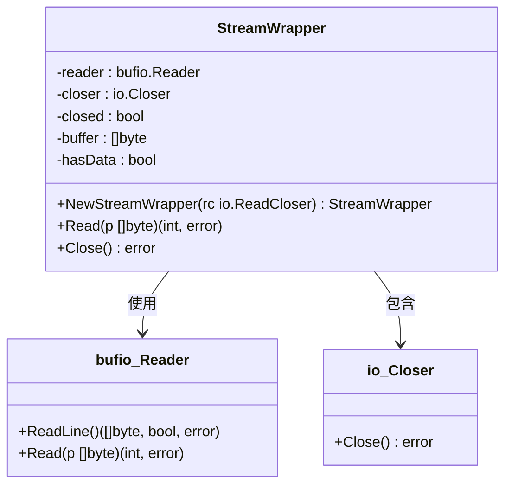
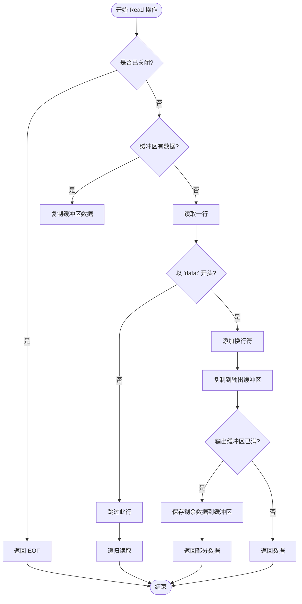
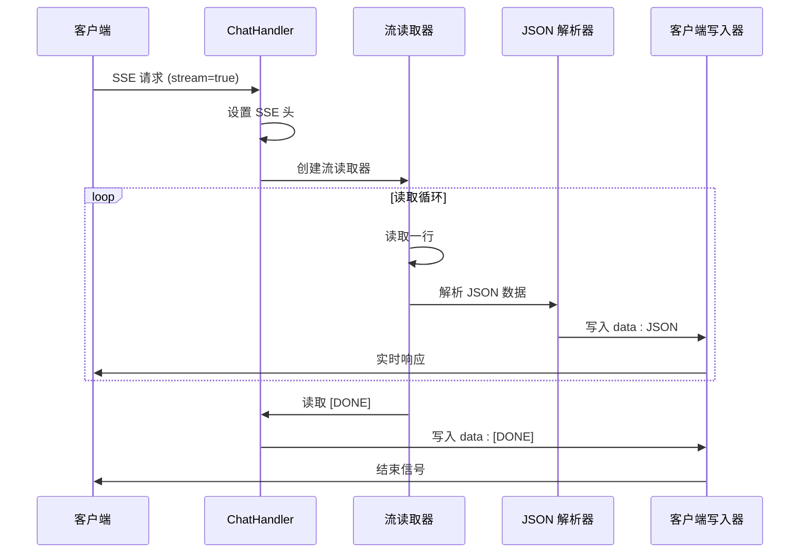
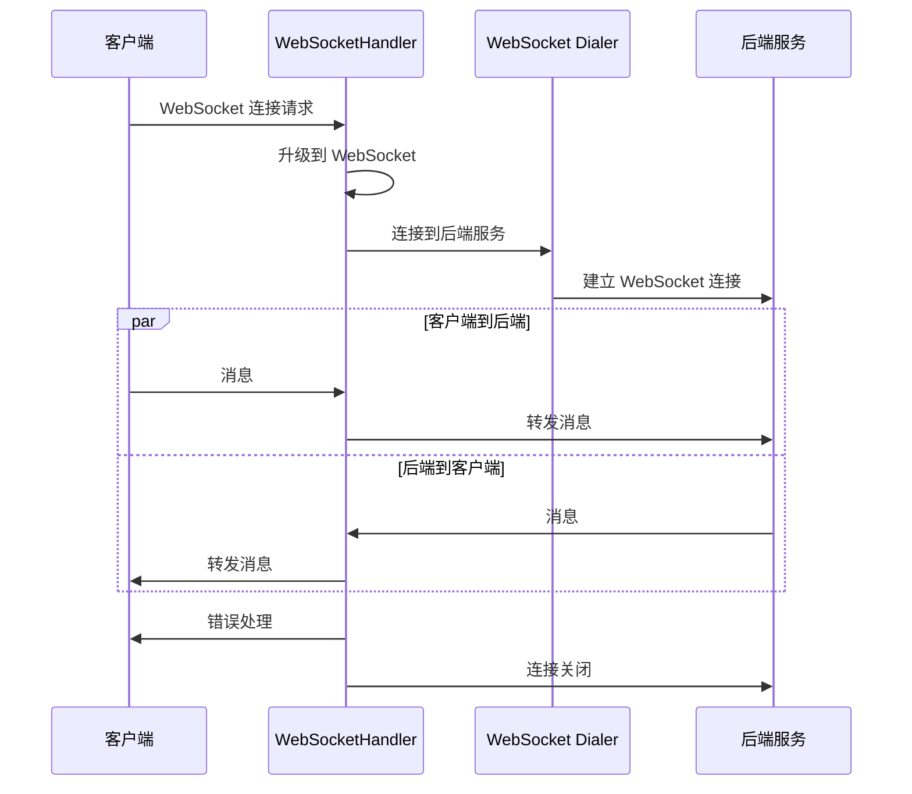
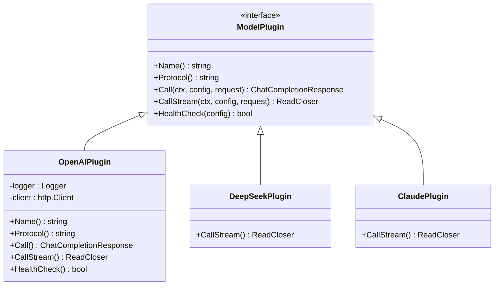
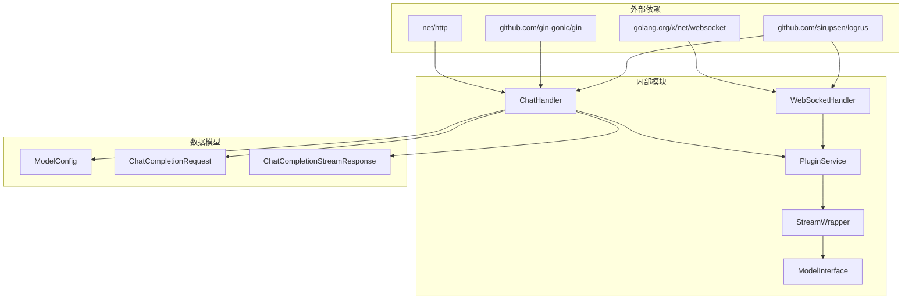

# 流式响应包装机制

<cite>
**本文档引用的文件**
- [stream_wrapper.go](file://internal/plugins/stream_wrapper.go)
- [websocket_handler.go](file://internal/api/handlers/websocket_handler.go)
- [chat_handler.go](file://internal/api/handlers/chat_handler.go)
- [interface.go](file://internal/plugins/interface.go)
- [plugin_service.go](file://internal/services/plugin_service.go)
- [models.go](file://internal/models/models.go)
- [plugin_openai.go](file://internal/plugins/plugin_openai.go)
</cite>

## 目录
1. [简介](#简介)
2. [项目结构](#项目结构)
3. [核心组件](#核心组件)
4. [架构概览](#架构概览)
5. [详细组件分析](#详细组件分析)
6. [依赖关系分析](#依赖关系分析)
7. [性能考虑](#性能考虑)
8. [故障排除指南](#故障排除指南)
9. [结论](#结论)

## 简介

Wolink-Core 的流式响应包装机制是一个关键的实时通信基础设施，它实现了对第三方 AI 模型服务的流式响应透明代理。该机制支持两种主要的流式传输模式：基于 Server-Sent Events (SSE) 的 HTTP 流式响应，以及基于 WebSocket 的双向实时通信。

该系统的核心价值在于：
- **实时性**：提供毫秒级的响应延迟，支持渐进式内容展示
- **兼容性**：统一不同供应商的流式响应格式，提供标准化的 OpenAI 兼容接口
- **可靠性**：完善的错误处理和连接管理机制
- **可扩展性**：插件化架构支持多种 AI 服务提供商

## 项目结构

流式响应机制涉及以下关键模块：

**图表来源**
- [chat_handler.go:1-716](file://internal/api/handlers/chat_handler.go#L1-L716)
- [websocket_handler.go:1-123](file://internal/api/handlers/websocket_handler.go#L1-L123)
- [plugin_service.go:1-366](file://internal/services/plugin_service.go#L1-L366)

**章节来源**
- [chat_handler.go:1-716](file://internal/api/handlers/chat_handler.go#L1-L716)
- [websocket_handler.go:1-123](file://internal/api/handlers/websocket_handler.go#L1-L123)
- [plugin_service.go:1-366](file://internal/services/plugin_service.go#L1-L366)

## 核心组件

### StreamWrapper 流式包装器

StreamWrapper 是整个流式响应机制的核心组件，负责将第三方服务的原始流式响应转换为标准的 SSE 格式。

**主要特性**：
- **SSE 格式转换**：将 `data:` 前缀的行转换为标准 SSE 格式
- **缓冲机制**：智能缓冲区管理，处理部分读取的情况
- **错误处理**：完整的错误传播和资源清理
- **内存优化**：最小化内存分配和拷贝操作

**章节来源**
- [stream_wrapper.go:1-95](file://internal/plugins/stream_wrapper.go#L1-L95)

### ChatHandler 流式处理

ChatHandler 负责处理 HTTP 流式请求，实现完整的 SSE 流式响应管道。

**核心功能**：
- **SSE 头设置**：正确设置 `Content-Type` 和缓存控制头
- **流式转发**：实时转发后端流式响应到客户端
- **JSON 解析**：解析流式响应中的 JSON 数据
- **令牌计数**：统计生成的令牌数量
- **异步记录**：非阻塞地记录对话历史和使用情况

**章节来源**
- [chat_handler.go:115-206](file://internal/api/handlers/chat_handler.go#L115-L206)

### WebSocketHandler WebSocket 支持

WebSocketHandler 提供 WebSocket 协议的流式通信支持。

**关键特性**：
- **双向转发**：客户端消息到后端的双向转发
- **连接升级**：自动处理 HTTP 到 WebSocket 的协议升级
- **错误处理**：优雅处理连接中断和错误
- **超时控制**：握手超时和连接管理

**章节来源**
- [websocket_handler.go:21-122](file://internal/api/handlers/websocket_handler.go#L21-L122)

## 架构概览

流式响应的整体架构采用分层设计，确保了高内聚低耦合：

**图表来源**
- [chat_handler.go:115-206](file://internal/api/handlers/chat_handler.go#L115-L206)
- [plugin_service.go:219-229](file://internal/services/plugin_service.go#L219-L229)
- [plugin_openai.go:123-193](file://internal/plugins/plugin_openai.go#L123-L193)

## 详细组件分析

### StreamWrapper 实现详解

StreamWrapper 的设计体现了高效的流式处理原则：

**核心算法流程**：

**图表来源**
- [stream_wrapper.go:27-86](file://internal/plugins/stream_wrapper.go#L27-L86)

**章节来源**
- [stream_wrapper.go:1-95](file://internal/plugins/stream_wrapper.go#L1-L95)

### 流式响应处理流程

ChatHandler 的流式处理实现了完整的 SSE 流式响应管道：

**图表来源**
- [chat_handler.go:115-206](file://internal/api/handlers/chat_handler.go#L115-L206)

**章节来源**
- [chat_handler.go:115-206](file://internal/api/handlers/chat_handler.go#L115-L206)

### WebSocket 双向通信

WebSocketHandler 实现了高效的双向通信机制：

**图表来源**
- [websocket_handler.go:21-122](file://internal/api/handlers/websocket_handler.go#L21-L122)

**章节来源**
- [websocket_handler.go:21-122](file://internal/api/handlers/websocket_handler.go#L21-L122)

### 插件接口设计

插件接口定义了统一的流式响应标准：

**图表来源**
- [interface.go:11-27](file://internal/plugins/interface.go#L11-L27)

**章节来源**
- [interface.go:1-55](file://internal/plugins/interface.go#L1-L55)

## 依赖关系分析

流式响应机制的依赖关系体现了清晰的分层架构：

**图表来源**
- [chat_handler.go:1-716](file://internal/api/handlers/chat_handler.go#L1-L716)
- [websocket_handler.go:1-123](file://internal/api/handlers/websocket_handler.go#L1-L123)
- [plugin_service.go:1-366](file://internal/services/plugin_service.go#L1-L366)

**章节来源**
- [chat_handler.go:1-716](file://internal/api/handlers/chat_handler.go#L1-L716)
- [websocket_handler.go:1-123](file://internal/api/handlers/websocket_handler.go#L1-L123)
- [plugin_service.go:1-366](file://internal/services/plugin_service.go#L1-L366)

## 性能考虑

### 内存管理策略

流式响应机制采用了多项内存优化技术：

1. **零拷贝优化**：StreamWrapper 使用 `bufio.Reader` 进行高效读取
2. **缓冲区复用**：智能缓冲区管理，减少内存分配次数
3. **流式处理**：避免将整个响应加载到内存中
4. **及时释放**：正确的资源清理和连接关闭

### 性能优化建议

1. **连接池配置**：合理配置 HTTP 客户端连接池
2. **超时设置**：设置合适的请求超时和读取超时
3. **缓冲大小**：根据实际需求调整缓冲区大小
4. **并发控制**：限制同时进行的流式请求数量

### 监控指标

建议监控以下关键指标：
- 流式请求的平均响应时间
- 内存使用峰值和平均值
- 连接池利用率
- 错误率和重试次数

## 故障排除指南

### 常见问题及解决方案

**问题1：流式响应中断**
- 检查网络连接稳定性
- 验证后端服务的流式支持
- 检查防火墙和代理设置

**问题2：内存泄漏**
- 确保正确关闭流式响应
- 检查是否有未消费的缓冲区数据
- 验证资源清理逻辑

**问题3：SSE 格式错误**
- 确认后端服务返回标准的 SSE 格式
- 检查 StreamWrapper 的数据处理逻辑
- 验证客户端的 SSE 解析能力

**问题4：WebSocket 连接失败**
- 检查握手超时设置
- 验证后端 WebSocket 服务可用性
- 确认 CORS 配置正确

### 调试技巧

1. **启用详细日志**：设置日志级别为 Debug
2. **监控网络流量**：使用抓包工具分析数据流
3. **性能分析**：使用 Go pprof 分析性能瓶颈
4. **压力测试**：模拟高并发场景下的表现

**章节来源**
- [stream_wrapper.go:88-95](file://internal/plugins/stream_wrapper.go#L88-L95)
- [chat_handler.go:136-144](file://internal/api/handlers/chat_handler.go#L136-L144)

## 结论

Wolink-Core 的流式响应包装机制展现了优秀的软件工程实践：

1. **架构设计**：清晰的分层架构和职责分离
2. **性能优化**：高效的流式处理和内存管理
3. **错误处理**：完善的异常处理和恢复机制
4. **扩展性**：插件化设计支持多种 AI 服务提供商
5. **兼容性**：标准化的 OpenAI 兼容接口

该机制为构建高性能的 AI 应用提供了坚实的基础，开发者可以基于此框架快速集成新的 AI 服务提供商，同时享受统一的流式响应体验。

通过合理的配置和监控，该系统能够在生产环境中稳定运行，为用户提供流畅的实时交互体验。