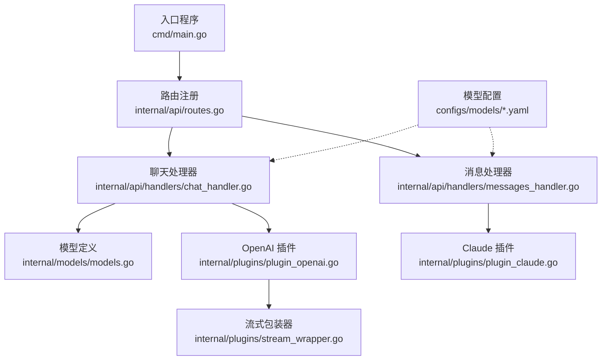
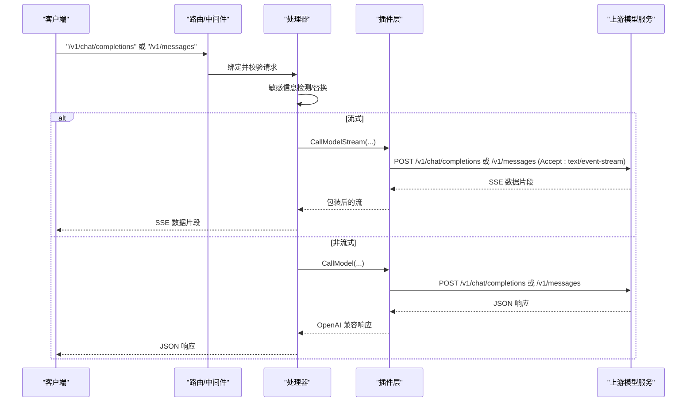
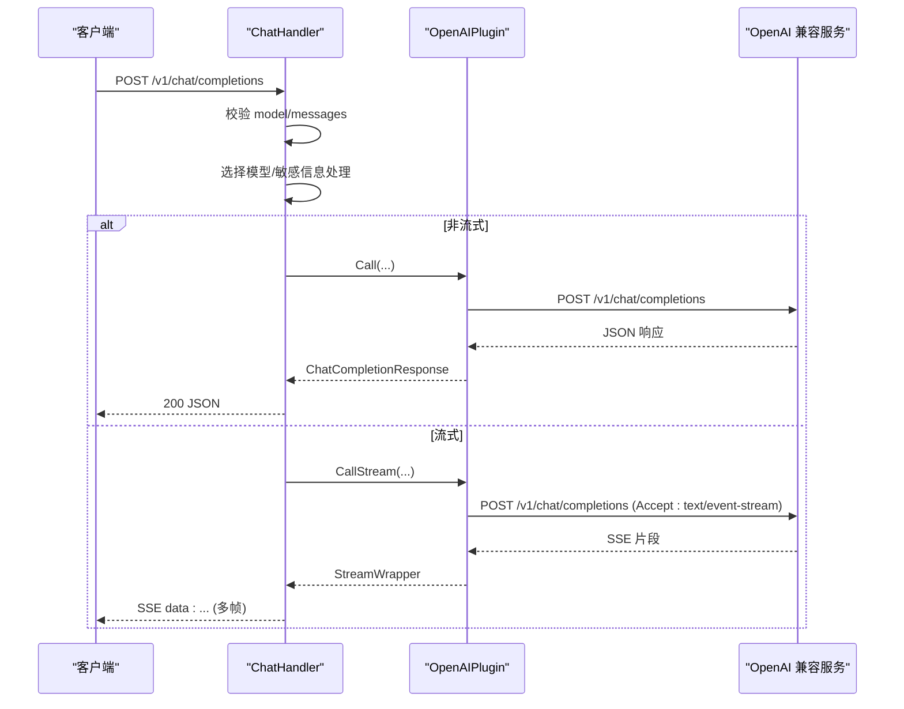
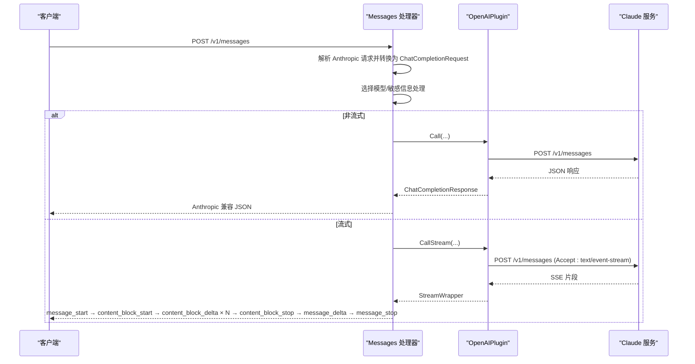
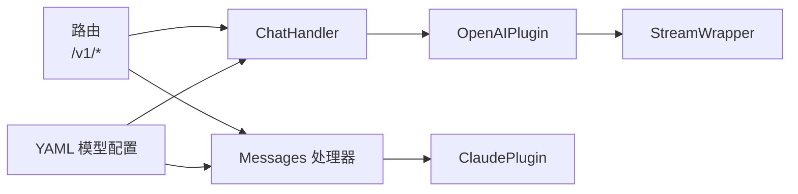

# API 请求响应结构

<cite>
**本文引用的文件**
- [cmd/main.go](file://cmd/main.go)
- [internal/api/routes.go](file://internal/api/routes.go)
- [internal/api/handlers/chat_handler.go](file://internal/api/handlers/chat_handler.go)
- [internal/api/handlers/messages_handler.go](file://internal/api/handlers/messages_handler.go)
- [internal/models/models.go](file://internal/models/models.go)
- [internal/plugins/plugin_openai.go](file://internal/plugins/plugin_openai.go)
- [internal/plugins/plugin_claude.go](file://internal/plugins/plugin_claude.go)
- [internal/plugins/stream_wrapper.go](file://internal/plugins/stream_wrapper.go)
- [configs/models/qwen3-chat.yaml](file://configs/models/qwen3-chat.yaml)
- [configs/models/qwen3-embedding.yaml](file://configs/models/qwen3-embedding.yaml)
- [configs/models/qwen3-asr.yaml](file://configs/models/qwen3-asr.yaml)
- [configs/models/qwen-tts.yaml](file://configs/models/qwen-tts.yaml)
- [configs/templates/claude-3.yaml](file://configs/templates/claude-3.yaml)
</cite>

## 目录
1. [简介](#简介)
2. [项目结构](#项目结构)
3. [核心组件](#核心组件)
4. [架构总览](#架构总览)
5. [详细组件分析](#详细组件分析)
6. [依赖分析](#依赖分析)
7. [性能考虑](#性能考虑)
8. [故障排查指南](#故障排查指南)
9. [结论](#结论)
10. [附录](#附录)

## 简介
本文件系统性梳理 Wolink-Core 的 API 请求与响应结构，覆盖以下能力：
- OpenAI 兼容的 Chat Completions（含流式 SSE）与 Embeddings、Rerank、Audio（转写/合成）接口
- Anthropic 兼容的 Messages（含流式事件）接口
- 参数校验规则、默认值策略、错误处理机制与兼容性实现
- JSON Schema 定义、字段约束与示例路径

## 项目结构
Wolink-Core 采用分层架构：入口程序初始化配置与服务，路由模块挂载 API，处理器负责业务编排，插件模块对接上游模型服务，模型定义统一承载请求/响应结构。

图表来源
- [cmd/main.go:19-89](file://cmd/main.go#L19-L89)
- [internal/api/routes.go:14-129](file://internal/api/routes.go#L14-L129)
- [internal/api/handlers/chat_handler.go:34-716](file://internal/api/handlers/chat_handler.go#L34-L716)
- [internal/api/handlers/messages_handler.go:18-335](file://internal/api/handlers/messages_handler.go#L18-L335)
- [internal/models/models.go:198-463](file://internal/models/models.go#L198-L463)
- [internal/plugins/plugin_openai.go:42-370](file://internal/plugins/plugin_openai.go#L42-L370)
- [internal/plugins/plugin_claude.go:41-248](file://internal/plugins/plugin_claude.go#L41-L248)
- [internal/plugins/stream_wrapper.go:27-95](file://internal/plugins/stream_wrapper.go#L27-L95)

章节来源
- [cmd/main.go:19-89](file://cmd/main.go#L19-L89)
- [internal/api/routes.go:14-129](file://internal/api/routes.go#L14-L129)

## 核心组件
- 路由与中间件：统一挂载认证、日志、CORS、指标与错误处理中间件，按需启用 API Key 认证
- 处理器：
  - ChatCompletions：OpenAI 兼容聊天接口，支持流式与非流式
  - Messages：Anthropic 兼容消息接口，支持流式与非流式
  - Embeddings/Rerank/AudioTranscriptions/AudioSpeech：对应 OpenAI 兼容的 Embedding、Rerank 与音频能力
- 插件层：
  - OpenAIPlugin：透传请求至上游 OpenAI 兼容服务，支持流式与非流式
  - ClaudePlugin：将请求转换为 Anthropic 格式并转换响应为 OpenAI 兼容格式
- 模型定义：集中定义所有请求/响应结构、参数校验与默认值策略

章节来源
- [internal/api/routes.go:46-72](file://internal/api/routes.go#L46-L72)
- [internal/api/handlers/chat_handler.go:34-250](file://internal/api/handlers/chat_handler.go#L34-L250)
- [internal/api/handlers/messages_handler.go:18-135](file://internal/api/handlers/messages_handler.go#L18-L135)
- [internal/plugins/plugin_openai.go:42-370](file://internal/plugins/plugin_openai.go#L42-L370)
- [internal/plugins/plugin_claude.go:41-248](file://internal/plugins/plugin_claude.go#L41-L248)
- [internal/models/models.go:198-463](file://internal/models/models.go#L198-L463)

## 架构总览
Wolink-Core 将外部请求统一封装为内部模型，经安全检测与路由选择后，交由插件层调用上游模型服务，并将响应转换为统一的 OpenAI 兼容格式对外返回；对于 Anthropic Messages，额外进行事件流封装。

图表来源
- [internal/api/routes.go:46-72](file://internal/api/routes.go#L46-L72)
- [internal/api/handlers/chat_handler.go:115-250](file://internal/api/handlers/chat_handler.go#L115-L250)
- [internal/api/handlers/messages_handler.go:192-335](file://internal/api/handlers/messages_handler.go#L192-L335)
- [internal/plugins/plugin_openai.go:123-193](file://internal/plugins/plugin_openai.go#L123-L193)
- [internal/plugins/plugin_claude.go:101-148](file://internal/plugins/plugin_claude.go#L101-L148)

## 详细组件分析

### OpenAI 兼容 Chat Completions
- 请求结构
  - 字段：model（必填）、messages（必填，至少1条，每条 role ∈ {system,user,assistant}，content 非空）、temperature（可选，0~2）、max_tokens（可选，1~128000）、stream（可选）、user（可选）
  - 示例路径：[ChatCompletionRequest 定义:200-209](file://internal/models/models.go#L200-L209)
- 响应结构
  - 字段：id、object、created、model、choices（每项包含 index、message{role,content}、finish_reason）、usage{prompt_tokens,completion_tokens,total_tokens}
  - 示例路径：[ChatCompletionResponse 定义:216-235](file://internal/models/models.go#L216-L235)
- 流式响应（SSE）
  - 字段：id、object、created、model、choices（每项包含 index、delta{role?,content?}、finish_reason?）
  - 示例路径：[ChatCompletionStreamResponse 定义:237-255](file://internal/models/models.go#L237-L255)
- 处理流程
  - 解析与基础校验（model/messages 必填）
  - 选择可用模型（按 API Key 与路由规则）
  - 敏感信息检测与替换
  - 非流式：调用插件后返回 JSON
  - 流式：设置 SSE 头，逐行转发上游数据片段
- 错误处理
  - 读取请求体失败、JSON 解析失败、参数校验失败、插件调用失败均返回相应状态码与错误信息
  - 流式错误通过 SSE 事件返回错误对象

图表来源
- [internal/api/handlers/chat_handler.go:34-250](file://internal/api/handlers/chat_handler.go#L34-L250)
- [internal/plugins/plugin_openai.go:42-193](file://internal/plugins/plugin_openai.go#L42-L193)
- [internal/plugins/stream_wrapper.go:27-95](file://internal/plugins/stream_wrapper.go#L27-L95)

章节来源
- [internal/models/models.go:200-255](file://internal/models/models.go#L200-L255)
- [internal/api/handlers/chat_handler.go:34-250](file://internal/api/handlers/chat_handler.go#L34-L250)
- [internal/plugins/plugin_openai.go:42-193](file://internal/plugins/plugin_openai.go#L42-L193)
- [internal/plugins/stream_wrapper.go:27-95](file://internal/plugins/stream_wrapper.go#L27-L95)

### Anthropic 兼容 Messages
- 请求结构
  - 字段：model（必填）、messages（必填，role ∈ {user,assistant}，content 可为字符串或数组）、system（可选，字符串或数组）、max_tokens（必填）、metadata、stop_sequences、stream、temperature、top_p、top_k
  - 示例路径：[AnthropicMessageRequest 定义:259-271](file://internal/models/models.go#L259-L271)
- 响应结构（非流式）
  - 字段：id、type="message"、role="assistant"、content[{type:"text",text}]、model、stop_reason、stop_sequence、usage{input_tokens,output_tokens}
  - 示例路径：[AnthropicMessageResponse 定义:278-297](file://internal/models/models.go#L278-L297)
- 流式响应（SSE 事件）
  - 事件序列：message_start → content_block_start → content_block_delta × N → content_block_stop → message_delta → message_stop
  - 示例路径：[messages_handler 流式实现:192-335](file://internal/api/handlers/messages_handler.go#L192-L335)
- 处理流程
  - 解析 Anthropic 请求，转换为内部 ChatCompletionRequest（含 system 处理）
  - 选择模型、敏感信息处理
  - 非流式：调用插件后转换为 Anthropic 响应
  - 流式：发送起始事件，逐片转发并构造 content_block_delta 事件
- 错误处理
  - 参数校验失败返回 400；插件调用失败返回 500；流式错误通过 SSE 错误事件返回

图表来源
- [internal/api/handlers/messages_handler.go:18-335](file://internal/api/handlers/messages_handler.go#L18-L335)
- [internal/plugins/plugin_claude.go:41-148](file://internal/plugins/plugin_claude.go#L41-L148)
- [internal/plugins/plugin_openai.go:123-193](file://internal/plugins/plugin_openai.go#L123-L193)

章节来源
- [internal/models/models.go:259-297](file://internal/models/models.go#L259-L297)
- [internal/api/handlers/messages_handler.go:18-335](file://internal/api/handlers/messages_handler.go#L18-L335)
- [internal/plugins/plugin_claude.go:41-148](file://internal/plugins/plugin_claude.go#L41-L148)

### Embeddings
- 请求结构
  - 字段：model（必填）、input（必填，字符串或字符串数组）、encoding_format（可选，float/base64）、dimensions（可选）、user（可选）
  - 示例路径：[EmbeddingRequest 定义:299-308](file://internal/models/models.go#L299-L308)
- 响应结构
  - 字段：object="list"、data[{object,index,embedding[]}]、model、usage{prompt_tokens,completion_tokens,total_tokens}
  - 示例路径：[EmbeddingResponse 定义:310-315](file://internal/models/models.go#L310-L315)
- 处理流程
  - 解析与基础校验（model/input 必填）
  - 选择模型并调用插件
  - 记录使用量并返回

章节来源
- [internal/models/models.go:299-315](file://internal/models/models.go#L299-L315)
- [internal/api/handlers/chat_handler.go:424-483](file://internal/api/handlers/chat_handler.go#L424-L483)

### Rerank
- 请求结构
  - 字段：model（必填）、query（必填）、documents（必填，非空数组）、top_n（可选）、return_documents（可选）
  - 示例路径：[RerankRequest 定义:323-332](file://internal/models/models.go#L323-L332)
- 响应结构
  - 字段：id（可选）、model（可选）、results[{index,relevance_score,document?}]、usage（可选）
  - 示例路径：[RerankResponse 定义:334-345](file://internal/models/models.go#L334-L345)
- 处理流程
  - 解析与基础校验（model/query/documents 必填）
  - 选择模型并调用插件
  - 记录使用量并返回

章节来源
- [internal/models/models.go:323-345](file://internal/models/models.go#L323-L345)
- [internal/api/handlers/chat_handler.go:485-546](file://internal/api/handlers/chat_handler.go#L485-L546)

### Audio（转写/合成）
- 语音转文本（/v1/audio/transcriptions）
  - 请求：multipart/form-data，字段：model（必填）、file（必填）、language、prompt、response_format、timestamp_granularities[]、forced_aligner
  - 响应：text、words、char_level_info、segments 等
  - 示例路径：[AudioTranscriptionRequest/Response 定义:349-387](file://internal/models/models.go#L349-L387)
- 文本转语音（/v1/audio/speech）
  - 请求：JSON，字段：model（必填），其余透传
  - 响应：二进制音频流（透传上游）
  - 示例路径：[AudioSpeechRequest 定义:389-392](file://internal/models/models.go#L389-L392)
- 处理流程
  - 转写：解析 multipart 表单，选择模型并调用插件
  - 合成：读取原始请求体，选择模型并透传到上游

章节来源
- [internal/models/models.go:349-392](file://internal/models/models.go#L349-L392)
- [internal/api/handlers/chat_handler.go:548-671](file://internal/api/handlers/chat_handler.go#L548-L671)
- [internal/plugins/plugin_openai.go:231-369](file://internal/plugins/plugin_openai.go#L231-L369)

### 模型列表
- /v1/models 返回 OpenAI 兼容的模型列表格式（object="list"，data=[{id,object,created,owned_by}]）

章节来源
- [internal/api/handlers/chat_handler.go:673-715](file://internal/api/handlers/chat_handler.go#L673-L715)

## 依赖分析
- 路由与处理器
  - 路由统一挂载认证中间件，/v1 下的接口均需 API Key
  - ChatHandler 与 Messages 处理器分别处理 OpenAI 与 Anthropic 兼容接口
- 插件与上游
  - OpenAIPlugin：透传请求至上游 OpenAI 兼容服务，支持流式与非流式
  - ClaudePlugin：构建 Anthropic 请求并转换响应为 OpenAI 兼容格式
- 模型配置
  - 通过 YAML 配置模型元信息、协议、连接参数与能力集
  - 示例：Qwen3 Chat/Emedding/ASR/TTS 与 Claude-3 模板

图表来源
- [internal/api/routes.go:46-72](file://internal/api/routes.go#L46-L72)
- [internal/api/handlers/chat_handler.go:34-250](file://internal/api/handlers/chat_handler.go#L34-L250)
- [internal/api/handlers/messages_handler.go:18-135](file://internal/api/handlers/messages_handler.go#L18-L135)
- [internal/plugins/plugin_openai.go:42-193](file://internal/plugins/plugin_openai.go#L42-L193)
- [internal/plugins/plugin_claude.go:41-148](file://internal/plugins/plugin_claude.go#L41-L148)
- [internal/plugins/stream_wrapper.go:18-25](file://internal/plugins/stream_wrapper.go#L18-L25)
- [configs/models/qwen3-chat.yaml:1-12](file://configs/models/qwen3-chat.yaml#L1-L12)
- [configs/models/qwen3-embedding.yaml:1-12](file://configs/models/qwen3-embedding.yaml#L1-L12)
- [configs/models/qwen3-asr.yaml:1-22](file://configs/models/qwen3-asr.yaml#L1-L22)
- [configs/models/qwen-tts.yaml:1-22](file://configs/models/qwen-tts.yaml#L1-L22)
- [configs/templates/claude-3.yaml:1-75](file://configs/templates/claude-3.yaml#L1-L75)

章节来源
- [internal/api/routes.go:46-72](file://internal/api/routes.go#L46-L72)
- [configs/models/qwen3-chat.yaml:1-12](file://configs/models/qwen3-chat.yaml#L1-L12)
- [configs/models/qwen3-embedding.yaml:1-12](file://configs/models/qwen3-embedding.yaml#L1-L12)
- [configs/models/qwen3-asr.yaml:1-22](file://configs/models/qwen3-asr.yaml#L1-L22)
- [configs/models/qwen-tts.yaml:1-22](file://configs/models/qwen-tts.yaml#L1-L22)
- [configs/templates/claude-3.yaml:1-75](file://configs/templates/claude-3.yaml#L1-L75)

## 性能考虑
- 流式传输
  - SSE/事件流模式下，逐行读取并转发，避免一次性缓存大量数据
  - StreamWrapper 保证按行输出，减少内存占用
- 日志与通信记录
  - 非阻塞记录通信与用量，避免影响主请求链路
- 模型选择与路由
  - 支持按 API Key 与路由策略选择模型，便于横向扩展与负载均衡

章节来源
- [internal/plugins/stream_wrapper.go:27-95](file://internal/plugins/stream_wrapper.go#L27-L95)
- [internal/api/handlers/chat_handler.go:115-206](file://internal/api/handlers/chat_handler.go#L115-L206)
- [internal/api/handlers/messages_handler.go:192-335](file://internal/api/handlers/messages_handler.go#L192-L335)

## 故障排查指南
- 常见错误与定位
  - 401 未授权：缺少或无效 API Key
  - 400 参数错误：JSON 解析失败、必填字段缺失、字段范围不合法
  - 500 服务器错误：插件调用失败、上游服务异常
- 流式错误
  - SSE 错误事件包含错误信息与类型，便于前端识别
- 健康检查
  - OpenAI/Claude 插件提供简单健康检查，验证 API Key 与连通性

章节来源
- [internal/api/handlers/chat_handler.go:34-250](file://internal/api/handlers/chat_handler.go#L34-L250)
- [internal/api/handlers/messages_handler.go:18-135](file://internal/api/handlers/messages_handler.go#L18-L135)
- [internal/plugins/plugin_openai.go:195-229](file://internal/plugins/plugin_openai.go#L195-L229)
- [internal/plugins/plugin_claude.go:150-161](file://internal/plugins/plugin_claude.go#L150-L161)

## 结论
Wolink-Core 通过统一的模型定义与插件层，实现了对 OpenAI 与 Anthropic 生态的兼容，覆盖聊天、嵌入、重排序与音频能力。其参数校验、默认值策略与错误处理机制确保了易用性与稳定性；流式传输与非流式传输并存，满足不同场景需求。

## 附录

### JSON Schema 与字段约束
- OpenAI 兼容 ChatCompletionRequest
  - 必填：model、messages（至少1条）
  - 可选：temperature（0~2）、max_tokens（1~128000）、stream、user
  - 示例路径：[定义:200-209](file://internal/models/models.go#L200-L209)
- OpenAI 兼容 ChatCompletionResponse
  - 必填：choices（至少1条）、usage
  - 示例路径：[定义:216-235](file://internal/models/models.go#L216-L235)
- OpenAI 兼容 ChatCompletionStreamResponse
  - 必填：choices（至少1条，delta.content 可增量出现）
  - 示例路径：[定义:237-255](file://internal/models/models.go#L237-L255)
- Anthropic 兼容 AnthropicMessageRequest
  - 必填：model、messages、max_tokens
  - 可选：system、metadata、stop_sequences、stream、temperature、top_p、top_k
  - 示例路径：[定义:259-271](file://internal/models/models.go#L259-L271)
- Anthropic 兼容 AnthropicMessageResponse
  - 必填：type="message"、role="assistant"、content、model、usage
  - 示例路径：[定义:278-297](file://internal/models/models.go#L278-L297)
- EmbeddingRequest/EmbeddingResponse
  - 示例路径：[定义:299-315](file://internal/models/models.go#L299-L315)
- RerankRequest/RerankResponse
  - 示例路径：[定义:323-345](file://internal/models/models.go#L323-L345)
- AudioTranscriptionRequest/AudioTranscriptionResponse
  - 示例路径：[定义:349-387](file://internal/models/models.go#L349-L387)
- AudioSpeechRequest
  - 示例路径：[定义:389-392](file://internal/models/models.go#L389-L392)

### 默认值与参数策略
- 温度（temperature）：OpenAI 插件在请求未显式提供时，可按连接配置应用默认值
- 最大令牌数（max_tokens）：若请求未提供且配置存在，则应用配置默认值
- Anthropic Messages：若未提供 max_tokens，默认值由插件层注入
- 模型选择：按 API Key 与路由策略选择可用模型

章节来源
- [internal/plugins/plugin_openai.go:61-71](file://internal/plugins/plugin_openai.go#L61-L71)
- [internal/plugins/plugin_claude.go:190-204](file://internal/plugins/plugin_claude.go#L190-L204)
- [internal/api/handlers/chat_handler.go:78-83](file://internal/api/handlers/chat_handler.go#L78-L83)

### 示例数据路径
- OpenAI 兼容聊天请求/响应
  - [请求定义:200-209](file://internal/models/models.go#L200-L209)
  - [响应定义:216-235](file://internal/models/models.go#L216-L235)
  - [流式响应定义:237-255](file://internal/models/models.go#L237-L255)
- Anthropic 兼容消息请求/响应
  - [请求定义:259-271](file://internal/models/models.go#L259-L271)
  - [响应定义:278-297](file://internal/models/models.go#L278-L297)
- 嵌入/重排序/音频
  - [嵌入定义:299-315](file://internal/models/models.go#L299-L315)
  - [重排序定义:323-345](file://internal/models/models.go#L323-L345)
  - [音频定义:349-392](file://internal/models/models.go#L349-L392)