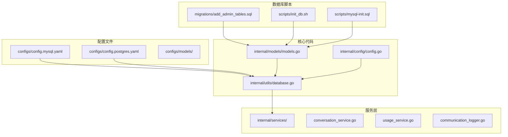
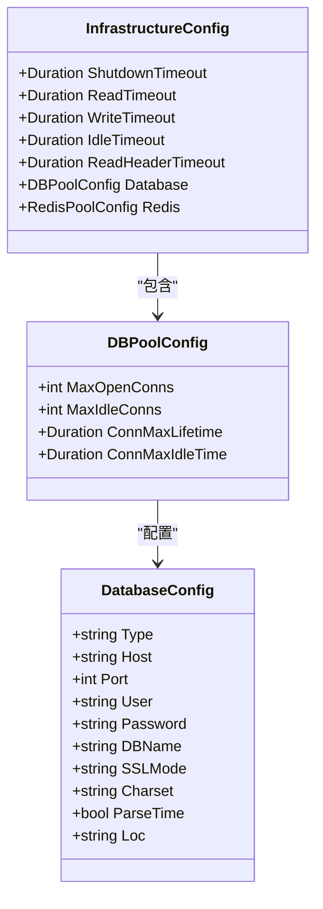
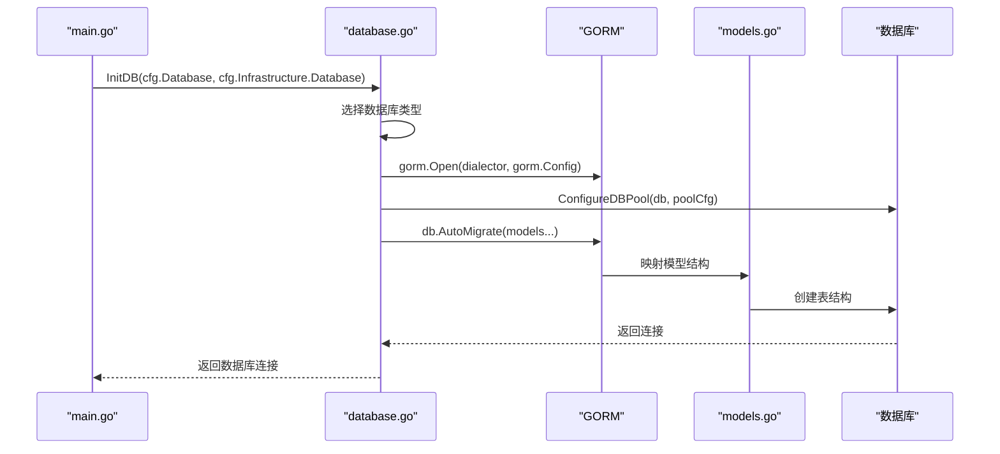
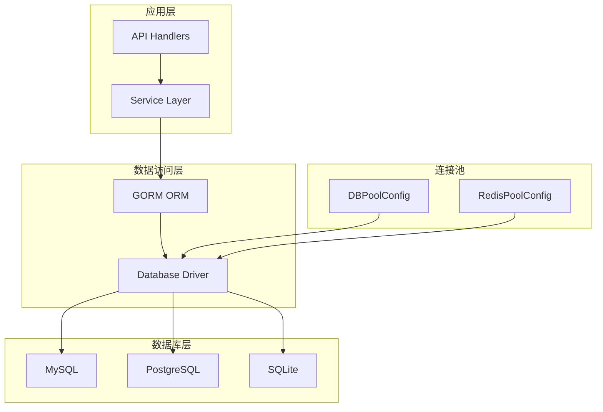
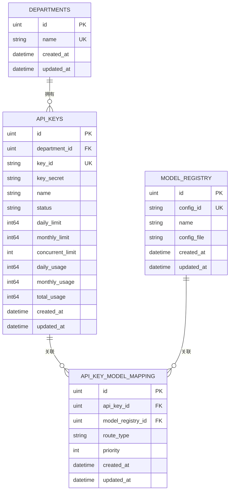
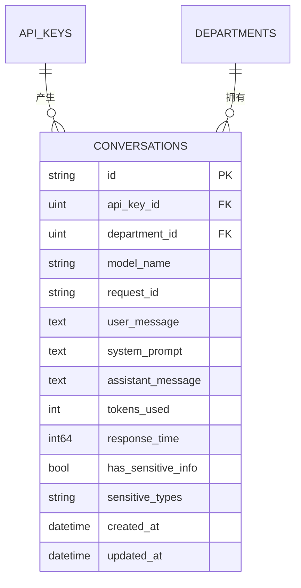
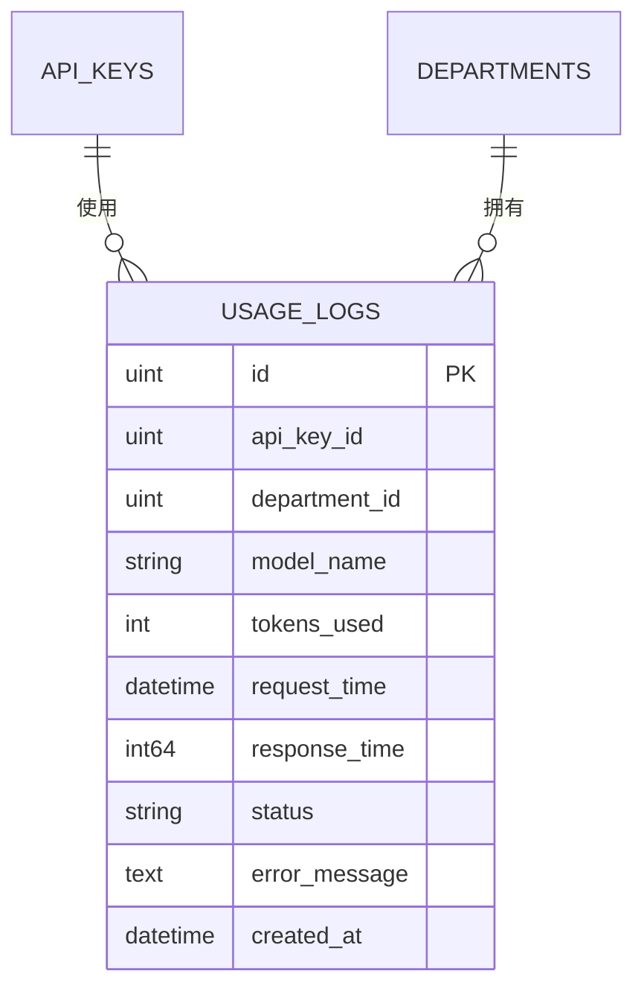
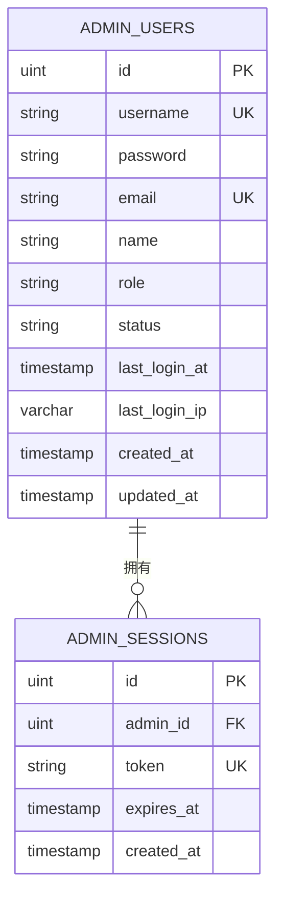
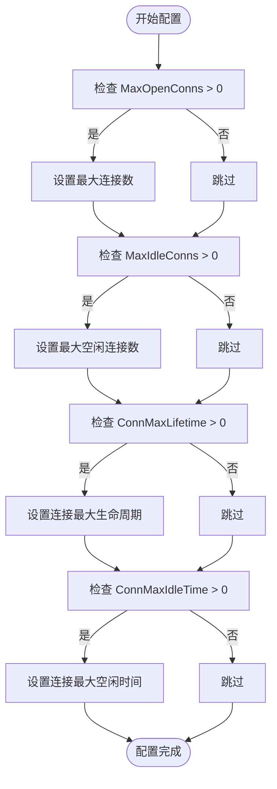
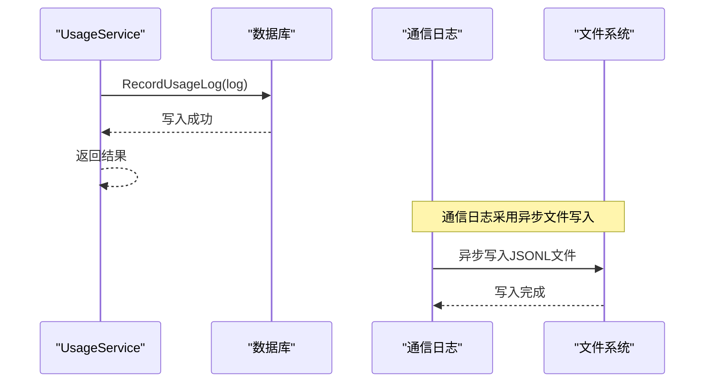

# 数据库模式设计

<cite>
**本文档引用的文件**
- [database.go](file://internal/utils/database.go)
- [models.go](file://internal/models/models.go)
- [config.go](file://internal/config/config.go)
- [add_admin_tables.sql](file://migrations/add_admin_tables.sql)
- [init_db.sh](file://scripts/init_db.sh)
- [mysql-init.sql](file://scripts/mysql-init.sql)
- [main.go](file://cmd/main.go)
- [conversation_service.go](file://internal/services/conversation_service.go)
- [usage_service.go](file://internal/services/usage_service.go)
- [communication_logger.go](file://internal/services/communication_logger.go)
- [config.mysql.yaml](file://configs/config.mysql.yaml)
- [config.postgres.yaml](file://configs/config.postgres.yaml)
</cite>

## 目录
1. [简介](#简介)
2. [项目结构](#项目结构)
3. [核心组件](#核心组件)
4. [架构概览](#架构概览)
5. [详细组件分析](#详细组件分析)
6. [依赖关系分析](#依赖关系分析)
7. [性能考虑](#性能考虑)
8. [故障排除指南](#故障排除指南)
9. [结论](#结论)

## 简介

Wolink-Core 是一个基于 GORM 的 AI 网关系统，采用 MySQL 和 PostgreSQL 两种数据库后端。该系统实现了完整的数据库模式设计，包括部门-API密钥-模型映射关系、对话记录表和使用日志表等核心业务表。本文档详细说明了数据库表结构、字段定义、主键外键约束和索引设计，并提供了完整的 ER 图和表关系图。

## 项目结构

Wolink-Core 的数据库相关代码主要分布在以下目录结构中：

**图表来源**
- [database.go:1-140](file://internal/utils/database.go#L1-L140)
- [models.go:1-463](file://internal/models/models.go#L1-L463)
- [config.go:1-185](file://internal/config/config.go#L1-L185)

**章节来源**
- [database.go:1-140](file://internal/utils/database.go#L1-L140)
- [models.go:1-463](file://internal/models/models.go#L1-L463)
- [config.go:1-185](file://internal/config/config.go#L1-L185)

## 核心组件

### 数据库连接池配置

系统支持多种数据库后端，包括 MySQL、PostgreSQL 和 SQLite。数据库连接池配置通过 `DBPoolConfig` 结构体实现：

**图表来源**
- [config.go:33-47](file://internal/config/config.go#L33-L47)
- [config.go:54-65](file://internal/config/config.go#L54-L65)
- [config.go:21-31](file://internal/config/config.go#L21-L31)

### 数据库初始化流程

数据库初始化通过 `InitDB` 函数完成，支持自动迁移功能：

**图表来源**
- [main.go:29-33](file://cmd/main.go#L29-L33)
- [database.go:77-122](file://internal/utils/database.go#L77-L122)

**章节来源**
- [database.go:77-122](file://internal/utils/database.go#L77-L122)
- [config.go:33-47](file://internal/config/config.go#L33-L47)

## 架构概览

Wolink-Core 采用分层架构设计，数据库层通过 GORM ORM 提供抽象，支持多种数据库后端：

**图表来源**
- [database.go:81-95](file://internal/utils/database.go#L81-L95)
- [config.go:33-47](file://internal/config/config.go#L33-L47)

## 详细组件分析

### 部门-API密钥-模型映射关系

系统实现了完整的部门-API密钥-模型映射关系，通过三个核心表实现：

**图表来源**
- [models.go:10-43](file://internal/models/models.go#L10-L43)
- [models.go:45-88](file://internal/models/models.go#L45-L88)

#### 部门表 (Departments)

部门表是系统的基础组织单位，每个部门可以拥有多个 API 密钥：

| 字段名 | 类型 | 约束 | 描述 |
|--------|------|------|------|
| id | uint | 主键 | 部门唯一标识符 |
| name | string | 唯一索引, 非空 | 部门名称 |
| created_at | time.Time | | 创建时间 |
| updated_at | time.Time | | 更新时间 |

#### API密钥表 (API Keys)

API 密钥表存储每个部门的密钥信息和使用限制：

| 字段名 | 类型 | 约束 | 描述 |
|--------|------|------|------|
| id | uint | 主键 | API密钥唯一标识符 |
| department_id | uint | 外键, 非空 | 关联的部门ID |
| key_id | string | 唯一索引, 非空 | 对外显示的密钥ID |
| key_secret | string | 非空 | 实际的密钥值 |
| name | string | | 密钥名称 |
| status | string | 默认值: 'active' | 状态: active/disabled |
| daily_limit | int64 | 默认值: 10000 | 每日调用限制 |
| monthly_limit | int64 | 默认值: 300000 | 每月调用限制 |
| concurrent_limit | int | 默认值: 10 | 并发限制 |
| daily_usage | int64 | 默认值: 0 | 当日使用量 |
| monthly_usage | int64 | 默认值: 0 | 当月使用量 |
| total_usage | int64 | 默认值: 0 | 总使用量 |
| created_at | time.Time | | 创建时间 |
| updated_at | time.Time | | 更新时间 |

#### 模型注册表 (Model Registry)

模型注册表存储配置文件映射关系：

| 字段名 | 类型 | 约束 | 描述 |
|--------|------|------|------|
| id | uint | 主键 | 模型注册唯一标识符 |
| config_id | string | 唯一索引, 非空 | 配置文件中的ID |
| name | string | 索引, 非空 | 模型名称 |
| config_file | string | 非空 | 配置文件名 |
| created_at | time.Time | | 创建时间 |
| updated_at | time.Time | | 更新时间 |

#### API密钥-模型映射表 (API Key Model Mapping)

映射表实现多对多关系：

| 字段名 | 类型 | 约束 | 描述 |
|--------|------|------|------|
| id | uint | 主键 | 映射关系唯一标识符 |
| api_key_id | uint | 外键, 非空, 索引 | 关联的API密钥ID |
| model_registry_id | uint | 外键, 非空, 索引 | 关联的模型ID |
| route_type | string | 默认值: 'random' | 路由类型: random/round_robin/weighted |
| priority | int | 默认值: 0 | 优先级 |
| created_at | time.Time | | 创建时间 |
| updated_at | time.Time | | 更新时间 |

**章节来源**
- [models.go:10-43](file://internal/models/models.go#L10-L43)
- [models.go:45-88](file://internal/models/models.go#L45-L88)

### 对话记录表 (Conversations)

对话记录表设计用于存储完整的对话历史：

**图表来源**
- [models.go:90-116](file://internal/models/models.go#L90-L116)

#### 对话记录表字段定义

| 字段名 | 类型 | 约束 | 描述 |
|--------|------|------|------|
| id | string | 主键 | UUID格式的对话ID |
| api_key_id | uint | 外键, 非空 | 关联的API密钥ID |
| department_id | uint | 外键, 非空 | 关联的部门ID |
| model_name | string | 非空 | 使用的模型名称 |
| request_id | string | 索引 | 请求ID |
| user_message | text | | 用户消息内容 |
| system_prompt | text | | 系统提示词 |
| assistant_message | text | | 助手回复内容 |
| tokens_used | int | | 使用的token数量 |
| response_time | int64 | | 响应时间(毫秒) |
| has_sensitive_info | bool | 默认值: false | 是否包含敏感信息 |
| sensitive_types | string | | 敏感信息类型(JSON数组) |
| created_at | time.Time | 索引 | 创建时间 |
| updated_at | time.Time | | 更新时间 |

**注意**: 对话记录表使用 UUID 作为主键，通过 GORM 的 `BeforeCreate` 回调自动生成。

**章节来源**
- [models.go:90-116](file://internal/models/models.go#L90-L116)
- [models.go:190-196](file://internal/models/models.go#L190-L196)

### 使用日志表 (Usage Logs)

使用日志表采用异步写入机制：

**图表来源**
- [models.go:118-131](file://internal/models/models.go#L118-L131)

#### 使用日志表字段定义

| 字段名 | 类型 | 约定 | 描述 |
|--------|------|------|------|
| id | uint | 主键 | 日志记录唯一标识符 |
| api_key_id | uint | 索引 | 关联的API密钥ID |
| department_id | uint | 索引 | 关联的部门ID |
| model_name | string | 索引 | 使用的模型名称 |
| tokens_used | int | | 使用的token数量 |
| request_time | time.Time | 索引 | 请求时间 |
| response_time | int64 | | 响应时间(毫秒) |
| status | string | | 状态: success/error |
| error_message | text | | 错误信息 |
| created_at | time.Time | | 创建时间 |

**章节来源**
- [models.go:118-131](file://internal/models/models.go#L118-L131)

### 管理员系统表

系统还包含完整的管理员用户和会话管理功能：

**图表来源**
- [models.go:133-160](file://internal/models/models.go#L133-L160)

**章节来源**
- [models.go:133-160](file://internal/models/models.go#L133-L160)

## 依赖关系分析

### 数据库连接池配置

系统通过 `ConfigureDBPool` 函数配置数据库连接池：

**图表来源**
- [database.go:22-42](file://internal/utils/database.go#L22-L42)

### 异步日志写入机制

使用日志表采用异步写入机制，通过 `UsageService` 实现：

**图表来源**
- [usage_service.go:49-52](file://internal/services/usage_service.go#L49-L52)

**章节来源**
- [database.go:22-42](file://internal/utils/database.go#L22-L42)
- [usage_service.go:49-52](file://internal/services/usage_service.go#L49-L52)

## 性能考虑

### 索引设计策略

系统在关键字段上建立了适当的索引以优化查询性能：

1. **部门-API密钥-模型映射表索引**：
   - `api_key_id` 索引：支持按API密钥查询
   - `model_registry_id` 索引：支持按模型查询

2. **对话记录表索引**：
   - `created_at` 索引：支持时间范围查询
   - `request_id` 索引：支持按请求ID查询

3. **使用日志表索引**：
   - `api_key_id` 索引：支持按API密钥统计
   - `department_id` 索引：支持按部门统计
   - `model_name` 索引：支持按模型统计
   - `request_time` 索引：支持时间范围查询

### 连接池配置建议

根据系统默认配置，推荐的连接池参数：

| 参数 | MySQL | PostgreSQL | 说明 |
|------|-------|------------|------|
| MaxOpenConns | 25 | 25 | 最大连接数 |
| MaxIdleConns | 10 | 10 | 最大空闲连接数 |
| ConnMaxLifetime | 5分钟 | 5分钟 | 连接最大生命周期 |
| ConnMaxIdleTime | 无限制 | 无限制 | 连接最大空闲时间 |

### 查询优化策略

1. **批量查询优化**：
   - 使用 `Where().Order().Limit()` 组合进行高效查询
   - 避免 N+1 查询问题，使用预加载关联数据

2. **索引使用建议**：
   - 对频繁查询的字段建立适当索引
   - 考虑复合索引优化复杂查询条件

3. **缓存策略**：
   - 使用 Redis 缓存 API 密钥可用模型列表
   - 缓存有效期设置为 5 分钟

**章节来源**
- [conversation_service.go:29-48](file://internal/services/conversation_service.go#L29-L48)
- [config.go:175-183](file://internal/config/config.go#L175-L183)

## 故障排除指南

### 数据库连接问题

常见数据库连接问题及解决方案：

1. **连接超时**：
   - 检查 `ConnMaxLifetime` 配置
   - 调整连接池大小参数

2. **连接数不足**：
   - 增加 `MaxOpenConns` 数值
   - 检查应用程序并发需求

3. **字符集问题**：
   - 确保 MySQL 使用 `utf8mb4` 字符集
   - 检查 PostgreSQL 的 `LC_COLLATE` 设置

### 数据迁移问题

1. **自动迁移失败**：
   - 检查数据库权限
   - 确认表结构兼容性

2. **索引创建失败**：
   - 检查字段长度限制
   - 验证唯一约束冲突

### 性能问题诊断

1. **慢查询识别**：
   - 使用数据库慢查询日志
   - 分析执行计划

2. **内存使用监控**：
   - 监控连接池使用情况
   - 检查查询缓存效果

**章节来源**
- [database.go:109-119](file://internal/utils/database.go#L109-L119)
- [init_db.sh:1-46](file://scripts/init_db.sh#L1-L46)

## 结论

Wolink-Core 的数据库模式设计体现了现代 Web 应用的最佳实践：

1. **清晰的三层架构**：通过 GORM ORM 提供数据库抽象，支持多种数据库后端
2. **完善的索引策略**：针对核心查询场景建立了适当的索引
3. **异步处理机制**：使用日志表和通信日志实现异步写入
4. **灵活的配置管理**：支持环境变量和配置文件的灵活配置
5. **完整的管理员系统**：提供完整的用户认证和授权功能

该设计为 AI 网关系统的高可用性和高性能提供了坚实的数据库基础，同时保持了良好的可维护性和扩展性。