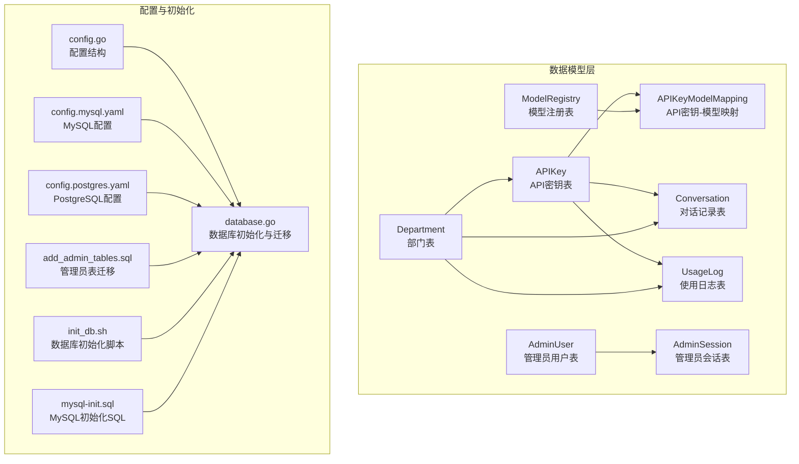
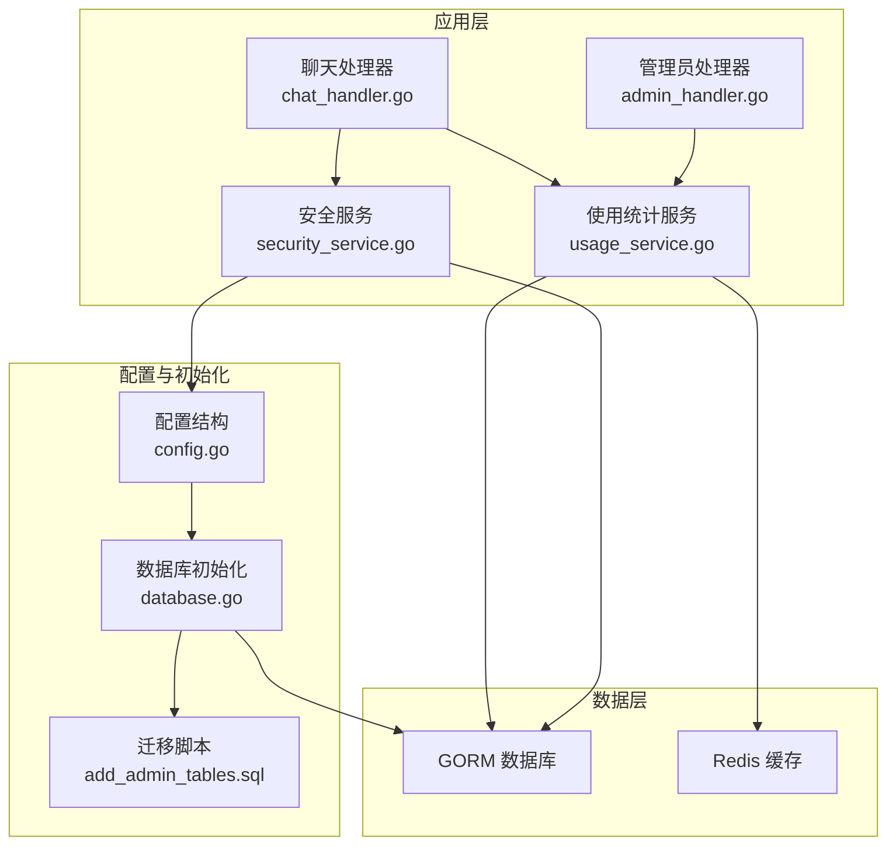
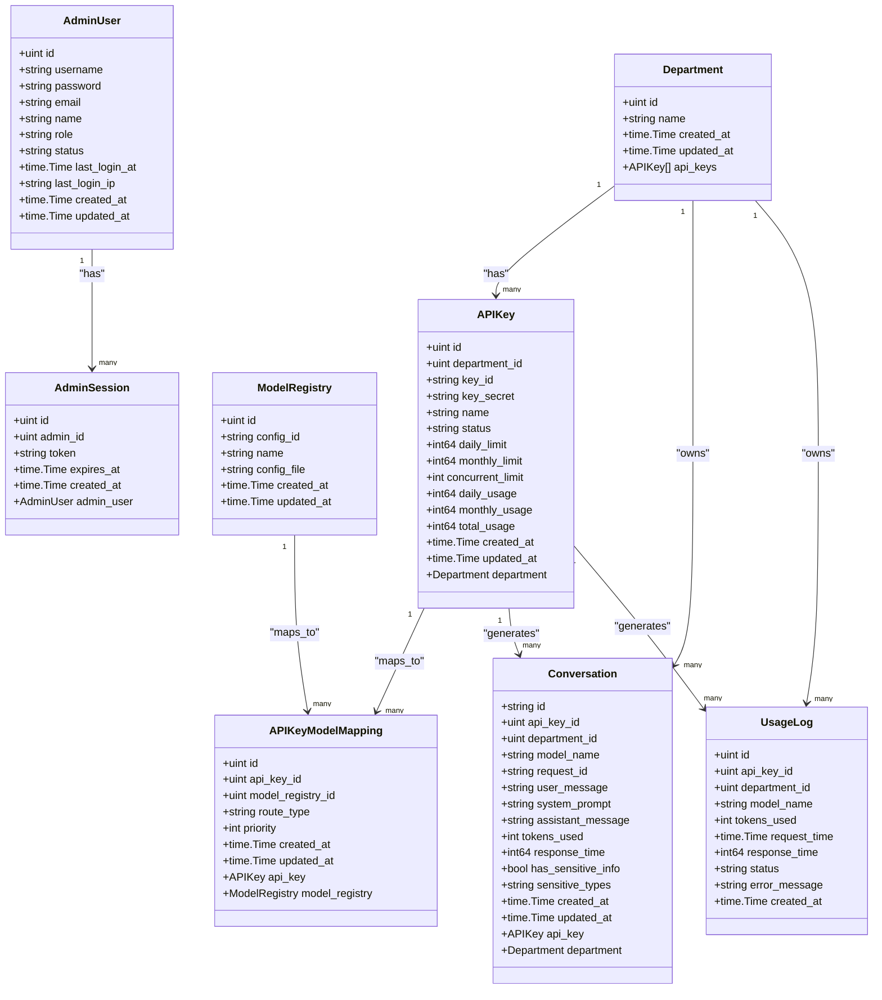
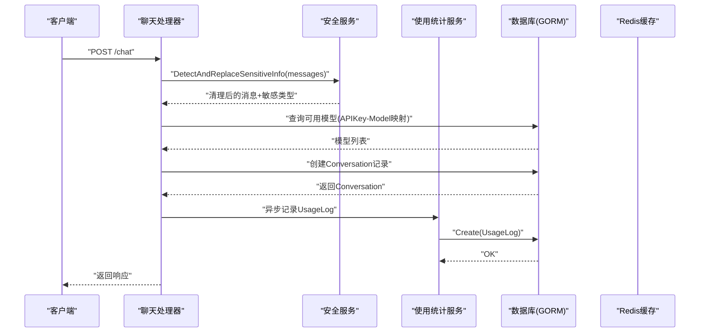
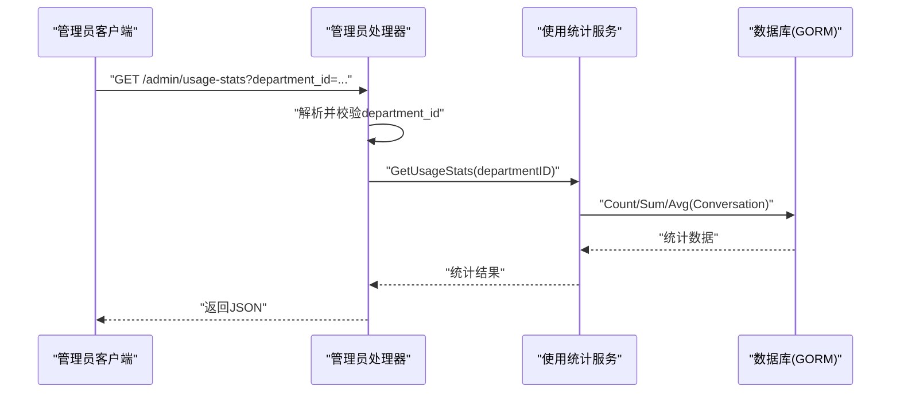
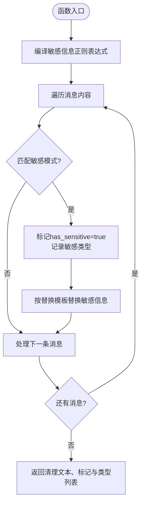
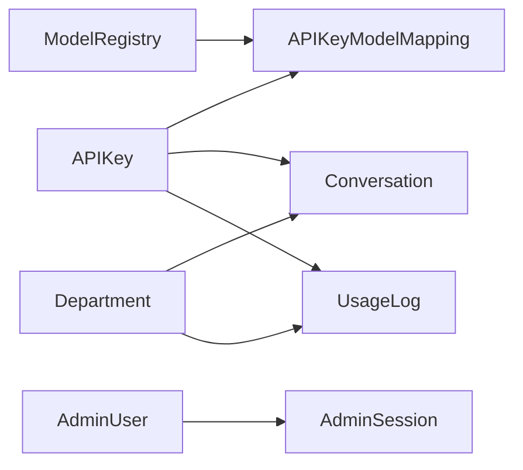
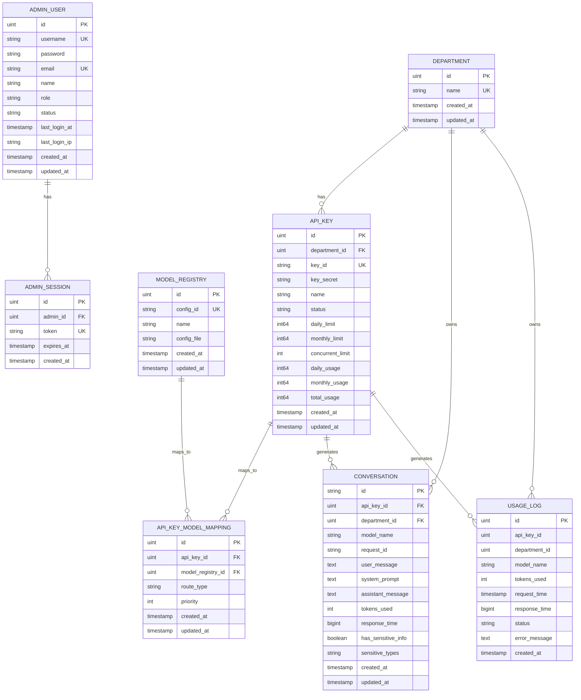

# 数据模型设计

<cite>
**本文引用的文件**
- [internal/models/models.go](file://internal/models/models.go)
- [migrations/add_admin_tables.sql](file://migrations/add_admin_tables.sql)
- [internal/utils/database.go](file://internal/utils/database.go)
- [internal/config/config.go](file://internal/config/config.go)
- [configs/config.mysql.yaml](file://configs/config.mysql.yaml)
- [configs/config.postgres.yaml](file://configs/config.postgres.yaml)
- [internal/services/usage_service.go](file://internal/services/usage_service.go)
- [internal/services/security_service.go](file://internal/services/security_service.go)
- [internal/api/handlers/chat_handler.go](file://internal/api/handlers/chat_handler.go)
- [internal/api/handlers/admin_handler.go](file://internal/api/handlers/admin_handler.go)
- [internal/testutil/mocks/db.go](file://internal/testutil/mocks/db.go)
- [scripts/init_db.sh](file://scripts/init_db.sh)
- [scripts/mysql-init.sql](file://scripts/mysql-init.sql)
</cite>

## 目录
1. [简介](#简介)
2. [项目结构](#项目结构)
3. [核心组件](#核心组件)
4. [架构概览](#架构概览)
5. [详细组件分析](#详细组件分析)
6. [依赖关系分析](#依赖关系分析)
7. [性能考量](#性能考量)
8. [故障排除指南](#故障排除指南)
9. [结论](#结论)
10. [附录](#附录)

## 简介
本文件为 Wolink-Core 的数据模型设计文档，聚焦于数据库实体关系、字段定义、数据类型与约束、索引设计、业务规则、数据访问模式、缓存策略、性能考虑、数据生命周期与保留策略、迁移路径与版本管理策略，以及数据安全与隐私保护。文档基于代码库中的实际实现进行梳理，并通过图表直观展示实体关系与数据流。

## 项目结构
Wolink-Core 的数据模型主要集中在 internal/models 目录中，配合数据库初始化、配置与迁移脚本，形成完整的数据层基础设施。关键文件包括：
- 数据模型定义：internal/models/models.go
- 数据库初始化与自动迁移：internal/utils/database.go
- 配置文件（MySQL/PostgreSQL）：configs/config.mysql.yaml、configs/config.postgres.yaml
- 管理员表迁移：migrations/add_admin_tables.sql
- 安全与隐私配置：internal/config/config.go 中的 SecurityConfig
- 使用统计与敏感信息处理：internal/services/usage_service.go、internal/services/security_service.go
- 数据库初始化脚本：scripts/init_db.sh、scripts/mysql-init.sql

**图表来源**
- [internal/models/models.go:10-160](file://internal/models/models.go#L10-L160)
- [internal/utils/database.go:73-122](file://internal/utils/database.go#L73-L122)
- [configs/config.mysql.yaml:1-37](file://configs/config.mysql.yaml#L1-L37)
- [configs/config.postgres.yaml:1-35](file://configs/config.postgres.yaml#L1-L35)
- [migrations/add_admin_tables.sql:1-38](file://migrations/add_admin_tables.sql#L1-L38)
- [scripts/init_db.sh:1-46](file://scripts/init_db.sh#L1-L46)
- [scripts/mysql-init.sql:1-32](file://scripts/mysql-init.sql#L1-L32)

**章节来源**
- [internal/models/models.go:10-160](file://internal/models/models.go#L10-L160)
- [internal/utils/database.go:73-122](file://internal/utils/database.go#L73-L122)
- [configs/config.mysql.yaml:1-37](file://configs/config.mysql.yaml#L1-L37)
- [configs/config.postgres.yaml:1-35](file://configs/config.postgres.yaml#L1-L35)
- [migrations/add_admin_tables.sql:1-38](file://migrations/add_admin_tables.sql#L1-L38)
- [scripts/init_db.sh:1-46](file://scripts/init_db.sh#L1-L46)
- [scripts/mysql-init.sql:1-32](file://scripts/mysql-init.sql#L1-L32)

## 核心组件
本节对核心数据模型进行深入分析，涵盖字段定义、数据类型、约束条件、索引与关系。

- Department（部门表）
  - 字段与约束：主键 ID；唯一索引 Name；CreatedAt/UpdatedAt 时间戳
  - 关系：一对多 APIKeys
  - 复杂度：查询按 Name 唯一性约束，插入/更新 O(1) 哈希查找

- APIKey（API密钥表）
  - 字段与约束：主键 ID；非空 DepartmentID；唯一 KeyID；KeySecret 不对外返回；可选 Name；状态 Status 默认 active；使用限制 DailyLimit/MonthlyLimit/ConcurrentLimit；使用统计 DailyUsage/MonthlyUsage/TotalUsage；CreatedAt/UpdatedAt
  - 关系：多对一 Department；多对多通过 APIKeyModelMapping 与 ModelRegistry 关联
  - 索引：KeyID 唯一索引；DepartmentID 普通索引（GORM 注解）
  - 复杂度：校验 APIKey 时按 KeyID 查询，O(log N)；并发控制与限额检查 O(1)

- ModelRegistry（模型注册表）
  - 字段与约束：主键 ID；唯一 ConfigID；非空 Name；非空 ConfigFile；CreatedAt/UpdatedAt
  - 关系：多对一 APIKeyModelMapping
  - 索引：ConfigID 唯一索引；Name 普通索引（GORM 注解）

- APIKeyModelMapping（API密钥-模型映射）
  - 字段与约束：主键 ID；非空 APIKeyID 与 ModelRegistryID；路由类型 RouteType 默认 random；Priority 默认 0；CreatedAt/UpdatedAt
  - 关系：多对一 APIKey、ModelRegistry
  - 索引：APIKeyID、ModelRegistryID 普通索引（GORM 注解）

- Conversation（对话记录表）
  - 字段与约束：主键 ID（UUID 字符串）；非空 APIKeyID、DepartmentID、ModelName；可选 RequestID（索引）；UserMessage/SystemPrompt 文本；AssistantMessage 文本；TokensUsed、ResponseTime；敏感信息标记 HasSensitiveInfo 与敏感类型 SensitiveTypes；CreatedAt（索引）、UpdatedAt
  - 关系：多对一 APIKey、Department
  - 索引：RequestID、CreatedAt（GORM 注解），便于按部门/时间检索
  - 复杂度：插入 O(1)，查询按索引 O(log N)

- UsageLog（使用日志表）
  - 字段与约束：主键 ID；APIKeyID（索引）、DepartmentID（索引）、ModelName（索引）；TokensUsed、RequestTime（索引）、ResponseTime、Status、ErrorMessage；CreatedAt
  - 关系：异步记录，与 Conversation 解耦
  - 索引：多字段组合索引，支持按部门/模型/时间范围查询

- AdminUser（管理员用户表）
  - 字段与约束：主键 ID；唯一 Username；非空 Password；可选 Email（唯一）；非空 Name；Role 默认 admin；Status 默认 active；最后登录 LastLoginAt/IP；CreatedAt/UpdatedAt
  - 索引：Username、Email、Status、Role（迁移脚本添加）
  - 复杂度：登录校验按 Username 唯一索引 O(log N)

- AdminSession（管理员会话表）
  - 字段与约束：主键 ID；非空 AdminID（索引）；唯一 Token；ExpiresAt（索引）；CreatedAt
  - 关系：多对一 AdminUser
  - 索引：AdminID、Token、ExpiresAt（迁移脚本添加）

**章节来源**
- [internal/models/models.go:10-160](file://internal/models/models.go#L10-L160)
- [migrations/add_admin_tables.sql:1-38](file://migrations/add_admin_tables.sql#L1-L38)

## 架构概览
Wolink-Core 的数据层采用 GORM ORM，支持 MySQL 与 PostgreSQL，自动迁移核心表。Redis 作为缓存层用于 APIKey 校验与速率限制等高频场景。安全模块负责敏感信息检测与替换，通信日志可选持久化。

**图表来源**
- [internal/api/handlers/chat_handler.go:72-98](file://internal/api/handlers/chat_handler.go#L72-L98)
- [internal/api/handlers/admin_handler.go:199-250](file://internal/api/handlers/admin_handler.go#L199-L250)
- [internal/services/usage_service.go:25-52](file://internal/services/usage_service.go#L25-L52)
- [internal/services/security_service.go:29-59](file://internal/services/security_service.go#L29-L59)
- [internal/utils/database.go:73-122](file://internal/utils/database.go#L73-L122)
- [internal/config/config.go:78-82](file://internal/config/config.go#L78-L82)
- [migrations/add_admin_tables.sql:1-38](file://migrations/add_admin_tables.sql#L1-L38)

## 详细组件分析

### 数据模型类图

**图表来源**
- [internal/models/models.go:10-160](file://internal/models/models.go#L10-L160)

**章节来源**
- [internal/models/models.go:10-160](file://internal/models/models.go#L10-L160)

### 数据访问流程（对话创建与敏感信息处理）

**图表来源**
- [internal/api/handlers/chat_handler.go:72-98](file://internal/api/handlers/chat_handler.go#L72-L98)
- [internal/services/security_service.go:29-59](file://internal/services/security_service.go#L29-L59)
- [internal/services/usage_service.go:49-52](file://internal/services/usage_service.go#L49-L52)

**章节来源**
- [internal/api/handlers/chat_handler.go:72-98](file://internal/api/handlers/chat_handler.go#L72-L98)
- [internal/services/security_service.go:29-59](file://internal/services/security_service.go#L29-L59)
- [internal/services/usage_service.go:49-52](file://internal/services/usage_service.go#L49-L52)

### 管理端使用统计查询流程

**图表来源**
- [internal/api/handlers/admin_handler.go:199-220](file://internal/api/handlers/admin_handler.go#L199-L220)
- [internal/services/usage_service.go:25-47](file://internal/services/usage_service.go#L25-L47)

**章节来源**
- [internal/api/handlers/admin_handler.go:199-220](file://internal/api/handlers/admin_handler.go#L199-L220)
- [internal/services/usage_service.go:25-47](file://internal/services/usage_service.go#L25-L47)

### 算法流程（敏感信息检测与替换）

**图表来源**
- [internal/services/security_service.go:29-59](file://internal/services/security_service.go#L29-L59)

**章节来源**
- [internal/services/security_service.go:29-59](file://internal/services/security_service.go#L29-L59)

## 依赖关系分析
- 组件耦合
  - Conversation 与 APIKey/Department 强关联，通过外键约束保证数据一致性
  - APIKey 与 ModelRegistry 通过 APIKeyModelMapping 解耦，支持多对多路由策略
  - UsageLog 与 Conversation 解耦，异步写入，降低写放大
- 外部依赖
  - GORM ORM 支持 MySQL/PostgreSQL/SQLite
  - Redis 用于 APIKey 校验缓存与速率限制
  - Viper 配置管理

**图表来源**
- [internal/models/models.go:10-160](file://internal/models/models.go#L10-L160)

**章节来源**
- [internal/models/models.go:10-160](file://internal/models/models.go#L10-L160)

## 性能考量
- 连接池配置
  - 数据库连接池：最大打开连接数、最大空闲连接数、连接最大生命周期、空闲连接最大生命周期
  - Redis 连接池：池大小、最小空闲连接数、连接最大生命周期、池超时
- 索引设计
  - Conversation：RequestID、CreatedAt 索引；DepartmentID/ApiKeyID 可在需要时补充复合索引
  - UsageLog：DepartmentID、ModelName、RequestTime 复合索引
  - AdminUser/AdminSession：按查询模式建立的索引
- 缓存策略
  - APIKey 校验命中缓存，避免频繁数据库查询
  - 使用统计与会话信息可短期缓存
- 写入优化
  - UsageLog 异步写入，减少主路径阻塞
  - 批量操作与事务合并（如需）

**章节来源**
- [internal/utils/database.go:19-42](file://internal/utils/database.go#L19-L42)
- [internal/config/config.go:33-47](file://internal/config/config.go#L33-L47)
- [internal/services/usage_service.go:49-52](file://internal/services/usage_service.go#L49-L52)

## 故障排除指南
- 数据库连接失败
  - 检查配置文件中的数据库类型、主机、端口、用户名、密码
  - 使用初始化脚本创建数据库并执行迁移
- 迁移失败
  - 确认 GORM AutoMigrate 是否包含目标模型
  - 检查数据库权限与字符集设置
- 缓存未生效
  - 确认 Redis 配置与连接成功
  - 检查 APIKey 缓存键格式与 TTL
- 敏感信息未被替换
  - 检查配置中的敏感模式与替换模板是否正确
  - 确认正则表达式编译与匹配逻辑

**章节来源**
- [internal/utils/database.go:73-122](file://internal/utils/database.go#L73-L122)
- [scripts/init_db.sh:1-46](file://scripts/init_db.sh#L1-L46)
- [internal/config/config.go:78-82](file://internal/config/config.go#L78-L82)

## 结论
Wolink-Core 的数据模型围绕“部门-密钥-模型-对话-日志”构建，通过 GORM 自动迁移与 Redis 缓存实现高可用与高性能。管理员表独立迁移，配合严格的索引与连接池配置，满足生产环境需求。敏感信息检测与替换机制保障隐私合规。建议后续根据业务增长增加复合索引与分区策略，持续优化查询性能。

## 附录

### 数据库模式图（ER）

**图表来源**
- [internal/models/models.go:10-160](file://internal/models/models.go#L10-L160)
- [migrations/add_admin_tables.sql:1-38](file://migrations/add_admin_tables.sql#L1-L38)

### 数据验证与业务规则
- 输入验证
  - 登录请求：用户名长度、密码长度
  - 创建管理员请求：用户名字母数字、密码长度、邮箱格式、角色枚举
  - 修改密码请求：旧密码与新密码长度
- 业务规则
  - APIKey 状态必须为 active 才能使用
  - 日/月限额与并发限制在缓存与数据库中双重校验
  - 敏感信息检测后替换并记录敏感类型
  - 对话记录自动生成 UUID 主键

**章节来源**
- [internal/models/models.go:162-181](file://internal/models/models.go#L162-L181)

### 数据生命周期与保留策略
- 对话记录与使用日志
  - 建议按部门维度设置保留周期（例如 90 天），到期后归档或删除
  - 归档前导出统计报表，保留必要的聚合指标
- 管理员会话
  - 过期时间到期后自动清理，避免长期有效令牌风险
- 配置与元数据
  - 模型注册表与映射关系变更需版本化管理，保留历史配置以便回滚

[本节为通用建议，无需特定文件引用]

### 数据迁移路径与版本管理
- 迁移策略
  - 使用 GORM AutoMigrate 与 SQL 迁移脚本结合
  - 新增表或索引时先在测试环境验证，再灰度发布
- 版本管理
  - 配置文件与迁移脚本纳入版本控制
  - 数据库版本与应用版本保持一致，发布前执行迁移

**章节来源**
- [internal/utils/database.go:109-119](file://internal/utils/database.go#L109-L119)
- [migrations/add_admin_tables.sql:1-38](file://migrations/add_admin_tables.sql#L1-L38)

### 数据安全与隐私
- 敏感信息检测
  - 正则模式与替换模板可配置，支持手机号、身份证号、银行卡号
- 存储安全
  - 密码使用哈希存储，管理员会话 Token 哈希存储
- 访问控制
  - 管理员角色分级（admin、super_admin、operator），权限最小化
  - 会话过期与 IP 绑定增强安全性

**章节来源**
- [internal/config/config.go:78-82](file://internal/config/config.go#L78-L82)
- [migrations/add_admin_tables.sql:1-38](file://migrations/add_admin_tables.sql#L1-L38)