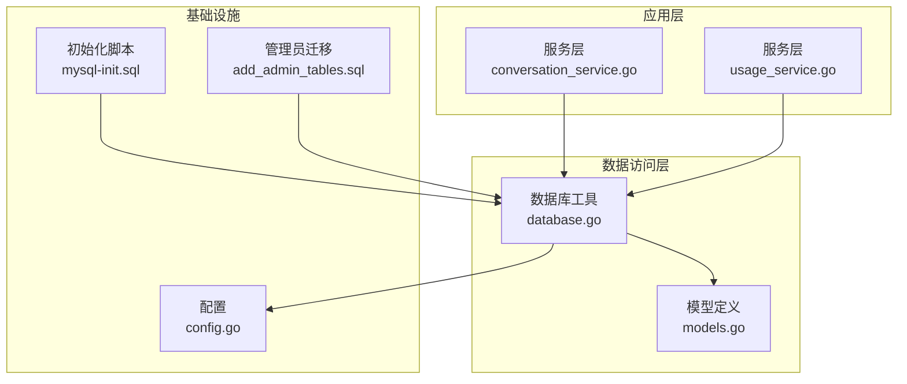
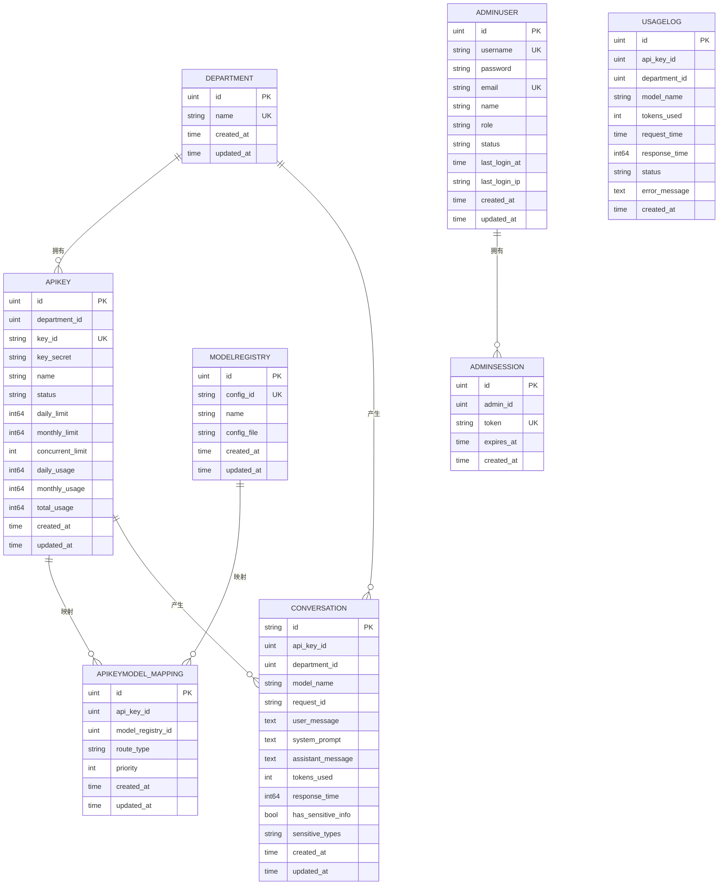
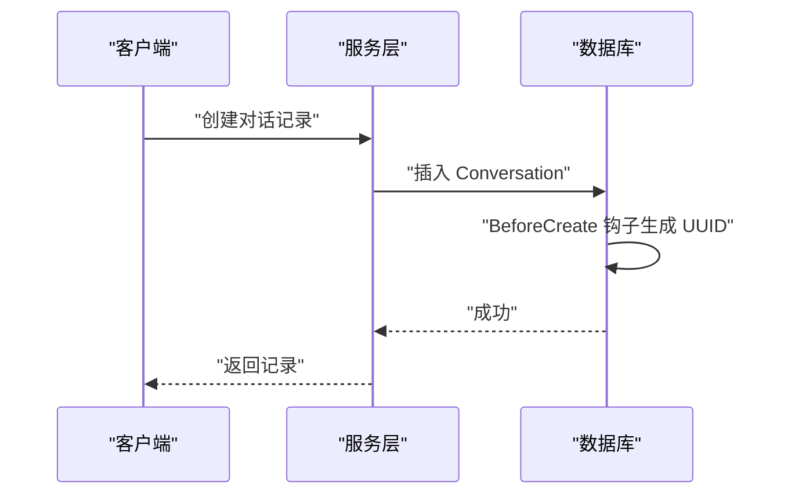
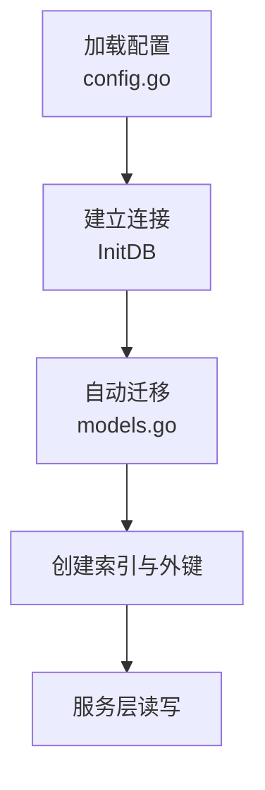

# 核心数据模型

<cite>
**本文引用的文件**
- [internal/models/models.go](file://internal/models/models.go)
- [internal/utils/database.go](file://internal/utils/database.go)
- [internal/config/config.go](file://internal/config/config.go)
- [internal/services/conversation_service.go](file://internal/services/conversation_service.go)
- [internal/services/usage_service.go](file://internal/services/usage_service.go)
- [internal/models/validation_test.go](file://internal/models/validation_test.go)
- [migrations/add_admin_tables.sql](file://migrations/add_admin_tables.sql)
- [scripts/mysql-init.sql](file://scripts/mysql-init.sql)
- [configs/models/qwen3-chat.yaml](file://configs/models/qwen3-chat.yaml)
- [configs/templates/gpt-4.yaml](file://configs/templates/gpt-4.yaml)
</cite>

## 目录
1. [简介](#简介)
2. [项目结构](#项目结构)
3. [核心组件](#核心组件)
4. [架构总览](#架构总览)
5. [详细组件分析](#详细组件分析)
6. [依赖分析](#依赖分析)
7. [性能考量](#性能考量)
8. [故障排查指南](#故障排查指南)
9. [结论](#结论)
10. [附录](#附录)

## 简介
本文件面向 Wolink-Core 的核心数据模型，系统化梳理 Department、APIKey、Conversation、ModelRegistry、APIKeyModelMapping、UsageLog、AdminUser、AdminSession 等实体的字段定义、数据类型、约束条件、GORM 标签配置、业务用途、关系映射、索引设计与性能优化，并补充 UUID 自动生成机制、时间戳管理、软删除策略等实现细节。同时给出数据库表结构示例与字段约束说明，帮助开发者快速理解并正确使用这些模型。

## 项目结构
Wolink-Core 的数据模型集中于 internal/models/models.go，数据库初始化与自动迁移在 internal/utils/database.go 中完成；管理员相关表结构在 migrations/add_admin_tables.sql 中定义；数据库初始化脚本位于 scripts/mysql-init.sql；模型配置文件位于 configs/models 与 configs/templates。

**图表来源**
- [internal/utils/database.go:77-122](file://internal/utils/database.go#L77-L122)
- [internal/models/models.go:10-160](file://internal/models/models.go#L10-L160)
- [internal/config/config.go:54-65](file://internal/config/config.go#L54-L65)
- [scripts/mysql-init.sql:1-32](file://scripts/mysql-init.sql#L1-L32)
- [migrations/add_admin_tables.sql:1-38](file://migrations/add_admin_tables.sql#L1-L38)

**章节来源**
- [internal/models/models.go:10-160](file://internal/models/models.go#L10-L160)
- [internal/utils/database.go:77-122](file://internal/utils/database.go#L77-L122)
- [internal/config/config.go:54-65](file://internal/config/config.go#L54-L65)
- [scripts/mysql-init.sql:1-32](file://scripts/mysql-init.sql#L1-L32)
- [migrations/add_admin_tables.sql:1-38](file://migrations/add_admin_tables.sql#L1-L38)

## 核心组件
本节对核心实体进行逐项说明，包括字段定义、数据类型、约束、GORM 标签、业务用途、关系映射、索引与性能优化建议。

- Department（部门）
  - 字段与类型：自增主键、名称（唯一索引、非空）、创建/更新时间
  - 约束：名称唯一且非空；支持软删除（通过 GORM 标签控制）
  - 关系：一对多关联 APIKey
  - 索引：名称唯一索引
  - 性能：唯一索引加速按名称查询

- APIKey（部门 API 密钥）
  - 字段与类型：自增主键、部门ID（非空）、密钥对外标识（唯一索引、非空）、密钥实际值（非空，不返回前端）、名称、状态（默认 active）
  - 限额：日调用上限、月调用上限、并发上限（默认值）
  - 统计：日使用量、月使用量、总使用量（默认 0）
  - 时间戳：创建/更新时间
  - 关系：属于 Department；多对多通过 APIKeyModelMapping 关联 ModelRegistry
  - 索引：DepartmentID、KeyID 唯一索引
  - 性能：KeyID 唯一索引支持快速鉴权查找

- ModelRegistry（模型注册表）
  - 字段与类型：自增主键、配置 ID（唯一索引、非空）、模型名称（索引、非空）、配置文件名（非空）
  - 时间戳：创建/更新时间
  - 关系：多对多通过 APIKeyModelMapping 关联 APIKey
  - 索引：配置 ID 唯一索引、模型名称索引
  - 性能：唯一索引保证配置一致性，名称索引支持按模型名检索

- APIKeyModelMapping（API 密钥与模型映射）
  - 字段与类型：自增主键、APIKeyID（非空，索引）、ModelRegistryID（非空，索引）、路由类型（默认 random）、优先级（默认 0）
  - 时间戳：创建/更新时间
  - 关系：属于 APIKey、ModelRegistry
  - 索引：APIKeyID、ModelRegistryID
  - 性能：复合索引支持按 APIKey 或模型快速筛选

- Conversation（对话记录）
  - 字段与类型：字符串主键（UUID）、APIKeyID（非空）、部门ID（非空）、模型名（非空）、请求ID（索引）、用户消息（文本）、系统提示（文本）、助手消息（文本）、Token 使用量、响应时间（毫秒）、是否含敏感信息（默认 false）、敏感类型列表（JSON 存储，非空）、创建/更新时间（索引）
  - 关系：属于 APIKey、Department
  - 索引：请求ID、创建时间、APIKeyID、部门ID（通过 GORM 标签或迁移脚本）
  - 性能：UUID 主键避免热点；按部门/时间复合索引支持分页与统计

- UsageLog（使用日志）
  - 字段与类型：自增主键、APIKeyID（索引）、部门ID（索引）、模型名（索引）、Token 使用量、请求时间（索引）、响应时间（毫秒）、状态（success/error）、错误信息（文本）
  - 时间戳：创建时间
  - 关系：无外键关系（异步记录）
  - 索引：APIKeyID、部门ID、模型名、请求时间
  - 性能：异步写入，避免阻塞主流程

- AdminUser（管理员用户）
  - 字段与类型：自增主键、用户名（唯一索引、非空）、密码哈希（非空，不返回前端）、邮箱（唯一索引）、姓名、角色（默认 admin）、状态（默认 active）、最后登录时间、最后登录 IP、创建/更新时间
  - 关系：一对多关联 AdminSession
  - 索引：用户名、邮箱、状态、角色（迁移脚本中定义）
  - 性能：唯一索引加速登录与去重

- AdminSession（管理员会话）
  - 字段与类型：自增主键、管理员ID（非空，索引）、Token 哈希（唯一索引、非空）、过期时间（索引）、创建时间
  - 关系：属于 AdminUser
  - 索引：管理员ID、Token、过期时间
  - 性能：索引支持快速校验与清理

**章节来源**
- [internal/models/models.go:10-160](file://internal/models/models.go#L10-L160)

## 架构总览
下图展示核心模型之间的关系与依赖：

**图表来源**
- [internal/models/models.go:10-160](file://internal/models/models.go#L10-L160)

## 详细组件分析

### Department（部门）
- 业务用途：组织与权限边界，承载多个 APIKey
- 字段与约束：
  - 名称唯一且非空，适合按名称快速定位
  - 支持软删除（GORM 默认行为）
- 关系：一对多 APIKey
- 索引：名称唯一索引
- 性能：唯一索引提升查询与去重效率

**章节来源**
- [internal/models/models.go:10-18](file://internal/models/models.go#L10-L18)

### APIKey（部门 API 密钥）
- 业务用途：用于鉴权与配额控制，绑定部门与模型
- 字段与约束：
  - KeyID 唯一索引，便于快速鉴权
  - 状态枚举（active/disabled），默认 active
  - 日/月/并发限额与使用量统计，默认值便于开箱即用
- 关系：属于 Department；通过 APIKeyModelMapping 多对多关联 ModelRegistry
- 索引：KeyID 唯一索引、DepartmentID
- 性能：唯一索引支撑高频鉴权场景

**章节来源**
- [internal/models/models.go:20-43](file://internal/models/models.go#L20-L43)

### ModelRegistry（模型注册表）
- 业务用途：记录可用模型与其配置文件映射
- 字段与约束：
  - ConfigID 唯一索引，确保配置一致性
  - Name 索引，支持按模型名检索
- 关系：通过 APIKeyModelMapping 多对多关联 APIKey
- 索引：ConfigID 唯一索引、Name 索引
- 性能：唯一索引保障配置唯一性，索引加速查询

**章节来源**
- [internal/models/models.go:45-54](file://internal/models/models.go#L45-L54)

### APIKeyModelMapping（API 密钥与模型映射）
- 业务用途：控制 APIKey 可用模型集合与路由策略
- 字段与约束：
  - 路由类型（random/round_robin/weighted）与优先级
  - 双索引加速按 APIKey 或模型筛选
- 关系：属于 APIKey 与 ModelRegistry
- 索引：APIKeyID、ModelRegistryID
- 性能：复合索引支持高效筛选与排序

**章节来源**
- [internal/models/models.go:73-88](file://internal/models/models.go#L73-L88)

### Conversation（对话记录）
- 业务用途：持久化对话内容与性能指标
- 字段与约束：
  - 主键为 UUID，避免分布式主键冲突
  - 请求ID、创建时间、APIKeyID、DepartmentID 建有索引
  - Token 使用量、响应时间、敏感信息标记
- 关系：属于 APIKey 与 Department
- 索引：请求ID、创建时间、APIKeyID、DepartmentID
- 性能：UUID 主键避免热点；索引支持分页与统计

**章节来源**
- [internal/models/models.go:90-116](file://internal/models/models.go#L90-L116)

### UsageLog（使用日志）
- 业务用途：异步记录调用统计与错误信息
- 字段与约束：
  - 模型名、请求时间、状态、错误信息
  - 多列索引支持按部门/模型/时间聚合
- 关系：无外键，独立表
- 索引：APIKeyID、部门ID、模型名、请求时间
- 性能：异步写入降低主流程延迟

**章节来源**
- [internal/models/models.go:118-131](file://internal/models/models.go#L118-L131)

### AdminUser（管理员用户）
- 业务用途：后台用户管理与鉴权
- 字段与约束：
  - 用户名、邮箱唯一索引
  - 角色与状态枚举，最后登录信息
- 关系：一对多 AdminSession
- 索引：用户名、邮箱、状态、角色（迁移脚本定义）
- 性能：唯一索引加速登录与去重

**章节来源**
- [internal/models/models.go:133-149](file://internal/models/models.go#L133-L149)

### AdminSession（管理员会话）
- 业务用途：JWT Token 哈希与过期管理
- 字段与约束：
  - Token 哈希唯一索引，过期时间索引
- 关系：属于 AdminUser
- 索引：AdminID、Token、ExpiresAt
- 性能：索引支持快速校验与清理

**章节来源**
- [internal/models/models.go:151-160](file://internal/models/models.go#L151-L160)

### UUID 自动生成与时间戳管理
- UUID 自动生成：Conversation 在 BeforeCreate 钩子中自动生成 UUID，确保主键唯一性
- 时间戳管理：所有模型均包含 CreatedAt/UpdatedAt 字段，GORM 自动维护
- 软删除策略：未发现显式软删除字段（如 deleted_at），默认物理删除

**图表来源**
- [internal/models/models.go:190-196](file://internal/models/models.go#L190-L196)

**章节来源**
- [internal/models/models.go:190-196](file://internal/models/models.go#L190-L196)

## 依赖分析
- 数据库初始化与迁移
  - InitDB 负责根据配置建立连接并执行自动迁移，涵盖 Department、APIKey、ModelRegistry、APIKeyModelMapping、Conversation、UsageLog
  - 迁移顺序与依赖：先创建基础表，再建立外键与索引
- 管理员表结构
  - add_admin_tables.sql 定义了 admin_users 与 admin_sessions 的表结构、索引与外键约束
- 配置驱动
  - config.go 提供数据库类型、主机、端口、SSL/字符集等配置项，影响 InitDB 的 DSN 与驱动选择

**图表来源**
- [internal/utils/database.go:77-122](file://internal/utils/database.go#L77-L122)
- [internal/config/config.go:54-65](file://internal/config/config.go#L54-L65)
- [migrations/add_admin_tables.sql:1-38](file://migrations/add_admin_tables.sql#L1-38)

**章节来源**
- [internal/utils/database.go:77-122](file://internal/utils/database.go#L77-L122)
- [internal/config/config.go:54-65](file://internal/config/config.go#L54-L65)
- [migrations/add_admin_tables.sql:1-38](file://migrations/add_admin_tables.sql#L1-L38)

## 性能考量
- 连接池配置
  - 通过 InfrastructureConfig.Database 下的 DBPoolConfig 设置 MaxOpenConns、MaxIdleConns、ConnMaxLifetime、ConnMaxIdleTime，InitDB 在连接建立后应用
- 索引设计
  - Conversation：请求ID、创建时间、APIKeyID、DepartmentID 索引，支持分页与统计
  - UsageLog：APIKeyID、部门ID、模型名、请求时间索引，支持按维度聚合
  - AdminUser：用户名、邮箱、状态、角色索引，加速登录与筛选
  - AdminSession：AdminID、Token、ExpiresAt 索引，支持快速校验与清理
- 异步日志
  - UsageLog 异步写入，避免阻塞主流程
- 建议
  - 合理设置连接池参数，结合业务峰值与慢查询分析调整
  - 对高频查询字段保持索引，定期分析执行计划

**章节来源**
- [internal/config/config.go:33-39](file://internal/config/config.go#L33-L39)
- [internal/utils/database.go:22-42](file://internal/utils/database.go#L22-L42)
- [internal/models/models.go:118-131](file://internal/models/models.go#L118-L131)
- [migrations/add_admin_tables.sql:23-37](file://migrations/add_admin_tables.sql#L23-L37)

## 故障排查指南
- 鉴权失败
  - 检查 APIKey 的 KeyID 是否唯一且状态为 active
  - 核对 APIKeyModelMapping 的路由类型与优先级
- 查询缓慢
  - 确认查询条件是否命中索引（如请求ID、模型名、时间范围）
  - 分析慢查询日志，必要时添加复合索引
- 登录异常
  - 核对 AdminUser 的用户名/邮箱唯一性与状态
  - 检查 AdminSession 的 Token 哈希与过期时间
- 数据不一致
  - 确认自动迁移是否成功执行
  - 检查数据库初始化脚本与迁移脚本的兼容性

**章节来源**
- [internal/models/validation_test.go:268-368](file://internal/models/validation_test.go#L268-L368)
- [internal/models/validation_test.go:370-575](file://internal/models/validation_test.go#L370-L575)
- [internal/models/validation_test.go:577-683](file://internal/models/validation_test.go#L577-L683)

## 结论
Wolink-Core 的核心数据模型围绕“部门-密钥-模型-对话-用量-管理员”构建，具备清晰的业务边界与合理的索引设计。通过 GORM 自动迁移与连接池配置，系统在易用性与性能之间取得平衡。建议在生产环境中持续监控索引使用情况与慢查询，结合业务增长趋势动态优化。

## 附录

### 数据库表结构示例与字段约束
- Department
  - 字段：id（主键）、name（唯一、非空）、created_at、updated_at
  - 约束：唯一索引 name
- APIKey
  - 字段：id（主键）、department_id（非空）、key_id（唯一、非空）、key_secret（非空）、name、status（默认 active）、limits、usage、created_at、updated_at
  - 约束：唯一索引 key_id
- ModelRegistry
  - 字段：id（主键）、config_id（唯一、非空）、name、config_file（非空）、created_at、updated_at
  - 约束：唯一索引 config_id，索引 name
- APIKeyModelMapping
  - 字段：id（主键）、api_key_id（非空，索引）、model_registry_id（非空，索引）、route_type（默认 random）、priority（默认 0）、created_at、updated_at
- Conversation
  - 字段：id（主键，UUID）、api_key_id（非空）、department_id（非空）、model_name（非空）、request_id（索引）、user_message、system_prompt、assistant_message、tokens_used、response_time、has_sensitive_info（默认 false）、sensitive_types、created_at（索引）、updated_at
- UsageLog
  - 字段：id（主键）、api_key_id（索引）、department_id（索引）、model_name（索引）、tokens_used、request_time（索引）、response_time、status、error_message、created_at
- AdminUser
  - 字段：id（主键）、username（唯一、非空）、password（非空）、email（唯一）、name、role（默认 admin）、status（默认 active）、last_login_at、last_login_ip、created_at、updated_at
  - 索引：username、email、status、role（迁移脚本定义）
- AdminSession
  - 字段：id（主键）、admin_id（非空，索引）、token（唯一、非空）、expires_at（索引）、created_at
  - 索引：admin_id、token、expires_at

**章节来源**
- [internal/models/models.go:10-160](file://internal/models/models.go#L10-L160)
- [migrations/add_admin_tables.sql:1-38](file://migrations/add_admin_tables.sql#L1-L38)

### 模型配置文件参考
- ModelRegistry 与具体模型配置文件（YAML）用于描述模型元信息、协议、能力、连接配置与默认参数，便于统一管理与扩展。

**章节来源**
- [configs/models/qwen3-chat.yaml:1-12](file://configs/models/qwen3-chat.yaml#L1-L12)
- [configs/templates/gpt-4.yaml:1-75](file://configs/templates/gpt-4.yaml#L1-L75)