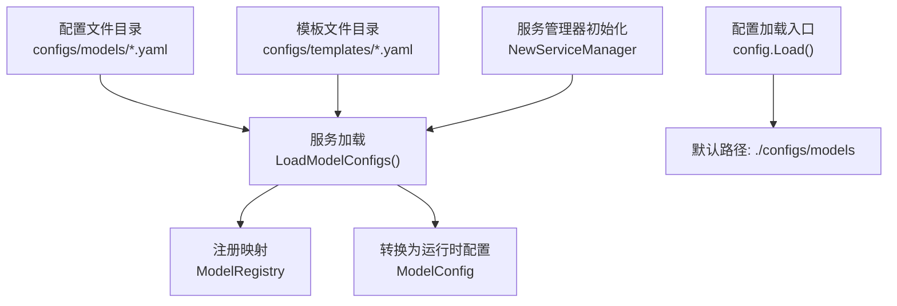
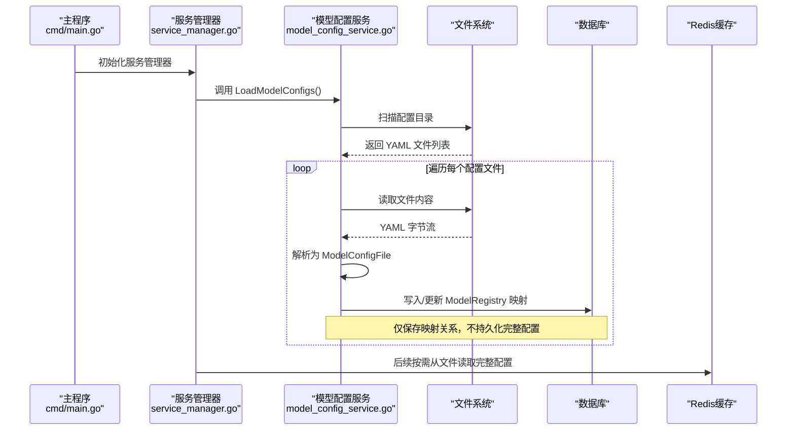
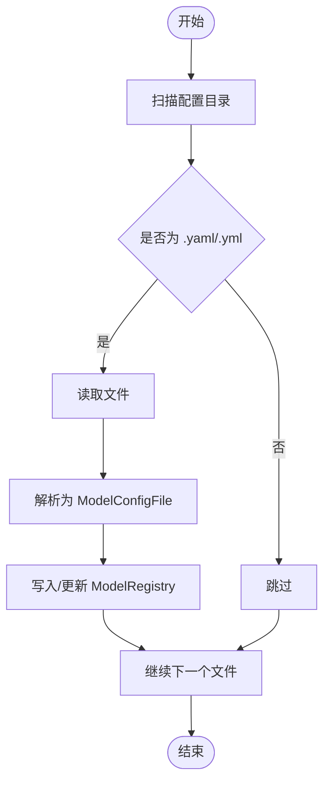
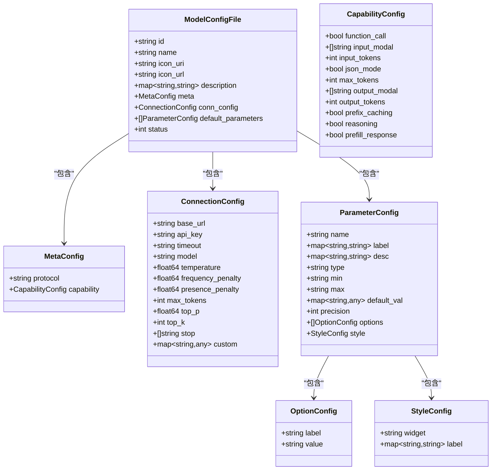
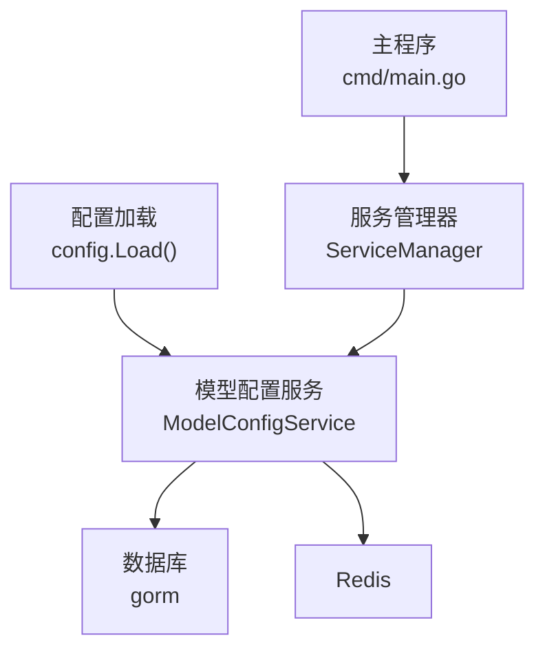
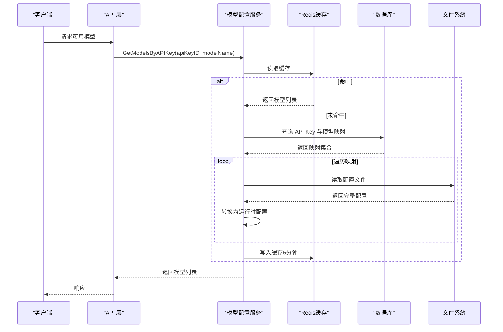

# 模型配置文件

<cite>
**本文引用的文件**
- [cmd/main.go](file://cmd/main.go)
- [internal/config/config.go](file://internal/config/config.go)
- [internal/config/validator.go](file://internal/config/validator.go)
- [internal/models/models.go](file://internal/models/models.go)
- [internal/services/model_config_service.go](file://internal/services/model_config_service.go)
- [internal/services/service_manager.go](file://internal/services/service_manager.go)
- [configs/models/qwen3-chat.yaml](file://configs/models/qwen3-chat.yaml)
- [configs/models/qwen3-embedding.yaml](file://configs/models/qwen3-embedding.yaml)
- [configs/models/qwen3-asr.yaml](file://configs/models/qwen3-asr.yaml)
- [configs/models/qwen-tts.yaml](file://configs/models/qwen-tts.yaml)
- [configs/templates/claude-3.yaml](file://configs/templates/claude-3.yaml)
- [configs/templates/deepseek-v3.yaml](file://configs/templates/deepseek-v3.yaml)
- [configs/templates/gpt-4.yaml](file://configs/templates/gpt-4.yaml)
- [test_configs/test-model.yaml](file://test_configs/test-model.yaml)
</cite>

## 目录
1. [简介](#简介)
2. [项目结构](#项目结构)
3. [核心组件](#核心组件)
4. [架构总览](#架构总览)
5. [详细组件分析](#详细组件分析)
6. [依赖分析](#依赖分析)
7. [性能考虑](#性能考虑)
8. [故障排查指南](#故障排查指南)
9. [结论](#结论)
10. [附录](#附录)

## 简介
本文面向 Wolink-Core 的模型配置文件，系统化阐述 YAML 配置文件的结构与字段定义，覆盖以下关键主题：
- 配置文件结构与字段说明：ModelConfigFile、ParameterConfig、MetaConfig、ConnectionConfig 等
- 模型基本信息（ID、名称、图标、多语言描述）
- 能力配置（输入/输出模态、令牌限制、推理能力等）
- 连接配置（基础 URL、API 密钥、超时、协议特定参数）
- 参数配置（默认值、选项、样式）
- 完整配置示例与字段说明
- 验证规则与安全要求
- 配置文件加载机制、参数优先级与动态更新策略

## 项目结构
模型配置文件位于 configs/models 与 configs/templates 目录中，分别用于业务模型与协议模板。运行时通过服务层加载并转换为内部数据结构。

图表来源
- [internal/services/model_config_service.go:38-105](file://internal/services/model_config_service.go#L38-L105)
- [internal/config/config.go:84-86](file://internal/config/config.go#L84-L86)
- [internal/services/service_manager.go:56-60](file://internal/services/service_manager.go#L56-L60)

章节来源
- [internal/services/model_config_service.go:38-105](file://internal/services/model_config_service.go#L38-L105)
- [internal/config/config.go:84-86](file://internal/config/config.go#L84-L86)
- [internal/services/service_manager.go:56-60](file://internal/services/service_manager.go#L56-L60)

## 核心组件
- ModelConfigFile：配置文件的顶层结构，包含基本信息、元数据、连接配置、参数与状态
- MetaConfig：协议与能力声明
- CapabilityConfig：输入/输出模态、令牌限制、推理能力等
- ConnectionConfig：连接参数（基础 URL、API 密钥、超时、协议特定参数）
- ParameterConfig：参数定义（名称、标签、描述、类型、范围、默认值、精度、选项、样式）
- OptionConfig：参数可选值
- StyleConfig：参数 UI 样式（控件类型、标签）

章节来源
- [internal/models/models.go:396-462](file://internal/models/models.go#L396-L462)

## 架构总览
模型配置从 YAML 文件加载到内存，转换为运行时配置，并通过缓存与数据库映射进行高效访问。

图表来源
- [cmd/main.go:19-60](file://cmd/main.go#L19-L60)
- [internal/services/service_manager.go:56-60](file://internal/services/service_manager.go#L56-L60)
- [internal/services/model_config_service.go:38-105](file://internal/services/model_config_service.go#L38-L105)

## 详细组件分析

### 配置文件结构与字段定义
- 顶层结构（ModelConfigFile）
  - id：模型唯一标识
  - name：模型显示名称
  - icon_uri/icon_url：图标资源定位
  - description：多语言描述
  - meta：协议与能力声明
  - conn_config：连接与协议参数
  - default_parameters：参数定义列表
  - status：启用状态

- 元数据（MetaConfig）
  - protocol：协议类型（如 openai、claude、deepseek）
  - capability：能力配置

- 能力配置（CapabilityConfig）
  - function_call：是否支持函数调用
  - input_modal/output_modal：输入/输出模态（text、audio、image 等）
  - input_tokens/output_tokens/max_tokens：令牌限制
  - json_mode：是否支持 JSON 输出模式
  - prefix_caching/reasoning/prefill_response：推理与缓存相关能力

- 连接配置（ConnectionConfig）
  - base_url：上游服务基础地址
  - api_key：认证密钥
  - timeout：请求超时
  - model：上游模型名称
  - temperature/frequency_penalty/presence_penalty/max_tokens/top_p/top_k/stop/custom：协议特定参数

- 参数配置（ParameterConfig）
  - name：参数名
  - label/desc：多语言标签与描述
  - type：参数类型（如 float、int）
  - min/max：取值范围
  - default_val：默认值（支持多场景默认值）
  - precision：数值精度
  - options：可选值列表（OptionConfig）
  - style：UI 样式（StyleConfig）

章节来源
- [internal/models/models.go:396-462](file://internal/models/models.go#L396-L462)

### 字段说明与示例
- 基本信息与描述
  - 示例参考：[configs/models/qwen3-chat.yaml:1-12](file://configs/models/qwen3-chat.yaml#L1-L12)、[configs/models/qwen-tts.yaml:1-22](file://configs/models/qwen-tts.yaml#L1-L22)
- 能力配置
  - 示例参考：[configs/templates/claude-3.yaml:46-61](file://configs/templates/claude-3.yaml#L46-L61)、[configs/templates/gpt-4.yaml:46-61](file://configs/templates/gpt-4.yaml#L46-L61)
- 连接配置
  - 示例参考：[configs/models/qwen3-asr.yaml:17-21](file://configs/models/qwen3-asr.yaml#L17-L21)、[configs/templates/deepseek-v3.yaml:86-101](file://configs/templates/deepseek-v3.yaml#L86-L101)
- 参数配置
  - 示例参考：[configs/templates/claude-3.yaml:8-45](file://configs/templates/claude-3.yaml#L8-L45)、[configs/templates/deepseek-v3.yaml:8-70](file://configs/templates/deepseek-v3.yaml#L8-L70)

### 验证规则与安全要求
- 配置加载与默认值
  - 默认模型配置路径：./configs/models
  - 通过 viper 加载与解析
- 安全校验
  - JWT 密钥长度与强度要求
  - 生产模式下数据库/Redis 密钥必填
- 配置验证入口
  - MustValidate：失败时退出进程

章节来源
- [internal/config/config.go:96-124](file://internal/config/config.go#L96-L124)
- [internal/config/validator.go:18-87](file://internal/config/validator.go#L18-L87)

### 配置文件加载机制
- 加载流程
  - 服务管理器初始化时调用 LoadModelConfigs
  - 遍历配置目录，过滤 .yaml/.yml 文件
  - 读取并解析为 ModelConfigFile
  - 仅将映射关系写入数据库（ModelRegistry），不持久化完整配置
  - 后续按需从文件读取完整配置
- 缓存与查询
  - 按 API Key 与模型名查询时，先查缓存，未命中再从数据库与文件系统组合查询

图表来源
- [internal/services/model_config_service.go:38-105](file://internal/services/model_config_service.go#L38-L105)

章节来源
- [internal/services/model_config_service.go:38-105](file://internal/services/model_config_service.go#L38-L105)
- [internal/services/service_manager.go:56-60](file://internal/services/service_manager.go#L56-L60)

### 参数优先级与动态更新策略
- 参数优先级
  - 运行时请求参数 > 配置文件中的默认参数 > 协议默认值
- 动态更新策略
  - 当前实现：配置文件变更后重启服务以重新加载
  - 建议：引入文件监控与热更新机制（例如基于文件时间戳或 fsnotify），并在服务层增加刷新接口

章节来源
- [internal/services/model_config_service.go:169-199](file://internal/services/model_config_service.go#L169-L199)

### 数据模型类图

图表来源
- [internal/models/models.go:396-462](file://internal/models/models.go#L396-L462)

## 依赖分析
- 组件耦合
  - ModelConfigService 依赖配置、数据库与 Redis
  - 服务管理器负责统一初始化与启动
- 外部依赖
  - YAML 解析：gopkg.in/yaml.v3
  - 配置解析：spf13/viper
  - 日志：sirupsen/logrus
  - ORM：gorm.io/gorm
  - 缓存：github.com/go-redis/redis/v8

图表来源
- [internal/config/config.go:96-124](file://internal/config/config.go#L96-L124)
- [internal/services/service_manager.go:30-62](file://internal/services/service_manager.go#L30-L62)
- [cmd/main.go:19-60](file://cmd/main.go#L19-L60)

章节来源
- [internal/config/config.go:96-124](file://internal/config/config.go#L96-L124)
- [internal/services/service_manager.go:30-62](file://internal/services/service_manager.go#L30-L62)
- [cmd/main.go:19-60](file://cmd/main.go#L19-L60)

## 性能考虑
- 配置加载
  - 仅在启动阶段扫描与注册映射，避免重复 IO
- 查询优化
  - 按 API Key 与模型名查询时使用 Redis 缓存，减少数据库与文件系统访问
- 超时与并发
  - 基于配置设置 HTTP 服务器超时，防止慢请求占用资源

## 故障排查指南
- 配置文件无法加载
  - 检查配置路径是否正确（默认 ./configs/models）
  - 确认文件扩展名为 .yaml 或 .yml
  - 查看服务日志中的解析错误
- 模型不可见
  - 确认 status 字段为启用状态
  - 检查 API Key 与模型映射关系
- 安全配置问题
  - JWT 密钥长度不足或为默认值
  - 生产模式下数据库/Redis 密钥缺失

章节来源
- [internal/config/validator.go:18-87](file://internal/config/validator.go#L18-L87)
- [internal/services/model_config_service.go:38-105](file://internal/services/model_config_service.go#L38-L105)

## 结论
Wolink-Core 的模型配置采用“文件驱动 + 映射注册”的设计，既保证了灵活性与可维护性，又通过缓存与数据库映射提升了运行时效率。建议后续引入配置热更新与更完善的参数优先级控制，以进一步增强系统的可运维性与用户体验。

## 附录

### 配置文件示例与字段说明
- 通用模型示例
  - 文本生成：[configs/models/qwen3-chat.yaml:1-12](file://configs/models/qwen3-chat.yaml#L1-L12)
  - 嵌入模型：[configs/models/qwen3-embedding.yaml:1-12](file://configs/models/qwen3-embedding.yaml#L1-L12)
  - 语音识别：[configs/models/qwen3-asr.yaml:1-22](file://configs/models/qwen3-asr.yaml#L1-L22)
  - 文本转语音：[configs/models/qwen-tts.yaml:1-22](file://configs/models/qwen-tts.yaml#L1-L22)
- 协议模板示例
  - OpenAI：[configs/templates/gpt-4.yaml:1-75](file://configs/templates/gpt-4.yaml#L1-L75)
  - Claude：[configs/templates/claude-3.yaml:1-75](file://configs/templates/claude-3.yaml#L1-L75)
  - DeepSeek：[configs/templates/deepseek-v3.yaml:1-101](file://configs/templates/deepseek-v3.yaml#L1-L101)
- 测试配置示例
  - [test_configs/test-model.yaml:1-17](file://test_configs/test-model.yaml#L1-L17)

### 关键流程时序图（按需加载与缓存）

图表来源
- [internal/services/model_config_service.go:114-167](file://internal/services/model_config_service.go#L114-L167)