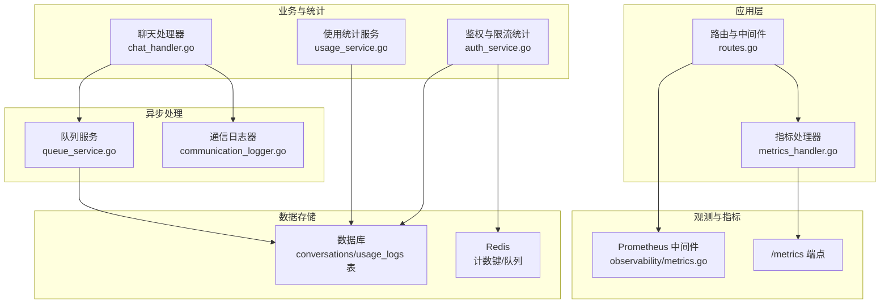
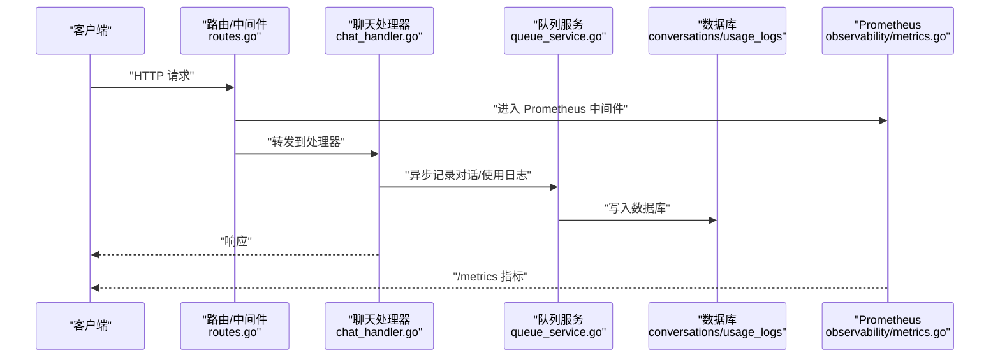
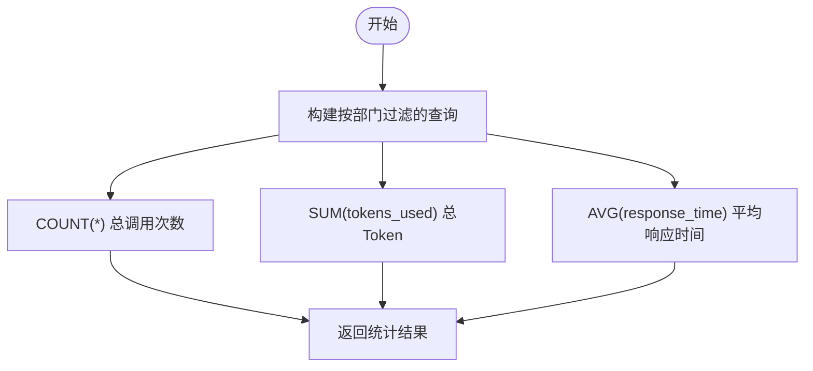
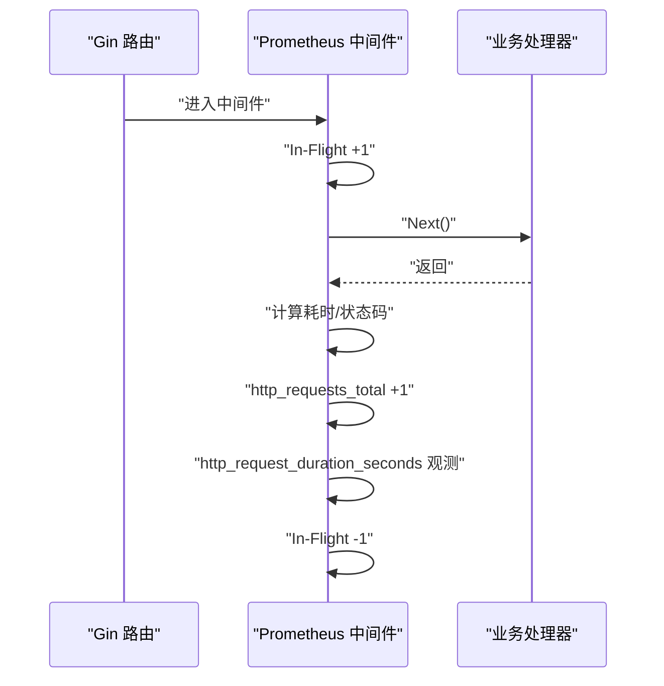
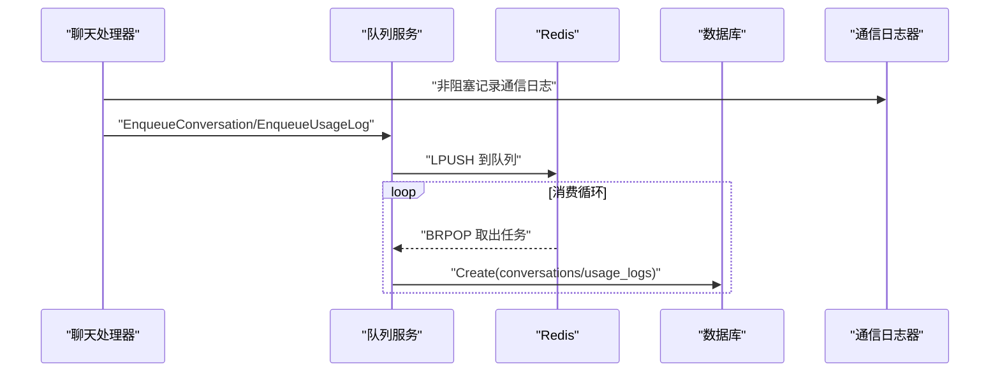
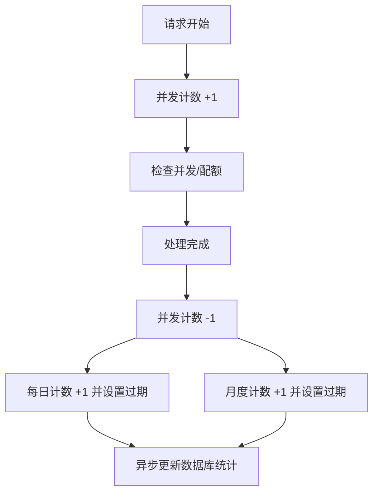
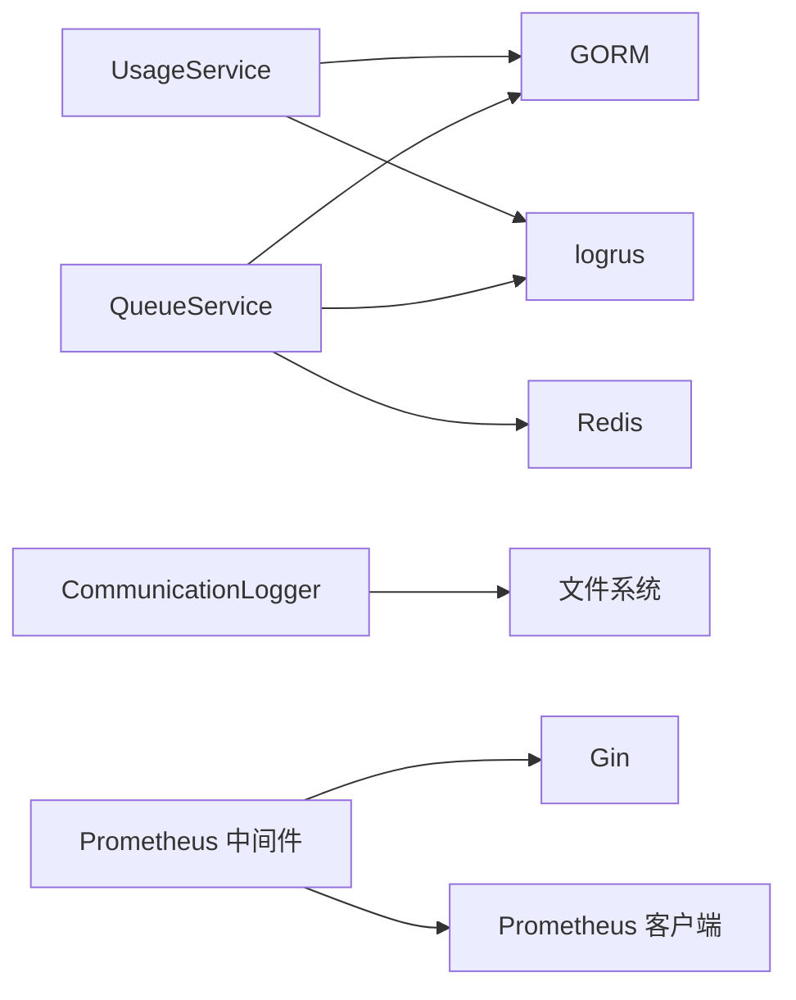

# 使用统计服务

<cite>
**本文引用的文件**
- [internal/services/usage_service.go](file://internal/services/usage_service.go)
- [internal/models/models.go](file://internal/models/models.go)
- [internal/observability/metrics.go](file://internal/observability/metrics.go)
- [internal/api/handlers/metrics_handler.go](file://internal/api/handlers/metrics_handler.go)
- [internal/api/routes.go](file://internal/api/routes.go)
- [internal/services/queue_service.go](file://internal/services/queue_service.go)
- [internal/services/communication_logger.go](file://internal/services/communication_logger.go)
- [internal/api/handlers/chat_handler.go](file://internal/api/handlers/chat_handler.go)
- [internal/services/auth_service.go](file://internal/services/auth_service.go)
- [internal/config/config.go](file://internal/config/config.go)
- [configs/prometheus.yml](file://configs/prometheus.yml)
- [scripts/mysql-init.sql](file://scripts/mysql-init.sql)
</cite>

## 目录
1. [简介](#简介)
2. [项目结构](#项目结构)
3. [核心组件](#核心组件)
4. [架构总览](#架构总览)
5. [详细组件分析](#详细组件分析)
6. [依赖分析](#依赖分析)
7. [性能考量](#性能考量)
8. [故障排查指南](#故障排查指南)
9. [结论](#结论)
10. [附录](#附录)

## 简介
本文件面向 Wolink-Core 的“使用统计服务”，系统性阐述请求计数、响应时间与错误率等关键指标的采集、聚合与存储机制；解释时间窗口管理与数据归档策略；说明与监控系统（Prometheus）的集成方式及指标上报与告警触发路径；并提供统计数据查询、报表生成与趋势分析的实践建议与代码片段路径。

## 项目结构
围绕使用统计的关键模块分布如下：
- 统计查询与日志：UsageService、Conversation/UsageLog 数据模型
- 指标采集与暴露：Prometheus 中间件、指标处理器
- 异步落库：队列服务（Redis 列表）+ 通信日志器（文件）
- 路由与入口：HTTP 路由注册、指标端点
- 配置与基础设施：连接池、超时、通信日志配置

图表来源
- [internal/api/routes.go:14-129](file://internal/api/routes.go#L14-L129)
- [internal/observability/metrics.go:53-92](file://internal/observability/metrics.go#L53-L92)
- [internal/api/handlers/metrics_handler.go:18-22](file://internal/api/handlers/metrics_handler.go#L18-L22)
- [internal/services/usage_service.go:11-52](file://internal/services/usage_service.go#L11-L52)
- [internal/services/auth_service.go:126-149](file://internal/services/auth_service.go#L126-L149)
- [internal/api/handlers/chat_handler.go:275-295](file://internal/api/handlers/chat_handler.go#L275-L295)
- [internal/services/queue_service.go:17-200](file://internal/services/queue_service.go#L17-L200)
- [internal/services/communication_logger.go:31-272](file://internal/services/communication_logger.go#L31-L272)

章节来源
- [internal/api/routes.go:14-129](file://internal/api/routes.go#L14-L129)
- [internal/observability/metrics.go:53-92](file://internal/observability/metrics.go#L53-L92)
- [internal/api/handlers/metrics_handler.go:18-22](file://internal/api/handlers/metrics_handler.go#L18-L22)

## 核心组件
- 使用统计服务（UsageService）
  - 提供按部门维度的统计查询：总调用次数、总 Token 使用量、平均响应时间
  - 提供使用日志记录能力（异步落库）
- 指标采集与暴露（Prometheus）
  - HTTP 请求总量、延迟直方图、并发请求数等
  - 提供 /metrics 暴露端点
- 异步落库与归档
  - 队列服务：基于 Redis 列表的异步写入（conversation/usage_log）
  - 通信日志器：文件归档（JSONL），支持按小时滚动与批量刷盘
- 鉴权与限流统计
  - 基于 Redis 的每日/月度计数与并发计数，异步更新数据库统计

章节来源
- [internal/services/usage_service.go:11-52](file://internal/services/usage_service.go#L11-L52)
- [internal/observability/metrics.go:12-92](file://internal/observability/metrics.go#L12-L92)
- [internal/services/queue_service.go:17-200](file://internal/services/queue_service.go#L17-L200)
- [internal/services/communication_logger.go:31-272](file://internal/services/communication_logger.go#L31-L272)
- [internal/services/auth_service.go:126-149](file://internal/services/auth_service.go#L126-L149)

## 架构总览
下图展示了使用统计相关的端到端流程：请求经中间件采集指标，业务处理完成后通过队列与日志器异步落库，最终由数据库提供统计查询能力。

图表来源
- [internal/api/routes.go:14-129](file://internal/api/routes.go#L14-L129)
- [internal/observability/metrics.go:53-92](file://internal/observability/metrics.go#L53-L92)
- [internal/api/handlers/chat_handler.go:275-295](file://internal/api/handlers/chat_handler.go#L275-L295)
- [internal/services/queue_service.go:105-151](file://internal/services/queue_service.go#L105-L151)

## 详细组件分析

### 使用统计服务（UsageService）
- 查询逻辑
  - 总调用次数：按部门过滤后 COUNT
  - 总 Token 使用量：按部门 SUM，空值 COALESCE(0)
  - 平均响应时间：按部门 AVG，空值 COALESCE(0)
- 日志记录
  - 提供 UsageLog 记录的异步入库接口
- 时间窗口与聚合
  - 当前实现按部门维度进行全表聚合，未见显式的滑动/固定时间窗口聚合逻辑
- 数据归档
  - 未见专门的归档策略；对话与使用日志分别对应 conversations 与 usage_logs 表

图表来源
- [internal/services/usage_service.go:25-47](file://internal/services/usage_service.go#L25-L47)

章节来源
- [internal/services/usage_service.go:11-52](file://internal/services/usage_service.go#L11-L52)
- [internal/models/models.go:90-131](file://internal/models/models.go#L90-L131)

### 指标采集与暴露（Prometheus）
- 指标类型
  - http_requests_total（按 method/path/status）
  - http_request_duration_seconds（按 method/path，带桶）
  - http_requests_in_flight（按 method）
- 中间件行为
  - 使用 c.FullPath() 作为 path 标签，避免高基数
  - 记录并发请求数、延迟与状态码
- 暴露端点
  - /metrics 由处理器统一包装 promhttp.Handler

图表来源
- [internal/observability/metrics.go:53-92](file://internal/observability/metrics.go#L53-L92)

章节来源
- [internal/observability/metrics.go:12-92](file://internal/observability/metrics.go#L12-L92)
- [internal/api/handlers/metrics_handler.go:18-22](file://internal/api/handlers/metrics_handler.go#L18-L22)
- [configs/prometheus.yml:1-10](file://configs/prometheus.yml#L1-10)

### 异步落库与归档（队列服务与通信日志器）
- 队列服务
  - Redis 列表：ai_gateway:queue:conversations、ai_gateway:queue:usage_logs
  - 工作池并发拉取，失败重试最多 3 次
  - 分别写入 conversations 与 usage_logs 表
- 通信日志器
  - JSONL 文件，按小时滚动
  - 批量写入 + 定时刷新，缓冲区大小可配置
  - 支持通道满时丢弃记录并告警

图表来源
- [internal/api/handlers/chat_handler.go:275-295](file://internal/api/handlers/chat_handler.go#L275-L295)
- [internal/services/queue_service.go:105-151](file://internal/services/queue_service.go#L105-L151)
- [internal/services/queue_service.go:153-200](file://internal/services/queue_service.go#L153-L200)
- [internal/services/communication_logger.go:79-131](file://internal/services/communication_logger.go#L79-L131)

章节来源
- [internal/services/queue_service.go:17-200](file://internal/services/queue_service.go#L17-L200)
- [internal/services/communication_logger.go:31-272](file://internal/services/communication_logger.go#L31-L272)

### 鉴权与限流统计（Redis 计数）
- 每日/月度计数键：daily:{apiKeyID}:{YYYY-MM-DD}、monthly:{apiKeyID}:{YYYY-MM}
- 并发计数键：concurrent:{apiKeyID}
- 异步更新数据库统计：在计数更新后启动后台 goroutine 更新数据库字段

图表来源
- [internal/services/auth_service.go:126-149](file://internal/services/auth_service.go#L126-L149)

章节来源
- [internal/services/auth_service.go:126-149](file://internal/services/auth_service.go#L126-L149)

### 数据模型与索引建议
- 关键表
  - conversations：包含 tokens_used、response_time、department_id 等
  - usage_logs：包含 tokens_used、response_time、status、error_message 等
- 索引建议（初始化脚本中已预留注释）
  - conversations：按 department_id/created_at、api_key_id/created_at 复合索引
  - usage_logs：按 department_id/request_time、model_name/request_time 索引

章节来源
- [internal/models/models.go:90-131](file://internal/models/models.go#L90-L131)
- [scripts/mysql-init.sql:20-26](file://scripts/mysql-init.sql#L20-L26)

## 依赖分析
- 组件耦合
  - UsageService 依赖 GORM（数据库）、logrus（日志）
  - Prometheus 中间件依赖 Gin、Prometheus 客户端
  - 队列服务依赖 Redis、GORM、logrus
  - 通信日志器依赖文件系统、配置
- 外部依赖
  - Prometheus（指标采集与导出）
  - Redis（计数与队列）
  - MySQL/PostgreSQL（持久化）

图表来源
- [internal/services/usage_service.go:3-9](file://internal/services/usage_service.go#L3-L9)
- [internal/observability/metrics.go:3-10](file://internal/observability/metrics.go#L3-L10)
- [internal/services/queue_service.go:3-15](file://internal/services/queue_service.go#L3-L15)
- [internal/services/communication_logger.go:3-13](file://internal/services/communication_logger.go#L3-L13)

章节来源
- [internal/services/usage_service.go:3-9](file://internal/services/usage_service.go#L3-L9)
- [internal/observability/metrics.go:3-10](file://internal/observability/metrics.go#L3-L10)
- [internal/services/queue_service.go:3-15](file://internal/services/queue_service.go#L3-L15)
- [internal/services/communication_logger.go:3-13](file://internal/services/communication_logger.go#L3-L13)

## 性能考量
- 指标采集
  - 使用直方图桶优化 API 延迟观测，避免高基数路径标签
  - In-Flight 指标实时反映并发压力
- 异步落库
  - 队列服务采用工作池与重试机制，降低主链路阻塞
  - 通信日志器批量写入与定时刷新，减少磁盘 IO
- 连接池与超时
  - 数据库连接池与 Redis 连接池可通过配置调整
  - 基础设施超时参数可配置，保障稳定性
- 存储成本控制
  - 通信日志器按小时滚动，可结合外部归档策略（如压缩、冷热分层）
  - conversations/usage_logs 表建议建立复合索引，提升统计查询效率

章节来源
- [internal/observability/metrics.go:23-44](file://internal/observability/metrics.go#L23-L44)
- [internal/services/queue_service.go:70-90](file://internal/services/queue_service.go#L70-L90)
- [internal/services/communication_logger.go:146-203](file://internal/services/communication_logger.go#L146-L203)
- [internal/config/config.go:21-47](file://internal/config/config.go#L21-L47)
- [internal/config/config.go:168-184](file://internal/config/config.go#L168-L184)

## 故障排查指南
- 指标无法暴露
  - 检查 /metrics 路由是否注册、Prometheus 配置是否正确
- 队列积压
  - 查看 Redis 队列长度、消费协程状态与重试次数
  - 核对数据库写入错误日志与重试上限
- 通信日志丢失
  - 检查通道是否满、文件打开/写入错误、滚动策略
- 统计异常
  - 确认数据库索引是否存在、查询条件是否正确
  - 核对 Redis 计数键是否过期、并发计数是否被正确增减

章节来源
- [internal/api/routes.go:40-44](file://internal/api/routes.go#L40-L44)
- [configs/prometheus.yml:6-9](file://configs/prometheus.yml#L6-L9)
- [internal/services/queue_service.go:153-200](file://internal/services/queue_service.go#L153-L200)
- [internal/services/communication_logger.go:146-203](file://internal/services/communication_logger.go#L146-L203)
- [internal/services/auth_service.go:126-149](file://internal/services/auth_service.go#L126-L149)

## 结论
Wolink-Core 的使用统计服务通过“Prometheus 指标 + 异步队列/日志 + 数据库聚合”的组合，实现了对请求量、响应时间与错误情况的可观测与统计。当前实现以部门维度聚合为主，未见内置的时间窗口聚合与自动归档策略。建议在现有基础上补充：
- 固定/滑动时间窗口的聚合与缓存
- 对历史数据的定期归档与压缩
- 更细粒度的错误率与成功率指标
- 与告警系统联动（如阈值触发、静默窗口）

## 附录

### 统计数据查询与报表生成（代码片段路径）
- 按部门统计（总调用次数、总 Token、平均响应时间）
  - [internal/services/usage_service.go:25-47](file://internal/services/usage_service.go#L25-L47)
- 记录使用日志（异步入库）
  - [internal/services/usage_service.go:49-52](file://internal/services/usage_service.go#L49-L52)
- 获取 /metrics 指标
  - [internal/api/handlers/metrics_handler.go:18-22](file://internal/api/handlers/metrics_handler.go#L18-L22)
  - [configs/prometheus.yml:6-9](file://configs/prometheus.yml#L6-L9)

### 趋势分析与报表建议
- 指标层面
  - 使用 Prometheus 查询语言（如 rate、histogram_quantile）进行趋势与容量分析
- 数据层面
  - 基于 conversations 表的 created_at 与 tokens_used 进行日/周/月趋势聚合
  - 建议在数据库侧增加物化视图或汇总表以降低查询成本

### 性能优化与存储成本控制
- 指标与日志
  - 控制标签基数、合理设置直方图桶、启用批量与定时刷新
- 存储
  - 对通信日志进行压缩与冷热分层；对历史统计数据进行分区归档
- 数据库
  - 按需建立复合索引，必要时拆分读写库或引入缓存