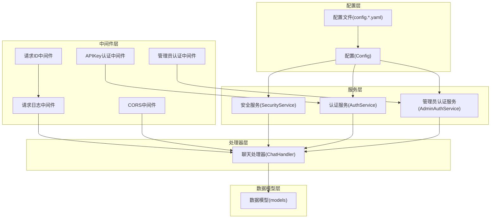
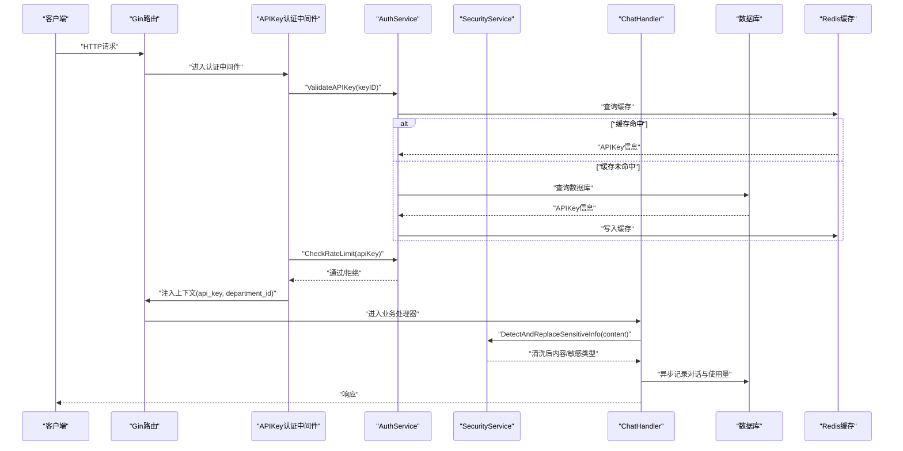
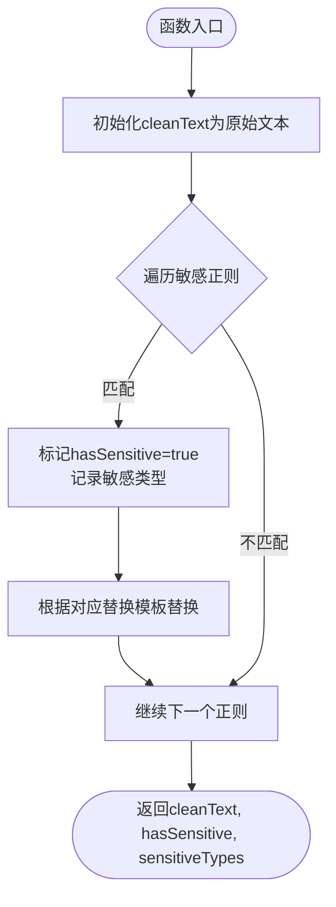
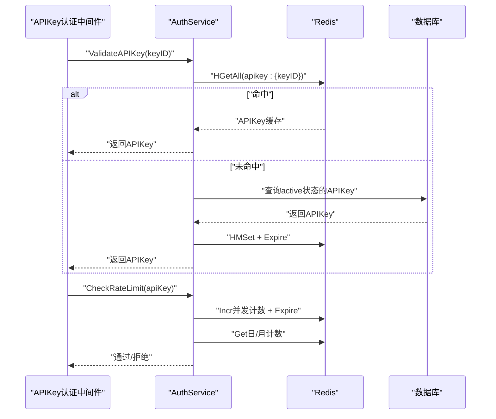
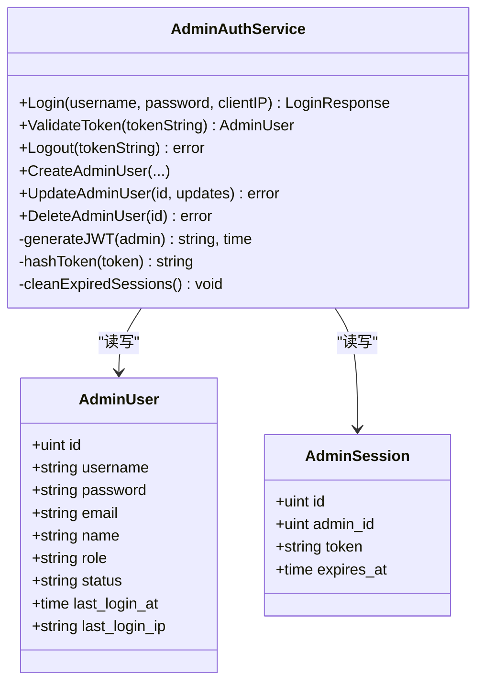
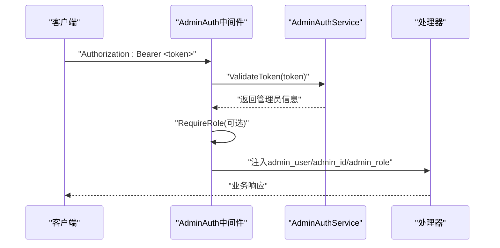
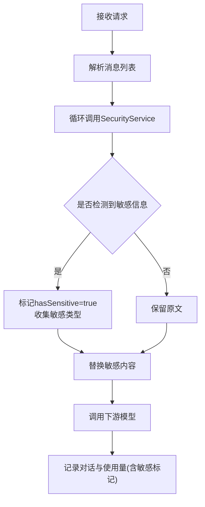
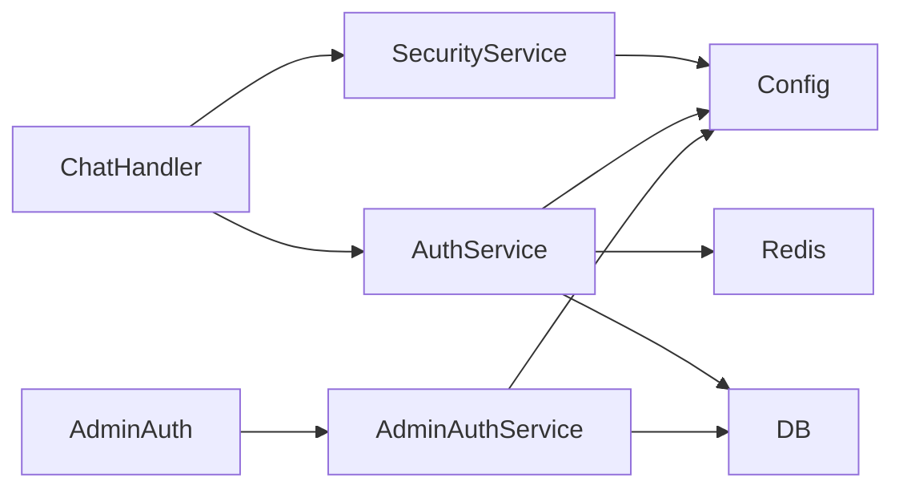

# 安全服务

<cite>
**本文引用的文件**
- [internal/services/security_service.go](file://internal/services/security_service.go)
- [internal/config/config.go](file://internal/config/config.go)
- [configs/config.postgres.yaml](file://configs/config.postgres.yaml)
- [configs/config.mysql.yaml](file://configs/config.mysql.yaml)
- [internal/api/middleware/auth.go](file://internal/api/middleware/auth.go)
- [internal/services/auth_service.go](file://internal/services/auth_service.go)
- [internal/api/middleware/admin_auth.go](file://internal/api/middleware/admin_auth.go)
- [internal/services/admin_auth_service.go](file://internal/services/admin_auth_service.go)
- [internal/models/models.go](file://internal/models/models.go)
- [internal/api/middleware/logging.go](file://internal/api/middleware/logging.go)
- [internal/api/middleware/requestid.go](file://internal/api/middleware/requestid.go)
- [internal/observability/logger.go](file://internal/observability/logger.go)
- [internal/api/handlers/chat_handler.go](file://internal/api/handlers/chat_handler.go)
- [.planning/research/PITFALLS.md](file://.planning/research/PITFALLS.md)
- [.planning/phases/01-security-foundation/01-RESEARCH.md](file://.planning/phases/01-security-foundation/01-RESEARCH.md)
</cite>

## 目录
1. [简介](#简介)
2. [项目结构](#项目结构)
3. [核心组件](#核心组件)
4. [架构总览](#架构总览)
5. [详细组件分析](#详细组件分析)
6. [依赖分析](#依赖分析)
7. [性能考量](#性能考量)
8. [故障排查指南](#故障排查指南)
9. [结论](#结论)
10. [附录](#附录)

## 简介
本文件面向 Wolink-Core 的安全服务，系统化阐述其安全策略与实现机制，覆盖输入验证、输出过滤、访问控制、威胁检测、异常行为识别与防护措施，并说明与认证系统的协作方式（权限验证与审计日志）。同时提供可操作的最佳实践、漏洞防护策略与合规性建议，帮助读者快速理解并正确部署与维护安全体系。

## 项目结构
安全相关能力主要分布在以下模块：
- 配置层：集中定义安全配置项（如 JWT 密钥、敏感信息正则与替换模板）。
- 中间件层：统一处理 API 认证、速率限制、CORS、请求追踪与日志。
- 服务层：提供 API Key 验证与限流、管理员认证与会话管理、敏感信息检测与替换。
- 数据模型层：定义 API Key、管理员、会话与对话记录等实体及字段约束。
- 处理器层：在业务入口处集成安全检查（如敏感信息替换），并记录审计日志。

图表来源
- [internal/config/config.go:10-185](file://internal/config/config.go#L10-L185)
- [configs/config.postgres.yaml:23-35](file://configs/config.postgres.yaml#L23-L35)
- [configs/config.mysql.yaml:25-37](file://configs/config.mysql.yaml#L25-L37)
- [internal/api/middleware/auth.go:13-68](file://internal/api/middleware/auth.go#L13-L68)
- [internal/api/middleware/admin_auth.go:14-75](file://internal/api/middleware/admin_auth.go#L14-L75)
- [internal/api/middleware/logging.go:22-52](file://internal/api/middleware/logging.go#L22-L52)
- [internal/api/middleware/requestid.go:21-40](file://internal/api/middleware/requestid.go#L21-L40)
- [internal/services/security_service.go:9-59](file://internal/services/security_service.go#L9-L59)
- [internal/services/auth_service.go:19-219](file://internal/services/auth_service.go#L19-L219)
- [internal/services/admin_auth_service.go:19-248](file://internal/services/admin_auth_service.go#L19-L248)
- [internal/models/models.go:20-160](file://internal/models/models.go#L20-L160)
- [internal/api/handlers/chat_handler.go:34-250](file://internal/api/handlers/chat_handler.go#L34-L250)

章节来源
- [internal/config/config.go:10-185](file://internal/config/config.go#L10-L185)
- [configs/config.postgres.yaml:23-35](file://configs/config.postgres.yaml#L23-L35)
- [configs/config.mysql.yaml:25-37](file://configs/config.mysql.yaml#L25-L37)
- [internal/api/middleware/auth.go:13-68](file://internal/api/middleware/auth.go#L13-L68)
- [internal/api/middleware/admin_auth.go:14-75](file://internal/api/middleware/admin_auth.go#L14-L75)
- [internal/api/middleware/logging.go:22-52](file://internal/api/middleware/logging.go#L22-L52)
- [internal/api/middleware/requestid.go:21-40](file://internal/api/middleware/requestid.go#L21-L40)
- [internal/services/security_service.go:9-59](file://internal/services/security_service.go#L9-L59)
- [internal/services/auth_service.go:19-219](file://internal/services/auth_service.go#L19-L219)
- [internal/services/admin_auth_service.go:19-248](file://internal/services/admin_auth_service.go#L19-L248)
- [internal/models/models.go:20-160](file://internal/models/models.go#L20-L160)
- [internal/api/handlers/chat_handler.go:34-250](file://internal/api/handlers/chat_handler.go#L34-L250)

## 核心组件
- 安全服务（SecurityService）
  - 负责敏感信息检测与替换，基于配置中的正则表达式与替换模板，对输入内容进行扫描并标记敏感类型。
  - 输出包含清洗后的文本、是否存在敏感信息以及敏感信息类型列表。
- 认证服务（AuthService）
  - 提供 API Key 验证、并发/日/月限流检查、使用量异步记录与缓存。
  - 支持生成新 API Key，缓存 API Key 信息以降低数据库压力。
- 管理员认证服务（AdminAuthService）
  - 提供管理员登录、JWT 令牌签发与校验、会话持久化与过期清理、管理员用户增删改查。
- 中间件
  - APIKeyAuth：统一从 Authorization 头或查询参数提取 API Key，校验并注入上下文，同时执行速率限制。
  - AdminAuth：管理员 Bearer Token 校验与角色要求中间件。
  - LoggerWithRequestID/CORS：请求追踪与跨域支持。
- 数据模型
  - APIKey、AdminUser、AdminSession、Conversation 等，支撑鉴权、会话与审计日志。

章节来源
- [internal/services/security_service.go:9-59](file://internal/services/security_service.go#L9-L59)
- [internal/services/auth_service.go:19-219](file://internal/services/auth_service.go#L19-L219)
- [internal/services/admin_auth_service.go:19-248](file://internal/services/admin_auth_service.go#L19-L248)
- [internal/api/middleware/auth.go:13-68](file://internal/api/middleware/auth.go#L13-L68)
- [internal/api/middleware/admin_auth.go:14-75](file://internal/api/middleware/admin_auth.go#L14-L75)
- [internal/models/models.go:20-160](file://internal/models/models.go#L20-L160)

## 架构总览
下图展示了从请求进入网关到业务处理与审计日志记录的整体流程，突出安全检查与认证协作的关键节点。

图表来源
- [internal/api/middleware/auth.go:13-68](file://internal/api/middleware/auth.go#L13-L68)
- [internal/services/auth_service.go:35-124](file://internal/services/auth_service.go#L35-L124)
- [internal/services/security_service.go:29-59](file://internal/services/security_service.go#L29-L59)
- [internal/api/handlers/chat_handler.go:34-250](file://internal/api/handlers/chat_handler.go#L34-L250)

## 详细组件分析

### 安全服务（SecurityService）
- 功能职责
  - 基于配置加载敏感信息正则与替换模板，对文本进行扫描与替换。
  - 返回清洗后文本、是否存在敏感信息以及敏感类型集合。
- 关键点
  - 正则编译失败会被忽略，确保服务健壮性。
  - 敏感类型按顺序映射（手机号、身份证、银行卡等），便于审计与告警。
- 风险与改进
  - 当前仓库中存在关于“请求验证”的旧实现建议移除或重定向为业务规则验证。
  - 建议将敏感信息检测与替换作为所有对外文本处理的前置步骤，避免敏感数据泄露。

图表来源
- [internal/services/security_service.go:29-59](file://internal/services/security_service.go#L29-L59)

章节来源
- [internal/services/security_service.go:9-59](file://internal/services/security_service.go#L9-L59)
- [.planning/phases/01-security-foundation/01-RESEARCH.md:468-478](file://.planning/phases/01-security-foundation/01-RESEARCH.md#L468-L478)

### 认证服务（AuthService）
- 功能职责
  - API Key 验证：优先从 Redis 缓存读取，未命中再查询数据库，并写入缓存。
  - 速率限制：并发限制（30秒窗口）、日/月限额检查。
  - 使用量记录：异步更新 Redis 计数与数据库统计。
  - 生成 API Key：随机生成 keyID 与 keySecret，设置默认限额并缓存。
- 关键点
  - 缓存键命名规范，过期时间合理设置，避免冷启动抖动。
  - 并发计数器在超限时回滚，保证准确性。
- 风险与改进
  - 建议在启动阶段对数据库与 Redis 连接进行健康检查与配置校验，失败即退出。
  - CORS 默认使用通配符，生产环境需改为可配置白名单。

图表来源
- [internal/api/middleware/auth.go:13-68](file://internal/api/middleware/auth.go#L13-L68)
- [internal/services/auth_service.go:35-124](file://internal/services/auth_service.go#L35-L124)

章节来源
- [internal/services/auth_service.go:19-219](file://internal/services/auth_service.go#L19-L219)
- [.planning/research/PITFALLS.md:532-548](file://.planning/research/PITFALLS.md#L532-L548)

### 管理员认证服务（AdminAuthService）
- 功能职责
  - 管理员登录：校验密码，签发 JWT，保存会话哈希与过期时间，更新最后登录信息。
  - Token 校验：解析 JWT，校验签名与过期，确认会话未被撤销。
  - 会话管理：清理过期会话，支持登出。
  - 用户管理：创建、更新、删除管理员用户，密码加密存储。
- 关键点
  - JWT 使用 HS256 签名，密钥来自配置；会话以哈希形式持久化，提升安全性。
  - 登录成功后异步清理过期会话，保持会话表整洁。
- 风险与改进
  - JWT 密钥长度建议至少 32 字节以上，生产环境禁止使用默认密钥。
  - 建议引入管理员操作审计日志（当前实现侧重登录与会话）。

图表来源
- [internal/services/admin_auth_service.go:19-248](file://internal/services/admin_auth_service.go#L19-L248)
- [internal/models/models.go:133-160](file://internal/models/models.go#L133-L160)

章节来源
- [internal/services/admin_auth_service.go:19-248](file://internal/services/admin_auth_service.go#L19-L248)
- [internal/models/models.go:133-160](file://internal/models/models.go#L133-L160)

### 中间件与审计日志
- APIKeyAuth
  - 从 Authorization 头或查询参数提取 API Key，校验后注入上下文，随后执行速率限制。
- 管理员认证中间件
  - 校验 Bearer Token，支持角色要求中间件，将管理员信息注入上下文。
- 日志与请求追踪
  - RequestID 中间件生成或透传请求 ID，LoggerWithRequestID 记录关键指标。
  - 观察能力提供从上下文提取请求 ID 的工具，便于统一日志关联。

图表来源
- [internal/api/middleware/admin_auth.go:14-75](file://internal/api/middleware/admin_auth.go#L14-L75)
- [internal/services/admin_auth_service.go:94-133](file://internal/services/admin_auth_service.go#L94-L133)

章节来源
- [internal/api/middleware/auth.go:13-68](file://internal/api/middleware/auth.go#L13-L68)
- [internal/api/middleware/admin_auth.go:14-104](file://internal/api/middleware/admin_auth.go#L14-L104)
- [internal/api/middleware/logging.go:22-52](file://internal/api/middleware/logging.go#L22-L52)
- [internal/api/middleware/requestid.go:21-40](file://internal/api/middleware/requestid.go#L21-L40)
- [internal/observability/logger.go:16-43](file://internal/observability/logger.go#L16-L43)

### 处理器中的安全集成
- 敏感信息检测与替换
  - 在 ChatCompletions 中逐条消息调用 SecurityService，清洗敏感信息并收集敏感类型。
  - 将清洗后的消息传递给下游模型，同时记录 HasSensitiveInfo 与 SensitiveTypes。
- 审计日志
  - 记录请求/响应、耗时、令牌用量、是否包含敏感信息等，便于合规与溯源。

图表来源
- [internal/api/handlers/chat_handler.go:85-113](file://internal/api/handlers/chat_handler.go#L85-L113)
- [internal/models/models.go:90-116](file://internal/models/models.go#L90-L116)

章节来源
- [internal/api/handlers/chat_handler.go:85-250](file://internal/api/handlers/chat_handler.go#L85-L250)
- [internal/models/models.go:90-116](file://internal/models/models.go#L90-L116)

## 依赖分析
- 组件耦合
  - ChatHandler 依赖 SecurityService 与 AuthService，体现“先认证、后安全过滤”的控制流。
  - AdminAuth 依赖 AdminAuthService，RequireRole 依赖上下文中的角色信息。
- 外部依赖
  - Redis 用于 API Key 缓存与限流计数；数据库用于持久化 API Key、管理员与会话。
  - JWT 用于管理员认证；bcrypt 用于密码加密。
- 配置依赖
  - 安全配置（JWT 密钥、敏感信息正则与替换模板）来自配置文件与默认值。

图表来源
- [internal/api/handlers/chat_handler.go:34-250](file://internal/api/handlers/chat_handler.go#L34-L250)
- [internal/services/security_service.go:14-27](file://internal/services/security_service.go#L14-L27)
- [internal/services/auth_service.go:26-33](file://internal/services/auth_service.go#L26-L33)
- [internal/services/admin_auth_service.go:32-38](file://internal/services/admin_auth_service.go#L32-L38)

章节来源
- [internal/api/handlers/chat_handler.go:34-250](file://internal/api/handlers/chat_handler.go#L34-L250)
- [internal/services/security_service.go:14-27](file://internal/services/security_service.go#L14-L27)
- [internal/services/auth_service.go:26-33](file://internal/services/auth_service.go#L26-L33)
- [internal/services/admin_auth_service.go:32-38](file://internal/services/admin_auth_service.go#L32-L38)

## 性能考量
- 缓存策略
  - API Key 采用 Redis Hash 缓存，减少数据库压力；并发计数器短期过期，避免长期占用。
- 异步记录
  - 使用 goroutine 异步更新 Redis 计数与数据库统计，降低主链路延迟。
- 日志与追踪
  - RequestID 与统一日志格式便于性能分析与问题定位，建议结合分布式追踪系统。

## 故障排查指南
- 认证失败
  - 检查 Authorization 头格式与 API Key 是否有效；确认 Redis 缓存是否正常；核对数据库中 API Key 状态。
- 速率限制触发
  - 检查并发计数器是否正确递增/递减；确认日/月计数键是否过期；核对配置限额。
- 管理员登录异常
  - 校验 JWT 密钥是否正确；确认会话哈希是否保存；检查管理员状态与过期时间。
- 敏感信息未被替换
  - 核对配置文件中的敏感正则与替换模板；确认 SecurityService 初始化是否成功。
- CORS 问题
  - 生产环境需配置允许的源，避免使用通配符导致的安全风险。

章节来源
- [internal/api/middleware/auth.go:13-68](file://internal/api/middleware/auth.go#L13-L68)
- [internal/services/auth_service.go:87-124](file://internal/services/auth_service.go#L87-L124)
- [internal/services/admin_auth_service.go:94-133](file://internal/services/admin_auth_service.go#L94-L133)
- [configs/config.postgres.yaml:23-35](file://configs/config.postgres.yaml#L23-L35)
- [configs/config.mysql.yaml:25-37](file://configs/config.mysql.yaml#L25-L37)

## 结论
Wolink-Core 的安全服务通过“配置驱动 + 中间件 + 服务层”的分层设计，实现了统一的认证、限流与敏感信息过滤能力。结合处理器层的审计日志与可观测性工具，形成了较为完整的安全闭环。建议进一步强化配置校验、CORS 白名单与 JWT 密钥强度，并在管理员操作层面补充更细粒度的审计记录，以满足更高标准的合规与安全要求。

## 附录

### 安全检查流程（代码路径）
- 输入验证与绑定
  - 使用结构化绑定与标签校验，避免“即时验证”带来的绕过风险。
  - 参考路径：[internal/api/handlers/chat_handler.go:53-64](file://internal/api/handlers/chat_handler.go#L53-L64)
- 敏感信息检测与替换
  - 在业务处理器中逐条消息调用安全服务，记录敏感类型并清洗内容。
  - 参考路径：[internal/api/handlers/chat_handler.go:85-113](file://internal/api/handlers/chat_handler.go#L85-L113)
- 速率限制与使用量记录
  - 中间件执行限流，服务层异步更新统计。
  - 参考路径：[internal/api/middleware/auth.go:53-67](file://internal/api/middleware/auth.go#L53-L67)、[internal/services/auth_service.go:126-149](file://internal/services/auth_service.go#L126-L149)

### 风险评估与事件响应机制
- 风险评估
  - 识别默认密钥、通配 CORS、字符串注入检测等常见风险点。
  - 参考路径：[configs/config.postgres.yaml:24](file://configs/config.postgres.yaml#L24)、[configs/config.mysql.yaml:26](file://configs/config.mysql.yaml#L26)、[internal/api/middleware/auth.go:85-98](file://internal/api/middleware/auth.go#L85-L98)
- 事件响应
  - 建议在认证失败、速率限制触发、敏感信息检测到时记录告警日志，并联动运维处置。

### 最佳实践与合规性
- 配置与密钥
  - 生产环境必须显式配置 JWT 密钥，长度不少于 32 字节；禁止使用默认值。
  - 参考路径：[internal/config/config.go:148-158](file://internal/config/config.go#L148-L158)
- CORS 策略
  - 生产环境使用可配置的允许源列表，避免通配符。
  - 参考路径：[internal/api/middleware/auth.go:85-98](file://internal/api/middleware/auth.go#L85-L98)
- 输入与输出
  - 使用结构化验证与白名单策略，避免字符串拼接与注入风险。
  - 参考路径：[internal/api/handlers/chat_handler.go:60-64](file://internal/api/handlers/chat_handler.go#L60-L64)
- 审计与追踪
  - 统一请求 ID 与日志格式，记录关键指标与敏感信息标记，便于合规审计。
  - 参考路径：[internal/api/middleware/logging.go:22-52](file://internal/api/middleware/logging.go#L22-L52)、[internal/api/middleware/requestid.go:21-40](file://internal/api/middleware/requestid.go#L21-L40)