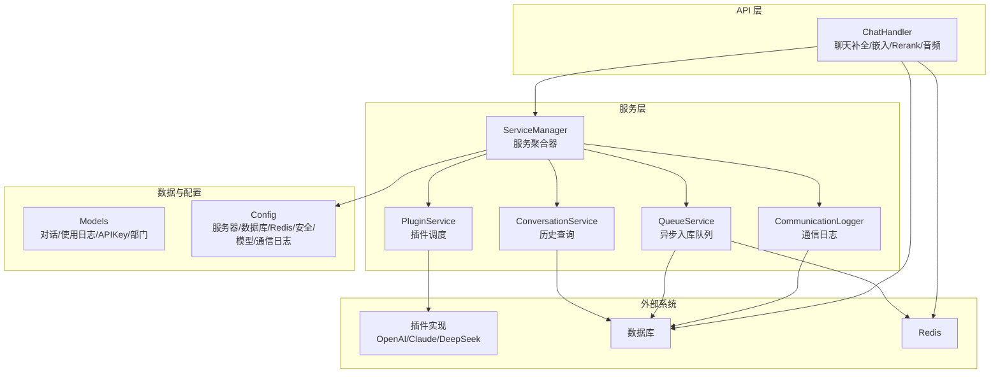
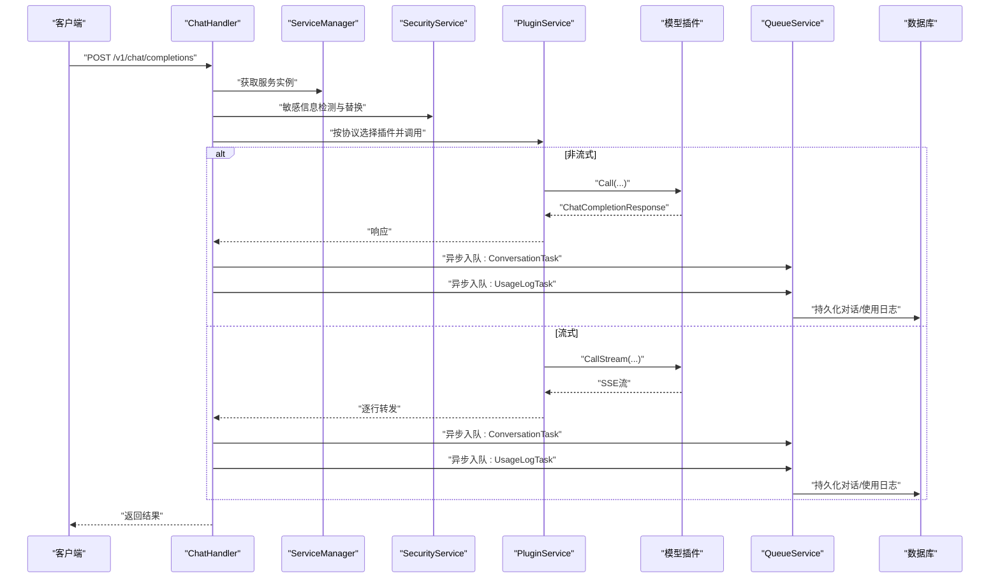
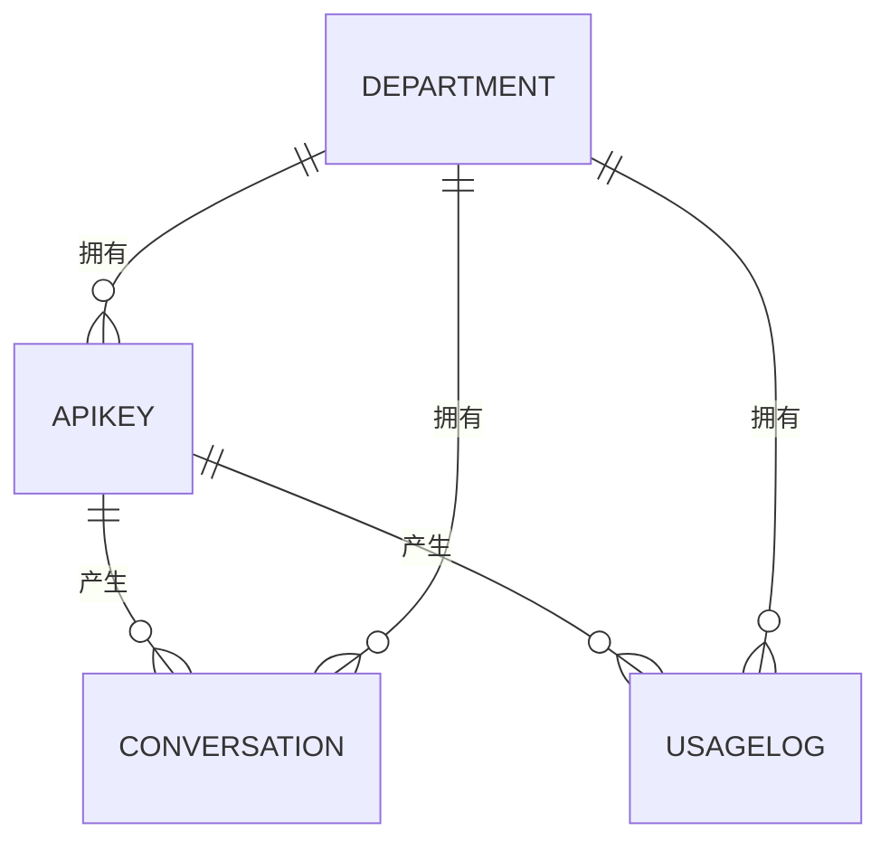
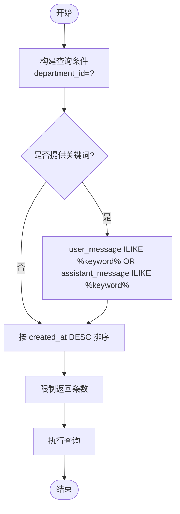
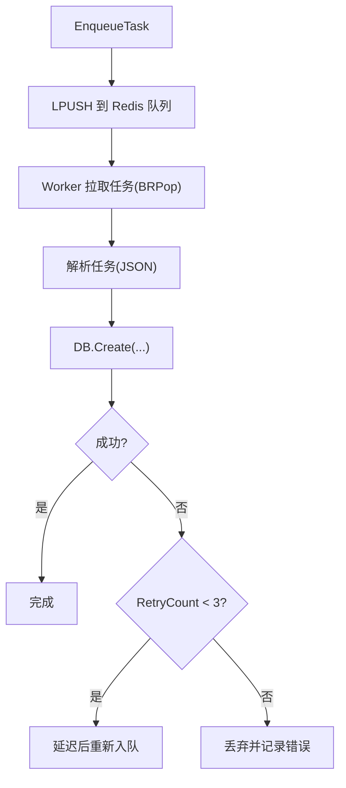
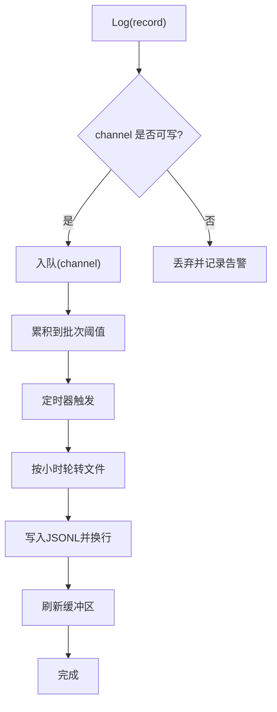
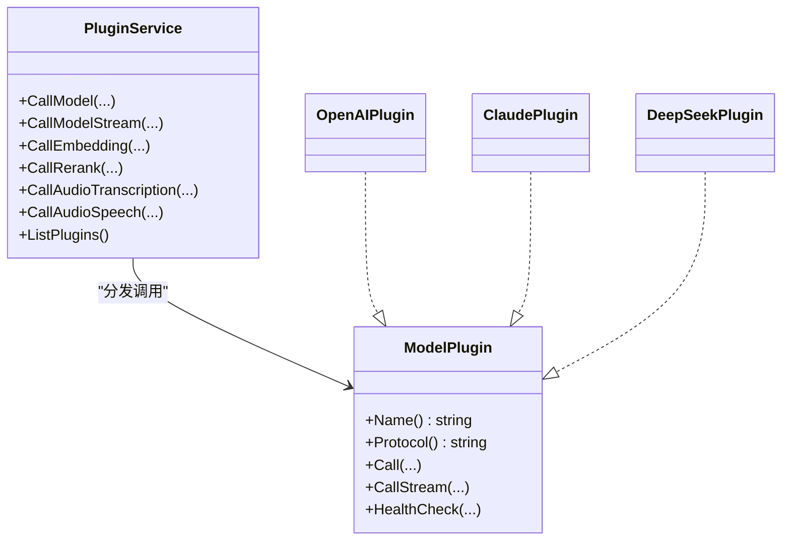
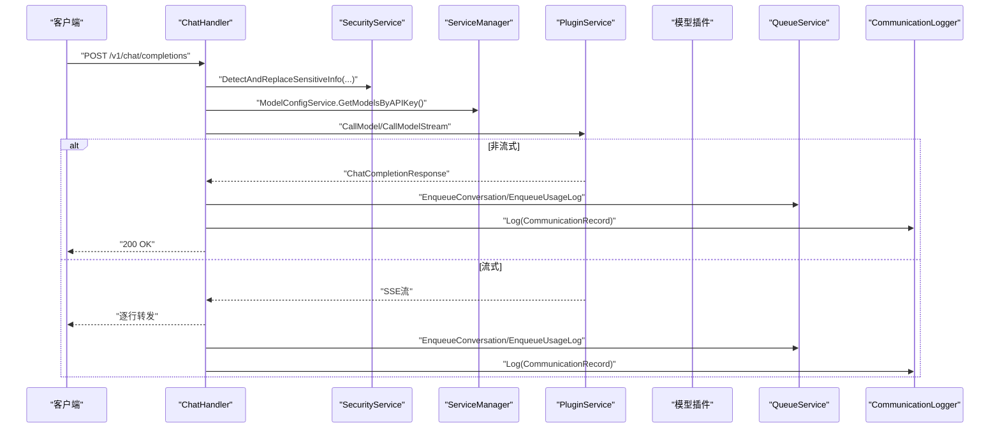
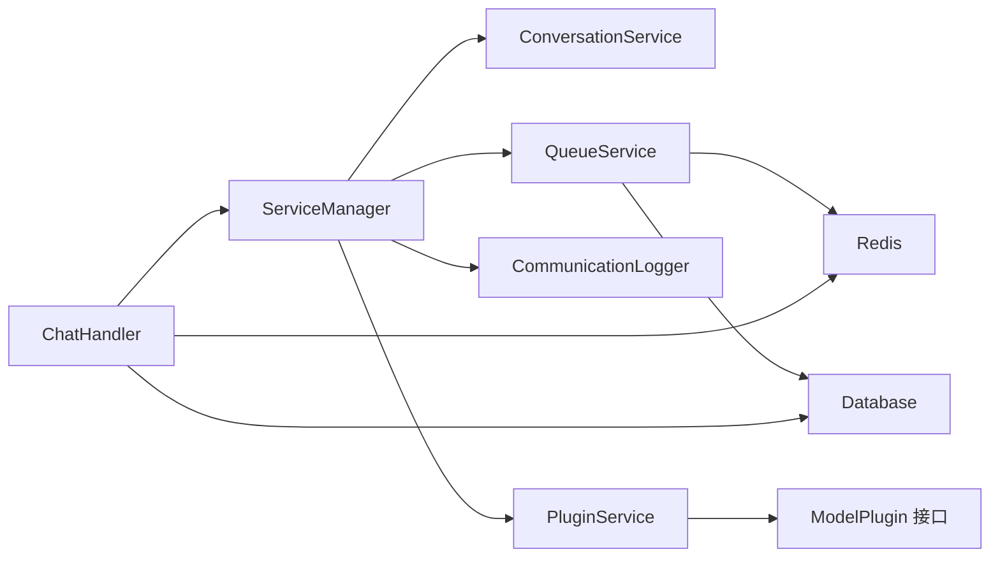

# 对话服务

<cite>
**本文引用的文件**   
- [conversation_service.go](file://internal/services/conversation_service.go)
- [chat_handler.go](file://internal/api/handlers/chat_handler.go)
- [models.go](file://internal/models/models.go)
- [interface.go](file://internal/plugins/interface.go)
- [plugin_service.go](file://internal/services/plugin_service.go)
- [queue_service.go](file://internal/services/queue_service.go)
- [communication_logger.go](file://internal/services/communication_logger.go)
- [service_manager.go](file://internal/services/service_manager.go)
- [config.go](file://internal/config/config.go)
- [qwen3-chat.yaml](file://configs/models/qwen3-chat.yaml)
- [qwen3-embedding.yaml](file://configs/models/qwen3-embedding.yaml)
- [add_admin_tables.sql](file://migrations/add_admin_tables.sql)
- [mysql-init.sql](file://scripts/mysql-init.sql)
</cite>

## 目录
1. [简介](#简介)
2. [项目结构](#项目结构)
3. [核心组件](#核心组件)
4. [架构总览](#架构总览)
5. [详细组件分析](#详细组件分析)
6. [依赖分析](#依赖分析)
7. [性能考量](#性能考量)
8. [故障排查指南](#故障排查指南)
9. [结论](#结论)
10. [附录](#附录)

## 简介
本文件面向 Wolink-Core 的“对话服务”，聚焦于对话记录的创建、存储与检索机制，涵盖消息序列化、上下文管理与历史查询；同时阐述数据模型设计、索引策略与查询优化；并说明对话服务与 AI 模型插件的交互模式（请求转发、响应聚合与错误恢复）。文档还提供对话管理流程、批量操作与数据导出的实践建议，并总结性能优化策略、缓存机制与并发处理要点。

## 项目结构
对话服务位于内部服务层与 API 层之间，围绕以下关键模块协作：
- API 层：接收请求、进行鉴权与基础校验，协调服务层与插件层
- 服务层：对话服务、队列服务、通信日志、插件服务、服务管理器等
- 数据模型：对话记录、使用日志、API 密钥、部门等
- 插件层：统一的模型插件接口，支持 OpenAI、Claude、DeepSeek 等协议
- 配置层：服务器、数据库、Redis、安全、模型配置、通信日志等

图表来源
- [chat_handler.go:1-716](file://internal/api/handlers/chat_handler.go#L1-L716)
- [service_manager.go:1-76](file://internal/services/service_manager.go#L1-L76)
- [conversation_service.go:1-49](file://internal/services/conversation_service.go#L1-L49)
- [queue_service.go:1-382](file://internal/services/queue_service.go#L1-L382)
- [communication_logger.go:1-272](file://internal/services/communication_logger.go#L1-L272)
- [plugin_service.go:1-366](file://internal/services/plugin_service.go#L1-L366)
- [models.go:1-463](file://internal/models/models.go#L1-L463)
- [config.go:1-185](file://internal/config/config.go#L1-L185)

章节来源
- [chat_handler.go:1-716](file://internal/api/handlers/chat_handler.go#L1-L716)
- [service_manager.go:1-76](file://internal/services/service_manager.go#L1-L76)
- [models.go:1-463](file://internal/models/models.go#L1-L463)
- [config.go:1-185](file://internal/config/config.go#L1-L185)

## 核心组件
- 对话服务（ConversationService）：提供按部门维度的历史查询与关键词搜索能力，基于数据库条件过滤与排序
- 队列服务（QueueService）：通过 Redis 队列异步写入对话与使用日志，具备工作池、周期性拉取、重试与统计
- 通信日志（CommunicationLogger）：非阻塞地将请求/响应、耗时、令牌用量等持久化为 JSONL 文件，支持按小时轮转
- 插件服务（PluginService）：统一的插件接口与协议分发，支持热插拔与多种能力（聊天、嵌入、Rerank、音频）
- 服务管理器（ServiceManager）：集中装配各子服务，负责生命周期管理与配置加载
- 数据模型（Models）：定义对话记录、使用日志、APIKey、部门等实体及索引字段

章节来源
- [conversation_service.go:1-49](file://internal/services/conversation_service.go#L1-L49)
- [queue_service.go:1-382](file://internal/services/queue_service.go#L1-L382)
- [communication_logger.go:1-272](file://internal/services/communication_logger.go#L1-L272)
- [plugin_service.go:1-366](file://internal/services/plugin_service.go#L1-L366)
- [service_manager.go:1-76](file://internal/services/service_manager.go#L1-L76)
- [models.go:1-463](file://internal/models/models.go#L1-L463)

## 架构总览
对话服务在请求路径上的关键流转如下：
- API 层接收请求，鉴权并通过服务管理器获取所需服务
- 安全服务对消息内容进行敏感信息检测与替换
- 插件服务根据协议选择具体插件并调用模型
- 非流式：直接返回响应并在后台异步记录对话与使用量
- 流式：边接收边转发，完成后异步记录并统计令牌用量
- 通信日志异步落盘，队列服务异步入库，确保主链路低延迟

图表来源
- [chat_handler.go:34-250](file://internal/api/handlers/chat_handler.go#L34-L250)
- [plugin_service.go:207-229](file://internal/services/plugin_service.go#L207-L229)
- [queue_service.go:105-151](file://internal/services/queue_service.go#L105-L151)
- [models.go:90-131](file://internal/models/models.go#L90-L131)

## 详细组件分析

### 数据模型与索引策略
- 对话记录（Conversation）
  - 主键：UUID（自动创建）
  - 关键查询字段：department_id、api_key_id、request_id、created_at
  - 敏感信息：布尔标记与 JSON 类型的敏感类型数组
  - 设计要点：按部门与时间倒序查询，便于历史检索与权限隔离
- 使用日志（UsageLog）
  - 索引字段：api_key_id、department_id、model_name、request_time
  - 用途：异步统计与审计，支持令牌用量归档
- APIKey 与部门
  - 用于权限控制与配额统计，支持每日/月度限额与并发限制
- 建议的复合索引（待上线迁移）
  - conversations(department_id, created_at)
  - conversations(api_key_id, created_at)
  - usage_logs(department_id, request_time)
  - usage_logs(model_name, request_time)

图表来源
- [models.go:10-160](file://internal/models/models.go#L10-L160)

章节来源
- [models.go:90-160](file://internal/models/models.go#L90-L160)
- [mysql-init.sql:20-26](file://scripts/mysql-init.sql#L20-L26)

### 对话服务（历史查询与搜索）
- GetConversationHistory：按部门 ID 查询最近 N 条对话，按创建时间倒序
- SearchConversations：按部门 ID 与关键词（用户消息或助手消息）模糊匹配，倒序返回

图表来源
- [conversation_service.go:28-49](file://internal/services/conversation_service.go#L28-L49)

章节来源
- [conversation_service.go:28-49](file://internal/services/conversation_service.go#L28-L49)

### 队列服务（异步入库与重试）
- 队列命名：conversations、usage_logs
- 工作池：固定并发上限，避免资源争用
- 拉取策略：定时器周期性 BRPop，空闲时短等待
- 重试机制：失败时最多重试 3 次，指数退避
- 统计接口：暴露队列长度与工作池状态

图表来源
- [queue_service.go:105-151](file://internal/services/queue_service.go#L105-L151)
- [queue_service.go:211-277](file://internal/services/queue_service.go#L211-L277)
- [queue_service.go:279-341](file://internal/services/queue_service.go#L279-L341)

章节来源
- [queue_service.go:17-382](file://internal/services/queue_service.go#L17-L382)

### 通信日志（非阻塞持久化）
- 非阻塞通道：满载时丢弃，避免阻塞主请求链路
- 批量写入：达到批次阈值或定时器触发刷新
- 文件轮转：按小时滚动，带缓冲区提升吞吐
- 关键字段：请求/响应原始体、令牌用量、耗时、敏感标记、错误信息

图表来源
- [communication_logger.go:79-96](file://internal/services/communication_logger.go#L79-L96)
- [communication_logger.go:145-203](file://internal/services/communication_logger.go#L145-L203)
- [communication_logger.go:205-236](file://internal/services/communication_logger.go#L205-L236)

章节来源
- [communication_logger.go:1-272](file://internal/services/communication_logger.go#L1-L272)

### 插件服务（协议分发与能力扩展）
- 接口抽象：统一的模型插件接口，支持 Chat、Embedding、Rerank、Audio
- 协议分发：根据模型配置的 protocol 选择对应插件
- 内置插件：OpenAI、Claude、DeepSeek
- 健康检查与卸载：支持运行时状态维护与插件生命周期管理

图表来源
- [plugin_service.go:21-366](file://internal/services/plugin_service.go#L21-L366)
- [interface.go:11-55](file://internal/plugins/interface.go#L11-L55)

章节来源
- [plugin_service.go:1-366](file://internal/services/plugin_service.go#L1-L366)
- [interface.go:1-55](file://internal/plugins/interface.go#L1-L55)

### API 处理器（聊天补全、嵌入、Rerank、音频）
- 鉴权与基础校验：提取 API Key，校验必填字段与范围
- 敏感信息处理：调用安全服务检测并替换敏感内容
- 模型路由：根据 API Key 与模型名称选择可用模型，随机/轮询/权重策略
- 非流式：直接返回响应，异步记录对话与使用量
- 流式：SSE 转发，实时统计令牌用量，异步记录与计费
- 通信日志：记录请求/响应、耗时、令牌用量、错误信息

图表来源
- [chat_handler.go:34-250](file://internal/api/handlers/chat_handler.go#L34-L250)
- [communication_logger.go:254-289](file://internal/services/communication_logger.go#L254-L289)
- [queue_service.go:105-151](file://internal/services/queue_service.go#L105-L151)

章节来源
- [chat_handler.go:34-250](file://internal/api/handlers/chat_handler.go#L34-L250)

### 模型配置与路由
- 模型配置文件：YAML 描述协议、连接参数、能力开关、状态
- 路由策略：根据 API Key 与模型名称选择可用模型，支持随机/轮询/权重
- 协议适配：OpenAI 兼容接口，便于扩展第三方模型

章节来源
- [qwen3-chat.yaml:1-12](file://configs/models/qwen3-chat.yaml#L1-L12)
- [qwen3-embedding.yaml:1-12](file://configs/models/qwen3-embedding.yaml#L1-L12)
- [plugin_service.go:198-205](file://internal/services/plugin_service.go#L198-L205)

## 依赖分析
- 组件耦合
  - ChatHandler 依赖 ServiceManager，间接依赖 ConversationService、QueueService、CommunicationLogger、PluginService
  - PluginService 通过接口解耦具体实现，便于扩展
  - QueueService 依赖 Redis 与数据库，承担削峰填谷职责
- 外部依赖
  - 数据库：GORM ORM，SQLite（测试）、MySQL/PostgreSQL（生产）
  - 缓存：Redis（队列与会话）
  - 日志：Logrus
- 循环依赖
  - 未发现循环依赖，模块边界清晰

图表来源
- [service_manager.go:11-28](file://internal/services/service_manager.go#L11-L28)
- [chat_handler.go:20-32](file://internal/api/handlers/chat_handler.go#L20-L32)
- [plugin_service.go:21-29](file://internal/services/plugin_service.go#L21-L29)

章节来源
- [service_manager.go:1-76](file://internal/services/service_manager.go#L1-L76)
- [chat_handler.go:1-716](file://internal/api/handlers/chat_handler.go#L1-L716)
- [plugin_service.go:1-366](file://internal/services/plugin_service.go#L1-L366)

## 性能考量
- 异步化
  - 对话与使用日志通过 Redis 队列异步入库，避免阻塞主请求
  - 通信日志采用非阻塞通道与批量写入，降低 IO 压力
- 并发控制
  - 队列工作池限制并发，防止数据库与 Redis 峰值抖动
  - 插件调用超时与健康检查保障稳定性
- 索引优化
  - 建议为对话与使用日志添加复合索引，加速按部门/时间/模型的查询
- 缓存与预热
  - Redis 作为队列与会话缓存，建议合理设置连接池与过期策略
- 监控与可观测性
  - 结合 Prometheus/Grafana 对队列长度、DB/Redis 延迟、错误率进行监控

## 故障排查指南
- 队列积压
  - 检查队列长度与工作池状态，确认 DB/Redis 连通性与慢查询
  - 适当增大工作池或增加工作协程数量
- 插件不可用
  - 确认协议与插件注册情况，查看健康检查状态
  - 检查模型配置文件是否正确加载
- 通信日志丢失
  - 观察通道满载告警，调整批次阈值与刷新间隔
  - 检查磁盘空间与文件权限
- 历史查询缓慢
  - 确认是否命中索引，必要时补充复合索引
  - 控制返回条数与关键词复杂度

章节来源
- [queue_service.go:361-374](file://internal/services/queue_service.go#L361-L374)
- [communication_logger.go:80-96](file://internal/services/communication_logger.go#L80-L96)
- [plugin_service.go:337-350](file://internal/services/plugin_service.go#L337-L350)
- [mysql-init.sql:20-26](file://scripts/mysql-init.sql#L20-L26)

## 结论
对话服务通过“异步队列+通信日志+插件分发”的架构，实现了高吞吐、低延迟的对话处理与持久化。数据模型围绕部门与时间维度设计，配合建议的复合索引，能够支撑高效的历史查询与审计需求。结合合理的并发控制与监控告警，系统可在生产环境中稳定运行并持续演进。

## 附录

### 对话管理流程（非流式）
- 步骤
  - 鉴权与参数校验
  - 敏感信息检测与替换
  - 选择可用模型与协议
  - 调用插件获取响应
  - 异步入队对话与使用日志
  - 记录通信日志与使用量
  - 返回响应给客户端

章节来源
- [chat_handler.go:34-250](file://internal/api/handlers/chat_handler.go#L34-L250)
- [queue_service.go:105-151](file://internal/services/queue_service.go#L105-L151)
- [communication_logger.go:254-289](file://internal/services/communication_logger.go#L254-L289)

### 对话管理流程（流式）
- 步骤
  - 设置 SSE 头并建立流式连接
  - 逐行转发插件返回的流式数据
  - 统计令牌用量并异步入队
  - 记录通信日志与使用量
  - 发送 [DONE] 结束信号

章节来源
- [chat_handler.go:115-206](file://internal/api/handlers/chat_handler.go#L115-L206)
- [queue_service.go:105-151](file://internal/services/queue_service.go#L105-L151)
- [communication_logger.go:291-314](file://internal/services/communication_logger.go#L291-L314)

### 批量操作与数据导出（建议）
- 批量导出
  - 使用历史查询接口按部门/时间范围分页拉取
  - 将对话记录与使用日志合并，输出为 CSV/JSON
- 批量清理
  - 基于 created_at 范围删除旧记录，注意保留索引与备份
- 批量重试
  - 对队列中失败的任务进行重放，结合重试上限与幂等设计

章节来源
- [conversation_service.go:28-49](file://internal/services/conversation_service.go#L28-L49)
- [queue_service.go:266-273](file://internal/services/queue_service.go#L266-L273)

### 管理员与会话（可选）
- 管理员用户与会话表结构与初始化脚本
- 适用于后台管理与审计场景

章节来源
- [add_admin_tables.sql:1-38](file://migrations/add_admin_tables.sql#L1-L38)
- [mysql-init.sql:1-32](file://scripts/mysql-init.sql#L1-L32)