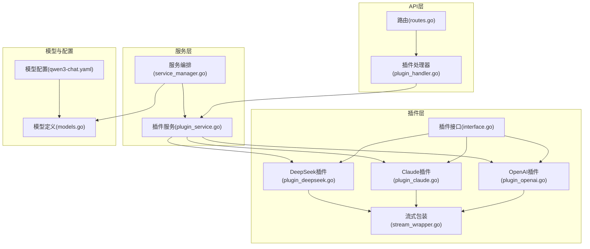
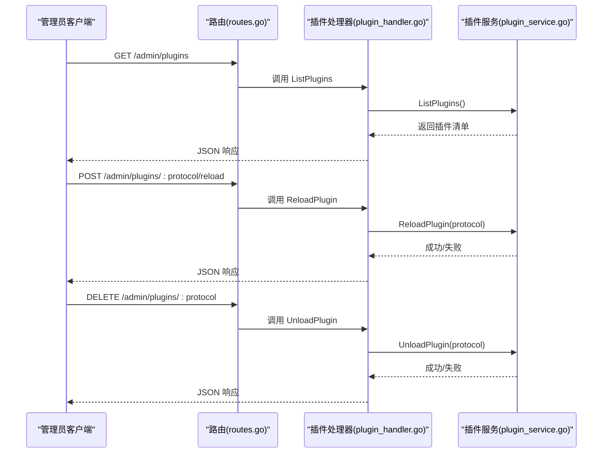
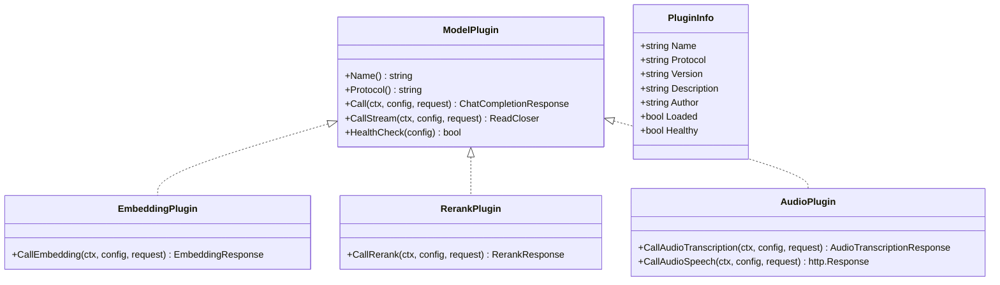
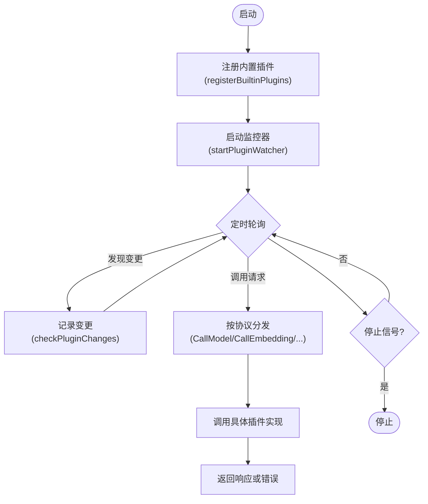
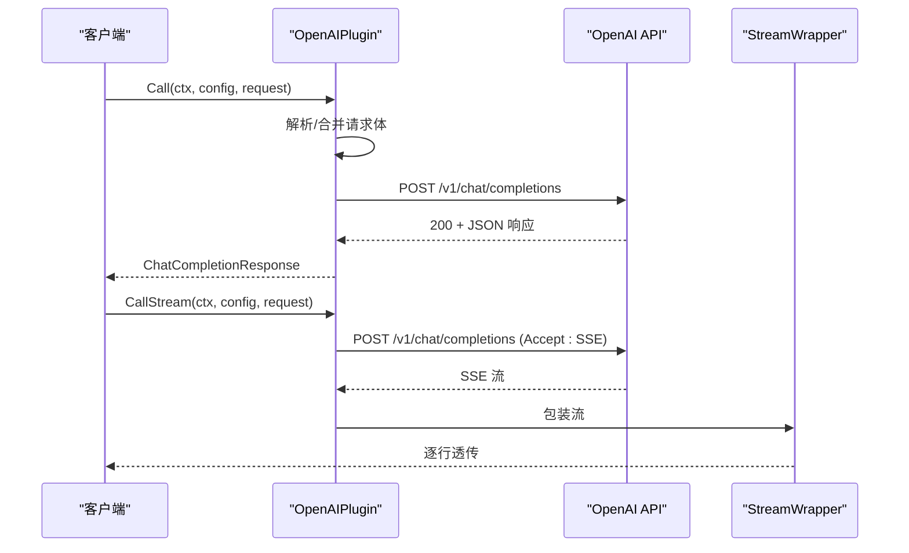
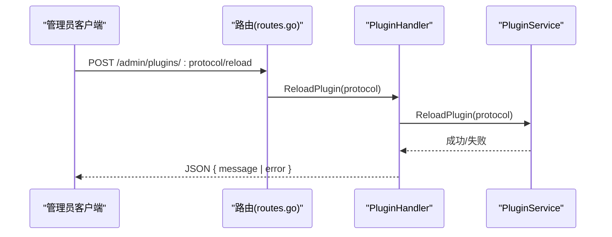
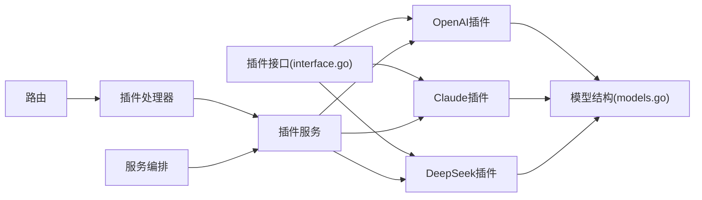

# 插件服务

<cite>
**本文档引用的文件**
- [internal/plugins/interface.go](file://internal/plugins/interface.go)
- [internal/services/plugin_service.go](file://internal/services/plugin_service.go)
- [internal/api/handlers/plugin_handler.go](file://internal/api/handlers/plugin_handler.go)
- [internal/plugins/plugin_openai.go](file://internal/plugins/plugin_openai.go)
- [internal/plugins/plugin_claude.go](file://internal/plugins/plugin_claude.go)
- [internal/plugins/plugin_deepseek.go](file://internal/plugins/plugin_deepseek.go)
- [internal/plugins/stream_wrapper.go](file://internal/plugins/stream_wrapper.go)
- [internal/models/models.go](file://internal/models/models.go)
- [internal/services/service_manager.go](file://internal/services/service_manager.go)
- [internal/api/routes.go](file://internal/api/routes.go)
- [configs/models/qwen3-chat.yaml](file://configs/models/qwen3-chat.yaml)
- [internal/plugins/plugin_openai_test.go](file://internal/plugins/plugin_openai_test.go)
- [internal/plugins/plugin_openai_bench_test.go](file://internal/plugins/plugin_openai_bench_test.go)
</cite>

## 目录
1. [简介](#简介)
2. [项目结构](#项目结构)
3. [核心组件](#核心组件)
4. [架构总览](#架构总览)
5. [详细组件分析](#详细组件分析)
6. [依赖关系分析](#依赖关系分析)
7. [性能考量](#性能考量)
8. [故障排查指南](#故障排查指南)
9. [结论](#结论)
10. [附录](#附录)

## 简介
本文件面向 Wolink-Core 的插件服务，系统性阐述插件管理的生命周期、加载机制与通信协议，覆盖插件发现、初始化与卸载流程；详述插件服务与 AI 模型插件的交互模式（请求路由、响应处理、错误传播）；解释插件服务的隔离机制、资源管理与性能监控；并提供插件注册、动态加载与版本兼容性的实践路径，以及扩展点、自定义插件开发指南与调试方法。

## 项目结构
插件系统主要分布在以下模块：
- 插件接口与实现：internal/plugins
- 插件服务与监控：internal/services/plugin_service.go
- API 路由与管理端接口：internal/api/handlers/plugin_handler.go、internal/api/routes.go
- 数据模型与配置：internal/models/models.go、configs/models/*.yaml
- 服务编排：internal/services/service_manager.go
- 测试与基准：internal/plugins/plugin_openai_test.go、internal/plugins/plugin_openai_bench_test.go

**图表来源**
- [internal/plugins/interface.go:11-54](file://internal/plugins/interface.go#L11-L54)
- [internal/plugins/plugin_openai.go:18-370](file://internal/plugins/plugin_openai.go#L18-L370)
- [internal/plugins/plugin_claude.go:17-248](file://internal/plugins/plugin_claude.go#L17-L248)
- [internal/plugins/plugin_deepseek.go:17-235](file://internal/plugins/plugin_deepseek.go#L17-L235)
- [internal/plugins/stream_wrapper.go:9-95](file://internal/plugins/stream_wrapper.go#L9-L95)
- [internal/services/plugin_service.go:21-366](file://internal/services/plugin_service.go#L21-L366)
- [internal/services/service_manager.go:11-76](file://internal/services/service_manager.go#L11-L76)
- [internal/api/handlers/plugin_handler.go:12-74](file://internal/api/handlers/plugin_handler.go#L12-L74)
- [internal/api/routes.go:14-129](file://internal/api/routes.go#L14-L129)
- [internal/models/models.go:56-463](file://internal/models/models.go#L56-L463)
- [configs/models/qwen3-chat.yaml:1-12](file://configs/models/qwen3-chat.yaml#L1-L12)

**章节来源**
- [internal/plugins/interface.go:1-55](file://internal/plugins/interface.go#L1-L55)
- [internal/services/plugin_service.go:1-366](file://internal/services/plugin_service.go#L1-L366)
- [internal/api/routes.go:1-129](file://internal/api/routes.go#L1-L129)

## 核心组件
- 插件接口族：统一抽象不同模型提供商的调用能力，支持聊天、嵌入、重排序、音频等能力，并提供健康检查。
- 内置插件：OpenAI 兼容、Claude、DeepSeek，均实现统一接口并适配各自协议差异。
- 插件服务：负责插件注册、查询、调用、健康检查、卸载与监控；内置插件在服务启动时注册；提供外部插件注册入口。
- 插件处理器与路由：提供管理端插件列表、重载、卸载与健康检查接口。
- 流式包装器：将上游 SSE/流式响应按行解析并透传，屏蔽细节差异。
- 模型配置与数据模型：定义运行时模型配置、连接配置、请求/响应结构，支撑插件参数透传与转换。

**章节来源**
- [internal/plugins/interface.go:11-54](file://internal/plugins/interface.go#L11-L54)
- [internal/plugins/plugin_openai.go:18-370](file://internal/plugins/plugin_openai.go#L18-L370)
- [internal/plugins/plugin_claude.go:17-248](file://internal/plugins/plugin_claude.go#L17-L248)
- [internal/plugins/plugin_deepseek.go:17-235](file://internal/plugins/plugin_deepseek.go#L17-L235)
- [internal/services/plugin_service.go:21-366](file://internal/services/plugin_service.go#L21-L366)
- [internal/api/handlers/plugin_handler.go:12-74](file://internal/api/handlers/plugin_handler.go#L12-L74)
- [internal/plugins/stream_wrapper.go:9-95](file://internal/plugins/stream_wrapper.go#L9-L95)
- [internal/models/models.go:56-463](file://internal/models/models.go#L56-L463)

## 架构总览
插件服务采用“接口抽象 + 多实现 + 中央调度”的架构：
- 接口层：统一协议与能力边界，便于扩展新插件。
- 实现层：各模型提供商插件实现具体协议转换与调用。
- 服务层：集中管理插件生命周期、并发安全、健康检查与监控。
- API 层：对外暴露管理端接口，支持插件状态查询与运维操作。
- 配置层：模型配置文件驱动运行时行为，插件按需读取并透传参数。

**图表来源**
- [internal/api/routes.go:121-126](file://internal/api/routes.go#L121-L126)
- [internal/api/handlers/plugin_handler.go:24-74](file://internal/api/handlers/plugin_handler.go#L24-L74)
- [internal/services/plugin_service.go:291-335](file://internal/services/plugin_service.go#L291-L335)

## 详细组件分析

### 插件接口与能力边界
- ModelPlugin：统一的模型调用接口，支持非流式与流式调用，以及健康检查。
- EmbeddingPlugin/RerankPlugin/AudioPlugin：可选能力接口，插件按需实现。
- PluginInfo：描述插件元信息，包括名称、协议、版本、作者、加载与健康状态。

**图表来源**
- [internal/plugins/interface.go:11-54](file://internal/plugins/interface.go#L11-L54)

**章节来源**
- [internal/plugins/interface.go:11-54](file://internal/plugins/interface.go#L11-L54)

### 插件服务与生命周期管理
- 初始化：构造函数注册内置插件（OpenAI、Claude、DeepSeek），并启动插件监控器。
- 注册：registerBuiltinPlugins 与 RegisterPlugin 将插件加入内部映射与信息表。
- 查询：GetPlugin 通过协议键安全获取插件实例。
- 调用：根据模型配置选择对应插件执行 Call/CallStream/Embedding/Rerank/Audio 等。
- 健康检查：HealthCheckAll 批量更新健康状态。
- 卸载：UnloadPlugin 删除映射并标记卸载。
- 监控：PluginWatcher 定期扫描插件目录，记录变更（当前为静态注册，预留动态重载）。

**图表来源**
- [internal/services/plugin_service.go:38-170](file://internal/services/plugin_service.go#L38-L170)
- [internal/services/plugin_service.go:207-289](file://internal/services/plugin_service.go#L207-L289)
- [internal/services/plugin_service.go:304-335](file://internal/services/plugin_service.go#L304-L335)

**章节来源**
- [internal/services/plugin_service.go:21-366](file://internal/services/plugin_service.go#L21-L366)

### OpenAI 兼容插件
- 协议与端点：支持 OpenAI 兼容的 /v1/chat/completions、/v1/audio/transcriptions、/v1/audio/speech。
- 参数透传：解析原始请求体，合并连接配置中的默认参数（温度、最大令牌数、TopP 等），并替换模型名。
- 流式处理：设置 Accept: text/event-stream，使用 StreamWrapper 逐行解析并透传。
- 健康检查：构造最小请求进行连通性验证。
- 错误处理：捕获网络错误、状态码异常与 JSON 解析错误，返回明确错误信息。

**图表来源**
- [internal/plugins/plugin_openai.go:42-121](file://internal/plugins/plugin_openai.go#L42-L121)
- [internal/plugins/plugin_openai.go:123-193](file://internal/plugins/plugin_openai.go#L123-L193)
- [internal/plugins/stream_wrapper.go:18-95](file://internal/plugins/stream_wrapper.go#L18-L95)

**章节来源**
- [internal/plugins/plugin_openai.go:18-370](file://internal/plugins/plugin_openai.go#L18-L370)
- [internal/plugins/stream_wrapper.go:9-95](file://internal/plugins/stream_wrapper.go#L9-L95)

### Claude 插件
- 协议适配：将通用消息格式转换为 Claude 的 messages + system 字段，强制 max_tokens。
- 响应转换：将 Claude 响应转换为 OpenAI 兼容格式，便于上层统一处理。
- 健康检查：基于 API Key 存在性与简单连通性判断。

**章节来源**
- [internal/plugins/plugin_claude.go:17-248](file://internal/plugins/plugin_claude.go#L17-L248)

### DeepSeek 插件
- 协议适配：与 OpenAI 兼容插件类似，但使用 DeepSeek 的基础 URL。
- 参数透传与流式处理：同 OpenAI 插件。

**章节来源**
- [internal/plugins/plugin_deepseek.go:17-235](file://internal/plugins/plugin_deepseek.go#L17-L235)

### 插件处理器与管理端接口
- 列出插件：返回插件清单与数量。
- 重载插件：标记为已重载（当前为占位，预留动态重载）。
- 卸载插件：删除映射并标记卸载。
- 健康检查：批量更新健康状态并返回结果。

**图表来源**
- [internal/api/routes.go:123-124](file://internal/api/routes.go#L123-L124)
- [internal/api/handlers/plugin_handler.go:33-47](file://internal/api/handlers/plugin_handler.go#L33-L47)
- [internal/services/plugin_service.go:304-318](file://internal/services/plugin_service.go#L304-L318)

**章节来源**
- [internal/api/handlers/plugin_handler.go:12-74](file://internal/api/handlers/plugin_handler.go#L12-L74)
- [internal/api/routes.go:121-126](file://internal/api/routes.go#L121-L126)

### 流式包装器
- 功能：按行读取上游 SSE 数据，跳过空行与非 data 行，添加必要换行，支持缓冲与关闭。
- 性能：基于 bufio.Reader，减少系统调用次数，提升吞吐。

**章节来源**
- [internal/plugins/stream_wrapper.go:9-95](file://internal/plugins/stream_wrapper.go#L9-L95)

### 模型配置与数据模型
- 运行时模型配置：包含协议、能力、连接配置与参数列表。
- 连接配置：包含基础 URL、API Key、超时、默认模型、采样参数等。
- 请求/响应结构：统一 OpenAI 兼容格式，以及 Claude、嵌入、重排序、音频等专用结构。

**章节来源**
- [internal/models/models.go:56-463](file://internal/models/models.go#L56-L463)
- [configs/models/qwen3-chat.yaml:1-12](file://configs/models/qwen3-chat.yaml#L1-L12)

## 依赖关系分析
- 插件接口与实现：插件实现依赖 models 结构，遵循统一接口。
- 插件服务：依赖插件接口，持有插件实例映射与信息表，提供并发安全访问。
- 插件处理器：依赖服务管理器中的 PluginService，提供管理端接口。
- 服务编排：ServiceManager 在启动时创建 PluginService，并注入到其他服务中。
- 路由：将管理端插件接口映射到处理器。

**图表来源**
- [internal/plugins/interface.go:11-54](file://internal/plugins/interface.go#L11-L54)
- [internal/plugins/plugin_openai.go:18-370](file://internal/plugins/plugin_openai.go#L18-L370)
- [internal/plugins/plugin_claude.go:17-248](file://internal/plugins/plugin_claude.go#L17-L248)
- [internal/plugins/plugin_deepseek.go:17-235](file://internal/plugins/plugin_deepseek.go#L17-L235)
- [internal/models/models.go:56-463](file://internal/models/models.go#L56-L463)
- [internal/services/plugin_service.go:21-366](file://internal/services/plugin_service.go#L21-L366)
- [internal/api/handlers/plugin_handler.go:12-74](file://internal/api/handlers/plugin_handler.go#L12-L74)
- [internal/services/service_manager.go:11-76](file://internal/services/service_manager.go#L11-L76)
- [internal/api/routes.go:14-129](file://internal/api/routes.go#L14-L129)

**章节来源**
- [internal/services/service_manager.go:11-76](file://internal/services/service_manager.go#L11-L76)
- [internal/api/routes.go:14-129](file://internal/api/routes.go#L14-L129)

## 性能考量
- 并发安全：插件服务使用读写锁保护插件映射与信息表，读多写少场景下提升并发性能。
- 流式处理：StreamWrapper 逐行读取并透传，减少内存占用；Accept: text/event-stream 降低延迟。
- 健康检查：批量更新健康状态，避免频繁探测影响性能。
- 监控频率：插件文件监控周期较长（30 秒），降低 CPU 开销。
- 基准测试：提供 Call、CallStream、大响应、流读取等基准用例，便于定位瓶颈。

**章节来源**
- [internal/services/plugin_service.go:21-366](file://internal/services/plugin_service.go#L21-L366)
- [internal/plugins/stream_wrapper.go:9-95](file://internal/plugins/stream_wrapper.go#L9-L95)
- [internal/plugins/plugin_openai_bench_test.go:120-293](file://internal/plugins/plugin_openai_bench_test.go#L120-L293)

## 故障排查指南
- 插件未找到：当模型配置协议与已注册插件不匹配时，调用会返回“插件未找到”错误。请确认协议键一致。
- 认证失败：OpenAI/Claude/DeepSeek 插件在健康检查或调用时若 API Key 为空或无效，会返回相应错误。请检查连接配置。
- 状态码异常：当上游返回非 200 时，插件会记录错误并返回明确提示。请查看日志与上游响应。
- JSON 解析错误：响应体不符合预期格式时，会返回解析错误。请核对上游返回结构。
- 超时与网络错误：客户端超时或网络不可达会导致调用失败。请检查网络与超时配置。
- 管理端接口：通过 /admin/plugins/* 接口进行插件状态查询、重载与卸载，便于运维排障。

**章节来源**
- [internal/services/plugin_service.go:207-289](file://internal/services/plugin_service.go#L207-L289)
- [internal/plugins/plugin_openai.go:195-229](file://internal/plugins/plugin_openai.go#L195-L229)
- [internal/plugins/plugin_deepseek.go:204-234](file://internal/plugins/plugin_deepseek.go#L204-L234)
- [internal/api/handlers/plugin_handler.go:24-74](file://internal/api/handlers/plugin_handler.go#L24-L74)

## 结论
Wolink-Core 的插件服务通过清晰的接口抽象与多实现策略，实现了对多家模型提供商的统一接入与管理。内置插件在启动时完成注册，服务层提供并发安全的查询与调用能力，管理端接口支持插件状态与运维操作。流式包装器与健康检查机制进一步提升了稳定性与可观测性。未来可在现有基础上扩展动态加载与版本兼容性处理，以满足更复杂的部署与演进需求。

## 附录

### 插件注册流程（代码路径）
- 注册内置插件：[internal/services/plugin_service.go:55-92](file://internal/services/plugin_service.go#L55-L92)
- 外部插件注册：[internal/services/plugin_service.go:184-196](file://internal/services/plugin_service.go#L184-L196)
- 插件信息结构：[internal/plugins/interface.go:45-54](file://internal/plugins/interface.go#L45-L54)

**章节来源**
- [internal/services/plugin_service.go:55-92](file://internal/services/plugin_service.go#L55-L92)
- [internal/services/plugin_service.go:184-196](file://internal/services/plugin_service.go#L184-L196)
- [internal/plugins/interface.go:45-54](file://internal/plugins/interface.go#L45-L54)

### 动态加载与版本兼容性（建议实现路径）
- 动态加载：当前预留 loadDynamicPlugin 接口，可结合 Go 的插件机制或外部进程管理实现动态加载与卸载。
- 版本兼容：通过 PluginInfo.Version 字段记录版本，配合协议版本控制与向后兼容策略，确保升级平滑过渡。
- 配置迁移：模型配置文件（YAML）与运行时配置解耦，便于在不重启服务的情况下调整参数。

**章节来源**
- [internal/services/plugin_service.go:359-365](file://internal/services/plugin_service.go#L359-L365)
- [internal/plugins/interface.go:45-54](file://internal/plugins/interface.go#L45-L54)
- [configs/models/qwen3-chat.yaml:1-12](file://configs/models/qwen3-chat.yaml#L1-L12)

### 自定义插件开发指南
- 实现接口：参考 ModelPlugin、EmbeddingPlugin、RerankPlugin、AudioPlugin 接口定义。
- 协议适配：在 Call/CallStream 中解析原始请求体，合并连接配置参数，构造上游请求。
- 响应转换：如需，将上游响应转换为统一的 OpenAI 兼容格式。
- 健康检查：实现 HealthCheck，进行最小化连通性验证。
- 流式处理：使用 StreamWrapper 保证 SSE/流式响应正确透传。
- 注册与测试：通过 RegisterPlugin 注册，编写单元测试与基准测试验证功能与性能。

**章节来源**
- [internal/plugins/interface.go:11-54](file://internal/plugins/interface.go#L11-L54)
- [internal/plugins/plugin_openai.go:42-193](file://internal/plugins/plugin_openai.go#L42-L193)
- [internal/plugins/stream_wrapper.go:18-95](file://internal/plugins/stream_wrapper.go#L18-L95)
- [internal/plugins/plugin_openai_test.go:25-42](file://internal/plugins/plugin_openai_test.go#L25-L42)
- [internal/plugins/plugin_openai_bench_test.go:18-25](file://internal/plugins/plugin_openai_bench_test.go#L18-L25)

### 调试方法
- 日志：插件与服务均使用 logrus 记录详细日志，便于定位问题。
- 单元测试：覆盖成功、失败、超时、流式等场景，快速验证行为。
- 基准测试：评估 Call/Stream/大响应/流读取等性能瓶颈。
- 管理端接口：通过 /admin/plugins/* 快速检查插件状态与执行运维操作。

**章节来源**
- [internal/plugins/plugin_openai_test.go:25-42](file://internal/plugins/plugin_openai_test.go#L25-L42)
- [internal/plugins/plugin_openai_bench_test.go:120-293](file://internal/plugins/plugin_openai_bench_test.go#L120-L293)
- [internal/api/handlers/plugin_handler.go:24-74](file://internal/api/handlers/plugin_handler.go#L24-L74)