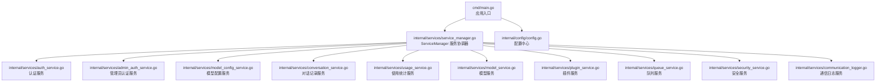
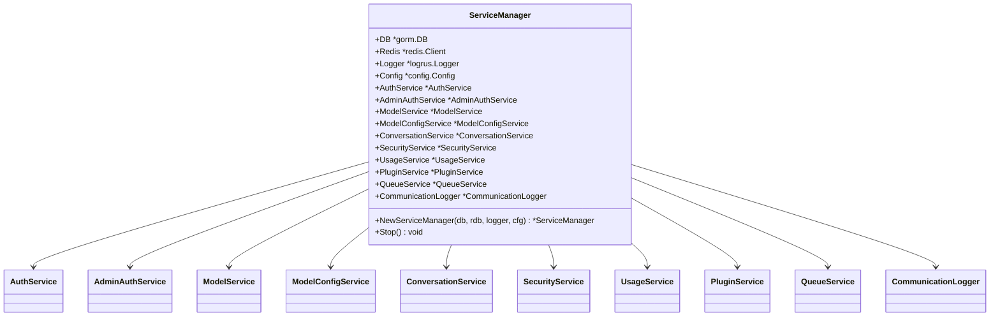
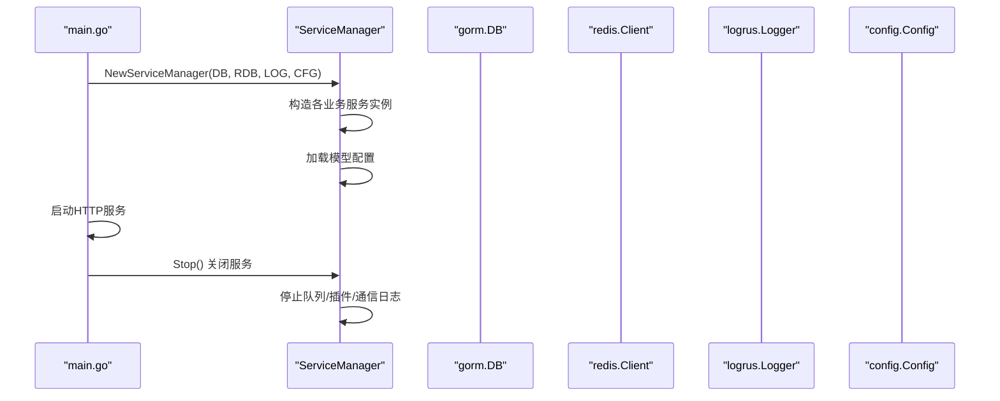
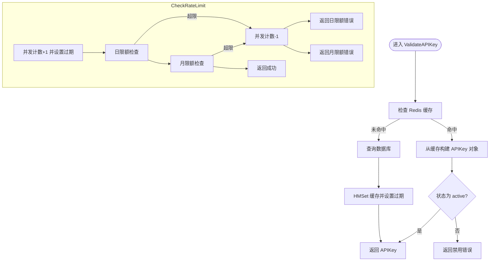
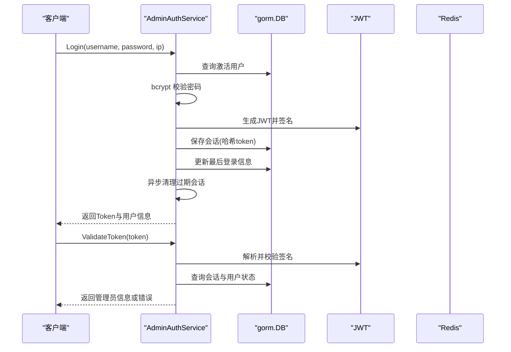
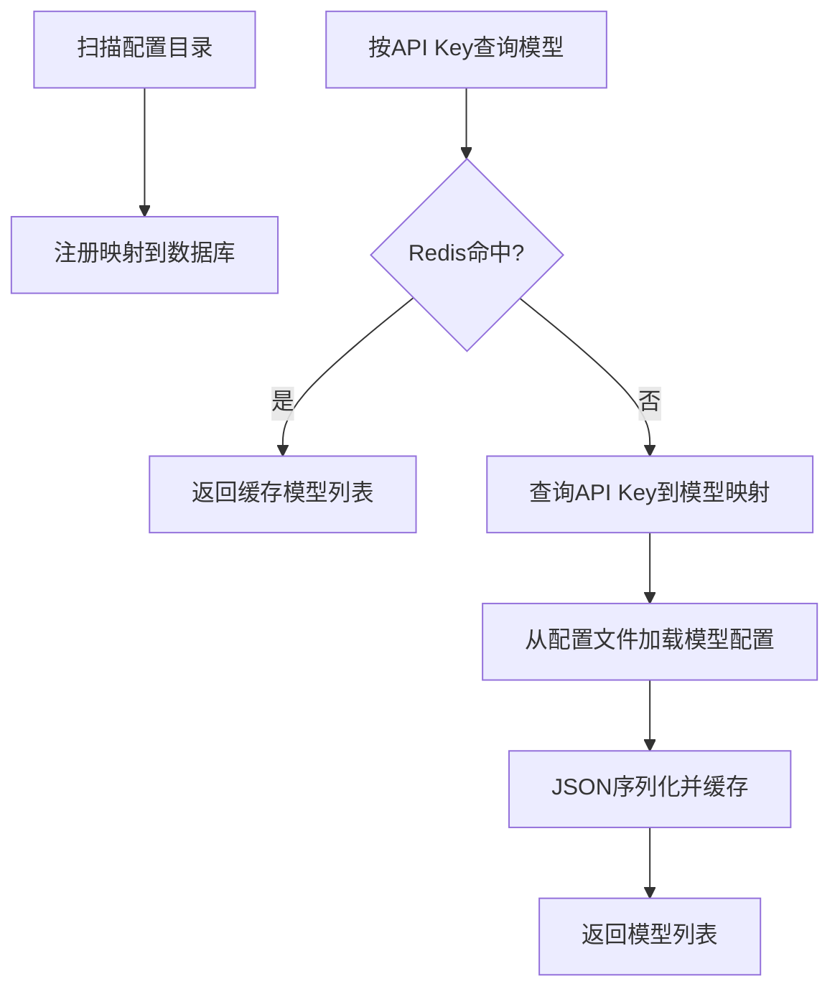
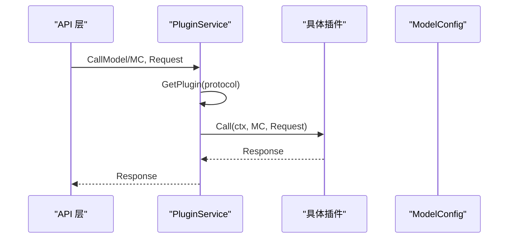
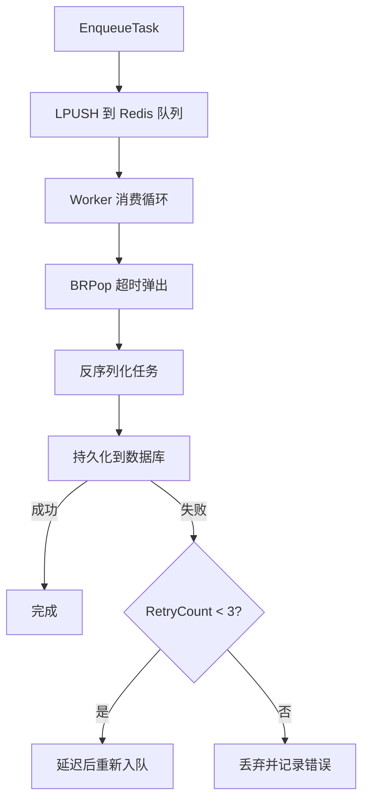
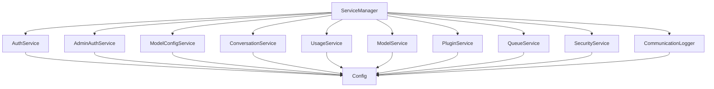

# 服务层实现

<cite>
**本文引用的文件**
- [cmd/main.go](file://cmd/main.go)
- [internal/services/service_manager.go](file://internal/services/service_manager.go)
- [internal/services/auth_service.go](file://internal/services/auth_service.go)
- [internal/services/admin_auth_service.go](file://internal/services/admin_auth_service.go)
- [internal/services/model_config_service.go](file://internal/services/model_config_service.go)
- [internal/services/conversation_service.go](file://internal/services/conversation_service.go)
- [internal/services/usage_service.go](file://internal/services/usage_service.go)
- [internal/services/model_service.go](file://internal/services/model_service.go)
- [internal/services/plugin_service.go](file://internal/services/plugin_service.go)
- [internal/services/queue_service.go](file://internal/services/queue_service.go)
- [internal/services/security_service.go](file://internal/services/security_service.go)
- [internal/services/communication_logger.go](file://internal/services/communication_logger.go)
- [internal/config/config.go](file://internal/config/config.go)
- [internal/services/auth_service_test.go](file://internal/services/auth_service_test.go)
</cite>

## 目录
1. [简介](#简介)
2. [项目结构](#项目结构)
3. [核心组件](#核心组件)
4. [架构总览](#架构总览)
5. [详细组件分析](#详细组件分析)
6. [依赖分析](#依赖分析)
7. [性能考量](#性能考量)
8. [故障排查指南](#故障排查指南)
9. [结论](#结论)
10. [附录](#附录)

## 简介
本文件系统性梳理 Wolink-Core 的服务层实现，重点围绕 ServiceManager 服务协调器的设计与实现展开，涵盖依赖注入机制、组件生命周期管理、各业务服务的职责与实现细节（认证服务、模型配置服务、对话记录服务、使用统计服务、插件服务、队列服务、安全服务、通信日志服务），以及服务间交互关系、数据流转与错误处理机制。同时提供可操作的使用模式、扩展与自定义最佳实践、性能优化策略与并发处理建议。

## 项目结构
服务层位于 internal/services 目录，入口程序在 cmd/main.go 中通过 ServiceManager 统一装配与启动各服务，并在优雅停机时统一停止。

**图表来源**
- [cmd/main.go:19-89](file://cmd/main.go#L19-L89)
- [internal/services/service_manager.go:30-76](file://internal/services/service_manager.go#L30-L76)

**章节来源**
- [cmd/main.go:19-89](file://cmd/main.go#L19-L89)
- [internal/services/service_manager.go:30-76](file://internal/services/service_manager.go#L30-L76)

## 核心组件
- ServiceManager：负责依赖注入与服务实例化，统一管理服务生命周期（启动与停止）。
- 认证服务（AuthService）：API 密钥校验、并发/日/月限流、使用量异步记录、密钥生成与缓存。
- 管理员认证服务（AdminAuthService）：管理员登录、JWT 验证、会话持久化与清理、用户 CRUD。
- 模型配置服务（ModelConfigService）：扫描配置文件、注册映射、按 API Key 查询可用模型、路由选择。
- 对话记录服务（ConversationService）：按部门检索与搜索对话历史。
- 使用统计服务（UsageService）：统计调用次数、Token 总量、平均响应时间、记录使用日志。
- 模型服务（ModelService）：当前主要承担缓存管理职责。
- 插件服务（PluginService）：内置 OpenAI/DeepSeek/Claude 插件注册、插件监控、模型调用与流式调用、插件生命周期管理。
- 队列服务（QueueService）：异步写入对话与使用日志，带重试与工作池并发控制。
- 安全服务（SecurityService）：敏感信息检测与替换。
- 通信日志服务（CommunicationLogger）：异步 JSONL 文件落盘，带批处理与文件轮转。

**章节来源**
- [internal/services/service_manager.go:11-76](file://internal/services/service_manager.go#L11-L76)
- [internal/services/auth_service.go:19-219](file://internal/services/auth_service.go#L19-L219)
- [internal/services/admin_auth_service.go:19-248](file://internal/services/admin_auth_service.go#L19-L248)
- [internal/services/model_config_service.go:22-253](file://internal/services/model_config_service.go#L22-L253)
- [internal/services/conversation_service.go:12-49](file://internal/services/conversation_service.go#L12-L49)
- [internal/services/usage_service.go:11-52](file://internal/services/usage_service.go#L11-L52)
- [internal/services/model_service.go:11-27](file://internal/services/model_service.go#L11-L27)
- [internal/services/plugin_service.go:21-366](file://internal/services/plugin_service.go#L21-L366)
- [internal/services/queue_service.go:17-382](file://internal/services/queue_service.go#L17-L382)
- [internal/services/security_service.go:9-59](file://internal/services/security_service.go#L9-L59)
- [internal/services/communication_logger.go:31-272](file://internal/services/communication_logger.go#L31-L272)

## 架构总览
ServiceManager 作为服务协调器，集中持有数据库、Redis、日志与配置实例，并逐一构造各业务服务。应用启动时由入口程序创建 ServiceManager 并注入到路由层；应用关闭时统一调用 Stop() 停止队列、插件与通信日志服务。

**图表来源**
- [internal/services/service_manager.go:11-76](file://internal/services/service_manager.go#L11-L76)

**章节来源**
- [internal/services/service_manager.go:30-76](file://internal/services/service_manager.go#L30-L76)
- [cmd/main.go:40-78](file://cmd/main.go#L40-L78)

## 详细组件分析

### ServiceManager 服务协调器
- 依赖注入：接收数据库、Redis、日志与配置实例，构造各业务服务。
- 服务初始化：按顺序创建认证、管理员认证、模型、模型配置、对话、安全、使用、插件、队列与通信日志服务；随后加载模型配置。
- 生命周期管理：Stop() 统一停止队列、插件与通信日志服务，确保资源有序释放。

**图表来源**
- [cmd/main.go:40-78](file://cmd/main.go#L40-L78)
- [internal/services/service_manager.go:30-76](file://internal/services/service_manager.go#L30-L76)

**章节来源**
- [internal/services/service_manager.go:30-76](file://internal/services/service_manager.go#L30-L76)
- [cmd/main.go:40-78](file://cmd/main.go#L40-L78)

### 认证服务（AuthService）
- API 密钥校验：优先从 Redis 缓存读取，命中则直接构建对象；未命中则查询数据库并回填缓存。
- 速率限制：并发限制（30 秒过期）、日/月限额检查，超限时递减并发计数并返回错误。
- 使用记录：异步更新 Redis 日/月计数与并发计数，后台异步更新数据库统计。
- 密钥生成：生成 keyID 与 keySecret，设置默认限额并持久化，同时缓存。

**图表来源**
- [internal/services/auth_service.go:36-124](file://internal/services/auth_service.go#L36-L124)

**章节来源**
- [internal/services/auth_service.go:36-124](file://internal/services/auth_service.go#L36-L124)
- [internal/services/auth_service_test.go:48-213](file://internal/services/auth_service_test.go#L48-L213)

### 管理员认证服务（AdminAuthService）
- 登录：根据用户名查询激活状态用户，bcrypt 校验密码，签发 JWT 并持久化会话，更新最后登录信息，异步清理过期会话。
- Token 验证：解析 JWT，校验签名与过期，查询会话表确认有效后返回管理员信息。
- 用户管理：创建、更新、删除管理员用户，支持密码加密更新。
- 会话清理：定期清理过期会话。

**图表来源**
- [internal/services/admin_auth_service.go:41-133](file://internal/services/admin_auth_service.go#L41-L133)

**章节来源**
- [internal/services/admin_auth_service.go:41-133](file://internal/services/admin_auth_service.go#L41-L133)

### 模型配置服务（ModelConfigService）
- 配置扫描：遍历配置路径下的 YAML 文件，注册映射关系至数据库（仅存映射，不存储完整配置）。
- 按 API Key 查询：先查缓存，未命中则查询映射并从配置文件读取模型信息，再缓存结果。
- 路由选择：根据路由类型（random/round_robin/weighted）选择模型（当前简化实现）。

**图表来源**
- [internal/services/model_config_service.go:39-167](file://internal/services/model_config_service.go#L39-L167)

**章节来源**
- [internal/services/model_config_service.go:39-167](file://internal/services/model_config_service.go#L39-L167)

### 对话记录服务（ConversationService）
- 历史查询：按部门 ID 降序分页查询对话记录。
- 关键词搜索：按用户消息或助手消息模糊匹配并排序返回。

**章节来源**
- [internal/services/conversation_service.go:29-49](file://internal/services/conversation_service.go#L29-L49)

### 使用统计服务（UsageService）
- 统计指标：总调用次数、总 Token 使用量、平均响应时间。
- 使用日志：记录使用日志到数据库。

**章节来源**
- [internal/services/usage_service.go:26-52](file://internal/services/usage_service.go#L26-L52)

### 模型服务（ModelService）
- 当前职责：主要承担缓存管理职责，配合 ModelConfigService 提供运行时模型配置。

**章节来源**
- [internal/services/model_service.go:18-27](file://internal/services/model_service.go#L18-L27)

### 插件服务（PluginService）
- 内置插件：OpenAI、DeepSeek、Claude 插件静态注册。
- 插件监控：文件监控器定时检查插件文件变更（当前记录变更，暂不实现动态重载）。
- 模型调用：根据协议路由到对应插件，支持同步与流式调用，以及 Embedding/Rerank/Audio 能力。
- 生命周期：Stop() 关闭监控通道。

**图表来源**
- [internal/services/plugin_service.go:198-229](file://internal/services/plugin_service.go#L198-L229)

**章节来源**
- [internal/services/plugin_service.go:198-229](file://internal/services/plugin_service.go#L198-L229)

### 队列服务（QueueService）
- 队列结构：Redis List 存储任务，BRPop 阻塞弹出，带超时。
- 任务类型：conversation、usage_log。
- 并发控制：工作池（chan struct{}）限制最大并发。
- 重试机制：失败时最多重试 3 次，延迟退避后重新入队。
- 统计信息：暴露队列长度与工作池状态。

**图表来源**
- [internal/services/queue_service.go:106-382](file://internal/services/queue_service.go#L106-L382)

**章节来源**
- [internal/services/queue_service.go:106-382](file://internal/services/queue_service.go#L106-L382)

### 安全服务（SecurityService）
- 敏感信息检测：编译正则表达式，逐条匹配文本，记录敏感类型。
- 替换策略：按配置替换模式进行脱敏。

**章节来源**
- [internal/services/security_service.go:29-59](file://internal/services/security_service.go#L29-L59)

### 通信日志服务（CommunicationLogger）
- 异步落盘：非阻塞通道接收记录，批量写入 JSONL 文件。
- 文件轮转：按小时轮转文件，带缓冲区与周期刷新。
- 优雅关闭：关闭通道后刷写剩余批次并关闭文件句柄。

**章节来源**
- [internal/services/communication_logger.go:79-272](file://internal/services/communication_logger.go#L79-L272)

## 依赖分析
- ServiceManager 与各服务之间为组合关系，ServiceManager 负责装配与生命周期管理。
- 认证与模型配置服务依赖 Redis 缓存与数据库；队列服务依赖 Redis 与数据库。
- 插件服务依赖插件接口与配置；通信日志服务依赖文件系统。
- 配置中心（config.Config）贯穿所有服务，提供基础设施参数（连接池、超时、存储路径等）。

**图表来源**
- [internal/services/service_manager.go:11-76](file://internal/services/service_manager.go#L11-L76)
- [internal/config/config.go:10-185](file://internal/config/config.go#L10-L185)

**章节来源**
- [internal/services/service_manager.go:11-76](file://internal/services/service_manager.go#L11-L76)
- [internal/config/config.go:10-185](file://internal/config/config.go#L10-L185)

## 性能考量
- 缓存优先：AuthService 与 ModelConfigService 大量使用 Redis 缓存，显著降低数据库压力。
- 异步处理：AuthService 使用 goroutine 异步更新使用统计；CommunicationLogger 使用批量与缓冲写入；QueueService 使用工作池与重试。
- 并发控制：QueueService 的工作池与插件监控的低频轮询避免过度占用 CPU。
- 连接池：配置中心提供数据库与 Redis 连接池参数，建议结合压测调整 MaxOpenConns/PoolSize 以平衡吞吐与资源。
- I/O 优化：CommunicationLogger 使用 256KB 缓冲与 JSONL 行式写入，减少系统调用次数。

[本节为通用指导，无需列出具体文件来源]

## 故障排查指南
- API 密钥相关
  - 缓存未命中：检查 Redis 是否正常，确认缓存键格式与过期时间。
  - 速率限制触发：查看并发/日/月计数键是否存在与过期，确认限流阈值配置。
  - 使用统计异常：确认异步更新是否执行，必要时检查数据库连接与权限。
- 插件相关
  - 插件不可用：确认协议与插件注册映射，检查插件健康状态标记。
  - 动态重载：当前为静态注册，如需动态加载需扩展实现。
- 队列相关
  - 任务积压：检查工作池大小与消费速度，关注重试次数与延迟策略。
  - 数据丢失：确认 BRPop 超时与重试上限，必要时增大重试次数或缩短延迟。
- 通信日志
  - 文件写入失败：检查存储路径权限与磁盘空间，确认轮转与缓冲刷新逻辑。
- 配置相关
  - 参数未生效：确认环境变量前缀与默认值覆盖，检查配置文件路径与格式。

**章节来源**
- [internal/services/auth_service.go:36-124](file://internal/services/auth_service.go#L36-L124)
- [internal/services/plugin_service.go:304-318](file://internal/services/plugin_service.go#L304-L318)
- [internal/services/queue_service.go:343-382](file://internal/services/queue_service.go#L343-L382)
- [internal/services/communication_logger.go:146-203](file://internal/services/communication_logger.go#L146-L203)
- [internal/config/config.go:96-185](file://internal/config/config.go#L96-L185)

## 结论
ServiceManager 将多类业务服务以统一的依赖注入与生命周期管理模式整合，形成高内聚、低耦合的服务体系。通过 Redis 缓存、异步处理与工作池并发控制，系统在保证一致性的同时提升了吞吐与稳定性。建议在生产环境中结合压测持续优化连接池与工作池参数，并完善插件动态加载与通信日志的可观测性。

[本节为总结性内容，无需列出具体文件来源]

## 附录

### 使用模式与最佳实践
- 服务扩展
  - 新增服务：在 ServiceManager 中添加字段与构造函数调用，确保在 Stop() 中纳入统一停止流程。
  - 插件扩展：实现插件接口并通过 RegisterPlugin 注册，或扩展插件监控实现动态加载。
- 自定义配置
  - 通过配置中心扩展字段，确保默认值与环境变量覆盖逻辑一致。
- 错误处理
  - 对外返回明确的错误信息，内部记录详细日志；对可恢复错误采用指数退避与重试。
- 并发与可靠性
  - 合理设置工作池大小与队列长度，避免内存与 CPU 泄漏；对关键路径增加超时与熔断保护。

[本节为通用指导，无需列出具体文件来源]