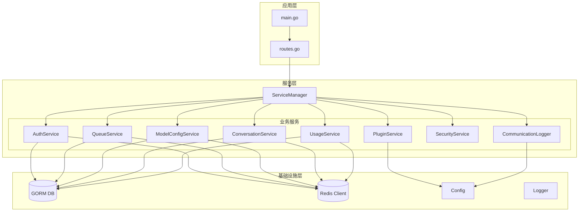
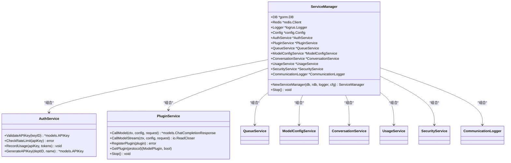
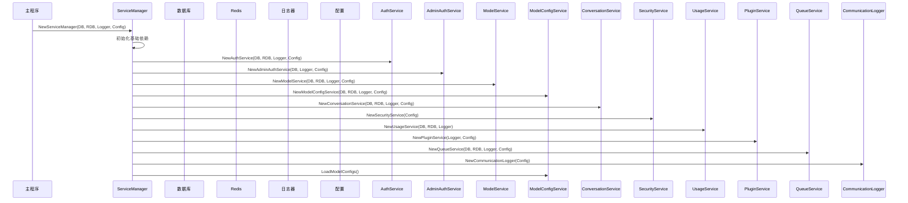
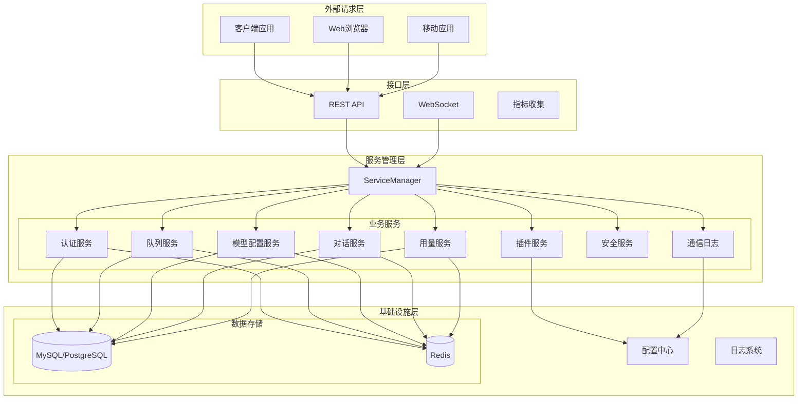
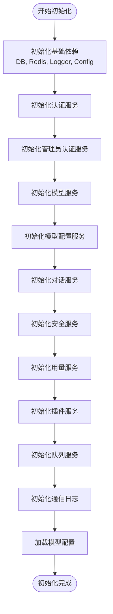
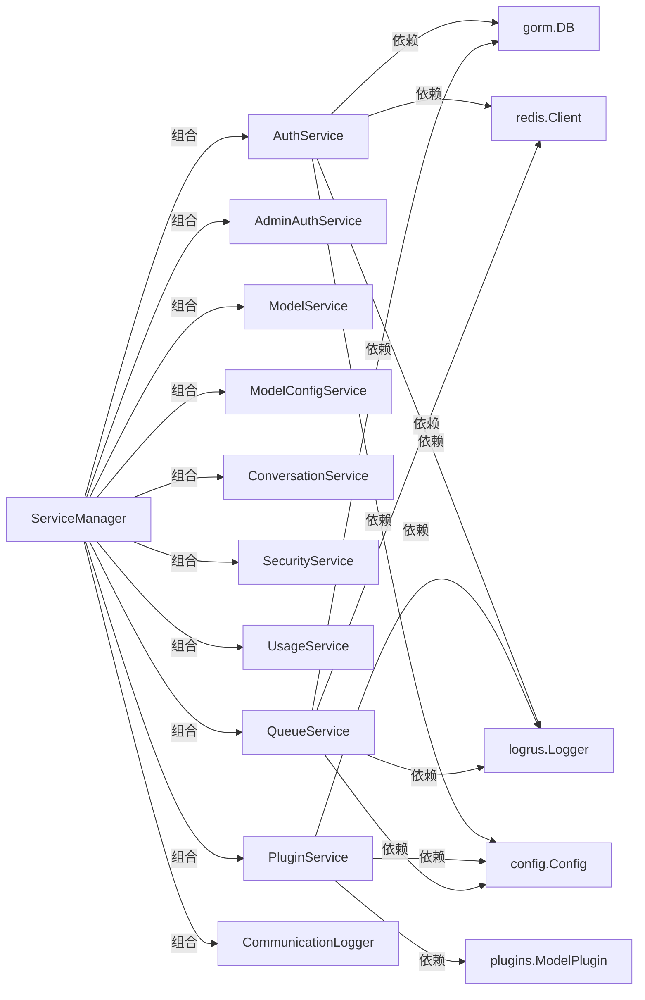

# 服务管理器

<cite>
**本文档引用的文件**
- [service_manager.go](file://internal/services/service_manager.go)
- [main.go](file://cmd/main.go)
- [routes.go](file://internal/api/routes.go)
- [auth_service.go](file://internal/services/auth_service.go)
- [plugin_service.go](file://internal/services/plugin_service.go)
- [queue_service.go](file://internal/services/queue_service.go)
- [conversation_service.go](file://internal/services/conversation_service.go)
- [model_config_service.go](file://internal/services/model_config_service.go)
- [usage_service.go](file://internal/services/usage_service.go)
- [security_service.go](file://internal/services/security_service.go)
- [communication_logger.go](file://internal/services/communication_logger.go)
- [config.go](file://internal/config/config.go)
- [chat_handler.go](file://internal/api/handlers/chat_handler.go)
- [auth.go](file://internal/api/middleware/auth.go)
</cite>

## 目录
1. [简介](#简介)
2. [项目结构](#项目结构)
3. [核心组件](#核心组件)
4. [架构概览](#架构概览)
5. [详细组件分析](#详细组件分析)
6. [依赖分析](#依赖分析)
7. [性能考虑](#性能考虑)
8. [故障排除指南](#故障排除指南)
9. [结论](#结论)

## 简介

Wolink-Core 的服务管理器（ServiceManager）是整个系统的核心协调器，采用依赖注入模式设计，负责管理所有业务服务组件的生命周期。该设计模式确保了服务间的解耦和可测试性，同时支持服务的动态加载和卸载。

服务管理器通过构造函数注入的方式，将数据库连接、Redis客户端、日志器和配置等基础设施依赖传递给各个服务组件。这种设计遵循了依赖倒置原则，使得上层业务逻辑不需要直接依赖底层实现细节。

## 项目结构

项目采用分层架构设计，主要包含以下层次：

**图表来源**
- [service_manager.go:11-28](file://internal/services/service_manager.go#L11-L28)
- [main.go:19-50](file://cmd/main.go#L19-L50)

**章节来源**
- [service_manager.go:1-76](file://internal/services/service_manager.go#L1-L76)
- [main.go:1-89](file://cmd/main.go#L1-L89)

## 核心组件

### ServiceManager 设计理念

ServiceManager 采用了"组合优于继承"的设计原则，通过聚合多个服务组件来提供统一的服务访问接口。其核心设计理念包括：

1. **依赖注入**: 通过构造函数参数传递所有必需依赖
2. **单一职责**: 专注于服务协调和生命周期管理
3. **延迟初始化**: 按需创建服务实例，避免不必要的资源消耗
4. **解耦设计**: 服务间通过接口通信，减少直接依赖

### 依赖注入模式应用

服务管理器实现了完整的依赖注入模式，所有服务组件都通过构造函数参数接收依赖：

**图表来源**
- [service_manager.go:11-28](file://internal/services/service_manager.go#L11-L28)
- [auth_service.go:19-33](file://internal/services/auth_service.go#L19-L33)
- [plugin_service.go:21-53](file://internal/services/plugin_service.go#L21-L53)

### 服务实例初始化顺序

服务管理器按照特定的顺序初始化各个服务组件，确保依赖关系得到正确处理：

**图表来源**
- [service_manager.go:30-62](file://internal/services/service_manager.go#L30-L62)

**章节来源**
- [service_manager.go:30-62](file://internal/services/service_manager.go#L30-L62)

## 架构概览

服务管理器在整个系统架构中扮演着核心协调者的角色，连接应用层、服务层和基础设施层：

**图表来源**
- [main.go:19-89](file://cmd/main.go#L19-L89)
- [routes.go:14-129](file://internal/api/routes.go#L14-L129)

## 详细组件分析

### ServiceManager 核心功能

ServiceManager 作为核心协调器，提供了以下关键功能：

#### 1. 服务注册与初始化

服务管理器负责注册和初始化所有业务服务组件，确保它们能够正常工作：

**章节来源**
- [service_manager.go:30-62](file://internal/services/service_manager.go#L30-L62)

#### 2. 生命周期管理

ServiceManager 提供了完整的生命周期管理机制，包括启动和停止：

**章节来源**
- [service_manager.go:64-76](file://internal/services/service_manager.go#L64-L76)

#### 3. 资源清理策略

服务管理器实现了优雅的资源清理策略，确保所有服务组件都能正确释放资源：

**章节来源**
- [service_manager.go:65-75](file://internal/services/service_manager.go#L65-L75)

### 依赖注入模式详解

服务管理器的依赖注入模式体现了现代Go语言的最佳实践：

#### 1. 构造函数注入

所有服务组件都通过构造函数接收依赖，这种方式具有以下优势：
- 明确的依赖关系
- 编译时检查
- 易于测试和模拟

#### 2. 接口抽象

服务管理器通过接口抽象隐藏具体实现细节，提高了系统的灵活性和可扩展性。

### 服务组件注册过程

服务管理器的注册过程遵循严格的顺序和依赖关系：

**图表来源**
- [service_manager.go:38-62](file://internal/services/service_manager.go#L38-L62)

**章节来源**
- [service_manager.go:38-62](file://internal/services/service_manager.go#L38-L62)

### 配置传递机制

服务管理器通过配置对象向各个服务组件传递配置信息：

#### 1. 配置结构设计

配置对象包含了系统运行所需的所有配置信息，包括服务器设置、数据库连接、Redis配置、日志级别等。

#### 2. 环境变量支持

系统支持通过环境变量覆盖配置文件中的设置，便于在不同环境中部署。

**章节来源**
- [config.go:10-185](file://internal/config/config.go#L10-L185)

### 资源清理策略

服务管理器实现了多层次的资源清理策略：

#### 1. 有序停止

服务按特定顺序停止，确保依赖关系得到正确处理。

#### 2. 异常处理

在停止过程中，即使某个服务出现异常，也要确保其他服务能够正常停止。

#### 3. 资源释放

确保所有打开的文件句柄、网络连接和内存资源都被正确释放。

**章节来源**
- [service_manager.go:65-75](file://internal/services/service_manager.go#L65-L75)

## 依赖分析

### 组件耦合关系

服务管理器通过松耦合的设计降低了组件间的依赖关系：

**图表来源**
- [service_manager.go:11-28](file://internal/services/service_manager.go#L11-L28)
- [auth_service.go:19-33](file://internal/services/auth_service.go#L19-L33)
- [plugin_service.go:21-53](file://internal/services/plugin_service.go#L21-L53)
- [queue_service.go:17-32](file://internal/services/queue_service.go#L17-L32)

### 依赖循环检测

服务管理器设计避免了常见的依赖循环问题：
- 上层服务依赖下层服务（合理）
- 下层服务不依赖上层服务（避免循环）
- 基础设施服务独立存在（无依赖）

### 外部依赖集成

服务管理器集成了多种外部依赖：

#### 1. 数据库连接
- GORM ORM框架
- 支持MySQL和PostgreSQL
- 连接池配置

#### 2. 缓存系统
- Redis键值存储
- 连接池管理
- 缓存策略

#### 3. 日志系统
- Logrus结构化日志
- 多级别日志输出
- 性能优化

**章节来源**
- [service_manager.go:3-9](file://internal/services/service_manager.go#L3-L9)

## 性能考虑

### 并发处理

服务管理器支持高并发场景，通过以下机制保证性能：

#### 1. 工作池模式
队列服务使用工作池模式处理并发任务，避免资源耗尽。

#### 2. 缓存策略
多个服务组件实现了缓存机制，减少数据库和外部API的调用频率。

#### 3. 异步处理
使用异步队列处理耗时操作，提高响应速度。

### 内存管理

#### 1. 对象复用
通过对象池减少垃圾回收压力。

#### 2. 及时释放
确保不再使用的资源及时释放。

#### 3. 内存监控
定期监控内存使用情况，及时发现内存泄漏。

### 网络优化

#### 1. 连接复用
数据库和Redis连接采用连接池复用。

#### 2. 超时控制
合理的超时设置避免请求阻塞。

#### 3. 重试机制
智能的重试策略提高系统稳定性。

## 故障排除指南

### 常见问题诊断

#### 1. 服务启动失败

**症状**: 应用启动时报错，无法正常运行。

**排查步骤**:
1. 检查数据库连接配置
2. 验证Redis连接状态
3. 确认配置文件格式正确
4. 查看详细的错误日志

#### 2. 服务停止异常

**症状**: 应用优雅关闭时某些服务无法正常停止。

**排查步骤**:
1. 检查服务的Stop方法实现
2. 确认资源释放逻辑
3. 查看停止过程中的错误日志

#### 3. 性能问题

**症状**: 系统响应缓慢，资源使用率过高。

**排查步骤**:
1. 分析CPU和内存使用情况
2. 检查数据库查询性能
3. 监控Redis连接池使用
4. 评估队列积压情况

### 调试技巧

#### 1. 日志分析
利用详细的日志信息定位问题根源。

#### 2. 性能监控
通过指标监控系统性能瓶颈。

#### 3. 单元测试
编写单元测试验证服务功能。

**章节来源**
- [service_manager.go:65-75](file://internal/services/service_manager.go#L65-L75)

## 结论

Wolink-Core 的服务管理器通过精心设计的依赖注入模式和生命周期管理机制，为整个系统提供了稳定可靠的服务协调能力。其核心特点包括：

1. **解耦设计**: 通过接口抽象和依赖注入实现了良好的模块解耦
2. **可扩展性**: 支持服务的动态加载和卸载，便于功能扩展
3. **可靠性**: 完善的生命周期管理和资源清理策略确保系统稳定运行
4. **可测试性**: 清晰的依赖关系便于单元测试和集成测试
5. **性能优化**: 通过缓存、异步处理和连接池等技术提升系统性能

服务管理器的设计充分体现了现代软件工程的最佳实践，为构建大型分布式系统提供了坚实的基础。其灵活的架构设计使得系统能够在保持稳定性的同时，快速适应业务需求的变化。