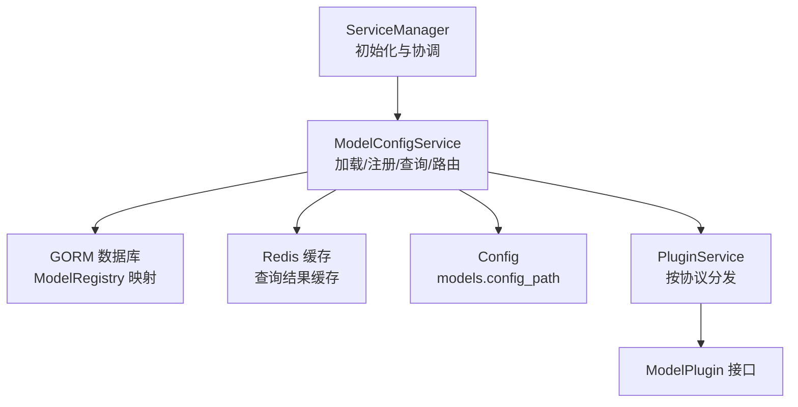
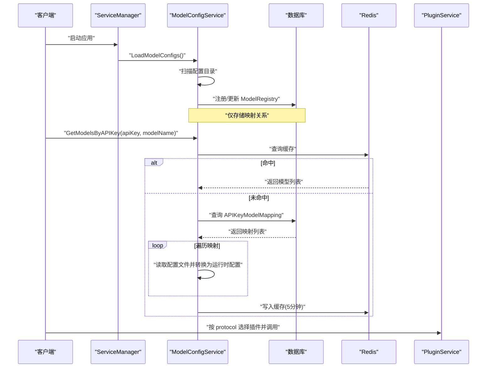
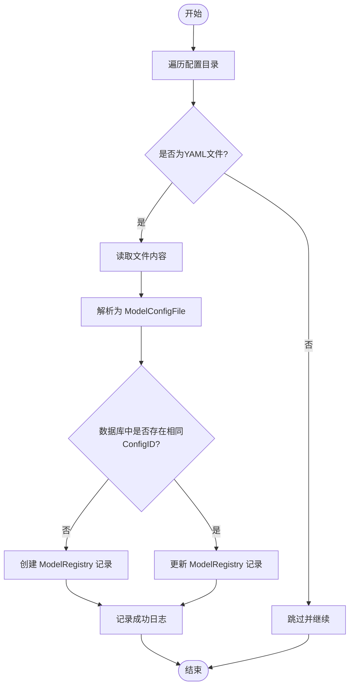
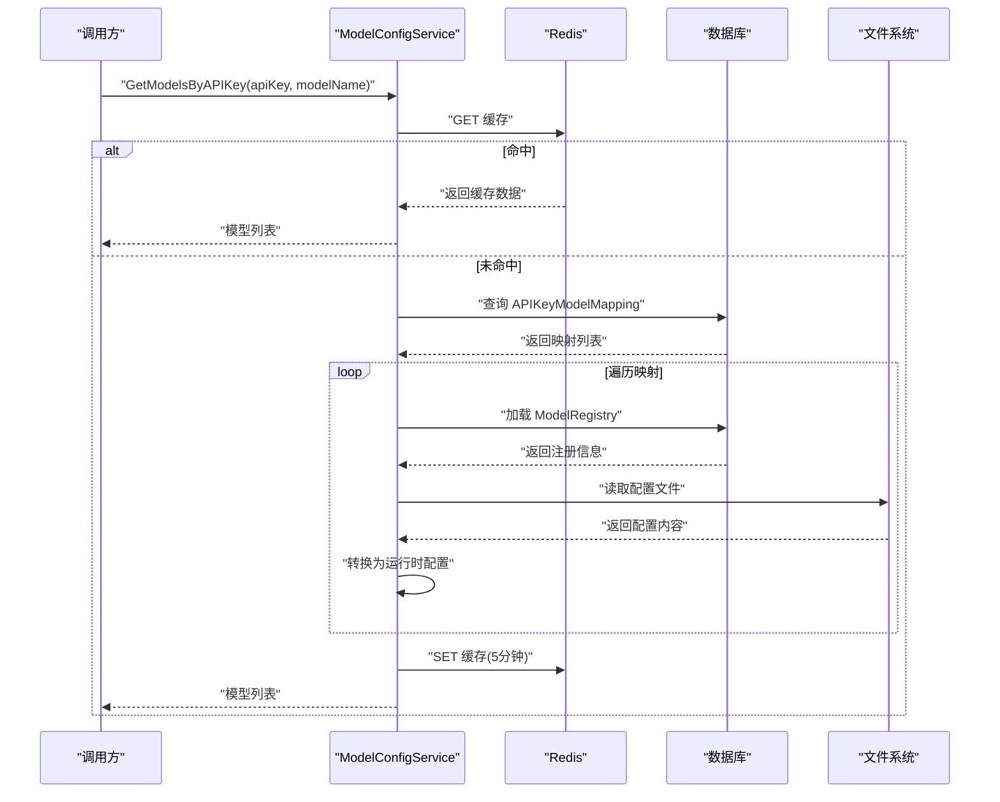
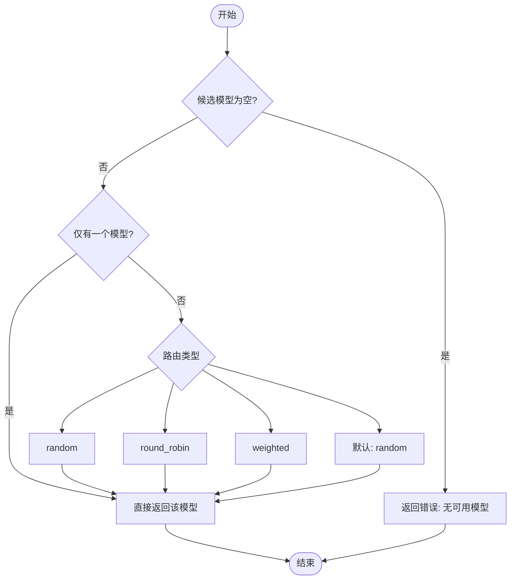
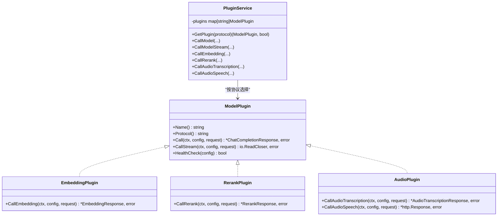
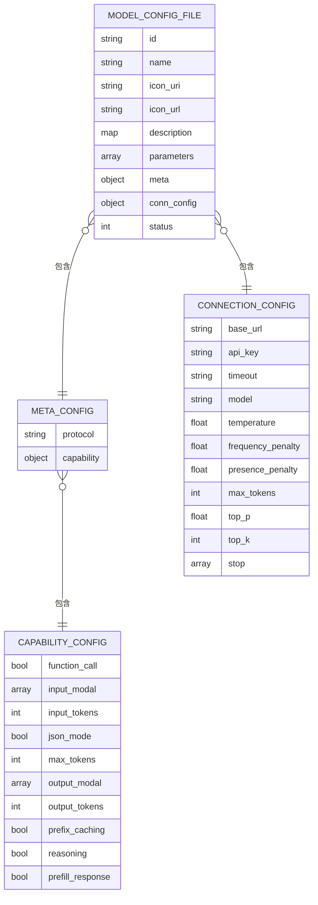
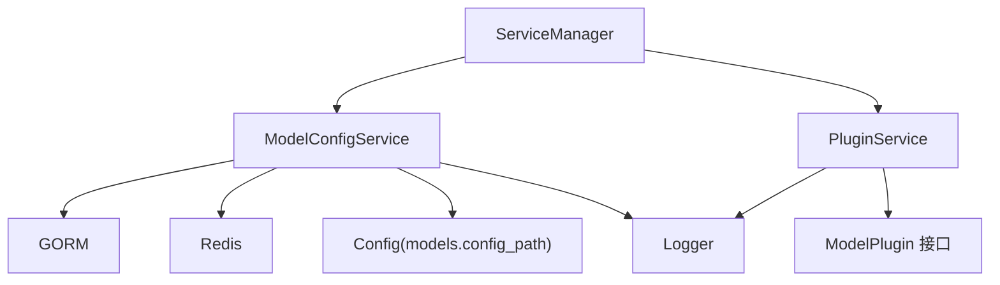

# 模型配置服务

<cite>
**本文引用的文件**
- [model_config_service.go](file://internal/services/model_config_service.go)
- [models.go](file://internal/models/models.go)
- [config.go](file://internal/config/config.go)
- [interface.go](file://internal/plugins/interface.go)
- [plugin_service.go](file://internal/services/plugin_service.go)
- [service_manager.go](file://internal/services/service_manager.go)
- [qwen3-chat.yaml](file://configs/models/qwen3-chat.yaml)
- [qwen3-embedding.yaml](file://configs/models/qwen3-embedding.yaml)
- [qwen-tts.yaml](file://configs/models/qwen-tts.yaml)
- [qwen3-asr.yaml](file://configs/models/qwen3-asr.yaml)
- [validator.go](file://internal/config/validator.go)
- [admin_handler.go](file://internal/api/handlers/admin_handler.go)
</cite>

## 目录
1. [简介](#简介)
2. [项目结构](#项目结构)
3. [核心组件](#核心组件)
4. [架构总览](#架构总览)
5. [详细组件分析](#详细组件分析)
6. [依赖分析](#依赖分析)
7. [性能考虑](#性能考虑)
8. [故障排查指南](#故障排查指南)
9. [结论](#结论)
10. [附录](#附录)

## 简介
本文件面向 Wolink-Core 的“模型配置服务”，系统性阐述模型配置的加载、验证与管理机制，覆盖以下要点：
- 配置文件解析与注册：如何扫描配置目录、解析 YAML、写入数据库映射关系。
- 默认值与校验：配置默认值设置、启动时安全校验。
- 动态更新与缓存：基于 Redis 的查询缓存、模型路由选择策略。
- 与插件系统的集成：通过协议字段选择插件、调用链路与健康检查。
- 错误处理与性能优化：异常路径、缓存命中率、并发与超时控制。
- 扩展点与自定义格式：如何扩展新的配置字段、新增路由策略。

## 项目结构
模型配置服务位于 internal/services 下，核心文件如下：
- internal/services/model_config_service.go：模型配置加载、注册、查询与路由选择。
- internal/models/models.go：模型配置数据结构与数据库映射。
- internal/config/config.go：全局配置结构与默认值。
- internal/services/plugin_service.go：插件服务与协议分发。
- internal/plugins/interface.go：插件接口定义。
- internal/services/service_manager.go：服务初始化与模型配置加载入口。
- configs/models/*.yaml：示例模型配置文件。

图表来源
- [service_manager.go:56-59](file://internal/services/service_manager.go#L56-L59)
- [model_config_service.go:38-60](file://internal/services/model_config_service.go#L38-L60)
- [config.go:84-86](file://internal/config/config.go#L84-L86)
- [plugin_service.go:21-29](file://internal/services/plugin_service.go#L21-L29)
- [interface.go:11-27](file://internal/plugins/interface.go#L11-L27)

章节来源
- [service_manager.go:30-62](file://internal/services/service_manager.go#L30-L62)
- [model_config_service.go:22-36](file://internal/services/model_config_service.go#L22-L36)
- [config.go:96-124](file://internal/config/config.go#L96-L124)

## 核心组件
- ModelConfigService：负责扫描配置目录、注册映射关系、按 API Key 查询可用模型、从配置文件加载运行时模型配置、以及简单的路由选择。
- ModelRegistry：数据库映射表，仅保存配置文件 ID、名称与文件名，不持久化完整配置。
- ModelConfig：运行时模型配置对象，由配置文件转换而来。
- APIKeyModelMapping：API Key 与模型的映射关系，包含路由类型与优先级。
- PluginService：根据模型协议选择插件执行调用。
- Config：包含 models.config_path 等关键配置项。

章节来源
- [model_config_service.go:22-36](file://internal/services/model_config_service.go#L22-L36)
- [models.go:45-54](file://internal/models/models.go#L45-L54)
- [models.go:56-71](file://internal/models/models.go#L56-L71)
- [models.go:73-88](file://internal/models/models.go#L73-L88)
- [plugin_service.go:21-29](file://internal/services/plugin_service.go#L21-L29)
- [config.go:84-86](file://internal/config/config.go#L84-L86)

## 架构总览
模型配置服务的典型工作流：
- 应用启动时，ServiceManager 调用 ModelConfigService.LoadModelConfigs() 扫描 configs/models 目录，将每个 YAML 文件注册为 ModelRegistry 记录。
- 客户端请求时，根据 API Key 查询可用模型列表，先查 Redis 缓存，未命中则查询数据库映射并读取对应 YAML 文件生成运行时配置。
- 选择插件：根据模型配置的 protocol 字段，PluginService 选择对应插件进行调用。
- 路由策略：当前实现支持 random/round_robin/weighted 等类型，但具体状态管理与权重计算为占位实现，需后续完善。

图表来源
- [service_manager.go:56-59](file://internal/services/service_manager.go#L56-L59)
- [model_config_service.go:38-60](file://internal/services/model_config_service.go#L38-L60)
- [model_config_service.go:114-167](file://internal/services/model_config_service.go#L114-L167)
- [plugin_service.go:198-229](file://internal/services/plugin_service.go#L198-L229)

## 详细组件分析

### 组件一：模型配置加载与注册
职责
- 扫描 models.config_path 指定目录下的 YAML 文件。
- 解析 YAML 为 ModelConfigFile，仅将映射关系写入数据库（ModelRegistry）。
- 对于解析失败或数据库操作失败的情况，记录错误并继续处理其他文件，保证健壮性。

实现要点
- 使用 filepath.WalkDir 遍历目录，过滤非 YAML 文件。
- 读取文件内容后使用 yaml.Unmarshal 解析为 ModelConfigFile。
- 通过 db.Where 查询是否存在相同 ConfigID；不存在则创建，存在则更新。
- 日志记录注册/更新过程，便于运维审计。

图表来源
- [model_config_service.go:38-60](file://internal/services/model_config_service.go#L38-L60)
- [model_config_service.go:63-105](file://internal/services/model_config_service.go#L63-L105)

章节来源
- [model_config_service.go:38-60](file://internal/services/model_config_service.go#L38-L60)
- [model_config_service.go:63-105](file://internal/services/model_config_service.go#L63-L105)
- [config.go:160](file://internal/config/config.go#L160)

### 组件二：按 API Key 查询可用模型与缓存
职责
- 根据 API Key 获取其可访问的模型集合。
- 先查 Redis 缓存，未命中则查询数据库映射关系，再逐条读取配置文件生成运行时配置。
- 支持按模型名称过滤。
- 将结果缓存 5 分钟，提升查询性能。

实现要点
- 缓存键格式：api_key_models:{apiKeyID}:{modelName}。
- 查询映射关系后，手动加载 ModelRegistry 并读取对应配置文件。
- 将可用模型序列化后写入 Redis。

图表来源
- [model_config_service.go:114-167](file://internal/services/model_config_service.go#L114-L167)
- [model_config_service.go:169-199](file://internal/services/model_config_service.go#L169-L199)

章节来源
- [model_config_service.go:114-167](file://internal/services/model_config_service.go#L114-L167)
- [model_config_service.go:169-199](file://internal/services/model_config_service.go#L169-L199)

### 组件三：模型路由规则与优先级
职责
- 根据 APIKeyModelMapping 中的 RouteType 与 Priority 决定从多个候选模型中选择哪一个。
- 当前实现包含 random、round_robin、weighted 等类型，但状态管理与权重计算为占位实现，建议后续完善。

实现要点
- 输入为候选模型列表与路由类型字符串。
- 返回选中的模型配置指针或错误。

图表来源
- [model_config_service.go:229-253](file://internal/services/model_config_service.go#L229-L253)
- [models.go:73-88](file://internal/models/models.go#L73-L88)

章节来源
- [model_config_service.go:229-253](file://internal/services/model_config_service.go#L229-L253)
- [models.go:73-88](file://internal/models/models.go#L73-L88)

### 组件四：与插件系统的集成
职责
- 根据模型配置的 protocol 字段选择对应的插件。
- 提供非流式与流式调用接口，并区分 Embedding/Rerank/Audio 等能力接口。
- 插件健康状态检查与卸载/重载预留。

实现要点
- 插件接口定义包含 Call、CallStream、CallEmbedding、CallRerank、CallAudioTranscription、CallAudioSpeech 等。
- PluginService 按协议注册内置插件（OpenAI、DeepSeek、Claude），并在调用时根据 protocol 获取插件。
- 路由到插件后，由插件完成实际的网络调用。

图表来源
- [interface.go:11-55](file://internal/plugins/interface.go#L11-L55)
- [plugin_service.go:21-29](file://internal/services/plugin_service.go#L21-L29)
- [plugin_service.go:198-289](file://internal/services/plugin_service.go#L198-L289)

章节来源
- [interface.go:11-55](file://internal/plugins/interface.go#L11-L55)
- [plugin_service.go:21-29](file://internal/services/plugin_service.go#L21-L29)
- [plugin_service.go:198-289](file://internal/services/plugin_service.go#L198-L289)

### 组件五：配置文件结构与示例
职责
- 定义模型配置文件的字段结构，包括基本信息、元数据、连接配置、默认参数等。
- 示例配置文件展示了不同模型类型的字段组织方式。

实现要点
- ModelConfigFile 包含 id、name、icon、description、meta、conn_config、status 等字段。
- MetaConfig 包含 protocol 与 capability。
- ConnectionConfig 包含 base_url、api_key、timeout、model 等连接参数。
- 示例文件展示了文本生成、嵌入、TTS、ASR 等不同协议与能力组合。

图表来源
- [models.go:396-406](file://internal/models/models.go#L396-L406)
- [models.go:431-434](file://internal/models/models.go#L431-L434)
- [models.go:436-447](file://internal/models/models.go#L436-L447)
- [models.go:449-462](file://internal/models/models.go#L449-L462)

章节来源
- [models.go:396-406](file://internal/models/models.go#L396-L406)
- [models.go:431-434](file://internal/models/models.go#L431-L434)
- [models.go:436-447](file://internal/models/models.go#L436-L447)
- [models.go:449-462](file://internal/models/models.go#L449-L462)
- [qwen3-chat.yaml:1-12](file://configs/models/qwen3-chat.yaml#L1-L12)
- [qwen3-embedding.yaml:1-12](file://configs/models/qwen3-embedding.yaml#L1-L12)
- [qwen-tts.yaml:1-22](file://configs/models/qwen-tts.yaml#L1-L22)
- [qwen3-asr.yaml:1-22](file://configs/models/qwen3-asr.yaml#L1-L22)

### 组件六：配置加载与启动流程
职责
- ServiceManager 在初始化时调用 ModelConfigService.LoadModelConfigs() 完成一次全量加载。
- 启动阶段同时进行配置校验，确保生产环境安全。

实现要点
- ServiceManager.NewServiceManager 中完成各服务初始化，并调用 LoadModelConfigs。
- 配置校验通过 config.Config.MustValidate() 在 main 中调用，确保启动前发现配置问题。

章节来源
- [service_manager.go:56-59](file://internal/services/service_manager.go#L56-L59)
- [validator.go:82-87](file://internal/config/validator.go#L82-L87)

## 依赖分析
- ModelConfigService 依赖：
  - GORM 数据库：用于读写 ModelRegistry 与 APIKeyModelMapping。
  - Redis：用于查询缓存。
  - Viper 配置：读取 models.config_path。
  - 日志：记录加载、解析、查询过程。
- PluginService 依赖：
  - 插件接口：统一调用入口。
  - 日志：记录插件注册、调用与健康检查。
- ServiceManager 作为协调者，负责初始化与启动阶段的顺序控制。

图表来源
- [model_config_service.go:13-26](file://internal/services/model_config_service.go#L13-L26)
- [plugin_service.go:21-29](file://internal/services/plugin_service.go#L21-L29)
- [service_manager.go:30-62](file://internal/services/service_manager.go#L30-L62)

章节来源
- [model_config_service.go:13-26](file://internal/services/model_config_service.go#L13-L26)
- [plugin_service.go:21-29](file://internal/services/plugin_service.go#L21-L29)
- [service_manager.go:30-62](file://internal/services/service_manager.go#L30-L62)

## 性能考虑
- 缓存策略：GetModelsByAPIKey 使用 Redis 缓存查询结果，默认 5 分钟过期，显著降低数据库与文件系统 IO。
- 批量加载：LoadModelConfigs 采用遍历扫描，建议在高并发场景下限制扫描频率或引入增量更新策略。
- 路由实现：SelectModelByRoute 当前为占位实现，建议结合轮询状态与权重配置完善，避免每次固定返回首个模型。
- 插件调用：PluginService 按协议选择插件，建议在插件层增加超时与熔断机制，防止下游异常影响整体稳定性。

## 故障排查指南
常见问题与定位
- 配置文件未生效
  - 检查 models.config_path 是否正确，确认 YAML 文件语法是否正确。
  - 查看日志中“Registering model config”与“Failed to register config”记录。
- 查询不到模型
  - 确认 APIKeyModelMapping 是否存在对应映射。
  - 检查 Redis 缓存是否命中，必要时清理缓存键。
- 路由未按预期
  - 检查 APIKeyModelMapping 的 RouteType 与 Priority 字段。
  - 确认当前实现仅占位，未真正实现轮询/权重逻辑。
- 插件调用失败
  - 确认模型配置的 protocol 与已注册插件一致。
  - 检查插件健康状态与网络连通性。

章节来源
- [model_config_service.go:51-56](file://internal/services/model_config_service.go#L51-L56)
- [model_config_service.go:114-167](file://internal/services/model_config_service.go#L114-L167)
- [plugin_service.go:198-229](file://internal/services/plugin_service.go#L198-L229)

## 结论
模型配置服务通过“配置文件 + 数据库映射 + Redis 缓存”的组合，实现了模型配置的集中管理与高效查询。配合插件系统，能够按协议灵活调度不同后端能力。当前路由与权重实现为占位，建议尽快完善以满足生产环境的负载均衡与优先级需求。同时，建议增强配置文件的校验与动态更新能力，以支持更丰富的扩展场景。

## 附录

### A. 配置管理流程（代码路径）
- 启动加载：[service_manager.go:56-59](file://internal/services/service_manager.go#L56-L59)
- 扫描注册：[model_config_service.go:38-60](file://internal/services/model_config_service.go#L38-L60)
- 注册映射：[model_config_service.go:63-105](file://internal/services/model_config_service.go#L63-L105)
- 查询缓存：[model_config_service.go:114-167](file://internal/services/model_config_service.go#L114-L167)
- 路由选择：[model_config_service.go:229-253](file://internal/services/model_config_service.go#L229-L253)

### B. 错误处理与性能优化建议
- 错误处理
  - 解析失败：记录文件路径与错误原因，继续处理其他文件。
  - 数据库错误：区分记录不存在与查询异常，分别走创建/更新分支。
  - 缓存失败：降级回源查询，避免阻塞请求。
- 性能优化
  - 缓存键粒度：按 apiKeyID 与 modelName 组合，减少缓存污染。
  - 路由实现：引入状态存储与权重配置，实现真正的轮询/加权。
  - 插件超时：在 PluginService 层面增加上下文超时，避免阻塞。

### C. 扩展点与自定义配置格式
- 新增配置字段
  - 在 ModelConfigFile/MetaConfig/CapabilityConfig/ConnectionConfig 中添加字段定义。
  - 在示例 YAML 中补充对应字段，确保解析兼容。
- 新增路由策略
  - 在 APIKeyModelMapping 中扩展路由类型字段。
  - 在 ModelConfigService.SelectModelByRoute 中实现具体策略。
- 新增插件能力
  - 在 plugins.Interface 中扩展接口方法。
  - 在 PluginService 中注册新插件并实现协议分发。

章节来源
- [models.go:396-406](file://internal/models/models.go#L396-L406)
- [models.go:431-434](file://internal/models/models.go#L431-L434)
- [models.go:436-447](file://internal/models/models.go#L436-L447)
- [models.go:449-462](file://internal/models/models.go#L449-L462)
- [models.go:73-88](file://internal/models/models.go#L73-L88)
- [interface.go:11-55](file://internal/plugins/interface.go#L11-L55)
- [plugin_service.go:56-92](file://internal/services/plugin_service.go#L56-L92)