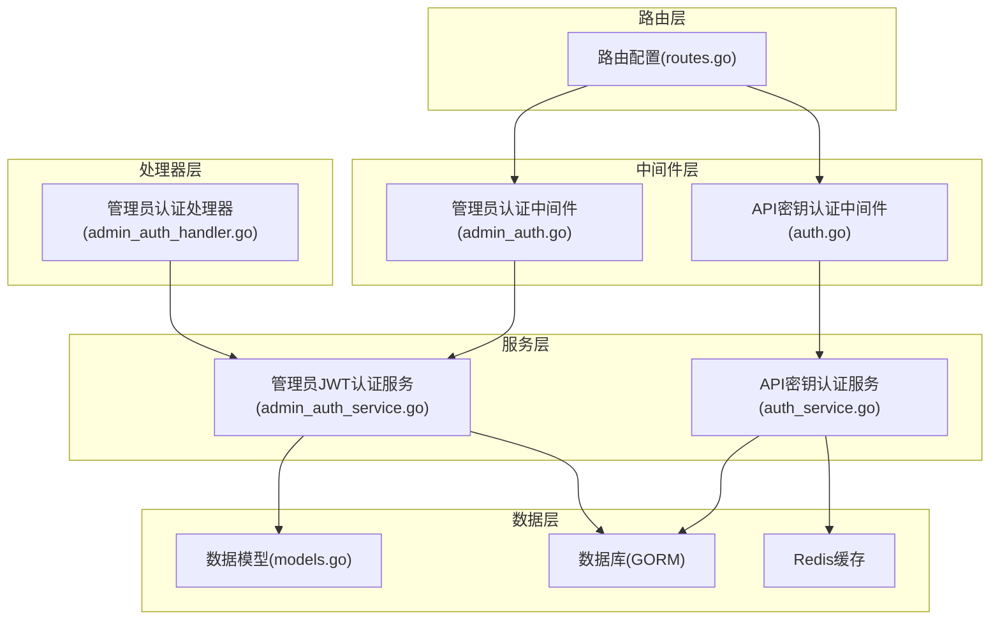
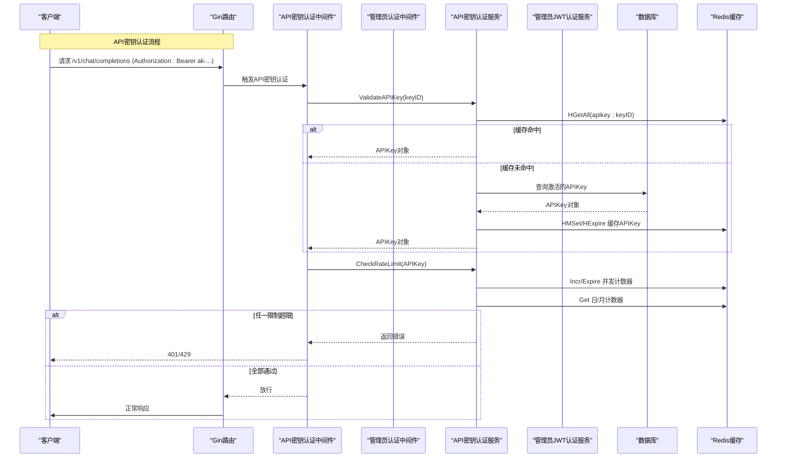
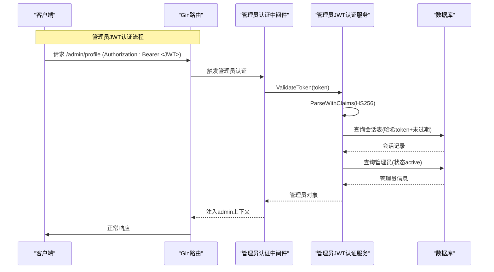
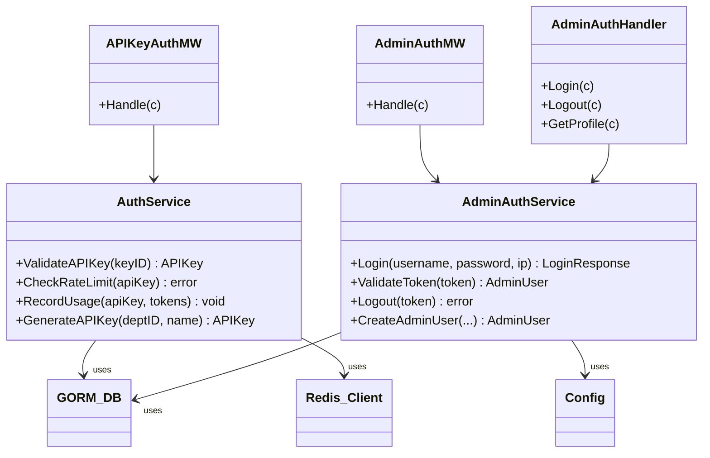

# 认证服务

<cite>
**本文档引用的文件**
- [auth_service.go](file://internal/services/auth_service.go)
- [admin_auth_service.go](file://internal/services/admin_auth_service.go)
- [auth.go](file://internal/api/middleware/auth.go)
- [admin_auth.go](file://internal/api/middleware/admin_auth.go)
- [admin_auth_handler.go](file://internal/api/handlers/admin_auth_handler.go)
- [routes.go](file://internal/api/routes.go)
- [models.go](file://internal/models/models.go)
- [config.go](file://internal/config/config.go)
- [add_admin_tables.sql](file://migrations/add_admin_tables.sql)
- [service_manager.go](file://internal/services/service_manager.go)
- [logging.go](file://internal/api/middleware/logging.go)
- [auth_service_test.go](file://internal/services/auth_service_test.go)
</cite>

## 目录
1. [简介](#简介)
2. [项目结构](#项目结构)
3. [核心组件](#核心组件)
4. [架构总览](#架构总览)
5. [详细组件分析](#详细组件分析)
6. [依赖关系分析](#依赖关系分析)
7. [性能考量](#性能考量)
8. [故障排查指南](#故障排查指南)
9. [结论](#结论)

## 简介
本文件面向 Wolink-Core 的认证服务，系统性阐述以下内容：
- API 密钥认证与管理员 JWT 认证的实现机制
- 密钥生成、验证流程与权限检查
- 安全策略、速率限制机制与会话管理
- 认证服务与数据库、Redis 的交互模式与缓存策略
- 错误处理与安全最佳实践
- 性能优化策略与并发处理考虑

## 项目结构
认证相关的核心文件分布如下：
- 服务层：API 密钥认证服务、管理员 JWT 认证服务
- 中间件层：API 密钥认证中间件、管理员认证中间件
- 处理器层：管理员登录/登出/资料等接口
- 路由层：统一挂载认证中间件与受保护资源
- 数据模型：API 密钥、管理员用户、会话等
- 配置：安全密钥、连接池、基础设施超时等

图表来源
- [routes.go:14-129](file://internal/api/routes.go#L14-L129)
- [auth.go:13-68](file://internal/api/middleware/auth.go#L13-L68)
- [admin_auth.go:14-75](file://internal/api/middleware/admin_auth.go#L14-L75)
- [admin_auth_handler.go:14-319](file://internal/api/handlers/admin_auth_handler.go#L14-L319)
- [auth_service.go:19-219](file://internal/services/auth_service.go#L19-L219)
- [admin_auth_service.go:19-248](file://internal/services/admin_auth_service.go#L19-L248)
- [models.go:20-160](file://internal/models/models.go#L20-L160)

章节来源
- [routes.go:14-129](file://internal/api/routes.go#L14-L129)

## 核心组件
- API 密钥认证服务：负责密钥验证、速率限制、使用统计与缓存
- 管理员 JWT 认证服务：负责管理员登录、JWT 签发与校验、会话持久化与清理
- API 密钥认证中间件：统一拦截 API 调用，提取并验证密钥
- 管理员认证中间件：统一拦截管理端请求，验证 JWT 并注入角色权限
- 管理员认证处理器：提供登录、登出、资料等接口
- 数据模型：APIKey、AdminUser、AdminSession 等

章节来源
- [auth_service.go:19-219](file://internal/services/auth_service.go#L19-L219)
- [admin_auth_service.go:19-248](file://internal/services/admin_auth_service.go#L19-L248)
- [auth.go:13-68](file://internal/api/middleware/auth.go#L13-L68)
- [admin_auth.go:14-75](file://internal/api/middleware/admin_auth.go#L14-L75)
- [admin_auth_handler.go:14-319](file://internal/api/handlers/admin_auth_handler.go#L14-L319)
- [models.go:20-160](file://internal/models/models.go#L20-L160)

## 架构总览
认证服务采用“中间件 + 服务 + 数据库/缓存”的分层设计：
- API 密钥认证：基于 Redis 缓存加速密钥查询，结合内存计数器实现并发与日/月限额
- 管理员认证：基于 JWT 的无状态认证，配合数据库会话表实现可撤销与过期控制
- 路由层统一挂载中间件，确保受保护资源的访问控制

图表来源
- [auth.go:13-68](file://internal/api/middleware/auth.go#L13-L68)
- [auth_service.go:35-124](file://internal/services/auth_service.go#L35-L124)

图表来源
- [admin_auth.go:14-75](file://internal/api/middleware/admin_auth.go#L14-L75)
- [admin_auth_service.go:94-133](file://internal/services/admin_auth_service.go#L94-L133)

## 详细组件分析

### API 密钥认证服务
- 职责
  - 验证 API 密钥有效性（仅激活状态）
  - 速率限制：并发、日累计、月累计
  - 使用统计：异步累加日/月计数与并发计数器
  - 密钥生成：生成 keyID 与 keySecret，并写入数据库与缓存
  - 缓存策略：Redis Hash 缓存 APIKey，5 分钟有效期；新增密钥缓存 24 小时

- 关键流程
  - ValidateAPIKey：先查 Redis，未命中则查数据库并回填缓存
  - CheckRateLimit：并发计数器 +30s 过期；日/月计数器分别设置过期时间
  - RecordUsage：异步 goroutine 更新 Redis 计数器与数据库 total_usage
  - GenerateAPIKey：随机生成 keyID/keySecret，初始化默认限额并缓存

- 数据结构与复杂度
  - APIKey 模型包含限额与统计字段，查询与更新均通过 GORM
  - Redis 操作为 O(1)，缓存命中可显著降低数据库压力

- 错误处理
  - 无效密钥、禁用密钥、并发/日/月超限均有明确错误返回
  - 异步更新失败不影响主流程，但会记录日志

章节来源
- [auth_service.go:35-124](file://internal/services/auth_service.go#L35-L124)
- [auth_service.go:126-179](file://internal/services/auth_service.go#L126-L179)
- [auth_service.go:183-219](file://internal/services/auth_service.go#L183-L219)
- [models.go:20-43](file://internal/models/models.go#L20-L43)

### 管理员 JWT 认证服务
- 职责
  - 管理员登录：查询激活用户，bcrypt 校验密码，签发 JWT，持久化会话
  - JWT 校验：HS256 签名验证 + 会话表有效性检查 + 用户状态校验
  - 登出：删除会话记录
  - 用户管理：创建、查询、更新、删除管理员（含密码加密）

- 关键流程
  - Login：bcrypt 校验 -> 生成 JWT -> 会话哈希入库 -> 更新最后登录信息 -> 异步清理过期会话
  - ValidateToken：解析 HS256 -> 校验签名 -> 校验会话未过期 -> 校验用户状态
  - Logout：按哈希删除会话
  - CreateAdminUser：用户名/邮箱唯一性检查 -> bcrypt 加密 -> 写库

- 数据结构与复杂度
  - AdminUser/Session 模型支持快速查询与索引
  - JWT 无状态，仅需校验签名与会话有效性

- 错误处理
  - 用户名/密码错误、无效 token、过期 token、用户不存在/禁用等均有明确错误码

章节来源
- [admin_auth_service.go:40-92](file://internal/services/admin_auth_service.go#L40-L92)
- [admin_auth_service.go:94-133](file://internal/services/admin_auth_service.go#L94-L133)
- [admin_auth_service.go:135-139](file://internal/services/admin_auth_service.go#L135-L139)
- [admin_auth_service.go:141-179](file://internal/services/admin_auth_service.go#L141-L179)
- [models.go:133-160](file://internal/models/models.go#L133-L160)

### API 密钥认证中间件
- 行为
  - 从 Authorization: Bearer ak-... 提取密钥
  - 若无 Header，则尝试 Query 参数 api_key/token
  - 调用 AuthService 验证密钥并检查速率限制
  - 成功后将 APIKey 与部门ID注入上下文

- 错误处理
  - 缺失凭据返回 401
  - 验证失败返回 401
  - 速率限制超限返回 429

章节来源
- [auth.go:13-68](file://internal/api/middleware/auth.go#L13-L68)

### 管理员认证中间件与权限控制
- 行为
  - 从 Authorization: Bearer 提取 JWT
  - 调用 AdminAuthService 校验 token 与会话有效性
  - 注入管理员上下文（ID、用户名、角色）
  - 提供 RequireRole 中间件按角色放行

- 错误处理
  - 缺失/格式错误/空 token 返回 401
  - 校验失败返回 401
  - 角色不足返回 403

章节来源
- [admin_auth.go:14-75](file://internal/api/middleware/admin_auth.go#L14-L75)
- [admin_auth.go:77-104](file://internal/api/middleware/admin_auth.go#L77-L104)

### 管理员认证处理器
- 功能
  - 登录：接收 JSON 参数，获取客户端 IP，调用服务层登录，返回 token 与用户信息
  - 登出：从 Header 提取 token，调用服务层登出
  - 获取资料：从上下文读取管理员信息
  - 管理员 CRUD：创建、列出、更新、删除管理员（含密码加密）

- 错误处理
  - 参数绑定错误返回 400
  - 登录/登出/更新/删除失败返回相应错误码

章节来源
- [admin_auth_handler.go:26-68](file://internal/api/handlers/admin_auth_handler.go#L26-L68)
- [admin_auth_handler.go:70-109](file://internal/api/handlers/admin_auth_handler.go#L70-L109)
- [admin_auth_handler.go:111-136](file://internal/api/handlers/admin_auth_handler.go#L111-L136)
- [admin_auth_handler.go:138-179](file://internal/api/handlers/admin_auth_handler.go#L138-L179)
- [admin_auth_handler.go:181-212](file://internal/api/handlers/admin_auth_handler.go#L181-L212)
- [admin_auth_handler.go:214-282](file://internal/api/handlers/admin_auth_handler.go#L214-L282)
- [admin_auth_handler.go:284-319](file://internal/api/handlers/admin_auth_handler.go#L284-L319)

### 路由与中间件挂载
- v1 组下所有接口均需 API 密钥认证
- WebSocket 代理同样需要 API 密钥认证
- /admin/* 需管理员认证，其中 /admin/users/* 仅超级管理员可用
- /admin/auth/* 无需认证

章节来源
- [routes.go:46-126](file://internal/api/routes.go#L46-L126)

## 依赖关系分析
- 服务层依赖
  - AuthService 依赖 GORM 数据库与 Redis 客户端
  - AdminAuthService 依赖 GORM 数据库与配置中的 JWT Secret
- 中间件依赖
  - API 密钥中间件依赖 AuthService
  - 管理员中间件依赖 AdminAuthService
- 路由依赖
  - 路由统一注入中间件，形成清晰的访问控制链路

图表来源
- [auth_service.go:19-33](file://internal/services/auth_service.go#L19-L33)
- [admin_auth_service.go:19-38](file://internal/services/admin_auth_service.go#L19-L38)
- [auth.go:13-13](file://internal/api/middleware/auth.go#L13-L13)
- [admin_auth.go:14-15](file://internal/api/middleware/admin_auth.go#L14-L15)
- [admin_auth_handler.go:14-24](file://internal/api/handlers/admin_auth_handler.go#L14-L24)

## 性能考量
- 缓存策略
  - APIKey 缓存：Redis Hash，5 分钟（查询路径）；新增密钥缓存 24 小时（写入路径）
  - 并发计数器：Redis Incr/Decr，30 秒过期，避免长期占用
  - 日/月计数器：分别设置过期时间，避免边界问题
- 异步更新
  - 使用统计异步更新 Redis 计数器与数据库 total_usage，减少主流程阻塞
- 连接池与超时
  - 配置中提供数据库与 Redis 连接池大小、最大生命周期与超时参数，建议根据并发与延迟需求调整
- 并发处理
  - 速率限制基于 Redis 原子操作，适合高并发场景
  - 异步 goroutine 更新统计，避免阻塞请求

章节来源
- [auth_service.go:35-85](file://internal/services/auth_service.go#L35-L85)
- [auth_service.go:87-149](file://internal/services/auth_service.go#L87-L149)
- [config.go:33-47](file://internal/config/config.go#L33-L47)
- [config.go:168-184](file://internal/config/config.go#L168-L184)

## 故障排查指南
- API 密钥相关
  - 401 未授权：确认 Authorization 头格式为 Bearer ak-...，或 Query 参数 api_key/token 是否正确传递
  - 429 速率限制：检查并发、日/月限额是否超限；查看对应 Redis 键是否存在与过期时间
  - 缓存未命中：确认 Redis 是否正常运行，缓存键是否正确
- 管理员 JWT 相关
  - 401 未认证：确认 JWT 格式与签名算法；检查会话表是否仍有效且未过期
  - 403 权限不足：确认管理员角色是否满足 RequireRole 要求
- 数据库与会话
  - 登录成功但后续校验失败：检查会话表 token 哈希是否一致，管理员状态是否为 active
  - 过期会话清理：服务端会异步清理过期会话，若频繁出现“token已过期”，检查定时任务与时间同步

章节来源
- [auth.go:13-68](file://internal/api/middleware/auth.go#L13-L68)
- [admin_auth.go:14-75](file://internal/api/middleware/admin_auth.go#L14-L75)
- [admin_auth_service.go:94-133](file://internal/services/admin_auth_service.go#L94-L133)
- [auth_service_test.go:48-213](file://internal/services/auth_service_test.go#L48-L213)

## 结论
Wolink-Core 的认证服务通过“中间件 + 服务 + 缓存 + 数据库”的分层设计，实现了：
- 高效的 API 密钥认证与速率限制（Redis 原子计数）
- 安全的管理员 JWT 认证与会话管理（HS256 + 会话表）
- 明确的权限控制与错误处理
- 可扩展的性能优化（缓存、异步更新、连接池）

建议在生产环境中：
- 严格管理 JWT Secret，定期轮换
- 合理设置 Redis 与数据库连接池参数
- 监控 Redis 键空间与过期策略，确保计数器准确性
- 对关键接口开启限流与熔断，防止突发流量冲击