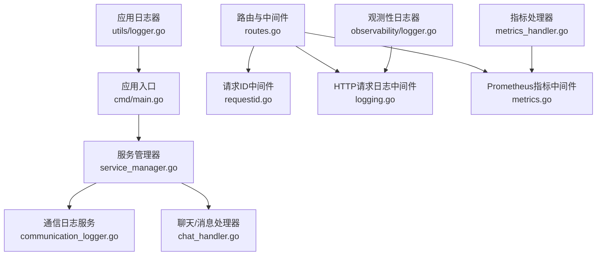
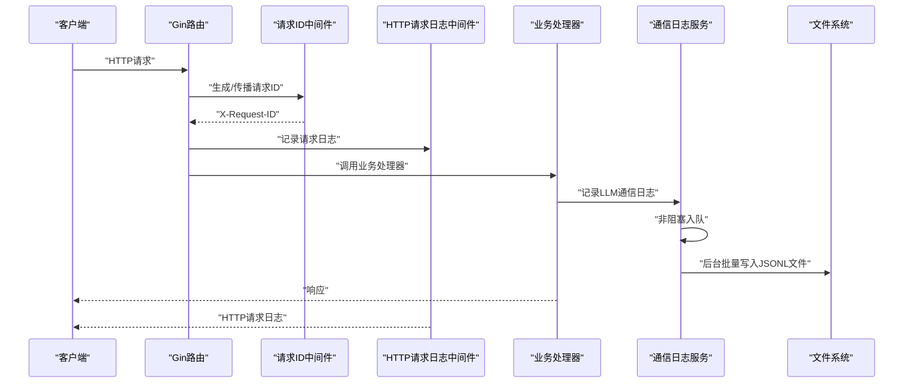
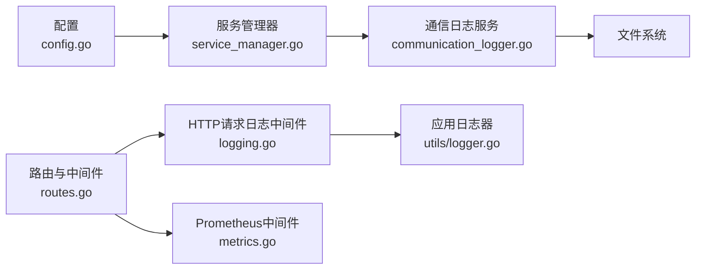

# 通信日志服务

<cite>
**本文档引用的文件**
- [communication_logger.go](file://internal/services/communication_logger.go)
- [communication_logger_test.go](file://internal/services/communication_logger_test.go)
- [config.go](file://internal/config/config.go)
- [service_manager.go](file://internal/services/service_manager.go)
- [routes.go](file://internal/api/routes.go)
- [logging.go](file://internal/api/middleware/logging.go)
- [logger.go](file://internal/observability/logger.go)
- [metrics.go](file://internal/observability/metrics.go)
- [metrics_handler.go](file://internal/api/handlers/metrics_handler.go)
- [logger.go](file://internal/utils/logger.go)
- [main.go](file://cmd/main.go)
</cite>

## 目录
1. [简介](#简介)
2. [项目结构](#项目结构)
3. [核心组件](#核心组件)
4. [架构总览](#架构总览)
5. [详细组件分析](#详细组件分析)
6. [依赖关系分析](#依赖关系分析)
7. [性能考虑](#性能考虑)
8. [故障排查指南](#故障排查指南)
9. [结论](#结论)
10. [附录](#附录)

## 简介
本文件针对 Wolink-Core 的通信日志服务进行系统性技术文档整理，覆盖以下方面：
- 通信日志的记录机制、格式规范与存储策略
- 请求响应日志、错误日志与性能日志的生成与处理
- 日志服务配置项、过滤规则与输出格式
- 与监控系统的集成（日志聚合与实时分析）
- 扩展点、自定义日志格式与审计要求
- 具体代码示例路径，展示日志记录流程、格式化输出与性能优化策略

## 项目结构
通信日志服务在项目中的位置与职责如下：
- 核心实现：internal/services/communication_logger.go
- 配置定义：internal/config/config.go
- 服务管理器：internal/services/service_manager.go（负责初始化与关闭）
- 路由与中间件：internal/api/routes.go（注册中间件链）
- HTTP 请求日志中间件：internal/api/middleware/logging.go
- 观测性工具：internal/observability/logger.go、metrics.go
- Prometheus 指标暴露：internal/api/handlers/metrics_handler.go
- 应用日志器：internal/utils/logger.go
- 入口程序：cmd/main.go



图表来源
- [main.go:19-89](file://cmd/main.go#L19-L89)
- [service_manager.go:30-62](file://internal/services/service_manager.go#L30-L62)
- [communication_logger.go:49-77](file://internal/services/communication_logger.go#L49-L77)
- [routes.go:14-29](file://internal/api/routes.go#L14-L29)
- [logging.go:10-51](file://internal/api/middleware/logging.go#L10-L51)
- [metrics.go:53-92](file://internal/observability/metrics.go#L53-L92)
- [metrics_handler.go:18-22](file://internal/api/handlers/metrics_handler.go#L18-L22)
- [logger.go:9-30](file://internal/utils/logger.go#L9-L30)
- [logger.go:16-42](file://internal/observability/logger.go#L16-L42)

章节来源
- [main.go:19-89](file://cmd/main.go#L19-L89)
- [service_manager.go:30-62](file://internal/services/service_manager.go#L30-L62)
- [routes.go:14-29](file://internal/api/routes.go#L14-L29)

## 核心组件
- 通信记录模型（CommunicationRecord）：定义单条 LLM 通信记录的字段，包含时间戳、请求ID、API Key ID、部门ID、模型名、是否流式、请求/响应负载、Token 使用量、耗时（毫秒）、是否包含敏感信息以及错误信息等。
- 通信日志器（CommunicationLogger）：异步写入 LLM 通信记录，支持非阻塞入队、批量写入、定时刷新、按小时滚动文件、缓冲区与并发安全。
- 配置（CommunicationLogConfig）：启用开关、存储路径、最大文件大小、刷新间隔等。
- 服务管理器（ServiceManager）：在启动时初始化通信日志器，并在优雅关闭时确保数据落盘。

章节来源
- [communication_logger.go:15-29](file://internal/services/communication_logger.go#L15-L29)
- [communication_logger.go:31-47](file://internal/services/communication_logger.go#L31-L47)
- [config.go:88-94](file://internal/config/config.go#L88-L94)
- [service_manager.go:49-54](file://internal/services/service_manager.go#L49-L54)

## 架构总览
通信日志服务采用“生产者-消费者”模式，通过后台工作协程异步处理日志写入，避免阻塞主业务逻辑。HTTP 层通过中间件链记录请求级日志，通信日志服务专注于 LLM 交互的结构化记录。



图表来源
- [routes.go:17-29](file://internal/api/routes.go#L17-L29)
- [logging.go:22-51](file://internal/api/middleware/logging.go#L22-L51)
- [communication_logger.go:79-96](file://internal/services/communication_logger.go#L79-L96)
- [communication_logger.go:146-203](file://internal/services/communication_logger.go#L146-L203)

## 详细组件分析

### 通信记录模型（CommunicationRecord）
- 字段设计：涵盖请求上下文、模型参数、交互内容、计费指标与错误信息，便于审计与性能分析。
- JSON 序列化：使用 json.RawMessage 存储请求/响应体，减少重复解析成本；最终序列化为 JSONL 行。
- 时间戳：写入时统一设置为当前时间，保证日志一致性。

章节来源
- [communication_logger.go:15-29](file://internal/services/communication_logger.go#L15-L29)

### 通信日志器（CommunicationLogger）
- 初始化与生命周期
  - NewCommunicationLogger：根据配置创建目录、启动后台工作协程、设置日志回调函数。
  - Close：优雅关闭，刷写剩余批次并关闭文件句柄。
- 写入策略
  - 非阻塞入队：使用带缓冲通道，满载时丢弃并记录错误。
  - 批量写入：达到批次阈值或定时器触发时刷新。
  - 文件滚动：按小时滚动，文件名为“YYYY-MM-DD-HH.log.jsonl”，内置缓冲区提升吞吐。
- 错误处理
  - 目录创建失败、文件打开失败、序列化失败、写入失败均通过回调函数记录，不影响主流程。

```mermaid
classDiagram
class CommunicationRecord {
+time.Time timestamp
+string request_id
+uint api_key_id
+uint department_id
+string model_name
+bool is_stream
+json.RawMessage request
+json.RawMessage response
+int tokens_used
+int64 duration_ms
+bool has_sensitive
+string error
}
class CommunicationLogger {
-CommunicationLogConfig config
-chan *CommunicationRecord recordsCh
-chan struct{} done
-sync.WaitGroup wg
-sync.Mutex mu
-*os.File currentFile
-*bufio.Writer buffered
-string currentDate
-[]*CommunicationRecord batch
-int batchSize
-func logFunc
-func errFunc
-bool closed
+Log(record) error
-run()
-drainChannel()
-flushBatch()
-rotateFile(dateStr)
+Close()
}
CommunicationLogger --> CommunicationRecord : "消费"
```

图表来源
- [communication_logger.go:15-29](file://internal/services/communication_logger.go#L15-L29)
- [communication_logger.go:31-47](file://internal/services/communication_logger.go#L31-L47)

章节来源
- [communication_logger.go:49-77](file://internal/services/communication_logger.go#L49-L77)
- [communication_logger.go:79-96](file://internal/services/communication_logger.go#L79-L96)
- [communication_logger.go:98-131](file://internal/services/communication_logger.go#L98-L131)
- [communication_logger.go:133-143](file://internal/services/communication_logger.go#L133-L143)
- [communication_logger.go:145-203](file://internal/services/communication_logger.go#L145-L203)
- [communication_logger.go:205-236](file://internal/services/communication_logger.go#L205-L236)
- [communication_logger.go:238-271](file://internal/services/communication_logger.go#L238-L271)

### 配置与默认值
- CommunicationLogConfig：包含 enabled、storage_path、max_file_size_mb、flush_interval_ms。
- 默认值：开启关闭、存储路径、文件大小限制、刷新间隔均有合理默认，可通过环境变量覆盖。

章节来源
- [config.go:88-94](file://internal/config/config.go#L88-L94)
- [config.go:162-167](file://internal/config/config.go#L162-L167)

### 服务管理器集成
- 在 ServiceManager 中初始化 CommunicationLogger，并将其注入到各业务服务中以供记录。
- 优雅关闭时调用 Close，确保未刷写的数据被处理。

章节来源
- [service_manager.go:49-54](file://internal/services/service_manager.go#L49-L54)
- [service_manager.go:64-75](file://internal/services/service_manager.go#L64-L75)

### HTTP 请求日志与关联
- LoggerWithRequestID 中间件：记录请求ID、时间戳、方法、路径、状态码、延迟、客户端IP等字段。
- 与通信日志的关联：两者通过 X-Request-ID 关联，便于端到端追踪。

章节来源
- [logging.go:10-51](file://internal/api/middleware/logging.go#L10-L51)
- [logger.go:16-42](file://internal/observability/logger.go#L16-L42)

### 监控与指标集成
- Prometheus 中间件：统计请求数、延迟分布、并发请求数等，标签使用 FullPath 降低基数。
- 指标暴露：/metrics 端点，便于日志聚合与实时分析。

章节来源
- [metrics.go:53-92](file://internal/observability/metrics.go#L53-L92)
- [metrics_handler.go:18-22](file://internal/api/handlers/metrics_handler.go#L18-L22)

### 测试与基准
- 单元测试覆盖：禁用/启用、非阻塞写入、文件滚动、优雅关闭、批处理、空指针安全、错误处理等。
- 基准测试：验证高并发下的写入性能。

章节来源
- [communication_logger_test.go:52-69](file://internal/services/communication_logger_test.go#L52-L69)
- [communication_logger_test.go:123-167](file://internal/services/communication_logger_test.go#L123-L167)
- [communication_logger_test.go:169-200](file://internal/services/communication_logger_test.go#L169-L200)
- [communication_logger_test.go:202-238](file://internal/services/communication_logger_test.go#L202-L238)
- [communication_logger_test.go:240-285](file://internal/services/communication_logger_test.go#L240-L285)
- [communication_logger_test.go:287-295](file://internal/services/communication_logger_test.go#L287-L295)
- [communication_logger_test.go:297-316](file://internal/services/communication_logger_test.go#L297-L316)
- [communication_logger_test.go:318-341](file://internal/services/communication_logger_test.go#L318-L341)

## 依赖关系分析
- 通信日志服务依赖配置模块（CommunicationLogConfig）与文件系统。
- 服务管理器负责装配与生命周期管理。
- HTTP 中间件链提供请求级日志与指标采集。
- 观测性模块提供日志器与指标工具。



图表来源
- [config.go:88-94](file://internal/config/config.go#L88-L94)
- [service_manager.go:49-54](file://internal/services/service_manager.go#L49-L54)
- [communication_logger.go:49-77](file://internal/services/communication_logger.go#L49-L77)
- [routes.go:17-29](file://internal/api/routes.go#L17-L29)
- [logging.go:22-51](file://internal/api/middleware/logging.go#L22-L51)
- [metrics.go:53-92](file://internal/observability/metrics.go#L53-L92)
- [logger.go:9-30](file://internal/utils/logger.go#L9-L30)

## 性能考虑
- 异步写入与批量刷新：通过后台协程与固定批次大小平衡吞吐与延迟。
- 定时刷新：避免长时间无写入导致数据滞留。
- 缓冲区优化：使用 256KB 缓冲区减少系统调用次数。
- 非阻塞入队：防止日志写入成为性能瓶颈。
- 文件滚动：按小时滚动，避免单文件过大影响 IO。
- 并发安全：使用互斥锁保护文件句柄与状态变更。

章节来源
- [communication_logger.go:102-131](file://internal/services/communication_logger.go#L102-L131)
- [communication_logger.go:146-203](file://internal/services/communication_logger.go#L146-L203)
- [communication_logger.go:205-236](file://internal/services/communication_logger.go#L205-L236)

## 故障排查指南
- 目录创建失败：检查 storage_path 权限与路径是否存在，确认 errFunc 回调已记录错误。
- 通道满载：观察日志中“channel full”的提示，适当增大通道容量或提高刷新频率。
- 文件打开失败：检查磁盘空间与权限，确认 flush 与 rotate 逻辑正常。
- 写入失败：关注缓冲区刷新错误，必要时缩短 flush_interval_ms。
- 优雅关闭：确认 ServiceManager.Stop 调用 Close，确保最后一批数据写入。

章节来源
- [communication_logger.go:55-59](file://internal/services/communication_logger.go#L55-L59)
- [communication_logger.go:90-95](file://internal/services/communication_logger.go#L90-L95)
- [communication_logger.go:219-227](file://internal/services/communication_logger.go#L219-L227)
- [communication_logger.go:194-199](file://internal/services/communication_logger.go#L194-L199)
- [service_manager.go:72-74](file://internal/services/service_manager.go#L72-L74)

## 结论
通信日志服务通过异步、批量、定时刷新与文件滚动等策略，在保证低开销的同时提供了结构化的 LLM 通信记录能力。结合 HTTP 请求日志与 Prometheus 指标，可实现从请求到响应的全链路可观测性与审计需求。建议在生产环境中合理配置存储路径、刷新间隔与批次大小，并配合日志聚合平台进行集中分析。

## 附录

### 配置选项与默认值
- enabled：是否启用通信日志，默认 false
- storage_path：日志存储目录，默认 ./logs/communications
- max_file_size_mb：单文件最大大小（预留字段，默认 100）
- flush_interval_ms：刷新间隔（毫秒），默认 1000

章节来源
- [config.go:162-167](file://internal/config/config.go#L162-L167)

### 输出格式与字段规范
- 文件格式：JSONL（每行一条 JSON 记录）
- 关键字段：timestamp、request_id、api_key_id、department_id、model_name、is_stream、request、response、tokens_used、duration_ms、has_sensitive、error
- 文件命名：YYYY-MM-DD-HH.log.jsonl（按小时滚动）

章节来源
- [communication_logger.go:15-29](file://internal/services/communication_logger.go#L15-L29)
- [communication_logger.go:216-217](file://internal/services/communication_logger.go#L216-L217)

### 过滤规则与敏感信息处理
- 当前实现未内置敏感信息过滤逻辑，但可在上游对请求/响应进行脱敏处理后再传入日志服务。
- 若需扩展，可在 Log 方法前增加敏感信息检测与替换逻辑。

章节来源
- [config.go:78-82](file://internal/config/config.go#L78-L82)

### 与监控系统的集成
- HTTP 请求日志：通过 LoggerWithRequestID 中间件输出结构化日志，便于日志平台采集。
- 指标采集：Prometheus 中间件统计请求数、延迟分布、并发数，/metrics 端点暴露指标。
- 关联分析：通过 X-Request-ID 将 HTTP 请求日志与通信日志进行关联。

章节来源
- [logging.go:22-51](file://internal/api/middleware/logging.go#L22-L51)
- [metrics.go:53-92](file://internal/observability/metrics.go#L53-L92)
- [routes.go:26-29](file://internal/api/routes.go#L26-L29)

### 代码示例路径（不展示具体代码内容）
- 初始化通信日志服务：[service_manager.go:49-54](file://internal/services/service_manager.go#L49-L54)
- 记录一次通信日志：[communication_logger.go:79-96](file://internal/services/communication_logger.go#L79-L96)
- 后台写入与文件滚动：[communication_logger.go:98-131](file://internal/services/communication_logger.go#L98-L131)、[communication_logger.go:145-203](file://internal/services/communication_logger.go#L145-L203)、[communication_logger.go:205-236](file://internal/services/communication_logger.go#L205-L236)
- 优雅关闭流程：[communication_logger.go:238-271](file://internal/services/communication_logger.go#L238-L271)
- HTTP 请求日志中间件：[logging.go:22-51](file://internal/api/middleware/logging.go#L22-L51)
- Prometheus 指标中间件与暴露：[metrics.go:53-92](file://internal/observability/metrics.go#L53-L92)、[metrics_handler.go:18-22](file://internal/api/handlers/metrics_handler.go#L18-L22)