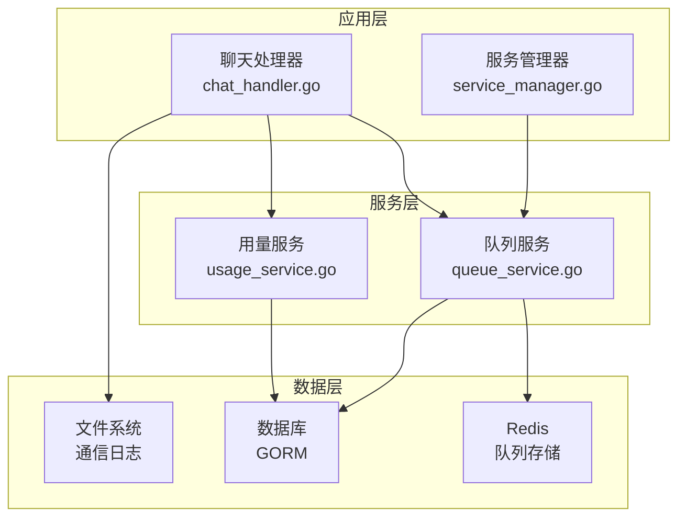
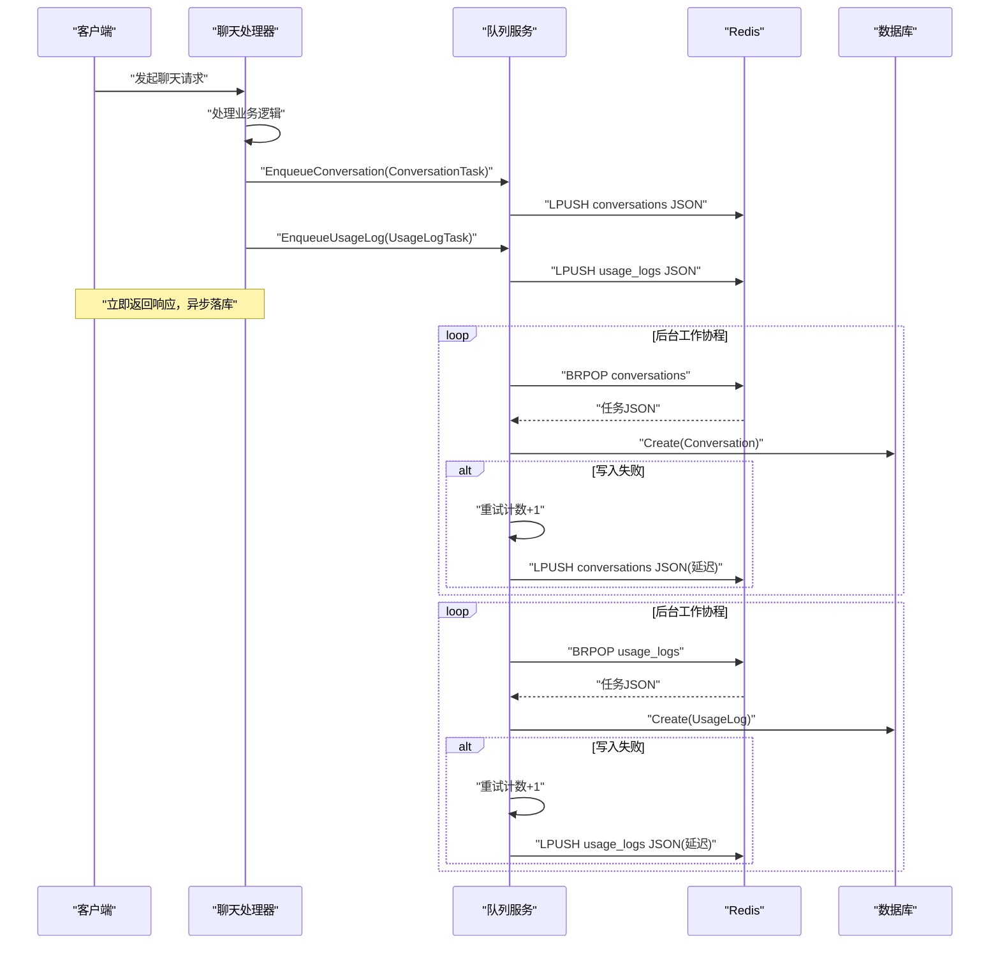
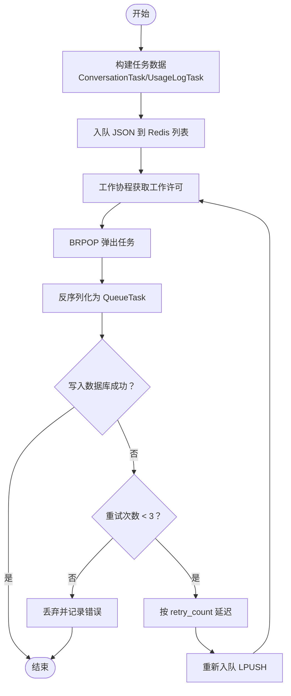
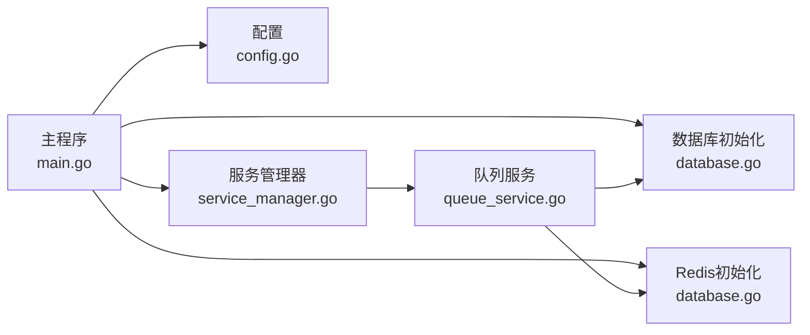

# 队列服务

<cite>
**本文档引用的文件**
- [internal/services/queue_service.go](file://internal/services/queue_service.go)
- [internal/models/models.go](file://internal/models/models.go)
- [internal/config/config.go](file://internal/config/config.go)
- [cmd/main.go](file://cmd/main.go)
- [internal/services/service_manager.go](file://internal/services/service_manager.go)
- [internal/api/handlers/chat_handler.go](file://internal/api/handlers/chat_handler.go)
- [internal/utils/database.go](file://internal/utils/database.go)
- [internal/services/communication_logger.go](file://internal/services/communication_logger.go)
- [configs/config.postgres.yaml](file://configs/config.postgres.yaml)
- [docker-compose.yml](file://docker-compose.yml)
</cite>

## 目录
1. [简介](#简介)
2. [项目结构](#项目结构)
3. [核心组件](#核心组件)
4. [架构总览](#架构总览)
5. [详细组件分析](#详细组件分析)
6. [依赖关系分析](#依赖关系分析)
7. [性能考虑](#性能考虑)
8. [故障排查指南](#故障排查指南)
9. [结论](#结论)
10. [附录](#附录)

## 简介
本文件针对 Wolink-Core 的队列服务进行深入技术文档化，重点覆盖以下方面：
- 异步任务队列的实现机制：任务入队、调度与执行流程
- 可靠性保证、重试机制与死信处理策略
- 与 Redis 的集成方式：消息序列化与持久化策略
- 任务创建、优先级管理与进度跟踪能力说明
- 性能优化策略、并发控制与资源管理方法

该队列服务采用 Redis 列表作为消息队列，结合轻量级工作池与轮询调度，实现对对话记录与用量日志的异步持久化。

## 项目结构
队列服务位于 internal/services 包中，核心文件为 queue_service.go；与之配合的还有：
- 数据模型 models.go 中的 Conversation 与 UsageLog 表结构
- 配置 config.go 中的基础设施配置（包含 Redis 连接池参数）
- 主程序 main.go 与服务管理器 service_manager.go 中的初始化与生命周期管理
- 聊天处理器 chat_handler.go 中的任务创建与入队调用
- Redis 初始化工具 database.go 中的连接与池配置
- 通信日志 communication_logger.go 展示了另一种异步落盘模式（与队列互补）



**图表来源**
- [internal/api/handlers/chat_handler.go:328-384](file://internal/api/handlers/chat_handler.go#L328-L384)
- [internal/services/service_manager.go:30-62](file://internal/services/service_manager.go#L30-L62)
- [internal/services/queue_service.go:70-90](file://internal/services/queue_service.go#L70-L90)
- [internal/utils/database.go:124-139](file://internal/utils/database.go#L124-L139)

**章节来源**
- [cmd/main.go:35-42](file://cmd/main.go#L35-L42)
- [internal/services/service_manager.go:30-62](file://internal/services/service_manager.go#L30-L62)

## 核心组件
- 队列服务 QueueService：负责任务入队、工作池调度、任务执行与重试
- 队列任务 QueueTask：统一的任务包装结构，包含类型、数据、重试计数与创建时间
- 任务数据 ConversationTask 与 UsageLogTask：具体业务任务载体
- Redis 集成：使用 LPUSH/BRPOP 实现队列入队与阻塞弹出
- 数据库持久化：将任务解析后的数据写入 Conversation 与 UsageLog 表
- 统计接口：提供队列长度、工作池状态等运行指标

关键实现要点：
- 入队：将 QueueTask JSON 序列化后 LPUSH 到 Redis 列表
- 出队：BRPOP 阻塞弹出，超时时间为 1 秒，避免忙轮询
- 执行：解析 JSON，构造对应模型对象，写入数据库
- 重试：失败时最多重试 3 次，每次延迟 retry_count 秒后重新入队
- 死信：超过最大重试次数后丢弃并记录错误日志

**章节来源**
- [internal/services/queue_service.go:17-32](file://internal/services/queue_service.go#L17-L32)
- [internal/services/queue_service.go:105-151](file://internal/services/queue_service.go#L105-L151)
- [internal/services/queue_service.go:211-277](file://internal/services/queue_service.go#L211-L277)
- [internal/services/queue_service.go:343-359](file://internal/services/queue_service.go#L343-L359)

## 架构总览
队列服务整体架构围绕“Redis 列表 + 工作池 + 数据库持久化”展开，聊天处理器在业务完成后将任务异步入队，后台工作协程持续从 Redis 拉取任务并写入数据库。



**图表来源**
- [internal/api/handlers/chat_handler.go:328-384](file://internal/api/handlers/chat_handler.go#L328-L384)
- [internal/services/queue_service.go:105-151](file://internal/services/queue_service.go#L105-L151)
- [internal/services/queue_service.go:211-277](file://internal/services/queue_service.go#L211-L277)
- [internal/services/queue_service.go:279-341](file://internal/services/queue_service.go#L279-L341)

## 详细组件分析

### 队列服务类图
```mermaid
classDiagram
class QueueService {
-db : *gorm.DB
-redis : *redis.Client
-logger : *logrus.Logger
-config : *config.Config
-workerPool : chan struct{}
-stopCh : chan struct{}
-wg : sync.WaitGroup
-conversationQueue : string
-usageLogQueue : string
+NewQueueService(db, redis, logger, cfg) QueueService
+EnqueueConversation(task) error
+EnqueueUsageLog(task) error
+GetQueueStats() map[string]interface{}
+Stop() void
-processConversationQueue() void
-processUsageLogQueue() void
-processConversationTask(ctx) void
-processUsageLogTask(ctx) void
-requeueTask(task, queueName) void
}
class QueueTask {
+string Type
+interface{} Data
+int RetryCount
+time.Time CreatedAt
}
class ConversationTask {
+uint APIKeyID
+uint DepartmentID
+string ModelName
+string RequestID
+string UserMessage
+string SystemPrompt
+string AssistantMessage
+int TokensUsed
+int64 ResponseTime
+bool HasSensitiveInfo
+string SensitiveTypes
+time.Time RequestTime
}
class UsageLogTask {
+uint APIKeyID
+uint DepartmentID
+string ModelName
+int TokensUsed
+time.Time RequestTime
+int64 ResponseTime
+string Status
+string ErrorMessage
}
QueueService --> QueueTask : "封装/重试"
QueueService --> ConversationTask : "消费"
QueueService --> UsageLogTask : "消费"
```

**图表来源**
- [internal/services/queue_service.go:17-32](file://internal/services/queue_service.go#L17-L32)
- [internal/services/queue_service.go:34-68](file://internal/services/queue_service.go#L34-L68)

**章节来源**
- [internal/services/queue_service.go:70-90](file://internal/services/queue_service.go#L70-L90)
- [internal/services/queue_service.go:105-151](file://internal/services/queue_service.go#L105-L151)
- [internal/services/queue_service.go:153-209](file://internal/services/queue_service.go#L153-L209)
- [internal/services/queue_service.go:211-341](file://internal/services/queue_service.go#L211-L341)

### 任务入队与执行流程
- 入队：聊天处理器在业务完成后，分别构造 ConversationTask 与 UsageLogTask，并调用队列服务的入队方法。入队时将任务序列化为 JSON，使用 LPUSH 推入对应的 Redis 列表。
- 调度：队列服务启动两个后台协程，分别监听 conversations 与 usage_logs 队列。每个协程以 100ms 为周期检查工作池许可，若可获得则派生一个 goroutine 处理任务。
- 执行：BRPOP 从 Redis 弹出任务，反序列化为 QueueTask，再根据 Type 解析为具体任务数据结构，最后写入数据库。若写入失败，按重试策略延迟后重新入队。



**图表来源**
- [internal/api/handlers/chat_handler.go:328-384](file://internal/api/handlers/chat_handler.go#L328-L384)
- [internal/services/queue_service.go:105-151](file://internal/services/queue_service.go#L105-L151)
- [internal/services/queue_service.go:211-277](file://internal/services/queue_service.go#L211-L277)
- [internal/services/queue_service.go:279-341](file://internal/services/queue_service.go#L279-L341)
- [internal/services/queue_service.go:343-359](file://internal/services/queue_service.go#L343-L359)

**章节来源**
- [internal/api/handlers/chat_handler.go:328-384](file://internal/api/handlers/chat_handler.go#L328-L384)
- [internal/services/queue_service.go:153-209](file://internal/services/queue_service.go#L153-L209)

### 可靠性保证、重试与死信处理
- 重试机制：任务写入数据库失败时，增加 retry_count 并延迟 retry_count 秒后重新入队，最多重试 3 次。
- 死信处理：超过最大重试次数后，不再重试，记录错误日志并丢弃任务。
- 超时与容错：BRPOP 设置 1 秒超时，避免长时间阻塞；对 Redis Nil 错误进行特殊处理，防止误报。
- 日志记录：对序列化失败、反序列化失败、数据库写入失败等情况均记录错误日志，便于排障。

**章节来源**
- [internal/services/queue_service.go:266-273](file://internal/services/queue_service.go#L266-L273)
- [internal/services/queue_service.go:330-337](file://internal/services/queue_service.go#L330-L337)
- [internal/services/queue_service.go:212-219](file://internal/services/queue_service.go#L212-L219)
- [internal/services/queue_service.go:281-287](file://internal/services/queue_service.go#L281-L287)

### 与 Redis 的集成与持久化策略
- 队列存储：使用 Redis 列表作为队列，LPUSH 入队，BRPOP 出队，天然支持 FIFO。
- 序列化：任务以 JSON 形式存储，便于跨语言与跨进程传输。
- 持久化：Redis 本身不提供自动持久化，但可通过配置 AOF/RDB 或使用持久化 Redis 服务保障数据安全。生产环境建议开启持久化或使用托管 Redis 服务。
- 连接池：Redis 客户端连接池通过配置文件与基础设施配置项进行设置，避免连接过多或过少导致的性能问题。

**章节来源**
- [internal/utils/database.go:44-71](file://internal/utils/database.go#L44-L71)
- [internal/utils/database.go:124-139](file://internal/utils/database.go#L124-L139)
- [internal/config/config.go:41-47](file://internal/config/config.go#L41-L47)
- [configs/config.postgres.yaml:14-18](file://configs/config.postgres.yaml#L14-L18)

### 任务创建、优先级管理与进度跟踪
- 任务创建：聊天处理器在业务完成后，基于请求上下文构造 ConversationTask 与 UsageLogTask，并调用队列服务入队。
- 优先级管理：当前实现未提供队列内优先级排序，所有任务按入队顺序处理。如需优先级，可在 Redis 中引入多个队列或使用有序集合。
- 进度跟踪：队列服务提供 GetQueueStats 接口，返回队列长度、工作池大小与活跃工作协程数量，可用于监控与告警。

**章节来源**
- [internal/api/handlers/chat_handler.go:328-384](file://internal/api/handlers/chat_handler.go#L328-L384)
- [internal/services/queue_service.go:361-374](file://internal/services/queue_service.go#L361-L374)

## 依赖关系分析
- 服务依赖：队列服务依赖 GORM 数据库连接、Redis 客户端、配置与日志组件。
- 初始化链路：主程序加载配置 → 初始化数据库与 Redis → 创建服务管理器 → 初始化队列服务。
- 生命周期：服务管理器统一管理队列服务的停止，确保后台工作协程优雅退出。



**图表来源**
- [cmd/main.go:20-42](file://cmd/main.go#L20-L42)
- [internal/services/service_manager.go:30-62](file://internal/services/service_manager.go#L30-L62)
- [internal/utils/database.go:77-139](file://internal/utils/database.go#L77-L139)

**章节来源**
- [cmd/main.go:20-42](file://cmd/main.go#L20-L42)
- [internal/services/service_manager.go:64-75](file://internal/services/service_manager.go#L64-L75)

## 性能考虑
- 并发控制
  - 工作池：通过固定容量的通道实现工作协程并发上限，默认 10 个并发，避免数据库与 Redis 的瞬时压力。
  - 轮询间隔：后台协程每 100ms 检查一次，平衡吞吐与 CPU 占用。
- 资源管理
  - Redis 连接池：通过基础设施配置项设置池大小、最小空闲连接、连接最大生命周期与池超时，避免连接泄漏与抖动。
  - 数据库连接池：同样通过配置项设置最大打开连接数、最大空闲连接数与连接生命周期。
- 序列化与网络
  - 任务 JSON 序列化开销较小，主要瓶颈在数据库写入与 Redis 网络往返。
- 监控与统计
  - 提供队列长度与工作池状态的运行指标，便于动态调整并发与容量。

**章节来源**
- [internal/services/queue_service.go:77-84](file://internal/services/queue_service.go#L77-L84)
- [internal/config/config.go:23-47](file://internal/config/config.go#L23-L47)
- [internal/utils/database.go:19-42](file://internal/utils/database.go#L19-L42)

## 故障排查指南
- 入队失败
  - 现象：返回“failed to enqueue ... task”错误
  - 排查：检查 Redis 连接是否正常、队列名称是否正确、JSON 序列化是否异常
- 出队失败
  - 现象：BRPOP 返回错误或超时
  - 排查：确认 Redis 是否存在对应队列、网络连通性、Redis 服务状态
- 数据库写入失败
  - 现象：写入 Conversation/UsageLog 失败并触发重试
  - 排查：检查数据库连接、表结构、索引、事务与约束冲突
- 重试与死信
  - 现象：任务多次重试后被丢弃
  - 排查：查看日志中的“failed after 3 retries”，定位具体失败原因并修复
- 并发与性能
  - 现象：队列积压、延迟上升
  - 排查：检查工作池大小、数据库写入性能、Redis 延迟与连接池配置

**章节来源**
- [internal/services/queue_service.go:114-123](file://internal/services/queue_service.go#L114-L123)
- [internal/services/queue_service.go:214-219](file://internal/services/queue_service.go#L214-L219)
- [internal/services/queue_service.go:263-273](file://internal/services/queue_service.go#L263-L273)
- [internal/services/queue_service.go:330-337](file://internal/services/queue_service.go#L330-L337)

## 结论
Wolink-Core 的队列服务通过 Redis 列表实现了简单可靠的异步任务处理，具备基本的重试与死信处理能力。其设计强调易用性与可维护性，适合中小规模的异步落库场景。对于更高要求的生产环境，建议：
- 引入队列优先级与限流策略
- 开启 Redis 持久化与高可用
- 增加队列监控与告警
- 考虑使用更专业的消息中间件（如 Kafka/RabbitMQ）以获得更强的可靠性与扩展性

## 附录

### 关键接口与路径参考
- 队列服务初始化与停止
  - [NewQueueService:70-90](file://internal/services/queue_service.go#L70-L90)
  - [Stop:376-382](file://internal/services/queue_service.go#L376-L382)
- 任务入队
  - [EnqueueConversation:105-127](file://internal/services/queue_service.go#L105-L127)
  - [EnqueueUsageLog:129-151](file://internal/services/queue_service.go#L129-L151)
- 任务执行与重试
  - [processConversationTask:211-277](file://internal/services/queue_service.go#L211-L277)
  - [processUsageLogTask:279-341](file://internal/services/queue_service.go#L279-L341)
  - [requeueTask:343-359](file://internal/services/queue_service.go#L343-L359)
- 统计接口
  - [GetQueueStats:361-374](file://internal/services/queue_service.go#L361-L374)
- 业务集成点
  - [recordConversationAsync:328-384](file://internal/api/handlers/chat_handler.go#L328-L384)
- 数据模型
  - [Conversation:90-116](file://internal/models/models.go#L90-L116)
  - [UsageLog:118-131](file://internal/models/models.go#L118-L131)
- 配置与连接
  - [Config 结构:10-18](file://internal/config/config.go#L10-L18)
  - [RedisPoolConfig:41-47](file://internal/config/config.go#L41-L47)
  - [InitRedis:124-139](file://internal/utils/database.go#L124-L139)
- 部署与环境
  - [docker-compose.yml:1-59](file://docker-compose.yml#L1-L59)
  - [config.postgres.yaml:1-35](file://configs/config.postgres.yaml#L1-L35)