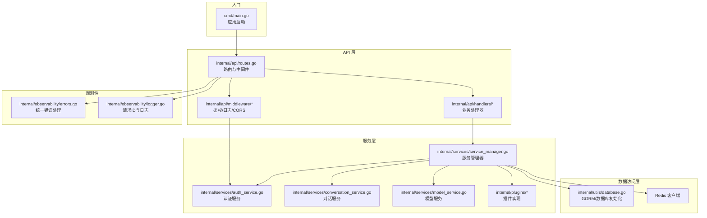
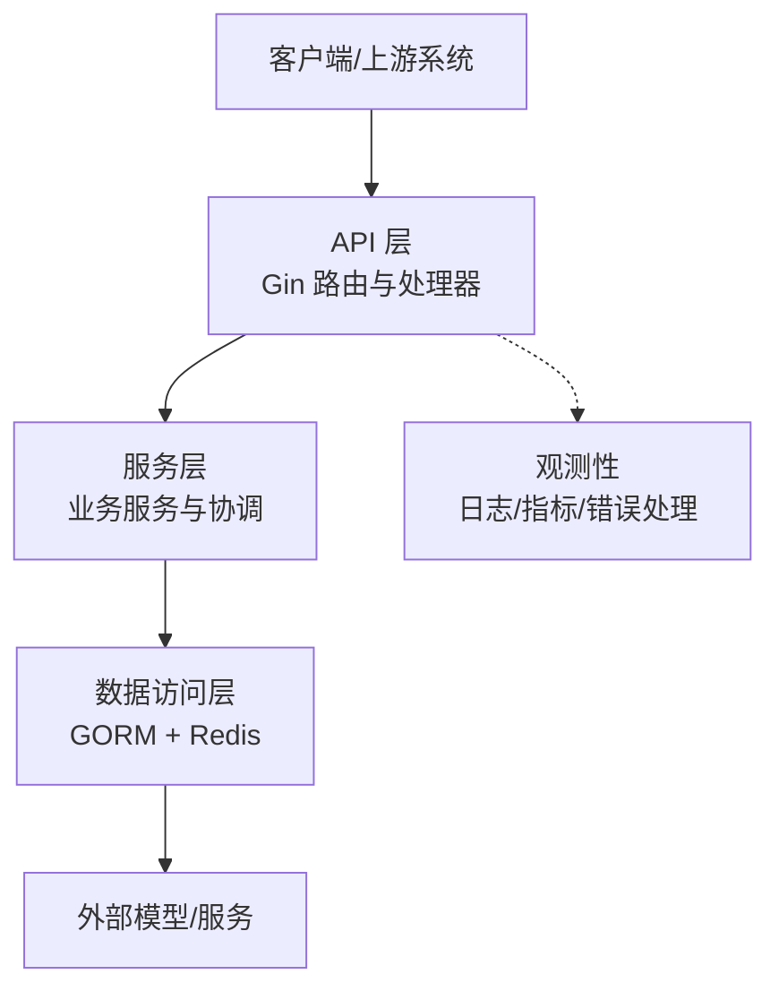
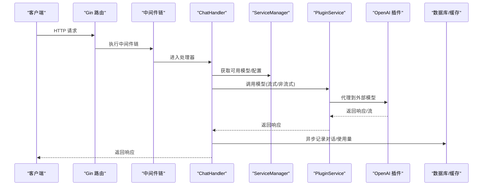
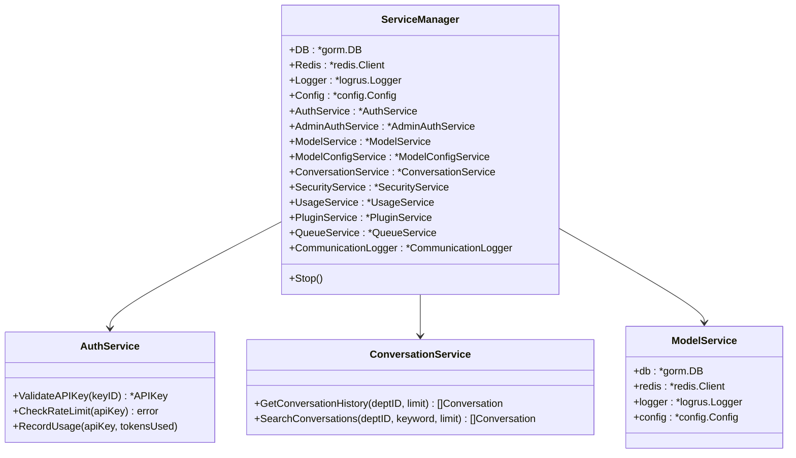
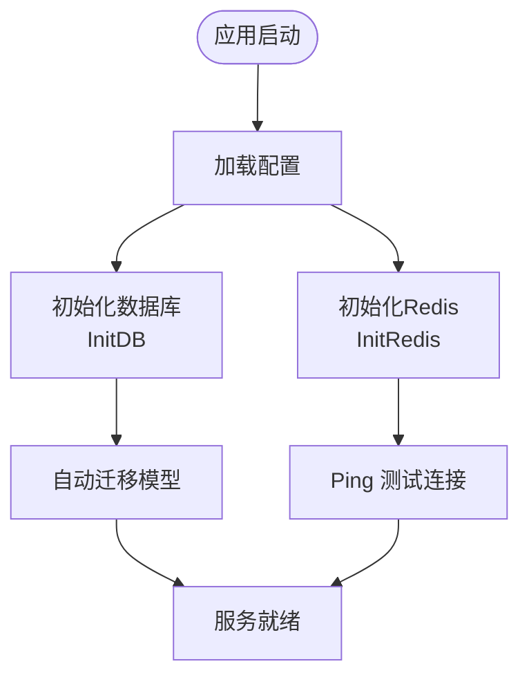
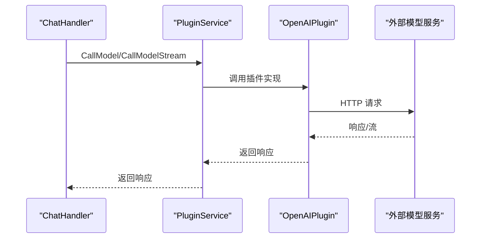
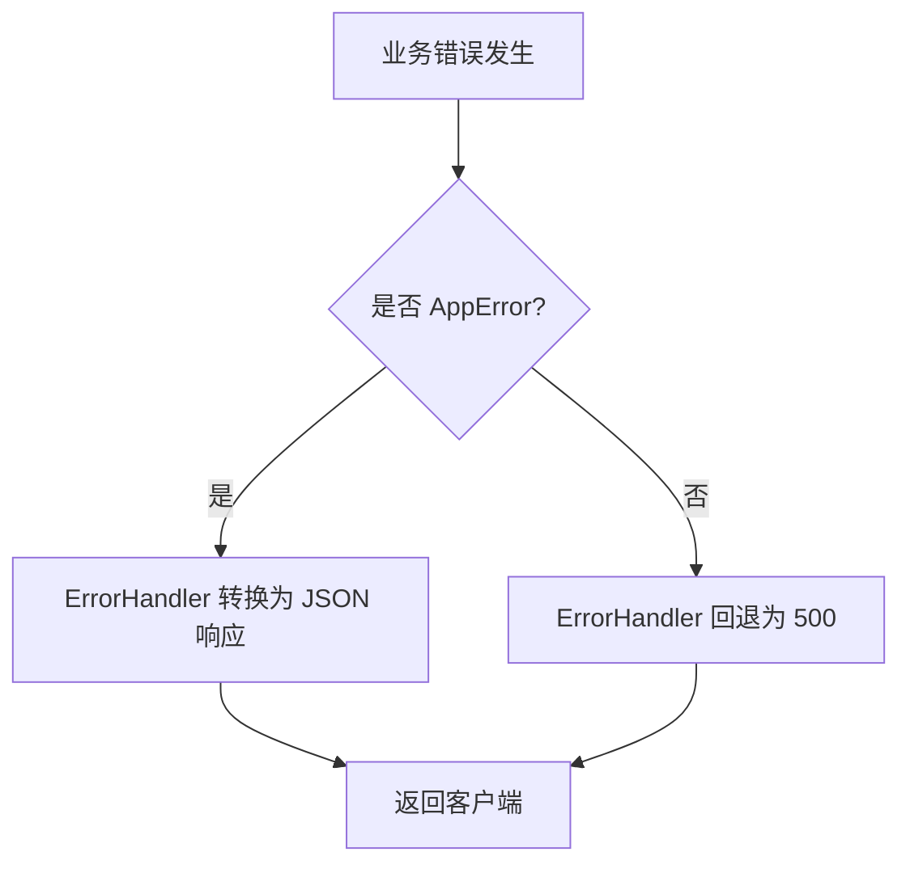
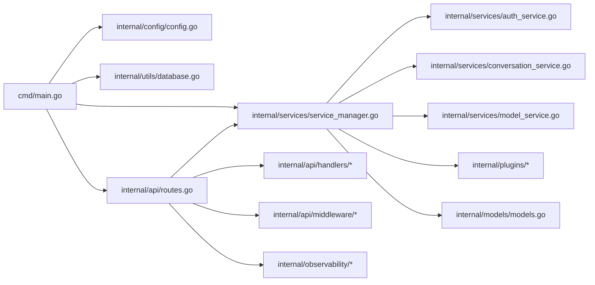

# 分层架构设计

<cite>
**本文档引用的文件**
- [main.go](file://cmd/main.go)
- [service_manager.go](file://internal/services/service_manager.go)
- [routes.go](file://internal/api/routes.go)
- [config.go](file://internal/config/config.go)
- [logger.go](file://internal/observability/logger.go)
- [errors.go](file://internal/observability/errors.go)
- [chat_handler.go](file://internal/api/handlers/chat_handler.go)
- [auth.go](file://internal/api/middleware/auth.go)
- [models.go](file://internal/models/models.go)
- [auth_service.go](file://internal/services/auth_service.go)
- [conversation_service.go](file://internal/services/conversation_service.go)
- [model_service.go](file://internal/services/model_service.go)
- [plugin_openai.go](file://internal/plugins/plugin_openai.go)
- [database.go](file://internal/utils/database.go)
</cite>

## 目录
1. [引言](#引言)
2. [项目结构](#项目结构)
3. [核心组件](#核心组件)
4. [架构总览](#架构总览)
5. [详细组件分析](#详细组件分析)
6. [依赖关系分析](#依赖关系分析)
7. [性能考量](#性能考量)
8. [故障排除指南](#故障排除指南)
9. [结论](#结论)

## 引言
本文件面向 Wolink-Core 的三层架构设计，系统性阐述 API 层（路由与处理器）、服务层（业务逻辑与服务协调）、数据访问层（数据库与缓存）的职责边界、接口定义与数据传递方式；解释层间通信机制（依赖注入模式与接口抽象设计），并通过具体代码路径展示 ServiceManager 如何实现松耦合的依赖管理，并说明层间错误处理与异常传播机制的设计考虑。

## 项目结构
Wolink-Core 采用典型的分层架构组织：
- API 层：Gin 路由与处理器，负责请求解析、鉴权、参数校验与响应封装
- 服务层：业务服务（认证、会话、模型配置、插件、队列等），协调各子系统
- 数据访问层：GORM 数据库与 Redis 缓存，提供持久化与高性能缓存能力
- 观测性：统一的日志、指标与错误处理中间件
- 配置：集中式配置加载与默认值设置

**图表来源**
- [main.go:19-89](file://cmd/main.go#L19-L89)
- [routes.go:14-129](file://internal/api/routes.go#L14-L129)
- [service_manager.go:30-62](file://internal/services/service_manager.go#L30-L62)
- [database.go:73-140](file://internal/utils/database.go#L73-L140)

**章节来源**
- [main.go:19-89](file://cmd/main.go#L19-L89)
- [routes.go:14-129](file://internal/api/routes.go#L14-L129)
- [service_manager.go:30-62](file://internal/services/service_manager.go#L30-L62)
- [database.go:73-140](file://internal/utils/database.go#L73-L140)

## 核心组件
- 应用入口与生命周期管理：cmd/main.go 负责配置加载、基础设施初始化（数据库、Redis）、服务管理器构建、HTTP 服务器启动与优雅关闭
- 服务管理器：ServiceManager 作为“容器”，聚合所有服务实例，提供统一的启动/停止生命周期管理
- 路由与中间件：SetupRoutes 构建 Gin 路由树，串联 Recovery、RequestID、Prometheus、Logger、CORS、ErrorHandler 等中间件链
- 业务处理器：ChatHandler 等处理器通过 ServiceManager 调用服务层，完成业务编排
- 业务服务：AuthService、ConversationService、ModelService 等实现具体业务逻辑
- 插件体系：OpenAI 兼容插件实现对外部模型的调用与流式代理
- 数据访问：GORM 提供 ORM 能力，Redis 提供缓存与限流计数

**章节来源**
- [main.go:19-89](file://cmd/main.go#L19-L89)
- [service_manager.go:11-62](file://internal/services/service_manager.go#L11-L62)
- [routes.go:14-129](file://internal/api/routes.go#L14-L129)
- [chat_handler.go:20-32](file://internal/api/handlers/chat_handler.go#L20-L32)
- [auth_service.go:19-33](file://internal/services/auth_service.go#L19-L33)

## 架构总览
Wolink-Core 的三层架构遵循“关注点分离”原则：
- API 层：薄层控制器，负责请求/响应转换、参数校验、中间件链与错误传播
- 服务层：厚业务层，封装领域逻辑、协调外部资源（数据库、缓存、插件），提供幂等与可测试的服务接口
- 数据访问层：统一的数据持久化与缓存接口，支持 GORM 与 Redis

[此图为概念性架构图，不直接映射具体源码文件，故无图表来源]

## 详细组件分析

### API 层：路由与处理器
- 路由组织：SetupRoutes 构建 /v1 OpenAI 兼容接口组，以及 /admin 管理接口组；WebSocket 代理路由独立于鉴权链
- 中间件链：Recovery -> RequestID -> Prometheus -> Logger -> CORS -> ErrorHandler，确保统一的可观测性与错误处理
- 处理器职责：ChatHandler 作为核心处理器，完成请求解析、模型选择、敏感信息检测、调用插件、异步记录对话与使用量、流式/非流式响应处理

**图表来源**
- [routes.go:32-75](file://internal/api/routes.go#L32-L75)
- [chat_handler.go:34-250](file://internal/api/handlers/chat_handler.go#L34-L250)
- [plugin_openai.go:42-121](file://internal/plugins/plugin_openai.go#L42-L121)

**章节来源**
- [routes.go:14-129](file://internal/api/routes.go#L14-L129)
- [chat_handler.go:20-32](file://internal/api/handlers/chat_handler.go#L20-L32)
- [auth.go:13-68](file://internal/api/middleware/auth.go#L13-L68)

### 服务层：业务逻辑与服务协调
- ServiceManager：集中管理数据库、Redis、日志、配置与各类业务服务实例，提供统一的启动/停止生命周期管理
- AuthService：API Key 验证、并发/日/月限流、使用量异步统计与缓存
- ConversationService：对话历史查询与搜索
- ModelService：模型配置与缓存管理
- 插件服务：统一调用不同协议的插件实现（如 OpenAI 兼容）

**图表来源**
- [service_manager.go:11-62](file://internal/services/service_manager.go#L11-L62)
- [auth_service.go:19-33](file://internal/services/auth_service.go#L19-L33)
- [conversation_service.go:12-26](file://internal/services/conversation_service.go#L12-L26)
- [model_service.go:11-25](file://internal/services/model_service.go#L11-L25)

**章节来源**
- [service_manager.go:30-76](file://internal/services/service_manager.go#L30-L76)
- [auth_service.go:35-149](file://internal/services/auth_service.go#L35-L149)
- [conversation_service.go:28-49](file://internal/services/conversation_service.go#L28-L49)
- [model_service.go:18-25](file://internal/services/model_service.go#L18-L25)

### 数据访问层：数据库与缓存
- 数据库初始化：InitDB 支持 MySQL/PostgreSQL/SQLite，自动迁移模型，连接池配置可按需覆盖
- Redis 初始化：InitRedis 支持连接池配置，Ping 测试连通性
- 业务数据模型：Department、APIKey、ModelRegistry、APIKeyModelMapping、Conversation、UsageLog 等

**图表来源**
- [main.go:20-40](file://cmd/main.go#L20-L40)
- [database.go:73-140](file://internal/utils/database.go#L73-L140)

**章节来源**
- [database.go:19-42](file://internal/utils/database.go#L19-L42)
- [database.go:73-140](file://internal/utils/database.go#L73-L140)
- [models.go:10-160](file://internal/models/models.go#L10-L160)

### 插件与外部集成
- OpenAI 兼容插件：实现 ChatCompletion、流式响应、音频转写/语音合成、健康检查等
- 插件调用流程：ChatHandler 通过 ServiceManager.PluginService 调用插件，插件内部构造 HTTP 请求并处理响应

**图表来源**
- [chat_handler.go:136-224](file://internal/api/handlers/chat_handler.go#L136-L224)
- [plugin_openai.go:42-121](file://internal/plugins/plugin_openai.go#L42-L121)

**章节来源**
- [plugin_openai.go:18-370](file://internal/plugins/plugin_openai.go#L18-L370)

### 错误处理与异常传播
- 统一错误类型：AppError 定义机器可读错误码与人类可读消息，映射到标准 HTTP 状态码
- 中间件：ErrorHandler 将 AppError 转换为结构化 JSON 响应，非 AppError 回退为 INTERNAL_ERROR
- 日志与追踪：RequestID 注入与提取，结合日志上下文实现跨服务追踪

**图表来源**
- [errors.go:103-142](file://internal/observability/errors.go#L103-L142)
- [logger.go:16-42](file://internal/observability/logger.go#L16-L42)

**章节来源**
- [errors.go:10-80](file://internal/observability/errors.go#L10-L80)
- [errors.go:103-142](file://internal/observability/errors.go#L103-L142)
- [logger.go:10-43](file://internal/observability/logger.go#L10-L43)

## 依赖关系分析
- 入口依赖：main.go 依赖 config、utils、api、services
- API 依赖：routes 依赖 handlers、middleware、observability、services
- 服务依赖：ServiceManager 聚合各业务服务，业务服务依赖数据库/缓存
- 数据依赖：业务服务依赖 models 定义的数据结构
- 插件依赖：插件实现依赖 models 的请求/响应结构

**图表来源**
- [main.go:11-16](file://cmd/main.go#L11-L16)
- [routes.go:3-12](file://internal/api/routes.go#L3-L12)
- [service_manager.go:3-9](file://internal/services/service_manager.go#L3-L9)
- [models.go:1-8](file://internal/models/models.go#L1-L8)

**章节来源**
- [main.go:11-16](file://cmd/main.go#L11-L16)
- [routes.go:3-12](file://internal/api/routes.go#L3-L12)
- [service_manager.go:3-9](file://internal/services/service_manager.go#L3-L9)
- [models.go:1-8](file://internal/models/models.go#L1-L8)

## 性能考量
- 连接池配置：数据库与 Redis 连接池参数可通过配置覆盖，默认值在 config.go 中设定
- 缓存策略：AuthService 使用 Redis 缓存 API Key 与限流计数，显著降低数据库压力
- 异步处理：对话记录与使用量统计通过队列异步执行，避免阻塞主请求路径
- 流式响应：插件层支持流式输出，ChatHandler 直接转发流数据，减少内存占用
- 中间件顺序：Recovery、RequestID、Prometheus、Logger、CORS、ErrorHandler 的顺序保证可观测性与一致的错误处理

[本节为通用性能讨论，不直接分析具体文件，故无章节来源]

## 故障排除指南
- 配置加载失败：检查配置文件路径与环境变量前缀，确认默认值是否满足预期
- 数据库连接失败：核对数据库类型、DSN 参数与连接池配置，查看自动迁移是否成功
- Redis 连接失败：确认主机、端口、密码与池配置，执行 Ping 测试
- API Key 验证失败：确认 API Key 是否激活、是否命中缓存、并发/日/月限流是否触发
- 插件调用异常：检查插件协议、BaseURL、API Key、超时设置与外部服务健康状态
- 错误响应格式：确认 ErrorHandler 已正确挂载，非 AppError 将回退为 INTERNAL_ERROR

**章节来源**
- [config.go:96-124](file://internal/config/config.go#L96-L124)
- [database.go:73-140](file://internal/utils/database.go#L73-L140)
- [auth_service.go:35-85](file://internal/services/auth_service.go#L35-L85)
- [errors.go:103-142](file://internal/observability/errors.go#L103-L142)

## 结论
Wolink-Core 通过清晰的三层架构实现了高内聚、低耦合的系统设计。ServiceManager 作为依赖注入容器，统一管理服务生命周期；API 层专注于请求编排与中间件链；服务层封装业务逻辑并协调外部资源；数据访问层提供稳定的数据持久化与缓存能力。配合统一的错误处理与可观测性中间件，系统具备良好的可维护性、可扩展性与运行稳定性。