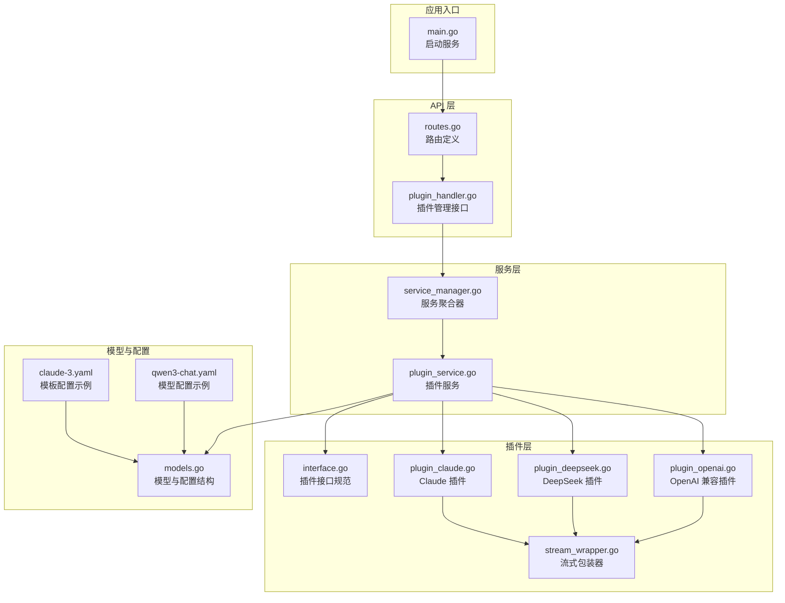
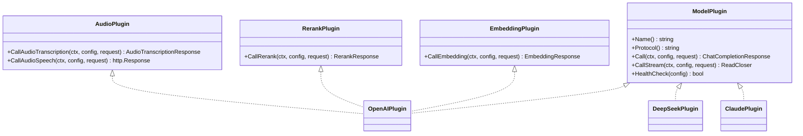
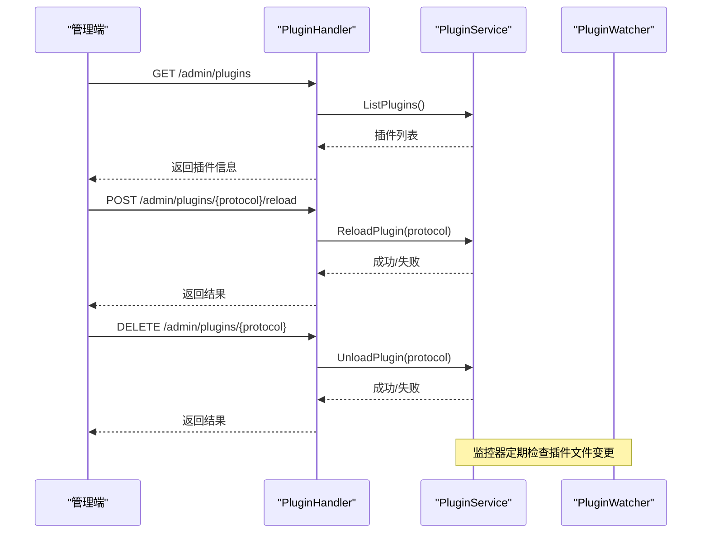
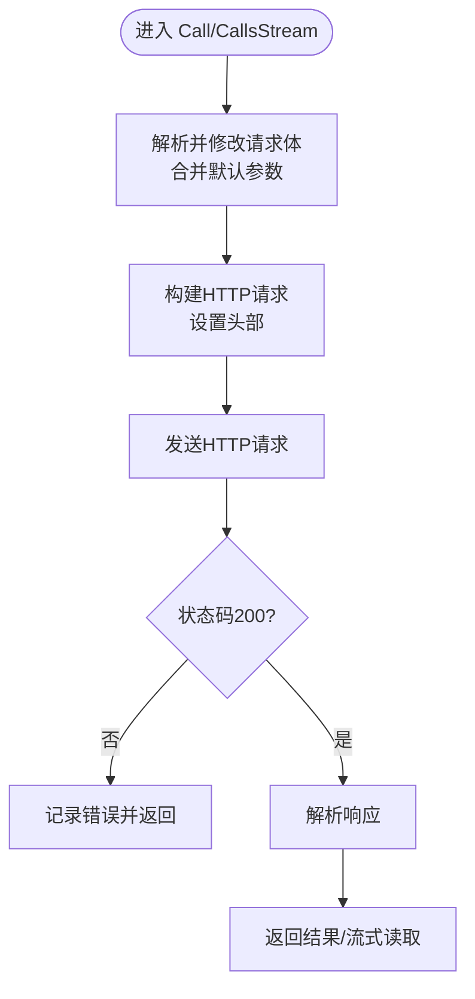
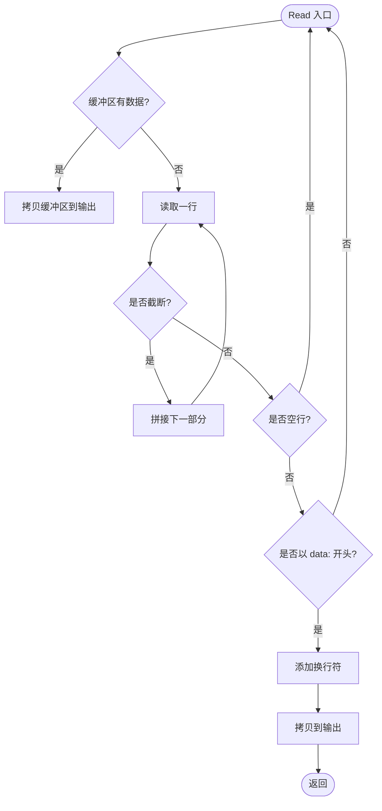
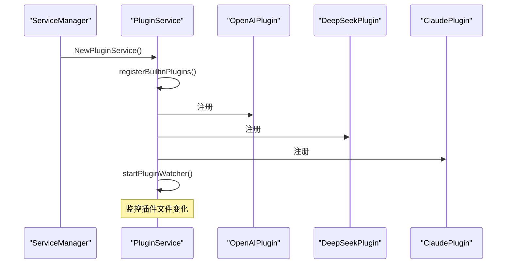
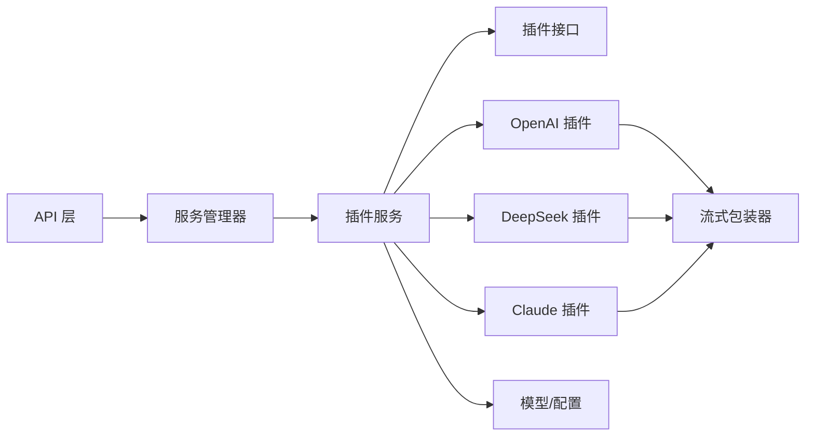

# 插件化架构

<cite>
**本文引用的文件**
- [interface.go](file://internal/plugins/interface.go)
- [plugin_openai.go](file://internal/plugins/plugin_openai.go)
- [plugin_claude.go](file://internal/plugins/plugin_claude.go)
- [plugin_deepseek.go](file://internal/plugins/plugin_deepseek.go)
- [stream_wrapper.go](file://internal/plugins/stream_wrapper.go)
- [plugin_service.go](file://internal/services/plugin_service.go)
- [service_manager.go](file://internal/services/service_manager.go)
- [routes.go](file://internal/api/routes.go)
- [plugin_handler.go](file://internal/api/handlers/plugin_handler.go)
- [models.go](file://internal/models/models.go)
- [main.go](file://cmd/main.go)
- [qwen3-chat.yaml](file://configs/models/qwen3-chat.yaml)
- [claude-3.yaml](file://configs/templates/claude-3.yaml)
</cite>

## 目录
1. [简介](#简介)
2. [项目结构](#项目结构)
3. [核心组件](#核心组件)
4. [架构总览](#架构总览)
5. [详细组件分析](#详细组件分析)
6. [依赖分析](#依赖分析)
7. [性能考量](#性能考量)
8. [故障排查指南](#故障排查指南)
9. [结论](#结论)
10. [附录](#附录)

## 简介
本文件面向 Wolink-Core 的插件化架构，系统性阐述插件系统的设计原理、接口规范、生命周期管理、注册/发现/加载机制、插件间隔离与通信方式，并给出对不同 AI 模型提供商（OpenAI、Claude、DeepSeek）的支持方案与扩展指南。文档同时覆盖插件配置管理、动态加载与热更新能力现状与建议，提供实现示例路径与最佳实践，帮助开发者快速上手并安全扩展新的模型提供商。

## 项目结构
Wolink-Core 将插件系统置于 internal/plugins 目录，服务层在 internal/services 中集中管理插件注册、生命周期与调用分发；API 层通过内部服务管理器注入插件服务，提供管理端插件查询、重载与卸载等接口；配置文件位于 configs 目录，支持模型配置与模板化参数。

图表来源
- [main.go:19-89](file://cmd/main.go#L19-L89)
- [routes.go:14-129](file://internal/api/routes.go#L14-L129)
- [plugin_handler.go:12-74](file://internal/api/handlers/plugin_handler.go#L12-L74)
- [service_manager.go:30-62](file://internal/services/service_manager.go#L30-L62)
- [plugin_service.go:21-366](file://internal/services/plugin_service.go#L21-L366)
- [interface.go:11-55](file://internal/plugins/interface.go#L11-L55)
- [plugin_openai.go:18-370](file://internal/plugins/plugin_openai.go#L18-L370)
- [plugin_deepseek.go:17-235](file://internal/plugins/plugin_deepseek.go#L17-L235)
- [plugin_claude.go:17-248](file://internal/plugins/plugin_claude.go#L17-L248)
- [stream_wrapper.go:9-95](file://internal/plugins/stream_wrapper.go#L9-L95)
- [models.go:56-463](file://internal/models/models.go#L56-L463)
- [qwen3-chat.yaml:1-12](file://configs/models/qwen3-chat.yaml#L1-L12)
- [claude-3.yaml:1-75](file://configs/templates/claude-3.yaml#L1-L75)

章节来源
- [main.go:19-89](file://cmd/main.go#L19-L89)
- [routes.go:14-129](file://internal/api/routes.go#L14-L129)
- [plugin_handler.go:12-74](file://internal/api/handlers/plugin_handler.go#L12-L74)
- [service_manager.go:30-62](file://internal/services/service_manager.go#L30-L62)
- [plugin_service.go:21-366](file://internal/services/plugin_service.go#L21-L366)

## 核心组件
- 插件接口规范：定义统一的模型调用能力与可选扩展能力（嵌入、重排序、音频），并提供健康检查能力。
- 内置插件实现：OpenAI 兼容、Claude、DeepSeek，均实现基础调用与流式调用，并针对各自协议进行适配。
- 插件服务：负责插件注册、并发安全访问、按协议路由调用、健康检查、插件列表与生命周期管理。
- 流式包装器：将第三方 SSE/流式响应转换为统一的流式输出格式。
- 配置模型：定义运行时模型配置、连接配置、参数配置与能力开关，支撑插件参数透传与默认值合并。
- API 管理接口：提供插件列表、重载、卸载、健康检查等管理能力。

章节来源
- [interface.go:11-55](file://internal/plugins/interface.go#L11-L55)
- [plugin_openai.go:18-370](file://internal/plugins/plugin_openai.go#L18-L370)
- [plugin_claude.go:17-248](file://internal/plugins/plugin_claude.go#L17-L248)
- [plugin_deepseek.go:17-235](file://internal/plugins/plugin_deepseek.go#L17-L235)
- [stream_wrapper.go:9-95](file://internal/plugins/stream_wrapper.go#L9-L95)
- [plugin_service.go:21-366](file://internal/services/plugin_service.go#L21-L366)
- [models.go:56-463](file://internal/models/models.go#L56-L463)

## 架构总览
插件系统采用“接口抽象 + 多实现 + 服务编排”的模式：
- 接口层：统一的 ModelPlugin 与可选扩展接口，屏蔽不同提供商差异。
- 实现层：各提供商独立实现，专注协议适配与参数映射。
- 服务层：集中注册、并发控制、调用分发、健康检查与生命周期管理。
- API 层：对外暴露管理接口，便于运维操作与可观测性。

图表来源
- [interface.go:11-55](file://internal/plugins/interface.go#L11-L55)
- [plugin_openai.go:18-370](file://internal/plugins/plugin_openai.go#L18-L370)
- [plugin_deepseek.go:17-235](file://internal/plugins/plugin_deepseek.go#L17-L235)
- [plugin_claude.go:17-248](file://internal/plugins/plugin_claude.go#L17-L248)

## 详细组件分析

### 插件接口规范与生命周期
- 接口职责
  - 基础能力：名称、协议标识、非流式与流式调用、健康检查。
  - 扩展能力：嵌入、重排序、音频（转写/合成）。
- 生命周期
  - 注册：内置插件在服务初始化时注册，外部插件可通过服务提供的注册方法接入。
  - 访问：通过协议键并发安全地获取插件实例。
  - 健康检查：服务层统一维护插件健康状态，管理端可触发全量检查。
  - 卸载：移除插件映射并标记为未加载。
  - 停止：服务停止时关闭监控器与资源。

图表来源
- [plugin_handler.go:24-74](file://internal/api/handlers/plugin_handler.go#L24-L74)
- [plugin_service.go:291-335](file://internal/services/plugin_service.go#L291-L335)
- [plugin_service.go:94-170](file://internal/services/plugin_service.go#L94-L170)

章节来源
- [interface.go:11-55](file://internal/plugins/interface.go#L11-L55)
- [plugin_service.go:21-366](file://internal/services/plugin_service.go#L21-L366)
- [plugin_handler.go:12-74](file://internal/api/handlers/plugin_handler.go#L12-L74)

### OpenAI 兼容插件
- 设计要点
  - 透传原始请求体，按需合并默认参数（温度、最大令牌数、top_p 等）。
  - 支持非流式与流式两种调用，流式通过包装器适配 SSE。
  - 健康检查发送最小请求验证可用性。
  - 音频能力：转写与合成，遵循 OpenAI 兼容端点。
- 参数与配置
  - 连接配置包含 BaseURL、APIKey、模型、超时、默认参数等。
  - 模型配置文件支持 YAML 定义，含协议、能力、连接配置与状态。

图表来源
- [plugin_openai.go:42-121](file://internal/plugins/plugin_openai.go#L42-L121)
- [plugin_openai.go:123-193](file://internal/plugins/plugin_openai.go#L123-L193)
- [plugin_openai.go:195-229](file://internal/plugins/plugin_openai.go#L195-L229)

章节来源
- [plugin_openai.go:18-370](file://internal/plugins/plugin_openai.go#L18-L370)
- [models.go:449-462](file://internal/models/models.go#L449-L462)
- [qwen3-chat.yaml:1-12](file://configs/models/qwen3-chat.yaml#L1-L12)

### Claude 插件
- 设计要点
  - 将通用消息格式转换为 Claude 协议的消息结构，必要时注入 system 字段。
  - 必填 max_tokens，若请求未提供则使用默认值。
  - 响应转换为 OpenAI 兼容格式，便于上层统一处理。
  - 健康检查简化为 API Key 校验。
- 参数与配置
  - 默认 BaseURL 指向 Anthropic API。
  - 模板配置示例展示协议、能力、连接配置与默认参数。

章节来源
- [plugin_claude.go:17-248](file://internal/plugins/plugin_claude.go#L17-L248)
- [claude-3.yaml:46-75](file://configs/templates/claude-3.yaml#L46-L75)

### DeepSeek 插件
- 设计要点
  - 与 OpenAI 兼容插件类似，透传请求体并合并默认参数。
  - 默认 BaseURL 指向 DeepSeek API。
  - 健康检查发送最小请求验证可用性。
- 参数与配置
  - 连接配置包含 BaseURL、APIKey、模型、超时、默认参数等。

章节来源
- [plugin_deepseek.go:17-235](file://internal/plugins/plugin_deepseek.go#L17-L235)
- [models.go:449-462](file://internal/models/models.go#L449-L462)

### 流式包装器
- 设计要点
  - 读取逐行数据，跳过空行与非 data 行，确保输出符合 SSE 格式。
  - 提供缓冲与关闭语义，保证流式读取的正确性与资源释放。

图表来源
- [stream_wrapper.go:27-86](file://internal/plugins/stream_wrapper.go#L27-L86)

章节来源
- [stream_wrapper.go:9-95](file://internal/plugins/stream_wrapper.go#L9-L95)

### 插件服务与生命周期管理
- 注册内置插件：OpenAI、DeepSeek、Claude 在服务初始化时注册。
- 监控器：定期扫描插件目录，记录文件变更（当前未实现动态重载，仅记录）。
- 调用分发：根据模型配置的协议键选择对应插件，支持嵌入、重排序、音频等扩展能力。
- 管理接口：提供插件列表、重载、卸载、健康检查。

图表来源
- [service_manager.go:30-62](file://internal/services/service_manager.go#L30-L62)
- [plugin_service.go:38-108](file://internal/services/plugin_service.go#L38-L108)

章节来源
- [plugin_service.go:21-366](file://internal/services/plugin_service.go#L21-L366)
- [service_manager.go:30-62](file://internal/services/service_manager.go#L30-L62)

### 插件配置管理与模型配置
- 运行时配置模型：包含基本信息、协议、能力、连接配置、参数与状态。
- 连接配置：BaseURL、APIKey、超时、默认参数（温度、最大令牌数、top_p、top_k、停用词等）。
- 模型配置文件：YAML 格式，支持模板化参数与默认值，便于快速部署与管理。

章节来源
- [models.go:56-463](file://internal/models/models.go#L56-L463)
- [qwen3-chat.yaml:1-12](file://configs/models/qwen3-chat.yaml#L1-L12)
- [claude-3.yaml:1-75](file://configs/templates/claude-3.yaml#L1-L75)

### 动态加载与热更新机制
- 当前实现
  - 插件目录监控器启动并记录文件变更，但未实现动态重载与热更新。
  - 重载与卸载接口仅更新内存状态，未真正卸载或重新加载插件实例。
- 建议改进
  - 基于文件变更触发模块级重载（受限于 Go 的模块加载特性）。
  - 或采用进程外插件（如基于共享库/插件二进制）并通过进程管理实现热更新。
  - 在服务层增加“动态注册/注销”能力，结合配置中心实现配置驱动的插件启停。

章节来源
- [plugin_service.go:94-170](file://internal/services/plugin_service.go#L94-L170)
- [plugin_service.go:304-335](file://internal/services/plugin_service.go#L304-L335)

### 插件间隔离与通信
- 隔离
  - 插件通过协议键隔离，服务层按协议路由调用，互不干扰。
  - 流式包装器统一输出格式，避免上游差异影响下游。
- 通信
  - 插件与服务层通过接口通信，服务层与 API 层通过处理器通信。
  - 管理端通过 API 层与服务层交互，实现插件生命周期管理。

章节来源
- [plugin_service.go:198-289](file://internal/services/plugin_service.go#L198-L289)
- [routes.go:121-126](file://internal/api/routes.go#L121-L126)

## 依赖分析
- 组件耦合
  - 插件服务对插件接口强依赖，对具体实现弱依赖，具备高内聚低耦合特性。
  - API 层仅依赖服务管理器，服务管理器再依赖各服务，形成清晰的依赖链。
- 外部依赖
  - HTTP 客户端用于第三方 API 调用。
  - 日志库用于结构化日志记录。
  - Gin 用于路由与中间件。
- 循环依赖
  - 未发现循环依赖，结构清晰。

图表来源
- [routes.go:14-129](file://internal/api/routes.go#L14-L129)
- [service_manager.go:30-62](file://internal/services/service_manager.go#L30-L62)
- [plugin_service.go:21-366](file://internal/services/plugin_service.go#L21-L366)
- [interface.go:11-55](file://internal/plugins/interface.go#L11-L55)
- [plugin_openai.go:18-370](file://internal/plugins/plugin_openai.go#L18-L370)
- [plugin_deepseek.go:17-235](file://internal/plugins/plugin_deepseek.go#L17-L235)
- [plugin_claude.go:17-248](file://internal/plugins/plugin_claude.go#L17-L248)
- [stream_wrapper.go:9-95](file://internal/plugins/stream_wrapper.go#L9-L95)
- [models.go:56-463](file://internal/models/models.go#L56-L463)

章节来源
- [routes.go:14-129](file://internal/api/routes.go#L14-L129)
- [service_manager.go:30-62](file://internal/services/service_manager.go#L30-L62)
- [plugin_service.go:21-366](file://internal/services/plugin_service.go#L21-L366)

## 性能考量
- 并发安全：插件服务使用读写锁保护插件映射与信息，避免竞态。
- 流式处理：流式包装器按行读取并缓冲，减少内存占用与延迟。
- 超时控制：HTTP 客户端设置超时，避免阻塞。
- 监控频率：插件文件监控器采用定时器降低开销。
- 建议优化
  - 对高频调用的插件增加连接池与重试策略。
  - 对流式响应增加背压与缓冲阈值控制。
  - 对健康检查增加缓存与降采样策略。

[本节为通用指导，无需特定文件引用]

## 故障排查指南
- 常见问题
  - 插件未找到：确认模型配置的协议与插件注册的协议一致。
  - API Key 为空：检查连接配置中的 APIKey 是否正确设置。
  - 健康检查失败：查看日志中的错误码与响应体，确认第三方服务可达性。
  - 流式输出异常：检查流式包装器是否正确处理 SSE 行与空行。
- 排查步骤
  - 通过管理端接口列出插件并检查健康状态。
  - 查看服务日志定位错误来源。
  - 验证模型配置文件与连接配置是否匹配。
  - 对比第三方 API 文档确认请求格式与参数。

章节来源
- [plugin_service.go:337-350](file://internal/services/plugin_service.go#L337-L350)
- [plugin_openai.go:195-229](file://internal/plugins/plugin_openai.go#L195-L229)
- [plugin_deepseek.go:204-234](file://internal/plugins/plugin_deepseek.go#L204-L234)
- [plugin_claude.go:150-161](file://internal/plugins/plugin_claude.go#L150-L161)

## 结论
Wolink-Core 的插件化架构以接口抽象为核心，实现了对 OpenAI、Claude、DeepSeek 等多家模型提供商的统一接入与管理。通过服务层的注册、并发控制与生命周期管理，配合 API 层的管理接口，满足了运维侧的可观测与可控性需求。当前在动态加载与热更新方面仍处于记录阶段，后续可结合进程外插件或配置驱动的方式进一步完善。整体设计清晰、扩展性强，适合持续演进与生态扩展。

[本节为总结，无需特定文件引用]

## 附录

### 扩展新模型提供商指南
- 步骤
  - 定义插件结构体并实现接口：Name、Protocol、Call、CallStream、HealthCheck；如支持嵌入/重排序/音频，实现相应接口。
  - 在服务层注册插件：在初始化阶段注册或通过外部注册接口接入。
  - 配置模型：在模型配置文件中设置协议、连接配置与默认参数。
  - 测试验证：编写单元测试与集成测试，覆盖非流式、流式、健康检查与错误场景。
- 注意事项
  - 严格遵循请求/响应格式，必要时进行协议转换。
  - 合理处理默认参数与透传参数的优先级。
  - 对流式响应进行严格的 SSE 格式校验与缓冲控制。
  - 记录详细的日志以便排查问题。

章节来源
- [interface.go:11-55](file://internal/plugins/interface.go#L11-L55)
- [plugin_service.go:55-92](file://internal/services/plugin_service.go#L55-L92)
- [models.go:449-462](file://internal/models/models.go#L449-L462)

### 最佳实践
- 参数管理
  - 将默认参数与请求参数分离，仅在请求未提供时应用默认值。
  - 对必填参数（如 Claude 的 max_tokens）进行强制校验与默认填充。
- 错误处理
  - 对第三方 API 的错误码与响应体进行结构化解析与日志记录。
  - 区分网络错误与业务错误，返回一致的错误格式。
- 可观测性
  - 在关键路径记录请求与响应摘要，避免泄露敏感信息。
  - 对健康检查与调用耗时进行指标采集与告警。
- 安全
  - 严格校验 API Key 与权限，避免越权调用。
  - 对上传文件与输入内容进行必要的校验与清洗。

[本节为通用指导，无需特定文件引用]