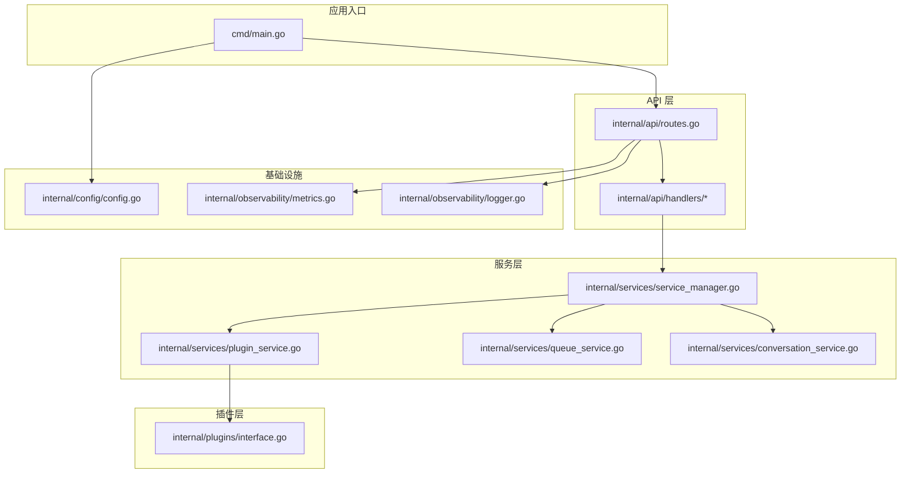
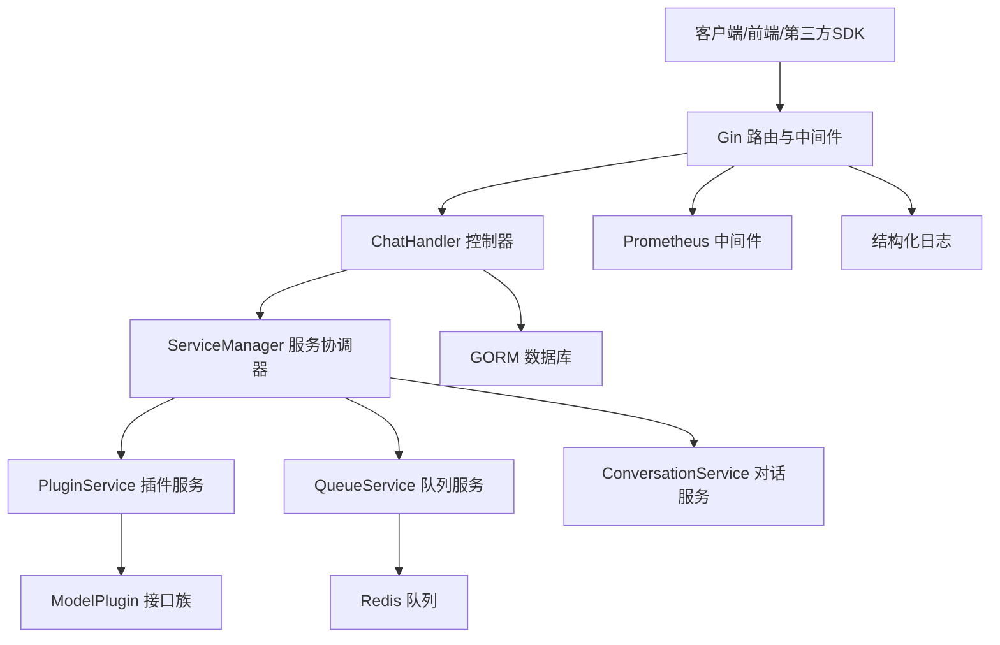
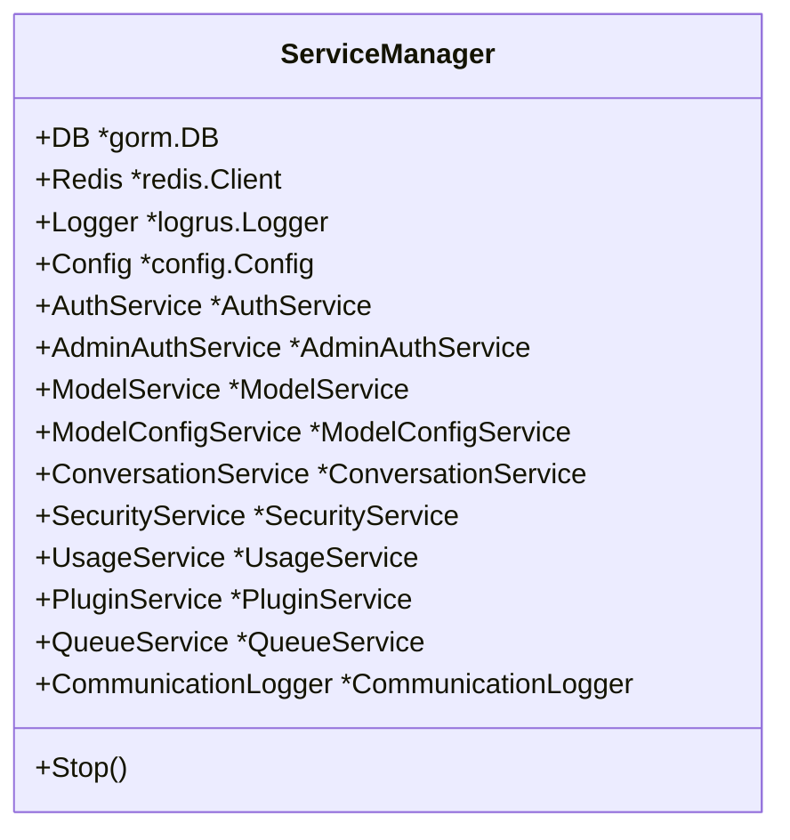
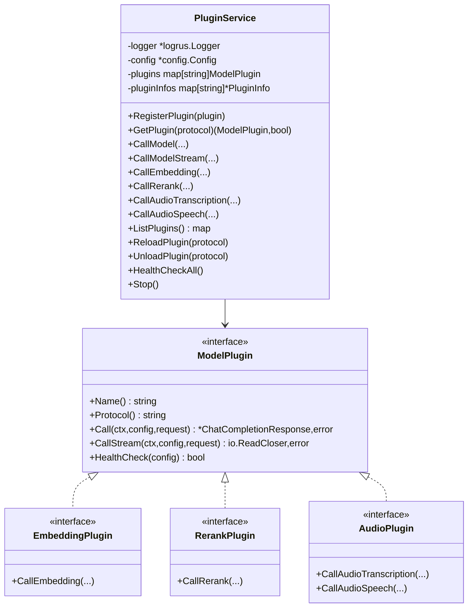
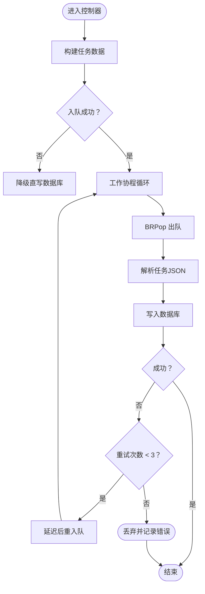
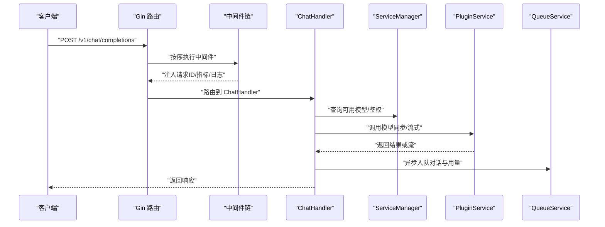
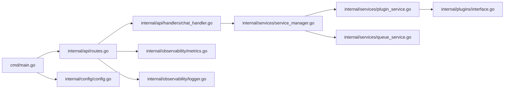

# 架构设计

<cite>
**本文引用的文件**
- [cmd/main.go](file://cmd/main.go)
- [internal/api/routes.go](file://internal/api/routes.go)
- [internal/api/handlers/chat_handler.go](file://internal/api/handlers/chat_handler.go)
- [internal/services/service_manager.go](file://internal/services/service_manager.go)
- [internal/services/plugin_service.go](file://internal/services/plugin_service.go)
- [internal/plugins/interface.go](file://internal/plugins/interface.go)
- [internal/services/queue_service.go](file://internal/services/queue_service.go)
- [internal/services/conversation_service.go](file://internal/services/conversation_service.go)
- [internal/config/config.go](file://internal/config/config.go)
- [internal/observability/metrics.go](file://internal/observability/metrics.go)
- [internal/observability/logger.go](file://internal/observability/logger.go)
- [Dockerfile](file://Dockerfile)
- [docker-compose.yml](file://docker-compose.yml)
- [configs/config.mysql.yaml](file://configs/config.mysql.yaml)
- [go.mod](file://go.mod)
</cite>

## 目录
1. [引言](#引言)
2. [项目结构](#项目结构)
3. [核心组件](#核心组件)
4. [架构总览](#架构总览)
5. [详细组件分析](#详细组件分析)
6. [依赖分析](#依赖分析)
7. [性能考量](#性能考量)
8. [故障排查指南](#故障排查指南)
9. [结论](#结论)
10. [附录](#附录)

## 引言
Wolink-Core 是一个面向多模型与多协议的统一网关系统，提供 OpenAI 兼容接口与管理后台能力，并通过插件化架构支持多种大模型供应商（如 OpenAI、Claude、DeepSeek）及多模态能力（语音/音频）。系统采用分层架构与服务协调器模式，结合 Gin Web 框架、GORM ORM、Redis 队列与 Prometheus 监控，实现高内聚、低耦合与可扩展的微服务化设计。

## 项目结构
项目采用按“职责领域”划分的分层组织方式：
- cmd：应用入口与生命周期控制
- internal/api：路由与中间件、控制器（Handlers）
- internal/services：业务服务层（ServiceManager 协调各服务）
- internal/plugins：插件接口与内置插件
- internal/config：配置加载与默认值
- internal/observability：指标与日志工具
- configs：运行时配置模板
- docker-compose 与 Dockerfile：容器化与部署拓扑

图表来源
- [cmd/main.go:19-89](file://cmd/main.go#L19-L89)
- [internal/api/routes.go:14-129](file://internal/api/routes.go#L14-L129)
- [internal/api/handlers/chat_handler.go:20-716](file://internal/api/handlers/chat_handler.go#L20-L716)
- [internal/services/service_manager.go:30-76](file://internal/services/service_manager.go#L30-L76)
- [internal/services/plugin_service.go:38-366](file://internal/services/plugin_service.go#L38-L366)
- [internal/plugins/interface.go:11-55](file://internal/plugins/interface.go#L11-L55)
- [internal/services/queue_service.go:70-382](file://internal/services/queue_service.go#L70-L382)
- [internal/services/conversation_service.go:19-49](file://internal/services/conversation_service.go#L19-L49)
- [internal/config/config.go:96-185](file://internal/config/config.go#L96-L185)
- [internal/observability/metrics.go:53-93](file://internal/observability/metrics.go#L53-L93)
- [internal/observability/logger.go:16-43](file://internal/observability/logger.go#L16-L43)

章节来源
- [cmd/main.go:19-89](file://cmd/main.go#L19-L89)
- [internal/api/routes.go:14-129](file://internal/api/routes.go#L14-L129)
- [internal/config/config.go:96-185](file://internal/config/config.go#L96-L185)

## 核心组件
- 应用入口与生命周期：负责配置加载、数据库/缓存初始化、服务协调器构建、HTTP 服务器启动与优雅关闭。
- 路由与中间件：统一注册中间件链（panic 恢复、请求ID、Prometheus 指标、结构化日志、CORS、错误处理），并按 OpenAI 兼容规范暴露 REST 接口与 WebSocket。
- 服务协调器（ServiceManager）：集中管理 AuthService、AdminAuthService、ModelService、ModelConfigService、ConversationService、SecurityService、UsageService、PluginService、QueueService、CommunicationLogger 等服务实例及其生命周期。
- 插件服务（PluginService）：内置 OpenAI/Claude/DeepSeek 插件，提供模型调用、流式调用、Embedding/Rerank/Audio 能力；支持插件注册、健康检查与卸载。
- 队列服务（QueueService）：基于 Redis List 的异步队列，解耦对话与用量日志写入，具备工作池、重试与统计能力。
- 观测性：Prometheus 指标中间件与日志上下文注入，便于监控与排障。

章节来源
- [cmd/main.go:19-89](file://cmd/main.go#L19-L89)
- [internal/api/routes.go:14-129](file://internal/api/routes.go#L14-L129)
- [internal/services/service_manager.go:30-76](file://internal/services/service_manager.go#L30-L76)
- [internal/services/plugin_service.go:38-366](file://internal/services/plugin_service.go#L38-L366)
- [internal/services/queue_service.go:70-382](file://internal/services/queue_service.go#L70-L382)
- [internal/observability/metrics.go:53-93](file://internal/observability/metrics.go#L53-L93)
- [internal/observability/logger.go:16-43](file://internal/observability/logger.go#L16-L43)

## 架构总览
系统采用“入口 -> 路由/中间件 -> 控制器 -> 服务协调器 -> 插件/队列”的分层设计，职责清晰、边界明确。插件化架构使模型供应商切换与能力扩展成本极低；队列服务实现高吞吐下的削峰填谷；配置中心化与环境变量前缀统一，便于运维与多环境部署。

图表来源
- [internal/api/routes.go:14-129](file://internal/api/routes.go#L14-L129)
- [internal/api/handlers/chat_handler.go:20-716](file://internal/api/handlers/chat_handler.go#L20-L716)
- [internal/services/service_manager.go:30-76](file://internal/services/service_manager.go#L30-L76)
- [internal/services/plugin_service.go:38-366](file://internal/services/plugin_service.go#L38-L366)
- [internal/services/queue_service.go:70-382](file://internal/services/queue_service.go#L70-L382)
- [internal/services/conversation_service.go:19-49](file://internal/services/conversation_service.go#L19-L49)
- [internal/plugins/interface.go:11-55](file://internal/plugins/interface.go#L11-L55)
- [internal/observability/metrics.go:53-93](file://internal/observability/metrics.go#L53-L93)
- [internal/observability/logger.go:16-43](file://internal/observability/logger.go#L16-L43)

## 详细组件分析

### ServiceManager 服务协调器
- 设计思想：集中式服务装配与生命周期管理，避免控制器直接依赖具体实现，提升可测试性与可替换性。
- 关键职责：
  - 组装与持有各业务服务实例（认证、模型、会话、安全、用量、插件、队列、通信日志）。
  - 在启动阶段加载模型配置；在停止阶段优雅关闭队列、插件与通信日志。
- 交互关系：控制器通过 ServiceManager 获取所需服务，服务之间通过共享的 DB/Redis/Logger/Config 进行协作。

图表来源
- [internal/services/service_manager.go:11-76](file://internal/services/service_manager.go#L11-L76)

章节来源
- [internal/services/service_manager.go:30-76](file://internal/services/service_manager.go#L30-L76)

### 插件化架构与 PluginService
- 插件接口族：统一抽象模型调用（Call/CallStream）、Embedding/Rerank/Audio 能力，便于扩展新协议。
- 内置插件：OpenAI/Claude/DeepSeek，启动时注册，支持健康检查与动态卸载。
- 调用流程：控制器根据模型配置选择协议，PluginService 查找对应插件并转发调用，支持同步与流式两种模式。

图表来源
- [internal/services/plugin_service.go:21-366](file://internal/services/plugin_service.go#L21-L366)
- [internal/plugins/interface.go:11-55](file://internal/plugins/interface.go#L11-L55)

章节来源
- [internal/services/plugin_service.go:38-366](file://internal/services/plugin_service.go#L38-L366)
- [internal/plugins/interface.go:11-55](file://internal/plugins/interface.go#L11-L55)

### 队列服务与异步落库
- 设计目标：将对话与用量日志写入数据库的任务异步化，降低请求延迟与数据库压力。
- 实现要点：
  - 使用 Redis List 作为队列，生产者（控制器）入队，消费者（工作协程）出队并持久化。
  - 工作池控制并发度，失败任务带重试上限并延迟重入队。
  - 提供队列长度与工作池状态的统计接口，便于运维观察。

图表来源
- [internal/services/queue_service.go:105-382](file://internal/services/queue_service.go#L105-L382)

章节来源
- [internal/services/queue_service.go:70-382](file://internal/services/queue_service.go#L70-L382)

### API 路由与中间件链
- 中间件顺序（严格顺序）：Recovery -> RequestID -> Prometheus -> Logger -> CORS -> ErrorHandler
- 路由分组：
  - /health、/ready、/metrics 健康与可观测性
  - /v1 下的 OpenAI 兼容接口（chat/completions、messages、embeddings、rerank、audio/*）
  - /v1/ws WebSocket 代理（流式语音/多模态）
  - /admin/* 管理后台（登录、用户、API Key、部门、模型、使用统计、插件管理）

图表来源
- [internal/api/routes.go:14-129](file://internal/api/routes.go#L14-L129)
- [internal/api/handlers/chat_handler.go:34-250](file://internal/api/handlers/chat_handler.go#L34-L250)
- [internal/services/service_manager.go:30-76](file://internal/services/service_manager.go#L30-L76)
- [internal/services/plugin_service.go:207-229](file://internal/services/plugin_service.go#L207-L229)
- [internal/services/queue_service.go:105-151](file://internal/services/queue_service.go#L105-L151)

章节来源
- [internal/api/routes.go:14-129](file://internal/api/routes.go#L14-L129)
- [internal/api/handlers/chat_handler.go:34-250](file://internal/api/handlers/chat_handler.go#L34-L250)

### 配置与基础设施
- 配置加载：Viper 读取 YAML 并支持环境变量覆盖，含数据库、Redis、日志、安全、模型配置路径、基础设施超时与连接池参数。
- 基础设施：MySQL/PostgreSQL（通过 GORM 驱动）、Redis、Prometheus、日志（Logrus）。
- 容器化：Alpine 基础镜像、静态编译、暴露 8080 端口；docker-compose 提供 MySQL 与 Redis 依赖。

章节来源
- [internal/config/config.go:96-185](file://internal/config/config.go#L96-L185)
- [configs/config.mysql.yaml:1-37](file://configs/config.mysql.yaml#L1-L37)
- [Dockerfile:1-28](file://Dockerfile#L1-L28)
- [docker-compose.yml:1-59](file://docker-compose.yml#L1-L59)
- [go.mod:5-22](file://go.mod#L5-L22)

## 依赖分析
- 框架与库：
  - Gin：高性能 HTTP 框架，提供路由与中间件生态。
  - GORM：跨数据库 ORM，支持 MySQL/PostgreSQL。
  - Redis：队列与缓存。
  - Prometheus：指标采集。
  - Logrus：结构化日志。
- 内部耦合：
  - 控制器依赖 ServiceManager；ServiceManager 组合各业务服务；PluginService 依赖插件接口族；QueueService 依赖 Redis 与数据库。
- 外部依赖：
  - 第三方模型供应商（OpenAI/Claude/DeepSeek）通过插件实现，接口隔离，便于替换。

图表来源
- [cmd/main.go:19-89](file://cmd/main.go#L19-L89)
- [internal/api/routes.go:14-129](file://internal/api/routes.go#L14-L129)
- [internal/api/handlers/chat_handler.go:20-716](file://internal/api/handlers/chat_handler.go#L20-L716)
- [internal/services/service_manager.go:30-76](file://internal/services/service_manager.go#L30-L76)
- [internal/services/plugin_service.go:38-366](file://internal/services/plugin_service.go#L38-L366)
- [internal/services/queue_service.go:70-382](file://internal/services/queue_service.go#L70-L382)
- [internal/plugins/interface.go:11-55](file://internal/plugins/interface.go#L11-L55)
- [internal/observability/metrics.go:53-93](file://internal/observability/metrics.go#L53-L93)
- [internal/observability/logger.go:16-43](file://internal/observability/logger.go#L16-L43)
- [internal/config/config.go:96-185](file://internal/config/config.go#L96-L185)

章节来源
- [go.mod:5-22](file://go.mod#L5-L22)

## 性能考量
- 中间件顺序优化：先恢复与请求ID，再指标与日志，最后错误处理，确保异常快速返回。
- 流式响应：WebSocket 与 SSE 场景下，边读边转发，降低端到端延迟。
- 队列异步：对话与用量日志异步写入，显著降低峰值写入对数据库的影响。
- 连接池：数据库与 Redis 连接池参数可调，默认值已针对中小规模场景优化。
- 缓存与限流：建议在网关层增加速率限制与缓存策略，避免上游模型供应商限流影响。

## 故障排查指南
- 健康检查与就绪探针：/health（常驻）、/ready（数据库/缓存连通性）。
- 指标端点：/metrics，关注 http_requests_total、http_request_duration_seconds、http_requests_in_flight。
- 日志上下文：每个请求携带 request_id，便于跨服务串联定位。
- 插件健康：/admin/plugins/health-check，确认供应商可用性。
- 队列状态：通过队列统计接口观察积压与工作池占用情况。

章节来源
- [internal/api/routes.go:40-44](file://internal/api/routes.go#L40-L44)
- [internal/observability/metrics.go:53-93](file://internal/observability/metrics.go#L53-L93)
- [internal/observability/logger.go:16-43](file://internal/observability/logger.go#L16-L43)
- [internal/services/plugin_service.go:337-350](file://internal/services/plugin_service.go#L337-L350)
- [internal/services/queue_service.go:361-374](file://internal/services/queue_service.go#L361-L374)

## 结论
Wolink-Core 通过清晰的分层与插件化设计，实现了对多模型供应商与多模态能力的统一接入与治理。ServiceManager 作为服务协调器，有效降低了组件间的耦合度；队列服务与异步落库提升了系统吞吐与稳定性；Gin、GORM、Redis、Prometheus 等技术栈的选择兼顾了开发效率与生产可用性。建议在生产环境中配合网关限流、缓存与灾备策略，进一步增强弹性与可靠性。

## 附录
- 部署拓扑：容器化单实例或与 Nginx/Ingress 组合，后端依赖 MySQL 与 Redis。
- 安全性：启用 JWT 与敏感信息脱敏；管理后台角色控制；最小权限原则配置数据库与 Redis。
- 监控：Prometheus 抓取 /metrics；日志集中化；告警阈值建议基于 p95/p99 延迟与错误率。
- 灾难恢复：数据库与 Redis 健康检查与自动重启；队列持久化于 Redis，重启后可继续处理；建议定期备份数据库。