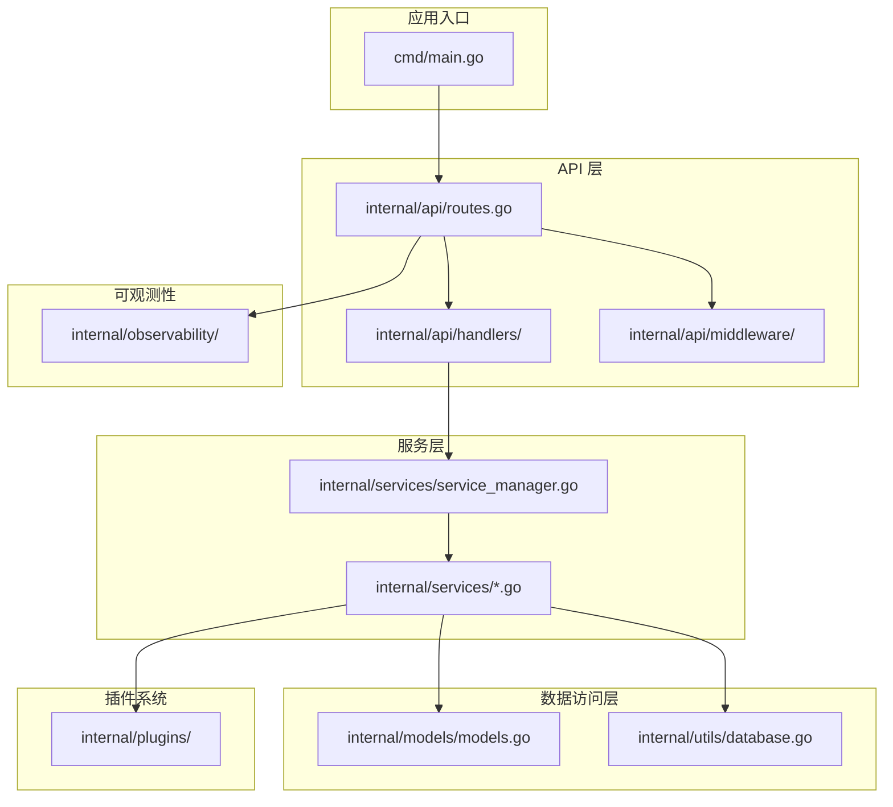
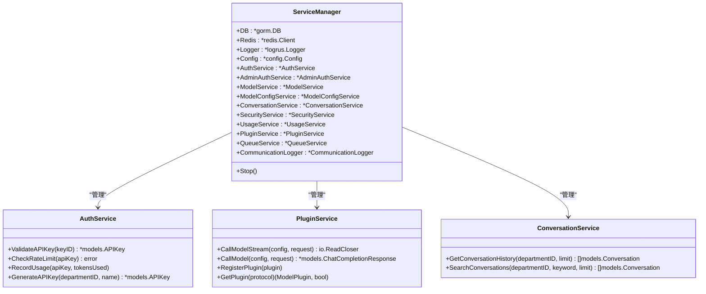
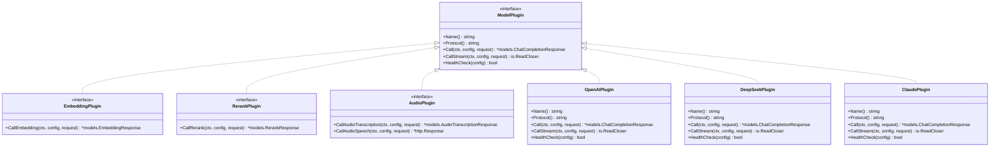
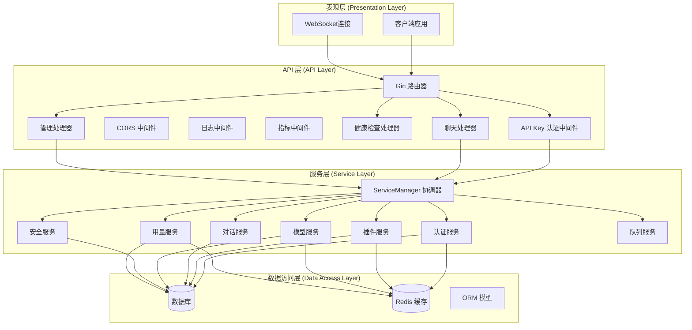
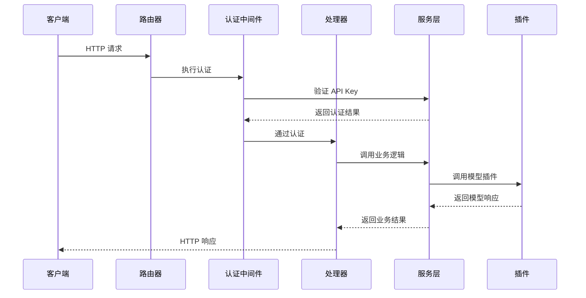
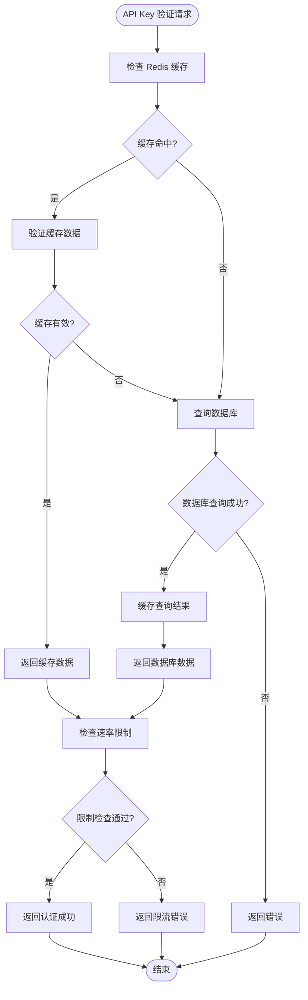
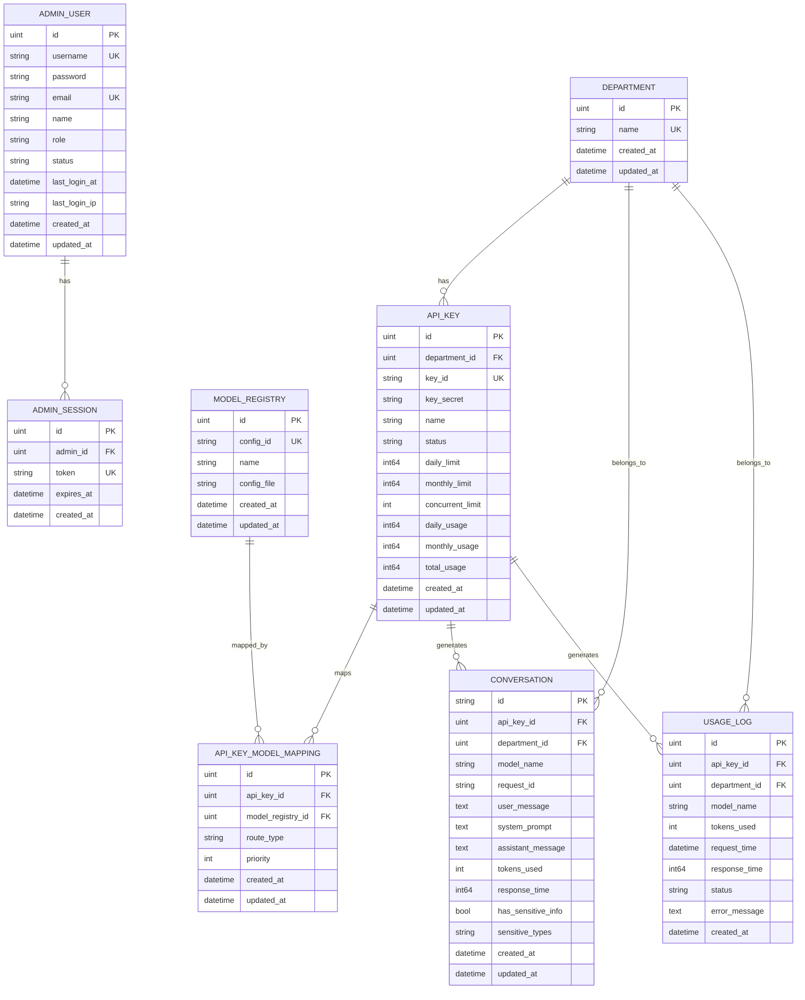
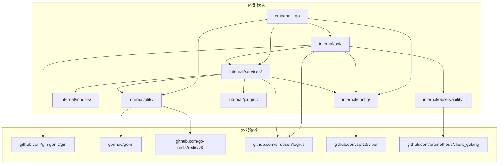

# 系统架构总览

<cite>
**本文档引用的文件**
- [cmd/main.go](file://cmd/main.go)
- [internal/services/service_manager.go](file://internal/services/service_manager.go)
- [internal/api/routes.go](file://internal/api/routes.go)
- [internal/config/config.go](file://internal/config/config.go)
- [internal/services/conversation_service.go](file://internal/services/conversation_service.go)
- [internal/services/plugin_service.go](file://internal/services/plugin_service.go)
- [internal/plugins/interface.go](file://internal/plugins/interface.go)
- [internal/api/handlers/chat_handler.go](file://internal/api/handlers/chat_handler.go)
- [internal/services/model_service.go](file://internal/services/model_service.go)
- [internal/services/auth_service.go](file://internal/services/auth_service.go)
- [internal/utils/database.go](file://internal/utils/database.go)
- [internal/models/models.go](file://internal/models/models.go)
- [internal/api/middleware/auth.go](file://internal/api/middleware/auth.go)
- [internal/observability/metrics.go](file://internal/observability/metrics.go)
- [go.mod](file://go.mod)
</cite>

## 目录
1. [简介](#简介)
2. [项目结构](#项目结构)
3. [核心组件](#核心组件)
4. [架构概览](#架构概览)
5. [详细组件分析](#详细组件分析)
6. [依赖关系分析](#依赖关系分析)
7. [性能考虑](#性能考虑)
8. [故障排除指南](#故障排除指南)
9. [结论](#结论)

## 简介

Wolink-Core 是一个基于 Go 语言开发的 AI 模型网关系统，采用分层架构设计，支持多种大语言模型的统一接入和管理。该系统通过 API 层、服务层和数据访问层的清晰分离，实现了高内聚、低耦合的架构模式，为 AI 模型的集成提供了灵活且可扩展的解决方案。

系统的核心设计理念是通过 ServiceManager 作为服务协调器，统一管理各种业务服务，同时通过插件化架构支持不同厂商模型的无缝集成。这种设计既保证了系统的可维护性，又为未来的功能扩展奠定了坚实基础。

## 项目结构

Wolink-Core 采用标准的 Go 项目结构，按照关注点分离的原则组织代码：

**图表来源**
- [cmd/main.go:19-89](file://cmd/main.go#L19-L89)
- [internal/api/routes.go:14-129](file://internal/api/routes.go#L14-L129)
- [internal/services/service_manager.go:30-62](file://internal/services/service_manager.go#L30-L62)

**章节来源**
- [cmd/main.go:1-89](file://cmd/main.go#L1-L89)
- [go.mod:1-84](file://go.mod#L1-L84)

## 核心组件

### ServiceManager - 服务协调器

ServiceManager 是整个系统的核心协调器，负责统一管理和初始化所有业务服务：

**图表来源**
- [internal/services/service_manager.go:11-28](file://internal/services/service_manager.go#L11-L28)
- [internal/services/service_manager.go:39-47](file://internal/services/service_manager.go#L39-L47)

ServiceManager 的主要职责包括：
- 统一初始化和管理所有业务服务
- 提供服务间的协调和通信机制
- 管理服务的生命周期和优雅停机
- 加载和管理模型配置

**章节来源**
- [internal/services/service_manager.go:1-76](file://internal/services/service_manager.go#L1-L76)

### 插件系统架构

系统采用插件化架构，支持多种 AI 模型提供商的无缝集成：

**图表来源**
- [internal/plugins/interface.go:11-55](file://internal/plugins/interface.go#L11-L55)
- [internal/services/plugin_service.go:55-92](file://internal/services/plugin_service.go#L55-L92)

**章节来源**
- [internal/plugins/interface.go:1-55](file://internal/plugins/interface.go#L1-L55)
- [internal/services/plugin_service.go:1-200](file://internal/services/plugin_service.go#L1-L200)

## 架构概览

Wolink-Core 采用经典的三层架构模式，每层都有明确的职责分工：

**图表来源**
- [internal/api/routes.go:14-129](file://internal/api/routes.go#L14-L129)
- [internal/services/service_manager.go:30-62](file://internal/services/service_manager.go#L30-L62)
- [internal/api/middleware/auth.go:13-68](file://internal/api/middleware/auth.go#L13-L68)

### 分层架构设计原则

1. **API 层**：负责 HTTP 请求处理、中间件链路和路由分发
2. **服务层**：封装业务逻辑，协调各个子服务
3. **数据访问层**：抽象数据持久化操作，提供统一的数据访问接口

这种分层设计确保了：
- **关注点分离**：每层专注于特定的职责
- **可测试性**：每层都可以独立进行单元测试
- **可扩展性**：新增功能可以在相应层级添加
- **可维护性**：代码结构清晰，便于维护和升级

## 详细组件分析

### API 层组件

API 层基于 Gin 框架构建，实现了完整的中间件链路和路由体系：

**图表来源**
- [internal/api/routes.go:32-72](file://internal/api/routes.go#L32-L72)
- [internal/api/middleware/auth.go:13-68](file://internal/api/middleware/auth.go#L13-L68)
- [internal/api/handlers/chat_handler.go:34-113](file://internal/api/handlers/chat_handler.go#L34-L113)

**章节来源**
- [internal/api/routes.go:14-129](file://internal/api/routes.go#L14-L129)
- [internal/api/middleware/auth.go:1-98](file://internal/api/middleware/auth.go#L1-L98)

### 服务层组件

服务层包含多个专门的业务服务，每个服务都负责特定的业务领域：

#### 认证服务 (AuthService)

认证服务负责 API Key 的验证、速率限制和使用量统计：

**图表来源**
- [internal/services/auth_service.go:35-85](file://internal/services/auth_service.go#L35-L85)
- [internal/services/auth_service.go:87-124](file://internal/services/auth_service.go#L87-L124)

#### 插件服务 (PluginService)

插件服务实现了插件的注册、管理和调用机制：

**章节来源**
- [internal/services/auth_service.go:1-200](file://internal/services/auth_service.go#L1-L200)
- [internal/services/plugin_service.go:1-200](file://internal/services/plugin_service.go#L1-L200)

### 数据访问层组件

数据访问层基于 GORM ORM 框架，提供了统一的数据持久化接口：

**图表来源**
- [internal/models/models.go:10-160](file://internal/models/models.go#L10-L160)

**章节来源**
- [internal/models/models.go:1-200](file://internal/models/models.go#L1-L200)
- [internal/utils/database.go:73-140](file://internal/utils/database.go#L73-L140)

## 依赖关系分析

系统采用模块化设计，各模块间的依赖关系清晰明确：

**图表来源**
- [go.mod:5-22](file://go.mod#L5-L22)
- [cmd/main.go:3-17](file://cmd/main.go#L3-L17)

### 关键依赖特性

1. **配置管理**：使用 Viper 进行配置文件管理和环境变量绑定
2. **数据库抽象**：通过 GORM 支持多种数据库后端
3. **缓存优化**：使用 Redis 提供高性能缓存服务
4. **日志系统**：基于 Logrus 构建结构化日志
5. **监控集成**：集成 Prometheus 进行系统监控

**章节来源**
- [go.mod:1-84](file://go.mod#L1-L84)

## 性能考虑

系统在设计时充分考虑了性能优化和可扩展性：

### 缓存策略
- Redis 缓存 API Key 和认证信息，减少数据库查询压力
- 速率限制使用 Redis 原子操作，确保高并发下的准确性
- 模型配置缓存，支持热更新机制

### 连接池管理
- 数据库连接池配置可调参数，支持最大连接数、空闲连接数等
- Redis 连接池优化，支持最小空闲连接和连接超时设置

### 异步处理
- 使用 goroutine 处理异步任务，如用量统计和对话记录
- 流式响应处理，支持 SSE 和 WebSocket 传输

### 监控指标
- Prometheus 指标收集，包括请求计数、延迟分布和并发请求数
- 详细的日志记录，支持请求追踪和问题诊断

## 故障排除指南

### 常见问题及解决方案

#### 1. 数据库连接失败
**症状**：启动时出现数据库连接错误
**原因**：数据库配置不正确或数据库服务不可用
**解决方案**：
- 检查数据库配置参数
- 验证数据库服务状态
- 确认网络连接正常

#### 2. Redis 连接异常
**症状**：认证服务或缓存功能异常
**原因**：Redis 服务器不可达或配置错误
**解决方案**：
- 检查 Redis 服务器状态
- 验证连接参数配置
- 确认防火墙设置

#### 3. API Key 认证失败
**症状**：客户端收到 401 错误
**原因**：API Key 无效或已禁用
**解决方案**：
- 验证 API Key 格式
- 检查 API Key 状态
- 确认速率限制未触发

#### 4. 插件加载失败
**症状**：模型调用报错或插件不可用
**原因**：插件文件损坏或配置错误
**解决方案**：
- 检查插件文件完整性
- 验证插件配置
- 查看插件健康检查状态

**章节来源**
- [internal/utils/database.go:73-140](file://internal/utils/database.go#L73-L140)
- [internal/services/auth_service.go:35-85](file://internal/services/auth_service.go#L35-L85)

## 结论

Wolink-Core 通过采用分层架构和插件化设计，成功构建了一个高度可扩展的 AI 模型网关系统。ServiceManager 作为核心协调器，有效地管理了复杂的业务逻辑和服务依赖关系。

该架构设计的优势体现在：

1. **清晰的职责分离**：三层架构确保了代码的可维护性和可测试性
2. **灵活的插件系统**：支持多种 AI 模型提供商的无缝集成
3. **高性能的缓存机制**：通过 Redis 优化了关键路径的性能
4. **完善的监控体系**：集成 Prometheus 提供全面的系统监控
5. **优雅的错误处理**：统一的错误处理机制提升了系统的稳定性

未来的发展方向包括：
- 扩展更多的模型提供商支持
- 增强模型路由和负载均衡能力
- 优化大规模部署的性能表现
- 增加更丰富的监控和告警功能