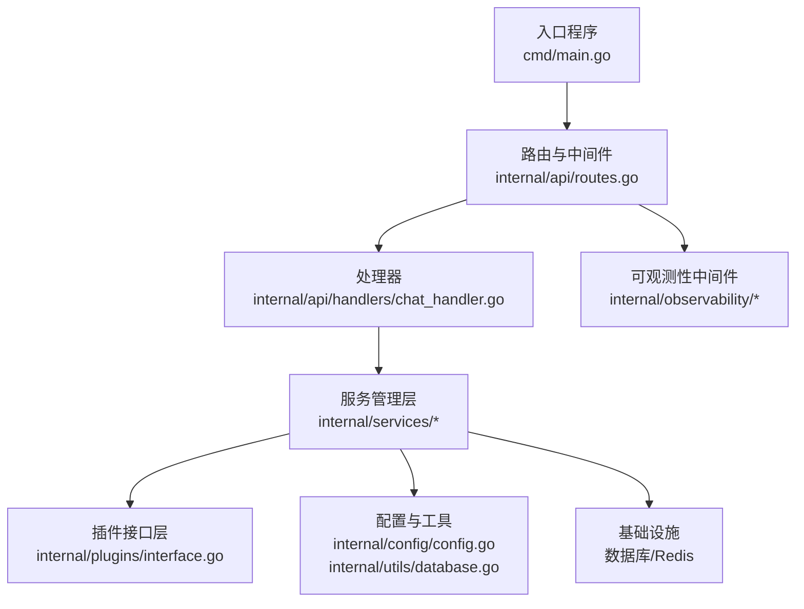
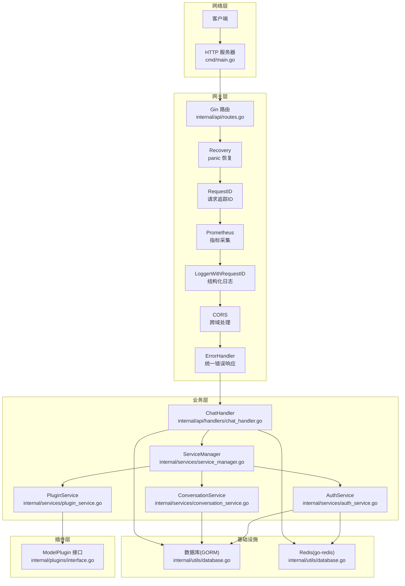
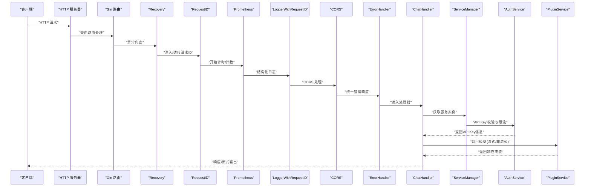
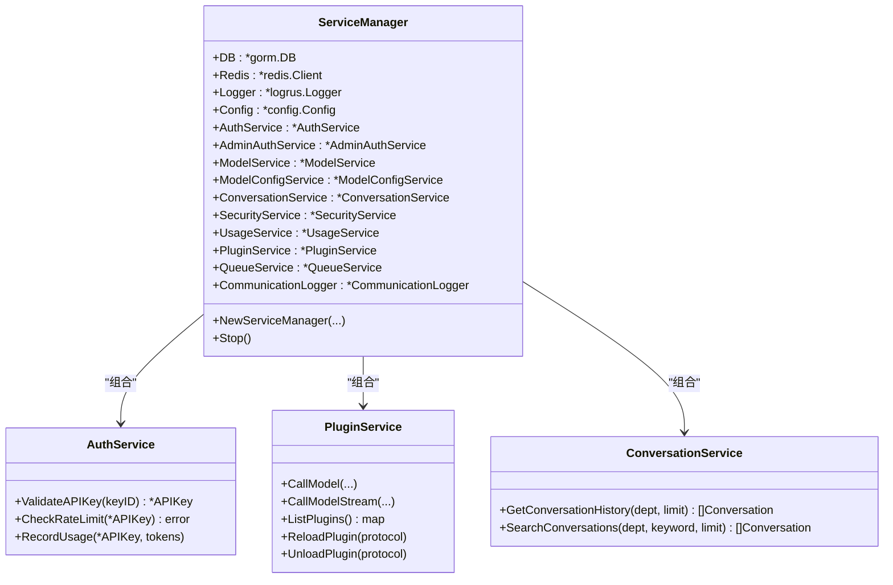
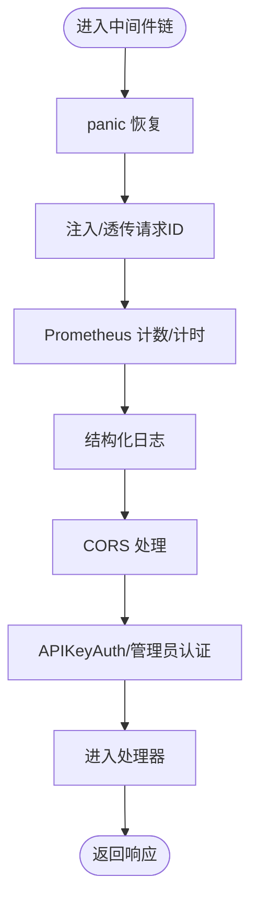
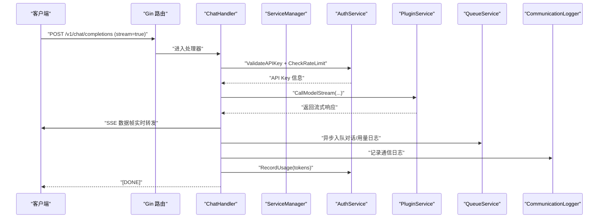
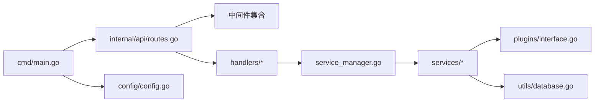

# 组件交互机制

<cite>
**本文引用的文件**
- [cmd/main.go](file://cmd/main.go)
- [internal/api/routes.go](file://internal/api/routes.go)
- [internal/api/middleware/auth.go](file://internal/api/middleware/auth.go)
- [internal/api/middleware/logging.go](file://internal/api/middleware/logging.go)
- [internal/api/middleware/cors.go](file://internal/api/middleware/cors.go)
- [internal/api/middleware/requestid.go](file://internal/api/middleware/requestid.go)
- [internal/api/middleware/admin_auth.go](file://internal/api/middleware/admin_auth.go)
- [internal/api/handlers/chat_handler.go](file://internal/api/handlers/chat_handler.go)
- [internal/observability/errors.go](file://internal/observability/errors.go)
- [internal/observability/metrics.go](file://internal/observability/metrics.go)
- [internal/services/service_manager.go](file://internal/services/service_manager.go)
- [internal/services/auth_service.go](file://internal/services/auth_service.go)
- [internal/services/plugin_service.go](file://internal/services/plugin_service.go)
- [internal/services/conversation_service.go](file://internal/services/conversation_service.go)
- [internal/plugins/interface.go](file://internal/plugins/interface.go)
- [internal/config/config.go](file://internal/config/config.go)
- [internal/utils/database.go](file://internal/utils/database.go)
</cite>

## 目录
1. [引言](#引言)
2. [项目结构](#项目结构)
3. [核心组件](#核心组件)
4. [架构总览](#架构总览)
5. [详细组件分析](#详细组件分析)
6. [依赖分析](#依赖分析)
7. [性能考量](#性能考量)
8. [故障排查指南](#故障排查指南)
9. [结论](#结论)

## 引言
本文件面向 Wolink-Core 的组件交互机制，系统性阐述请求处理流水线、中间件链与事件驱动特性；详解 ServiceManager 在服务实例初始化与生命周期管理中的协调职责；深入解析认证、日志与 CORS 中间件的工作原理；给出组件间数据流转图与请求处理时序图，覆盖复杂请求的端到端处理流程；最后总结组件解耦策略、依赖注入模式与错误传播机制的设计取舍。

## 项目结构
Wolink-Core 采用“入口程序 -> 路由与中间件 -> 处理器 -> 服务层 -> 插件层”的分层组织。入口程序负责配置加载、基础设施初始化与服务编排；路由与中间件定义统一的请求处理管线；处理器聚焦业务语义；服务层封装领域能力；插件层抽象模型调用；可观测性模块提供指标与错误标准化。

图表来源
- [cmd/main.go:19-89](file://cmd/main.go#L19-L89)
- [internal/api/routes.go:14-129](file://internal/api/routes.go#L14-L129)
- [internal/api/handlers/chat_handler.go:20-32](file://internal/api/handlers/chat_handler.go#L20-L32)
- [internal/services/service_manager.go:30-62](file://internal/services/service_manager.go#L30-L62)
- [internal/plugins/interface.go:11-43](file://internal/plugins/interface.go#L11-L43)
- [internal/config/config.go:96-124](file://internal/config/config.go#L96-L124)
- [internal/utils/database.go:77-139](file://internal/utils/database.go#L77-L139)

章节来源
- [cmd/main.go:19-89](file://cmd/main.go#L19-L89)
- [internal/api/routes.go:14-129](file://internal/api/routes.go#L14-L129)

## 核心组件
- 入口程序：加载配置、初始化日志、数据库与 Redis、创建 ServiceManager、设置路由与 HTTP 服务器、优雅停机。
- 路由与中间件：定义全局中间件链与分组路由，按需挂载认证与管理员认证中间件。
- 处理器：以 ChatHandler 为代表，负责请求解析、安全处理、模型选择、调用插件、异步记录与使用量统计。
- 服务管理层：ServiceManager 统一持有并初始化各服务实例，负责生命周期停止。
- 服务层：AuthService、PluginService、ConversationService 等，分别负责鉴权与限流、模型调用、会话检索等。
- 插件接口层：定义模型、Embedding、Rerank、Audio 等插件能力接口，支持多协议扩展。
- 配置与工具：集中配置加载与数据库/Redis 初始化。
- 观测性：统一错误包装与响应、Prometheus 指标采集。

章节来源
- [internal/services/service_manager.go:11-76](file://internal/services/service_manager.go#L11-L76)
- [internal/services/auth_service.go:19-33](file://internal/services/auth_service.go#L19-L33)
- [internal/services/plugin_service.go:21-53](file://internal/services/plugin_service.go#L21-L53)
- [internal/services/conversation_service.go:12-26](file://internal/services/conversation_service.go#L12-L26)
- [internal/plugins/interface.go:11-43](file://internal/plugins/interface.go#L11-L43)
- [internal/config/config.go:10-185](file://internal/config/config.go#L10-L185)
- [internal/utils/database.go:77-139](file://internal/utils/database.go#L77-L139)

## 架构总览
下图展示从请求进入至响应返回的关键路径，以及中间件链与服务层协作关系。

图表来源
- [cmd/main.go:53-68](file://cmd/main.go#L53-L68)
- [internal/api/routes.go:17-29](file://internal/api/routes.go#L17-L29)
- [internal/api/handlers/chat_handler.go:34-32](file://internal/api/handlers/chat_handler.go#L34-L32)
- [internal/services/service_manager.go:30-62](file://internal/services/service_manager.go#L30-L62)
- [internal/services/auth_service.go:35-85](file://internal/services/auth_service.go#L35-L85)
- [internal/services/plugin_service.go:207-229](file://internal/services/plugin_service.go#L207-L229)
- [internal/plugins/interface.go:11-43](file://internal/plugins/interface.go#L11-L43)
- [internal/utils/database.go:77-139](file://internal/utils/database.go#L77-L139)

## 详细组件分析

### 请求处理流水线与中间件链
- 中间件顺序（自上而下）：
  1) panic 恢复
  2) 请求追踪ID（RequestID）
  3) Prometheus 指标
  4) 结构化日志（LoggerWithRequestID）
  5) CORS
  6) 统一错误处理（ErrorHandler）
- 分组路由：
  - v1 下挂载 APIKeyAuth 中间件，保护 OpenAI 兼容接口。
  - /admin 下挂载 AdminAuth 中间件，并进一步按角色细分权限。
  - /admin/auth 不需要认证，用于登录/登出。
- WebSocket 代理在 /v1/ws 上使用 APIKeyAuth。

图表来源
- [internal/api/routes.go:17-29](file://internal/api/routes.go#L17-L29)
- [internal/api/routes.go:46-76](file://internal/api/routes.go#L46-L76)
- [internal/api/middleware/auth.go:13-68](file://internal/api/middleware/auth.go#L13-L68)
- [internal/api/middleware/admin_auth.go:14-75](file://internal/api/middleware/admin_auth.go#L14-L75)
- [internal/api/handlers/chat_handler.go:34-113](file://internal/api/handlers/chat_handler.go#L34-L113)
- [internal/services/auth_service.go:35-85](file://internal/services/auth_service.go#L35-L85)
- [internal/services/plugin_service.go:207-229](file://internal/services/plugin_service.go#L207-L229)

章节来源
- [internal/api/routes.go:14-129](file://internal/api/routes.go#L14-L129)
- [internal/api/middleware/requestid.go:21-39](file://internal/api/middleware/requestid.go#L21-L39)
- [internal/observability/metrics.go:62-86](file://internal/observability/metrics.go#L62-L86)
- [internal/api/middleware/logging.go:22-51](file://internal/api/middleware/logging.go#L22-L51)
- [internal/api/middleware/cors.go:23-69](file://internal/api/middleware/cors.go#L23-L69)
- [internal/observability/errors.go:114-142](file://internal/observability/errors.go#L114-L142)

### ServiceManager 生命周期与依赖注入
- 依赖注入：构造函数接收数据库、Redis、日志与配置，随后逐项初始化各服务实例。
- 服务初始化顺序：AuthService、AdminAuthService、ModelService、ModelConfigService、ConversationService、SecurityService、UsageService、PluginService、QueueService、CommunicationLogger。
- 模型配置加载：初始化后加载模型配置，失败记录错误日志。
- 生命周期停止：Stop 方法依次停止 QueueService、PluginService、CommunicationLogger。

图表来源
- [internal/services/service_manager.go:11-76](file://internal/services/service_manager.go#L11-L76)
- [internal/services/auth_service.go:19-33](file://internal/services/auth_service.go#L19-L33)
- [internal/services/plugin_service.go:21-53](file://internal/services/plugin_service.go#L21-L53)
- [internal/services/conversation_service.go:12-26](file://internal/services/conversation_service.go#L12-L26)

章节来源
- [internal/services/service_manager.go:30-76](file://internal/services/service_manager.go#L30-L76)

### 中间件工作原理
- APIKeyAuth：从 Authorization(Bearer) 或查询参数提取 API Key，校验有效性与速率限制，成功后写入上下文。
- LoggerWithRequestID：基于 RequestID 中间件注入的 ID，记录结构化日志并回写响应头。
- CORS：生产模式强制显式允许的源列表，调试模式可放宽；预检请求快速返回。
- AdminAuth：管理员认证，支持角色校验中间件 RequireRole。
- ErrorHandler：将 AppError 映射为标准 JSON 错误响应。
- Prometheus：采集请求数、延迟分布与在途请求数，使用 FullPath 作为标签避免高基数。

图表来源
- [internal/api/middleware/auth.go:13-68](file://internal/api/middleware/auth.go#L13-L68)
- [internal/api/middleware/logging.go:22-51](file://internal/api/middleware/logging.go#L22-L51)
- [internal/api/middleware/cors.go:23-69](file://internal/api/middleware/cors.go#L23-L69)
- [internal/api/middleware/admin_auth.go:14-104](file://internal/api/middleware/admin_auth.go#L14-L104)
- [internal/observability/errors.go:114-142](file://internal/observability/errors.go#L114-L142)
- [internal/observability/metrics.go:62-86](file://internal/observability/metrics.go#L62-L86)

章节来源
- [internal/api/middleware/auth.go:13-68](file://internal/api/middleware/auth.go#L13-L68)
- [internal/api/middleware/logging.go:22-51](file://internal/api/middleware/logging.go#L22-L51)
- [internal/api/middleware/cors.go:23-69](file://internal/api/middleware/cors.go#L23-L69)
- [internal/api/middleware/admin_auth.go:14-104](file://internal/api/middleware/admin_auth.go#L14-L104)
- [internal/observability/errors.go:103-142](file://internal/observability/errors.go#L103-L142)
- [internal/observability/metrics.go:53-86](file://internal/observability/metrics.go#L53-L86)

### 复杂请求处理流程（以流式聊天完成为例）
- 请求进入：经过 Recovery → RequestID → Prometheus → Logger → CORS → ErrorHandler。
- 进入 ChatHandler：从上下文取出 API Key，解析请求体，进行基础校验。
- 安全处理：敏感信息检测与替换，记录敏感类型。
- 模型选择：根据 API Key 与模型名筛选可用模型，按路由规则选择具体配置。
- 插件调用：通过 PluginService 调用模型流式接口，读取 SSE 数据帧并实时转发。
- 异步记录：异步入队对话与用量日志；同步记录通信日志。
- 使用量统计：调用 AuthService 记录用量。

图表来源
- [internal/api/routes.go:50-53](file://internal/api/routes.go#L50-L53)
- [internal/api/handlers/chat_handler.go:115-206](file://internal/api/handlers/chat_handler.go#L115-L206)
- [internal/services/auth_service.go:35-85](file://internal/services/auth_service.go#L35-L85)
- [internal/services/plugin_service.go:219-229](file://internal/services/plugin_service.go#L219-L229)

章节来源
- [internal/api/handlers/chat_handler.go:34-250](file://internal/api/handlers/chat_handler.go#L34-L250)

### 组件解耦策略与依赖注入
- 解耦策略：
  - 中间件通过 Gin 的 Next/Abort 机制解耦，职责单一且可插拔。
  - 处理器通过 ServiceManager 聚合服务，避免直接依赖具体实现。
  - 插件通过接口抽象，不同协议与厂商模型可替换接入。
- 依赖注入：
  - ServiceManager 构造函数集中注入 DB、Redis、Logger、Config。
  - Handler 构造函数注入 ServiceManager 与 Logger。
  - 中间件注入所需服务实例（如 AuthService、AdminAuthService）。

章节来源
- [internal/services/service_manager.go:30-62](file://internal/services/service_manager.go#L30-L62)
- [internal/api/handlers/chat_handler.go:26-32](file://internal/api/handlers/chat_handler.go#L26-L32)
- [internal/plugins/interface.go:11-43](file://internal/plugins/interface.go#L11-L43)

### 错误传播机制
- 统一错误包装：AppError 提供机器可读 code、人类可读 message、HTTP 状态码与可选 Cause。
- 中间件拦截：ErrorHandler 将 AppError 映射为标准 JSON；非 AppError 回退为内部错误。
- 传播路径：中间件链捕获错误，最终由 ErrorHandler 输出；处理器也可主动返回结构化错误。

章节来源
- [internal/observability/errors.go:10-80](file://internal/observability/errors.go#L10-L80)
- [internal/observability/errors.go:114-142](file://internal/observability/errors.go#L114-L142)

## 依赖分析
- 入口程序依赖配置、日志、数据库与 Redis 初始化工具，以及路由与服务管理器。
- 路由依赖中间件、处理器与可观测性模块。
- 处理器依赖 ServiceManager，进而依赖多个服务。
- 服务层依赖配置、日志、数据库与 Redis。
- 插件层依赖接口抽象，具体实现通过注册方式接入。

图表来源
- [cmd/main.go:19-89](file://cmd/main.go#L19-L89)
- [internal/api/routes.go:14-129](file://internal/api/routes.go#L14-L129)
- [internal/services/service_manager.go:30-62](file://internal/services/service_manager.go#L30-L62)
- [internal/plugins/interface.go:11-43](file://internal/plugins/interface.go#L11-L43)
- [internal/utils/database.go:77-139](file://internal/utils/database.go#L77-L139)
- [internal/config/config.go:96-124](file://internal/config/config.go#L96-L124)

章节来源
- [cmd/main.go:19-89](file://cmd/main.go#L19-L89)
- [internal/api/routes.go:14-129](file://internal/api/routes.go#L14-L129)

## 性能考量
- 中间件顺序优化：将轻量、快速的中间件靠前放置，避免对后续处理造成额外开销。
- Prometheus 标签：使用 FullPath 降低路径参数导致的高基数风险。
- 缓存与限流：AuthService 对 API Key 与并发/日/月限流使用 Redis 快速判定，减少数据库压力。
- 异步落库：对话与用量日志通过队列异步入队，降低主路径延迟。
- 连接池：数据库与 Redis 连接池参数可通过配置调整，结合实际负载压测优化。

## 故障排查指南
- 统一错误响应：优先查看 ErrorHandler 输出的 JSON 错误体，定位 code 与 message。
- 请求追踪：通过 RequestID 关联日志与指标，定位具体请求链路。
- CORS 问题：确认生产模式下是否正确配置允许的源列表。
- API Key 与限流：检查 AuthService 的 Redis 缓存与计数键，确认并发/日/月限流阈值。
- 插件健康：通过 PluginService 的健康检查与日志判断插件可用性。
- 数据库/Redis 连接：检查初始化阶段的连接与池配置，关注超时与最大连接数。

章节来源
- [internal/observability/errors.go:114-142](file://internal/observability/errors.go#L114-L142)
- [internal/api/middleware/cors.go:23-69](file://internal/api/middleware/cors.go#L23-L69)
- [internal/services/auth_service.go:87-124](file://internal/services/auth_service.go#L87-L124)
- [internal/services/plugin_service.go:337-350](file://internal/services/plugin_service.go#L337-L350)
- [internal/utils/database.go:77-139](file://internal/utils/database.go#L77-L139)

## 结论
Wolink-Core 通过清晰的中间件链、以 ServiceManager 为核心的依赖注入与生命周期管理、以及以插件接口抽象的可扩展模型层，实现了高内聚、低耦合的组件交互机制。请求处理流水线具备完善的可观测性与错误处理能力，复杂请求（如流式聊天）在保证性能的同时提供了可追踪、可审计的数据流转路径。建议在生产环境中严格配置 CORS 与限流策略，并持续优化连接池与指标采集维度以提升稳定性与可观测性。