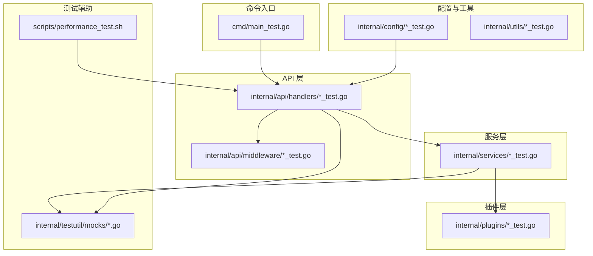
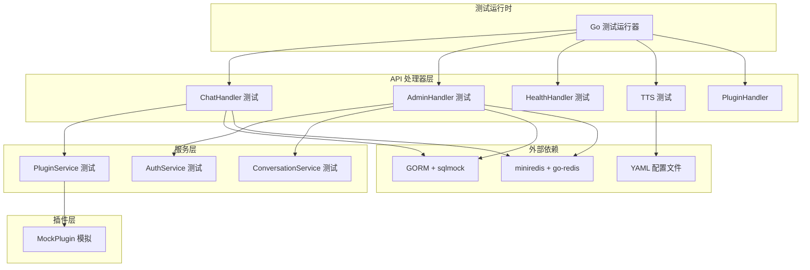
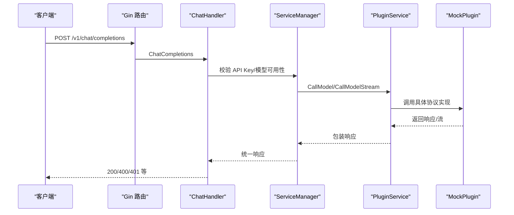
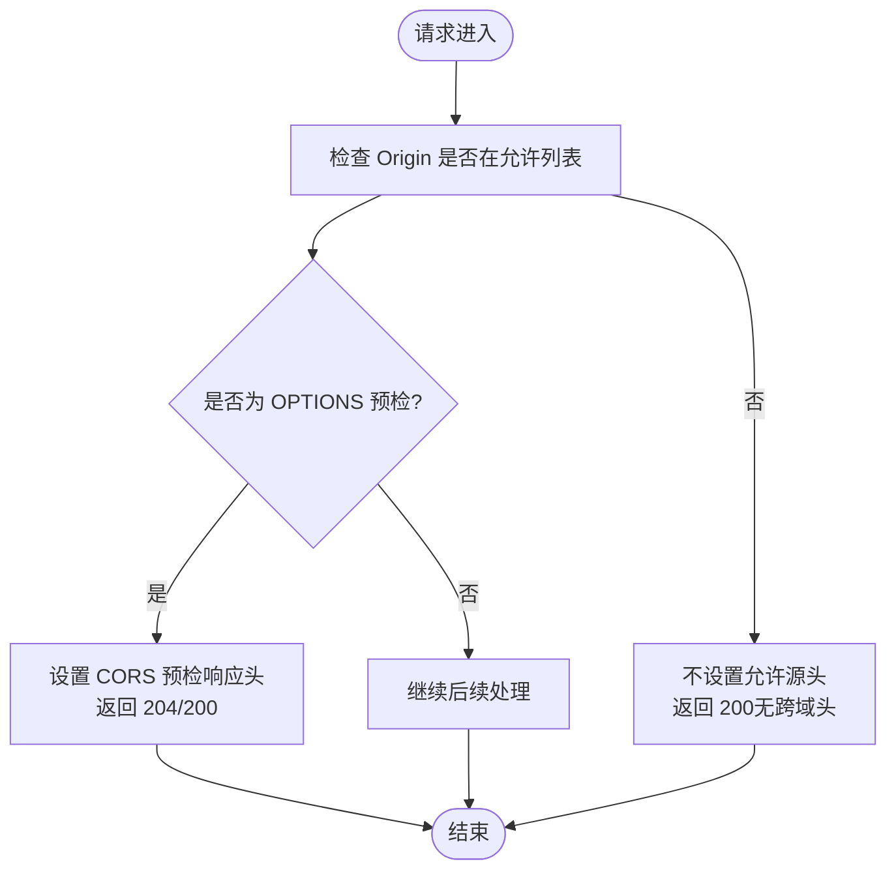
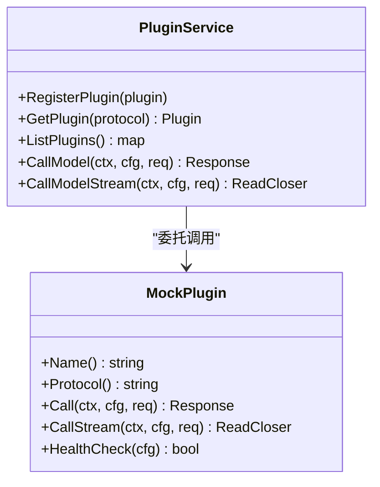
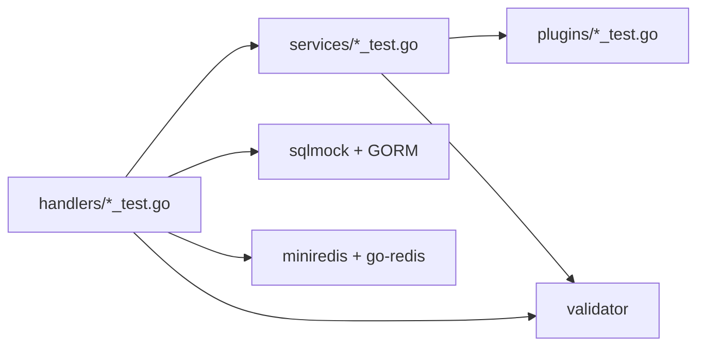

# 测试策略

<cite>
**本文引用的文件**
- [cmd/main_test.go](file://cmd/main_test.go)
- [internal/testutil/mocks/db.go](file://internal/testutil/mocks/db.go)
- [internal/testutil/mocks/plugins.go](file://internal/testutil/mocks/plugins.go)
- [internal/testutil/mocks/redis.go](file://internal/testutil/mocks/redis.go)
- [scripts/performance_test.sh](file://scripts/performance_test.sh)
- [internal/api/handlers/admin_handler_test.go](file://internal/api/handlers/admin_handler_test.go)
- [internal/api/handlers/chat_handler_test.go](file://internal/api/handlers/chat_handler_test.go)
- [internal/api/handlers/health_handler_test.go](file://internal/api/handlers/health_handler_test.go)
- [internal/api/handlers/tts_test.go](file://internal/api/handlers/tts_test.go)
- [internal/api/handlers/validation_test.go](file://internal/api/handlers/validation_test.go)
- [internal/api/handlers/plugin_handler.go](file://internal/api/handlers/plugin_handler.go)
- [internal/services/plugin_service_test.go](file://internal/services/plugin_service_test.go)
- [internal/api/middleware/cors_test.go](file://internal/api/middleware/cors_test.go)
- [internal/config/config_test.go](file://internal/config/config_test.go)
- [go.mod](file://go.mod)
</cite>

## 目录
1. [引言](#引言)
2. [项目结构](#项目结构)
3. [核心组件](#核心组件)
4. [架构总览](#架构总览)
5. [详细组件分析](#详细组件分析)
6. [依赖分析](#依赖分析)
7. [性能考虑](#性能考虑)
8. [故障排查指南](#故障排查指南)
9. [结论](#结论)
10. [附录](#附录)

## 引言
本测试策略文档面向 Wolink-Core 项目，系统化阐述单元测试、集成测试与性能测试的设计思路与实施方法。文档覆盖测试框架选择与配置（Go 标准测试库、Testify、sqlmock、miniredis、Mock），测试数据管理与环境隔离，以及持续集成流程建议。同时提供认证测试、API 接口测试、插件测试的具体用例编写指导，并给出性能测试、负载测试与压力测试的实施步骤，以及测试覆盖率与质量保证流程建议。

## 项目结构
项目采用按功能域分层的组织方式：命令入口、API 层（路由、处理器、中间件）、服务层、插件层、配置与工具、测试辅助与基准测试脚本。测试文件广泛分布在各模块中，形成“按模块覆盖”的测试矩阵。

图表来源
- [cmd/main_test.go:1-211](file://cmd/main_test.go#L1-L211)
- [internal/api/handlers/admin_handler_test.go:1-554](file://internal/api/handlers/admin_handler_test.go#L1-L554)
- [internal/api/handlers/chat_handler_test.go:1-506](file://internal/api/handlers/chat_handler_test.go#L1-L506)
- [internal/api/handlers/health_handler_test.go:1-108](file://internal/api/handlers/health_handler_test.go#L1-L108)
- [internal/api/handlers/tts_test.go:1-199](file://internal/api/handlers/tts_test.go#L1-L199)
- [internal/api/handlers/validation_test.go:1-84](file://internal/api/handlers/validation_test.go#L1-L84)
- [internal/api/middleware/cors_test.go:1-141](file://internal/api/middleware/cors_test.go#L1-L141)
- [internal/services/plugin_service_test.go:1-398](file://internal/services/plugin_service_test.go#L1-L398)
- [internal/testutil/mocks/db.go:1-48](file://internal/testutil/mocks/db.go#L1-L48)
- [internal/testutil/mocks/plugins.go:1-81](file://internal/testutil/mocks/plugins.go#L1-L81)
- [internal/testutil/mocks/redis.go:1-40](file://internal/testutil/mocks/redis.go#L1-L40)
- [scripts/performance_test.sh:1-44](file://scripts/performance_test.sh#L1-L44)

章节来源
- [go.mod:1-84](file://go.mod#L1-L84)

## 核心组件
- 测试框架与断言
  - 标准测试库：用于基本的测试执行与生命周期管理。
  - Testify：assert/require 提供更丰富的断言能力；github.com/stretchr/testify/mock 用于创建行为驱动的模拟对象。
  - go-sqlmock：基于 sqlmock 的 GORM 数据库模拟，确保 SQL 行为可预期且无需真实数据库。
  - miniredis：提供内存中的 Redis 实例，便于快速、隔离地进行缓存相关测试。
- 测试数据与环境
  - 内存数据库（SQLite）：在测试中自动迁移模型，避免对持久化存储的依赖。
  - 配置文件注入：通过临时写入 YAML 配置文件的方式，验证模型配置加载与路由映射。
  - 环境变量与进程退出：生产模式下 CORS 中间件在允许来源为空时触发进程退出，测试通过子进程验证该行为。
- 基准与性能
  - 脚本性能测试：使用 Apache Bench（ab）进行压力测试，支持并发与总请求数配置。

章节来源
- [internal/testutil/mocks/db.go:1-48](file://internal/testutil/mocks/db.go#L1-L48)
- [internal/testutil/mocks/plugins.go:1-81](file://internal/testutil/mocks/plugins.go#L1-L81)
- [internal/testutil/mocks/redis.go:1-40](file://internal/testutil/mocks/redis.go#L1-L40)
- [internal/api/middleware/cors_test.go:117-141](file://internal/api/middleware/cors_test.go#L117-L141)
- [scripts/performance_test.sh:1-44](file://scripts/performance_test.sh#L1-L44)

## 架构总览
测试架构围绕“处理器-服务-插件-外部依赖”展开，通过模拟对象与内存数据库实现端到端的可控测试路径。

图表来源
- [internal/api/handlers/chat_handler_test.go:1-506](file://internal/api/handlers/chat_handler_test.go#L1-L506)
- [internal/api/handlers/admin_handler_test.go:1-554](file://internal/api/handlers/admin_handler_test.go#L1-L554)
- [internal/api/handlers/health_handler_test.go:1-108](file://internal/api/handlers/health_handler_test.go#L1-L108)
- [internal/api/handlers/tts_test.go:1-199](file://internal/api/handlers/tts_test.go#L1-L199)
- [internal/api/handlers/plugin_handler.go:1-74](file://internal/api/handlers/plugin_handler.go#L1-L74)
- [internal/services/plugin_service_test.go:1-398](file://internal/services/plugin_service_test.go#L1-L398)
- [internal/testutil/mocks/db.go:1-48](file://internal/testutil/mocks/db.go#L1-L48)
- [internal/testutil/mocks/redis.go:1-40](file://internal/testutil/mocks/redis.go#L1-L40)

## 详细组件分析

### 认证与授权测试策略
- 目标
  - 验证 API Key 与管理员 JWT 的鉴权流程。
  - 验证输入校验、错误响应格式与状态码。
  - 验证速率限制、审计日志与并发安全（通过文档化测试意图）。
- 关键测试点
  - 未携带 API Key 返回 401。
  - 缺失必填字段返回 400。
  - 无效角色或空内容返回 400。
  - 管理端点需要有效管理员令牌。
  - 输入参数范围校验（温度、最大 token 数等）。
- 测试数据与环境
  - 使用内存 SQLite 初始化部门、API Key、模型映射。
  - 通过 Gin 中间件在测试上下文中设置 api_key 上下文。
- 参考实现位置
  - [internal/api/handlers/chat_handler_test.go:174-505](file://internal/api/handlers/chat_handler_test.go#L174-L505)
  - [internal/api/handlers/admin_handler_test.go:82-554](file://internal/api/handlers/admin_handler_test.go#L82-L554)

图表来源
- [internal/api/handlers/chat_handler_test.go:1-506](file://internal/api/handlers/chat_handler_test.go#L1-L506)
- [internal/services/plugin_service_test.go:143-255](file://internal/services/plugin_service_test.go#L143-L255)
- [internal/testutil/mocks/plugins.go:13-81](file://internal/testutil/mocks/plugins.go#L13-L81)

章节来源
- [internal/api/handlers/chat_handler_test.go:174-505](file://internal/api/handlers/chat_handler_test.go#L174-L505)
- [internal/api/handlers/admin_handler_test.go:82-554](file://internal/api/handlers/admin_handler_test.go#L82-L554)

### API 接口测试策略
- 健康检查与就绪检查
  - 数据库与 Redis Ping 成功返回 200；任一失败返回 503。
  - 生产模式下 CORS 允许来源为空时触发进程退出。
- 路由与中间件
  - CORS 中间件正确处理预检请求与跨域头。
- 参考实现位置
  - [internal/api/handlers/health_handler_test.go:1-108](file://internal/api/handlers/health_handler_test.go#L1-L108)
  - [internal/api/middleware/cors_test.go:18-141](file://internal/api/middleware/cors_test.go#L18-L141)

图表来源
- [internal/api/middleware/cors_test.go:18-141](file://internal/api/middleware/cors_test.go#L18-L141)

章节来源
- [internal/api/handlers/health_handler_test.go:1-108](file://internal/api/handlers/health_handler_test.go#L1-L108)
- [internal/api/middleware/cors_test.go:18-141](file://internal/api/middleware/cors_test.go#L18-L141)

### 插件测试策略
- 目标
  - 验证插件注册、检索、调用与流式调用的正确性。
  - 验证内置插件（openai、deepseek、claude）初始可用。
  - 验证并发访问下的线程安全性。
- 关键测试点
  - 注册新插件后可通过协议名检索。
  - 未知协议调用应返回“插件未找到”错误。
  - 流式调用返回可读取的数据流。
  - 并发场景下注册、查询、调用均稳定。
- 测试数据与环境
  - 使用 MockPlugin 模拟 Call/CallStream/Name/Protocol/HealthCheck。
  - 使用内存 Redis 与 SQLite 支撑服务层。
- 参考实现位置
  - [internal/services/plugin_service_test.go:1-398](file://internal/services/plugin_service_test.go#L1-L398)
  - [internal/testutil/mocks/plugins.go:13-81](file://internal/testutil/mocks/plugins.go#L13-L81)

图表来源
- [internal/services/plugin_service_test.go:1-398](file://internal/services/plugin_service_test.go#L1-L398)
- [internal/testutil/mocks/plugins.go:13-81](file://internal/testutil/mocks/plugins.go#L13-L81)

章节来源
- [internal/services/plugin_service_test.go:1-398](file://internal/services/plugin_service_test.go#L1-L398)
- [internal/testutil/mocks/plugins.go:13-81](file://internal/testutil/mocks/plugins.go#L13-L81)

### TTS 语音合成测试策略
- 目标
  - 验证 TTS 请求转发至上游服务并正确透传响应。
  - 验证错误状态码与错误体透传。
- 关键测试点
  - 构造临时 YAML 配置文件，映射 TTS 模型到 API Key。
  - 发送 /v1/audio/speech 请求，断言上游请求参数与头部。
  - 上游 500 错误应被透传。
- 测试数据与环境
  - 使用 httptest.NewServer 搭建 Mock TTS 服务。
  - 通过临时文件写入配置，测试结束后清理。
- 参考实现位置
  - [internal/api/handlers/tts_test.go:1-199](file://internal/api/handlers/tts_test.go#L1-L199)

章节来源
- [internal/api/handlers/tts_test.go:19-199](file://internal/api/handlers/tts_test.go#L19-L199)

### 配置与基础设施测试策略
- 目标
  - 验证服务器超时配置、优雅停机与信号处理。
  - 验证基础设施配置项（读/写/空闲/头部超时、关闭超时）。
- 关键测试点
  - http.Server 的 ReadTimeout/WriteTimeout/IdleTimeout/ReadHeaderTimeout 与配置一致。
  - 优雅停机使用可配置的关闭超时上下文。
  - SIGTERM 触发优雅停机并应用正确的超时。
- 参考实现位置
  - [cmd/main_test.go:18-197](file://cmd/main_test.go#L18-L197)

章节来源
- [cmd/main_test.go:18-197](file://cmd/main_test.go#L18-L197)

### 数据与缓存模拟
- 数据库模拟
  - 使用 sqlmock + GORM MySQL 方言构建可清理的内存数据库实例。
- 缓存模拟
  - 使用 miniredis 提供内存 Redis，自动清理，支持基准测试。
- 参考实现位置
  - [internal/testutil/mocks/db.go:1-48](file://internal/testutil/mocks/db.go#L1-L48)
  - [internal/testutil/mocks/redis.go:1-40](file://internal/testutil/mocks/redis.go#L1-L40)

章节来源
- [internal/testutil/mocks/db.go:11-47](file://internal/testutil/mocks/db.go#L11-L47)
- [internal/testutil/mocks/redis.go:11-39](file://internal/testutil/mocks/redis.go#L11-L39)

## 依赖分析
- 测试依赖与耦合
  - 处理器测试依赖服务层与外部依赖（数据库、Redis、配置文件）。
  - 服务层测试依赖插件接口与模拟对象。
  - 插件测试依赖模拟插件与配置加载。
- 外部依赖与集成点
  - Gin 路由与中间件。
  - GORM + sqlmock。
  - go-redis + miniredis。
  - go-playground/validator 用于结构体校验。
- 循环依赖与隔离
  - 通过模拟对象与内存实例避免循环依赖，确保测试隔离。

图表来源
- [internal/api/handlers/chat_handler_test.go:1-506](file://internal/api/handlers/chat_handler_test.go#L1-L506)
- [internal/services/plugin_service_test.go:1-398](file://internal/services/plugin_service_test.go#L1-L398)
- [internal/testutil/mocks/db.go:1-48](file://internal/testutil/mocks/db.go#L1-L48)
- [internal/testutil/mocks/redis.go:1-40](file://internal/testutil/mocks/redis.go#L1-L40)

章节来源
- [go.mod:1-84](file://go.mod#L1-L84)

## 性能考虑
- 基准测试与压力测试
  - 使用脚本性能测试：支持并发用户数与每用户请求数配置，使用 Apache Bench（ab）发起请求。
  - 建议在独立测试环境中运行，避免与开发数据库/缓存冲突。
- 负载测试与容量规划
  - 逐步提升并发与请求量，观察延迟、吞吐与错误率。
  - 结合 Prometheus 指标（Prometheus 配置已存在）监控 CPU、内存、连接数与错误分布。
- 性能回归基线
  - 将关键接口的 p95/p99 延迟与错误率纳入 CI 报告，作为回归阈值。

章节来源
- [scripts/performance_test.sh:1-44](file://scripts/performance_test.sh#L1-L44)
- [configs/prometheus.yml](file://configs/prometheus.yml)

## 故障排查指南
- 常见问题定位
  - CORS 生产模式下崩溃：确认 AllowedOrigins 配置，或在测试中通过子进程验证 os.Exit(1)。
  - 数据库/缓存连接失败：检查内存数据库/Redis 实例是否启动，确认 t.Cleanup 是否正确关闭。
  - 配置文件加载失败：确认临时 YAML 文件路径与权限，测试结束后清理。
- 日志与可观测性
  - 使用 logrus 在测试中设置 Debug 级别，便于调试。
  - 结合 Prometheus 指标与自定义指标评估性能瓶颈。
- 回归与稳定性
  - 对并发访问、边界条件（空输入、越界参数）进行回归测试。

章节来源
- [internal/api/middleware/cors_test.go:117-141](file://internal/api/middleware/cors_test.go#L117-L141)
- [internal/testutil/mocks/db.go:30-34](file://internal/testutil/mocks/db.go#L30-L34)
- [internal/testutil/mocks/redis.go:30-32](file://internal/testutil/mocks/redis.go#L30-L32)

## 结论
本测试策略以“处理器-服务-插件-外部依赖”为主线，结合模拟对象与内存数据库/缓存，实现了高内聚、低耦合的测试体系。通过单元测试覆盖关键路径、集成测试验证端到端流程、性能测试评估系统承载能力，配合配置与基础设施专项测试，形成完整的质量保障闭环。建议在 CI 中引入覆盖率统计与性能阈值报警，持续提升系统稳定性与可维护性。

## 附录
- 测试用例编写指导
  - 认证测试：覆盖未登录、无效令牌、权限不足等场景。
  - API 接口测试：覆盖 200/400/401/403/500 等状态码与错误格式。
  - 插件测试：覆盖注册、检索、调用、流式调用与并发场景。
  - TTS 测试：覆盖参数透传与错误透传。
  - 基础设施测试：覆盖超时配置与优雅停机。
- 测试数据管理
  - 使用内存数据库自动迁移模型；通过临时文件写入配置；使用 t.Cleanup 自动回收资源。
- 持续集成流程建议
  - 单元测试：PR 必跑，失败阻断合并。
  - 集成测试：夜间或 PR 合并后运行，输出报告与覆盖率。
  - 性能测试：定期运行，记录指标并生成趋势图。
- 覆盖率要求与质量门禁
  - 建议关键模块覆盖率不低于 80%，核心路径不低于 90%；CI 中强制阈值与趋势报警。