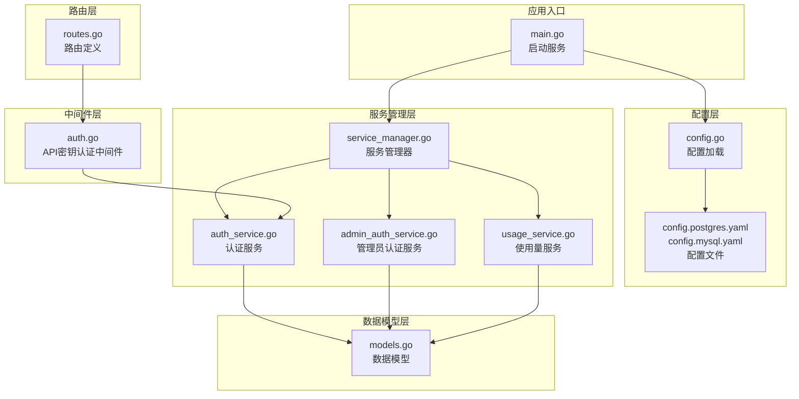
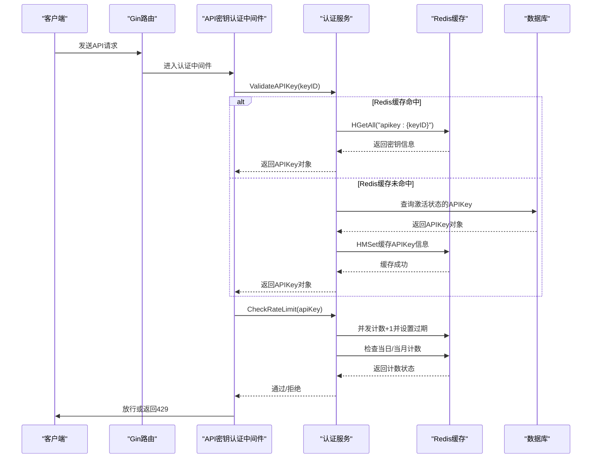
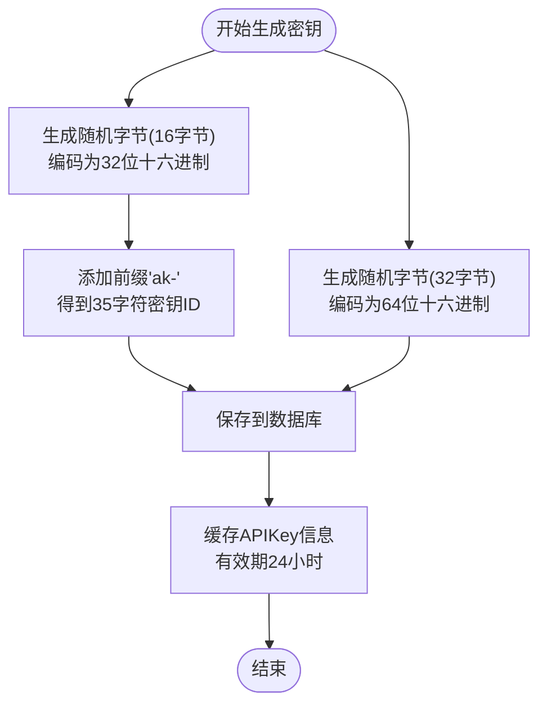
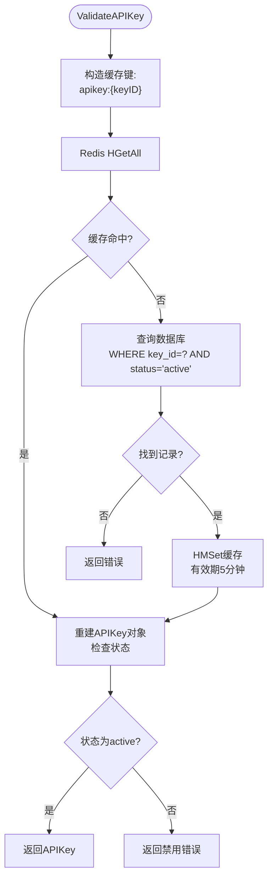
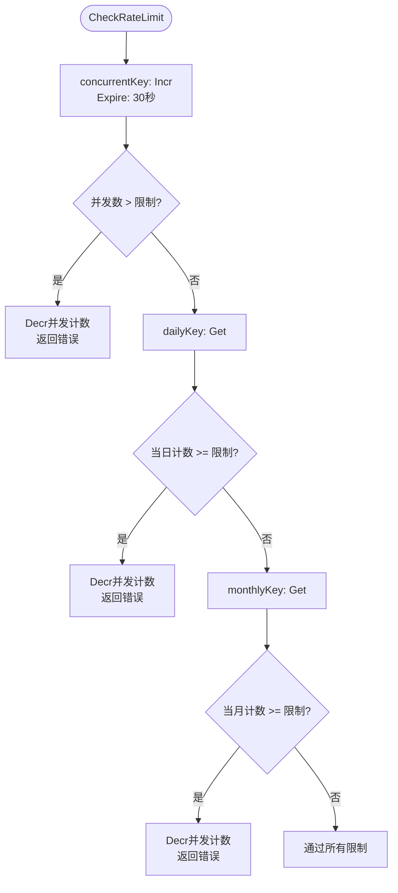
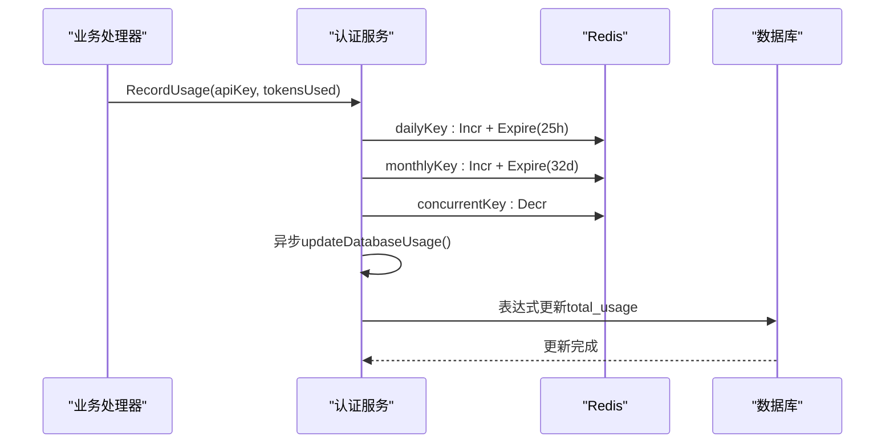
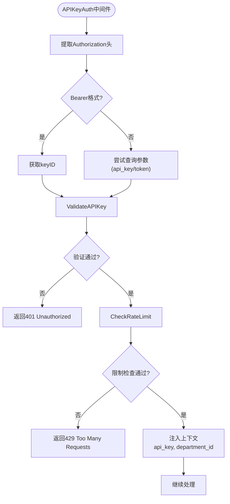
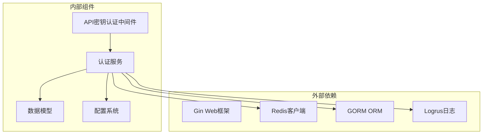

# API 密钥认证

<cite>
**本文档引用的文件**
- [auth_service.go](file://internal/services/auth_service.go)
- [auth.go](file://internal/api/middleware/auth.go)
- [routes.go](file://internal/api/routes.go)
- [models.go](file://internal/models/models.go)
- [config.go](file://internal/config/config.go)
- [service_manager.go](file://internal/services/service_manager.go)
- [main.go](file://cmd/main.go)
- [config.postgres.yaml](file://configs/config.postgres.yaml)
- [config.mysql.yaml](file://configs/config.mysql.yaml)
- [usage_service.go](file://internal/services/usage_service.go)
</cite>

## 目录
1. [简介](#简介)
2. [项目结构](#项目结构)
3. [核心组件](#核心组件)
4. [架构概览](#架构概览)
5. [详细组件分析](#详细组件分析)
6. [依赖分析](#依赖分析)
7. [性能考虑](#性能考虑)
8. [故障排除指南](#故障排除指南)
9. [结论](#结论)
10. [附录](#附录)

## 简介
本文档深入解析 Wolink-Core 的 API 密钥认证系统，涵盖密钥生成机制、验证流程、速率限制、使用量统计与缓存策略，以及密钥管理最佳实践。系统采用 Redis 缓存优先策略与数据库回退机制，结合异步更新实现高性能的认证与用量统计。

## 项目结构
Wolink-Core 的认证系统围绕以下关键模块组织：
- 服务层：认证服务、管理员认证服务、使用量服务
- 中间件层：API 密钥认证中间件
- 数据模型：APIKey、Department 等核心实体
- 配置层：数据库、Redis、安全等配置
- 路由层：API 路由定义与认证中间件挂载

**图表来源**
- [main.go:19-89](file://cmd/main.go#L19-L89)
- [config.go:96-124](file://internal/config/config.go#L96-L124)
- [service_manager.go:30-62](file://internal/services/service_manager.go#L30-L62)
- [auth_service.go:19-33](file://internal/services/auth_service.go#L19-L33)
- [auth.go:13-68](file://internal/api/middleware/auth.go#L13-L68)
- [routes.go:14-129](file://internal/api/routes.go#L14-L129)
- [models.go:20-43](file://internal/models/models.go#L20-L43)

**章节来源**
- [main.go:19-89](file://cmd/main.go#L19-L89)
- [config.go:96-124](file://internal/config/config.go#L96-L124)
- [service_manager.go:30-62](file://internal/services/service_manager.go#L30-L62)
- [routes.go:14-129](file://internal/api/routes.go#L14-L129)

## 核心组件
- 认证服务（AuthService）：负责 API 密钥验证、生成、速率限制检查与使用量记录
- API 密钥认证中间件：在路由层拦截请求，执行密钥验证与速率限制
- 数据模型（APIKey、Department）：定义密钥、部门及使用限制字段
- 配置系统：提供数据库、Redis、安全等配置项
- 使用量服务：提供使用统计查询能力

**章节来源**
- [auth_service.go:19-33](file://internal/services/auth_service.go#L19-L33)
- [auth.go:13-68](file://internal/api/middleware/auth.go#L13-L68)
- [models.go:20-43](file://internal/models/models.go#L20-L43)
- [config.go:10-18](file://internal/config/config.go#L10-L18)
- [usage_service.go:11-23](file://internal/services/usage_service.go#L11-L23)

## 架构概览
认证系统采用分层架构，请求通过中间件进入认证服务，认证服务优先查询 Redis 缓存，未命中则回退到数据库。速率限制在内存中通过 Redis 完成，使用量统计采用异步更新策略。

**图表来源**
- [auth.go:13-68](file://internal/api/middleware/auth.go#L13-L68)
- [auth_service.go:35-85](file://internal/services/auth_service.go#L35-L85)
- [auth_service.go:87-124](file://internal/services/auth_service.go#L87-L124)

## 详细组件分析

### API 密钥生成机制
系统支持两种密钥生成方式：
- 自动生成：服务端生成密钥ID和密钥Secret
- 管理员创建：通过管理接口创建新的API密钥

密钥生成算法：
- 密钥ID：使用随机字节生成，长度为35字符，格式为"ak-" + 32位十六进制字符串
- 密钥Secret：使用随机字节生成，长度为64字符，为32字节十六进制编码

**图表来源**
- [auth_service.go:151-179](file://internal/services/auth_service.go#L151-L179)
- [auth_service.go:209-219](file://internal/services/auth_service.go#L209-L219)

**章节来源**
- [auth_service.go:151-179](file://internal/services/auth_service.go#L151-L179)
- [auth_service.go:209-219](file://internal/services/auth_service.go#L209-L219)

### 密钥验证流程
验证流程采用 Redis 缓存优先策略：

1. **缓存查询**：使用 "apikey:{keyID}" 作为键，通过 HGetAll 获取完整密钥信息
2. **缓存命中**：从缓存字段重建 APIKey 对象，检查状态是否为 "active"
3. **缓存未命中**：查询数据库中状态为 "active" 的 APIKey
4. **缓存回填**：将数据库查询结果写入 Redis，设置5分钟有效期
5. **状态检查**：确保密钥状态有效后返回

**图表来源**
- [auth_service.go:35-85](file://internal/services/auth_service.go#L35-L85)

**章节来源**
- [auth_service.go:35-85](file://internal/services/auth_service.go#L35-L85)

### 速率限制系统
系统实现三层速率限制保护：

1. **并发限制**：
   - 键格式：concurrent:{apiKeyID}
   - 操作：Incr + Expire(30秒)
   - 超限时：Decr 回滚并返回错误

2. **每日限制**：
   - 键格式：daily:{apiKeyID}:{YYYY-MM-DD}
   - 操作：Get + 比较 + Incr + Expire(25小时)

3. **月度限制**：
   - 键格式：monthly:{apiKeyID}:{YYYY-MM}
   - 操作：Get + 比较 + Incr + Expire(32天)

**图表来源**
- [auth_service.go:87-124](file://internal/services/auth_service.go#L87-L124)

**章节来源**
- [auth_service.go:87-124](file://internal/services/auth_service.go#L87-L124)

### 使用量统计与缓存策略
使用量统计采用异步更新机制：

1. **实时统计**：每次请求结束后异步更新 Redis 计数器
2. **数据库同步**：使用表达式更新数据库中的 total_usage 字段
3. **缓存策略**：
   - 日计数器：有效期25小时，避免跨天边界问题
   - 月计数器：有效期32天，确保跨月统计准确性
   - 并发计数器：有效期30秒，精确控制并发

**图表来源**
- [auth_service.go:126-149](file://internal/services/auth_service.go#L126-L149)
- [auth_service.go:202-207](file://internal/services/auth_service.go#L202-L207)

**章节来源**
- [auth_service.go:126-149](file://internal/services/auth_service.go#L126-L149)
- [auth_service.go:202-207](file://internal/services/auth_service.go#L202-L207)

### API 密钥认证中间件
认证中间件负责：
1. **凭证提取**：支持 Authorization Bearer 和 Query 参数两种方式
2. **密钥验证**：调用认证服务验证 API Key
3. **速率限制**：执行并发、每日、月度限制检查
4. **上下文注入**：将 API Key 和部门信息注入到请求上下文

**图表来源**
- [auth.go:13-68](file://internal/api/middleware/auth.go#L13-L68)

**章节来源**
- [auth.go:13-68](file://internal/api/middleware/auth.go#L13-L68)

## 依赖分析
认证系统的关键依赖关系如下：

**图表来源**
- [auth_service.go:3-17](file://internal/services/auth_service.go#L3-L17)
- [auth.go:3-11](file://internal/api/middleware/auth.go#L3-L11)

**章节来源**
- [auth_service.go:3-17](file://internal/services/auth_service.go#L3-L17)
- [auth.go:3-11](file://internal/api/middleware/auth.go#L3-L11)

## 性能考虑
- **缓存策略**：Redis 缓存 API Key 信息，减少数据库压力
- **异步更新**：使用 goroutine 异步更新使用量，避免阻塞主请求路径
- **原子操作**：Redis Incr 操作保证计数准确性
- **连接池**：配置合理的数据库和 Redis 连接池参数
- **过期策略**：智能设置键过期时间，平衡准确性和资源消耗

## 故障排除指南
常见问题及解决方案：

1. **认证失败**
   - 检查 Authorization 头格式是否正确
   - 验证 API Key 是否处于激活状态
   - 确认 Redis 连接是否正常

2. **速率限制错误**
   - 检查并发限制配置是否合理
   - 验证 Redis 中计数器是否正确递增/递减
   - 确认过期时间设置是否正确

3. **使用量统计异常**
   - 检查异步更新 goroutine 是否正常运行
   - 验证数据库连接和表结构
   - 确认表达式更新语法正确

**章节来源**
- [auth.go:35-60](file://internal/api/middleware/auth.go#L35-L60)
- [auth_service.go:87-124](file://internal/services/auth_service.go#L87-L124)

## 结论
Wolink-Core 的 API 密钥认证系统通过 Redis 缓存优先策略、三层速率限制和异步使用量统计，实现了高性能、可扩展的认证机制。系统设计充分考虑了生产环境的需求，提供了完善的监控和故障排除能力。

## 附录

### 配置选项
系统支持的配置项包括：

| 分类 | 选项 | 类型 | 默认值 | 说明 |
|------|------|------|--------|------|
| server | port | string | "8080" | 服务器端口 |
| server | mode | string | "debug" | 运行模式 |
| database | type | string | "mysql" | 数据库类型 |
| database | host | string | "localhost" | 数据库主机 |
| database | port | int | 3306/5432 | 数据库端口 |
| redis | host | string | "localhost" | Redis主机 |
| redis | port | int | 6379 | Redis端口 |
| security | jwt_secret | string | "your-secret-key" | JWT密钥 |

**章节来源**
- [config.go:49-82](file://internal/config/config.go#L49-L82)
- [config.postgres.yaml:1-35](file://configs/config.postgres.yaml#L1-L35)
- [config.mysql.yaml:1-37](file://configs/config.mysql.yaml#L1-L37)

### 数据模型定义
APIKey 核心字段说明：

| 字段名 | 类型 | 默认值 | 说明 |
|--------|------|--------|------|
| id | uint | - | 主键 |
| department_id | uint | - | 所属部门ID |
| key_id | string | - | 对外显示的密钥ID |
| key_secret | string | - | 实际密钥（不返回给前端） |
| name | string | - | 密钥名称 |
| status | string | "active" | 状态：active/disabled |
| daily_limit | int64 | 10000 | 每日调用限制 |
| monthly_limit | int64 | 300000 | 每月调用限制 |
| concurrent_limit | int | 10 | 并发限制 |
| daily_usage | int64 | 0 | 当日使用量 |
| monthly_usage | int64 | 0 | 当月使用量 |
| total_usage | int64 | 0 | 总使用量 |

**章节来源**
- [models.go:20-43](file://internal/models/models.go#L20-L43)