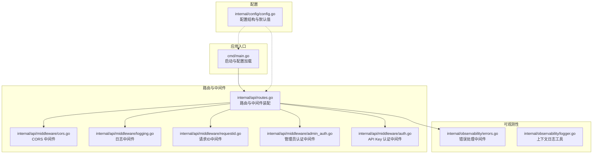
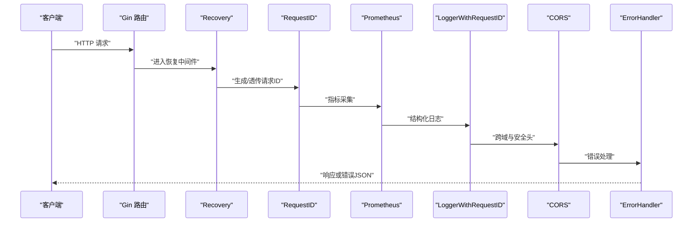
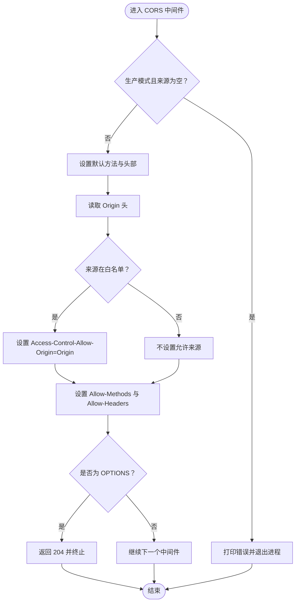
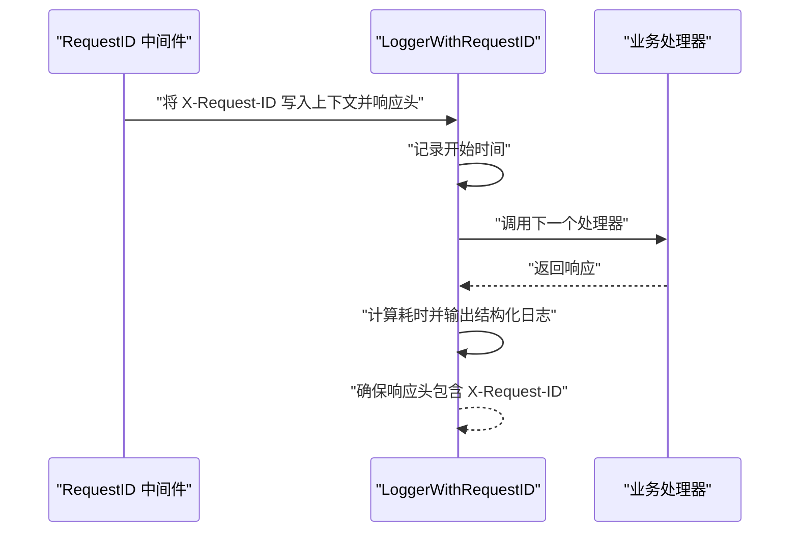
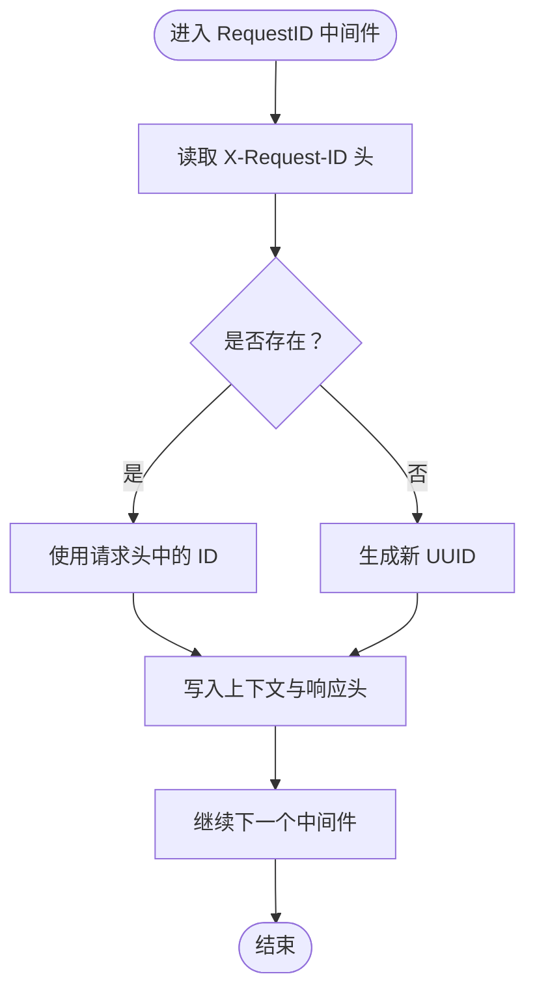
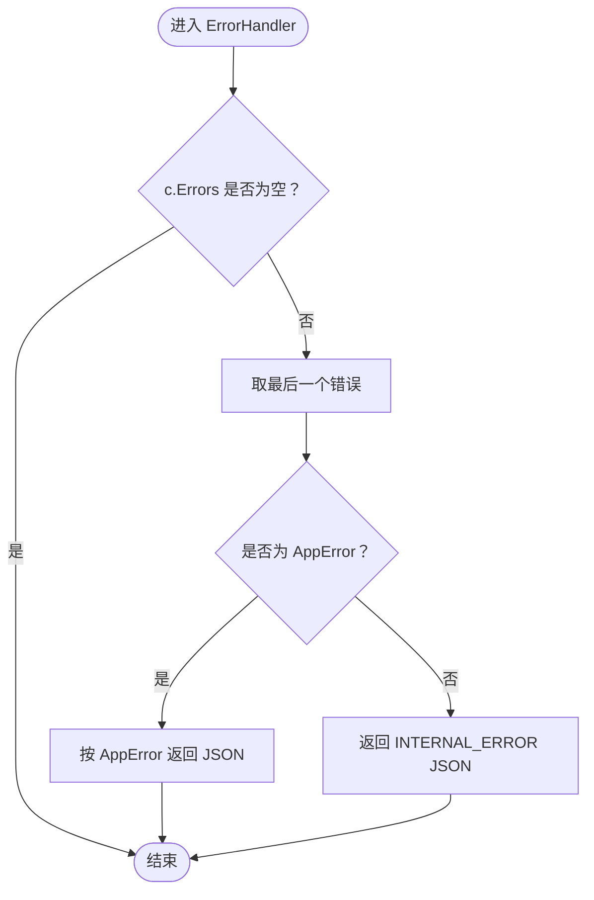
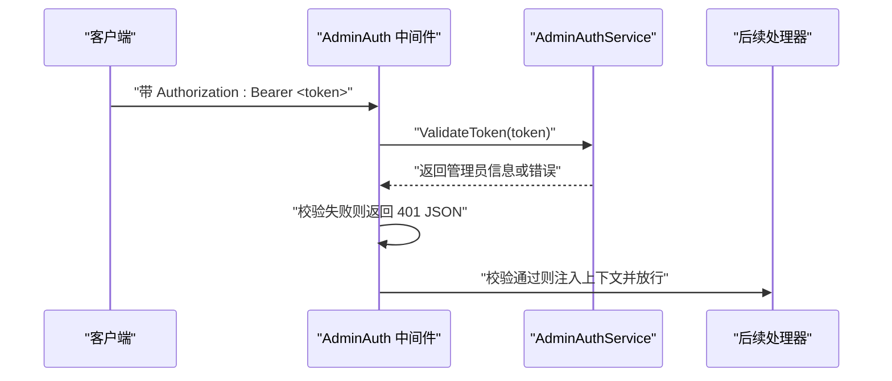
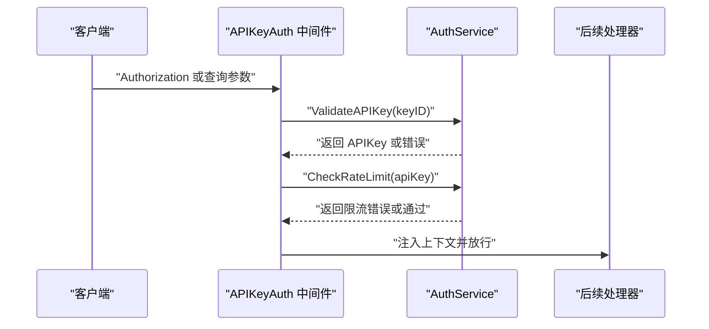
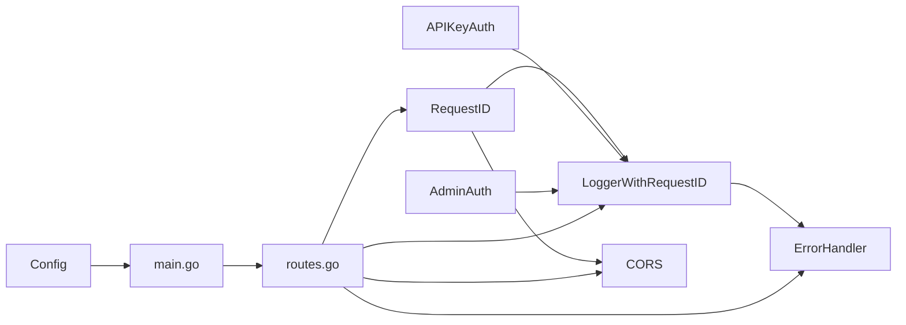

# 安全中间件

<cite>
**本文引用的文件**
- [cmd/main.go](file://cmd/main.go)
- [internal/api/routes.go](file://internal/api/routes.go)
- [internal/api/middleware/cors.go](file://internal/api/middleware/cors.go)
- [internal/api/middleware/logging.go](file://internal/api/middleware/logging.go)
- [internal/api/middleware/requestid.go](file://internal/api/middleware/requestid.go)
- [internal/api/middleware/admin_auth.go](file://internal/api/middleware/admin_auth.go)
- [internal/api/middleware/auth.go](file://internal/api/middleware/auth.go)
- [internal/observability/errors.go](file://internal/observability/errors.go)
- [internal/observability/logger.go](file://internal/observability/logger.go)
- [internal/config/config.go](file://internal/config/config.go)
- [internal/api/middleware/cors_test.go](file://internal/api/middleware/cors_test.go)
- [internal/api/middleware/logging_test.go](file://internal/api/middleware/logging_test.go)
- [internal/api/middleware/requestid_test.go](file://internal/api/middleware/requestid_test.go)
- [internal/services/auth_service.go](file://internal/services/auth_service.go)
- [internal/services/admin_auth_service.go](file://internal/services/admin_auth_service.go)
</cite>

## 目录
1. [简介](#简介)
2. [项目结构](#项目结构)
3. [核心组件](#核心组件)
4. [架构总览](#架构总览)
5. [详细组件分析](#详细组件分析)
6. [依赖分析](#依赖分析)
7. [性能考虑](#性能考虑)
8. [故障排除指南](#故障排除指南)
9. [结论](#结论)
10. [附录](#附录)

## 简介
本文件聚焦于 Wolink-Core 的安全中间件体系，涵盖以下方面：
- CORS 中间件：跨域策略、预检请求处理与安全头设置
- 日志中间件：请求日志记录、请求 ID 关联与日志格式化
- 请求 ID 中间件：唯一标识符生成、请求追踪与分布式追踪支持
- 错误处理中间件：异常捕获、错误响应格式化与调试信息控制
- 中间件配置最佳实践：性能优化、安全加固与监控集成
- 配置示例与故障排除指南

## 项目结构
安全中间件位于 internal/api/middleware 目录，并在路由层统一装配；错误处理与可观测性相关能力位于 internal/observability。

**图表来源**
- [cmd/main.go:19-89](file://cmd/main.go#L19-L89)
- [internal/api/routes.go:14-129](file://internal/api/routes.go#L14-L129)
- [internal/api/middleware/cors.go:20-69](file://internal/api/middleware/cors.go#L20-L69)
- [internal/api/middleware/logging.go:10-52](file://internal/api/middleware/logging.go#L10-L52)
- [internal/api/middleware/requestid.go:11-40](file://internal/api/middleware/requestid.go#L11-L40)
- [internal/api/middleware/admin_auth.go:14-122](file://internal/api/middleware/admin_auth.go#L14-L122)
- [internal/api/middleware/auth.go:13-98](file://internal/api/middleware/auth.go#L13-L98)
- [internal/observability/errors.go:103-142](file://internal/observability/errors.go#L103-L142)
- [internal/observability/logger.go:16-43](file://internal/observability/logger.go#L16-L43)
- [internal/config/config.go:96-184](file://internal/config/config.go#L96-L184)

**章节来源**
- [cmd/main.go:19-89](file://cmd/main.go#L19-L89)
- [internal/api/routes.go:14-129](file://internal/api/routes.go#L14-L129)
- [internal/config/config.go:96-184](file://internal/config/config.go#L96-L184)

## 核心组件
- CORS 中间件：基于配置允许来源、方法与头部，处理预检请求，生产模式强制显式白名单
- 日志中间件：结合请求 ID 输出结构化日志，包含时间戳、方法、路径、状态码、耗时与客户端 IP
- 请求 ID 中间件：生成或透传 X-Request-ID，贯穿请求生命周期
- 错误处理中间件：统一将 AppError 转换为标准 JSON 响应，非 AppError 回退为内部错误
- 管理员认证中间件：Bearer Token 校验与角色校验
- API Key 认证中间件：支持 Authorization 头与查询参数，速率限制检查

**章节来源**
- [internal/api/middleware/cors.go:11-69](file://internal/api/middleware/cors.go#L11-L69)
- [internal/api/middleware/logging.go:10-52](file://internal/api/middleware/logging.go#L10-L52)
- [internal/api/middleware/requestid.go:8-40](file://internal/api/middleware/requestid.go#L8-L40)
- [internal/observability/errors.go:103-142](file://internal/observability/errors.go#L103-L142)
- [internal/api/middleware/admin_auth.go:14-122](file://internal/api/middleware/admin_auth.go#L14-L122)
- [internal/api/middleware/auth.go:13-98](file://internal/api/middleware/auth.go#L13-L98)

## 架构总览
下图展示中间件在请求处理链中的位置与职责：

**图表来源**
- [internal/api/routes.go:17-29](file://internal/api/routes.go#L17-L29)
- [internal/api/middleware/requestid.go:21-39](file://internal/api/middleware/requestid.go#L21-L39)
- [internal/api/middleware/logging.go:22-51](file://internal/api/middleware/logging.go#L22-L51)
- [internal/api/middleware/cors.go:40-69](file://internal/api/middleware/cors.go#L40-L69)
- [internal/observability/errors.go:114-142](file://internal/observability/errors.go#L114-L142)

## 详细组件分析

### CORS 中间件
- 配置项
  - AllowedOrigins：允许的来源列表
  - AllowedMethods：允许的方法，默认 GET/POST/PUT/DELETE/OPTIONS
  - AllowedHeaders：允许的头部，默认 Origin/Content-Type/Authorization
  - AllowCredentials：是否允许携带凭据
  - IsProduction：生产模式开关
- 行为特性
  - 生产模式下若未配置 AllowedOrigins，直接退出进程，防止误配
  - Debug 模式且未配置来源时，允许所有来源（向后兼容）
  - 对每个请求设置 Access-Control-Allow-Methods 与 Access-Control-Allow-Headers
  - 对预检 OPTIONS 请求直接返回 204，不进入后续处理
- 安全要点
  - 不使用通配符来源，而是回写具体来源，降低 CSRF 风险
  - 显式声明允许的头部与方法，避免宽泛策略

**图表来源**
- [internal/api/middleware/cors.go:20-69](file://internal/api/middleware/cors.go#L20-L69)
- [internal/api/middleware/cors.go:71-87](file://internal/api/middleware/cors.go#L71-L87)

**章节来源**
- [internal/api/middleware/cors.go:11-69](file://internal/api/middleware/cors.go#L11-L69)
- [internal/api/middleware/cors_test.go:18-114](file://internal/api/middleware/cors_test.go#L18-L114)

### 日志中间件
- 功能
  - 从上下文提取 X-Request-ID，确保日志可追踪
  - 记录时间戳、方法、路径、状态码、耗时（毫秒）、客户端 IP
  - 在响应头中回写 X-Request-ID，便于客户端/下游关联
- 结构化输出
  - 使用 logrus JSON 格式，字段键名明确，便于日志聚合与检索

**图表来源**
- [internal/api/middleware/logging.go:22-51](file://internal/api/middleware/logging.go#L22-L51)
- [internal/api/middleware/requestid.go:21-39](file://internal/api/middleware/requestid.go#L21-L39)

**章节来源**
- [internal/api/middleware/logging.go:10-52](file://internal/api/middleware/logging.go#L10-L52)
- [internal/api/middleware/logging_test.go:18-79](file://internal/api/middleware/logging_test.go#L18-L79)

### 请求 ID 中间件
- 行为
  - 若请求头携带 X-Request-ID，则透传该 ID
  - 否则生成新 UUID，并写入上下文与响应头
- 分布式追踪
  - 通过 X-Request-ID 实现端到端请求追踪
  - 可与外部追踪系统（如 Jaeger/OpenTelemetry）集成，将该 ID 作为 trace_id

**图表来源**
- [internal/api/middleware/requestid.go:21-39](file://internal/api/middleware/requestid.go#L21-L39)

**章节来源**
- [internal/api/middleware/requestid.go:8-40](file://internal/api/middleware/requestid.go#L8-L40)
- [internal/api/middleware/requestid_test.go:15-73](file://internal/api/middleware/requestid_test.go#L15-L73)

### 错误处理中间件
- 统一错误格式
  - AppError：包含机器可读 code、人类可读 message、HTTP 状态码与可选 cause
  - 预定义常见错误类型：UNAUTHORIZED、FORBIDDEN、NOT_FOUND、BAD_REQUEST、RATE_LIMITED、INTERNAL_ERROR
- 处理流程
  - 捕获 c.Errors 中的最后一个错误
  - 若为 AppError，按其状态码与字段返回 JSON
  - 非 AppError 回退为 INTERNAL_ERROR

**图表来源**
- [internal/observability/errors.go:114-142](file://internal/observability/errors.go#L114-L142)
- [internal/observability/errors.go:10-80](file://internal/observability/errors.go#L10-L80)

**章节来源**
- [internal/observability/errors.go:103-142](file://internal/observability/errors.go#L103-L142)

### 管理员认证中间件
- 认证流程
  - 从 Authorization 头解析 Bearer Token
  - 调用 AdminAuthService.ValidateToken 校验有效性
  - 将管理员信息注入上下文，供后续处理器使用
- 角色校验
  - RequireRole 中间件根据角色列表进行授权判断

**图表来源**
- [internal/api/middleware/admin_auth.go:14-75](file://internal/api/middleware/admin_auth.go#L14-L75)
- [internal/services/admin_auth_service.go:94-133](file://internal/services/admin_auth_service.go#L94-L133)

**章节来源**
- [internal/api/middleware/admin_auth.go:14-122](file://internal/api/middleware/admin_auth.go#L14-L122)
- [internal/services/admin_auth_service.go:94-133](file://internal/services/admin_auth_service.go#L94-L133)

### API Key 认证中间件
- 认证来源
  - Authorization: Bearer <api_key>
  - 或查询参数 api_key/token
- 速率限制
  - 调用 AuthService.CheckRateLimit 进行并发、日限额与月限额检查
- 上下文注入
  - 将 API Key 与部门信息写入上下文

**图表来源**
- [internal/api/middleware/auth.go:13-68](file://internal/api/middleware/auth.go#L13-L68)
- [internal/services/auth_service.go:35-85](file://internal/services/auth_service.go#L35-L85)
- [internal/services/auth_service.go:87-124](file://internal/services/auth_service.go#L87-L124)

**章节来源**
- [internal/api/middleware/auth.go:13-98](file://internal/api/middleware/auth.go#L13-L98)
- [internal/services/auth_service.go:35-124](file://internal/services/auth_service.go#L35-L124)

## 依赖分析
- 中间件装配顺序
  - Recovery → RequestID → Prometheus → LoggerWithRequestID → CORS → ErrorHandler
- 关键依赖
  - RequestID 为 LoggerWithRequestID 提供请求 ID
  - LoggerWithRequestID 为 ErrorHandler 提供可追踪的日志上下文
  - CORS 与 ErrorHandler 与上游处理器解耦，仅影响响应头与错误格式
- 配置依赖
  - 服务器模式、端口、超时等在入口处加载
  - 安全相关配置（如 JWT Secret、敏感词替换规则）在配置模块中定义

**图表来源**
- [internal/api/routes.go:17-29](file://internal/api/routes.go#L17-L29)
- [cmd/main.go:19-89](file://cmd/main.go#L19-L89)
- [internal/config/config.go:96-184](file://internal/config/config.go#L96-L184)

**章节来源**
- [internal/api/routes.go:14-129](file://internal/api/routes.go#L14-L129)
- [cmd/main.go:19-89](file://cmd/main.go#L19-L89)
- [internal/config/config.go:96-184](file://internal/config/config.go#L96-L184)

## 性能考虑
- 中间件顺序优化
  - 将快速失败的中间件（如 CORS、API Key 认证）置于靠前位置，减少后续处理开销
  - Recovery 放在首位，避免异常穿透
- 日志与指标
  - LoggerWithRequestID 仅在必要时输出结构化日志，避免高频 JSON 序列化
  - Prometheus 中间件按需启用，避免对低流量接口造成额外负担
- CORS 预检缓存
  - 浏览器侧可通过 Access-Control-Max-Age 缓存预检结果，减少 OPTIONS 请求频率
- 速率限制
  - API Key 认证中间件内置并发与额度检查，建议配合 Redis 高可用部署

[本节为通用指导，无需列出具体文件来源]

## 故障排除指南
- CORS 生产模式崩溃
  - 现象：生产模式启动即退出
  - 原因：未配置 AllowedOrigins
  - 处理：在配置中添加 cors.allowed_origins 列表或切换到非生产模式
  - 参考测试：[cors_test.go:117-140](file://internal/api/middleware/cors_test.go#L117-L140)
- 来源被拒绝
  - 现象：浏览器报跨域错误
  - 原因：Origin 未在 AllowedOrigins 中
  - 处理：将前端域名加入白名单，确保协议、端口一致
  - 参考实现：[cors.go:71-87](file://internal/api/middleware/cors.go#L71-L87)
- 请求 ID 丢失
  - 现象：日志中无 request_id 字段
  - 原因：未正确安装 RequestID 中间件或响应头被覆盖
  - 处理：确认 RequestID 在 LoggerWithRequestID 之前注册，检查响应头是否被下游中间件清除
  - 参考测试：[logging_test.go:18-48](file://internal/api/middleware/logging_test.go#L18-L48)
- 错误响应不符合预期
  - 现象：返回 500 而非业务错误码
  - 原因：抛出了非 AppError 类型的错误
  - 处理：在业务层包装为 AppError，或在 ErrorHandler 前转换
  - 参考实现：[errors.go:114-142](file://internal/observability/errors.go#L114-L142)
- 管理员认证失败
  - 现象：401/403
  - 原因：Token 缺失、格式错误、校验失败或角色不足
  - 处理：核对 Authorization 头格式与签名密钥，确认用户角色
  - 参考实现：[admin_auth.go:14-75](file://internal/api/middleware/admin_auth.go#L14-L75)

**章节来源**
- [internal/api/middleware/cors_test.go:117-140](file://internal/api/middleware/cors_test.go#L117-L140)
- [internal/api/middleware/cors.go:71-87](file://internal/api/middleware/cors.go#L71-L87)
- [internal/api/middleware/logging_test.go:18-48](file://internal/api/middleware/logging_test.go#L18-L48)
- [internal/observability/errors.go:114-142](file://internal/observability/errors.go#L114-L142)
- [internal/api/middleware/admin_auth.go:14-75](file://internal/api/middleware/admin_auth.go#L14-L75)

## 结论
Wolink-Core 的安全中间件体系通过严格的 CORS 白名单、统一的错误响应与可追踪的日志机制，提供了清晰的安全边界与可观测性。建议在生产环境中：
- 明确配置 CORS 来源与头部
- 保持 ErrorHandler 常驻，确保错误格式一致
- 使用 RequestID 实现端到端追踪
- 结合速率限制与角色校验强化 API 安全

[本节为总结，无需列出具体文件来源]

## 附录

### 配置示例（片段）
- 服务器与基础设施
  - server.mode：debug/release
  - server.port：监听端口
  - infrastructure.read/write/idle/headers 超时
- 安全配置
  - security.jwt_secret：JWT 密钥
  - security.sensitive_patterns / replacement_patterns：敏感信息过滤规则
- CORS 配置
  - cors.allowed_origins：允许来源数组
  - cors.allowed_methods：允许方法数组
  - cors.allowed_headers：允许头部数组
  - cors.allow_credentials：是否允许凭据

**章节来源**
- [internal/config/config.go:96-184](file://internal/config/config.go#L96-L184)
- [internal/api/middleware/cors.go:11-18](file://internal/api/middleware/cors.go#L11-L18)