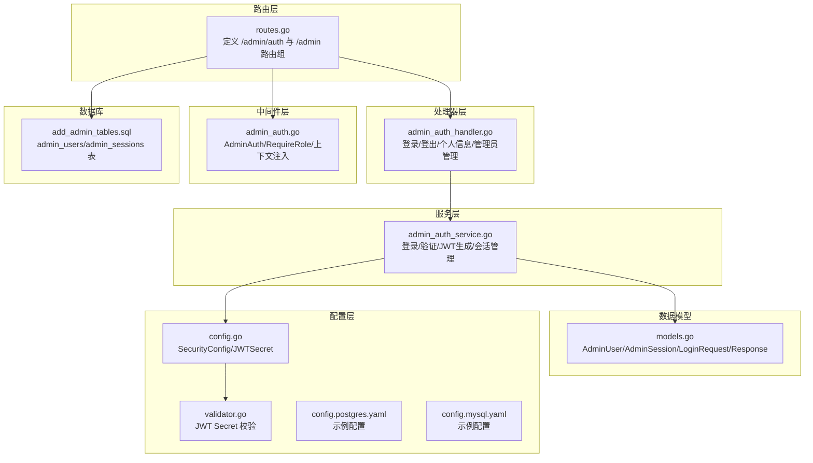
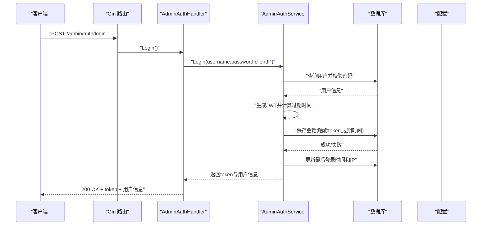
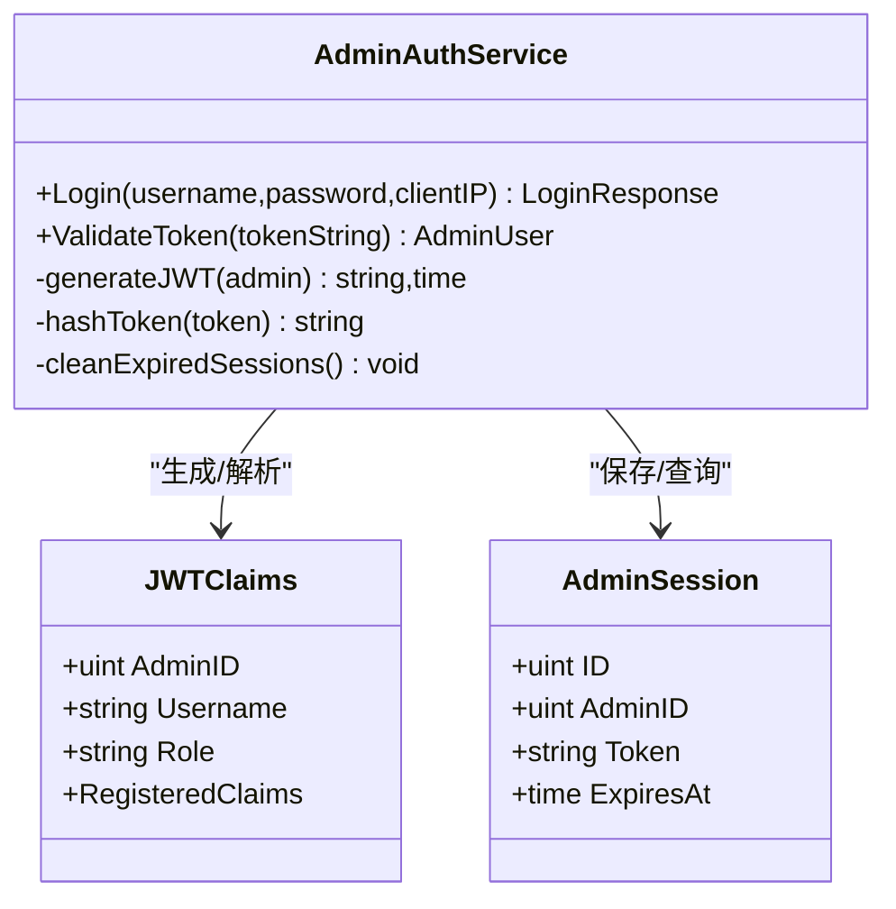
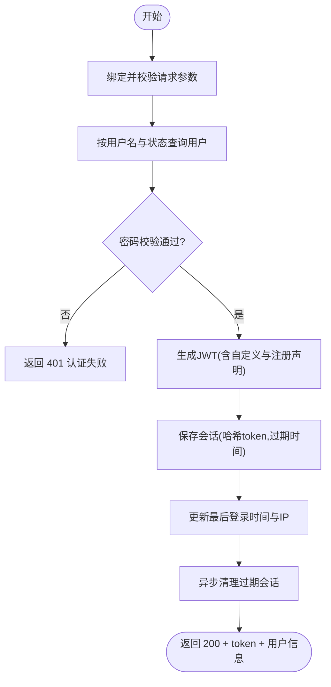
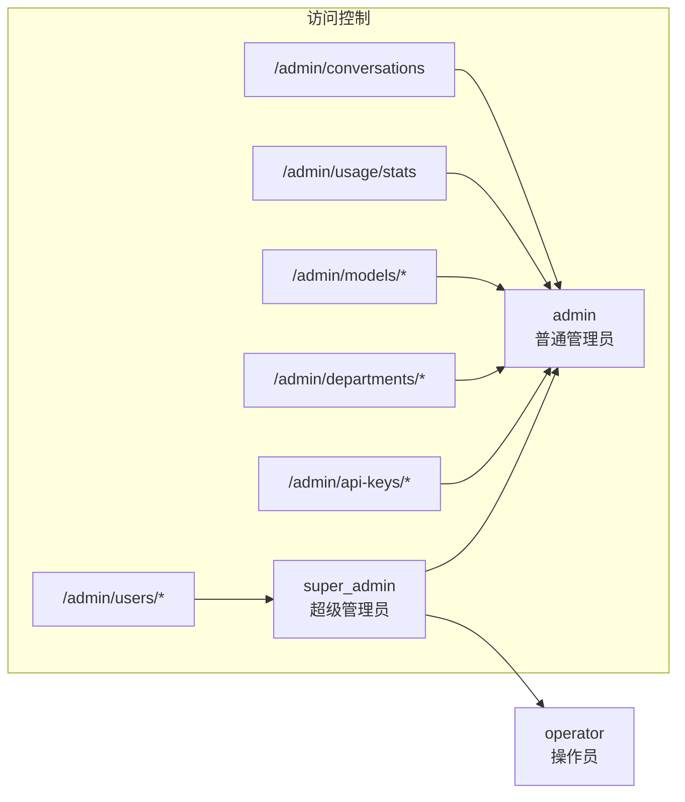
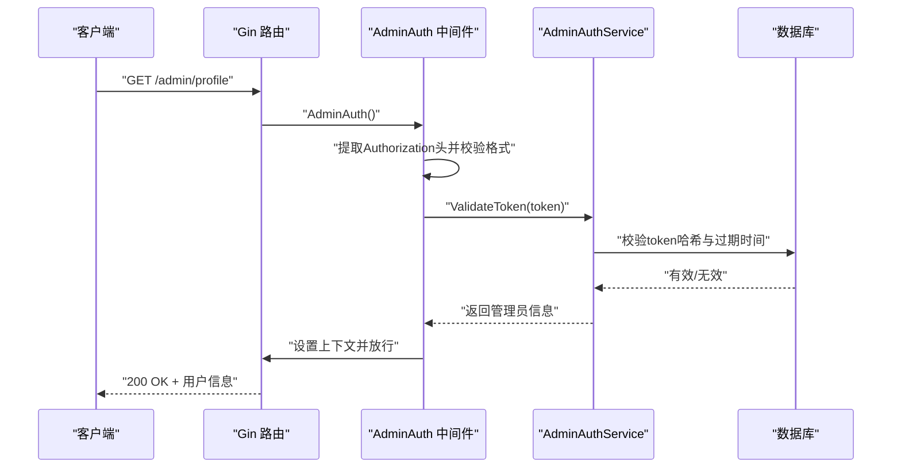
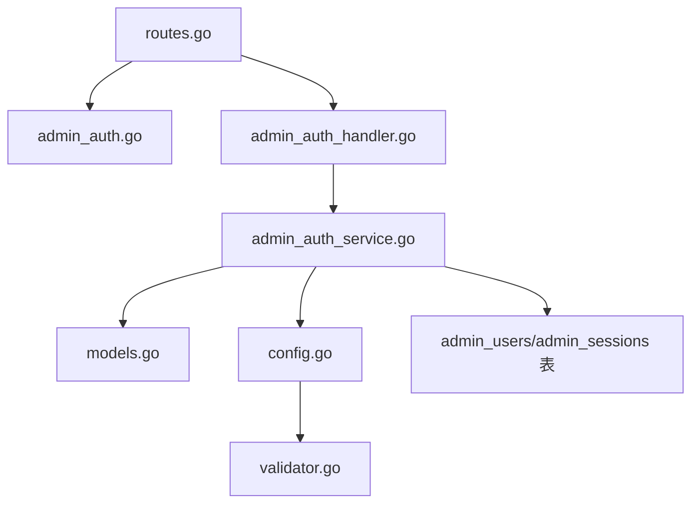

# 管理员认证

<cite>
**本文引用的文件**
- [internal/api/handlers/admin_auth_handler.go](file://internal/api/handlers/admin_auth_handler.go)
- [internal/services/admin_auth_service.go](file://internal/services/admin_auth_service.go)
- [internal/api/middleware/admin_auth.go](file://internal/api/middleware/admin_auth.go)
- [internal/models/models.go](file://internal/models/models.go)
- [internal/config/config.go](file://internal/config/config.go)
- [internal/config/validator.go](file://internal/config/validator.go)
- [internal/api/routes.go](file://internal/api/routes.go)
- [migrations/add_admin_tables.sql](file://migrations/add_admin_tables.sql)
- [configs/config.postgres.yaml](file://configs/config.postgres.yaml)
- [configs/config.mysql.yaml](file://configs/config.mysql.yaml)
</cite>

## 目录
1. [简介](#简介)
2. [项目结构](#项目结构)
3. [核心组件](#核心组件)
4. [架构总览](#架构总览)
5. [详细组件分析](#详细组件分析)
6. [依赖关系分析](#依赖关系分析)
7. [性能考虑](#性能考虑)
8. [故障排除指南](#故障排除指南)
9. [结论](#结论)
10. [附录](#附录)

## 简介
本文件针对 Wolink-Core 的管理员认证系统进行全面技术文档化，重点覆盖以下方面：
- JWT 令牌的生成与验证机制：令牌结构、签名算法、有效期管理
- 管理员登录流程：凭据验证、权限检查、令牌发放
- 权限分级体系：角色定义、权限矩阵、访问控制策略
- 中间件实现细节：请求拦截、令牌解析、权限验证
- 管理员账户管理最佳实践：密码策略、多因素认证、审计日志
- 配置示例与安全加固建议

## 项目结构
管理员认证相关代码分布在以下模块：
- 路由层：定义 /admin/auth 和 /admin 下的认证与授权路由
- 处理器层：实现登录、登出、个人信息、管理员账户管理等接口
- 服务层：实现登录验证、JWT 生成与校验、会话持久化、管理员 CRUD
- 中间件层：实现管理员认证与角色授权
- 数据模型：定义管理员用户、会话、登录请求/响应等结构
- 配置层：提供安全配置（JWT Secret）、配置校验与默认值
- 数据库迁移：初始化管理员用户表与会话表

**图表来源**
- [internal/api/routes.go:77-126](file://internal/api/routes.go#L77-L126)
- [internal/api/handlers/admin_auth_handler.go:26-319](file://internal/api/handlers/admin_auth_handler.go#L26-L319)
- [internal/services/admin_auth_service.go:19-248](file://internal/services/admin_auth_service.go#L19-L248)
- [internal/api/middleware/admin_auth.go:14-122](file://internal/api/middleware/admin_auth.go#L14-L122)
- [internal/models/models.go:133-188](file://internal/models/models.go#L133-L188)
- [internal/config/config.go:78-82](file://internal/config/config.go#L78-L82)
- [internal/config/validator.go:18-57](file://internal/config/validator.go#L18-L57)
- [configs/config.postgres.yaml:23-32](file://configs/config.postgres.yaml#L23-L32)
- [configs/config.mysql.yaml:25-34](file://configs/config.mysql.yaml#L25-L34)
- [migrations/add_admin_tables.sql:1-38](file://migrations/add_admin_tables.sql#L1-L38)

**章节来源**
- [internal/api/routes.go:14-129](file://internal/api/routes.go#L14-L129)
- [internal/api/handlers/admin_auth_handler.go:1-319](file://internal/api/handlers/admin_auth_handler.go#L1-L319)
- [internal/services/admin_auth_service.go:1-248](file://internal/services/admin_auth_service.go#L1-L248)
- [internal/api/middleware/admin_auth.go:1-122](file://internal/api/middleware/admin_auth.go#L1-L122)
- [internal/models/models.go:133-188](file://internal/models/models.go#L133-L188)
- [internal/config/config.go:78-82](file://internal/config/config.go#L78-L82)
- [internal/config/validator.go:18-57](file://internal/config/validator.go#L18-L57)
- [configs/config.postgres.yaml:23-32](file://configs/config.postgres.yaml#L23-L32)
- [configs/config.mysql.yaml:25-34](file://configs/config.mysql.yaml#L25-L34)
- [migrations/add_admin_tables.sql:1-38](file://migrations/add_admin_tables.sql#L1-L38)

## 核心组件
- 管理员认证处理器：负责登录、登出、获取个人信息、管理员账户管理等接口
- 管理员认证服务：负责用户凭据校验、JWT 生成与验证、会话持久化、管理员 CRUD
- 管理员认证中间件：负责从请求头提取 Bearer Token、调用服务验证、将用户上下文注入到请求
- 角色授权中间件：基于角色要求进行权限拦截
- 数据模型：AdminUser/AdminSession/LoginRequest/LoginResponse 等
- 安全配置与校验：JWT Secret 配置与安全校验逻辑
- 数据库迁移：初始化管理员与会话表结构

**章节来源**
- [internal/api/handlers/admin_auth_handler.go:14-319](file://internal/api/handlers/admin_auth_handler.go#L14-L319)
- [internal/services/admin_auth_service.go:19-248](file://internal/services/admin_auth_service.go#L19-L248)
- [internal/api/middleware/admin_auth.go:14-122](file://internal/api/middleware/admin_auth.go#L14-L122)
- [internal/models/models.go:133-188](file://internal/models/models.go#L133-L188)
- [internal/config/config.go:78-82](file://internal/config/config.go#L78-L82)
- [internal/config/validator.go:18-57](file://internal/config/validator.go#L18-L57)
- [migrations/add_admin_tables.sql:1-38](file://migrations/add_admin_tables.sql#L1-L38)

## 架构总览
管理员认证采用“路由 -> 处理器 -> 服务 -> 数据库/配置”的分层架构，并通过中间件实现统一的认证与授权。

**图表来源**
- [internal/api/routes.go:77-82](file://internal/api/routes.go#L77-L82)
- [internal/api/handlers/admin_auth_handler.go:26-68](file://internal/api/handlers/admin_auth_handler.go#L26-L68)
- [internal/services/admin_auth_service.go:40-92](file://internal/services/admin_auth_service.go#L40-L92)
- [internal/models/models.go:162-188](file://internal/models/models.go#L162-L188)

**章节来源**
- [internal/api/routes.go:77-82](file://internal/api/routes.go#L77-L82)
- [internal/api/handlers/admin_auth_handler.go:26-68](file://internal/api/handlers/admin_auth_handler.go#L26-L68)
- [internal/services/admin_auth_service.go:40-92](file://internal/services/admin_auth_service.go#L40-L92)
- [internal/models/models.go:162-188](file://internal/models/models.go#L162-L188)

## 详细组件分析

### JWT 令牌生成与验证机制
- 令牌结构
  - 自定义声明：包含管理员ID、用户名、角色
  - 注册声明：包含签发时间、过期时间、签发者
- 签名算法：使用 HMAC SHA-256（HS256）
- 有效期管理：默认 24 小时；服务端同时维护会话表，支持过期清理
- 令牌存储：服务端保存 token 的 SHA-256 哈希，便于快速校验与撤销

**图表来源**
- [internal/services/admin_auth_service.go:25-30](file://internal/services/admin_auth_service.go#L25-L30)
- [internal/services/admin_auth_service.go:181-203](file://internal/services/admin_auth_service.go#L181-L203)
- [internal/models/models.go:151-160](file://internal/models/models.go#L151-L160)

**章节来源**
- [internal/services/admin_auth_service.go:25-30](file://internal/services/admin_auth_service.go#L25-L30)
- [internal/services/admin_auth_service.go:94-133](file://internal/services/admin_auth_service.go#L94-L133)
- [internal/services/admin_auth_service.go:181-203](file://internal/services/admin_auth_service.go#L181-L203)
- [internal/models/models.go:151-160](file://internal/models/models.go#L151-L160)

### 管理员登录流程
- 参数绑定与校验：用户名、密码长度与格式
- 凭据验证：按激活状态查询用户，bcrypt 校验密码
- 令牌生成：HS256 签名，24 小时过期
- 会话持久化：保存 token 哈希与过期时间
- 登录信息更新：记录最后登录时间与 IP
- 异步清理过期会话

**图表来源**
- [internal/api/handlers/admin_auth_handler.go:26-68](file://internal/api/handlers/admin_auth_handler.go#L26-L68)
- [internal/services/admin_auth_service.go:40-92](file://internal/services/admin_auth_service.go#L40-L92)

**章节来源**
- [internal/api/handlers/admin_auth_handler.go:26-68](file://internal/api/handlers/admin_auth_handler.go#L26-L68)
- [internal/services/admin_auth_service.go:40-92](file://internal/services/admin_auth_service.go#L40-L92)

### 管理员权限分级系统
- 角色定义
  - super_admin：超级管理员，拥有最高权限
  - admin：普通管理员，具备基础管理能力
  - operator：操作员（数据库默认角色），权限最低
- 权限矩阵
  - 超级管理员可进行管理员账户的创建、查询、更新、删除
  - 普通管理员可进行 API Key、部门、模型配置、使用统计等管理
- 访问控制策略
  - /admin/auth/*：无需认证
  - /admin/*：需管理员认证
  - /admin/users/*：需超级管理员角色

**图表来源**
- [migrations/add_admin_tables.sql:8-8](file://migrations/add_admin_tables.sql#L8-L8)
- [internal/api/middleware/admin_auth.go:77-104](file://internal/api/middleware/admin_auth.go#L77-L104)
- [internal/api/routes.go:91-99](file://internal/api/routes.go#L91-L99)

**章节来源**
- [migrations/add_admin_tables.sql:8-8](file://migrations/add_admin_tables.sql#L8-L8)
- [internal/api/middleware/admin_auth.go:77-104](file://internal/api/middleware/admin_auth.go#L77-L104)
- [internal/api/routes.go:91-99](file://internal/api/routes.go#L91-L99)

### 中间件实现细节
- 请求拦截
  - 从 Authorization 头部提取 Bearer Token
  - 格式校验与空值检查
- 令牌解析与验证
  - HS256 签名方法校验
  - 使用配置中的 JWT Secret 进行签名验证
  - 校验会话表中的 token 哈希与过期时间
  - 校验用户状态为激活
- 权限验证
  - 将用户信息注入到请求上下文
  - 角色中间件根据所需角色进行放行或拒绝
- 错误处理
  - 缺少/格式错误/空 token：返回 401
  - 验证失败：返回 401
  - 无角色信息：返回 403
  - 无足够权限：返回 403

**图表来源**
- [internal/api/middleware/admin_auth.go:14-75](file://internal/api/middleware/admin_auth.go#L14-L75)
- [internal/services/admin_auth_service.go:94-133](file://internal/services/admin_auth_service.go#L94-L133)

**章节来源**
- [internal/api/middleware/admin_auth.go:14-75](file://internal/api/middleware/admin_auth.go#L14-L75)
- [internal/services/admin_auth_service.go:94-133](file://internal/services/admin_auth_service.go#L94-L133)

### 管理员账户管理最佳实践
- 密码策略
  - 使用 bcrypt 进行不可逆加密
  - 建议最小长度与复杂度策略（如包含大小写字母、数字、特殊字符）
- 多因素认证（MFA）
  - 建议引入基于时间的一次性验证码（TOTP）或短信/邮件验证码
  - 会话表可扩展为记录 MFA 状态与设备指纹
- 审计日志
  - 记录登录/登出、管理员 CRUD、关键配置变更
  - 包含时间戳、管理员ID、操作类型、资源标识、详情
- 会话管理
  - 启用定期清理过期会话
  - 支持主动登出（删除会话）
  - 建议实现单点登出与设备管理

**章节来源**
- [internal/services/admin_auth_service.go:141-179](file://internal/services/admin_auth_service.go#L141-L179)
- [internal/services/admin_auth_service.go:135-139](file://internal/services/admin_auth_service.go#L135-L139)
- [internal/services/admin_auth_service.go:211-219](file://internal/services/admin_auth_service.go#L211-L219)

## 依赖关系分析
- 路由依赖中间件：/admin/* 组使用 AdminAuth 中间件进行认证
- 处理器依赖服务：AdminAuthHandler 依赖 AdminAuthService
- 服务依赖配置：AdminAuthService 读取 SecurityConfig 中的 JWTSecret
- 服务依赖数据库：AdminAuthService 读写 AdminUser/AdminSession 表
- 配置依赖校验：Config.Validate() 对 JWTSecret 进行安全校验

**图表来源**
- [internal/api/routes.go:77-126](file://internal/api/routes.go#L77-L126)
- [internal/api/middleware/admin_auth.go:14-75](file://internal/api/middleware/admin_auth.go#L14-L75)
- [internal/api/handlers/admin_auth_handler.go:14-24](file://internal/api/handlers/admin_auth_handler.go#L14-L24)
- [internal/services/admin_auth_service.go:19-38](file://internal/services/admin_auth_service.go#L19-L38)
- [internal/models/models.go:133-188](file://internal/models/models.go#L133-L188)
- [internal/config/config.go:78-82](file://internal/config/config.go#L78-L82)
- [internal/config/validator.go:18-57](file://internal/config/validator.go#L18-L57)
- [migrations/add_admin_tables.sql:1-38](file://migrations/add_admin_tables.sql#L1-L38)

**章节来源**
- [internal/api/routes.go:77-126](file://internal/api/routes.go#L77-L126)
- [internal/api/middleware/admin_auth.go:14-75](file://internal/api/middleware/admin_auth.go#L14-L75)
- [internal/api/handlers/admin_auth_handler.go:14-24](file://internal/api/handlers/admin_auth_handler.go#L14-L24)
- [internal/services/admin_auth_service.go:19-38](file://internal/services/admin_auth_service.go#L19-L38)
- [internal/models/models.go:133-188](file://internal/models/models.go#L133-L188)
- [internal/config/config.go:78-82](file://internal/config/config.go#L78-L82)
- [internal/config/validator.go:18-57](file://internal/config/validator.go#L18-L57)
- [migrations/add_admin_tables.sql:1-38](file://migrations/add_admin_tables.sql#L1-L38)

## 性能考虑
- 令牌哈希与索引：会话表对 token 哈希与过期时间建立索引，提升校验与清理效率
- 异步清理：过期会话清理在后台 goroutine 执行，避免阻塞主流程
- 数据库连接池：通过基础设施配置调整最大连接数与生命周期
- 缓存策略：可考虑将活跃会话缓存至 Redis，减少数据库压力

[本节为通用性能讨论，不直接分析具体文件]

## 故障排除指南
- JWT Secret 相关
  - 症状：启动时报错提示 JWT Secret 不安全或缺失
  - 处理：移除默认值，使用环境变量配置，确保长度≥32字符，避免默认模式
- 登录失败
  - 症状：返回 401，错误信息提示用户名或密码错误
  - 处理：确认用户状态为激活，检查密码哈希是否正确
- 令牌无效
  - 症状：返回 401，提示 token 已过期或无效
  - 处理：检查服务端会话表中是否存在对应 token 哈希且未过期
- 权限不足
  - 症状：返回 403，提示权限不足
  - 处理：确认当前管理员角色是否满足所需角色要求

**章节来源**
- [internal/config/validator.go:18-57](file://internal/config/validator.go#L18-L57)
- [internal/services/admin_auth_service.go:40-54](file://internal/services/admin_auth_service.go#L40-L54)
- [internal/services/admin_auth_service.go:113-132](file://internal/services/admin_auth_service.go#L113-L132)
- [internal/api/middleware/admin_auth.go:77-104](file://internal/api/middleware/admin_auth.go#L77-L104)

## 结论
Wolink-Core 的管理员认证系统采用标准的 JWT 令牌机制，结合服务端会话表实现令牌校验与撤销，配合中间件实现统一的认证与授权。系统通过角色分级与路由分组实现细粒度的访问控制。建议在生产环境中强化安全配置（如移除默认 JWT Secret、启用更强的密钥、部署 MFA），并完善审计日志与会话管理，以进一步提升安全性与可观测性。

[本节为总结性内容，不直接分析具体文件]

## 附录

### 配置示例
- Postgres 示例配置
  - security.jwt_secret：建议使用随机生成的 32 字符以上密钥
  - database.type：postgres
- MySQL 示例配置
  - security.jwt_secret：建议使用随机生成的 32 字符以上密钥
  - database.type：mysql

**章节来源**
- [configs/config.postgres.yaml:23-32](file://configs/config.postgres.yaml#L23-L32)
- [configs/config.mysql.yaml:25-34](file://configs/config.mysql.yaml#L25-L34)

### 安全加固建议
- 移除默认 JWT Secret，默认值会导致可预测令牌
- 使用环境变量注入密钥，避免硬编码
- 启动时进行配置校验，确保密钥长度与安全性
- 建议启用 MFA（如 TOTP）与登录失败锁定
- 审计所有管理员关键操作，保留不可篡改日志
- 定期轮换密钥并清理历史密钥

**章节来源**
- [internal/config/validator.go:18-57](file://internal/config/validator.go#L18-L57)
- [internal/config/config.go:148-158](file://internal/config/config.go#L148-L158)