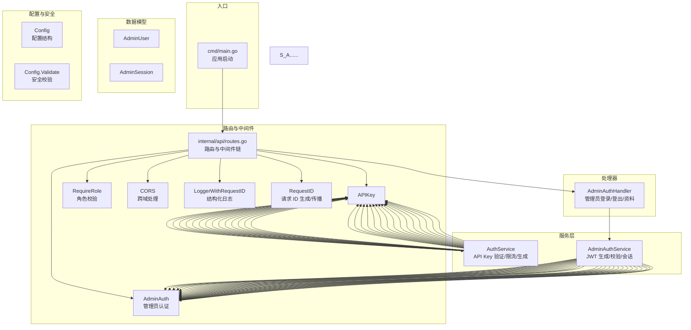
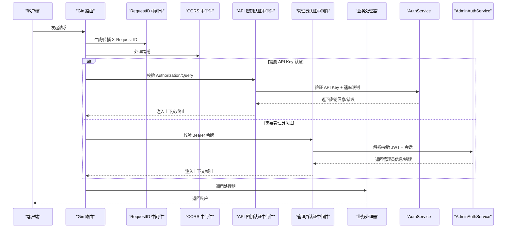
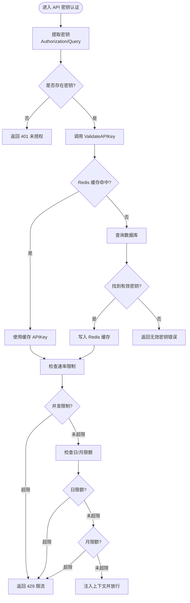
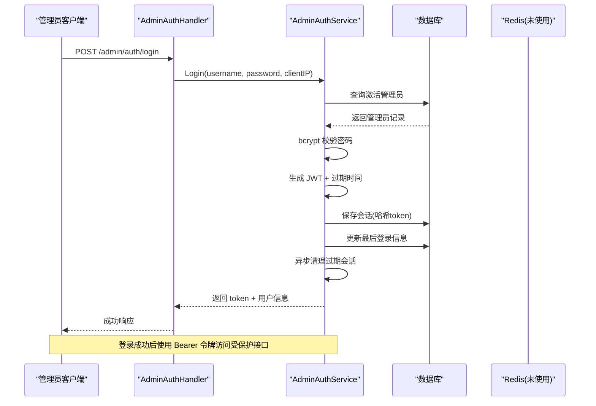
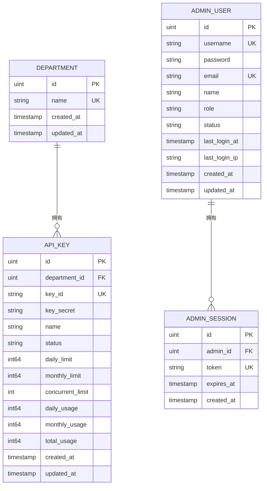
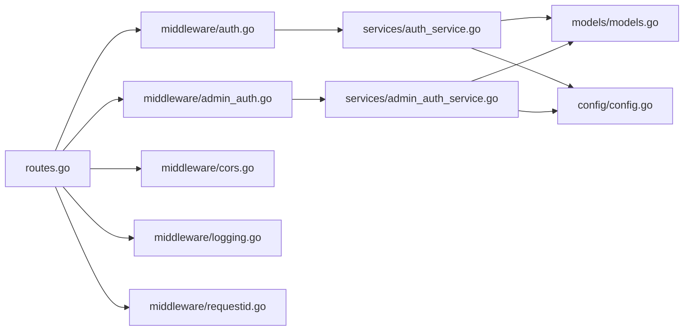

# 认证与授权系统

<cite>
**本文档引用的文件**
- [cmd/main.go](file://cmd/main.go)
- [internal/api/routes.go](file://internal/api/routes.go)
- [internal/api/middleware/auth.go](file://internal/api/middleware/auth.go)
- [internal/api/middleware/admin_auth.go](file://internal/api/middleware/admin_auth.go)
- [internal/api/middleware/cors.go](file://internal/api/middleware/cors.go)
- [internal/api/middleware/logging.go](file://internal/api/middleware/logging.go)
- [internal/api/middleware/requestid.go](file://internal/api/middleware/requestid.go)
- [internal/api/handlers/admin_auth_handler.go](file://internal/api/handlers/admin_auth_handler.go)
- [internal/services/auth_service.go](file://internal/services/auth_service.go)
- [internal/services/admin_auth_service.go](file://internal/services/admin_auth_service.go)
- [internal/models/models.go](file://internal/models/models.go)
- [internal/config/config.go](file://internal/config/config.go)
- [internal/config/validator.go](file://internal/config/validator.go)
</cite>

## 目录
1. [简介](#简介)
2. [项目结构](#项目结构)
3. [核心组件](#核心组件)
4. [架构总览](#架构总览)
5. [详细组件分析](#详细组件分析)
6. [依赖关系分析](#依赖关系分析)
7. [性能考虑](#性能考虑)
8. [故障排除指南](#故障排除指南)
9. [结论](#结论)
10. [附录](#附录)

## 简介
本文件针对 Wolink-Core 的认证与授权系统进行全面技术文档化，重点覆盖以下方面：
- API 密钥认证机制：密钥生成、验证流程、速率限制与权限控制策略
- 管理员 JWT 认证系统：令牌生成、会话管理、权限分级与中间件集成
- 中间件体系：CORS 处理、日志记录、请求 ID 追踪与错误处理
- 安全最佳实践：密钥管理、传输加密、防重放攻击、配置校验
- 配置示例与常见安全问题解决方案

## 项目结构
Wolink-Core 的认证与授权相关代码主要分布在以下模块：
- 路由层：定义 API 分组与中间件链路
- 中间件层：统一处理 CORS、日志、请求 ID、API Key 认证、管理员认证
- 服务层：封装业务逻辑，如 API Key 验证、速率限制、JWT 生成与校验
- 数据模型层：定义数据库表结构，包括 API Key、管理员、会话等
- 配置层：加载与校验运行时配置，特别是安全相关参数

**图表来源**
- [cmd/main.go:19-89](file://cmd/main.go#L19-L89)
- [internal/api/routes.go:14-129](file://internal/api/routes.go#L14-L129)

**章节来源**
- [cmd/main.go:19-89](file://cmd/main.go#L19-L89)
- [internal/api/routes.go:14-129](file://internal/api/routes.go#L14-L129)

## 核心组件
本节概述认证与授权系统的关键组件及其职责。

- API 密钥认证中间件
  - 从 Authorization 头或查询参数提取密钥
  - 调用服务层验证密钥有效性与状态
  - 执行速率限制检查（并发、日/月限额）
  - 将密钥信息注入上下文供后续处理器使用

- 管理员 JWT 认证中间件
  - 校验 Bearer 令牌格式与内容
  - 解析并验证 JWT 有效性
  - 校验会话是否存在于数据库且未过期
  - 将管理员信息注入上下文，支持角色分级

- 中间件体系
  - CORS：可配置允许列表，生产模式下严格校验
  - 日志：结构化输出，包含请求 ID、耗时、状态码等
  - 请求 ID：生成或传播 X-Request-ID，便于端到端追踪

- 服务层
  - AuthService：API Key 生成、缓存、验证、速率限制与用量统计
  - AdminAuthService：JWT 生成、校验、会话持久化与清理

- 数据模型
  - APIKey、AdminUser、AdminSession 等核心实体
  - 限流与用量字段（日/月限额、并发限制、累计用量）

**章节来源**
- [internal/api/middleware/auth.go:13-68](file://internal/api/middleware/auth.go#L13-L68)
- [internal/api/middleware/admin_auth.go:14-75](file://internal/api/middleware/admin_auth.go#L14-L75)
- [internal/api/middleware/cors.go:20-69](file://internal/api/middleware/cors.go#L20-L69)
- [internal/api/middleware/logging.go:22-51](file://internal/api/middleware/logging.go#L22-L51)
- [internal/api/middleware/requestid.go:21-39](file://internal/api/middleware/requestid.go#L21-L39)
- [internal/services/auth_service.go:19-85](file://internal/services/auth_service.go#L19-L85)
- [internal/services/admin_auth_service.go:19-133](file://internal/services/admin_auth_service.go#L19-L133)
- [internal/models/models.go:20-43](file://internal/models/models.go#L20-L43)
- [internal/models/models.go:133-160](file://internal/models/models.go#L133-L160)

## 架构总览
下图展示认证与授权在整体系统中的位置与交互：

**图表来源**
- [internal/api/routes.go:46-126](file://internal/api/routes.go#L46-L126)
- [internal/api/middleware/auth.go:13-68](file://internal/api/middleware/auth.go#L13-L68)
- [internal/api/middleware/admin_auth.go:14-75](file://internal/api/middleware/admin_auth.go#L14-L75)
- [internal/services/auth_service.go:35-85](file://internal/services/auth_service.go#L35-L85)
- [internal/services/admin_auth_service.go:94-133](file://internal/services/admin_auth_service.go#L94-L133)

## 详细组件分析

### API 密钥认证机制
- 密钥来源与提取
  - 优先从 Authorization 头提取 Bearer Token
  - 若为空，尝试从查询参数 api_key 或 token
  - 任一缺失则返回未授权错误

- 验证流程
  - 调用服务层 ValidateAPIKey
  - 先查 Redis 缓存，命中则直接返回；未命中查数据库并写入缓存
  - 校验状态为 active，否则返回无效密钥

- 速率限制策略
  - 并发限制：Redis 自增并发计数器，超过阈值回退并报错
  - 日/月限额：基于日期/月份键计数，超过阈值回退
  - 限流后释放并发计数，确保一致性

- 权限控制
  - 验证通过后将 APIKey 与部门 ID 写入上下文
  - 后续处理器可据此进行资源隔离与审计

**图表来源**
- [internal/api/middleware/auth.go:13-68](file://internal/api/middleware/auth.go#L13-L68)
- [internal/services/auth_service.go:35-124](file://internal/services/auth_service.go#L35-L124)

**章节来源**
- [internal/api/middleware/auth.go:13-68](file://internal/api/middleware/auth.go#L13-L68)
- [internal/services/auth_service.go:35-124](file://internal/services/auth_service.go#L35-L124)

### 管理员 JWT 认证系统
- 登录流程
  - 根据用户名查询激活状态的管理员
  - 使用 bcrypt 校验密码
  - 生成 JWT（含 admin_id、username、role、过期时间）
  - 将 token 哈希写入会话表，记录过期时间
  - 更新管理员最后登录信息
  - 清理过期会话

- 令牌验证
  - 使用 HS256 签名与配置中的 JWT Secret 解析
  - 校验 token 是否在会话表中且未过期
  - 查询管理员信息并返回

- 会话管理
  - 登出：删除对应会话记录
  - 清理：定期删除过期会话

- 角色分级与权限控制
  - 中间件注入管理员信息到上下文
  - RequireRole 中间件按角色白名单放行
  - 支持 super_admin 等角色的精细化权限

**图表来源**
- [internal/api/handlers/admin_auth_handler.go:26-68](file://internal/api/handlers/admin_auth_handler.go#L26-L68)
- [internal/services/admin_auth_service.go:40-92](file://internal/services/admin_auth_service.go#L40-L92)
- [internal/services/admin_auth_service.go:94-133](file://internal/services/admin_auth_service.go#L94-L133)

**章节来源**
- [internal/api/handlers/admin_auth_handler.go:26-68](file://internal/api/handlers/admin_auth_handler.go#L26-L68)
- [internal/services/admin_auth_service.go:40-133](file://internal/services/admin_auth_service.go#L40-L133)
- [internal/api/middleware/admin_auth.go:77-104](file://internal/api/middleware/admin_auth.go#L77-L104)

### 中间件实现细节
- CORS 处理
  - 生产模式强制要求配置允许的源列表，未配置则进程退出
  - 调试模式允许空列表以兼容开发
  - 严格设置允许的方法与头，预检请求返回 204

- 日志记录
  - 结构化输出，包含请求 ID、时间戳、方法、路径、状态码、耗时、客户端 IP
  - 通过 RequestID 中间件关联请求生命周期

- 请求 ID 追踪
  - 从请求头读取或生成 UUID
  - 存储在上下文并在响应头透传，便于端到端追踪

- 错误处理
  - 统一错误响应格式，配合可观测性中间件收集指标

**章节来源**
- [internal/api/middleware/cors.go:20-69](file://internal/api/middleware/cors.go#L20-L69)
- [internal/api/middleware/logging.go:22-51](file://internal/api/middleware/logging.go#L22-L51)
- [internal/api/middleware/requestid.go:21-39](file://internal/api/middleware/requestid.go#L21-L39)
- [internal/api/routes.go:17-29](file://internal/api/routes.go#L17-L29)

### 数据模型与权限边界
- APIKey
  - 包含部门关联、状态、日/月限额、并发限制、累计用量
  - 作为限流与计费的基础单元

- AdminUser/AdminSession
  - 管理员用户与会话表，支持按角色分级与会话生命周期管理

**图表来源**
- [internal/models/models.go:10-43](file://internal/models/models.go#L10-L43)
- [internal/models/models.go:133-160](file://internal/models/models.go#L133-L160)

**章节来源**
- [internal/models/models.go:10-43](file://internal/models/models.go#L10-L43)
- [internal/models/models.go:133-160](file://internal/models/models.go#L133-L160)

## 依赖关系分析
- 路由层依赖中间件与处理器，形成清晰的职责分离
- 中间件层依赖服务层，服务层依赖数据模型与外部存储（Redis/DB）
- 配置层贯穿全局，提供安全参数与基础设施参数

**图表来源**
- [internal/api/routes.go:14-129](file://internal/api/routes.go#L14-L129)
- [internal/api/middleware/auth.go:13-68](file://internal/api/middleware/auth.go#L13-L68)
- [internal/api/middleware/admin_auth.go:14-75](file://internal/api/middleware/admin_auth.go#L14-L75)
- [internal/services/auth_service.go:19-33](file://internal/services/auth_service.go#L19-L33)
- [internal/services/admin_auth_service.go:19-38](file://internal/services/admin_auth_service.go#L19-L38)
- [internal/models/models.go:20-43](file://internal/models/models.go#L20-L43)
- [internal/config/config.go:10-82](file://internal/config/config.go#L10-L82)

**章节来源**
- [internal/api/routes.go:14-129](file://internal/api/routes.go#L14-L129)
- [internal/api/middleware/auth.go:13-68](file://internal/api/middleware/auth.go#L13-L68)
- [internal/api/middleware/admin_auth.go:14-75](file://internal/api/middleware/admin_auth.go#L14-L75)
- [internal/services/auth_service.go:19-33](file://internal/services/auth_service.go#L19-L33)
- [internal/services/admin_auth_service.go:19-38](file://internal/services/admin_auth_service.go#L19-L38)
- [internal/models/models.go:20-43](file://internal/models/models.go#L20-L43)
- [internal/config/config.go:10-82](file://internal/config/config.go#L10-L82)

## 性能考虑
- 缓存优化
  - API Key 验证优先走 Redis 缓存，减少数据库压力
  - 限流计数器使用原子操作与过期策略，避免热点竞争

- 异步统计
  - 用量统计采用 goroutine 异步更新，降低主流程延迟

- 连接池与超时
  - 配置层提供数据库与 Redis 连接池参数，建议结合实际负载调整

- 中间件顺序
  - Recovery → RequestID → Prometheus → Logger → CORS → ErrorHandler
  - 保证异常快速捕获与可观测性前置

**章节来源**
- [internal/services/auth_service.go:183-200](file://internal/services/auth_service.go#L183-L200)
- [internal/services/auth_service.go:127-149](file://internal/services/auth_service.go#L127-L149)
- [internal/config/config.go:21-47](file://internal/config/config.go#L21-L47)
- [internal/api/routes.go:17-29](file://internal/api/routes.go#L17-L29)

## 故障排除指南
- CORS 相关问题
  - 症状：浏览器跨域被拒绝
  - 排查：确认生产模式下已正确配置允许的源列表；调试模式允许空列表
  - 参考：[internal/api/middleware/cors.go:20-69](file://internal/api/middleware/cors.go#L20-L69)

- JWT 密钥问题
  - 症状：登录成功但后续接口 401
  - 排查：确认 JWT Secret 长度≥32 且非默认值；检查环境变量是否正确注入
  - 参考：[internal/config/validator.go:34-57](file://internal/config/validator.go#L34-L57)，[internal/config/config.go:148](file://internal/config/config.go#L148)

- API Key 无效或受限
  - 症状：401 无效密钥或 429 限流
  - 排查：确认密钥状态为 active；检查 Redis 缓存是否过期；核对日/月限额与并发限制
  - 参考：[internal/services/auth_service.go:35-85](file://internal/services/auth_service.go#L35-L85)，[internal/services/auth_service.go:87-124](file://internal/services/auth_service.go#L87-L124)

- 管理员权限不足
  - 症状：403 权限不足
  - 排查：确认当前管理员角色是否满足 RequireRole 白名单
  - 参考：[internal/api/middleware/admin_auth.go:77-104](file://internal/api/middleware/admin_auth.go#L77-L104)

**章节来源**
- [internal/api/middleware/cors.go:20-69](file://internal/api/middleware/cors.go#L20-L69)
- [internal/config/validator.go:34-57](file://internal/config/validator.go#L34-L57)
- [internal/config/config.go:148](file://internal/config/config.go#L148)
- [internal/services/auth_service.go:35-85](file://internal/services/auth_service.go#L35-L85)
- [internal/services/auth_service.go:87-124](file://internal/services/auth_service.go#L87-L124)
- [internal/api/middleware/admin_auth.go:77-104](file://internal/api/middleware/admin_auth.go#L77-L104)

## 结论
Wolink-Core 的认证与授权系统通过明确的中间件链路与服务层封装，实现了：
- 高效的 API Key 认证与限流
- 安全可控的管理员 JWT 认证与角色分级
- 可观测、可追踪的中间件体系
- 可配置的安全参数与 fail-fast 校验

建议在生产环境中：
- 严格配置 CORS 允许列表
- 使用强 JWT Secret 并通过环境变量注入
- 定期清理过期会话与缓存
- 结合监控与告警完善安全运营

## 附录
- 配置示例（关键安全参数）
  - security.jwt_secret：至少 32 字符，避免默认值
  - cors.allowed_origins：生产模式必填，调试模式可为空
  - infrastructure.read/write/idle/headers 超时：根据业务吞吐调整
  - database_pool/redis_pool：连接池大小与生命周期

- 安全最佳实践清单
  - 传输加密：强制 HTTPS，TLS 版本与套件合规
  - 防重放：引入 nonce/timestamp 机制（建议扩展）
  - 密钥轮换：定期更换 API Key 与 JWT Secret
  - 最小权限：管理员角色最小化授权，操作审计留痕
  - 输入校验：结合 go-playground/validator 进一步强化

**章节来源**
- [internal/config/config.go:78-82](file://internal/config/config.go#L78-L82)
- [internal/config/config.go:148](file://internal/config/config.go#L148)
- [internal/config/validator.go:34-57](file://internal/config/validator.go#L34-L57)