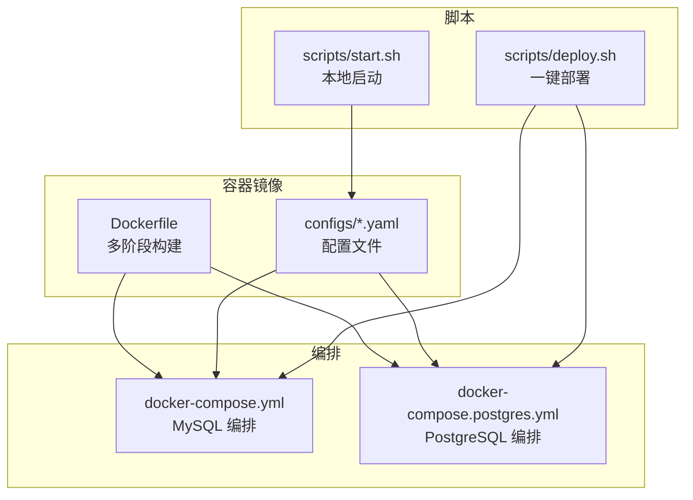
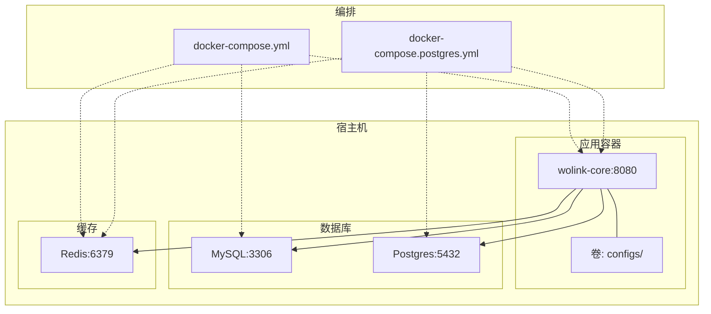
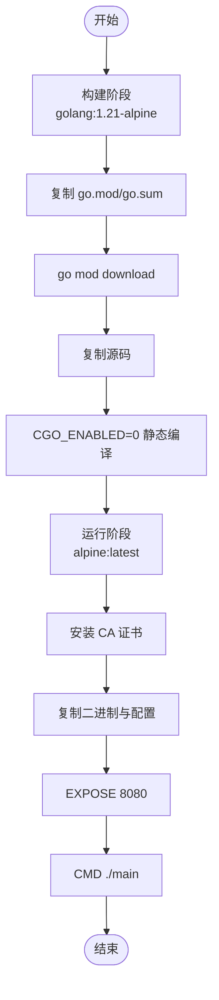
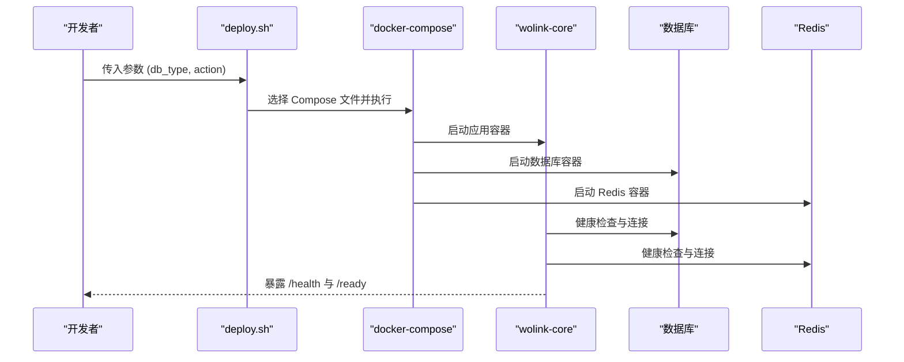
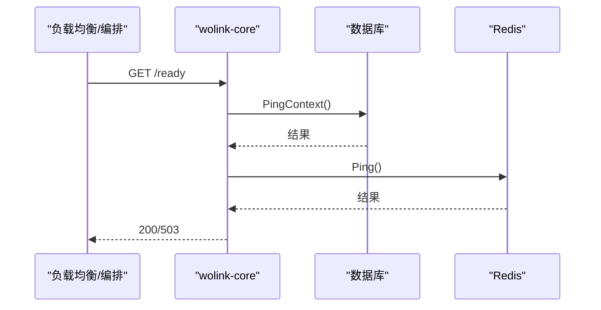
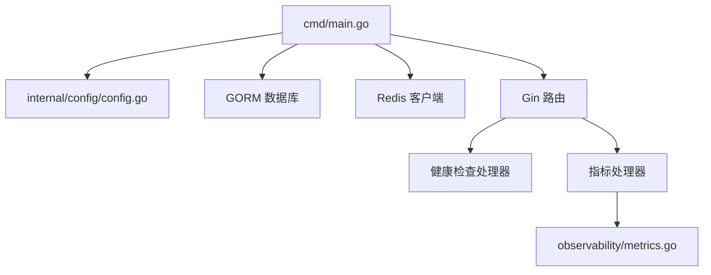

# Docker 容器化

<cite>
**本文引用的文件**
- [Dockerfile](file://Dockerfile)
- [docker-compose.yml](file://docker-compose.yml)
- [docker-compose.postgres.yml](file://docker-compose.postgres.yml)
- [scripts/deploy.sh](file://scripts/deploy.sh)
- [scripts/start.sh](file://scripts/start.sh)
- [configs/config.mysql.yaml](file://configs/config.mysql.yaml)
- [configs/config.postgres.yaml](file://configs/config.postgres.yaml)
- [configs/prometheus.yml](file://configs/prometheus.yml)
- [internal/config/config.go](file://internal/config/config.go)
- [internal/api/handlers/health_handler.go](file://internal/api/handlers/health_handler.go)
- [internal/api/handlers/metrics_handler.go](file://internal/api/handlers/metrics_handler.go)
- [internal/observability/metrics.go](file://internal/observability/metrics.go)
- [cmd/main.go](file://cmd/main.go)
- [go.mod](file://go.mod)
</cite>

## 目录
1. [简介](#简介)
2. [项目结构](#项目结构)
3. [核心组件](#核心组件)
4. [架构总览](#架构总览)
5. [详细组件分析](#详细组件分析)
6. [依赖关系分析](#依赖关系分析)
7. [性能考虑](#性能考虑)
8. [故障排查指南](#故障排查指南)
9. [结论](#结论)
10. [附录](#附录)

## 简介
本文件面向 Wolink-Core 的 Docker 容器化部署，系统性阐述以下内容：
- Dockerfile 多阶段构建流程：Go 编译环境、依赖下载与最终镜像优化
- 容器运行时配置：端口暴露、环境变量、卷挂载与健康检查
- 单机部署与多服务编排：基于 Docker Compose 的 MySQL 与 PostgreSQL 方案
- 安全与资源限制最佳实践：最小权限、只读根文件系统、资源配额与网络隔离
- 调试、日志与性能监控：容器内调试、日志查看与 Prometheus 指标采集

## 项目结构
Wolink-Core 的容器化相关文件集中在仓库根目录与 scripts 目录中，核心文件如下：
- Dockerfile：定义多阶段构建与运行时镜像
- docker-compose.yml / docker-compose.postgres.yml：单机编排（MySQL/PostgreSQL）
- scripts/deploy.sh：一键部署脚本，支持选择数据库类型与操作
- scripts/start.sh：本地开发启动脚本（非容器）
- 配置文件：MySQL/Postgres 两套默认配置与 Prometheus 抓取配置
- 可观测性：健康检查与指标暴露

图表来源
- [Dockerfile:1-28](file://Dockerfile#L1-L28)
- [docker-compose.yml:1-59](file://docker-compose.yml#L1-L59)
- [docker-compose.postgres.yml:1-55](file://docker-compose.postgres.yml#L1-L55)
- [scripts/deploy.sh:1-61](file://scripts/deploy.sh#L1-L61)
- [scripts/start.sh:1-52](file://scripts/start.sh#L1-L52)

章节来源
- [Dockerfile:1-28](file://Dockerfile#L1-L28)
- [docker-compose.yml:1-59](file://docker-compose.yml#L1-L59)
- [docker-compose.postgres.yml:1-55](file://docker-compose.postgres.yml#L1-L55)
- [scripts/deploy.sh:1-61](file://scripts/deploy.sh#L1-L61)
- [scripts/start.sh:1-52](file://scripts/start.sh#L1-L52)

## 核心组件
- 多阶段构建镜像
  - 构建阶段：使用官方 Go Alpine 基础镜像，复制模块与源码，下载依赖并静态编译二进制
  - 运行阶段：使用 Alpine 最小基础镜像，仅拷贝二进制与配置，暴露端口并以非特权方式运行
- 运行时配置
  - 端口：容器内监听 8080，映射至宿主机 8080
  - 环境变量：通过环境变量覆盖配置项，统一前缀为 AI_GATEWAY
  - 数据持久化：数据库与缓存使用命名卷
- 健康检查与指标
  - 健康检查：/health（存活）、/ready（就绪）；数据库与 Redis 双重检查
  - 指标：/metrics 暴露 Prometheus 指标，含请求总量、延迟直方图与并发请求数

章节来源
- [Dockerfile:1-28](file://Dockerfile#L1-L28)
- [internal/config/config.go:96-124](file://internal/config/config.go#L96-L124)
- [internal/api/handlers/health_handler.go:39-84](file://internal/api/handlers/health_handler.go#L39-L84)
- [internal/api/handlers/metrics_handler.go:18-22](file://internal/api/handlers/metrics_handler.go#L18-L22)
- [internal/observability/metrics.go:53-92](file://internal/observability/metrics.go#L53-L92)

## 架构总览
下图展示容器化部署的整体架构：应用容器与数据库、缓存服务之间的交互，以及健康检查与指标采集。

图表来源
- [docker-compose.yml:3-59](file://docker-compose.yml#L3-L59)
- [docker-compose.postgres.yml:3-55](file://docker-compose.postgres.yml#L3-L55)
- [Dockerfile:24-28](file://Dockerfile#L24-L28)

## 详细组件分析

### Dockerfile 多阶段构建
- 构建阶段
  - 基础镜像：golang:1.21-alpine
  - 工作目录：/app
  - 依赖安装：复制 go.mod/go.sum 并执行依赖下载
  - 源码复制与编译：复制全部源码并静态编译生成二进制
- 运行阶段
  - 基础镜像：alpine:latest
  - 证书：安装 CA 证书以支持 HTTPS
  - 文件复制：从构建阶段复制二进制与配置目录
  - 端口暴露：EXPOSE 8080
  - 入口命令：CMD ["./main"]

图表来源
- [Dockerfile:1-28](file://Dockerfile#L1-L28)

章节来源
- [Dockerfile:1-28](file://Dockerfile#L1-L28)

### 容器运行时配置
- 端口暴露与映射
  - 容器内监听 8080，Compose 中将宿主机 8080 映射到容器 8080
- 环境变量
  - 通过环境变量覆盖配置项，统一前缀为 AI_GATEWAY
  - 支持数据库类型切换（mysql/postgres）、主机、端口、用户、密码、库名、字符集/SSL 等
  - 支持 Redis 主机与端口
- 卷挂载
  - 数据库数据卷：MySQL 使用 mysql_data，Postgres 使用 postgres_data
  - 配置卷：容器内 configs 目录映射到镜像中的配置文件
- 健康检查
  - 数据库：MySQL 使用 mysqladmin ping，Postgres 使用 pg_isready
  - Redis：使用 redis-cli ping
- 重启策略
  - unless-stopped，确保异常退出后自动恢复

章节来源
- [docker-compose.yml:6-25](file://docker-compose.yml#L6-L25)
- [docker-compose.postgres.yml:6-23](file://docker-compose.postgres.yml#L6-L23)
- [internal/config/config.go:102-104](file://internal/config/config.go#L102-L104)

### 单机部署与多服务编排
- MySQL 单机编排
  - 服务：wolink-core、mysql、redis
  - 环境变量：数据库类型、主机、端口、用户、密码、库名、字符集等
  - 依赖：wolink-core 依赖 mysql 健康与 redis 启动
- PostgreSQL 单机编排
  - 服务：wolink-core、postgres、redis
  - 环境变量：数据库类型、主机、端口、用户、密码、库名、SSL 模式等
  - 依赖：wolink-core 依赖 postgres 健康与 redis 启动
- 一键部署脚本
  - 支持参数：数据库类型（mysql/postgres），操作（up/down/restart/logs/clean）
  - 自动选择对应 Compose 文件并执行

图表来源
- [scripts/deploy.sh:12-38](file://scripts/deploy.sh#L12-L38)
- [docker-compose.yml:4-25](file://docker-compose.yml#L4-L25)
- [docker-compose.postgres.yml:4-23](file://docker-compose.postgres.yml#L4-L23)

章节来源
- [docker-compose.yml:1-59](file://docker-compose.yml#L1-L59)
- [docker-compose.postgres.yml:1-55](file://docker-compose.postgres.yml#L1-L55)
- [scripts/deploy.sh:1-61](file://scripts/deploy.sh#L1-L61)

### 健康检查与就绪检查
- 存活检查（/health）
  - 返回服务进程存活状态，始终在进程运行时返回成功
- 就绪检查（/ready）
  - 在超时时间内对数据库与 Redis 进行连通性检查
  - 数据库：通过底层连接 Ping
  - Redis：通过 PING 命令
  - 返回 200 表示就绪，否则 503

图表来源
- [internal/api/handlers/health_handler.go:52-84](file://internal/api/handlers/health_handler.go#L52-L84)
- [internal/api/handlers/health_handler.go:86-119](file://internal/api/handlers/health_handler.go#L86-L119)

章节来源
- [internal/api/handlers/health_handler.go:39-119](file://internal/api/handlers/health_handler.go#L39-L119)

### 指标与监控
- 指标端点
  - /metrics 暴露 Prometheus 文本格式指标
- 指标内容
  - http_requests_total：按方法、路径、状态码统计
  - http_request_duration_seconds：按方法与路径的延迟直方图
  - http_requests_in_flight：按方法的并发请求数
- Prometheus 抓取配置
  - 抓取目标 localhost:8080，路径 /metrics，抓取间隔 5s

图表来源
- [internal/observability/metrics.go:12-51](file://internal/observability/metrics.go#L12-L51)
- [internal/observability/metrics.go:88-92](file://internal/observability/metrics.go#L88-L92)
- [configs/prometheus.yml:6-9](file://configs/prometheus.yml#L6-L9)

章节来源
- [internal/observability/metrics.go:53-92](file://internal/observability/metrics.go#L53-L92)
- [configs/prometheus.yml:1-10](file://configs/prometheus.yml#L1-L10)

### 配置加载与环境变量映射
- 配置来源优先级
  - 读取 YAML 配置文件（configs/config.*.yaml）
  - 未找到配置文件时使用默认值
  - 通过环境变量覆盖配置项，统一前缀为 AI_GATEWAY
- 关键配置项
  - 服务器端口与模式
  - 数据库类型、主机、端口、用户、密码、库名、字符集/SSL 模式
  - Redis 主机、端口、密码、库编号
  - 日志级别、安全密钥与敏感信息替换规则
  - 模型配置路径

章节来源
- [internal/config/config.go:96-124](file://internal/config/config.go#L96-L124)
- [internal/config/config.go:126-184](file://internal/config/config.go#L126-L184)
- [configs/config.mysql.yaml:1-37](file://configs/config.mysql.yaml#L1-L37)
- [configs/config.postgres.yaml:1-35](file://configs/config.postgres.yaml#L1-L35)

## 依赖关系分析
- 应用入口
  - main.go 负责加载配置、初始化数据库与 Redis、创建 HTTP 服务器并启动
- 配置加载
  - viper 读取 YAML 并通过环境变量覆盖，支持默认值与类型转换
- 依赖注入
  - 服务管理器接收数据库与 Redis 客户端，供业务层使用
- 外部依赖
  - Gin Web 框架、GORM ORM、Redis 客户端、Prometheus 客户端、Viper 配置

图表来源
- [cmd/main.go:19-89](file://cmd/main.go#L19-L89)
- [internal/config/config.go:96-124](file://internal/config/config.go#L96-L124)
- [internal/api/handlers/health_handler.go:24-37](file://internal/api/handlers/health_handler.go#L24-L37)
- [internal/api/handlers/metrics_handler.go:18-22](file://internal/api/handlers/metrics_handler.go#L18-L22)
- [internal/observability/metrics.go:88-92](file://internal/observability/metrics.go#L88-L92)

章节来源
- [cmd/main.go:19-89](file://cmd/main.go#L19-L89)
- [internal/config/config.go:96-124](file://internal/config/config.go#L96-L124)
- [go.mod:1-84](file://go.mod#L1-L84)

## 性能考虑
- 构建优化
  - 使用多阶段构建减少最终镜像体积
  - 静态编译二进制，避免运行时依赖
  - Alpine 基础镜像降低包体积与攻击面
- 运行时优化
  - 合理设置数据库与 Redis 连接池参数（最大连接数、空闲连接、生命周期）
  - 启用 Prometheus 指标，结合 Grafana/Prometheus 实时观测
  - 控制日志级别，避免生产环境产生过多 I/O
- 资源限制建议
  - 为容器设置 CPU/内存限制，防止资源争抢
  - 使用只读根文件系统，禁用不必要的特权
  - 通过网络策略限制出站访问，仅放行必需端口

## 故障排查指南
- 健康检查失败
  - 使用 curl 访问 /health 与 /ready，确认服务进程与依赖可用
  - 查看数据库与 Redis 健康检查是否通过
- 日志查看
  - 使用一键脚本查看应用日志：logs 子命令
  - 也可直接使用 docker-compose logs -f wolink-core
- 数据库初始化
  - MySQL 初始化 SQL 脚本位于 ./scripts/mysql-init.sql
  - 启动后检查数据库卷是否正确挂载
- 环境变量覆盖
  - 确认环境变量前缀为 AI_GATEWAY，且键名与配置项一致
- 指标采集
  - 确认 /metrics 可访问，Prometheus 抓取配置正确

章节来源
- [scripts/deploy.sh:47-49](file://scripts/deploy.sh#L47-L49)
- [docker-compose.yml:39-42](file://docker-compose.yml#L39-L42)
- [docker-compose.postgres.yml:35-38](file://docker-compose.postgres.yml#L35-L38)

## 结论
本文档系统梳理了 Wolink-Core 的 Docker 容器化部署方案，涵盖多阶段构建、运行时配置、编排方案、健康检查与指标监控，并提供了安全与性能方面的最佳实践。通过一键部署脚本与两套 Compose 文件，可快速完成单机与多服务编排部署，满足开发、测试与生产的多样化需求。

## 附录
- 端口与路径
  - 应用端口：8080
  - 指标路径：/metrics
  - 健康检查：/health、/ready
- 关键环境变量前缀：AI_GATEWAY
- 数据库类型：mysql、postgres
- 一键操作：up、down、restart、logs、clean